**EXCELENTÍSSIMO  SENHOR  JOSÉ  SARNEY,   
DIGNÍSSIMO PRESIDENTE DO SENADO FEDERAL**  
 **A COMISSÃO  DE  JURISTAS  PARA A ELABORAÇÃO  DE   
ANTEPROJETO  DE    CÓDIGO  PENAL,**  criada  pelo   
Requerimento  nº  756,  de  2011,  do    **SENADOR  PEDRO   
TAQUES**,  aditado  pelo  de  nº    1.034,  de  2011,  de  Vossa   
Excelência,  com aprovação pelos Senadores da República em 10   
de agosto de 2011,  tem a honra de apresentar o  
 ** RELATÓRIO FINAL **  
 que inclui  o histórico dos trabalhos, o anteprojeto de novo Código Penal e   
a exposição de motivos das propostas efetuadas.  
 1  

* * * * *

**Primeira Parte  
HISTÓRICO DOS TRABALHOS DA COMISSÃO**  
    
 Nos  termos  do  Requerimento  756/2011,  combinado  com  o  Requerimento   
 1.034/2011,  foram  nomeados  membros  da  Comissão  de  Juristas  o  Ministro  do   
Superior Tribunal  de Justiça GILSON  LANGARO DIPP, que  recebeu o encargo de   
presidi-la, a Ministra do Superior Tribunal  de Justiça  MARIA THEREZA  MOURA,   
os  advogados  ANTONIO  NABOR  AREIAS  BULHÕES,  do  Distrito  Federal,   
MARCELO  LEAL  LIMA  OLIVEIRA,  do  Distrito  Federal,  EMANUEL  MESSIAS   
OLIVEIRA CACHO, de Sergipe, TÉCIO LINS E  SILVA, do Rio de Janeiro, RENÉ   
ARIEL  DOTTI,  do  Paraná,  MARCELO  LEONARDO,  de  Minas  Gerais,  GAMIL   
FÖPPEL EL HIRECHE, da Bahia, o Desembargador do Tribunal de Justiça do Rio de   
Janeiro  JOSÉ  MUIÑOS  PIÑEIRO  FILHO,  o  Consultor  Legislativo  do  Senado   
Federal,  TIAGO  IVO  ODON,  a  Defensora  Pública  JULIANA  GARCIA   
BELLOQUE, de  São  Paulo,  o  Professor LUIZ  FLÁVIO  GOMES,  de  São Paulo, a   
Procuradora de Justiça LUIZA  NAGIB  ELUF, de São Paulo, o Procurador Regional   
da  República  LUIZ  CARLOS  DOS  SANTOS  GONÇALVES,  de  São  Paulo,  e  o   
Promotor  de  Justiça  MARCELO ANDRÉ  DE  AZEVEDO,  de  Goiás. Foi, a  seguir,   
incluído como membro da Comissão o Desembargador do Tribunal de Justiça de São   
Paulo MARCO ANTONIO MARQUES DA SILVA.  
    
 Logo após o início  dos trabalhos a  Ministra MARIA THEREZA ROCHA DE   
 ASSIS MOURA e o advogado RENÉ ARIEL DOTTI pediram, por razões pessoais,   
afastamento da Comissão.  
    
 Na  primeira  reunião  ocorrida  em  18  de  outubro  de  2011,  logo  após  a   
 solenidade  de  sua  instituição,  a  Comissão  de  Reforma  aprovou  seu  Regimento   
Interno  e  estabeleceu  plano  de  trabalho. Por indicação  de  seu  Presidente, GILSON   
DIPP, o Procurador Regional da República da Terceira Região LUIZ CARLOS DOS   
SANTOS GONÇALVES foi escolhido Relator Geral dos trabalhos.  
    
 A Comissão realizou, nos sete meses de sua atividade, vinte e quatro reuniões,   
 nas  salas próprias  da  Ala  das Comissões deste  Senado  Federal, conforme  atas que   
ficam  fazendo  parte  integrante  deste  relatório  final.  Foram  realizadas  audiências   
públicas em São Paulo, Brasília, Rio de Janeiro e Porto Alegre, bem como seminários   
em  Aracajú  e  Cuiabá,  que  contaram  com  contribuições  da  comunidade  jurídica  e   
acadêmica, além de significativa presença de representantes da  sociedade civil.  Em   
espaço  reservado  na  página  do  Senado  Federal  na  *internet*,  o  “Alô  Senado”,  se   
permitiu  a  toda  a  cidadania  brasileira  que  enviasse  sugestões  para  a  reforma  do   
 2  

* * * * *

Código Penal, que recebeu, ao todo, quase  três mil proposições. As sugestões foram   
organizadas  por  temas  e  foram  de  grande  utilidade,  além  de  indicar  as  maiores   
preocupações  da  sociedade  brasileira.  Entidades  comunitárias  e  representativas  da   
sociedade  fizeram  também  sugestões,  encaminhadas diretamente  à  Presidência  e  à   
Relatoria Geral dos Trabalhos.   
    
 As  reuniões  da  Comissão  foram  transmitidas  pela  TV  Senado  e  causaram   
 imensa  repercussão  nos  meios  de  comunicação  social,  tendo  merecido  cobertura  e   
editoriais em jornais como o Correio Braziliense, a Folha de São Paulo, o Estado de   
São  Paulo,  o  Globo,  o  Estado  de  Minas  e  o  Zero  Hora,  além  de  outros  grandes   
veículos da imprensa.  
    
 A  tarefa  da  Comissão,  prevista  no  Requerimento  756,  é  atualizar  o  Código   
 Penal, sendo *“imprescindível uma  releitura do sistema  penal à luz da Constituição,   
tendo  em  vista  as  novas  perspectivas  normativas  pós-88*.”  Da  mesma  maneira:  *“o   
atraso  do  Código  Penal  fez  com  que  inúmeras  leis  esparsas  fossem  criadas  para   
atender  a  necessidades  prementes.  Como  consequência,  tem-se  o  prejuízo  total  da   
sistematização  e  organização dos  tipos  penais  e da proporcionalidade  das  penas, o   
que  gera  grande  insegurança  jurídica,  ocasionada  por  interpretações   
desencontradas,  jurisprudências  contraditórias  e  penas  injustas  –  algumas  vezes   
muito baixas para crimes graves e outras muito altas para delitos menores”. *  
    
 A Comissão de Reforma aceitou, portanto, as seguintes tarefas: a) modernizar o   
 Código Penal; b) unificar a legislação penal esparsa; c) estudar a compatibilidade dos   
tipos penais hoje existentes com a Constituição de 1988, descriminalizando condutas   
e, se necessário, prevendo novas figuras típicas; d) tornar proporcionais as penas dos   
diversos crimes, a partir de sua gravidade relativa; e) buscar formas alternativas, não   
prisionais, de sanção penal.  
    
 Para  a  ordenação  dos  trabalhos, foram  criadas  três  subcomissões:  a  da  parte   
 geral,  a  da  parte  especial  e  a  da  legislação  extravagante.  A  primeira,  relatada   
inicialmente por RENÉ ARIEL DOTTI, foi  composta também por MARIA TEREZA   
ROCHA  DE  ASSIS  MOURA,  EMANUEL  CACHO,  JOSÉ  MUIÑOS  PIÑEIRO   
FILHO  e  MARCELO  ANDRÉ  DE  AZEVEDO.  A  Comissão  da  Parte  Especial,   
relatada  por  JULIANA  BELOQUE,  incluía  NABOR  BULHÕES,  TÉCIO  LINS  E   
SILVA,  LUIZ  FLÁVIO  GOMES,  MARCO  ANTONIO  MARQUES  DA  SILVA  e   
LUIZA  NAGIB  ELUF. A  subcomissão da  legislação  extravagante  foi  integrada  por   
TIAGO  IVO  ODON,  que  a  relatou,  e  GAMIL  FÖPPEL,  MARCELO  LEAL,   
MARCELO LEONARDO e LUIZ CARLOS DOS SANTOS GONÇALVES.  
    
 As propostas das subcomissões foram submetidas a intenso debate nas reuniões   
 gerais da Comissão, resultando na aprovação dos textos com inúmeras modificações,   
supressões  e  acréscimos,  muitas  vezes  por  voto  de  maioria.  Os  textos  afinal   
aprovados são  oferecidos em  anexo. Abaixo, segue a  explicação  do  modo como  se   
 3  

* * * * *

procedeu  à  codificação  e  a  justificativa  para  algumas  das  principais  inovações   
trazidas pelo anteprojeto. Ao final, tem-se o texto aprovado, na íntegra.  
   
   
 Este relatório  não  estaria  completo sem o reconhecimento e as homenagens a   
 pessoas  que,  ao  longo  das  atividades,  assídua  e  proficuamente,  ofereceram   
valiosíssima  colaboração  jurídica  para  o  bom  êxito  dos  trabalhos,  sendo  sempre   
lembrados  como  entusiastas  e  consultores  da  Comissão,  JOSÉ  CARLOS  NOBRE   
PORCIÚNCULA  NETO,  advogado,  e  de  PEDRO  PAULO  GUERRA  DE   
MEDEIROS, advogado.  
    
 Os  funcionários  da  Procuradoria  Regional  da  Terceira  Região,  lotados  no   
 gabinete  deste  relator,  ofereceram  também  competente  e  entusiasmado  trabalho  e   
assessoria.  É  o  caso  da  FABIA  BRITO  DAMIA,  TIAGO  VANONI,  SIMARA   
MIRANDA,  ROBSON  VALENÇA  e  dos  estagiários  DIEGO  YASSUDA   
RODRIGUES DE OLIVEIRA e BIANCA PAVAM LEITE DE OLIVEIRA.   
    
 Um  especial  agradecimento  desta  relatoria  vai  para  a  Juíza  Federal  SALISE   
 MONTEIRO  SANCHOTENE,  que  ao  longo  dos  sete  meses  de  trabalho  prestou   
diária  e  incansável  colaboração,  dando  mostras  de  eficientíssima  capacidade  de   
organização,  conhecimento  jurídico  soberbo,  ímpar  entusiasmo  e  acendrada   
preocupação com o bom êxito desta empreitada.   
     
 A servidora LORENA CAROLINE LYRA DE OLIVEIRA, lotada no Gabinete   
 do Ministro GILSON  DIPP foi  essencial  na realização das Audiências Públicas que   
notabiizaram esta Comissão.  
    
 A equipe técnica do Senado Federal  prestou serviço competente, contínuo e da   
 melhor qualidade  aos esforços da  Comissão  de  Reforma  Penal, merecendo  menção   
honrosa  REINILSON  PRADO e LEANDRO BUENO. A  eles a  Comissão  deve um   
ambiente e condições materiais e pessoais favoráveis a seu escopo.  
 4  

* * * * *

**Segunda Parte  
OS MODOS DA CODIFICAÇÃO**  
 *"O direito não é filho do céu. É um   
produto  cultural  e  histórico  da   
evolução humana."*  
 **Tobias Barreto.**  
    
 A  Comissão aceitou o projeto ambicioso de  trazer, para um renovado Código   
 Penal, toda a legislação extravagante que, nestes mais de setenta anos de vigência do   
diploma de 1940, foi  sendo  editada  em nosso país. Muitas vezes, estas leis esparsas   
chegavam a  trazer “mini partes gerais”, como dá  exemplo a Lei  9.605/93, a  Lei  dos   
Crimes contra o Meio Ambiente, com nada menos do que vinte  e  oito artigos sobre   
sua  própria  aplicação. Houve debate se  estas leis seriam transformadas em capítulos   
ou títulos do novo Código, pois muitas vezes traziam “microssistemas”, nos quais as   
normas penais complementavam  ou  eram complementadas por disposições cíveis e   
administrativas. Sem embargo, as mais de cento e vinte leis com dispositivos penais,   
fora  do  Código  Penal,  provaram  mal,  nestes  anos.  Elas  conduziram  a   
desproporcionalidades, com tipos protetivos dos mesmos bens jurídicos, apenas com   
um  ou  outro  qualificativo,  mas  penas  díspares.  O  caso  da  desobediência,  prevista   
tanto  no  Código  Penal,  como  no  Código  Eleitoral,  nos  crimes  contra  a  ordem   
tributária  e  na  legislação  sobre  o  meio-ambiente,  a  cada  vez  com  pena  diferente,   
serviu de suporte para a decisão de proceder a ampla recodificação.  
    
 Desta  decisão,  decorreu  outra:  a  de  criar  tipos  compreensivos,  capazes  de   
 oferecer  proteção  para  as  diversas  projeções  do  mesmo  bem  jurídico,  evitando-se   
tipificações prolixas e repetidas. É por esta razão que a proposta dos crimes contra a   
administração  pública  pretende  reunir  todas  as  lesões  a  este  bem  jurídico,   
independentemente de  qualificativos que se  possa dar a  esta administração (comum,   
tributária,  eleitoral,  etc).  O  estelionato  deixa  de  ter  as  seis  variações  que  hoje  o   
acompanham  (disposição  de  coisa  alheia  como  própria,  alienação  ou  oneração   
fraudulenta  de  coisa  própria,  defraudação  de  penhor,  fraude  na  entrega  de  coisa,   
fraude para  recebimento  de indenização ou  valor de  seguro e  fraude  no  pagamento   
por  meio  de  cheque  )  pois  cada  uma  delas  se  insere  na  equação  típica  da  figura   
essencial do crime (ardil + engano da vítima + prejuízo da vítima + vantagem ilícita).  
    
 Cada crime  previsto  na  parte especial  do Código Penal  atual  ou na  legislação   
 extravagante  foi  submetido,  portanto,  a  um  triplo  escrutínio:  i)  se  permanece   
necessário e atual; ii) se há figuras assemelhadas previstas noutra sede normativa; iii)   
se as penas indicadas são adequadas à gravidade relativa do delito.   
 5  

* * * * *

   
 Esta  tarefa  resultou  em  forte  descriminalização  de  condutas,  em  regra  por   
 serem consideradas desnecessárias para a sociedade brasileira  atual, insuscetíveis de   
tratamento penal  ou incompatíveis com a Constituição Brasileira  de  1988. As penas   
foram  redesenhadas  para  coibir  excessos  ou  insuficiências.  A  exagerada  pena  do   
artigo 273  do  atual  Código  Penal  (falsificação de  medicamentos), por  exemplo, foi   
reduzida  dos atuais dez  a  quinze  anos para  quatro  a  doze  anos. Por outro  lado,  as   
penas do homicídio culposo, hoje com máximo de três anos, foram aumentadas para   
quatro,  além  da  previsão  da  “culpa  gravíssima”,  capaz  de  elevar  as  penas  desta   
conduta para o intervalo de quatro a oito anos.   
    
 Uma  proposta  de  revogação,  a  da  Lei  das  Contravenções  Penais,  repercute   
 fortemente  na  própria  nomenclatura  das  infrações  penais no  Brasil.  Hoje, infração   
penal  é  termo  genérico, pois pode  compreender tanto crimes quanto  contravenções.   
A  vingar  a  presente  proposta,  infrações  penais  e  crimes  serão  termos  sinônimos.   
Algumas das contravenções, às quais se  reconheceu dignidade pessoal, foram objeto   
de proposta de transformação em crime. É o caso da exploração dos jogos de azar.  
    
 Importante  sublinhar  que  se  fez  levantamento  de  toda  a  legislação  penal   
 extravagante em vigor. Toda lei com alguma implicação de direito penal  material  foi   
analisada  pela  Comissão,  com  o  fim  de  propor  as  revogações  necessárias.  Foram   
usados os critérios constantes do Plano de Trabalho da Comissão, aprovado no dia 18   
de outubro de 2011, para a análise da legislação extravagante:  
    
 a)  da  necessidade  de  adequação  às  normas  da  Constituição  de  1988  e  aos   
 tratados e convenções internacionais;  
   
 b) da intervenção penal  adequada e conforme  entre a  conduta  e  a  resposta  de   
 natureza penal por parte do Estado;  
   
 c) da seleção dos bens jurídicos imprescindíveis à paz social, em harmonia com   
 a Constituição;  
   
 d)  da  criminalização  de  fatos  concretamente  ofensivos  aos  bens  jurídicos   
 tutelados;  
   
 e) da criminalização da conduta apenas quando os outros ramos do direito não   
 puderem fornecer resposta suficiente;  
   
 f) da relevância social dos tipos penais;   
    
 g) da necessidade e da proporcionalidade da pena.  
    
 Tais critérios formam um conjunto que concebe um direito penal mais voltado   
 para  a  sua  funcionalidade  social,  em  sentido forte,  conjuntamente  com o  respeito  à   
dignidade  da  pessoa  humana  –  ou  seja,  um  sistema  em  perfeita  sintonia  com  a   
Constituição de 1988, e que traduz uma leitura rigorosa do constitucionalismo penal.   
    
 Foi  aprovada  pela  Comissão  a  seguinte  diretriz,  constante  do  Plano  de   
 Trabalho:  “Fazer  a  Parte  Especial  o  centro  do  sistema  penal, reduzindo  o  peso  da   
legislação  especial  extravagante”.  Isso  significa  que  a  Comissão  de  Reforma   
 6  

* * * * *

trabalhou para tornar o  Código Penal  o centro do ordenamento  jurídico-penal. Esse   
modelo  otimiza  o  controle  sobre  a  expansão  desordenada  do  direito  penal,  assim   
como facilita o conhecimento do universo penal  em vigor, tanto para seus operadores   
como  para  a  sociedade  como  um  todo.  Nesse  sentido,  consagra-se  a  *reserva  de   
código*:  ou  seja, que  as  normas em matéria de  crimes e  penas devem ser objeto  de   
modificação ou  integração do texto do Código Penal.  
    
 Não  por  outra  razão  que  a  Comissão  traz  para  o  Código  Penal  todas  as   
 disposições de direito penal  material  que hoje estão fora dele e atendem aos critérios   
supracitados. Daí  a extensa e necessária cláusula de revogação ao final  da minuta do   
Anteprojeto do Código.  
    
 Ateve-se a Comissão de Reforma à necessidade de dar cumprimento a tratados   
 e  convenções  internacionais  firmados  pelo  Brasil,  seja  prevendo  expressamente   
direitos, como  o  das celas  individuais para  o  cumprimento  das penas privativas de   
liberdade,  seja  criminalizando  comportamentos,  como  o  enriquecimento  ilícito.   
Especial destaque merece  a previsão de título próprio, no Código Penal, para incluir   
os crimes contra a humanidade, crimes de guerra e crimes contra os direitos humanos,   
dando  tipificação  interna  às  condutas  sujeitas  à  competência  do  Tribunal  Penal   
Internacional, objeto do Tratado de Roma.  
    
 A  Comissão  aproveitou  a  técnica  do  atual  Código  Penal:  uma  parte  geral,   
 conceitual  e  de  aplicação  da  lei  e  das penas  e  outra, especial, na  qual  as condutas   
típicas vem definidas e as penas indicadas, sempre com índice mínimo e máximo. A   
divisão em títulos e capítulos, tanto na parte geral quanto na parte especial, procurou   
manter,  ao  máximo,  a  estruturação  do  atual  Código,  muito  embora,  em  diversos   
trechos, alterações profundas tenham sido realizadas. Afinal, não há no atual diploma   
um  Título  Dos  Crimes  contra  a  Humanidade,  nem  nele  se  viu  a  necessidade  de   
agrupar  a  criminalidade  econômico-financeira,  como  faz  o  título  incluído  nesta   
proposição.   
    
 Grande cuidado teve a Comissão em manter o indicativo numérico de condutas   
 que,  de  tão  tradicionais,  ingressaram  no  “patrimônio  imaterial”  dos  aplicadores  e   
estudiosos do Direito Penal, como é o caso do art. 121, (homicídio), 155 (furto), 157   
(roubo) e 171 (estelionato). Esta decisão, todavia, significou que os títulos e capítulos   
correspondentes tiveram  que  permanecer  na  mesma  ordem  atual. Não  foi  possível,   
desta maneira, dar primazia  aos “Crimes contra a Humanidade”, que bem poderiam   
iniciar a parte especial.  
    
 A ordem proposta para os títulos é a seguinte:  
 7  

* * * * *

                       **PARTE GERAL**  
 **Título I**  
 **Da aplicação da lei penal**  
 **Título II**  
 **Do crime**  
 **Título III**  
 **Das penas**  
 **Título IV**  
 **Individualização das penas**  
 **Título V**  
 **Medidas de segurança**  
 **Título VI**  
 **Ação penal**  
 **Título VII**  
 **Barganha e da colaboração com a Justiça**  
 **Título VIII**  
 **Extinção da punibilidade**  
 ** **  
 ** **  
 **PARTE ESPECIAL**  
 **Título I**  
 **Crimes contra a pessoa**  
 **Título II**  
 **Crimes contra o patrimônio**  
 **Título III**  
 **Crimes contra a propriedade imaterial**  
 **Título IV**  
 **Crimes contra a dignidade sexual**  
 **Título V**  
 **Crimes contra a incolumidade pública**  
 **Título VI**  
 **Crimes cibernéticos**  
 **Título VII**  
 **Crimes contra a saúde pública**  
 **Título VIII**  
 **Crimes contra a paz pública**  
 **Título IX**  
 **Crimes contra a fé pública**  
 8  

* * * * *

**Título X**  
 **Crimes contra a Administração Pública**  
 **Título XI**  
 **Crimes eleitorais**  
 **Título XII**  
 **Crimes contra as finanças públicas**  
 **Título XIII**  
 **Crimes contra a ordem econômico-financeira**  
 **Título XIV**  
 **Crimes contra interesses metaindividuais**  
 **Título XV**  
 **Crimes relativos a estrangeiros**  
 **Título XVI**  
 **Crimes contra os direitos humanos**  
 **Título XVII**  
 **Dos crimes de guerra**  
 **Disposições Finais**  
    
 Outra decisão adotada pela Comissão de Reforma foi oferecer nome a cada um   
 dos tipos penais propostos.  O  “nome  juris”  ou  “rubrica  lateral”  se  apresenta  como   
poderoso  instrumento  interpretativo  das  descrições  típicas.  Esta  necessidade  se   
mostrou especialmente premente diante de  novos tipos penais propostos. É  por esta   
razão  que  “bullying”  tornou-se  “intimidação  vexatória”  e  “stalking”  se  tornou   
“perseguição insidiosa ou obsessiva”.   
    
 Houve também a preocupação de se valer da linguagem mais clara e acessível,   
 permitida pela necessidade de rigor técnico nas definições. Os destinatários da norma   
penal  não  são,  à  evidência,  apenas  os  seus  estudiosos  e  aplicadores,  mas  toda  a   
sociedade brasileira. É por isto que “conjunção carnal” virou estupro vaginal.  
    
 Tipos  remetidos  também  foram  evitados.  São  aquelas  descrições típicas  que   
 remetem a outras, muitas vezes indicando  número da lei, artigo e  parágrafo na qual   
podem ser encontradas. O problema com estes tipos é que as leis ou artigos referidos   
podem ser revogados, deixando sem aplicação a  norma que faz a remissão. Noutras   
vezes,  a  indicação  apenas  da  figura  principal  suscita  dúvida  sobre  se  suas formas   
qualificadas ou  privilegiadas também  se inserem na remissão.   Foi  o que aconteceu   
com a Lei dos Crimes Hediondos. Melhor evitar estes males... Quando a indicação da   
outra figura for, entretanto, imprescindível, o que se fez foi usar o seu  *nomen juris.*   
    
 Em sua tarefa, a Comissão esteve atenta à interpretação judicial  que, ao longo   
 dos anos, os  tribunais deram  ao  Código  Penal. De  maneira  geral, a  jurisprudência,   
notadamente  a  do  Supremo  Tribunal  Federal,  foi  confirmada.  Quando  assim  não   
 9  

* * * * *

ocorreu,  por  exemplo,  na  fixação  de  critérios  para  a  consumação  dos  delitos   
patrimoniais,  é  porque  a  Comissão  entendeu  que  avanços  na  redação  típica  eram   
recomendáveis.  
    
 Por  fim, especial  cuidado  teve  a  Comissão  de  Reforma  em  face  de  leis  que   
 foram recentemente aprovadas ou  processos legislativos em  matéria penal  que  já  se   
encontram  em  fase  final  de  conclusão.  Nestes  casos,  como  o  dos  crimes  contra  a   
ordem  econômica  e  a  lavagem  de  dinheiro,  prevaleceu  a  decisão  de  prestigiar  os   
debates legislativos que culminaram naqueles resultados.  
    
 Seguem as propostas aprovadas pela Comissão de Reforma Penal, com breve   
 apontamento e justificação das alterações ocorridas. O texto do vigente Código Penal   
é,  nos  casos  de  alterações,  indicado  em  notas  de  rodapé.  A  justificação  não  se   
pretende  aprofundada,  nem  é  lastreada  em  lições  doutrinárias.  Seu  objetivo,  mais   
modesto,  é  facilitar  o  trabalho  dos  intérpretes  e,  em  especial,  dos  representantes   
populares, no entendimento das razões que levaram a Comissão a aprovar os textos.  
    
 Encerrando  esta  introdução,  confia  a  Comissão  de  Reforma  Penal  que  o   
 legislador brasileiro, do alto da  sua elevada condição  e  forte  na  legitimação popular   
que  o  caracteriza  e  engrandece,  saberá  adotar  as  providências  administrativas,   
legislativas e, notadamente, orçamentárias, para fazer do novo marco penal do direito   
brasileiro, se por ele adotado, mais do que mera aspiração, mas realidade incentivada   
e concretizada.  
    
 Aos  Senadores  **PEDRO  TAQUES**  e  **JOSÉ  SARNEY**,  DD.  Presidente  do   
 Senado  Federal,  o  respeito  e  o  agradecimento  dos  membros  desta  Comissão,  por   
terem permitido que ela pudesse, em tão essencial matéria, servir ao país.  
    
    
    
    
    
    
    
   
    
    
    
    
    
    
 Brasília, 18 de junho de 2012  
    
    
    
            **LUIZ CARLOS DOS SANTOS GONÇALVES**  
 ** **  
 ** **  
 ** **  
 ** **  
 ** **  
 **               Relator Geral**  
 ** **  
 ** **  
 ** **  
 ** **  
 **      *Em meu nome pessoal, dedico este trabalho***  
 *** ***  
 *** ***  
 *** ***  
 *** ***  
 ***              aos meninos João Hélio e Ives Ota***  
 10  

* * * * *

**Segunda Parte**  
 **ANTEPROJETO DE CÓDIGO PENAL**  
 **PARTE GERAL**  
 **                                                          TÍTULO I **  
 **APLICAÇÃO DA LEI PENAL**  
 **Legalidade  
**Art.  1º  Não  há  crime  sem  lei  anterior  que  o  defina.  Não  há  pena  sem  prévia   
 cominação legal.  
Parágrafo único. Não há pena sem culpabilidade.  
 **Sucessão de leis penais no tempo**  
    
 Art. 2º É vedada a punição por fato que lei posterior deixa de considerar crime,   
 cessando em virtude dela a execução e os efeitos penais da sentença condenatória.   
    
 §  1º  A  lei  posterior, que  de  qualquer modo  favorecer  o  agente, aplica-se  aos   
 fatos anteriores, ainda que decididos por sentença condenatória transitada em julgado.  
    
 § 2º O juiz poderá combinar leis penais sucessivas, no que nelas exista de mais   
 benigno.  
    
   
 **Lei excepcional ou temporária**  
 Art. 3º A lei excepcional ou temporária, embora decorrido o período de sua duração   
ou cessadas as circunstâncias que a determinaram, aplica-se ao fato praticado durante   
 11  

* * * * *

sua vigência.  
 **Tempo do crime  
**Art. 4º  Considera-se  praticado o crime  no  momento  da  ação ou omissão, ainda  que   
 outro seja o momento do resultado.  
 **Territorialidade  
**Art. 5º  Aplica-se  a  lei  brasileira  ao  crime  cometido  no  território  nacional,  salvo  o   
 disposto em tratados, convenções, acordos e atos internacionais firmados pelo país.  
§ 1º Considera-se território nacional o mar territorial, o seu leito e subsolo, bem como   
 o espaço aéreo sobrejacente, sendo reconhecido às aeronaves e embarcações de todas   
as nacionalidades o direito de passagem inocente.[ ](https://docs.google.com/document/d/1nK3YLtrytSW8USVt_nHuZn9cLDsIFR_-0PbHIbxZrL8/edit#sdfootnote1sym)  
 § 2º Para os efeitos penais, consideram-se como extensão do território nacional:  
I – as embarcações brasileiras, de natureza pública ou a serviço do governo brasileiro,   
 onde quer que se encontrem, bem como as embarcações brasileiras, mercantes ou de   
propriedade  privada,  que  se  achem  em  alto-mar  ou  região  que  não  pertença  a   
 qualquer Estado;  
II – as aeronaves brasileiras, de natureza pública ou a serviço do governo brasileiro,   
 onde  quer  que  se  encontrem, bem  como  as  aeronaves brasileiras,  mercantes ou  de   
propriedade  privada,  que  se  achem  no  espaço  aéreo  sobrejacente  ao  alto-mar  ou   
 região que não pertença a qualquer Estado;  
III  –  a  zona  contígua,  a  zona  de  exploração econômica  e  a  plataforma  continental,   
 desde que o crime seja praticado contra o meio marinho, demais recursos naturais ou   
outros bens jurídicos relacionados aos direitos de soberania que o Brasil possua sobre   
 estas áreas.  
    
 **Lugar do crime**  
 Art. 6º Considera-se praticado o crime no território nacional se neste ocorreu a  ação   
 ou omissão, no todo ou em parte, bem como se neste se produziu ou deveria produzir-  
se o resultado.  
 12  

* * * * *

**Crimes de extraterritorialidade incondicionada  
**Art.  7º  Aplica-se  também  a  lei  brasileira,  embora  cometidos  fora  do  território   
 nacional, aos crimes:  
I  –  que  lesam  ou  expõem  a  perigo  de  lesão  a  ordem  constitucional  e  o  Estado   
 Democrático de Direito;  
II – que  afetem a vida ou a liberdade do Presidente e Vice-Presidente da  República;   
 do Presidente da Câmara dos Deputados, do Senado Federal  ou do Supremo Tribunal   
Federal;  
 III – de genocídio, racismo, terrorismo, tortura e outros crimes contra a humanidade,   
quando  a  vítima  ou  o  agente  for  brasileiro, ou  o  agente  se  encontrar  em  território   
 nacional e não for extraditado; ou  
IV – que por tratados, convenções, acordos ou atos internacionais, o Brasil se obrigou   
 a reprimir.  
 **Crimes de extraterritorialidade condicionada  
**Art. 8º Será também aplicável a lei brasileira, aos crimes praticados:  
 I – por brasileiro;  
II – por estrangeiro contra brasileiro, desde que não ocorra a extradição;   
 III – em aeronaves ou embarcações brasileiras, mercantes ou de propriedade privada,   
fora das hipóteses do artigo 5º deste Código;  
 IV  –  contra  o  patrimônio,  fé  pública  ou  administração  pública  de  todos  os  entes   
federados.  
 Parágrafo  único. A  aplicação  da  lei  brasileira  depende  do  concurso  das  seguintes   
condições:  
 a) entrar o agente no território nacional;  
b) ser o fato considerado crime também no local em que foi praticado;  
 c)  estar  o  crime  incluído  entre  aqueles  pelos  quais  a  lei  brasileira  autoriza  a   
extradição;  
 d)  não  se  tratar  de  infração  penal  de  menor  potencial  ofensivo,  segundo  a  lei   
brasileira;  
    
 e)  não  ter  o  agente  sido  absolvido  ou  punido  no  estrangeiro  ou,  por  outro   
 13  

* * * * *

motivo, não estar extinta a punibilidade, segundo a lei mais favorável.  
    
 **Pena cumprida no estrangeiro**  
 Art. 9º A pena cumprida no estrangeiro atenua a pena imposta no Brasil  pelo mesmo   
crime, quando diversas, ou nela é computada, quando idênticas.   
 **Sentença estrangeira**  
 Art.  10.  A  sentença  estrangeira  pode  ser  homologada  no  Brasil  para  produzir  os   
mesmos efeitos de condenação previstos pela lei brasileira, inclusive para a sujeição à   
 pena, medida de segurança ou medida socioeducativa e para a reparação do dano.  
§1º A homologação depende:  
 a) de pedido da parte interessada;  
b)  da  existência  de  tratado  de  extradição  com  o  país de  cuja  autoridade  judiciária   
 emanou a sentença, ou, na falta de tratado, de requisição do Ministro da Justiça ou da   
Mesa do Congresso Nacional.  
    
 §2º  Não  dependem  de  homologação  as  decisões  de  corte  internacional  cuja   
 jurisdição foi admitida pelo Brasil.  
 **Contagem de prazo**  
 Art.  11.  O  dia  do  começo  inclui-se  no  cômputo  do  prazo.  Contam-se  os  dias,  os   
meses e os anos pelo calendário comum.  
 **Conflito de normas**  
 Art. 12. Na aplicação da lei penal o juiz observará os seguintes critérios, sem prejuízo   
das regras relativas ao concurso de crimes:  
 § 1º Quando um fato aparentemente se subsume a mais de um tipo penal, é afastada a   
incidência:  
 a) do tipo penal genérico pelo tipo penal específico;  
b) dos tipos penais que constituem ou qualificam outro tipo.  
 14  

* * * * *

**Consunção criminosa  
**§ 2º Não incide o tipo penal meio ou o menos grave quando estes integram a fase de   
 preparação ou execução de um tipo penal fim ou de um tipo penal mais grave.  
§ 3º Não incide o tipo penal relativo a fato posterior quando se esgota a ofensividade   
 ao bem jurídico tutelado pelo tipo penal anterior mais gravoso.  
 **Crime de conteúdo variado  
**§  4º  Salvo  disposição  em  contrário,  o  tipo  penal  constituído  por  várias  condutas,   
 alternativamente,  só  incidirá  sobre  uma  delas,  ainda  que  outras  sejam  praticadas   
sucessivamente pelo mesmo agente e  no mesmo contexto fático.  
 **Regras gerais**  
 Art.  13. As  regras  gerais  deste  Código  aplicam-se  aos  fatos  incriminados  por  lei   
especial, incluindo o Código Penal Militar e o Código Eleitoral.  
 15  

* * * * *

**TÍTULO II**  
 **DO CRIME**  
 **O fato criminoso**  
 Art. 14. A  realização  do  fato  criminoso exige  ação  ou  omissão, dolosa  ou  culposa,   
que produza ofensa, potencial ou efetiva, a determinado bem jurídico.  
 Parágrafo único. O resultado exigido somente é imputável  a quem lhe der causa e se   
decorrer da  criação ou incremento de risco tipicamente relevante, dentro  do alcance   
 do tipo.  
 **Causa  
**Art. 15.**  **Considera-se causa a conduta sem a qual o resultado não teria ocorrido.  
 **Superveniência de causa independente**  
 Art. 16. A  superveniência  de  causa  relativamente  independente  exclui  a  imputação   
quando, por si  só, produziu o resultado; os fatos anteriores, entretanto, imputam-se a   
 quem os praticou.  
 **Crime omissivo impróprio  
**Art. 17    Imputa-se  o  resultado  ao  omitente  que devia  e  podia  agir para  evitá-lo. O   
 dever de agir incumbe a quem:  
a) tenha por lei obrigação de cuidado, proteção ou vigilância;  
 b) de outra forma, assumiu a responsabilidade de impedir o resultado;  
c) com seu comportamento anterior, criou o risco da ocorrência do resultado.  
 Parágrafo único. A omissão deve equivaler-se à causação.  
 **Dolo e culpa**  
 Art. 18. Diz-se o crime:  
 16  

* * * * *

I – doloso, quando o agente quis realizar o tipo penal ou assumiu o risco de realizá-lo,   
consentindo ou aceitando de modo indiferente o resultado.  
 II –  culposo, quando  o  agente, em  razão  da  inobservância  dos  deveres de  cuidado   
exigíveis nas circunstâncias, realizou o fato típico.  
 **Excepcionalidade do crime culposo **  
 Art. 19. Salvo os casos expressos em lei, ninguém pode ser punido por fato previsto   
como crime, senão quando o pratica dolosamente.  
 **Redução da pena no dolo eventual**  
 Art. 20. O juiz, considerando as circunstâncias, poderá reduzir a  pena  até  um sexto,   
quando o fato for praticado com dolo eventual.  
 **Imputação de resultado mais grave**  
 Art.  21.  O  resultado  que  aumenta  especialmente  a  pena  só  pode  ser  imputado  ao   
agente que o causou com dolo ou culpa.  
 **Consumação e tentativa**  
 Art. 22. Diz-se o crime:  
I – consumado, quando nele se reúnem todas os elementos de sua definição legal;  
 II – tentado, quando, iniciada a execução, não se consuma por circunstâncias alheias   
à vontade do agente.  
 **Pena de tentativa**  
 Art.  23.  Salvo  disposição  em  contrário,  pune-se  a  tentativa  com  a  pena   
correspondente ao crime consumado, diminuída de um a dois terços.  
 **Início da execução**  
 Art.  24.  Há  o  início  da  execução  quando  o  autor  realiza  uma  das  condutas   
constitutivas  do  tipo  ou,  segundo  seu  plano  delitivo,  pratica  atos  imediatamente   
 anteriores à realização do tipo, que exponham a perigo o bem jurídico protegido.  
 17  

* * * * *

Parágrafo  único. Nos crimes contra  o patrimônio,  a  inversão  da  posse  do  bem  não   
caracteriza, por si só, a consumação do delito.  
 **Desistência voluntária e arrependimento eficaz**  
 Art. 25. O agente que, voluntariamente, desiste de prosseguir na execução ou impede   
que o resultado se produza, só responde pelos atos já praticados.  
 Parágrafo  único. O disposto neste  artigo não se  aplica aos demais concorrentes que   
não tenham desistido ou se arrependido eficazmente.  
 **Crime impossível**  
 Art.  26.  Não  há  crime  quando,  por  ineficácia  absoluta  do  meio  ou  por  absoluta   
impropriedade do objeto, é impossível a sua consumação.  
 **Erro de tipo** **essencial**  
 Art. 27. O erro sobre elemento constitutivo do tipo penal exclui o dolo, mas permite a   
punição por crime culposo, se previsto em lei.  
 **Erro determinado por terceiro  
**§ 1º  Responde pelo crime o terceiro que determina o erro, independente de eventual   
 punição do agente provocado.  
**Erro sobre a pessoa**  
 § 2º O erro quanto à pessoa contra a qual o crime é praticado não isenta de pena. Não   
se consideram, neste caso, as condições ou qualidades da vítima, senão as da pessoa   
 contra quem o agente queria praticar o crime.  
 **Exclusão do fato criminoso  
**Art. 28. Não há fato criminoso quando o agente o pratica:  
 I – no estrito cumprimento do dever legal;  
II – no exercício regular de direito;  
 III – em estado de necessidade; ou  
IV – em legítima defesa;  
 **Princípio da insignificância**  
 18  

* * * * *

§ 1º Também não haverá fato criminoso quando cumulativamente  se verificarem  as   
seguintes condições:  
 a) mínima ofensividade da conduta do agente;  
b) reduzidíssimo grau de reprovabilidade do comportamento;  
 c) inexpressividade da lesão jurídica provocada.  
**Excesso punível**  
 § 2º O agente, em qualquer das hipóteses do *caput* deste artigo, poderá responder pelo   
excesso doloso ou culposo.  
 **Excesso não punível  
**§3º Não se aplica o disposto no parágrafo anterior em caso de excesso escusável  por   
 confusão mental ou justificado medo.  
 **Estado de necessidade  
**Art. 29. Considera-se em estado  de  necessidade quem pratica  um fato para  proteger   
 bem jurídico próprio ou alheio e desde que:  
a) o bem jurídico protegido esteja exposto a lesão atual ou iminente;  
 b) a situação de perigo não tenha sido provocada pelo agente;  
c) o agente não tenha o dever jurídico de enfrentar o perigo;  
 d) não seja razoável  exigir o sacrifício do bem jurídico levando-se em consideração   
sua natureza ou valor.  
 Parágrafo  único. Se for razoável  o  sacrifício do  bem jurídico, poderá  ser afastada  a   
culpabilidade ou ser a pena diminuída de um a dois terços.  
 **Legítima defesa**  
 Art.  30.  Entende-se  em  legítima  defesa  quem,  usando  moderadamente  dos  meios   
necessários, repele injusta agressão, atual ou iminente, a direito seu ou de outrem  
 **Exclusão da culpabilidade**  
 Art. 31. Não há culpabilidade quando o agente pratica o fato:  
I – na condição de inimputável;  
 II – por erro inevitável sobre a ilicitude do fato; ou  
 19  

* * * * *

III  –  nos  casos  de  coação  moral  irresistível  e  obediência  hierárquica  ou  outras   
hipóteses de inexigibilidade de conduta diversa.  
 **Inimputabilidade**  
 Art. 32. Considera-se inimputável o agente que:  
I – por doença mental ou desenvolvimento mental incompleto, era, ao tempo da ação   
 ou  da  omissão,  inteiramente  incapaz  de  entender  o  caráter  ilícito  do  fato  ou  de   
determinar-se de acordo com esse entendimento; ou  
 II – por embriaguez  completa  ou outro estado análogo, proveniente  de  caso fortuito   
ou  força  maior,  era,  ao  tempo  da  ação  ou  da  omissão,  inteiramente  incapaz  de   
 entender  o  caráter  ilícito  do  fato  ou  de  determinar-se  de  acordo  com  esse   
entendimento.  
 **Imputável com pena reduzida  
**Parágrafo único. A pena pode ser reduzida de um a dois terços, se o agente:  
 I  –  em  virtude  de  perturbação  de  saúde  mental  ou  por  desenvolvimento  mental   
incompleto  não  era  inteiramente  capaz  de  entender  o  caráter  ilícito  do  fato  ou  de   
 determinar-se de acordo com esse entendimento; ou  
II –  por  embriaguez  ou  outro  estado análogo, proveniente de  caso fortuito ou força   
 maior, não possuía, ao tempo da ação ou da omissão, a plena capacidade de entender   
o caráter ilícito do fato ou de determinar-se de acordo com esse entendimento.  
 **Emoção, paixão e embriaguez**  
 Art. 33. Não há exclusão da imputabilidade penal se o agente praticar o fato:  
I – sob emoção ou a paixão; ou  
 II  –  em  estado  de  embriaguez  ou  estado  análogo,  voluntário  ou  culposo,  se  no   
momento do consumo era previsível o fato.  
 **Menores de dezoito anos**  
 Art. 34. São penalmente inimputáveis os menores de dezoito anos, sujeitos às normas   
da legislação especial.  
 Parágrafo único. Responde pelo fato o agente que coage, instiga, induz, determina ou   
 20  

* * * * *

utiliza o menor de dezoito anos a praticá-lo, com a pena aumentada de metade a dois   
terços.  
 **Erro sobre a ilicitude do fato**  
 Art. 35. O erro sobre a ilicitude do fato, se inevitável, exclui a culpabilidade.  
§ 1º Se o erro sobre a ilicitude for evitável, o agente responderá pelo crime, devendo   
 o juiz diminuir a pena de um sexto a um terço.   
§ 2º Considera-se  evitável o erro se o agente atua ou se omite sem a consciência da   
 ilicitude  do  fato,  quando  lhe  era  possível,  nas  circunstâncias,  ter  ou  atingir  essa   
consciência.  
 § 3º Aplica-se o disposto neste artigo às hipóteses em que o agente supõe situação de   
fato que, se existisse, tornaria a ação legítima.  
 **Índios**  
 Art. 36. Aplicam-se as regras do erro sobre a ilicitude do fato ao índio, quando este o   
pratica agindo de acordo com os costumes, crenças e tradições de seu povo, conforme   
 laudo de exame antropológico.  
§  1º  A  pena  será  reduzida  de  um  sexto  a  um  terço  se,  em  razão  dos  referidos   
 costumes,  crenças  e  tradições,  o  indígena  tiver  dificuldade  de  compreender  ou   
internalizar  o  valor  do  bem  jurídico  protegido  pela  norma  ou  o  desvalor  de  sua   
 conduta.  
§ 2º A  pena de  prisão  será cumprida  em regime  especial  de  semiliberdade, ou  mais   
 favorável, no  local  de  funcionamento  do  órgão federal  de  assistência  ao  índio  mais   
próximo de sua habitação.  
 § 3º Na medida em que isso for compatível  com o sistema jurídico nacional e com os   
direitos  humanos  internacionalmente  reconhecidos,  deverão  ser  respeitados  os   
 métodos aos quais os povos indígenas recorrem tradicionalmente para a repressão dos   
delitos cometidos pelos seus membros.  
 **Coação moral irresistível e obediência hierárquica**  
 Art. 37. Se o fato é cometido sob coação moral irresistível ou em estrita obediência a   
 21  

* * * * *

ordem, não manifestamente  ilegal, de  superior  hierárquico, só  é punível  o  autor da   
coação ou da ordem.  
 Parágrafo  único.  Considera-se  manifestamente  ilegal  qualquer  ordem  para  praticar   
terrorismo, tortura, genocídio, racismo ou outro crime contra a humanidade.  
 **Concurso de pessoas**  
 Art. 38.  Quem, de  qualquer  modo,  concorre  para  o  crime  incide  nas  penas a  este   
cominadas, na medida de sua culpabilidade.   
 § 1º Concorrem para o crime:  
I – os autores ou coautores, assim considerados aqueles que:  
 a) executam o fato realizando os elementos do tipo;  
b)  mandam,  promovem,  organizam,  dirigem  o  crime  ou  praticam  outra  conduta   
 indispensável para a realização dos elementos do tipo;  
c) dominam a vontade de pessoa que age sem dolo, atipicamente, de forma justificada   
 ou não culpável e a utilizam como instrumento para a execução do crime; ou  
d) aqueles que dominam o fato utilizando aparatos organizados de poder.  
 II – partícipes, assim considerados:  
a)  aqueles  que  não  figurando  como  autores, contribuem, de  qualquer  outro  modo,   
 para o crime; ou  
b) aqueles que deviam e podiam agir para evitar o crime cometido por outrem, mas se   
 omitem.  
**Concorrência dolosamente distinta  
**§  2º  Se  algum  dos  concorrentes  quis  participar  de  crime  menos  grave,  ser-lhe-á   
 aplicada  a  pena  deste; essa pena será aumentada  até  metade, na hipótese  de ter sido   
previsível o resultado mais grave  
 **Concorrência de menor importância  
**§ 3º Se a concorrência for de menor importância, a  pena  pode  ser diminuída de um   
 sexto a um terço.  
**Causas de aumento**  
 §  4º  A  pena  será  aumentada  de  um  sexto  a  dois  terços,  ressalvada  a  hipótese  do   
parágrafo único do artigo 34 deste Código, em relação ao agente que:  
 22  

* * * * *

I  –  promove  ou  organiza  a  cooperação  no  crime  ou  dirige  a  atividade  dos  demais   
agentes;  
 II – coage outrem à execução material do crime;  
III – instiga, induz, determina, coage ou utiliza para cometer o crime alguém sujeito à   
 sua autoridade, ou é, por qualquer causa, não culpável ou não punível  em virtude de   
condição ou qualidade pessoal; ou  
 IV – executa o crime ou nele participa mediante paga ou promessa de recompensa.  
 **Circunstâncias incomunicáveis  
**Art. 39. Não se comunicam as circunstâncias e as condições de caráter pessoal, salvo   
 quando elementares do crime.  
 **Execução não iniciada  
**Art. 40. O ajuste, o mandado, o induzimento, a determinação, a instigação e o auxílio,   
 salvo disposição expressa em contrário, não são puníveis, se a execução do crime não   
é iniciada.  
 **Responsabilidade penal da pessoa jurídica**  
 Art. 41. As pessoas jurídicas de  direito privado serão  responsabilizadas penalmente   
pelos atos praticados contra a administração  pública, a ordem  econômica, o sistema   
 financeiro e o meio ambiente, nos casos em que a infração seja cometida por decisão   
de seu representante legal  ou contratual, ou de seu  órgão colegiado, no interesse ou   
 benefício da sua entidade.  
§ 1º A responsabilidade das pessoas jurídicas não exclui a das pessoas físicas, autoras,   
 coautoras  ou  partícipes  do  mesmo  fato,  nem  é  dependente  da  responsabilização   
destas.  
 § 2º A dissolução da pessoa jurídica ou a sua absolvição não exclui a responsabilidade   
da pessoa física.  
 §  3º  Quem,  de  qualquer  forma,  concorre  para  a  prática  dos  crimes  referidos neste   
artigo,  incide  nas  penas  a  estes  cominadas,  na  medida  da  sua  culpabilidade,  bem   
 como o diretor, o administrador, o membro de conselho e de órgão técnico, o auditor,   
 23  

* * * * *

o  gerente,  o  preposto  ou  mandatário  de  pessoa  jurídica,  que,  sabendo  da  conduta   
criminosa de outrem, deixar de impedir a sua prática, quando podia agir para evitá-la.  
 **Penas das pessoas jurídicas**  
 Art. 42. Os crimes praticados pelas pessoas jurídicas são aqueles previstos nos tipos   
penais, aplicando-se a  elas as penas neles previstas, inclusive para  fins de transação   
 penal, suspensão condicional  do processo e cálculo  da  prescrição. A pena  de  prisão   
será substituída pelas seguintes, cumulativa ou alternativamente:  
 I – multa;  
II – restritivas de direitos;  
 III – prestação de serviços à comunidade;  
IV – perda de bens e valores.  
 Parágrafo único. A pessoa jurídica constituída ou utilizada, preponderantemente, com   
o fim de permitir, facilitar ou ocultar a prática de crime terá decretada sua liquidação   
 forçada, seu patrimônio será considerado instrumento do crime e como tal perdido em   
favor do Fundo Penitenciário.  
 Art.  43.  As  penas  restritivas  de  direitos  da  pessoa  jurídica  são,  cumulativa  ou   
 alternativamente:  
I – suspensão parcial ou total de atividades;  
 II – interdição temporária de estabelecimento, obra ou atividade;  
III  –  a  proibição  de  contratar  com  instituições  financeiras  oficiais  e  participar  de   
 licitação  ou celebrar qualquer  outro contrato com a Administração  Pública  Federal,   
Estadual,  Municipal  e  do  Distrito  Federal,  bem  como  entidades  da  administração   
 indireta;  
IV  –  proibição  de  obter  subsídios,  subvenções ou  doações  do  Poder  Público,  pelo   
 prazo  de  um  a  cinco anos, bem  como  o  cancelamento, no todo ou em parte, dos já   
concedidos;  
 V  –  proibição  a  que  seja  concedido  parcelamento  de  tributos, pelo  prazo  de  um  a   
cinco anos.  
 §  1º A  suspensão de  atividades será  aplicada  pelo período  máximo  de um ano, que   
 24  

* * * * *

pode ser renovado se persistirem as razões que o motivaram, quando a pessoa jurídica   
não estiver obedecendo às disposições legais ou regulamentares, relativas à proteção   
 do bem jurídico violado.  
§ 2º A interdição será  aplicada  quando  o  estabelecimento, obra  ou  atividade  estiver   
 funcionando  sem a devida  autorização, ou em desacordo com a  concedida, ou com   
violação de disposição legal ou regulamentar.  
 § 3º A proibição de contratar com o Poder Público e dele obter subsídios, subvenções   
ou  doações será  aplicada  pelo  prazo  de  dois a  cinco  anos, se  a  pena  do  crime  não   
 exceder cinco anos; e de dois a dez anos, se exceder.  
 Art. 44. A prestação de serviços à comunidade pela pessoa jurídica consistirá em:  
I – custeio de programas sociais e de projetos ambientais;  
 II – execução de obras de recuperação de áreas degradadas;  
III – manutenção de espaços públicos; ou  
 IV  –  contribuições  a  entidades  ambientais  ou  culturais  públicas,  bem  como  a   
relacionadas à defesa da ordem socioeconômica.  
 25  

* * * * *

**TÍTULO III**  
 ** DAS PENAS**  
 Art. 45. As penas são:  
 I – prisão;  
II – restritivas de direitos;  
 III – de multa;  
IV - perda de bens e valores.  
 **A pena de prisão**  
 Art. 46. A  pena  de  prisão deve  ser cumprida progressivamente  em regime fechado,   
semiaberto ou aberto.  
 Parágrafo único. Considera-se:  
a)  regime  fechado  a  execução  da  pena  em  estabelecimento  penal  de  segurança   
 máxima ou média;  
b)  regime  semiaberto  a  execução  da  pena  em  colônia  agrícola,  industrial  ou   
 estabelecimento similar;  
c) regime aberto a execução da pena fora do estabelecimento penal.  
 **Sistema progressivo**  
 Art. 47. A pena  de  prisão será executada em forma progressiva  com a  transferência   
para  regime  menos rigoroso,  a  ser  determinada  pelo  juiz,  quando  o  preso  ostentar   
 bom comportamento carcerário e aptidão para o bom convívio social e tiver cumprido   
no regime anterior:  
 I – um sexto da pena, se não reincidente em crime doloso;  
II – um terço da pena:  
 a) se  reincidente:  
b) se for o crime cometido com violência ou grave ameaça; ou  
 c) se o crime tiver causado grave lesão à sociedade.  
 26  

* * * * *

III – metade da pena:  
a)  se o condenado for reincidente em crime praticado com violência ou grave ameaça   
 à pessoa ou em crime que tiver causado grave lesão à sociedade; ou  
b) se condenado por crime hediondo.  
 IV – três quintos da pena, se  reincidente  e condenado por crime hediondo.  
§ 1º As condições subjetivas para a progressão serão objeto de exame criminológico,   
 sob  a  responsabilidade do Conselho Penitenciário  e  com prazo máximo de sessenta   
dias a contar da determinação judicial.   
 §  2º  A  não  realização  do  exame  criminológico  no  prazo  acima  fixado  implicará  na   
apreciação judicial, de acordo com critérios objetivos.  
 §  3º  O  condenado  por  crime  contra  a  administração  pública  terá  a  progressão  de   
regime do cumprimento da pena condicionada à reparação do dano que causou, ou à   
 devolução  do  produto  do  ilícito  praticado,  com  os  acréscimos  legais,  salvo   
comprovada impossibilidade, a que não deu causa.  
 §  4º  Se, por razão  atribuída ao  Poder Público não houver vaga  em estabelecimento   
penal  apropriado  para  a  execução  da  pena  em  regime  semiaberto,  o  apenado  terá   
 direito à progressão diretamente para o regime aberto.   
§  5º  A  extinção  da  pena  só  ocorrerá  quando  todas  as  condições  que  tiverem  sido   
 fixadas forem cumpridas pelo condenado.  
 **Regressão  
**Art.  48.  A  execução  da  pena  de  prisão  ficará  sujeita  à  forma  regressiva,  com  a   
 transferência para qualquer dos regimes mais rigorosos, quando o condenado:  
I – praticar fato definido como crime doloso ou falta grave; ou  
 II – sofrer condenação, por crime anterior, cuja pena, somada ao restante da penas em   
execução, torne incabível o regime.  
 § 1º O condenado será transferido do regime aberto se, além das hipóteses referidas   
nos incisivos anteriores, frustrar os fins da execução ou não pagar, podendo, a multa   
 cumulativamente imposta.  
§ 2º O cometimento  de falta grave  interrompe  o prazo para a  progressão de regime,   
 iniciando novo período a partir da data da infração disciplinar.  
 27  

* * * * *

**Regime inicial**  
 Art.  49.  O  regime  inicial  de  cumprimento  da  pena  será  fixado  de  acordo  com  os   
seguintes critérios:  
 I – o condenado a pena igual ou superior a oito anos deverá iniciar o cumprimento em   
regime fechado;  
 II – o condenado não reincidente em crime  doloso, cuja pena seja superior a quatro   
anos  e  inferior  a  oito  anos,  poderá  iniciar  o  cumprimento  em  regime  fechado  ou   
 semiaberto;  
III  –  o  condenado  por  crime  praticado  sem  violência  ou  grave  ameaça,  não   
 reincidente, cuja pena  seja  superior a  dois e igual  ou inferior a quatro anos, poderá   
iniciar o cumprimento em regime aberto.  
 Parágrafo  único. A determinação do regime inicial  de  cumprimento da  pena  far-se-á   
com observância dos critérios previstos no art. 75 deste Código.  
 **Regras do regime fechado**  
 Art. 50. O  condenado será  submetido, no início do cumprimento  da pena, a  exame   
criminológico de classificação para individualização da execução.  
 §1º O condenado fica sujeito a trabalho no período diurno e a isolamento durante o   
repouso noturno.  
 §2º  O  trabalho  será  em  comum  dentro  do  estabelecimento,  na  conformidade  das   
aptidões  ou  ocupações  anteriores  do  condenado,  desde  que  compatíveis  com  a   
 execução da pena.  
§3º  O  trabalho  externo  é  admissível,  excepcionalmente,  no  regime  fechado,  em   
 serviço ou obras públicas.  
 **Regras do regime semiaberto  
**Art.  51.  Aplica-se  o  *caput*  do  art.  50  deste  Código  ao  condenado  que  inicie  o   
 cumprimento da pena em regime semiaberto.  
§  1º  O  trabalho  externo  é  admissível,  bem  como  a  frequência  a  cursos supletivos   
 profissionalizantes, de instrução de segundo grau ou superior.  
 28  

* * * * *

§ 2º Para saídas temporárias, em especial  visita periódica ao lar, o benefício só pode   
ser concedido  desde  que  cumprido  um  quarto  do  total  da  pena  se  o  regime  inicial   
 fixado foi  o semiaberto, não tenha havido regressão e o recomendarem as condições   
pessoais do condenado.  
 § 3º O prazo a que se refere o parágrafo anterior será de um sexto do restante da pena   
se tiver havido progressão do regime fechado ao regime semiaberto.  
 **Regras do regime aberto**  
 Art. 52.  O  regime  aberto  consiste  na  execução  da  pena  de  prestação  de  serviço  à   
comunidade,  cumulada  com  outra  pena  restritiva  de  direitos  e  com  o  recolhimento   
 domiciliar.  
§1º A pena de prestação de serviço à comunidade será obrigatoriamente executada no   
 período inicial de cumprimento e por tempo não inferior a um terço da pena aplicada.  
§  2º  O  recolhimento  domiciliar  baseia-se  na  autodisciplina  e  senso  de   
 responsabilidade  do  condenado,  que  deverá,  sem  vigilância  direta,  trabalhar,   
frequentar curso ou  exercer outra atividade autorizada, permanecendo recolhido nos   
 dias e horários de folga em residência ou em qualquer local  destinado à sua moradia   
habitual.  
 § 3º O juiz poderá definir a fiscalização por meio da monitoração eletrônica.  
§  4º  em  caso  de  descumprimento  injustificado  das  condições  do  regime  aberto  o   
 condenado regredirá para o regime semiaberto.  
 **Regime especial  
**Art. 53. As mulheres cumprem  pena em  estabelecimento  próprio, observando-se  os   
 deveres  e  direitos  inerentes  à  sua  condição  pessoal,  bem  como,  no  que  couber,  o   
disposto neste Título.  
 Parágrafo  único.  Às  presidiárias  serão  asseguradas  condições  para  que  possam   
permanecer com seus filhos durante o período de amamentação.  
 **Direitos do preso**  
 Art. 54. O  preso  conserva  todos os direitos  não  atingidos pela  perda  da  liberdade,   
 29  

* * * * *

impondo-se a todas as autoridades o respeito à sua integridade física e moral.  
§1º O condenado tem direito ao recolhimento em cela individual  no regime fechado,    
 na forma da lei.  
§2º  É  vedada  a  revista  invasiva  no  visitante  ou  qualquer  outro  atentado  à  sua   
 intimidade, na forma como disciplinada em lei.  
§3 º O preso provisório conserva o direito de votar e ser votado.  
 **Trabalho  e estudo do preso**  
 Art.  55.  O  trabalho  do  preso  será  sempre  remunerado,  sendo-lhe  garantidos  os   
benefícios  da  Previdência  Social.  É  garantido  o  estudo  do  preso  na  forma  da   
 legislação específica.  
 **Crimes hediondos  
**Art. 56. São considerados hediondos os seguintes crimes, consumados ou tentados:   
 I – homicídio qualificado, salvo quando também privilegiado;  
II – latrocínio;   
 III – extorsão qualificada pela morte;   
IV – extorsão mediante sequestro;   
 V –  estupro  e estupro de vulnerável;  
VII – epidemia com resultado morte;  
 VIII – falsificação de medicamentos e produtos afins;   
IX – redução à condição análoga à de escravo;  
 X – tortura;  
XI – terrorismo;  
 XII – tráfico de drogas, salvo se o agente for primário, de bons antecedentes, e não se   
dedicar a atividades criminosas, nem integrar associação ou organização criminosa de   
 qualquer tipo;  
XIII – financiamento ao tráfico de drogas;  
 XIV – racismo;  
XV – tráfico de pessoas;  
 XVI – contra a humanidade.   
 30  

* * * * *

§ 1º A pena por crime hediondo será cumprida inicialmente em regime fechado.  
§ 2º Os crimes hediondos são insuscetíveis de fiança, anistia e graça.  
 **Legislação especial**  
 Art. 57. A lei  de execução penal  regulará  os direitos e deveres do preso, os critérios   
de  transferências  e  estabelecerá  as  infrações  disciplinares,  procedimentos adotados   
 para  apurá-las e  sanções  que  se  fizerem  necessárias,  observado  o  devido  processo   
legal.  
 **Superveniência de doença mental**  
 Art.  58.  O  condenado  a  quem  sobrevém  doença  mental  ou  perturbação  da  saúde   
mental, deve ser recolhido a hospital  de custódia e tratamento psiquiátrico ou, à falta   
 deste, a  outro  estabelecimento  adequado, sem  prejuízo  da  substituição  da  pena  por   
medida  de  de  segurança,**  **pelo  tempo  que  restava  de  cumprimento  da  pena,   
 instaurando-se o devido procedimento para sua aplicação.  
 **Detração  
**Art. 59. Computa-se, na pena de prisão ou na medida de segurança, o tempo de prisão   
 ou internação provisória, no Brasil ou no estrangeiro.  
§  1º A  detração não  poderá  ser  concedida  em  processo  diverso daquele  em que  foi   
 decretada  a  prisão provisória, salvo se  o crime foi  praticado em momento anterior à   
prisão provisória decretada no processo em que se deu a absolvição ou a extinção da   
 punibilidade.  
§  2º  Aplica-se  o  disposto  neste  artigo  também  às  penas  de  multa  substitutiva,   
 restritivas de direitos e recolhimento domiciliar.  
§ 3º Se o condenado permaneceu preso provisoriamente e, na sentença definitiva, foi   
 beneficiado  por  regime  em  que  caracterize  situação  menos  gravosa,  a  pena  será   
diminuída, pelo juízo da execução, em até um sexto do tempo de prisão provisória em   
 situação mais rigorosa.  
 **Penas restritivas de direitos**  
 31  

* * * * *

Art. 60. As penas restritivas de direitos são:  
I – prestação de serviço à comunidade;  
 II – interdição temporária de direitos;  
III – prestação pecuniária;  
 IV – limitação de fim de semana;  
 **Aplicação**  
 Art. 61. As penas restritivas de direitos são autônomas e substituem a pena de prisão   
quando:   
 I – aplicada pena de prisão não superior a quatro anos ou se o crime for culposo;  
II – o crime não for cometido com violência ou grave ameaça à pessoa, salvo:  
 a) se for infração de menor potencial ofensivo; ou  
b) se aplicada pena de prisão igual ou inferior a dois anos.  
 III – a culpabilidade e demais circunstâncias judiciais constantes do art. 75 indicarem   
que  a  substituição  seja  necessária  e  suficiente  para  a  reprovação  e  prevenção  do   
 crime;  
IV  –  nos  crimes  contra  a  administração  pública,  houver,  antes  da  sentença,  a   
 reparação do dano que causou, ou a devolução do produto do ilícito praticado, salvo   
comprovada impossibilidade a que não deu causa;  
 V  – o réu não for reincidente em crime doloso, salvo se a medida for suficiente para   
reprovação e prevenção do crime.  
 §1º No caso de concurso material  de crimes será considerada a soma das penas para   
efeito da substituição da pena de prisão.  
 §2º Na condenação igual ou inferior a um ano, a substituição será feita por uma pena   
restritiva de direitos; se superior a um ano, a pena de prisão será substituída por duas   
 restritivas de direitos.  
**Conversão**  
 §3º  A  pena  restritiva  de  direitos  converte-se  em  prisão  no  regime  fechado  ou   
semiaberto quando:  
 I – houver o descumprimento injustificado da restrição imposta;  
 32  

* * * * *

II  –  sobrevier  condenação  definitiva  por  crime  cometido  durante  o  período  da   
restrição;  
 III – ocorrer condenação definitiva por outro crime e a soma das penas seja superior a   
quatro anos, observada a detração.  
 §4º No cálculo da pena de prisão a executar será deduzido o tempo cumprido da pena   
restritiva de direitos.  
 §5º  Durante  o período em que  o  condenado estiver preso por outro crime, poderá o   
juiz suspender o cumprimento da pena restritiva de direitos.  
 **Prestação de serviços à comunidade**  
 Art. 62. A  prestação  de  serviços à  comunidade  ou  a  entidades  públicas  consiste  na   
atribuição de tarefas gratuitas ao condenado.  
 §1º  As  tarefas  serão  atribuídas  conforme  as  aptidões  do  condenado,  devendo  ser   
cumpridas à razão de uma  hora de tarefa  por dia  de condenação, fixadas de  modo a   
 não prejudicar a jornada normal de trabalho.  
§ 2º A prestação de serviços à comunidade será cumprida com carga de, no mínimo,   
 sete, e, no máximo, catorze horas semanais.  
 **Interdição temporária de direitos  
**Art. 63. As penas de interdição temporária de direitos são:  
 I  –  proibição  do  exercício  de  cargo,  função  ou  atividade  pública,  bem  como  de   
mandato eletivo;  
 II  –  proibição  de  exercício  de  profissão,  atividade  ou  ofício  que  dependam  de   
habilitação especial, de licença ou autorização do poder público;  
 III – suspensão de autorização ou de habilitação para dirigir veículos, embarcações ou   
aeronaves;  
 IV – proibição de exercício do poder familiar, tutela, curatela ou guarda;  
V  –  proibição  de  exercício  de  atividade  em  corpo  de  direção,  gerência  ou  de   
 Conselho  de  Administração  de  instituições  financeiras  ou  de  concessionárias  ou   
permissionárias de serviços públicos;  
 VI – proibição de inscrever-se em concurso, avaliação ou exame públicos.  
 33  

* * * * *

**Prestação pecuniária**  
 Art.  64.  A  prestação  pecuniária  consiste  no  pagamento  em  dinheiro,  à  entidade   
pública  ou  privada  com  destinação  social,  de  importância  fixada  pelo  juiz,  não   
 inferior  a  um  salário  mínimo  nem  superior  a  trezentos e  sessenta  salários mínimos   
mensais.  
 **Limitação de fim de semana**  
 Art. 65. A pena de limitação de fim de semana consiste na obrigação de permanecer,   
aos  sábados  e  domingos,  por  quatro  horas  diárias,  em  instituições  públicas  ou   
 privadas com  finalidades educativas, culturais, artísticas ou de  natureza  semelhante,   
credenciadas pelo juiz da execução penal.  
 Parágrafo único. Durante a permanência na instituição, o condenados participarão de   
cursos,  palestras,  seminários  e  outras  atividades  de  formação  ou  complementação   
 educacional, cultural, artística ou semelhante, assegurada a liberdade de consciência e   
de crença do condenado.  
 **Perda de bens e valores**  
 Art. 66. A perda de bens e valores pertencentes aos condenados dar-se-á, ressalvada a   
legislação especial, em favor do Fundo Penitenciário Nacional, e seu valor terá como   
 teto – o que  for maior – o montante do prejuízo causado ou do proveito obtido pelo   
agente  ou por terceiro, em consequência da  prática do crime, não sendo prejudicada   
 pelo confisco dos bens e valores hauridos com o crime.  
Parágrafo único. A pena de perda de bens e valores é também aplicável na conversão   
 da pena de multa não paga pelo condenado solvente.  
 **Multa  
**Art. 67. A  pena  de  multa  consiste  no pagamento  ao fundo penitenciário  da  quantia   
 fixada  na  sentença  e  calculada  em  dias-multa.  Será,  no  mínimo,  de  trinta  e,  no   
máximo, de setecentos e vinte dias-multa.  
 § 1º** **O  valor do dia-multa será fixado pelo juiz não podendo ser inferior a um trinta   
 34  

* * * * *

avos do  salário  mínimo mensal  vigente ao tempo do  fato, nem superior a dez vezes   
esse salário.  
 § 2º O valor da multa será atualizado, quando da execução, pelos índices de correção   
monetária.  
 **Pagamento da multa**  
 Art. 68. A multa  deve  ser paga dentro de dez dias depois de transitada em julgado a   
sentença. A  requerimento  do  condenado  e  conforme  as circunstâncias,  o  juiz  pode   
 permitir que o pagamento se realize em até trinta e seis parcelas mensais.  
§  1º**  **A  cobrança  da  multa  pode  efetuar-se  mediante  desconto  no  vencimento  ou   
 salário do condenado.  
§  2º  O  desconto  não  deve  incidir  sobre  os recursos  indispensáveis ao  sustento  do   
 condenado e de sua família.  
 **Execução da pena de multa  
**Art. 69. Transitada  em  julgado  a  sentença  condenatória, a  execução  da  multa  será   
 promovida pelo Ministério Público.  
**Conversão da pena de multa em pena de perda de bens e valores**  
 §1º** **A pena de multa converte-se em perda de bens e valores na forma do art. 66.  
**Conversão da pena de multa em pena de prestação de serviços à comunidade**  
 §2º  A  pena  de  multa  converte-se  em  pena  de  prestação  de  serviços  à  comunidade,   
pelo número correspondente de dias-multa quando o condenado for insolvente.  
 §3º  Descumprida injustificadamente  a  pena de prestação de serviços à comunidade,   
será a mesma convertida em pena de prisão correspondente ao número de dias-multa,   
 descontados os dias de prestação dos serviços cumpridos.  
 **Suspensão da execução da multa  
**Art.  70.  É  suspensa  a  execução  da  pena  de  multa  e  do  prazo  prescricional  se   
 sobrevém ao condenado doença mental.  
 35  

* * * * *

   
    
    
    
    
              **TÍTULO IV**  
 **          DA INDIVIDUALIZAÇÃO DAS PENAS**  
 **Prisão**  
 Art. 71. A pena de prisão tem seus limites estabelecidos na sanção correspondente a   
cada tipo penal.  
 Parágrafo  único. As causas especiais de  aumento ou de  diminuição  terão  os limites   
cominados em lei, não podendo ser inferiores a um sexto, salvo disposição expressa   
 em contrário.  
 **Penas restritivas de direitos  
**Art.  72.  As  penas  restritivas  de  direitos  são  aplicáveis,  independentemente  de   
 cominação no tipo penal, em substituição à pena de prisão.  
Parágrafo  único. A pena de prestação  de  serviços à comunidade é também aplicável   
 na conversão da pena de multa não paga pelo condenado insolvente.  
 Art. 73. As penas restritivas de direitos referidas nos incisos I, II e V do art. 60 terão a   
mesma duração da pena de prisão substituída.  
 §1º  As  penas  de  interdição,  previstas  nos  incisos  I  e  II  do  art.  63  deste  Código,   
aplicam-se  para  todo  o  crime  cometido  no exercício  de  profissão, atividade, ofício,   
 cargo ou função, sempre que houver violação dos deveres que lhes são inerentes.  
§2º A pena de interdição, prevista no inciso III do art. 63 deste Código, aplica-se aos   
 crimes culposos de trânsito.  
 **Multa  
**Art. 74. A multa será aplicada em todos os crimes que tenham produzido ou possam   
 produzir prejuízos materiais à  vítima, independentemente  de  que  cada  tipo  penal  a   
preveja autonomamente.   
 36  

* * * * *

**Circunstâncias judiciais**  
 Art. 75. O juiz, atendendo à culpabilidade, aos motivos e fins, aos meios e modo de   
execução, às circunstâncias e  consequências do  crime, bem como a contribuição da   
 vítima  para  o  fato,  estabelecerá,  conforme  seja  necessário  e  suficiente  para   
reprovação e prevenção do crime:  
 I – as penas aplicáveis dentre as cominadas;  
II – a quantidade de pena aplicável, dentro dos limites previstos;  
 III – o regime inicial de cumprimento da pena de prisão;  
IV – a substituição da pena de prisão aplicada por outra espécie de pena, se cabível.  
 §1º Na análise das consequências do crime, o juiz observará especialmente os danos   
suportados pela vítima e seus familiares, se previsíveis.  
 §  2º  Não serão consideradas circunstâncias judiciais as elementares do criem ou  as   
circunstâncias que devam incidir nas demais etapas da dosimetria da pena.  
 **Fixação de alimentos**  
 Art. 76. Na  hipótese de homicídio doloso ou culposo ou de outro crime que afete a   
vida, o juiz, ao  proferir sentença condenatória, fixará  alimentos aos dependentes da   
 vítima, na forma da lei civil.  
 **Circunstâncias agravantes  
**Art.  77.  São  circunstâncias  agravantes,  quando  não  constituem,  qualificam  ou   
 aumentam especialmente a pena do crime:  
I – a reincidência, observado o parágrafo único do art. 79;  
 II  –  os  antecedentes  ao  fato,  assim  considerados  as  condenações  transitadas  em   
julgado que não geram reincidência  ou  quando esta for desconsiderada na forma do   
 art. 79, parágrafo único, deste Código;  
III – ter o agente cometido o crime:  
 a) por motivo fútil ou torpe;  
b) para facilitar ou assegurar a execução, a ocultação, a impunidade ou vantagem de   
 outro crime;  
 37  

* * * * *

c) à traição, de emboscada, ou mediante dissimulação, ou outro recurso que dificultou   
ou tornou impossível a defesa do ofendido;  
 d) com emprego de veneno, fogo, explosivo, tortura ou outro meio insidioso ou cruel,   
ou de que podia resultar perigo comum;  
 e)  contra  ascendente,  descendente,  irmão,  cônjuge,  companheiro  ou  com  quem   
conviva ou tenha convivido;  
 f) com abuso de autoridade ou prevalecendo-se de relações domésticas, de coabitação   
ou de hospitalidade, ou com violência contra a mulher na forma da lei específica;  
 g) com abuso  de  poder ou violação de  dever inerente  a  cargo, ofício, ministério ou   
profissão;  
 h) contra criança, idoso, enfermo, pessoa com deficiência ou mulher grávida;  
i) quando o ofendido estava sob a imediata proteção da autoridade;  
 j) ocasião de  incêndio, naufrágio, inundação ou  qualquer  calamidade  pública  ou  de   
desgraça particular do ofendido;  
 l) em estado de embriaguez preordenada;  
m) contra servidor público em razão da sua função; ou  
 n)    preconceito  de  raça,  cor,  etnia,  orientação  sexual  e  identidade  de  gênero,   
deficiência,  condição  de  vulnerabilidade  social,  religião,  procedência  regional  ou   
 nacional.  
 **Reincidência  
**Art.  78.  Verifica-se  a  reincidência  quando  o  agente  comete  novo  crime  depois  de   
 transitar em julgado a sentença que, no País ou no estrangeiro, o tenha condenado por   
crime anterior.  
 Art. 79. Para efeito de reincidência:  
 I – não prevalece a condenação anterior, se entre a data do cumprimento ou extinção   
da pena e a infração posterior tiver decorrido período de tempo  superior a 5 (cinco)   
 anos;  
II – não se consideram os crimes militares próprios e políticos e os punidos com pena   
 restritiva de direitos e/ou multa.  
 38  

* * * * *

Paragrafo  único. O juiz  poderá  desconsiderar a  reincidência  quando o  condenado já   
tiver  cumprido  a  pena  pelo  crime  anterior  e  as  atuais  condições  pessoais  sejam   
 favoráveis à ressocialização.  
 Art.  80.  A  sentença  condenatória  que  não  gera  a  reincidência  mas  pode  ser   
considerada como antecedente para fins de dosimetria da pena perderá esse efeito no   
 prazo de cinco anos contados da extinção da punibilidade.   
 **Circunstâncias atenuantes  
**Art.  81.  São  circunstâncias  atenuantes,  quando  não  constituam,  privilegiem  ou   
 diminuam especialmente a pena do crime:  
I – ser o agente maior de setenta e cinco anos, na data da sentença;  
 II – ter o agente:  
a) cometido o crime por motivo de relevante valor social ou moral;  
 b) procurado, por sua espontânea vontade  e com eficácia, logo após o crime, evitar-  
lhe ou minorar-lhe as consequências, ou ter, antes do julgamento, reparado o dano;  
 c) cometido o crime sob coação a que podia resistir, ou em cumprimento de ordem de   
autoridade  superior,  ou  sob  a  influência  de  violenta  emoção,  provocada  por  ato   
 injusto da vítima;  
d) confessado espontaneamente, perante a autoridade, a autoria do crime;  
 e) cometido o crime sob a influência de multidão em tumulto, se não o provocou.  
f) sofrido violação  dos direitos do nome e  da  imagem pela degradação abusiva  dos   
 meios de comunicação social; ou  
g) voluntariamente, realizado, antes do fato, relevante ato de solidariedade humana e   
 compromisso social.  
 Art.  82.  A  pena  poderá  ser  ainda  atenuada  em  razão  de  circunstância  relevante,   
anterior ou posterior ao crime, embora não prevista expressamente em lei.  
 **Concurso de circunstâncias agravantes e atenuantes**  
 Art. 83. No concurso de agravantes e atenuantes, a pena deve aproximar-se do limite   
 39  

* * * * *

indicado  pelas  circunstâncias  preponderantes,  entendendo-se  como  tais  as  que   
resultam dos motivos determinantes do crime e da reincidência.  
 **Cálculo da pena**  
 Art. 84. A  pena-base será fixada atendendo-se ao critério das circunstâncias judiciais   
deste  Código;  em  seguida  serão  consideradas  as  circunstâncias  atenuantes  e   
 agravantes,  observados  os  limites  legais  cominados;  por  último,  as  causas  de   
diminuição e de aumento.  
 §  1º  Na  análise  das  circunstâncias  judiciais,  atenuantes  e  agravantes,  o  juiz  deve   
fundamentar cada circunstância, indicando o *quantum* respectivo.  
 § 2º No concurso de causas de aumento ou de diminuição previstas na parte especial,   
pode  o  juiz  limitar-se  a  um  só  aumento  ou  a  uma  só  diminuição,  prevalecendo,   
 todavia, a causa que mais aumente ou diminua.  
§  3º  Quando  a  pena-base  for  fixada  no  mínimo  cominado  e  sofrer  acréscimo  em   
 consequência de exclusiva causa de aumento, o juiz poderá reconhecer atenuante até   
então desprezada, limitada a redução ao mínimo legalmente cominado.  
 **Causas de diminuição  
**§ 4º Embora aplicada  no mínimo, o juiz poderá, excepcionalmente, diminuir a  pena   
 de um doze avos até um sexto, em virtude das circunstâncias do fato e consequências   
para o réu.  
 § 5º Nos crimes cometidos sem violência ou grave ameaça à pessoa, reparado o dano   
ou restituída a coisa, até o recebimento da denúncia ou da queixa, por ato voluntário   
 do agente, a pena será reduzida de um terço a metade.  
§ 6º Ocorrida a confissão voluntária convergente com a prova produzida na instrução   
 criminal, a pena poderá ser reduzida de um doze avos até um sexto.  
§ 7º No caso de delação premiada não se aplica o § 6º deste artigo.  
 **Fixação da pena de multa**  
 Art. 85. A pena de multa será fixada em duas fases. Na primeira, o juiz observará as   
circunstâncias judiciais para  a  fixação  da  quantidade  de  dias-multa.  Na  segunda, o   
 valor do dia-multa será determinado observando-se a situação econômica do réu.  
 40  

* * * * *

§ 1º A multa pode ser aumentada até o quíntuplo, se o juiz considerar que, em virtude   
da  situação  econômica do réu, é  ineficaz, embora  aplicada  no  máximo. Nos crimes   
 praticados  por  pessoas  jurídicas  ou  em  nome  delas,  o  aumento  pode  chegar  a   
duzentas vezes, em decisão motivada.** **  
 **Multas no concurso de crimes  
**§ 2º No concurso de crimes, as penas de multa são aplicadas distinta e integralmente.  
 **Concurso material**  
 Art. 86. Quando  o  agente, mediante mais de  uma ação ou omissão, pratica  dois ou   
mais crimes,  idênticos  ou  não,  aplicam-se  cumulativamente  as penas  de  prisão  em   
 que haja incorrido.   
§ 1º Na hipótese deste artigo, quando ao agente tiver sido aplicada pena de prisão por   
 um dos crimes, para os demais será incabível a sua substituição.  
§  2º  Quando  forem  aplicadas  penas  restritivas  de  direitos,  o  condenado  cumprirá   
 simultaneamente as que forem compatíveis entre si e sucessivamente as demais.   
 **Concurso formal  
**Art. 87. Quando  o  agente, mediante  uma  só ação ou omissão, pratica  dois ou  mais   
 crimes, idênticos ou não, aplica-se-lhe a mais grave das penas cabíveis ou, se iguais,   
somente  uma  delas, mas aumentada, em qualquer caso, de  um sexto  até  metade. As   
 penas aplicam-se, entretanto, cumulativamente, se  a  ação ou omissão é  dolosa e  os   
crimes concorrentes resultam de desígnios autônomos, consoante o disposto no artigo   
 anterior.  
Parágrafo  único.  Não  poderá  a  pena  exceder  a  que  seria  cabível  pela  regra  do   
 concurso material.  
 **Crime continuado  
**Art. 88. Quando  o  agente, mediante mais de  uma ação ou omissão, pratica  dois ou   
 mais  crimes  da  mesma  espécie  e,  pelas  condições  de  tempo,  lugar,  maneira  de   
execução e outras semelhantes, devem os subsequentes ser havidos como continuação   
 do primeiro, aplica-se-lhe a pena de um só dos crimes, se idênticas, ou a mais grave,   
 41  

* * * * *

se diversas, aumentada, em qualquer caso, de um sexto a dois terços.   
§ 1º Nos crimes dolosos, contra vítimas diferentes, cometidos com violência ou grave   
 ameaça à pessoa, poderá  o  juiz, considerando a culpabilidade  do agente, bem como   
os  motivos  e  as circunstâncias do  fato, aumentar  a  pena  de  um  só  dos  crimes,  se   
 idênticas, ou a mais grave, se diversas, até o triplo, observadas as regras do concurso   
formal de crimes.  
 §  2º Aplicam-se  cumulativamente  as  penas  dos  crimes  dolosos que  afetem  a  vida,   
bem como as do estupro.  
 **Erro na execução**  
 Art. 89. Quando, por acidente  ou  erro  no  uso dos meios de  execução, o  agente, ao   
invés de atingir a pessoa que pretendia ofender, atinge pessoa diversa, responde como   
 se tivesse praticado o crime contra aquela, atendendo-se às disposições do erro sobre   
a  pessoa. No caso de  ser também atingida a pessoa que o agente  pretendia  ofender,   
 aplicam-se as regras do concurso formal de crimes.  
 **Resultado diverso do pretendido  
**Art. 90. Fora dos casos do artigo anterior, quando, por acidente ou erro na execução   
 do crime, sobrevém resultado diverso do pretendido, o agente responde por culpa, se   
o  fato  é  previsto  como  crime  culposo;  se  ocorre  também  o  resultado  pretendido,   
 aplicam-se as regras do concurso formal de crimes.  
 **Limite das penas  
**Art. 91. O tempo de cumprimento da pena de prisão não pode ser superior a   trinta   
 anos.   
§ 1º Quando o agente for condenado a penas de prisão cuja soma seja superior a trinta   
 anos, devem elas ser unificadas para atender ao limite máximo deste artigo.   
§ 2º Sobrevindo condenação por fato posterior ao início do cumprimento da pena, far-  
 se-á nova unificação, com limite máximo de quarenta anos, desprezando-se, para esse   
fim, o período de pena já cumprido.  
 42  

* * * * *

**Concurso de infrações  
**Art. 92. No concurso de infrações, executar-se-á primeiramente a pena mais grave.  
 **Efeitos genéricos e específicos  
**Art. 93. São efeitos da condenação:   
 I – tornar certa a obrigação de indenizar o dano causado pelo crime;   
II  –  a  perda  em  favor  da  União,  de  Estado  ou  do  Distrito  Federal,  a  depender  da   
 autoridade  judiciária  que  tenha  proferido  a  sentença  condenatória,  ressalvado  o   
direito do lesado ou de terceiro de boa-fé:   
 a) dos instrumentos do crime, desde que consistam em coisas cujo fabrico, alienação,   
uso, porte ou detenção constitua fato ilícito;  
 b) do produto do crime ou de qualquer bem ou valor que constitua proveito auferido   
pelo agente com a prática do fato criminoso.  
 III – suspensão dos direitos políticos, enquanto durarem seus efeitos.      
 Art. 94. São  também  efeitos da  condenação, independentemente  da  substituição  da   
pena de prisão por outra:  
 I – a perda de cargo, função pública ou mandato eletivo:   
 43  

* * * * *

a)  quando  aplicada  pena  de  prisão  por  tempo  igual  ou  superior  a  dois  anos,  nos   
crimes  praticados  com  abuso  de  poder  ou  violação  de  dever  para  com  a   
 Administração Pública;   
b) quando for aplicada pena de prisão por tempo superior a  quatro anos nos demais   
 casos.   
II – a  incapacidade  para  o exercício  do  pátrio  poder, tutela  ou curatela, nos crimes   
 dolosos, sujeitos à pena de prisão, cometidos contra filho, tutelado ou curatelado;   
III – a inabilitação para dirigir veículo, quando utilizado como meio para a prática de   
 crime doloso ou com culpa gravíssima, pelo prazo de até cinco anos.   
Parágrafo único. Salvo disposição expressa em contrário, os efeitos de que trata este   
 artigo não são automáticos, devendo ser motivadamente declarados na sentença.  
 44  

* * * * *

   
    
    
    
    
 **TÍTULO V**  
 ** **  
 ** **  
 ** **  
 **      MEDIDAS DE SEGURANÇA**  
 **Espécies de medidas de segurança  
**Art. 95. As medidas de segurança são:   
 I – Internação compulsória em estabelecimento adequado;  
II – sujeição a tratamento ambulatorial.   
 § 1º Na  aplicação das medidas de segurança deverão ser observados os direitos das   
pessoas com deficiência**,  **inclusive os** **previstos na legislação específica.  
 §  2º  Extinta  a  puniblidade, não  se  impõe  medida  de segurança, nem subsiste  a  que   
tenha sido imposta.  
 **Imposição da medida de segurança para inimputável**  
 Art. 96. Se o agente for inimputável, o juiz determinará  sua internação compulsória   
ou o tratamento ambulatorial.   
 **Prazo  
**§ 1º O prazo mínimo da medida de segurança deverá ser de um a três anos.  
 § 2º  Cumprido o prazo mínimo, a medida de segurança perdurará  enquanto não for   
averiguada,  mediante  perícia  médica,  a  cessação  da  periculosidade, desde  que  não   
 ultrapasse o limite máximo:  
a) da pena cominada ao fato criminoso praticado; ou  
 b) de trinta  anos, nos fatos criminosos praticados com violência ou grave ameaça  à   
pessoa, salvo se a infração for de menor potencial ofensivo.  
 §  3º  Atingido  o  limite  máximo  a  que  se  refere  o  parágrafo  anterior,  poderá  o   
Ministério  Público  ou  o  responsável  legal  pela  pessoa,  requerer,  no  juízo  cível,  o   
 prosseguimento da internação.  
**Perícia médica**  
 §  4º A  perícia  médica  realizar-se-á  ao  termo  do  prazo  mínimo  fixado  e  deverá  ser   
repetida de ano em ano, ou a qualquer tempo, se o determinar o juiz da execução.   
 **Desinternação ou liberação condicional**  
 45  

* * * * *

§  5º  A  desinternação,  ou  a  liberação,  será  sempre  condicional  devendo  ser   
restabelecida a situação anterior se o agente, antes do decurso de um ano, pratica fato   
 indicativo de persistência de sua periculosidade.   
§  6º  Em  qualquer  fase  do  tratamento  ambulatorial,  poderá  o  juiz  determinar  a   
 internação do agente, se essa providência for necessária para fins curativos.   
 **Substituição da pena por medida de segurança para o semi-imputável  
**Art. 97. Na  hipótese  do  parágrafo  único  do  art. 32  deste  Código  e  necessitando  o   
 condenado  de  especial  tratamento  curativo,  a  prisão  pode  ser  substituída  pela   
internação, ou tratamento ambulatorial, pelo tempo da pena de prisão, observado o §   
 3º do art. 96.  
 **Direitos do internado  
**Art.  98.  O  internado  será  recolhido  a  estabelecimento  dotado  de  características   
 hospitalares e  será  submetido  a  tratamento, observados os direitos das pessoas com   
deficiência.  
 46  

* * * * *

   
    
    
    
    
 **TÍTULO VI**  
 ** **  
 ** **  
 ** **  
 ** **  
 **       AÇÃO PENAL**  
 **Ação pública e de iniciativa privada  
**Art. 99. A ação penal é pública, salvo quando a lei expressamente a declara privativa   
 do ofendido.   
§ 1º A ação pública é promovida pelo Ministério Público, dependendo, quando a lei o   
 exige, de representação do ofendido ou de requisição do Ministro da Justiça.  
§  2º  A  ação  de  iniciativa  privada  é  promovida  mediante  queixa  do ofendido  ou  de   
 quem tenha qualidade para representá-lo.   
§  3º A  ação  de  iniciativa  privada  pode  intentar-se nos crimes  de  ação  pública, se  o   
 Ministrio Público não oferece denúncia no prazo legal.   
§  4º  No  caso  de  morte  do  ofendido  ou  de  ter  sido  declarado  ausente  por  decisão   
 judicial,  o  direito  de  oferecer  queixa  ou  de  prosseguir  na  ação  passa  ao  cônjuge,   
companheiro,ascendente, descendente ou irmão.  
 **Irretratabilidade da representação**  
 **A**rt. 100.  A representação é irretratável depois de recebida a denúncia.  
 **Decadência  
**Art.  101.  Salvo  disposição  expressa  em  contrário,  o  ofendido  decai  do  direito  de   
 queixa ou de representação se não o exerce dentro do prazo de seis meses, contado do   
dia em que veio a saber quem é o autor do crime, ou, no caso do § 3º do art. 99 deste   
 Código, do dia em que se esgota o prazo para oferecimento da denúncia.   
 **Renúncia expressa ou tácita do direito de  queixa  
**Art. 102. O direito de queixa não pode ser exercido quando  renunciado expressa ou   
 tacitamente.   
Parágrafo  único.  Importa  renúncia  tácita  ao  direito  de  queixa  a  prática  de  ato   
 47  

* * * * *

incompatível  com a vontade de exercê-lo; não a implica, todavia, o fato de receber o   
ofendido a indenização do dano causado pelo crime.   
 **Perdão do ofendido**  
 Art. 103. O  perdão  do  ofendido,  nos  crimes em  que  somente  se  procede  mediante   
queixa, obsta ao prosseguimento da ação.  
 Art. 104. O perdão, no processo ou fora dele, expresso ou tácito:   
 I – se concedido a qualquer dos querelados, a todos aproveita;   
II – se concedido por um dos ofendidos, não prejudica o direito dos outros;   
 III – se o querelado o recusa, não produz efeito.  
§ 1º  Perdão  tácito  é  o que resulta  da  prática  de  ato incompatível  com a  vontade  de   
 prosseguir na ação.   
§ 2º Não é admissível o perdão depois que passa em julgado a sentença condenatória.  
 48  

* * * * *

**TÍTULO VII**  
 **BARGANHA E COLABORAÇÃO COM A JUSTIÇA**  
 **Barganha**  
 Art. 105. Recebida  definitivamente a denúncia ou a queixa, o advogado ou defensor   
público, de um lado, e o órgão do Ministério Público ou querelante responsável  pela   
 causa,  de  outro,  no  exercício  da  autonomia  das  suas  vontades,  poderão  celebrar   
acordo  para  a  aplicação  imediata  das  penas,  antes  da  audiência  de  instrução  e   
 julgamento.   
§ 1º São requisitos do acordo de que trata o *caput* deste artigo:   
 I – a confissão, total ou parcial, em relação aos fatos imputados na peça acusatória;   
II  –  o  requerimento  de  que  a  pena  de  prisão  seja  aplicada  no  mínimo  previsto  na   
 cominação  legal,  independentemente  da  eventual  incidência  de  circunstâncias   
agravantes ou causas de aumento da pena, e sem prejuízo do disposto nos §§ 2º a 4º   
 deste artigo;   
III  –  a  expressa  manifestação  das  partes  no  sentido  de  dispensar  a  produção  das   
 provas por elas indicadas.   
§  2º Aplicar-se-á,  quando  couber, a  substituição  da  pena  de  prisão, nos termos do   
 disposto no art. 61 deste Código.   
§ 3º Fica vedado o regime inicial fechado.   
 § 4º Mediante requerimento das partes, a pena prevista no § 1º  poderá ser diminuída   
em até um terço do mínimo previsto na cominação legal.  
 49  

* * * * *

   
    
    
    
 **Imputado colaborador   
**Art.  106.  O  juiz,  a  requerimento  das  partes,  concederá  o  perdão  judicial  e  a   
 consequente extinção da punibilidade, se o imputado for primário, ou reduzirá a pena   
de um a dois terços, ou aplicará somente  pena  restritiva de direitos, ao acusado que   
 tenha colaborado efetiva e voluntariamente com a investigação e o processo criminal,   
desde que dessa colaboração tenha resultado:  
 I  –  a  total  ou  parcial  identificação  dos  demais  coautores  ou  partícipes  da  ação   
criminosa;  
 II – a localização da vítima com a sua integridade física preservada; ou  
III – a recuperação total ou parcial do produto do crime.  
 Parágrafo único. A aplicação do disposto neste artigo exige acordo que será celebrado   
entre o órgão  acusador e o indiciado ou acusado, com  a  participação obrigatória do   
 seu advogado ou defensor, respeitadas as seguintes regras:  
I – o acordo entre as partes, desde  que tenha efetivamente produzido o resultado ou   
 os  resultados  mencionados  no  *caput*  deste  artigo,  vinculará  o  juiz  ou  tribunal  da   
causa;  
 II  –  a  delação  de  coautor  ou  partícipe  somente  será  admitida  como  prova  da   
culpabilidade  dos  demais  coautores  ou  partícipes  quando  acompanhada  de  outros   
 elementos probatórios convincentes;  
III  –  ao  colaborador  da  Justiça  será  aplicada  a  Lei  de  Proteção  a  Vítimas  e   
 Testemunhas;  
IV  –  oferecida  a  denúncia,  os termos da  delação  serão  dados  a  conhecimento  dos   
 advogados das partes, que deverão preservar o segredo, sob as penas da lei.  
    
    
    
    
    
    
 **TÍTULO VIII**  
 **          EXTINÇÃO DA PUNIBILIDADE**  
 **Extinção da punibilidade**  
 50  

* * * * *

Art. 107. Extingue-se a punibilidade:  
I – pela morte do agente;  
 II – pela anistia, graça ou indulto;  
III – pela retroatividade de lei que não mais considera o fato como criminoso;  
 IV – pela prescrição, decadência ou perempção;  
V  –  pela  renúncia  do  direito  de  queixa  ou  pelo  perdão  aceito,  nos  crimes  de  ação   
 privada;  
VI – pela retratação do agente, nos casos em que a lei a admite; ou  
 VII – pelo perdão judicial, nos casos previstos em lei.  
 Art.  108.  A  extinção  da  punibilidade  de  crime  que  é  pressuposto,  elemento   
constitutivo  ou circunstância  agravante  de  outro  não  se  estende  a  este. Nos crimes   
 conexos, a  extinção da  punibilidade  de  um  deles não  impede,  quanto  aos outros, a   
agravação da pena resultante da conexão.  
 **Prescrição antes de transitar em julgado a sentença**  
 Art.  109.    A  prescrição,  antes  de  transitar  em  julgado  a  sentença  final,  salvo  o   
disposto no parágrafo único do art. 110 deste Código, regula-se pelo máximo da pena   
 de prisão cominada ao crime, verificando-se:  
I – em vinte anos, se o máximo da pena é superior a doze;  
 II – em dezesseis anos, se o máximo da  pena  é  superior a  oito anos e não excede a   
doze;  
 III – em doze anos, se o máximo da pena é superior a quatro anos e não excede a oito;  
IV – em oito anos, se o máximo da pena é superior a dois anos e não excede a quatro;  
 V  – em quatro anos, se o máximo da  pena  é igual  a um ano ou, sendo superior, não   
excede a dois;  
 VI - em três anos, se o máximo da pena é inferior a um ano.  
**Prescrição das penas restritivas de direito**  
 Parágrafo  único.  Aplicam-se  às  penas  restritivas  de  direito  os  mesmos  prazos   
previstos para as de prisão.  
 51  

* * * * *

**Prescrição depois de transitar em julgado sentença final condenatória  
**Art. 110. A prescrição depois de transitar em julgado a sentença condenatória regula-  
 se  pela  pena  aplicada e  verifica-se nos prazos fixados no artigo anterior, os quais se   
aumentam de um terço, se o condenado é reincidente.  
 Parágrafo  único.  A  prescrição,  depois  da  sentença  condenatória  com  trânsito  em   
julgado  para  a  acusação,  ou  depois  de  improvido  seu  recurso,  regula-se  pela  pena   
 aplicada, não podendo, em nenhuma hipótese, ter por termo inicial  data anterior à da   
denúncia ou queixa.  
 **Termo inicial da prescrição antes de transitar em julgado a sentença final**  
 Art. 111. A prescrição, antes de transitar em julgado a sentença final, começa a correr:  
I – do dia em que o crime se consumou;  
 II – no caso de tentativa, do dia em que cessou a atividade criminosa;  
III – nos crimes permanentes, do dia em que cessou a permanência;  
 IV – no crime  de falsificação ou alteração de assentamento do registro civil, da data   
em que o fato se tornou conhecido;  
 V  – nos crimes contra a dignidade sexual de crianças e adolescentes, previstos neste   
Código  ou em legislação especial, da  data  em  que  a  vítima completar dezoito anos,   
 salvo se a esse tempo já houver sido proposta a ação penal;  
VI  –    nos  crimes  falimentares, do  dia  da  decretação  da  falência,  da  concessão  da   
 recuperação judicial ou da homologação do plano de recuperação extrajudicial.  
 **Termo inicial da prescrição após a sentença condenatória irrecorrível  
**Art. 112. No caso do art. 110 deste Código, a prescrição começa a correr:  
 I – do dia em que transita em julgado a sentença condenatória, para a acusação; ou  
II – do dia em que se  interrompe  a  execução, salvo  quando o  tempo da  interrupção   
 deva computar-se na pena.  
 **Prescrição no caso de evasão do condenado  
**Art. 113. No caso de evadir-se o condenado, a prescrição é regulada pelo tempo que   
 resta da pena.  
 52  

* * * * *

**Prescrição da multa**  
 Art. 114. A prescrição da pena de multa ocorrerá:  
I – em dois anos, quando a multa for a única cominada ou aplicada;  
 II – no mesmo prazo estabelecido para prescrição da pena de prisão, quando a multa   
for alternativa ou cumulativamente cominada ou cumulativamente aplicada.  
 **Redução dos prazos de prescrição**  
 Art. 115. São reduzidos de metade os prazos de  prescrição quando o criminoso  era,   
ao  tempo  do  crime, menor  de  vinte  e  um  anos,  ou, na  data  da  sentença,  maior  de   
 setenta anos.  
 **Causas impeditivas da prescrição  
**Art. 116. Antes de passar em julgado a sentença final, a prescrição não corre:  
 I  –  enquanto  não  resolvida,  em  outro  processo,  questão  de  que  dependa  o   
reconhecimento da existência do crime;  
 II – enquanto o agente cumpre pena no estrangeiro.  
Parágrafo único. Depois de passada em julgado a sentença condenatória, a prescrição   
 não corre durante o tempo em que o condenado está preso por outro motivo.   
 **Causas interruptivas da prescrição  
**Art. 117. O curso da prescrição interrompe-se:  
 I – pelo recebimento da denúncia ou da queixa;  
II – pela pronúncia;  
 III – pela decisão confirmatória da pronúncia;  
IV – pela publicação da sentença ou acórdão condenatórios recorríveis;  
 V – pelo início ou continuação do cumprimento da pena;  
VI – pela reincidência.  
 § 1º Excetuados os casos dos incisos V e VI deste artigo, a interrupção da prescrição   
produz efeitos relativamente  a todos os autores do  crime. Nos crimes conexos, que   
 53  

* * * * *

sejam  objeto  do  mesmo  processo,  estende-se  aos  demais  a  interrupção  relativa  a   
qualquer deles.  
 § 2º Interrompida a prescrição, salvo a hipótese do inciso V deste artigo, todo o prazo   
começa a correr, novamente, do dia da interrupção.  
 Art. 118. As penas mais leves prescrevem com as mais graves.  
 Art. 119. No caso de concurso de crimes, a extinção da punibilidade incidirá sobre a   
 pena de cada um, isoladamente.  
 **Perdão judicial  
**Art. 120. A  sentença  que  conceder perdão judicial  não será  considerada para efeitos   
 de reincidência  
 54  

* * * * *

   
    
    
    
 **          PARTE ESPECIAL**  
 **TÍTULO I**  
 **CRIMES CONTRA A PESSOA**  
 **Capítulo I**  
 **Crimes Contra a Vida**  
 **Homicídio  
**Art. 121. Matar alguém:  
 Pena –  prisão, de seis a vinte anos**.  
Forma qualificada**  
 §1º Se o crime é cometido:   
I  –  mediante  paga, mando, promessa  de  recompensa;  por  preconceito de  raça, cor,   
 etnia,  orientação  sexual  e  identidade  de  gênero,  deficiência,  condição  de   
vulnerabilidade  social,  religião,  procedência  regional  ou  nacional,  ou  por  outro   
 motivo  torpe;  ou  em  contexto  de  violência  doméstica  ou  familiar,  em  situação  de   
especial reprovabilidade ou perversidade do agente;  
 II – por motivo fútil;  
III  –  com  emprego  de  veneno, fogo, explosivo,  asfixia, tortura  ou  meio igualmente   
 insidioso, cruel ou de que possa resultar perigo comum;  
IV  – à traição, de  emboscada, mediante dissimulação ou outra conduta análoga para   
 dificultar ou tornar impossível a defesa do ofendido;   
V  –  para  assegurar  a  execução,  a  ocultação,  a  impunidade  ou  vantagem  de  outro   
 crime; ou  
VI – por dois ou mais agentes em atividade típica de grupo de extermínio.   
 Pena – prisão, de doze a trinta anos.  
**Aumento de pena**  
 § 2° A pena é aumentada de um terço se o crime é praticado contra criança ou idoso**.   
Homicídio privilegiado**  
 55  

* * * * *

§ 3º A pena é diminuída de um sexto a um terço se o agente comete o crime impelido   
por motivo de relevante valor social  ou moral, ou sob domínio de violenta emoção,   
 logo em seguida de injusta provocação da vítima.  
**Modalidade culposa**  
 § 4º Se o homicídio é culposo:  
Pena – prisão,** **de um a quatro anos.  
 **Culpa gravíssima  
**§  5º  Se  as circunstâncias do  fato  demonstrarem  que  o  agente  não  quis o  resultado   
 morte, nem assumiu o  risco  de produzi-lo, mas agiu com excepcional  temeridade, a   
pena será de quatro a oito anos de prisão.   
 §  6º  Inclui-se  entre  as  hipóteses  do  parágrafo  anterior  a  causação  da  morte  na   
condução de  embarcação, aeronave ou veículo automotor sob a influência de álcool   
 ou  substância  de  efeitos  análogos,  ou  mediante  participação  em  via  pública,  de   
corrida,  disputa  ou  competição  automobilística  não  autorizada  pela  autoridade   
 competente.  
**Aumento de pena**  
 § 7º As penas previstas nos parágrafos anteriores são  aumentadas até  a  metade  se o   
agente:  
 I – deixa de prestar socorro à vítima, quando possível fazê-lo sem risco à sua pessoa   
ou a terceiro;  
 II – não procura diminuir as consequências do crime.  
**Isenção de pena**  
 §  8º  O  juiz,  no  homicídio  culposo,  deixará  de  aplicar  a  pena  se  a  vítima  for   
ascendente, descendente, cônjuge, companheiro, irmão ou pessoa com quem o agente   
 esteja  ligado  por  estreitos laços  de  afeição  ou  quando  o  próprio  agente  tenha  sido   
atingido,  física  ou  psiquicamente,  de  forma  comprovadamente  grave,  pelas   
 consequências da infração.  
 **Eutanásia**  
 56  

* * * * *

Art. 122. Matar, por piedade ou compaixão, paciente em estado terminal, imputável e   
maior,  a  seu  pedido,  para  abreviar-lhe  sofrimento  físico  insuportável  em  razão  de   
 doença grave:  
Pena – prisão, de dois a quatro anos.  
 § 1º O juiz deixará de aplicar a pena avaliando as circunstâncias do caso, bem como a   
relação de parentesco ou estreitos laços de afeição do agente com a vítima.  
 **Exclusão de ilicitude  
**§ 2º Não há crime quando o agente deixa de fazer uso de meios artificiais para manter   
 a  vida  do  paciente  em  caso  de  doença  grave  irreversível,  e  desde  que  essa   
circunstância esteja  previamente  atestada  por dois médicos e  haja  consentimento do   
 paciente,  ou,  na  sua  impossibilidade,  de  ascendente,  descendente,  cônjuge,   
companheiro ou irmão.  
 **Induzimento, instigação ou auxílio a suicídio**  
 Art. 123. Induzir, instigar ou auxiliar alguém ao suicídio:  
Pena – prisão, de dois a seis anos, se o suicídio se consuma, e de um a quatro anos,    
 se da tentativa resulta lesão corporal grave, em qualquer grau.  
§ 1º Não se pune a tentativa sem que da ação resulte ao menos lesão corporal grave.  
 § 2º Aplicam-se ao auxílio a suicídio o disposto nos §§1º e 2º do artigo anterior.  
**Aumento de pena**  
 § 3º A pena é aumentada de um terço até a metade se o crime é cometido por motivo   
egoístico.  
    
**Infanticídio **  
 Art.  124.  Matar  o  próprio  filho,  durante  ou  logo  após  o  parto,  sob  a  influência   
perturbadora deste:  
 Pena – prisão, de um a quatro anos.  
Parágrafo  único. Quem, de  qualquer modo, concorrer para  o crime, responderá  nas   
 penas dos tipos de homicídio.  
 57  

* * * * *

**Aborto provocado pela gestante ou com seu consentimento**  
 Art. 125. Provocar aborto em si mesma ou consentir que outrem lhe provoque:  
Pena – prisão, de seis meses a dois anos.  
 **Aborto consensual provocado por terceiro**  
 Art. 126. Provocar aborto com o consentimento da gestante:  
Pena – prisão, de seis meses a dois anos.  
 **Aborto provocado por terceiro**  
 Art. 127. Provocar aborto sem o consentimento da gestante:  
Pena – prisão, de quatro a dez anos.  
 §1º**  **Aumenta-se  a  pena  de  um  a  dois  terços  se,  em  consequência  do  aborto  ou  da   
tentativa de aborto,** **resultar** **má formação do feto sobrevivente.  
 §2º  A  pena  é  aumentada  na  metade  se,  em  consequência  do  aborto  ou  dos  meios   
empregados para provocá-lo, a gestante sofre lesão corporal grave; e até no dobro, se,   
 por qualquer dessas causas, lhe sobrevém a morte.  
** **  
 ** **  
 ** **  
 ** **  
 ** **  
 ** **  
 ** **  
 **Exclusão do crime  
**Art. 128. Não há crime de aborto:  
 I – se houver risco à vida ou à saúde da gestante;   
II  –  se  a  gravidez  resulta  de  violação  da  dignidade  sexual,  ou  do  emprego  não   
 consentido de técnica de reprodução assistida;  
III – se  comprovada  a anencefalia  ou  quando o  feto  padecer de graves e  incuráveis   
 anomalias que inviabilizem a vida extra-uterina, em ambos os casos atestado por dois   
médicos; ou  
 IV – se por vontade da gestante, até a décima segunda semana da gestação, quando o   
médico ou psicólogo constatar que a mulher não apresenta condições psicológicas de   
 arcar com a maternidade.  
Parágrafo  único. Nos casos dos incisos II e III e da segunda  parte  do  inciso I deste   
 artigo, o aborto deve ser precedido de consentimento da gestante, ou, quando menor,   
 58  

* * * * *

incapaz ou impossibilitada de consentir, de seu representante legal, do cônjuge ou de   
seu companheiro.  
 **Capítulo II**  
 **Lesões Corporais**  
 **Lesão corporal   
**Art. 129. Ofender a integridade corporal ou a saúde de outrem:  
 Pena – prisão, de seis meses a um ano.  
**Lesão corporal grave em primeiro grau**  
 § 1º Se resulta:  
I – incapacidade para as ocupações habituais por mais de quinze dias;  
 II – dano estético; ou  
III – enfermidade grave.  
 Pena – prisão, de um a quatro anos.  
**Lesão corporal grave em segundo grau**  
 § 2° Se resulta:  
I – perigo de vida;  
 II – enfermidade grave e incurável;  
III – incapacidade permanente para o trabalho que a vítima exercia;  
 IV – debilidade permanente de membro, sentido ou função; ou  
V – aceleração de parto.  
 Pena – prisão, de dois a seis anos.  
**Lesão corporal grave em terceiro grau**  
 § 3º Se resulta:   
I – perda ou inutilização de membro, sentido ou função;  
 II – aborto, desconhecendo o agente a gravidez da vítima;  
III – incapacidade para qualquer trabalho; ou  
 IV – deformidade permanente.  
 59  

* * * * *

Pena – prisão, de três a sete anos.  
**Lesão corporal seguida de morte**  
 §  4°  Se  resulta  morte  e  as  circunstâncias  evidenciam  que  o  agente  não  quis  o   
resultado, nem assumiu o risco de produzi-lo:  
 Pena – prisão, de quatro a doze anos.  
**Diminuição de pena**  
 §  5° A  pena  de  todas as figuras  de  lesão  corporal  será  reduzida  de  um  sexto  a  um   
terço  se o agente  comete  o  crime  impelido por motivo  de  relevante  valor  social  ou   
 moral ou sob o domínio de violenta emoção, logo em seguida a injusta provocação da   
vítima.  
 **Substituição da pena de prisão  
**§ 6° O juiz, não sendo graves as lesões, aplicará somente a pena de multa:  
 I – se ocorre qualquer das hipóteses do parágrafo anterior; ou  
II – se as lesões são recíprocas.  
 § 7º   A pena de todas as figuras de lesões corporais será aumentada de um terço até   
dois terços se:  
 I – a vítima for criança ou adolescente, pessoa com deficiência física ou mental, idoso   
ou mulher grávida; ou  
 II – por preconceito de raça, cor, etnia, identidade ou orientação sexual, condição de   
vulnerabilidade social, religião, procedência  regional  ou nacional  ou em contexto de   
 violência doméstica ou familiar.  
**Lesão corporal culposa**  
 § 8° Se a lesão é culposa:   
Pena – prisão, de dois meses a um ano, ou multa  
 **Culpa gravíssima  
**§  9º  Se  as  circunstâncias  do  fato  demonstrarem  que  o  agente  não  quis  produzir  a   
 lesão, nem assumiu o risco  de  produzi-la, mas agiu  com excepcional  temeridade, a   
pena será de um a dois anos de prisão.  
 **Isenção de pena  
**§10. O juiz deixará de aplicar a pena das lesões culposas se:  
 60  

* * * * *

I – a vítima for ascendente ou descendente, irmão, cônjuge ou companheiro do agente   
ou pessoa com quem este tenha laços estreitos de afeição; ou  
 II – o próprio agente for atingido física ou psiquicamente de forma comprovadamente   
grave pela infração ou suas consequências.  
 **Ação penal  
**§11.  Nos  casos  de  lesão  corporal  leve  ou  culposa,  somente  se  procede  mediante   
 representação, exceto  se  se  tratar de  violência  doméstica  contra  a  mulher, caso  em   
que a ação penal será pública incondicionada.  
 **Capítulo III**  
 **   Periclitação da Vida e da Saúde**  
 Art. 130. Expor  a  vida, a  integridade  física  ou  a  saúde  de outrem a perigo direto  e   
 iminente:  
Pena – prisão, de seis meses a dois anos, se o fato não constitui crime mais grave.  
 Parágrafo único. A pena será de um a quatro anos se a exposição for a risco de doença   
grave.   
 **Abandono de incapaz**  
 Art.  131.  Abandonar  pessoa  que  está  sob  seu  cuidado,  guarda,  vigilância  ou   
autoridade, e, por qualquer motivo, incapaz  de defender-se dos riscos resultantes do   
 abandono:  
Pena – prisão, de um a quatro anos.  
 §  1º  Se  do  abandono  resulta  lesão  corporal  grave,  em  qualquer  grau,  aplicam-se   
também as penas a ela correspondentes.  
 § 2º Se resulta a morte:  
Pena – prisão, de quatro a doze anos.  
 **Aumento de pena  
**§ 3º As penas cominadas neste artigo aumentam-se de um terço:  
 I – se o abandono ocorre em lugar ermo;  
 61  

* * * * *

  II – se  o  agente  é  ascendente ou descendente, cônjuge, irmão, tutor ou curador da   
vítima.  
 III – se a vítima é idoso; ou  
IV – se o abandono for de pessoa recém-nascida.  
 **Omissão de socorro**  
 Art. 132. Deixar de prestar assistência, quando possível  fazê-lo sem risco pessoal, à   
criança  abandonada ou extraviada, ou  à  pessoa  inválida  ou  ferida, ao  desamparo ou   
 em  grave  e  iminente  perigo,  ou  não  pedir,  nesses  casos,  o  socorro  da  autoridade   
pública:  
 Pena – prisão, de um a seis meses, ou multa.  
Parágrafo único. A pena é aumentada de metade, se da omissão resulta lesão corporal   
 grave, em qualquer grau, e triplicada, se resulta a morte.  
 **Condicionamento de atendimento médico-hospitalar emergencial   
**Art. 133.  Exigir cheque-caução, nota promissória ou qualquer garantia, bem como o   
 preenchimento  prévio  de  formulários  administrativos,  como  condição  para  o   
atendimento médico-hospitalar emergencial:    
 Pena – prisão, de três meses a um ano.   
Parágrafo  único.    A  pena  é  aumentada  até  o  dobro  se  da  negativa  de  atendimento   
 resulta lesão corporal grave, em qualquer grau, e até o triplo se resulta a morte.   
 **Maus-tratos  
**Art. 134. Expor a perigo a vida  ou a saúde de pessoa sob sua autoridade, guarda ou   
 vigilância, para fim de educação, ensino, tratamento ou custódia, quer privando-a de   
alimentação  ou  cuidados  indispensáveis,  quer sujeitando-a  a  trabalho  excessivo  ou   
 inadequado, quer abusando de meios de correção ou disciplina:  
Pena – prisão, de um a cinco anos.  
 § 1º Se do fato resulta lesão corporal grave, em qualquer grau, aplicam-se também as   
penas da lesão.  
 § 2º Se resulta a morte, aplicam-se também as penas do homicídio.  
 62  

* * * * *

**Confronto generalizado**  
 Art. 135. Participar de confronto generalizado entre grupos de pessoas:  
Pena – prisão, de  um a quatro anos, além das penas das lesões corporais graves, em   
 qualquer grau, e do homicídio, se houver.  
Parágrafo único. A pena será de dois a cinco anos se o confronto for entre grupos ou   
 facções organizadas.  
 **Capítulo IV**  
 **Crimes contra a honra**  
 **Calúnia  
**Art. 136. Caluniar alguém, imputando-lhe falsamente fato definido como crime:  
 Pena – prisão, de um a três anos.  
§ 1º Na mesma pena incorre quem, sabendo falsa a imputação, a divulga.  
 **Exceção da verdade  
**§ 2º A exceção da verdade somente se admite caso o ofendido tenha sido condenado   
 pela prática do crime que lhe tenha sido imputado.  
 **Difamação  
**Art. 137. Difamar alguém, imputando-lhe fato ofensivo à sua reputação:   
 Pena – prisão, de um a dois anos.  
**Ofensa à pessoa jurídica**  
 §1º  Divulgar  fato  que  sabe  inverídico,  capaz  de  abalar  o  conceito  ou  o  crédito  de   
pessoa jurídica:  
 Pena – prisão, de um a dois anos.  
**Exceção da verdade**  
 §2º A exceção da verdade somente se admite se o ofendido é:  
I – servidor público e a ofensa é relativa ao exercício de suas funções; ou  
 II – pessoa jurídica.  
 63  

* * * * *

**Injúria **  
 Art. 138. Injuriar alguém, ofendendo-lhe a dignidade ou o decoro:  
Pena – prisão, de seis meses a um ano.  
 **Injúria qualificada  
**§ 1º Se  a injúria  consiste em referência  à raça, cor, etnia, sexo, identidade ou opção   
 sexual, idade, deficiência, condição física ou social, religião ou origem:  
Pena – prisão, de um  a três anos.  
 **Injúria real  
**§ 2º Se a injúria consiste em violência ou vias de fato, que, por sua natureza, ou pelo   
 meio empregado, se consideram aviltantes:   
Pena – prisão, de seis meses a um ano  e seis meses, além da pena correspondente à   
 violência.  
**Isenção de pena**  
 § 3º O juiz deixará de aplicar a pena:  
I – quando o ofendido provocar diretamente a injúria; ou  
 II – no caso de retorsão imediata, que consista em outra injúria.  
 **Ofensa à honra ou memória de pessoa morta  
**Art. 139. Ofender a honra ou a memória de pessoa morta:  
 Pena – prisão, de três meses a um ano.   
Parágrafo único. Se a ofensa consistir em calúnia:  
 Pena – prisão, de seis meses a dois anos.  
 **Aumento de pena  
**Art. 140. As penas cominadas neste  Capítulo são  aplicadas até o dobro  se qualquer   
 dos crimes é cometido:  
I – na presença de várias pessoas;  
 II – por meio jornalístico, inclusive o eletrônico ou digital, ou qualquer outro meio de   
comunicação que facilite a divulgação da calúnia, da difamação ou da injúria;  
 64  

* * * * *

III  –  por  servidor  público,  ou  quem  exerça  cargo,  emprego  ou  função  pública,   
inclusive  em  entidade  paraestatal,  prestadora  de  serviço  contratada  ou  conveniada,   
 que  revele  ou  facilite  a  revelação  de  fato  que,  em  razão  da  atividade,  deva   
permanecer em segredo, ou que viole sigilo legal ou juridicamente assegurado;  
 IV – contra servidor público, em razão das suas funções; ou  
V – mediante paga ou promessa de recompensa.  
 **Exclusão de ilicitude**  
 Art. 141. Não constituem difamação ou injúria:   
I – a ofensa irrogada em juízo ou fora dele, na discussão da causa, pela parte ou por   
 seu procurador, inclusive a calúnia;  
II  –  a  opinião  desfavorável  da  crítica  jornalística,  literária,  artística  ou  científica,   
 salvo quando inequívoca a intenção de injuriar ou difamar;  
III  –  o  conceito  desfavorável  emitido  por  servidor  público,  em  apreciação  ou   
 informação que preste no cumprimento de dever do ofício;  
IV  –  o  relato  ou  a  divulgação  de  fato  atinente  ao  interesse  público, que  não esteja   
 acobertado  por  sigilo  funcional,  em  razão  do  cargo,  legal  ou  juridicamente   
assegurado.  
 **Retratação  **  
 Art. 142. Extingue-se a punibilidade se o acusado, antes da sentença, retratar-se cabal   
e suficientemente da calúnia, da difamação ou da injúria, com a aceitação da vítima.  
 **Pedido de explicação **  
 Art. 143. Se, de referências, alusões ou frases, se infere calúnia, difamação ou injúria,   
quem  se  julga  ofendido  pode  pedir  explicação  extrajudicialmente.  Aquele  que  se   
 recusa a dá-las ou não as dá satisfatórias, responde pela ofensa.  
 **Ação penal  
**Art. 144. Nos crimes previstos neste Capítulo, somente se procede mediante queixa.  
 65  

* * * * *

§ 1º Nas ofensas irrogadas contra o servidor público, no exercício de suas funções, é   
concorrente  a  legitimidade  do  ofendido,  mediante  queixa,  e  do  Ministério  Público,   
 condicionada à representação do ofendido, para a propositura de ação penal.   
§ 2º Na audiência preliminar, presente o representante do Ministério Público, o autor   
 do  fato  e  a  vítima  e,  se  for  o  caso,  o  responsável  civil,  acompanhados  por  seus   
advogados, o juiz esclarecerá sobre a possibilidade da composição dos danos.  
 §  3º A  composição  dos danos civis será  reduzida a  escrito  e, homologada  pelo juiz   
mediante  sentença  irrecorrível, terá  eficácia  de  título  a  ser executado  no juízo civil   
 competente.  
§ 4º O cumprimento  de acordo homologado acarreta a extinção da punibilidade.  
 § 5º Não havendo acordo, prossegue-se nos termos da lei processual penal.  
 **Capítulo V**  
 **Crimes Contra a Liberdade Pessoal**  
 **Constrangimento ilegal**  
 Art. 145. Constranger alguém, mediante violência ou grave ameaça, ou depois de lhe   
haver reduzido, por qualquer outro  meio, a capacidade de  resistência, a não fazer o   
 que a lei permite, ou a fazer o que ela não manda:  
Pena – prisão, de um a quatro anos.  
 **Aumento de pena  
**§  1º  A  pena  é  aumentada  de  um terço até  dois terços, quando, para  a  execução  do   
 crime, se reúnem mais de três pessoas, ou há emprego de armas.  
§ 2º Além das penas cominadas, aplicam-se as correspondentes à violência.  
 § 3º Não se compreendem na disposição deste artigo:  
I –  a  intervenção  médica  ou  cirúrgica, sem  o  consentimento  do  paciente  ou  de  seu   
 representante  legal,  se  justificada  por iminente  perigo  de  vida,  exceto se, maior de   
idade  e  capaz,  o  paciente  puder  manifestar  sua  vontade  de  não  se  submeter  ao   
 tratamento; ou  
 66  

* * * * *

II – a coação exercida para impedir suicídio.  
 **Ameaça  
**Art.  146. Ameaçar  alguém,  por  palavra,  escrito  ou  gesto,  ou  qualquer  outro  meio   
 simbólico, de causar-lhe mal injusto e grave:  
Pena – prisão, de seis meses a dois anos.  
 Parágrafo único. Somente se procede mediante representação.  
 **Perseguição obsessiva ou insidiosa  
**Art.  147.  Perseguir  alguém,  de  forma  reiterada  ou  continuada,  ameaçando-lhe  a   
 integridade física  ou psicológica, restringindo-lhe a capacidade de locomoção ou, de   
qualquer forma, invadindo ou perturbando sua esfera de liberdade ou privacidade:  
 Pena – prisão, de dois a seis anos.  
Parágrafo único. Somente se procede mediante representação.  
 **Intimidação vexatória**  
 art.  148.  Intimidar,  constranger,  ameaçar,  assediar  sexualmente,  ofender,  castigar,   
agredir, segregar a  criança  ou o adolescente, de forma  intencional  e reiterada, direta   
 ou  indiretamente,  por  qualquer  meio,  valendo-se  de  pretensa  situação  de   
superioridade e causando sofrimento físico, psicológico ou dano patrimonial:  
 Pena – prisão, de um a quatro anos.  
Parágrafo único. Somente se procede mediante representação.  
 **Sequestro e cárcere privado**  
 Art. 149. Privar alguém de sua liberdade, mediante sequestro ou cárcere privado:   
Pena – prisão, de um a quatro anos.  
 § 1º A pena será de dois a cinco anos:  
I  –  se  a  vítima  é  ascendente,  descendente,  cônjuge  ou  companheiro  do  agente,   
 criança, adolescente ou idoso;   
II  –  se  o  crime  é  praticado  mediante  internação  da  vítima  em  casa  de  saúde  ou   
 hospital;  
 67  

* * * * *

III – se a privação da liberdade dura mais de quinze dias; ou  
IV – se o crime é praticado com fins libidinosos.   
 §  2º  Se  resulta  à  vítima, em  razão  de  maus-tratos  ou  da  natureza  da  prisão, grave   
sofrimento físico ou moral:  
 Pena – prisão, de três a seis anos.  
§ 3º Se a privação da liberdade durar mais de seis meses:  
 Pena – prisão, de quatro a dez anos.  
 **Redução à condição análoga à de escravo  
**Art.  150.  Reduzir  alguém  à  condição  análoga  à  de  escravo,  quer  submetendo-o  a   
 trabalhos forçados ou a jornada exaustiva, quer sujeitando-o a condições degradantes   
de trabalho, quer restringindo, por qualquer meio, sua locomoção em razão de dívida   
 contraída com o empregador ou preposto:   
Pena  –  prisão, de quatro a oito anos, além da  pena  correspondente à  violência  e  ao   
 tráfico de pessoas.  
Parágrafo único. Nas mesmas penas incorre quem:   
 I – cerceia o uso de qualquer meio de transporte por parte do trabalhador, com o fim   
de retê-lo no local de trabalho;   
 II – mantém vigilância ostensiva no local  de  trabalho ou se  apodera  de  documentos   
ou objetos pessoais do trabalhador, com o fim de retê-lo no local de trabalho; ou  
 III – obriga ou coage alguém a usar mercadorias de determinado estabelecimento ou   
as fornecidas por pessoa determinada, para impossibilitar o desligamento do serviço   
 em virtude de dívida.  
 **Capítulo VI**  
 **Crimes Contra a Inviolabilidade de Correspondência**  
 **Violação de correspondência**  
 68  

* * * * *

Art. 151. Devassar indevidamente o conteúdo de correspondência fechada, dirigida a   
outrem:  
 Pena – prisão, de seis meses a um ano.  
**Sonegação, destruição ou apossamento de correspondência**  
 § 1º Na mesma pena incorre:  
I  –  quem  sonega,  destrói  ou  apossa,  indevidamente,  no  todo  ou  em  parte,  de   
 correspondência alheia, embora não fechada;   
**Violação de comunicação telegráfica, telefônica ou eletrônica**  
 II – quem acessa indevidamente correspondência eletrônica alheia;   
III  –  quem  indevidamente  divulga,  transmite  a  outrem  ou  utiliza  abusivamente   
 comunicação telegráfica ou eletrônica  dirigida a  terceiro, ou  conversação telefônica   
entre outras pessoas;  
 IV – quem impede a comunicação ou a conversação referida no inciso anterior.  
**Causas de aumento de pena**  
 § 2º As penas aumentam-se:  
I – de metade, se há dano para outrem;  
 II  –  de  dois  terços,  se  há  dano  para  Administração  Pública  Direta  ou  Indireta,   
qualquer dos Poderes da União, Estado, Distrito Federal  ou Município, ou contra   
 empresa concessionária ou permissionária de serviços públicos.  
**Forma qualificada**  
 § 3º Se o agente comete o crime com abuso de função em serviço postal, telegráfico,   
telefônico  ou  em  provedor  de  serviço  de  comunicação  ou  de  tratamento  de  dados   
 informáticos:  
Pena – prisão, de um a 3 três anos.  
 **Ação Penal  
**§ 4º  Somente procede-se mediante  representação, salvo nas hipóteses dos §§ 2º e   
 3º deste artigo.  
 **Correspondência comercial  
**Art. 152. Abusar da condição de sócio, quotista, acionista, empregado ou prestador de   
 serviço de estabelecimento comercial ou industrial para, no todo ou em parte, desviar,   
 69  

* * * * *

sonegar,  subtrair,  suprimir  ou  destruir  correspondência,  ainda  que  eletrônica,  ou   
revelar a estranho seu conteúdo:  
 Pena – prisão, de seis meses a dois anos.  
 **Capítulo VII**  
 **Crimes Contra a Inviolabilidade dos Segredos**  
 **Divulgação de segredo**  
 Art.  153.  Divulgar  alguém,  por  qualquer  meio,  sem  justa  causa,  conteúdo  de   
documento  particular ou  de  correspondência  confidencial, de  que  é  destinatário  ou   
 detentor, e cuja divulgação possa produzir dano a outrem:  
Pena – prisão, de seis meses a um ano.  
 **Forma qualificada  
**§ 1º Divulgar, sem justa  causa, informações privadas ou reservadas, assim definidas   
 em lei, contidas ou não em sistema informático, de informação ou banco de dados:  
Pena – prisão, de um a quatro anos.  
 §  2º  Quando  as  informações  estiverem contidas  em  banco  de  dados ou  sistema  de   
informação da Administração Pública Direta ou Indireta, qualquer um dos Poderes   
 da  União,  Estado,  Distrito  Federal  ou  Município,  ou  contra  empresa   
concessionária ou permissionária de serviços públicos:  
 Pena – prisão, de dois a seis anos.   
**Causa de aumento de pena**  
 §  3º  Se  o  agente  pratica  quaisquer das  condutas do  *caput*  mediante  o  uso  de  rede   
social  ou  através  de  sistema  informático  que  facilite  ou  amplie  a  consumação  do   
 delito, aumenta-se a pena de um a dois terços.   
**Ação penal**  
 § 4º  Somente  se  procede  mediante  representação,  salvo  na  hipótese  do  § 2º deste   
artigo.  
 70  

* * * * *

**Interceptação ilícita  
**Art.  154.  Realizar  ou  determinar  a  realização  de  interceptação  de  comunicações   
 telefônicas, telemática  ou  ambiental  sem  autorização  judicial  ou  com objetivos não   
autorizados em lei:  
 Pena – prisão, de dois a cinco anos.  
**Revelação ilícita**  
 §  1º  Revelar  para  terceiro,  estranho  ao  processo  ou  procedimento,  o  conteúdo  de   
interceptação  telefônica,  telemática  ou  ambiental  enquanto  perdurar  o  sigilo  da   
 interceptação:  
Pena – prisão, de dois a cinco anos.  
 §  2º  Na  mesma  pena  incide  aquele  que  divulgar,  sem  justa  causa,  o  conteúdo  de   
interceptação telefônica, telemática ou ambiental.  
 § 3º Aumenta-se a pena de um terço até a metade:  
I – se a divulgação ilícita for feita por meio da imprensa, rádio, televisão, internet ou   
 qualquer outro meio que facilite a sua propagação; ou  
II – se o agente se vale do anonimato ou de nome suposto.  
 71  

* * * * *

**TÍTULO II**  
 **CRIMES CONTRA O PATRIMÔNIO**  
 **Furto**  
 Art. 155. Subtrair, para si ou para outrem, coisa alheia móvel:  
Pena – prisão, de seis meses a três anos.  
 §  1º  Equipara-se  à  coisa  móvel  o  documento  de  identificação  pessoal,  a  energia   
elétrica, a água ou gás canalizados, o sinal de televisão a cabo ou de internet ou item   
 assemelhado que tenha valor econômico.   
**Causa de aumento de pena**  
 § 2º A pena aumenta-se de um terço até a metade se o crime é cometido:  
I – com abuso de confiança ou mediante fraude;  
 II – com invasão de domicílio;  
III – durante o repouso noturno;  
 IV – mediante destreza; ou  
V – mediante o concurso de duas ou mais pessoas.  
 § 3º No caso do *caput* e dos parágrafos anteriores:  
I –    se o agente é primário e  for de  pequeno valor a coisa subtraída, o juiz aplicará   
 somente a pena de multa;  
II –   se houver reparação do dano  pelo agente, aceita pela vítima, até a sentença de   
 primeiro grau, a punibilidade será extinta;  
III – somente se procederá mediante representação.  
 **Furto qualificado  
**§ 4º A pena será de dois a oito anos se a subtração:   
 I – for de coisa pública ou de domínio público;  
II – ocorrer em ocasião de incêndio, naufrágio, inundação ou calamidade pública; ou  
 III – for de veículo automotor com a finalidade de transportá-lo para outro Estado ou   
para o exterior.  
 **Furto com uso de explosivo**  
 72  

* * * * *

§ 5º Se houver emprego de explosivo ou outro meio que cause perigo comum, a pena   
será de quatro a dez anos.  
 **Furto de coisa comum**  
 Art. 156. Subtrair o condômino, co-herdeiro, ou sócio, para si ou para outrem, a quem   
legitimamente a detém, a coisa comum, cujo valor exceda a sua quota:  
 Pena – prisão, de três meses a um ano, ou multa.  
Parágrafo único. Somente se procede mediante queixa.  
 **Roubo**  
 Art. 157. Subtrair coisa alheia móvel, para si  ou para outrem, mediante violência ou   
grave  ameaça  à  pessoa,  ou  depois  de  havê-la,  por  qualquer  meio,  reduzido  à   
 impossibilidade de resistência:  
Pena – prisão, de três a seis anos.  
 **Roubo por equiparação  
**§ 1º Incorre na mesma pena quem:  
 I – logo depois da subtração, emprega violência ou grave ameaça contra pessoa, a fim   
de assegurar a impunidade do crime ou a manutenção da coisa pra si ou para terceiro;   
 ou  
II – obtém coisa alheia móvel  para  si  ou para outrem, obrigando a vítima, mediante   
 violência  ou  grave  ameaça,  ou  após  reduzi-la  à  impossibilidade  de  resistência,  a   
revelar senha, código ou segredo, necessários à sua subtração.  
 **Roubo sem violência real ou dano psicológico  
**§2º Na hipótese do *caput* e §1º deste artigo, o juiz reduzirá a pena de um sexto a um   
 terço no crime praticado sem violência real  quando a coisa subtraída for de pequeno   
valor e  o  meio  empregado  for inidôneo para ofender a integridade física  da  vítima,   
 nem causar-lhe dano psicológico relevante.  
**Roubo qualificado**  
 § 3º A pena será de quatro a oito anos de prisão se:  
I – a violência ou grave ameaça é exercida com o emprego de arma;  
 II – há concurso de duas ou mais pessoas;  
 73  

* * * * *

III  –  a  vítima  está  em  serviço  de  transporte  de  valores  e  o  agente  conhece  tal   
circunstância; ou  
 IV – cometido no interior de residência ou habitação provisória.  
**Causa de aumento de pena**  
 § 4º Aumenta-se a pena do parágrafo anterior de um quarto a um terço se:  
I – o agente mantém a vítima em seu poder, restringindo sua liberdade;  
 II – houver emprego de explosivo ou qualquer outro meio que cause perigo comum;  
III  –  a  subtração  for  de  veículo  automotor  com  a  finalidade  de  transportá-lo  para   
 outro Estado ou ao exterior.  
**Roubo com lesões graves e latrocínio**  
 § 5º Se, para praticar o fato, assegurar a impunidade do crime ou a detenção da coisa,   
o  agente  causa  lesão  corporal  grave,  em  qualquer  grau,  na  vítima  ou  em  terceira   
 pessoa, a pena será de prisão de sete a quinze anos; se causa a morte, de vinte a trinta   
anos.  
 **Extorsão**  
 Art. 158. Obter indevida vantagem econômica, para si ou para outrem, constrangendo   
alguém, mediante violência ou grave ameaça, a fazer, tolerar que se faça ou deixar de   
 fazer alguma coisa:  
Pena – prisão, de três a seis anos.  
 **Extorsão qualificada  
**Parágrafo  único. Aplicam-se à  extorsão, no  que  couber, as formas qualificadas e  as   
 causas de aumento e de diminuição previstas para o crime de roubo.  
 **Extorsão mediante sequestro  
**Art. 159. Sequestrar  pessoa  com  o  fim  de  obter, para  si  ou  para  outrem, qualquer   
 vantagem, como condição ou preço do resgate:   
Pena – prisão, de oito a quinze anos.   
 § 1º  Se o sequestro dura mais de vinte e quatro horas ou se o sequestrado é criança,   
adolescente ou idoso:  
 Pena – prisão, de doze a vinte anos.   
 74  

* * * * *

§  2º  Se,  para  praticar  o  fato,  assegurar  a  impunidade  do  crime  ou  a  detenção  da   
vantagem,   o agente causa lesão corporal  grave, em qualquer grau, na vítima  ou em   
 terceira pessoa, a pena será  de  dezesseis a vinte  e  quatro anos; se  causa a morte, de   
vinte e quatro a trinta anos.  
 § 3º  Se  o  crime  é  cometido em concurso, o coautor ou  partícipe  que  o  denunciar à   
autoridade,  facilitando  a  libertação  do  sequestrado, terá  sua  pena  vinculativamente   
 reduzida  de  um  a  dois  terços,  ou  terá  a  investigação  arquivada  pelo  Ministério   
Público, implicando na extinção da sua punibilidade.   
 **Alteração de limites**  
 Art. 160. Suprimir ou deslocar tapume, marco, ou qualquer outro sinal  indicativo de   
linha divisória, para apropriar-se, no todo ou em parte, de imóvel alheio:  
 Pena – prisão de um a seis meses, ou multa.  
 **Usurpação de águas  
**Art. 161. Desviar ou represar, em proveito próprio ou de outrem, águas alheias;  
 Pena – prisão, de seis meses a dois anos.  
 **Esbulho possessório  
**Art.  162.  Invadir,  com  violência  contra  a  pessoa  ou  grave  ameaça,  ou  mediante   
 concurso de duas ou mais pessoas, terreno ou edifício alheio, para o fim de  esbulho   
possessório:  
 Pena  –  prisão, de  seis meses a  dois anos, ou multa, além da  pena  correspondente  à   
violência.  
 **Ação penal  
**Parágrafo  único.  Se  a  propriedade  é  particular  e  não  há  violência  contra  a  pessoa,   
 procede-se mediante queixa.  
 **Dano  
**Art. 163. Destruir, inutilizar ou deteriorar coisa alheia:  
 Pena – prisão, de seis meses a um ano, ou multa.  
 75  

* * * * *

**Dano qualificado  
**§ 1º Se o crime é cometido:  
 I – com grave ameaça ou violência contra a pessoa;  
II – com  emprego  de  substância  inflamável  ou  explosiva, ou  de  que  resulte  perigo   
 comum, não constituindo o fato crime mais grave;  
III – contra o patrimônio da União, Estados, Municípios, Distrito Federal, autarquia,   
 fundação  instituída  pelo  Poder  Público,  sociedade  de  economia  mista,  empresa   
pública ou concessionária de serviços públicos; ou  
 IV – contra coisa tombada pela autoridade competente ou de valor artístico, cultural,   
arqueológico ou histórico.  
 Pena – prisão, de seis meses a três anos, além da pena correspondente à violência, no   
caso do inciso I.  
 **Extinção da punibilidade  
**§2º A reparação do dano pelo agente até a sentença de primeiro grau, ou decisão em   
 foro por prerrogativa de função, extingue a punibilidade da conduta prevista no *caput*   
deste artigo, desde que a vítima a aceite.  
 **Ação penal  
**§3º Na hipótese do *caput* deste artigo, somente se procede mediante queixa.  
 **Dano aos dados informáticos   
**Art. 164. Destruir, danificar, deteriorar, inutilizar, apagar, modificar, suprimir ou,   
 de  qualquer outra forma, interferir, indevidamente ou sem autorização, em dados   
informáticos, ainda que parcialmente:  
 Pena – prisão, de seis meses a três anos.  
Parágrafo  único.  Na  mesma  pena  incide  quem  produz,  mantém,  vende,  obtém,   
 importa  ou  por qualquer outra forma distribui, indevidamente  ou sem  autorização,   
dispositivos, programas e outros dados informáticos, destinados a destruir, inutilizar   
 ou deteriorar coisa alheia.  
 **Apropriação indébita**  
 76  

* * * * *

Art. 165. Apropriar-se de coisa alheia móvel de que tem a posse ou a detenção:  
Pena – prisão, de seis meses a três anos.  
 **Aumento de pena  
**§ 1º A pena é aumentada de um terço até a metade se o agente recebe a coisa:  
 I – em depósito necessário;  
II –  na  qualidade de tutor, curador, síndico, comissário, inventariante, testamenteiro   
 ou depositário judicial; ou  
III – em razão de ofício, emprego ou profissão.** **  
 **Diminuição ou isenção de pena  
**§ 2º Se de pequeno valor a lesão patrimonial, o juiz aplicará somente a pena de multa.  
 **Extinção da punibilidade  
**§3º A reparação do dano pelo agente até a sentença de primeiro grau, ou decisão em   
 foro por prerrogativa de função, extingue a punibilidade, desde que a vítima a aceite.  
**Ação penal**  
 §4º Somente se procede mediante representação.  
 **Receptação  
**Art. 166. Adquirir, receber, transportar, conduzir ou ocultar, em proveito próprio ou   
 alheio, coisa que sabe ser produto de crime, ou influir para que terceiro, de boa fé, a   
adquira, receba ou oculte:  
 Pena – prisão, de um a cinco anos.  
**Receptação qualificada**  
 §  1º  Adquirir,  receber,  transportar,  conduzir,  ocultar,  ter  em  depósito,  desmontar,   
montar, remontar, vender, expor a venda, ou de  qualquer forma utilizar, em proveito   
 próprio  ou  alheio, no exercício  de  atividade  comercial  ou industrial, coisa que sabe   
ser produto de crime:  
 Pena – prisão, de três a seis anos.  
§  2º  Equipara-se  à  atividade  comercial  qualquer  forma  de  comércio  irregular  ou   
 clandestino, inclusive o exercido em residência.  
**Modalidade culposa**  
 77  

* * * * *

§ 3º Adquirir ou receber coisa que, por sua natureza, pela desproporção entre o valor   
e  o  preço  ou  pela  condição  de  quem  a  oferece, deve  presumir-se  obtida  por  meio   
 criminoso:  
Pena – prisão, de seis meses a dois anos, ou multa.  
 **Isenção de pena  
**§  4º  No  caso  do  parágrafo  anterior o  juiz  deixará  de  aplicar  a  pena  se  o  agente  é   
 primário e as circunstâncias do fato lhe forem favoráveis.  
§ 5º A pena é aumentada de um terço até a metade, em todas as figuras deste artigo,   
 se o agente sabe que a coisa integra o patrimônio da União, Estado, Distrito Federal,   
Municípios, autarquia,  fundação  instituída  pelo  Poder Público, empresa  pública  ou   
 sociedade de economia mista.  
**Punibilidade da receptação**  
 § 6º A receptação é punível ainda que desconhecido ou isento de pena o autor do fato,   
definido como crime, de que proveio a coisa.  
 **Multa isolada  
**§7º Se de pequeno valor a coisa de origem criminosa, o juiz aplicará somente a pena   
 de multa.  
 **Corrupção entre particulares  
**Art. 167. Exigir, solicitar, aceitar ou receber vantagem indevida, como representante   
 de  empresa  ou  instituição  privada,  para  favorecer  a  si  ou  a  terceiros,  direta  ou   
indiretamente, ou aceitar promessa de vantagem indevida, a fim de realizar ou omitir   
 ato inerente às suas atribuições:  
Pena – prisão, de um a quatro anos.  
 Parágrafo único. Nas mesmas penas incorre quem oferece, promete, entrega ou paga,   
direta ou indiretamente, ao representante da empresa ou instituição privada, vantagem   
 indevida.  
 **Fraude à execução  
**Art. 168. Fraudar execução, alienando, desviando, destruindo ou danificando bens, ou   
 simulando dívidas:  
 78  

* * * * *

Pena – prisão, de um a quatro anos.  
§  1º  Aplicam-se  as  disposições  sobre  multa  exclusiva  e  extinção  da  punibilidade   
 previstas para o crime de estelionato.  
§ 2º Somente se procede mediante queixa.  
 * *  
 * *  
 * *  
 * *  
 **Duplicata simulada**  
 Art. 169. Obter vantagem indevida mediante emissão, transferência ou aceitação de   
duplicata  ou  boleto  dela  decorrente  que  não  corresponda, juntamente  com  a  fatura   
 respectiva, a uma venda efetiva de bens ou a uma real prestação de serviços:  
Pena – prisão, de um a cinco anos.  
 §  1º  Incorre  na  mesma  pena  quem  falsifica  ou  adultera  a  escrituração  do Livro  de   
Registro de Duplicatas ou arquivo eletrônico equivalente.  
 §  2º Aplicam-se  as disposições sobre  multa  exclusiva,    extinção  da  punibilidade  e   
ação penal previstas para o crime de estelionato.  
 **Fraude informática**  
 Art.  170.  Obter,  para  si  ou  para  outrem,  em  prejuízo  alheio,  vantagem  ilícita,   
mediante  a  introdução,  alteração  ou  supressão  de  dados  informáticos,  ou   
 interferência,  por  qualquer  outra  forma,  indevidamente  ou  sem  autorização,  no   
funcionamento de sistema informático:    
 Pena – de prisão, de um a cinco anos.  
§  1º  A  pena  aumenta-se  de  um  terço  se  o  agente  se  vale  de  nome  falso  ou  da   
 utilização de identidade de terceiros para a prática do crime.  
§ 2º Aplicam-se as disposições do crime de estelionato sobre aumento ou diminuição   
 de pena, multa exclusiva e extinção da punibilidade.  
§  3º    Somente  se  procede  mediante  representação,  exceto  se  aplicável  alguma  das   
 causas de aumento.  
 **Estelionato**  
 79  

* * * * *

Art.  171.  Obter,  para  si  ou  para  outrem,  vantagem  ilícita,  em  prejuízo  alheio,   
induzindo ou mantendo  alguém em erro, mediante artifício, ardil  ou  qualquer outro   
 meio fraudulento:  
Pena – prisão, de um a cinco anos.  
 **Aumento de pena  
**§ 1º A pena é aumentada de um terço até a metade se o crime é cometido:  
 I – contra a União, Estado, Distrito Federal, Município, autarquia, fundação instituída   
pela Poder Público, sociedade de economia mista ou empresa pública; ou  
 II –mediante abuso, engano ou induzimento de criança, adolescente, idoso ou pessoa   
com deficiência mental.  
 **Estelionato massivo  
**§ 2º A pena é aumentada de um a dois terços se a fraude é destinada a produzir efeitos   
 em número expressivo de vítimas, ressalvada a hipótese do concurso formal, quando   
aplicável.  
 **Multa exclusiva  
**§ 3º Se de pequeno valor a lesão patrimonial, o juiz aplicará somente a pena de multa.  
 **Extinção da punibilidade  
**§ 4º A reparação do dano pelo agente até a sentença de primeiro grau, ou decisão em   
 foro por prerrogativa de função, extingue a punibilidade, desde que a vítima a aceite.  
**Ação penal**  
 § 5º Na hipótese do *caput* deste artigo, somente se procede mediante representação.  
 80  

* * * * *

**TÍTULO III**  
 **CRIMES CONTRA A PROPRIEDADE IMATERIAL**  
 **Violação de direito autoral**  
 Art. 172. Violar direito autoral  por meio da  reprodução ou publicação, por qualquer   
meio, com intuito de lucro direto ou indireto, de obra intelectual, ou de fonograma ou   
 videofonograma, no  todo  ou  em parte, sem autorização  expressa  do autor, produtor   
ou de quem os represente.  
 Pena – prisão, de seis meses a dois anos.  
**Plágio intelectual**  
 § 1º Nas mesmas penas incorre quem apresentar, utilizar ou reivindicar publicamente,   
como própria, obra ou trabalho intelectual de outrem.  
 **Violação de direito autoral qualificada em primeiro grau  
**§ 2º Oferecer ao público, mediante cabo, fibra ótica, satélite, ondas, internet, sistema   
 de informática ou qualquer outro que permita ao usuário realizar a seleção da obra ou   
produção  para  recebê-la  em um tempo  e  lugar previamente  determinados por quem   
 formula  a  demanda,  com  intuito  de  lucro,  direto  ou  indireto,  sem  autorização   
expressa, conforme o caso, do autor, do artista intérprete ou executante, do produtor   
 de fonograma, ou de quem os represente:  
Pena – prisão, de um a quatro anos.  
 **Violação de direito autoral qualificada em segundo grau  
**§ 3º  Divulgar, distribuir, vender, expor à venda, alugar, introduzir no País, adquirir,   
 ocultar ou ter em depósito, com o fim de  obter lucro  direito ou indireto, original  ou   
cópia  de  obra  intelectual, fonograma  ou  videofonograma, produzidos com  violação   
 de direito autoral:  
Pena – prisão, de dois a cinco anos.  
 81  

* * * * *

§ 4º Não há crime quando se tratar de cópia integral de obra intelectual ou fonograma   
ou  videofonograma,  em um  só  exemplar,  para  uso  privado  e  exclusivo  do  copista,   
 sem intuito de lucro direto ou indireto.  
 **Alteração de obra de criação alheia  
**Art. 173. Modificar ou  mutilar  obra  de  criação alheia  prejudicando  a  reputação  do   
 autor:  
Pena – prisão, de seis meses a dois anos.  
 **Violação de programa de computador**  
 Art. 174. Violar direitos de autor de programa de computador:  
Pena – prisão, de seis meses a dois anos.  
 §  1º  Se  a  violação  consistir  na  reprodução,  por  qualquer  meio,  de  programa  de   
computador, no todo ou em parte, com intuito de lucro, sem autorização expressa do   
 autor ou de quem o represente:  
Pena – prisão, de um a quatro anos.   
 § 2º Vender, expor à venda, introduzir no  País, adquirir, ocultar ou ter em depósito,   
com o intuito de lucro, original ou cópia de programa de computador, produzido com   
 violação de direito autoral:  
Pena – prisão, de dois a cinco anos.   
 **Fabricação  ou  uso,  sem  autorização,  de  patente  de  invenção  ou  modelo  de **  
 **utilidade  
**Art. 175.  Fabricar,  importar,  exportar  ou  comercializar,  sem  autorização  do  titular,   
 produto que seja objeto de  patente de  invenção ou de  modelo  de  utilidade, ou  usar   
meio ou processo que seja objeto de patente de invenção, sem autorização do titular:  
 Pena – prisão, de um a quatro anos.  
 **Uso indevido de desenho industrial**  
 82  

* * * * *

Art. 176.  Fabricar,  importar,  exportar  ou  comercializar,  sem  autorização  do  titular,   
produto  que  incorpore  desenho  industrial  registrado,  ou  imitação  substancial  que   
 possa induzir a erro ou confusão:  
Pena – prisão, de um a quatro anos.  
 **Violação ao direito de marca**  
 Art.  177.  Reproduzir,  sem  autorização  do  titular,  no  todo  ou  em  parte,  marca   
registrada, ou imitá-la de modo que possa induzir a erro, ou alterar marca registrada   
 de outrem já aposta em produto colocado no mercado:  
Pena – prisão, de um a quatro anos.  
 §  1º  Nas  mesmas penas  incorre  quem  importar,  exportar,  fabricar  ou  comercializar   
produto  com  marca  registrada,  sem  autorização  do  titular,  ou  se  utilizar,  sem   
 autorização, de vasilhame, recipiente ou embalagem que contenha marca legítima de   
outrem, com a intenção de induzir a erro.  
 § 2º  Equipara-se às condutas do *caput* e do §1º deste artigo o uso de armas, brasões   
ou  distintivos oficiais nacionais, estrangeiros  ou  internacionais,  com  a  intenção  de   
 induzir a erro e obter vantagem indevida.  
 **Uso indevido de marca, nome comercial, título, insígnia, expressão ou sinal  
**Art. 178. Usar marca, nome comercial, título de estabelecimento, insígnia, expressão   
 ou sinal  de propaganda ou qualquer outra forma que indique  procedência que não a   
verdadeira, ou vender ou expor à venda produto com esses sinais:  
 Pena – prisão, de três meses a um ano.  
 **Ação penal  
**Art. 179. Nos crimes previstos neste Capítulo, somente se procede mediante queixa,   
 salvo na hipótese do §2º do art. 177.  
 83  

* * * * *

   
    
    
    
    
  **TÍTULO IV**  
 **CRIMES CONTRA A DIGNIDADE SEXUAL**  
 **Capítulo I**  
 **Crimes contra a liberdade sexual**  
 **Estupro   
**Art. 180. Constranger alguém, mediante violência ou grave ameaça, à prática de ato   
 sexual vaginal, anal ou oral:   
Pena –  prisão, de seis a dez anos.  
 Parágrafo  único.  Se  o  agente  pratica  o  crime  mediante  mais de  uma  das condutas   
descritas no *caput*, a pena será aumentada de um terço a dois terços, sem prejuízo da   
 aplicação de outras causas de aumento previstas neste Título.  
 **Manipulação e introdução sexual de objetos  
**Art.  181.  Constranger  alguém,  mediante  violência  ou  grave  ameaça,  a  suportar  a   
 introdução vaginal ou anal de objetos:  
Pena – prisão,  seis a dez anos.  
 **Molestamento sexual**  
 Art.  182.  Constranger  alguém,  mediante  violência  ou  grave  ameaça,  ou  se   
aproveitando de situação que  dificulte a defesa  da vítima, à  prática de ato libidinoso   
 diverso do estupro vaginal, anal e oral:  
Pena – prisão, de dois a seis anos.  
 Parágrafo  único. Se o molestamento ocorrer sem violência ou grave ameaça, a pena   
será de um a dois anos.  
 **Exploração sexual**  
 84  

* * * * *

Art.  183.  Obrigar  alguém  a  exercer  a  prostituição  ou  impedir  ou  dificultar  que  a   
abandone:  
 Pena – prisão, de cinco a nove anos.  
 **Assédio sexual**   
Art.  184.  Constranger  alguém  com  o  fim  de  obter  prestação  de  natureza  sexual,   
 prevalecendo-se o agente de condição de superior hierárquico, ascendência, confiança   
ou autoridade sobre a vítima.  
 Pena – prisão, de um a dois anos.  
Parágrafo  único. Se  a  vítima for criança  ou adolescente, a  pena é aumentada de um   
 terço até a metade.  
 **Esterilização forçada  
**Art. 185.**  **Esterilizar alguém sem o seu consentimento genuíno:  
 Pena – prisão, de dois a oito anos.  
Parágrafo  único. Se o crime  é  cometido com o  fim de modificar ou  comprometer a   
 unidade étnica de um grupo:  
Pena – prisão, de seis a doze anos.  
 **Capítulo II**  
 **Crimes sexuais contra vulnerável**  
 * *  
 **Estupro de vulnerável  
**Art. 186. Manter relação sexual vaginal, anal  ou oral  com pessoa que tenha até doze   
 anos:  
Pena – prisão, de oito a doze anos.   
 § 1º Incide nas mesmas penas quem pratica a conduta abusando de pessoa portadora   
de  enfermidade  ou  deficiência  mental, ou  de  quem, por  qualquer  outra  causa,  não   
 pode oferecer resistência ou não possui o necessário discernimento.  
 85  

* * * * *

**Aumento de pena  
**§ 2º A pena será aumentada de um sexto até a metade se resultar gravidez ou doença   
 sexualmente transmissível. **   
**§  3º  Se  o  agente  pratica  o  crime  mediante  mais de  uma  das  condutas  descritas no   
 *caput*,  a  pena  será  aumentada  de  um  a  dois  terços,  sem  prejuízo  da  aplicação  de   
outras causas de aumento previstas neste Título.  
 **Manipulação ou introdução de objetos em vulnerável**  
 Art. 187. Realizar manipulação vaginal  ou anal ou introduzir objetos em pessoa que   
tenha até doze anos:  
 Pena – prisão, de oito a doze anos.   
 **Molestamento sexual de vulnerável  
**Art. 188.  Constranger  alguém  que  tenha  até  doze  anos à  prática  de  ato  libidinoso   
 diverso do estupro vaginal, anal ou oral:  
Pena –  prisão, de quatro a oito anos.  
 Parágrafo  único.  Incide  nas  mesmas  penas  quem  pratica  a  conduta  abusando  de   
pessoa  portadora  de  enfermidade  ou  deficiência  mental,  ou  de  quem, por qualquer   
 outra causa, não pode oferecer resistência ou não possui o necessário discernimento.  
 **Favorecimento da prostituição ou da exploração sexual de vulnerável  
**Art.  189.  Submeter,  induzir  ou  atrair  à  prostituição  ou  outra  forma  de  exploração   
 sexual  alguém menor de  doze  anos ou  que, por enfermidade  ou deficiência  mental,   
não tem o necessário discernimento para decidir:  
 Pena – prisão, de quatro a dez anos.  
§ 1º Incorre nas mesmas penas:  
 I  –  quem  pratica  ato  sexual  com  pessoa  menor  de  dezoito  e  maior  de  doze  anos,   
submetido, induzido, atraído ou exercente da prostituição;  
 II – o proprietário, o gerente ou o responsável pelo local em que ocorram as condutas   
referidas no *caput* deste artigo ou no inciso anterior.  
 86  

* * * * *

§  2º  Na  hipótese  do  inciso  II  do  §  1º  deste  artigo,  constitui  efeito  obrigatório  da   
condenação  a  cassação  da  licença  de  localização  e  de  funcionamento  do   
 estabelecimento.  
    
    
    
    
    
 87  

* * * * *

**TÍTULO V**  
 **CRIMES CONTRA A INCOLUMIDADE PÚBLICA**  
 * *  
 * *  
 **Capítulo I**  
 **Crimes de perigo comum**  
 **Incêndio**  
 Art.  190.  Causar  incêndio,  expondo  a  perigo  a  vida,  a  integridade  física  ou  o   
patrimônio de outrem:  
 Pena – prisão, de dois a seis anos.  
**Aumento de pena**  
 § 1º As penas aumentam-se de um sexto a um terço se o crime é cometido em:  
a) veículos ou estações de transporte de passageiros;   
 b)  edifícios,  teatros,  cinemas,  casas  de  espetáculos,  estádios  ou  locais  de  grande   
concentração de pessoas;   
 c)  locais  de  produção,  venda,  guarda  ou  armazenagem  de  combustíveis  ou   
explosivos;  
 d) às margens de estradas; ou  
e) em lavouras, pastagens, matas ou florestas.  
 §  2º  As  penas aumentam-se  de  um  sexto  até  a  metade  se  o  crime  é  cometido  com   
intuito de obter vantagem pecuniária em proveito próprio ou alheio.  
 **Incêndio culposo  
**§ 3º Se culposo o incêndio, é pena de prisão, de seis meses a dois anos.  
 **Explosão**  
 Art.  191.  Expor  a  perigo  a  vida,  a  integridade  física  ou  o  patrimônio  de  outrem,   
mediante  explosão,  arremesso  ou  colocação  de  dinamite  ou  substância  de  efeitos   
 análogos:  
 88  

* * * * *

Pena – prisão, de três a seis anos.  
**Aumento de pena**  
 § 1º São aplicáveis as causas de aumento de pena previstas no artigo anterior.   
**Modalidade culposa**  
 § 2º No caso de culpa, a pena é de um a dois anos.  
 **Uso de gás tóxico ou asfixiante  
**Art.  192.  Expor  a  perigo  a  vida,  a  integridade  física  ou  o  patrimônio  de  outrem,   
 usando de gás tóxico ou asfixiante:  
Pena – prisão, de um a quatro anos.  
 **Modalidade culposa  
**Parágrafo único. Se o crime é culposo:  
 Pena – prisão, de seis meses a um ano.  
 **Fabrico, fornecimento, aquisição posse ou transporte de explosivos ou gás tóxico   
ou asfixiante**  
 Art.  193.  Fabricar,  fornecer,  adquirir,  possuir  ou  transportar,  sem  licença  da   
autoridade,  substância  ou  engenho  explosivo,  gás tóxico  ou  asfixiante,  ou  material   
 destinado à sua fabricação:  
Pena – prisão, de seis meses a três anos.  
 **Inundação**  
 Art.  194.  Causar  inundação,  expondo  a  perigo  a  vida,  a  integridade  física  ou  o   
patrimônio de outrem:  
 Pena – prisão, de três a seis anos.  
**Modalidade culposa**  
 Parágrafo único. Se o crime é culposo:  
Pena – prisão, de seis meses a três anos.  
 **Desabamento ou desmoronamento**  
 89  

* * * * *

Art.  195.  Causar  desabamento  ou  desmoronamento,  expondo  a  perigo  a  vida,  a   
integridade física ou o patrimônio de outrem:  
 Pena – prisão, de um a quatro anos, se o fato não consistir em crime mais grave.  
**Modalidade culposa**  
 Parágrafo único. Se o crime é culposo:  
Pena – prisão, de seis meses a um ano, se o fato não consistir em crime mais grave.  
 **Subtração, ocultação ou inutilização de material de salvamento**  
 Art.  196.  Subtrair,  ocultar  ou  inutilizar,  por  ocasião  de  incêndio,  inundação,   
naufrágio, desmoronamento ou  outro desastre  ou  calamidade, aparelho, material  ou   
 qualquer meio destinado a  serviço de combate ao perigo, de socorro ou salvamento,   
ou impedir ou dificultar serviço de tal natureza:  
 Pena – prisão, de dois a cinco anos.  
 **Exercício ilegal de profissão  
**Art.  197.  Exercer  ou  anunciar  que  exerce,  ainda  que  a  título  gratuito,  qualquer   
 profissão ou atividade econômica regulamentada, sem preencher as condições a que   
por lei  está subordinado o seu exercício, ou sem autorização legal  ou excedendo-lhe   
 os limites:  
Pena – prisão, de seis meses a dois anos.  
 §1º Se o crime é praticado com o fim de lucro, aplica-se também multa.  
§2º Incorre nas mesmas penas quem exercer função, atividade, direito, autoridade ou   
 múnus de que foi suspenso ou privado por decisão administrativa ou judicial.  
 **Cúmulo material**  
 Art. 198. Se dos crimes previstos neste Capítulo resultar lesão corporal  ou morte, as   
penas serão aplicadas cumulativamente.   
 ** Capítulo II**  
 90  

* * * * *

**Crimes de telecomunicações**  
 **Telecomunicações clandestinas**  
 Art.  199.  Exercer,  desenvolver  ou  utilizar,  clandestinamente,  atividade  de   
telecomunicação ou instalar equipamento ou aparelho para tanto:  
 Pena – prisão de um a três anos.  
§ 1º Para os fins deste artigo considera-se:  
 I – telecomunicação:  a  transmissão, emissão ou recepção, por fio, radioeletricidade,   
meios ópticos ou  qualquer outro processo  eletromagnético, de  símbolos, caracteres,   
 sinais, escritos, imagens, sons ou informações de qualquer natureza;  
II  –  telecomunicação  clandestina:  a  atividade  desenvolvida  sem  a  competente   
 concessão,  permissão  ou  autorização  de  serviço,  de  uso  de  radiofrequência  e  de   
exploração de satélite.  
 § 2º Se a conduta expuser a risco de interferência as comunicações de aeroportos, da   
polícia ou de serviços de utilidade pública, a pena será aumentada de um terço até a   
 metade.   
§  3º  Se a  atividade  for exercida em  caráter comunitário  e  sem  fins lucrativos, com   
 potência  ou  localização  que  não  a  tornem  capaz  de  interferir  em  atividades   
autorizadas de telecomunicações, o juiz poderá deixar de aplicar a pena.  
 **Capítulo III**  
 **Crimes contra o serviço de transporte **  
 **Perigo de desastre em meio de transporte  
**Art.  200.  Expor  a  dano  potencial  a  segurança  do  transporte  coletivo  viário,   
 ferroviário, marítimo, aéreo ou outro assemelhado:  
I  –  destruindo,  danificando,  ou  desarranjando,  total  ou  parcialmente,  o  leito   
 carroçável, os trilhos, as instalações, fios elétricos, placas e meios de sinalização;  
 91  

* * * * *

II – colocando obstáculos;  
III – removendo ou danificando equipamentos necessários à segurança;  
 III – transmitindo falso aviso acerca do movimento dos veículos ou interrompendo ou   
embaraçando o funcionamento de meios de comunicação; ou  
 IV – praticando outro ato de que possa resultar desastre:  
Pena – prisão, de dois a cinco anos.  
 **Arremesso de objeto  
**§  1º  Aplicam-se  as  mesmas  penas  a  quem  arremessar  objeto  contra  veículo  em   
 movimento, ainda que de transporte individual.  
**Desastre **  
 § 2º Se do fato resulta desastre:  
Pena – prisão, de quatro a doze anos.  
 **Modalidade culposa  
**§ 3º No caso de culpa, ocorrendo desastre:  
 Pena – prisão, de um a três anos.  
**Prática do crime com o fim de lucro**  
 § 4º A pena será aumentada de um sexto até a metade se o agente pratica o crime com   
intuito de obter vantagem econômica, para si ou para outrem.  
 **Atentado contra a segurança de serviço de utilidade pública**  
 Art. 201. Atentar contra  a  segurança  ou  o  funcionamento  de  serviço  de  água,  luz,   
comunicações, força, calor, telefone ou qualquer outro de utilidade pública:  
 Pena – prisão, de um a cinco anos.  
Parágrafo único. Aumentar-se-á a pena de um terço até a metade se o dano ocorrer em   
 virtude de subtração de material essencial ao funcionamento dos serviços.   
 **Capítulo IV**  
 **Crimes de trânsito**  
 **Condução de veículo sob influência de álcool**  
 92  

* * * * *

Art. 202.** **Conduzir veículo automotor, na via pública, sob a influência de álcool  ou   
substância de efeitos análogos, expondo a dano potencial a segurança viária:  
 Penas –  prisão,  de  um a  três anos, sem  prejuízo  da responsabilização por qualquer   
outro crime cometido.  
 § 1º A infração poderá ser demonstrada mediante qualquer meio de prova em direito   
admitida.  
 § 2º O condutor tem o direito de solicitar a imediata realização do teste de bafômetro   
ou de exame de sangue em hospital da rede pública.  
 **Condução de veículo com manifesta incapacidade**  
 Art. 203.** **Conduzir veículo automotor, na via pública, sob a influência de álcool  ou   
substância  de  efeitos  análogos,  sendo  manifesta  a  incapacidade  para  fazê-lo  com   
 segurança:  
Penas –  prisão,  de  um a  três anos, sem  prejuízo  da responsabilização por qualquer   
 outro crime cometido.  
 **Direção de veículo sem permissão ou habilitação  
**Art. 204.  Dirigir  veículo  automotor,  em  via  pública,  sem  a  devida  permissão  para   
 dirigir  ou  habilitação  ou,  ainda,  se  cassado  o  direito  de  dirigir,  expondo  a  dano   
potencial a segurança viária:  
 Penas – prisão, de um a  dois anos, sem  prejuízo  da  responsabilização  por qualquer   
outro crime cometido.  
 **Participação em corrida ou disputa**  
 Art.  205.  Participar,  na  direção  de  veículo  automotor,  em  via  pública,  de  corrida,   
disputa  ou  competição  automobilística  não  autorizada  pela  autoridade  competente,   
 expondo a dano potencial a segurança viária:  
Penas – prisão, de dois a quatro anos, sem prejuízo da responsabilização por qualquer   
 outro crime cometido.  
 **Entrega indevida de direção de veículo**  
 93  

* * * * *

Art. 206. Permitir, confiar ou entregar a  direção de veículo automotor a  pessoa  não   
habilitada, com habilitação cassada ou com o direito de dirigir suspenso, ou, ainda, a   
 quem, por seu estado  de  saúde, física  ou mental, ou por embriaguez, não esteja em   
condições de conduzi-lo com segurança:  
 Penas – prisão, de um a  dois anos, sem  prejuízo  da  responsabilização  por qualquer   
outro crime cometido.  
 **Disposição comum**  
 Art. 207. Para a aplicação da pena, o juiz deverá levar em consideração as seguintes   
circunstâncias:  
 I – a falta de permissão ou habilitação para dirigir;  
II – a prática do crime  em faixa  de  pedestres, na calçada  ou  em  qualquer lugar não   
 destinado à circulação de veículos;  
III – a prática do crime no exercício de profissão ou atividade de condução de veículo   
 de transporte de passageiros.  
 94  

* * * * *

**TÍTULO  VI**  
 **CRIMES CIBERNÉTICOS**  
 **Conceitos  
**Art. 208. Para efeitos penais, considera-se:  
 I  –  “sistema  informático”:  qualquer  dispositivo  ou  o  conjunto  de  dispositivos,   
interligados  ou  associados,  em  que  um  ou  mais  de  um  entre  eles  desenvolve,  em   
 execução  de  um  programa,  o  tratamento  automatizado  de  dados informáticos, bem   
como a rede que suporta a comunicação entre eles e o conjunto de dados informáticos   
 armazenados,  tratados,  recuperados  ou  transmitidos  por  aquele  ou  aqueles   
dispositivos, tendo em vista o seu funcionamento, utilização, proteção e manutenção;  
 II – “dados informáticos”: qualquer representação de fatos, informações ou conceitos   
sob  forma  suscetível  de  processamento  num  sistema  informático,  incluindo   
 programas aptos a fazerem um sistema informático executar uma função;  
III – “provedor de  serviços”:  qualquer entidade, pública  ou privada, que  faculte  aos   
 utilizadores de  seus serviços a capacidade de comunicação  por meio de  seu sistema   
informático,  bem  como  qualquer  outra  entidade  que  trate  ou  armazene  dados   
 informáticos em nome desse serviço de comunicação ou de seus utentes;  
IV  –  “dados  de  tráfego”:  dados  informáticos  relacionados  com  uma  comunicação   
 efetuada  por  meio  de  um  sistema  informático,  gerados  por  este  sistema  como   
elemento  de  uma  cadeia  de  comunicação,  indicando  a  origem  da  comunicação,  o   
 destino,  o  trajeto,  a  hora,  a  data,  o  tamanho,  a  duração  ou  o  tipo  do  serviço   
subjacente.  
 **Acesso indevido**  
 Art.  209. Acessar,  indevidamente  ou  sem  autorização,  por  qualquer  meio,  sistema   
informático  protegido,  expondo os dados  informáticos  a  risco  de  divulgação  ou  de   
 utilização indevida:  
Pena – prisão, de seis meses a um ano, ou multa.  
 95  

* * * * *

§  1º  Na  mesma  pena  incorre  quem,  sem  autorização  ou  indevidamente,  produz,   
mantém,  vende,  obtém,  importa,  ou  por  qualquer  outra  forma  distribui  códigos  de   
 acesso, dados informáticos ou  programas,  destinados a  produzir  a  ação  descrita  no   
*caput *deste artigo.  
 **Causa de aumento de pena  
**§  2º  Aumenta-se  a  pena  de  um  sexto  a  um  terço  se  do  acesso  resulta  prejuízo   
 econômico.  
**Acesso indevido qualificado**  
 §  3º  Se  do  acesso  resultar a  obtenção  de  conteúdo  de  comunicações  eletrônicas   
privadas, segredos comerciais e industriais, informações sigilosas assim definidas   
 em lei, ou o controle remoto não autorizado do dispositivo acessado:  
Pena – prisão de, um a dois anos.  
 **Causa de aumento de pena  
**§  4º  Na  hipótese  do  §3º,  aumenta-se  a  pena  de  um  a  dois  terços  se  houver  a   
 divulgação,  comercialização  ou  transmissão  a  terceiro,  a  qualquer  título,  dos   
dados ou informações obtidos, se o fato não constituir crime mais grave.  
 §  5º  Se  o  crime  é  cometido  contra  a  Administração  Pública  Direta  ou  Indireta,   
qualquer  um  dos  Poderes  da  União,  Estado,  Distrito  Federal  ou  Município,  ou   
 contra empresa concessionária ou permissionária de serviços públicos:  
Pena – prisão, de dois a quatro anos.  
 **Ação penal  
**§ 6º Somente  se procede mediante representação, salvo nas hipóteses dos §§ 1º e   
 5º deste artigo.  
 **Sabotagem informática  
**Art.  210.  Interferir  de  qualquer  forma,  indevidamente  ou  sem  autorização,  na   
 funcionalidade de sistema informático ou de comunicação de dados informáticos,   
causando-lhe entrave, impedimento, interrupção ou perturbação grave, ainda que   
 parcial:  
Pena – prisão, de um a dois anos.  
 96  

* * * * *

§1º  Na  mesma  pena  incorre  quem,  sem  autorização  ou  indevidamente,  produz,   
mantém, vende, obtém, importa ou por qualquer outra forma distribui  códigos de   
 acesso,  dados informáticos ou  programas,  destinados  a  produzir  a  ação  descrita   
no *caput*.  
 §2º  Se  o  crime  é  cometido  contra  a  Administração  Pública  Direta  ou  Indireta,   
qualquer  um  dos  Poderes  da  União,  Estado,  Distrito  Federal  ou  Município,  ou   
 contra empresa concessionária ou permissionária de serviços públicos:  
Pena – prisão, de dois a quatro anos.  
 **Disposição comum**  
 Art. 211.** **Nos crimes previstos neste Título, somente se procede mediante queixa,   
exceto se a vítima  for Administração  Pública  Direta  ou Indireta, de  qualquer um   
 dos Poderes da  União, Estado, Distrito Federal  ou Município, ou  contra  empresa   
concessionária ou permissionária de serviços públicos.  
 97  

* * * * *

**TÍTULO VII**  
 **CRIMES CONTRA A SAÚDE PÚBLICA**  
 **Capítulo I**  
 **Dos crimes de drogas**  
 *** ***  
 **Tráfico de drogas**  
 Art. 212.**  ** Importar, exportar, remeter, preparar, produzir, fabricar, adquirir, vender,   
expor  à  venda,  oferecer,  ter  em  depósito,  transportar,  trazer  consigo,  guardar,   
 prescrever,  ministrar,  entregar  a  consumo  ou  fornecer  drogas,  ainda  que   
gratuitamente,  sem  autorização  ou  em  desacordo  com  determinação  legal  ou   
 regulamentar:   
Pena – prisão, de cinco a quinze anos  e pagamento de quinhentos a mil e quinhentos   
 dias-multa.  
§ 1º Nas mesmas penas incorre quem:  
 I – importa, exporta, remete, produz, fabrica, adquire, vende, expõe à venda, oferece,   
fornece,  tem  em  depósito,  transporta,  traz  consigo  ou  guarda,  ainda  que   
 gratuitamente,  sem  autorização  ou  em  desacordo  com  determinação  legal  ou   
regulamentar, matéria-prima, insumo  ou produto químico destinado à  preparação de   
 drogas;  
II  –  semeia,  cultiva  ou  faz  a  colheita,  sem  autorização  ou  em  desacordo  com   
 determinação legal  ou regulamentar, de plantas que se constituam em matéria-prima   
para a preparação de drogas;  
 III  –  utiliza  local  ou  bem  de  qualquer  natureza  de  que  tem  a  propriedade,  posse,   
administração, guarda ou vigilância, ou consente que outrem dele se utilize, ainda que   
 gratuitamente,  sem  autorização  ou  em  desacordo  com  determinação  legal  ou   
regulamentar, para o tráfico ilícito de drogas.   
 **Exclusão do crime**  
 98  

* * * * *

§2º  Não há crime se o agente:  
I – adquire, guarda, tem em depósito, transporta ou traz consigo drogas para consumo   
 pessoal;  
II – semeia, cultiva ou colhe plantas destinadas à preparação de drogas para consumo   
 pessoal.  
§3º  Para  determinar  se  a  droga  destinava-se  a  consumo  pessoal,  o  juiz  atenderá  à   
 natureza e à quantidade da substância apreendida, à conduta, ao local  e às condições   
em  que  se  desenvolveu  a  ação,  bem  como  às circunstâncias  sociais  e  pessoais  do   
 agente.  
§4º  Salvo  prova  em  contrário,  presume-se  a  destinação  da  droga  para  uso  pessoal   
 quando a quantidade  apreendida for suficiente para  o consumo médio individual  por   
cinco dias, conforme definido pela autoridade administrativa de saúde.  
 **Diminuição de pena  
**§5º  Nos  delitos  definidos  no  *caput*  e  no  §  1º  deste  artigo,  as  penas  poderão  ser   
 reduzidas  de  um  sexto  a  dois  terços,  desde  que  o  agente  seja  primário,  de  bons   
antecedentes,  não  se  dedique  às  atividades  criminosas  nem  integre  associação  ou   
 organização criminosa de qualquer tipo.  
 **Fabricação de maquinário  
**Art. 213. Fabricar, adquirir, utilizar, transportar, oferecer, vender, distribuir, entregar a   
 qualquer  título,  possuir,  guardar  ou  fornecer,  ainda  que  gratuitamente,  maquinário,   
aparelho,  instrumento  ou  qualquer  objeto  destinado  à  fabricação,  preparação,   
 produção  ou  transformação  de  drogas,  sem  autorização  ou  em  desacordo  com   
determinação legal ou regulamentar:  
 Pena – prisão, de três a oito anos e pagamento de mil e duzentos a dois mil dias-multa  
 **Financiamento do tráfico  
**Art. 214. Financiar ou custear a prática de qualquer dos crimes previstos nos artigos   
 212 e 213:  
Pena – prisão, de oito a dezesseis anos e pagamento de mil e quinhentos a quatro mil   
 dias-multa.   
 99  

* * * * *

**Aumento de pena**  
 Art. 215.** **As penas previstas nos artigos 212 a 214 são aumentadas de um sexto a dois   
terços se:  
 I  –  a  natureza,  a  procedência  da  substância  ou  do  produto  apreendido  e  as   
circunstâncias do fato evidenciarem a transnacionalidade do delito;  
 II – o agente praticar o crime  prevalecendo-se de função pública ou no desempenho   
de missão de educação, poder familiar, guarda ou vigilância;  
 III  –  a  infração  tiver  como  fim  a  comercialização  da  droga  nas  dependências  ou   
imediações  de  estabelecimentos  prisionais,  de  ensino  ou  hospitalares,  de  sedes  de   
 entidades  estudantis,  sociais,  culturais,  recreativas,  esportivas,  ou  beneficentes,  de   
locais de trabalho coletivo, de recintos onde se realizem espetáculos ou diversões de   
 qualquer  natureza,  de  serviços  de  tratamento  de  dependentes  de  drogas  ou  de   
reinserção social, de unidades militares ou policiais ou em transportes públicos;  
 IV – o crime tiver sido praticado com violência, grave ameaça, emprego de arma de   
fogo, ou qualquer processo de intimidação difusa ou coletiva;   
 V  –  caracterizado  o  tráfico  entre  Estados  da  Federação  ou  entre  estes  e  o  Distrito   
Federal;  
 VI – sua prática envolver ou visar a atingir criança ou adolescente ou a quem tenha,   
por  qualquer  motivo,  diminuída  ou  suprimida  a  capacidade  de  entendimento  e   
 determinação; ou  
VII – o agente financiar ou custear a prática do crime, salvo na hipótese do art. 214.  
 **Associação para o tráfico de drogas**  
 Art. 216.**  **Associarem-se três ou mais pessoas, de forma estável, para o fim específico   
de praticar qualquer dos crimes previstos nos artigos 212 a 214:  
 Pena – prisão, de dois a  oito anos e pagamento de setecentos a  mil  e  duzentos dias-  
multa.    
 Parágrafo único. A pena aumenta-se até a metade se a associação é armada.  
 **Informante**  
 100  

* * * * *

Art. 217.**  **Colaborar, como informante, à prática de qualquer dos crimes previstos nos   
artigos 212 a 213:  
 Pena – prisão, de dois a seis anos e pagamento de trezentos a setecentos dias-multa.   
 **Prescrição culposa de drogas  
**Art. 218.  Prescrever ou ministrar, culposamente, drogas, sem  que  delas necessite  o   
 paciente, ou fazê-lo em doses excessivas ou em desacordo com determinação legal ou   
regulamentar:  
 Pena – prisão, de seis meses a dois anos anos e  pagamento de  cinquenta  a duzentos   
dias-multa.    
 Parágrafo  único. O  juiz comunicará a condenação ao Conselho Federal  da categoria   
profissional a que pertença o agente.  
 **Indução ao uso indevido de droga**  
 Art. 219. Induzir, instigar ou auxiliar alguém ao uso indevido de droga:  
Pena – prisão, de seis meses a dois anos e  pagamento de  cem a trezentos dias-multa.   
 **Consumo compartilhado de droga**  
 Art. 220. Oferecer  droga,  eventualmente  e  sem  objetivo  de  lucro,  a  pessoa  de  seu   
relacionamento, para juntos a consumirem:  
 Pena – prisão, de seis meses a um ano e pagamento de  e pagamento de setecentos a   
mil e quinhentos dias-multa.  
 **Uso ostensivo de droga**  
 Art. 221.** **Aquele que usar ostensivamente droga em locais públicos, nas imediações   
de  escolas  ou  outros  locais  de  concentração  de  crianças  ou  adolescentes,  ou  na   
 presença destes, será submetido às seguintes penas:  
I – advertência sobre os efeitos das drogas;  
 II – prestação de serviços à comunidade;  
III – medida educativa de comparecimento a programa ou curso educativo.  
 101  

* * * * *

§ 1º As penas previstas nos incisos II e III do *caput* deste artigo serão aplicadas pelo   
prazo máximo de cinco meses.  
 § 2º   Em caso de reincidência, as penas previstas nos incisos II e  III do *caput* deste   
artigo serão aplicadas pelo prazo máximo de dez meses.  
 §  3º  A  prestação  de  serviços  à  comunidade  será  cumprida  em  programas   
comunitários,  entidades  educacionais  ou  assistenciais,  hospitais,  estabelecimentos   
 congêneres,  públicos  ou  privados  sem  fins  lucrativos,  que  se  ocupem,   
preferencialmente,  da  prevenção  do  consumo  ou  da  recuperação  de  usuários  e   
 dependentes de drogas.   
§ 4º  Para garantia do cumprimento das medidas educativas referidas no *caput*, a que   
 injustificadamente se recuse o agente, poderá o juiz submetê-lo, sucessivamente a:  
I – admoestação verbal;  
 II – multa.  
§  5º    O  juiz  determinará  ao  Poder  Público  que  coloque  à  disposição  do  infrator,   
 gratuitamente,  estabelecimento  de  saúde,  preferencialmente  ambulatorial,  para   
tratamento especializado.  
 Art.  222.  O  juiz,  na  fixação  das  penas,  considerará,  com  preponderância  sobre  o   
 previsto  no  art.  75  deste  Código,  a  natureza  e  a  quantidade  da  substância  ou  do   
produto.  
 **Isenção de pena**  
 Art. 223. É  isento de pena  o  agente que, em razão da  dependência, ou sob o efeito   
proveniente  de  caso  fortuito ou força  maior de  droga, era, ao  tempo  da  ação  ou  da   
 omissão, qualquer que tenha sido o crime praticado, inteiramente incapaz de entender   
o caráter ilícito do fato ou de determinar-se de acordo com esse entendimento.   
 Parágrafo  único.  Quando  absolver  o  agente,  reconhecendo,  por  força  pericial,  que   
este  apresentava,  à  época  do  fato  previsto,  as  condições  referidas  no  *caput*  deste   
 artigo, poderá determinar o juiz, na sentença, o seu encaminhamento para tratamento   
médico adequado.  
 102  

* * * * *

Art. 224. As penas podem ser reduzidas de  um terço a dois terços se, por força  das   
circunstâncias previstas no art. 32 deste Código, o  agente  não possuía, ao tempo da   
 ação ou  da  omissão,  a  plena  capacidade  de  entender o caráter  ilícito  do  fato  ou  de   
determinar-se de acordo com esse entendimento.  
 Parágrafo único. Na sentença condenatória, o juiz, com base em avaliação que ateste   
a  necessidade  de  encaminhamento  do  agente  para  tratamento,  realizada  por   
 profissional  de saúde com competência específica na forma da lei, determinará que a   
tal se proceda.  
 **Capítulo II**  
 **De outros crimes contra a saúde pública**  
 **Epidemia**  
 Art. 225. Causar epidemia, mediante a propagação de microorganismos:  
Pena – prisão, de dez a quinze anos.  
 Parágrafo único. Se a conduta é culposa, a pena será de prisão, de um a dois anos.  
 **Infração de medida sanitária preventiva  
**Art. 226. Infringir determinação do Poder Público, destinada a impedir introdução ou   
 propagação de doença contagiosa:  
Pena – prisão, de um mês a um ano.  
 Parágrafo único. A pena é aumentada de um terço se o agente é funcionário da saúde   
pública  ou  exerce  a  profissão  de  médico,  paramédico,  farmacêutico,  dentista  ou   
 enfermeiro.  
 **Omissão de notificação de doença  
**Art. 227. Deixar o médico de reportar à autoridade pública doença cuja notificação é   
 compulsória:  
Pena – prisão, de seis meses a dois anos.  
 103  

* * * * *

**Envenenamento de água potável ou de substância alimentícia ou medicinal  
**Art. 228. Envenenar água potável, de uso comum ou particular, substância terapêutica   
 ou medicinal e produto ou substância alimentícia destinados a consumo:  
Pena – prisão, de cinco a dez anos.   
 § 1º Está sujeito à mesma pena quem entrega a consumo ou tem em depósito, para o   
fim de ser distribuída, a água ou a substância envenenada.  
 **Modalidade culposa  
**§ 2º Se o crime é culposo:  
 Pena – prisão, de um a três anos.  
 **Corrupção ou poluição de água potável   
**Art. 229. Corromper ou poluir água potável, de uso comum ou particular, tornando-a   
 imprópria para consumo ou nociva à saúde:  
Pena – prisão, de dois a cinco anos.  
 **Modalidade culposa  
**Parágrafo único. Se o crime é culposo:  
 Pena – prisão, de dois meses a um ano.  
 **Falsificação,  corrupção,  adulteração  ou  alteração  de  substância  ou  produtos   
alimentícios **  
 Art. 230. Corromper, adulterar, falsificar ou alterar substância ou produto alimentício   
destinado a consumo, tornando-o nocivo à saúde ou reduzindo-lhe o valor nutritivo:  
 Pena – prisão, de dois a oito anos.   
§ 1º Incorre nas penas deste artigo quem fabrica, vende, expõe à venda, importa, tem   
 em  depósito  para  vender  ou,  de  qualquer  forma,  distribui  ou  entrega  a  consumo  a   
substância alimentícia ou o produto falsificado, corrompido ou adulterado.   
 §  2º  Está  sujeito  às mesmas penas quem  pratica  as ações previstas neste  artigo  em   
relação a bebidas, com ou sem teor alcoólico  
 **Modalidade culposa  
**§ 3º Se o crime é culposo:   
 Pena – prisão, de um a dois anos.  
 104  

* * * * *

§ 4º As penas deste artigo são aplicáveis sem prejuízo das relativas a eventual  morte   
ou lesão corporal.  
 **Falsificação,  corrupção,  adulteração  ou  alteração  de  produto  destinado  a  fins **  
 **terapêuticos ou medicinais   
**Art. 231. Falsificar, corromper, adulterar ou alterar medicamento, produto destinado a   
 fins  terapêuticos  ou  medicinais,  matéria  prima,  insumo  farmacêutico  ou  de  uso   
diagnóstico:   
 Pena – prisão, de quatro a doze anos.  
§ 1º  Nas mesmas penas incorre  quem importa  para  a  venda, vende, expõe  à venda,   
 tem em depósito para vender ou, de qualquer forma, distribui ou entrega a consumo o   
produto que se sabe falsificado, corrompido, adulterado ou alterado.   
 **Modalidade culposa  
**§ 2º Se o crime é culposo:  
 Pena – prisão, de um a três anos.   
 **Inobservância de condições ou normas técnicas  
**Art. 232. Importar para a venda, vender, expor à venda, ter em depósito para vender   
 ou,  de  qualquer  forma,  distribuir  ou  entregar  a  consumo  produto  medicinal  ou   
destinado  a  fins  terapêuticos,  matéria-prima,  insumo  farmacêutico  ou  de  uso  em   
 diagnóstico, em qualquer das seguintes condições:   
I – sem registro, quando exigível, no órgão de vigilância sanitária competente;   
 II – em desacordo com a fórmula constante do registro previsto no inciso anterior;   
III  –  sem  as  características  de  identidade  e  qualidade  admitidas  para  a  sua   
 comercialização;   
IV – com redução de seu valor terapêutico ou de sua atividade; ou  
 V – de procedência ignorada;   
Pena – prisão, de dois a seis anos.  
 **Modalidade culposa  
**Parágrafo único. Se o crime é culposo:  
 Pena – prisão, de seis meses a dois anos.   
 105  

* * * * *

**Falsificação,  corrupção,  adulteração  ou  alteração  de  produto  cosmético  ou **  
 **saneante  
**Art. 233. Falsificar, corromper, adulterar ou alterar produto cosmético ou saneante, ou   
 importar para  a  venda, vender,  expor à  venda,  ter  em  depósito  para  vender  ou, de   
qualquer forma, distribuir ou entregar a consumo o produto que  sabe ser falsificado,   
 causando risco potencial à saúde de outrem:  
Pena – prisão, de dois a seis anos.  
 Parágrafo único. Se o crime é culposo:  
Pena – prisão, de seis meses a dois anos.  
 **Emprego de processo proibido ou de substância não permitida**  
 Art.  234.  Empregar,  no  fabrico  de  produto  destinado  a  consumo,  revestimento,   
gaseificação  artificial,  matéria  corante,  substância  aromática,  anti-séptica,   
 conservadora  ou  qualquer  outra  não  expressamente  permitida  pela  legislação   
sanitária:  
 Pena - prisão, de um a cinco anos.  
Parágrafo  único.  Nas  mesmas  penas  incide  quem  vende,  expõe  à  venda,  tem  em   
 depósito  para  vender  ou,  de  qualquer  forma,  entregar  a  terceiros  produto  nas   
condições previstas no *caput.*  
 **Invólucro ou recipiente com falsa indicação**  
 Art. 235. Indicar, em invólucro  ou  recipiente  de  produtos alimentícios, terapêuticos   
ou  medicinais, a  existência  de  substância  que não  se  encontra  em  seu  conteúdo ou   
 que nele existe em quantidade menor que a mencionada:   
Pena – prisão, de um a cinco anos.   
 Parágrafo  único.  Nas  mesmas  penas  incide  quem  vende,  expõe  à  venda,  tem  em   
depósito  para  vender  ou,  de  qualquer  forma,  entregar  a  consumo  produto  nas   
 condições previstas no *caput.*  
 **Substância destinada à falsificação**  
 106  

* * * * *

Art.  236.  Vender,  expor  à  venda,  ter  em  depósito  ou  ceder  substância  destinada  à   
falsificação de produtos alimentícios, terapêuticos ou medicinais:  
 Pena - prisão, de um a quatro anos.   
 **Outras substâncias nocivas à saúde pública  
**Art.  237.  Fabricar,  vender,  expor  à  venda,  ter  em  depósito  para  vender  ou,  de   
 qualquer  forma, entregar a  consumo  coisa  ou substância  nociva à  saúde, ainda  que   
não destinada à alimentação ou a fim medicinal:  
 Pena - prisão, de um a três anos.  
**Modalidade culposa**  
 Parágrafo único. Se o crime é culposo:  
Pena - prisão, de seis meses a um ano.   
 **Medicamento em desacordo com receita médica**  
 Art. 238. Fornecer substância medicinal em desacordo com receita médica:  
Pena - prisão, de um a quatro anos.  
 **Modalidade culposa  
**Parágrafo único. Se o crime é culposo:  
 Pena - prisão, de seis meses a um ano.  
 107  

* * * * *

**TÍTULO VIII**  
 **CRIMES CONTRA A PAZ PÚBLICA**  
 **Capítulo I**  
 **Do crime de terrorismo**  
 **Terrorismo  
**Art. 239. Causar terror na  população mediante  as condutas descritas nos parágrafos   
 deste artigo, quando:  
I – tiverem por fim forçar autoridades públicas, nacionais ou estrangeiras, ou pessoas   
 que ajam em nome delas, a fazer  o que a lei não exige ou deixar de fazer o que a lei   
não proíbe;  
 II –  tiverem por fim obter recursos para a  manutenção de organizações políticas ou   
grupos  armados,  civis  ou  militares,  que  atuem  contra  a  ordem  constitucional  e  o   
 Estado Democrático; ou  
III  –  forem  motivadas  por  preconceito  de  raça,  cor,  etnia,  religião,  nacionalidade,   
 sexo, identidade ou orientação sexual, ou por razões políticas, ideológicas, filosóficas   
ou religiosas.  
 § 1º Sequestrar ou manter alguém em cárcere privado;  
§ 2º Usar ou ameaçar usar, transportar, guardar, portar ou trazer consigo explosivos,   
 gases  tóxicos,  venenos,  conteúdos  biológicos  ou  outros  meios  capazes  de  causar   
danos ou promover destruição em massa;  
 §  3º  Incendiar,  depredar,  saquear,  explodir  ou  invadir  qualquer  bem  público  ou   
privado;  
 § 4º Interferir, sabotar ou danificar sistemas de informática e bancos de dados; ou  
 §  5º  Sabotar  o  funcionamento  ou  apoderar-se,  com  grave  ameaça  ou  violência  a   
pessoas, do  controle,  total  ou  parcial, ainda  que  de  modo  temporário, de  meios de   
 comunicação  ou  de  transporte,  de  portos,  aeroportos,  estações  ferroviárias  ou   
 108  

* * * * *

rodoviárias,  hospitais,  casas  de  saúde,  escolas,  estádios  esportivos,  instalações   
públicas  ou  locais  onde  funcionem  serviços  públicos  essenciais,  instalações  de   
 geração ou transmissão de energia e instalações militares:  
Pena  – prisão,  de  oito a  quinze  anos, além  das sanções correspondentes à  ameaça,   
 violência, dano, lesão corporal ou morte, tentadas ou consumadas.  
**Forma qualificada**  
 §6º Se a conduta é praticada pela utilização de arma de destruição em massa ou outro   
meio capaz de causar grandes danos:  
 Pena  –  prisão,  de  doze  a  vinte  anos,  além  das  penas  correspondentes  à   
ameaça,violência, dano, lesão corporal ou morte, tentadas ou consumadas.  
 **Exclusão de crime  
**§  7º  Não  constitui  crime  de  terrorismo  a  conduta  individual  ou  coletiva  de pessoas   
 movidas por propósitos sociais ou  reivindicatórios, desde  que  os  objetivos e  meios   
sejam compatíveis e adequados à sua finalidade.  
 **Financiamento do terrorismo**  
 Art.  240.  Oferecer  ou  receber,  obter,  guardar,  manter  em  depósito,  investir  ou  de   
qualquer modo contribuir para a obtenção de ativos, bens e recursos financeiros com   
 a  finalidade  de  financiar,  custear  ou  promover  a  prática  de  terrorismo, ainda  que  o   
atos relativos a este não venham a ocorrer:  
 Pena – prisão, de oito a quinze anos.  
 **Favorecimento pessoal no terrorismo  
**Art. 241. Dar abrigo ou guarida a pessoa de quem se saiba ou se tenha fortes motivos   
 para saber, que tenha praticado ou esteja por praticar crime de terrorismo:  
 Pena – prisão, de quatro a dez anos.  
**Escusa Absolutória**  
 Parágrafo  único.  Não  haverá  pena  se  o  agente  for  ascendente  ou  descendente  em   
primeiro  grau,  cônjuge,  companheiro  estável  ou  irmão  da  pessoa  abrigada  ou   
 recebida. Esta escusa não alcança os partícipes que não ostentem idêntica condição.  
 109  

* * * * *

**Disposição comum**  
 Art. 242. As penas previstas para  os  crimes deste  Capítulo  serão  aumentadas até  a   
metade  se  as condutas forem praticadas durante  ou por ocasião de  grandes eventos   
 esportivos,  culturais,  educacionais,  religiosos,  de  lazer  ou  políticos,  nacionais  ou   
internacionais.  
 **Capítulo II**  
 **Dos crimes de armas de fogo**  
 **Posse ou porte ilegal de arma de fogo**  
 Art.  243.  Possuir,  deter,  portar,  adquirir,  fornecer,  receber,  ter  em  depósito,   
transportar, ceder, ainda que gratuitamente, emprestar, remeter, empregar, manter sob   
 sua guarda ou ocultar arma de fogo, acessório ou munição de uso proibido ou restrito,   
sem autorização ou em desacordo com determinação legal ou regulamentar:  
 Pena – prisão, de três a seis anos.  
§ 1º Se a arma, acessório ou munição é de uso permitido:  
 Pena – prisão, de um a três anos.  
§ 2º Incorre nas mesmas penas do *caput* deste artigo quem:  
 I – suprimir ou alterar marca, numeração ou qualquer sinal  de identificação de arma   
de fogo ou artefato;  
 II –  modificar as características de  arma  de fogo, de  forma  a  torná-la  equivalente  a   
arma  de  fogo  de  uso  proibido  ou restrito ou  para  fins de  dificultar ou  de  qualquer   
 modo induzir a erro autoridade policial, perito ou juiz;  
III  –  possuir,  detiver,  fabricar  ou  empregar  artefato  explosivo  ou  incendiário,  sem   
 autorização ou em desacordo com determinação legal ou regulamentar;  
IV  – portar, possuir, adquirir, transportar ou fornecer arma de fogo  com numeração,   
 marca ou qualquer outro sinal  de identificação raspado, suprimido  ou adulterado ou   
com  as  características modificadas  para  torná-la  equivalente  a  de  uso  proibido  ou   
 restrito;  
 110  

* * * * *

V  – vender, entregar ou fornecer, ainda  que  gratuitamente, arma  de  fogo, acessório,   
munição ou explosivo a criança ou adolescente; ou  
 VI – produzir, recarregar ou reciclar, sem autorização legal, ou adulterar, de qualquer   
forma, munição ou explosivo.  
 **Disparo de arma de fogo**  
 Art. 244. Disparar arma  de  fogo ou acionar munição em lugar habitado ou em suas   
adjacências, em  via  pública  ou  em direção a ela, desde  que  essa conduta  não  tenha   
 como finalidade a prática de outro crime:  
Pena – prisão, de um a três anos.  
 **Omissão de cautela com arma de fogo**  
 Art.  245.**  **Deixar  de  observar  as  cautelas  necessárias  para  impedir  que  menor  de   
dezoito anos, pessoa com deficiência mental ou pessoa sem capacidade técnica para o   
 manuseio se  apodere  de  arma  de  fogo que  esteja  sob  sua posse  ou  que  seja  de  sua   
propriedade:  
 Pena – prisão, de um a dois anos.  
 **Omissão de comunicação de extravio de arma de fogo  
**Art.  246.  Deixar  o  proprietário  ou  diretor  responsável  de  empresa  de  segurança  e   
 transporte de valores de registrar ocorrência policial  e de comunicar à Polícia Federal   
perda,  furto,  roubo  ou  outras  formas  de  extravio  de  arma  de  fogo,  acessório  ou   
 munição  que  estejam sob sua  guarda, nas primeiras quarenta  e  oito horas depois de   
ocorrido o fato:  
 Pena – prisão, de um a três anos.  
 **Comércio ilegal de arma de fogo  
**Art.  247.  Adquirir,  alugar,  receber,  transportar,  conduzir,  ocultar,  ter  em  depósito,   
 desmontar, montar, remontar, adulterar, vender, expor à venda, ou de qualquer forma   
 111  

* * * * *

utilizar,  em  proveito  próprio  ou  alheio,  no  exercício  de  atividade  comercial  ou   
industrial,  arma  de  fogo,  acessório  ou  munição,  sem  autorização  ou  em  desacordo   
 com determinação legal ou regulamentar:  
Pena – prisão, de quatro a oito anos.  
 § 1º A pena é aumentada da metade se a arma de fogo, acessório ou munição é de uso   
proibido ou restrito.  
 § 2º Equipara-se à atividade comercial ou industrial, para efeito deste artigo, qualquer   
forma  de  prestação  de  serviços,  fabricação  ou  comércio  irregular  ou  clandestino,   
 inclusive o exercido em residência.  
 **Tráfico internacional de arma de fogo  
**Art. 248.  Importar, exportar,  favorecer  a  entrada  ou  saída  do  território  nacional,  a   
 qualquer  título,  de  arma  de  fogo,  acessório  ou  munição,  sem  autorização  da   
autoridade competente:  
 Pena – prisão, de cinco a oito anos.  
Parágrafo  único.  A  pena  é  aumentada  da  metade  se  a  arma  de  fogo,  acessório  ou   
 munição é de uso proibido ou restrito.  
 **Capítulo III**  
 **Crimes contra eventos esportivos e culturais**  
 **Tumulto em evento esportivo  
**Art. 249. Promover tumulto,  praticar  ou  incitar  a  violência,  por ocasião  de  evento   
 esportivo, ou invadir local restrito aos competidores:  
Pena – prisão, de um a dois anos.  
 § 1º Incorrerá nas mesmas penas o torcedor que:  
I - promover tumulto, praticar ou incitar a violência num raio de cinco mil metros do   
 local de realização do evento esportivo, ou durante o trajeto de ida e volta do local da   
realização do evento; ou  
 112  

* * * * *

II – portar, possuir, guardar ou transportar, no interior do estádio, em suas imediações   
ou  no  trajeto  de  ida  e  volta,  em  dia  de  realização  de  evento  esportivo,  quaisquer   
 instrumentos que possam servir para a prática de violência.   
§ 2º Sem prejuízo da pena aplicável, o juiz poderá  proibir o acesso às proximidades   
 do estádio, bem como a qualquer local  em que se realize evento esportivo, pelo prazo   
de três meses a três anos, de acordo com a gravidade da conduta.   
 § 3º Na hipótese de o agente ser primário, ter bons antecedentes e não ter sido punido   
anteriormente pela prática de condutas previstas neste artigo, o juiz poderá substituir   
 a pena de prisão pela proibição prevista no parágrafo anterior.  
§ 4º A pena impeditiva de comparecimento às proximidades do estádio, bem como a   
 qualquer local  em que  se realize evento  esportivo, converter-se-á  em prisão quando   
ocorrer o descumprimento injustificado da restrição imposta.  
 **Falseamento de resultado de competição esportiva**  
 Art. 250.  Dar, prometer,  solicitar  ou  aceitar, para  si  ou  para  outrem,  vantagem  ou   
promessa de vantagem patrimonial ou não patrimonial para qualquer ação ou omissão   
 destinada a alterar ou falsear o resultado de competição esportiva:   
Pena – prisão, de dois a seis anos.  
 **Fraude de resultado de competição esportiva**  
 Art. 251. Fraudar, por qualquer meio, ou  contribuir para  que  se fraude, de qualquer   
forma, o resultado de competição esportiva:   
 Pena - prisão, de dois a cinco anos.  
 **Cambismo  
**Art.  252.  Vender  ingressos  de  evento  esportivo  ou  cultural  por  preço  superior  ao   
 estampado no bilhete:  
Pena – prisão, de seis meses a dois anos.  
 113  

* * * * *

Parágrafo  único. Se  o  agente fornece, desvia  ou  facilita  a  distribuição  de  ingressos   
para venda por preço superior ao estampado no bilhete:  
 Pena – prisão, de um a três anos.  
 **Disposição comum  
**Art. 253. Nos crimes previstos neste Capítulo, a pena será aumentada de um terço até   
 a metade se  o  agente  for servidor público no exercício de  suas funções ou dirigente   
ou  funcionário  de  entidade  de  prática  desportiva,  de  entidade  responsável  pela   
 organização  da competição  ou do evento  cultural, ou de  empresa  contratada  para  o   
processo de emissão, distribuição e venda de ingressos.  
 **Capítulo IV**  
 **De outros crimes contra a paz pública**  
 **Incitação ao crime**  
 Art. 254. Incitar, publicamente, a prática de crime:  
Pena - prisão, de seis meses a um ano.  
 **Associação criminosa**  
 Art. 255. Associarem-se três ou mais pessoas, de forma estável e permanente, para o   
fim específico de cometer crimes:  
 Pena  -  prisão,  de  um  a  três  anos,  sem  prejuízo  das  penas  relativas  aos  crimes   
cometidos pela associação criminosa.   
 Parágrafo único. A pena aumenta-se até a metade se a associação é armada.  
 **Organização Criminosa  
**Art. 256. Organizarem-se três ou mais pessoas, de forma estável e permanente, para o   
 fim específico de  cometer crimes cuja  pena máxima seja  igual  ou  superior a quatro   
 114  

* * * * *

anos, mediante  estrutura  organizada  e divisão  de  tarefas,  com  hierarquia  definida  e   
visando a auferir vantagem ilícita de qualquer natureza:  
 Pena  –  prisão,  de  três  a  dez  anos,  sem  prejuízo  das  penas  relativas  aos  crimes   
cometidos pela organização criminosa.  
 §1º A pena aumenta-se até a metade se a organização criminosa é armada, se um ou   
mais de seus membros integra a Administração Pública, ou se os crimes visados pela   
 organização tiverem caráter transnacional.  
**Milícia**  
 §2º  Se  a  organização  criminosa  se  destina  a  exercer,  mediante  violência  ou  grave   
ameaça, domínio ilegítimo sobre espaço territorial determinado, especialmente sobre   
 os atos da comunidade ou moradores, mediante a exigência de entrega de bem móvel   
ou  imóvel,  a  qualquer  título,  ou  de  valor  monetário  periódico  pela  prestação  de   
 serviço  de  segurança  privada, transporte  alternativo, fornecimento  de  água, energia   
elétrica, venda de gás liquefeito de petróleo, ou qualquer outro serviço ou atividade   
 não  instituída  ou  autorizada  pelo  Poder  Público,  ou  constrangendo  a  liberdade  do   
voto:  
 Pena  –  prisão,  de  quatro  a  doze  anos, sem  prejuízo  das  penas relativas  aos crimes   
cometidos pela organização miliciana.  
 **Circunstância Qualificadora  
**§3º Se a organização é integrada por agentes ou ex-agentes do sistema  de segurança   
 pública ou das forças armadas, ou por agentes políticos:  
Pena – prisão, de oito a vinte anos.  
 **Causas de aumento  
**§4º A pena é aumentada de um terço até a metade:  
 I – se a organização criminosa é armada;  
II  –  quando  a  violência  ou  grave  ameaça  recair  sobre  pessoa  incapaz,  com   
 deficiência, ou idoso; ou  
III – se houver prática de tortura ou outro meio cruel.  
 **Perturbação do sossego**  
 Art. 257. Perturbar o trabalho ou o sossego alheios:  
 115  

* * * * *

I – com gritaria ou algazarra;  
II – exercendo profissão incômoda ou ruidosa;  
 III – abusando de instrumentos sonoros ou sinais acústicos; ou  
IV  – provocando  ou  não  procurando  impedir barulho produzido por animal  de  que   
 tem a guarda:  
Pena - prisão, de seis meses a um ano.  
 Parágrafo único. Não haverá crime se a atividade, embora ruidosa, estiver autorizada   
 por posturas municipais.  
 **Jogos de azar e do bicho**  
 Art. 258. Explorar  jogos de  azar  e  a  loteria  denominada  jogo  do  bicho, sem   
 autorização legal regulamentar:  
Pena – prisão, de um a dois anos.  
 **TÍTULO IX**  
 **                            CRIMES CONTRA A FÉ PÚBLICA**  
 **Capítulo I**  
 **Moeda falsa**  
 **Moeda Falsa  
**Art. 259. Falsificar, fabricando-a ou alterando-a, moeda metálica ou papel-moeda de   
 curso legal no País ou no estrangeiro:  
Pena – prisão, de três a oito anos.  
 116  

* * * * *

§  1º  Nas  mesmas  penas  incorre  quem,  por  conta  própria  ou  alheia,  importa  ou   
exporta,  adquire,  vende,  troca,  cede,  empresta,  guarda  ou  introduz  na  circulação   
 moeda falsa.  
§  2º  Quem  aquire  produtos  ou  serviços  de  pequeno  valor  empregando,  para   
 pagamento, papel-moeda que sabe falso, é punido com pena de prisão, de um a quatro   
anos.  
 §  3º  Quem, tendo  recebido  de  boa-fé, como  verdadeira, moeda  falsa  ou  alterada, a   
restitui à circulação, depois de conhecer a falsidade, é punido com pena de prisão, de   
 seis meses a dois anos.  
§  4º  É  punido  com  prisão, de  quatro  a  nove    anos, o  servidor  público  ou  diretor,   
 gerente, ou fiscal  de banco de emissão que fabrica, emite ou autoriza a fabricação ou   
emissão de:  
 I – moeda metálica com título ou peso inferior ao determinado em lei; ou  
II – moeda metálica ou papel-moeda em superior à autorizada.  
 § 5º Nas mesmas penas incorre quem desvia e faz circular moeda metálica ou papel-  
moeda cuja circulação não estava ainda autorizada, que já foi  recolhida ou traz sinal   
 ou marca indicativa de sua inutilização.  
 **Petrechos para falsificação de moeda  
**Art. 260. Fabricar, criar,  adquirir, fornecer, a  título  oneroso  ou  gratuito, possuir ou   
 guardar aparelho, instrumento, mecanismo, programa informático ou qualquer objeto   
especialmente destinado à falsificação de papel-moeda ou moeda metálica:  
 Pena – prisão, de dois a seis anos.  
 **Emissão de título ao portador sem permissão legal  
**Art. 261. Emitir, por meio  físico  ou  eletrônico, sem  permissão  legal,  nota,  bilhete,   
 ficha, vale ou título que contenha promessa de pagamento em dinheiro ao portador ou   
a que falte indicação do nome da pessoa a quem deva ser pago:  
 Pena - prisão, de seis meses a um ano.   
Parágrafo único. Nas mesmas penas incorre quem:  
 a) recebe ou utiliza como dinheiro qualquer dos documentos referidos neste artigo;  
 117  

* * * * *

b) insere ou altera, indevidamente, títulos em meio eletrônico.  
 **Capítulo II**  
 **Da falsidade de documentos públicos e particulares**  
 **Falsificação de documento público  
**Art. 262. Falsificar, fabricando-o  ou  alterando-o, qualquer documento de  expedição   
 própria de servidor público:  
Pena – prisão, de três a oito anos.  
 §  1º  Se  o  agente  é  servidor  público  e  age  valendo-se  desta  condição, a  pena  será   
aumentada até a metade.   
 § 2º   Se a conduta é praticada no exercício de atividade comercial  ou industrial, de   
qualquer natureza, a pena será aumentada até dois terços.  
 §  3º  Considera-se  documento  público  qualquer  papel,  selo,  sinal,  carimbo,  marca,   
imagem,  logotipo,  assinatura, cifra,  código,  página  ou  registro  eletrônico  ou  outro   
 item assemelhado de uso próprio de servidor público.  
 **Falsificação de documento particular  
**Art. 263. Falsificar, no todo ou em parte, documento particular ou alterar documento   
 particular verdadeiro:  
Pena – prisão, de dois a seis anos.  
 Parágrafo  único.  Se  a  conduta  é  praticada  no  exercício  de  atividade  comercial  ou   
industrial, de qualquer natureza, a pena será aumentada até dois terços.  
 **Petrechos de falsificação**  
 Art.  264.  Fabricar,  adquirir,  fornecer,  possuir  ou  guardar  objeto  especialmente   
destinado  à  falsificação  de  qualquer  do  documento  empregado  pela  administração   
 pública ou por particular.   
Pena – prisão, de dois a quatro anos.  
 118  

* * * * *

**Falsidade ideológica  
**Art.  265.  Omitir,  em  documento  público  ou  particular,  declaração  que  dele  devia   
 constar, ou nele inserir ou fazer inserir declaração  falsa  ou  diversa  da  que  devia  ser   
escrita, com o  fim  de  prejudicar direito,  criar  obrigação  ou  alterar  a  verdade  sobre   
 fato juridicamente relevante:  
Pena - prisão, de um a cinco anos, se o documento é público, e de um a três anos, se o   
 documento é particular.  
§ 1º Nas mesmas penas incorre quem, no exercício de função pública ou delegada do   
 Poder Público, reconhece como verdadeira, firma ou letra que não o seja.  
§ 2º Se o agente é servidor público, e comete o crime prevalecendo-se do cargo, ou se   
 a falsificação ou alteração é de assentamento de registro civil, aumenta-se  a pena de   
um sexto até a metade.  
 **Uso de documento falso**  
 Art. 266. Adquirir,  vender, receber,  intermediar a  venda,  ou  fazer  uso  de  qualquer   
documento falsificado ou alterado, público ou particular:  
 Pena – prisão, de dois a seis anos.  
 **Supressão de documento  
**Art. 267. Destruir, suprimir ou  ocultar, em  benefício  próprio  ou  de  outrem,  ou  em   
 prejuízo alheio, documento público ou particular verdadeiro, de que não podia dispor:  
Pena - prisão, de dois a seis anos, se o documento é público, e de um a cinco anos, e   
 multa, se o documento é particular.  
 **Falsa identidade  
**Art. 268.  Atribuir-se ou atribuir a  terceiro falsa identidade para obter vantagem, em   
 proveito próprio ou alheio, ou para causar dano a outrem:  
Pena  – prisão, de  seis meses a  dois anos, se  o fato não constitui  elemento de crime   
 mais grave.  
Parágrafo único. Se o agente usar documento de terceira pessoa ou ceder documento   
 seu para uso de terceiros, a pena será aumentada em até dois terços.  
 119  

* * * * *

**Adulteração de sinal identificador de veículo automotor**  
 Art. 269. Adulterar ou remarcar número de chassi  ou qualquer sinal  identificador de   
veículo automotor, de seu componente ou equipamento ou adquirir, vender, ceder ou   
 utilizar veículo, componente ou equipamento nessas condições:  
 Pena - prisão, de três a seis anos.  
 § 1º  Se o agente comete o crime no exercício da função pública ou em razão dela, a   
pena é aumentada de um terço.   
 § 2º Incorre nas mesmas penas o servidor público que contribui  para o licenciamento   
ou registro do  veículo  remarcado ou adulterado, fornecendo indevidamente material   
 ou informação oficial.   
   
 **Fraudes em certames públicos ou de interesse público     
**Art. 270.  Obter, utilizar ou divulgar, indevidamente, com o fim de beneficiar a si ou   
 a outrem, ou de comprometer a lisura ou credibilidade do certame, conteúdo sigiloso   
de:  
 I – concurso público;  
II – avaliação ou exame públicos;      
 III – processo seletivo para ingresso no ensino superior; ou  
IV – exame ou processo seletivo previstos em lei  
 Pena – prisão, de dois a cinco anos.  
§ 1º  Nas mesmas penas incorre quem:  
 a)  permite  ou  facilita,  por  qualquer  meio,  o  acesso  de  pessoas  não  autorizadas  às   
informações mencionadas neste artigo, inclusive a questões, respostas e gabaritos de   
 provas, ainda que feitos por particulares e parciais;  
b) usa  gabarito oficial  ou feito por particulares, ainda que parcial, para a resposta de   
 questões de concursos, certames ou provas públicas;    
§ 2º  Se da ação ou omissão resulta dano à administração pública  
 Pena - prisão, de dois a seis anos.  
§ 3º   Aumenta-se a pena de  um sexto  a  um terço se  o fato é cometido por servidor   
 público.  
 120  

* * * * *

**TÍTULO X**  
 **CRIMES CONTRA A ADMINISTRAÇÃO PÚBLICA**  
 **Capítulo I**  
 **Do abuso de autoridade**  
 **Abuso de autoridade**  
 Art. 271. Constituem abuso de autoridade as seguintes condutas de servidor público,   
se não forem elemento de crime mais grave:  
 I – ordenar ou executar prisão, fora das hipóteses legais;  
II – constranger qualquer pessoa, sob ameaça de prisão ou outro ato administrativo ou   
 judicial,  a fazer o que a lei não exige ou deixar de fazer o que a lei não proíbe;  
III – retardar ou deixar de praticar ato, previsto em lei  ou fixado em decisão judicial,   
 relacionado à prisão de qualquer pessoa;  
IV – deixar injustificadamente de conceder ao preso qualquer direito se atendidas as   
 condições legais para sua concessão;  
V  –  submeter  injustificadamente  qualquer pessoa  sob  sua  custódia  ou  não, durante   
 diligência ou não, a vexame ou a constrangimento não autorizado em lei;  
VI – submeter injustificadamente preso ou investigado ao uso de algemas quando ele   
 não  oferecer  resistência  à  prisão  e  não  expuser  a  perigo  a  integridade  física  de   
outrem;  
 VII –  invadir, entrar ou permanecer em casa ou estabelecimento alheio, ou em suas   
dependências, contra a vontade de  quem de direito, sem autorização judicial  ou fora   
 das hipóteses legais;  
VIII  –  proceder  à  obtenção  de  provas  ou  fontes  de  provas  destinadas  a  processo   
 judicial ou administrativo por meios não autorizados em lei;  
IX – expor injustificadamente a intimidade ou a vida privada de qualquer pessoa sem   
 justa causa ou fora das hipóteses legais;  
X – exceder-se sem justa causa no cumprimento de qualquer diligência; ou  
 121  

* * * * *

XI  –  coibir,  dificultar  ou  impedir  reunião, associação  ou  agrupamento  pacífico  de   
pessoas, injustificadamente, para fim não proibido por lei:  
 Pena – prisão, de dois a cinco anos.   
Parágrafo  único.  É  efeito  da  condenação  a  perda  do  cargo,  mandato  ou  função,   
 quando declarada motivadamente na sentença, independentemente da pena aplicada.   
 **Capítulo II**  
 **De outros crimes contra a Administração Pública**  
 **Peculato**  
 Art. 272. Apropriar-se  o  servidor público  de dinheiro,  valor ou qualquer  outro bem   
móvel,  público  ou  particular,  de  que  tem  a  posse  em  razão  do  cargo,  usá-lo   
 indevidamente ou desviá-lo, em proveito próprio ou alheio:  
Pena - prisão, de dois a oito anos.  
 Parágrafo único. Aplica-se a mesma  pena se  o servidor público, embora não tendo a   
posse  do dinheiro, valor ou  bem,  o  subtrai, concorre  para  que  seja  subtraído,  ou  o   
 obtém mediante fraude, em proveito próprio ou alheio, valendo-se de facilidade que   
lhe proporciona a qualidade de funcionário.  
 **Inserção de dados falsos em sistema de informações **  
 Art. 273.   Inserir ou facilitar, o  funcionário  autorizado,  a  inserção  de  dados falsos,   
alterar  ou  excluir  indevidamente  dados  corretos  nos  sistemas  informatizados  ou   
 bancos  de  dados da Administração  Pública  com  o  fim de  obter vantagem  indevida   
para si ou para outrem ou para causar dano:   
 Pena - prisão, de dois a oito anos.   
 **Modificação ou alteração não autorizada de sistema de informações  
**Art. 274. Modificar ou alterar, o funcionário, sistema de informações ou programa de   
 informática sem autorização ou solicitação de autoridade competente, resultando daí   
dano para a Administração Pública ou para o administrado:  
 Pena - prisão, de três meses a dois anos.  
 122  

* * * * *

**Extravio, sonegação ou inutilização de livro ou documento**  
 Art. 275.  Extraviar  livro  oficial  ou  qualquer  documento,  de  que  tem  a  guarda  em   
razão do cargo, sonegá-lo ou inutilizá-lo, total ou parcialmente:  
 Pena - prisão, de um a quatro anos, se o fato não constitui crime mais grave.  
 **Corrupção passiva  
**Art. 276.  Exigir, solicitar,  receber  ou  aceitar  promessa  de  receber, para  si  ou  para   
 outrem,  vantagem  indevida,  direta  ou  indiretamente,  valendo-se  da  condição  de   
servidor público:  
 Pena - prisão, de três a oito anos.  
§  1º  A  pena  é  aumentada  de  até  um  terço  se,  em  consequência  da  vantagem  ou   
 promessa, o servidor retarda ou deixa  de praticar qualquer ato de ofício ou o pratica   
infringindo dever funcional.  
 **Corrupção ativa  
**§  2º  Nas  mesmas  penas  do  *caput*  e  do  parágrafo  primeiro  incorre  quem  oferece,   
 promete,  entrega  ou  paga  a  servidor  público,  direta  ou  indiretamente,    vantagem   
indevida.  
 **Corrupção ativa em transação comercial internacional  
**§  3º  Nas  mesmas  penas  do  *caput*  e  do  parágrafo  primeiro  incorre  quem  oferece,   
 promete,  entrega  ou  paga  vantagem  indevida  para  determinar  servidor  público   
estrangeiro  a  praticar,  omitir  ou  retardar  ato  de  ofício  relacionado  à  transação   
 comercial internacional.   
 **Enriquecimento ilícito  
**Art. 277.   Adquirir, vender, emprestar, alugar,receber, ceder, utilizar ou usufruir de   
 maneira  não  eventual  de  bens  ou  valores  móveis  ou  imóveis,  cujo  valor  seja   
incompatível com os rendimentos auferidos pelo funcionário público em razão de seu   
 cargo ou por outro meio lícito.   
Pena – prisão, de um a cinco anos, além da perda dos bens, se o fato  não constituir   
 elemento de outro crime mais grave.  
 123  

* * * * *

Parágrafo único. As penas serão aumentadas de metade a dois terços se a propriedade   
ou a posse dos bens e valores for atribuída fraudulentamente a terceiras pessoas.  
 **Prevaricação**  
 Art. 278. Retardar ou deixar de  praticar, indevidamente, ato de  ofício, ou  praticá-lo   
contra disposição expressa de lei, para satisfazer interesse ou sentimento pessoal:  
 Pena - prisão, de três meses a um ano.  
 **Advocacia administrativa  
**Art.  279.  Patrocinar,  direta  ou  indiretamente,  interesse  privado  perante  a   
 Administração Pública, valendo-se da qualidade de funcionário:  
Pena - prisão, de um a três meses,  ou multa.  
 Parágrafo único. Se o interesse é ilegítimo:  
Pena - prisão, de três meses a um ano.  
 **Abandono de cargo público **  
 Art. 280. Abandonar cargo público, fora dos casos permitidos em lei, daí  resultando   
prejuízo público:  
 Pena - prisão, de três meses a um ano.  
Parágrafo único. Se o fato ocorre em lugar compreendido na faixa de fronteira:  
 Pena - prisão, de um a três anos.  
 **Violação de sigilo funcional  
**Art. 281. Revelar fato de que tem ciência em razão do cargo e que deva permanecer   
 em segredo, ou facilitar-lhe a revelação:  
Pena - prisão, de seis meses a dois anos, ou multa, se o fato não constitui crime mais   
 grave.  
§ 1º Nas mesmas penas incorre quem:   
 I – permite ou facilita, mediante  atribuição, fornecimento e  empréstimo de senha ou   
qualquer outra forma, o acesso de pessoas não autorizadas a sistemas de informações   
 ou banco de dados da Administração Pública;   
 124  

* * * * *

II – se utiliza, indevidamente, do acesso restrito.   
§ 2º Se da ação ou omissão resulta dano à Administração Pública ou a outrem:   
 Pena - prisão, de dois a seis anos.   
 **Servidor público  
**Art.  282.  Considera-se  servidor  público  quem,  embora  transitoriamente  ou  sem   
 remuneração, exerce cargo, emprego, função pública ou mandato eletivo.  
§  1º  Equipara-se  a  servidor  público  quem  exerce  cargo,  emprego  ou  função  em   
 autarquia,  empresa  pública  e  sociedade  de  economia  mista  e  quem  trabalha  para   
empresa prestadora de serviço contratada ou conveniada para a execução de atividade   
 típica da Administração Pública ou dos Poderes Legislativo e Judiciário.  
§  2º  Equipara-se  também  a  servidor  público  o  responsável  de  organização  da   
 sociedade civil ou não-governamental, no manejo de recursos públicos.  
§ 3º O conceito de servidor público aplica-se tanto ao sujeito ativo quanto ao sujeito   
 passivo dos crimes.   
 **Servidor público estrangeiro  
**Art.  283.  Considera-se  servidor  público  estrangeiro,  para  os  efeitos  penais,  quem,   
 ainda  que  transitoriamente  ou  sem  remuneração,  exerce  cargo,  emprego  ou  função   
pública em entidades estatais ou em representações diplomáticas de país estrangeiro.  
 Parágrafo  único.  Equipara-se  a  servidor  público  estrangeiro  quem  exerce  cargo,   
emprego  ou  função  em  empresas  controladas,  diretamente  ou  indiretamente,  pelo   
 Poder Público de país estrangeiro ou em organizações públicas internacionais.  
 **Iludir a condição de servidor público  
**Art. 284. Fingir-se servidor público:  
 Pena - prisão, de um a dois anos.  
 **Usurpação de função pública  
**Art.  285. Usurpar o exercício de função, cargo ou emprego público:  
 Pena - prisão, de três meses a dois anos.  
 125  

* * * * *

Parágrafo único. Se do fato o agente aufere vantagem:  
Pena - prisão, de dois a cinco anos.  
 **Resistência**  
 Art. 286. Opor-se à  execução de ato legal, mediante violência ou ameaça  a servidor   
competente para executá-lo ou a quem lhe esteja prestando auxílio:  
 Pena - prisão, de seis meses a dois anos.  
§ 1º Se o ato, em razão da resistência, não se executa:  
 Pena - prisão, de um a três anos.  
§  2º  As  penas  deste  artigo  são  aplicáveis  sem  prejuízo  das  correspondentes  à   
 violência.  
 **Desobediência  
**Art. 287. Desobedecer a ordem legal de servidor público:  
 Pena - prisão, de três meses a um ano.  
 **Exploração de prestígio  
**Art.  288.  Solicitar,  exigir,  cobrar  ou  obter,  para  si  ou  para  outrem,  vantagem  ou   
 promessa de vantagem, a pretexto de influir em ato praticado por servidor público no   
exercício da funçã[o: ](http://www.planalto.gov.br/ccivil_03/LEIS/L9127.htm)  
 Pena - prisão, de um a cinco anos.  
§1º Nas mesmas penas incorre o particular que atender à solicitação ou cobrança, ou   
 entregar ou aceitar a promessa de vantagem.  
§2º  A pena é aumentada de um sexto até a metade se o agente alega ou insinua que a   
 vantagem é também destinada ao servidor público.   
**Exploração de prestígio em transação comercial internacional **  
 §  3º  Nas  mesmas  penas    do  *caput*  e  do  parágrafo  segundo  incorre  quem  solicita,   
exige, cobra ou obtem, para si  ou para outrem, direta ou indiretamente, vantagem ou   
 promessa  de  vantagem  a  pretexto  de  influir  em  ato  praticado  por  servidor  público   
estrangeiro  no  exercício  de  suas  funções,  relacionado  a  transação  comercial   
 internacional.  
 126  

* * * * *

**Contrabando**  
 Art. 289. Importar ou exportar mercadoria proibida:  
Pena - prisão, de um a quatro anos.  
 § 1º Incorre na mesma pena quem vende, expõe à venda, mantém em depósito ou, de   
qualquer  forma,  utiliza  em  proveito  próprio  ou  alheio,  no  exercício  de  atividade   
 comercial ou industrial, mercadoria proibida.  
§  2º  A  pena  aumenta-se  de  um  terço  até  o  dobro  se  o  crime  de  contrabando  é   
 praticado em transporte aéreo, em navegação de cabotagem ou por meio da marinha   
mercante.  
 **Exportação de bens sensíveis**  
 Art. 290. Exportar bem constante da Lista de Bens Sensíveis ou serviço diretamente   
vinculado  a  bem  constante  da  Lista  de  Bens Sensíveis, sem  prévia  autorização  dos   
 órgãos federais competentes:  
Pena – prisão, de um a quatro anos.  
 Parágrafo  único.  Na  mesma  pena  incorre  o  servidor  que  deixar  de  exigir  os   
documentos necessários para a concessão da autorização a que se refere o *caput*, ou a   
 conceder em desacordo com as normas legais.  
 **Inutilização de edital ou de sinal  
**Art.  291. Violar ou inutilizar selo ou sinal empregado, por determinação legal ou por   
 ordem de servidor público, para identificar ou lacrar qualquer objeto ou local:  
Pena - prisão, de seis meses a um ano, ou multa.  
 **Subtração ou inutilização de livro ou documento**  
 Art.  292.  Subtrair,  ou  inutilizar,  total  ou  parcialmente,  livro  oficial,  processo  ou   
documento  confiado à  custódia de funcionário, em razão de  ofício, ou de  particular   
 em serviço público:  
Pena - prisão, de dois a cinco anos, se o fato não constitui crime mais grave.  
 127  

* * * * *

**Disposição comum  
**Art. 293. As penas dos crimes previstos nos Capítulos I e II deste Título, praticados   
 por  servidor  público, serão  aumentadas  de  um  terço  se  o  servidor  for  ocupante  de   
cargo em comissão ou função de direção ou assessoramento.  
 **Capítulo III**  
 **Crimes contra a administração da Justiça**  
 **Omissão de comunicação  
**Art. 294. Deixar de comunicar à autoridade competente:  
 I – crime de ação pública de que teve conhecimento no exercício de função pública,   
desde que a ação penal não dependa de representação;  
 II – crime de ação pública de que teve conhecimento no exercício da medicina ou de   
outra profissão  sanitária, desde  que a  ação  penal  não dependa  de  representação  e  a   
 comunicação não exponha o cliente a procedimento criminal:  
Pena - prisão, de um a dois anos.  
 **Denunciação falsa**  
 Art. 295.  Dar causa  à  instauração  de  investigação  policial, de  processo judicial, de   
investigação  administrativa,  inquérito  civil  ou  ação  de  improbidade  administrativa   
 contra alguém, imputando-lhe crime, infração administrativa ou ato de improbidade   
de que o sabe inocente:   
 Pena – prisão, de dois a oito anos.  
Parágrafo  único.  A  pena  é  aumentada  da  sexta  parte  se  o  agente  se  serve  de   
 anonimato ou de nome suposto.  
 **Comunicação falsa  
**Art.  296.  Provocar  a  ação  de  autoridade,  comunicando-lhe  a  ocorrência  de  crime,   
 infração administrativa ou ato de improbidad**e** que sabe não se ter verificado:  
 128  

* * * * *

Pena - prisão, de um a seis meses, ou multa.  
 **Auto-acusação falsa  
**Art.  297.  Acusar-se,  perante  a  autoridade,  de  crime  inexistente  ou  praticado  por   
 outrem:  
Pena - prisão, de três meses a dois anos, ou multa.  
 Parágrafo  único.  O  juiz,  analisando  as  circunstâncias  do  caso,  poderá  conceder   
perdão judicial.  
 **Falso testemunho**  
 Art.  298.  Fazer  afirmação  falsa,  ou  negar  ou  calar  a  verdade  como  vítima,   
testemunha,  perito,  contador,  tradutor  ou  intérprete  em  processo  judicial,  ou   
 administrativo, inquérito civil, ou em juízo arbitral:   
Pena - prisão, de um a três anos.  
 § 1º As penas aumentam-se de um sexto a um terço se o crime é praticado mediante   
paga ou promessa de recompensa ou se cometido com o fim de obter prova destinada   
 a produzir efeito em inquérito policial ou processo penal.  
§ 2º  O fato deixa de ser punível  se, antes da sentença no processo em que ocorreu o   
 ilícito, o agente se retrata ou declara a verdade.   
 **Peita  
**Art. 299.  Dar, oferecer  ou  prometer  dinheiro  ou  qualquer outra  vantagem  a  vítima,   
 testemunha, perito, contador, tradutor ou intérprete, para fazer afirmação falsa, negar   
ou calar a verdade em depoimento, perícia, cálculos, tradução ou interpretação:   
 Pena - prisão, de dois a cinco anos.  
 **Violação de prerrogativa de advogado  
**Art. 300. Violar direito ou prerrogativa legal do advogado, impedindo ou limitando   
 sua atuação profissional:  
Pena  –  prisão,  de  seis  meses a  dois  anos,  sem  prejuízo  da  pena  correspondente  à   
 violência, se houver.  
 129  

* * * * *

Parágrafo único. A pena será aumentada de um terço até a metade se do fato resultar   
prejuízo ao interesse patrocinado pelo advogado.  
 **Coação no curso do processo ou investigação**  
 Art.  301.  Usar  de  violência  ou  grave  ameaça,  com  o  fim  de  favorecer  interesse   
próprio ou alheio contra autoridade, parte ou qualquer outra pessoa que funciona ou é   
 chamada a intervir em processo judicial ou administrativo, inquérito policial ou civil,   
ou em juízo arbitral:  
 Pena - prisão, de dois a cinco anos, além da pena correspondente à violência.  
 **Exercício arbitrário das próprias razões  
**Art.  302.  Fazer  justiça  pelas  próprias  mãos,  para  satisfazer  pretensão,  embora   
 legítima, salvo quando a lei o permite:  
Pena  -  prisão,  de  seis  meses  a  um  ano,  ou  multa,  além  da  pena  correspondente  à   
 violência.  
Parágrafo  único.  Se  não  há  emprego  de  violência,  somente  se  procede  mediante   
 queixa.  
 **Fraude processual  
**Art.  303.  Inovar  artificiosamente,  na  pendência  de  processo  judicial  ou   
 administrativo, ou inquérito civil, o estado de lugar, de coisa ou de pessoa, com o fim   
de induzir a erro o juiz, o contador ou o perito:  
 Pena – prisão de seis meses a dois anos.  
Parágrafo  único. Se  a  inovação se destina  a  produzir efeito em inquérito  policial  ou   
 em processo penal, ainda que não iniciado, as penas aumentam-se de um terço até o   
dobro.  
 **Favorecimento pessoal  
**Art. 304. Auxiliar  a  subtrair-se  à  ação  de  autoridade  pública  autor  ou  partícipe  de   
 crime:  
 130  

* * * * *

Pena - prisão, de dois a quatro anos.  
§1º A pena não excederá um terço da sanção máxima cominada ao crime imputado ao   
 agente ao qual se prestou auxílio.  
§  2º  Se  quem presta  o  auxílio  é  ascendente, descendente, cônjuge, companheiro ou   
 irmão do criminoso, fica isento de pena.  
 **Favorecimento real  
**Art. 305. Prestar a  agente de crime, fora  dos casos de coautoria ou de participação,    
 auxílio destinado a tornar seguro o proveito do crime:  
Pena - prisão, de um a quatro anos.  
 Parágrafo único. A pena não excederá um terço da pena máxima cominada ao crime   
imputado ao agente ao qual se prestou auxílio.  
 **Introdução e uso irregular de aparelho móvel de comunicação**  
 Art.  306. Ingressar, promover, intermediar, auxiliar ou facilitar a entrada de aparelho   
telefônico  de  comunicação  móvel,  de  rádio  ou  similar,  sem  autorização  legal,  em   
 estabelecimento prisional:  
Pena - prisão, de três meses a um ano.   
 Parágrafo único. Nas mesmas penas incorre o preso que utiliza o aparelho telefônico   
de  comunicação móvel, de  rádio  ou  similar, indevidamente  ou  sem autorização, em   
 estabelecimento penal.  
 **Fuga de pessoa presa ou submetida a medida socioeducativa ou de segurança  
**Art.  307.  Promover  ou  facilitar  a  fuga  de  pessoa  legalmente  presa  ou  que  esteja   
 cumprindo medida socioeducativa ou medida de segurança internativa:  
Pena - prisão, de dois a cinco anos.  
 §  1º  Se  o  crime  é  praticado  com  emprego  de  arma  de  fogo, ou  por  mais  de  uma   
pessoa, ou mediante arrombamento, a pena é de prisão, de três a seis anos.  
 §  2º  Se  há  emprego  de  violência  contra  pessoa,  aplica-se  também  a  pena   
correspondente à violência.  
 131  

* * * * *

**Evasão mediante violência contra a pessoa  
**Art.  308.  Evadir-se  o  preso  ou  o  indivíduo  submetido  a  medida  de  segurança   
 detentiva, usando de violência contra a pessoa:  
Pena - prisão, de três meses a um ano, além da pena correspondente à violência.  
 **Arrebatamento de preso**  
 Art.  309. Arrebatar do poder de quem o tenha sob custódia ou guarda, pessoa presa   
ou  submetida  a  medida  de  segurança  internativa  ou  que  esteja  cumprindo  medida   
 socioeducativa, a fim de maltratá-la:  
Pena - prisão, de um a quatro anos, além da pena correspondente à violência.  
 **Motim de presos**  
 Art. 310. Amotinarem-se presos, perturbando a ordem ou disciplina da prisão:  
Pena - prisão, de seis meses a dois anos, além da pena correspondente à violência  
 **Patrocínio infiel**  
 Art.  311.  Trair,  na  qualidade  de  advogado  ou  procurador,  o  dever  profissional,   
prejudicando interesse, cujo patrocínio, em juízo, lhe é confiado:  
 Pena - prisão, de seis meses a três anos.  
**Patrocínio simultâneo ou tergiversação**  
 Parágrafo  único.  Incorre  na  mesma  pena  o  advogado  ou  procurador  judicial  que   
defende na mesma causa, simultânea ou sucessivamente, partes contrárias.  
 **Sonegação de papel ou objeto de valor probatório**  
 Art. 312. Inutilizar, total ou parcialmente, ou deixar de restituir autos, documento ou   
objeto de valor probatório, que recebeu na qualidade de advogado ou procurador:  
 Pena - prisão, de seis meses a três anos.  
 **Violência ou fraude em arrematação judicial**  
 132  

* * * * *

Art.  313.  Impedir,  perturbar  ou  fraudar  arrematação  judicial,  afastar  ou  procurar   
afastar  concorrente  ou  licitante,  por  meio  de  violência,  grave  ameaça,  fraude  ou   
 oferecimento de vantagem:  
Pena  -  prisão, de  dois meses  a  um  ano,  ou  multa,  além  da  pena  correspondente  à   
 violência.  
 **Desobediência a decisão judicial sobre perda ou suspensão de direito  
**Art.  314.  Exercer  função,  atividade,  direito,  autoridade  ou  múnus,  de  que  foi   
 suspenso ou privado por decisão judicial:  
Pena - prisão, de três meses a dois anos.  
 **Capítulo IV**  
 **        Crimes contra o sistema de contratações públicas**  
 **Dispensa ou inexigibilidade de licitação em violação à lei**  
 Art. 315. Dispensar ou inexigir licitação fora das hipóteses previstas em lei:  
Pena - prisão, de três a seis anos.  
 Parágrafo  único.    Na  mesma  pena  incorre  aquele  que,  tendo  comprovadamente   
concorrido  para  a  consumação  da  ilegalidade,  beneficiou-se  da  dispensa  ou   
 inexigibilidade ilegal, para celebrar contrato com o Poder Público.    
 **Inobservância de formalidade essencial inerente à dispensa ou inexigibilidade de   
licitação**  
 Art.  316.  Deixar  de  observar  as  formalidades  legais  pertinentes  à  dispensa  ou  à   
inexigibilidade de licitação, quando cabíveis:  
 Pena - prisão, de um a quatro anos.  
Parágrafo  único.  Nos  casos em  que  não  houve  prejuízo  concreto  à  Administração   
 Pública,  o  juiz  poderá,  examinando  a  culpabilidade  do  agente,  deixar  de  aplicar  a   
pena por ser desnecessária.  
 133  

* * * * *

**Frustração ou fraude ao caráter competitivo de licitação  
**Art.  317.  Frustrar  ou  fraudar,  mediante  ajuste,  combinação  ou  qualquer  outro   
 expediente, o caráter competitivo do procedimento licitatório, com o intuito de obter,   
para si ou para outrem, vantagem decorrente da adjudicação do objeto da licitação:   
 Pena - prisão, de dois a quatro anos.   
 **Favorecimento em licitação  
**Art. 318.  Durante  a  execução  dos contratos celebrados  com  o  Poder  Público,  sem   
 autorização em lei, no ato convocatório da licitação ou nos respectivos instrumentos   
contratuais, constitui crime:  
 I – admitir, possibilitar ou dar causa  a qualquer modificação ou vantagem, inclusive   
prorrogação contratual, em favor do adjudicatário;  
 II – pagar fatura com preterição da ordem cronológica de sua exigibilidade; ou  
III  –  ter  o  contratado,  comprovadamente,  concorrido  para  a  consumação  da   
 ilegalidade,  da  obtenção  da  vantagem  ou  benefício  indevido  ou  se  beneficiado   
injustamente das modificações ou prorrogações contratuais:  
 Pena - prisão, de um a quatro anos.  
 **Perturbação de ato do procedimento licitatório  
**Art. 319. Impedir, perturbar ou fraudar a realização de qualquer ato de procedimento   
 licitatório:   
Pena - prisão, de seis meses a dois anos.   
 **Devassa de sigilo**  
 Art. 320. Devassar o sigilo de proposta apresentada em procedimento  licitatório, ou   
proporcionar a terceiro o ensejo de devassá-lo:   
 Pena - prisão, de um a quatro anos.   
 **Afastamento de licitante  
**Art. 321. Afastar ou procurar afastar licitante, por meio de  violência, grave  ameaça,   
 fraude ou oferecimento de vantagem de qualquer tipo:   
 134  

* * * * *

Pena - prisão, de dois a cinco anos, além da pena correspondente à violência.   
Parágrafo  único.    Incorre  na  mesma  pena quem se  abstém ou  desiste  de licitar, em   
 razão da vantagem oferecida.   
 **Fraude à licitação  
**Art. 322. Fraudar licitação instaurada para  aquisição ou venda de bens, mercadorias   
 ou serviços, ou contrato dela decorrente:   
I – elevando arbitrariamente e sem justa causa os preços;   
 II – vendendo, como verdadeira ou perfeita, mercadoria falsificada ou deteriorada;   
III – entregando uma mercadoria por outra;   
 IV – alterando substância, qualidade ou quantidade da mercadoria fornecida;   
V  –  tornando,  por  qualquer  modo,  injustamente,  mais  onerosa  a  proposta  ou  a   
 execução do contrato; ou  
VI  –  oferecendo  serviços  em  qualidade,  quantidade  e  grau  de  abrangência  em   
 desacordo com a especificação do edital ou contrato.  
Pena - prisão, de três a seis anos.  
 **Admissão de licitante inidônea**  
 Art.  323.  Admitir  à  licitação  ou  celebrar  contrato  com  empresa  ou  profissional   
declarado inidôneo, ciente da inidoneidade:   
 Pena - prisão, de seis meses a dois anos.   
Parágrafo  único.    Incide  na  mesma  pena  aquele  que, declarado  inidôneo,  venha  a   
 licitar ou a contratar com a Administração.   
 **Violação da isonomia na licitação  
**Art.  324.  Obstar,  impedir  ou  dificultar,  injustamente,  a  inscrição  de  qualquer   
 interessado  nos  registros  cadastrais  ou  promover  indevidamente  a  alteração,   
suspensão ou cancelamento de registro do inscrito:   
 Pena - prisão, de seis meses a dois anos.   
 135  

* * * * *

**TÍTULO XI**  
 **CRIMES ELEITORAIS**  
 **Crimes eleitorais  
**Art. 325.** **São considerados crimes eleitorais específicos os que seguem, bem como os   
 crimes contra  a  honra,  a  fé  pública,  a Administração  Pública  e  a  administração  da   
Justiça, quando  praticados em  detrimento  da  Justiça  Eleitoral, de  candidatos ou  do   
 processo eleitoral.  
 **Inscrição fraudulenta de eleitor  
**Art. 326. Inscrever-se  eleitor  ou  alterar  o  domicílio eleitoral  prestando  informações   
 falsas, utilizando documento falso ou empregando outra fraude:  
Pena - prisão, de dois a cinco anos.  
 Parágrafo único. Nas mesmas penas incorre  quem induz ou colabora para a conduta   
do eleitor.  
 **Retenção indevida de título eleitoral**  
 Art. 327. Reter título eleitoral contra a vontade do eleitor:  
Pena - prisão, de um a três anos.  
 **Divulgação de fatos inverídicos**  
 Art. 328. Divulgar, na  propaganda  eleitoral, fatos que  sabe inverídicos em relação a   
partidos ou candidatos e capazes de exercerem influência perante o eleitorado:   
 Pena - prisão, de dois a quatro anos.  
Parágrafo único. A pena é agravada  de um terço até a metade se o crime é cometido   
 pela imprensa, rádio ou televisão.  
 **Inutilização de propaganda legal**  
 Art. 329. Inutilizar, alterar ou perturbar meio de propaganda devidamente empregado:  
 136  

* * * * *

Pena - prisão, de um a dois anos.  
 **Falsa identidade eleitoral  
**Art. 330. Votar no lugar de outrem ou utilizando documentos falsos:  
 Pena - prisão, de dois a cinco anos, sem prejuízo das penas referentes à falsificação.  
 **Violação do sigilo do voto ou da urna  
**Art. 331. Violar  o sigilo do voto ou da urna eleitoral:  
 Pena - prisão, de três a cinco anos.  
 **Destruição de urna eleitoral  
**Art. 332. Destruir, danificar, inutilizar, suprimir ou ocultar urna contendo votos:  
 Pena - prisão, de três a seis anos.  
 **Interferência na urna eletrônica ou sistema de dados  
**Art.  333.  Acessar  indevidamente  urna  eletrônica  ou  sistema  de  dados  da  Justiça   
 Eleitoral, ou neles introduzir comando, instrução, programa ou dispositivo capaz de   
interferir,  devassar,  destruir,  apagar,  eliminar,  alterar,  gravar  ou  transmitir   
 informações, inclusive relativas a votos, instruções ou configurações:  
Pena - prisão, de quatro a oito anos.  
 Parágrafo  único.  Nas mesmas  penas incorre  quem  utiliza, de  qualquer  maneira,  os   
dados assim introduzidos.  
 **Falsificação de resultado**  
 Art. 334. Falsificar o resultado da votação em urna manual ou eletrônica, bem como   
mapas de  apuração parcial  ou total, introduzindo, alterando ou suprimindo dados ou   
 se valendo de qualquer outro expediente fraudulento:  
Pena - prisão, de quatro a dez anos  
 **Corrupção eleitoral ativa**  
 137  

* * * * *

Art. 335.  Dar, oferecer  ou  prometer  dinheiro,  dádiva  ou  qualquer  outra  vantagem,   
para obter o voto ou para conseguir  abstenção, ainda que a oferta não seja aceita:  
 Pena - prisão, de dois a cinco anos.  
 **Corrupção eleitoral passiva  
**Art. 336. Solicitar ou receber, para  si  ou  para  outrem, dinheiro, dádiva ou qualquer   
 outra vantagem, para dar o voto ou abster-se de votar:  
Pena - prisão, de um a quatro anos.  
 **Perdão Judicial  
**Parágrafo único. O juiz deixará de aplicar a pena ao eleitor se ficar demonstrado que   
 este aceitou a vantagem em razão de extrema miserabilidade.   
 **Coação eleitoral  
**Art. 337. Usar de violência ou grave ameaça para coagir alguém a votar, ou não votar,   
 em  determinado  candidato  ou  partido,  ou  abster-se,  ainda  que  os fins  visados  não   
sejam conseguidos:  
 Pena - prisão, de três a seis anos.  
 **Uso eleitoral de recursos administrativos  
**Art.  338.  Utilizar  indevidamente  local,  verbas,  aparelhos,  instrumentos,  máquinas,   
 materiais, serviços ou pessoal da Administração Pública Direta ou Indireta, inclusive   
concessionários e permissionários de serviços públicos, com o objetivo de beneficiar   
 partido, coligação ou candidato:  
Pena - prisão, de dois a cinco anos.  
 Parágrafo  único. A  pena  será  aumentada  de  um  terço  até  metade  se  o  agente  for   
detentor de mandato eletivo, exercer função de chefia ou direção em órgão público ou   
 cargo de direção partidária.  
    
    
    
    
    
          
 138  

* * * * *

**TÍTULO XII **  
 **DOS CRIMES CONTRA AS FINANÇAS PÚBLICAS**  
 **Contratação de operação de crédito**  
 Art. 339. Ordenar, autorizar ou realizar operação de crédito, interno ou externo, sem   
prévia autorização legislativa:  
 Pena – prisão, de um a 2 dois anos.  
Parágrafo único. Incide na mesma pena quem ordena, autoriza ou realiza operação de   
 crédito, interno ou externo:  
I  –  com  inobservância  de  limite, condição  ou montante  estabelecido  em  lei  ou  em   
 resolução do Senado Federal; ou  
II – quando o montante da dívida consolidada ultrapassa o limite máximo autorizado   
 por lei.  
 **Inscrição de despesas não empenhadas em restos a pagar  
**Art. 340.  Ordenar ou  autorizar  a  inscrição  em  restos  a  pagar,  de  despesa  que  não   
 tenha sido previamente empenhada ou que exceda limite estabelecido em lei:  
Pena – prisão, de seis meses a dois anos.  
 **Assunção de obrigação no último ano do mandato ou legislatura**  
 Art.  341.  Ordenar  ou  autorizar  a  assunção  de  obrigação,  nos  dois  últimos   
quadrimestres do último  ano  do  mandato ou  legislatura, cuja  despesa  não  possa  ser   
 paga  no  mesmo exercício  financeiro  ou, caso  reste  parcela  a  ser  paga  no  exercício   
seguinte, que não tenha contrapartida suficiente de disponibilidade de caixa:  
 Pena - prisão, de um a quatro anos.  
 **Ordenação de despesa não autorizada**  
 Art. 342. Ordenar despesa não autorizada por lei:  
 139  

* * * * *

Pena – prisão, de um a quatro anos.  
 **Prestação de garantia graciosa  
**Art.  343.  Prestar  garantia  em  operação  de  crédito  sem  que  tenha  sido  constituída   
 contragarantia em valor igual  ou superior ao valor da garantia prestada, na forma da   
lei:  
 Pena – prisão, de três meses a um ano.  
 **Não cancelamento de restos a pagar  
**Art.  344.  Deixar  de  ordenar,  de  autorizar  ou  de  promover  o  cancelamento  do   
 montante de restos a pagar inscrito em valor superior ao permitido em lei:  
Pena – prisão, de seis meses a dois anos.  
 **Aumento de despesa total com pessoal no último ano do mandato ou legislatura**  
 Art. 345.  Ordenar, autorizar  ou  executar ato que  acarrete  aumento  de  despesa  total   
com pessoal, nos cento e oitenta dias anteriores ao final do mandato ou da legislatura:  
 Pena – prisão, de um a quatro anos.  
 **Oferta pública ou colocação de títulos no mercado  
**Art. 346. Ordenar, autorizar ou promover a oferta pública ou a colocação no mercado   
 financeiro de títulos da  dívida  pública  sem  que  tenham sido criados por  lei  ou  sem   
que estejam registrados em sistema centralizado de liquidação e de custódia:  
 Pena – prisão, de um a quatro anos.  
 **Omissão na prestação de contas  
**Art.  347.  São  crimes  praticados  pelo  administrador  público  federal,  estadual  ou   
 municipal:   
I - deixar de prestar contas anuais da  administração financeira do ente  federativo ao   
 órgão competente;   
 140  

* * * * *

II - deixar de prestar contas, no devido tempo, ao órgão competente, da aplicação de   
recursos,  empréstimos,  subvenções  ou  auxílios  internos  ou  externos,  recebidos  a   
 qualquer titulo;  
**Empréstimos irregulares**  
 III - contrair empréstimo, emitir apólices, ou obrigar o ente federativo por títulos de   
crédito, sem autorização legislativa ou em desacordo com a lei;  
 III - conceder empréstimo, auxílios ou subvenções sem autorização legislativa ou em   
desacordo com a lei;  
 **Alienação irregular  
**IV  - alienar ou onerar bens imóveis, ou rendas públicas sem autorização legislativa,   
 quando exigido por lei;  
**Desrespeito à ordem cronológica de pagamentos**  
 V  -  antecipar  ou  inverter  indevidamente  a  ordem  cronológica  de  pagamento  a   
credores públicos, sem vantagem para o erário:  
 Pena - prisão, de um a quatro anos.  
 141  

* * * * *

**TÍTULO XIII**  
 **CRIMES CONTRA A ORDEM ECONÔMICO-FINANCEIRA**  
 **Capítulo I**  
 **      Crimes contra a ordem tributária e a previdência social**  
 **Fraude fiscal ou previdenciária  
**Art. 348. Auferir, para si  ou para terceiro, vantagem ilícita consistente na redução ou   
 supressão  de  valor  de  tributo,  contribuição  social  ou  previdenciária,  inclusive   
acessórios,  induzindo  ou  mantendo  alguém  em  erro  mediante  artifício,  ardil  ou   
 qualquer outro meio fraudulento, em prejuízo dos cofres públicos:  
Pena - prisão, de dois a cinco anos.  
 §  1º  A  vantagem  pode  consistir  em  valores  de  isenções,  imunidades,  deduções,   
devoluções ou reembolsos indevidos.  
 § 2º Considera-se fraude deixar de:  
I  –  fornecer,  quando  obrigatório,  nota  fiscal  ou  documento  equivalente,  relativa  a   
 venda  de  mercadoria  ou  prestação  de  serviço  efetivamente  realizada, ou  fornecê-la   
em desacordo com a legislação;  
 II  –  lançar,  nos  livros  e  documentos  exigidos  pela  legislação,  no  prazo  legal,   
informações que permitam a identificação do fato gerador dos tributos, contribuições   
 sociais e previdenciárias;  
III  –  repassar,  no  prazo  devido,  valores  de  tributo,  contribuição  social  ou   
 previdenciária, descontados ou recebidos de  terceiros, que  devam ser recolhidos aos   
cofres públicos por disposição legal ou convencional.  
 **Consumação do delito  
**§  3º  Os  crimes  de  fraude  fiscal  ou  previdenciária  não  se  tipificam  antes  do   
 lançamento  definitivo  do  tributo  ou  contribuição  social,  data  da  qual  começará  a   
correr o prazo de prescrição.  
 **Extinção da punibilidade e redução da pena**  
 142  

* * * * *

§  4º  O  pagamento dos valores  dos tributos, contribuições sociais e  previdenciárias,   
inclusive  acessórios,  extingue  a  punibilidade  se  efetuado  até  o  recebimento  da   
 denúncia, assim considerado o momento posterior à resposta preliminar do acusado.   
Se posterior, reduz a pena de um sexto até a metade.  
 **Suspensão do processo   
**§ 5º** **Suspende-se a pretensão punitiva do Estado e o curso da prescrição se, antes do   
 recebimento  da  denúncia, tiver  sido  celebrado  e  estiver  sendo  cumprido  acordo  de   
parcelamento.  Em  caso  de  seu  cumprimento  integral,  aplica-se  o  disposto  no   
 parágrafo anterior.  
§ 6º** **Aplica-se o disposto no parágrafo anterior se o agente, em ação judicial  em que   
 se questiona o lançamento dos créditos tributários ou previdenciários, tenha garantido   
o juízo mediante caução que assegure a sua futura quitação.  
 **Falsificação  
**§  7º**  **Quando  o  falso  se  exaure  na  fraude  fiscal  ou  previdenciária,  sem  mais   
 potencialidade lesiva, é por esta absorvido.  
**Causa de exclusão de tipicidade**  
 §  8º**  **Não há  crime  se o valor correspondente  à  lesão for inferior  àquele  usado  pela   
Fazenda Pública para a execução fiscal.  
 **Excesso de exação**  
 Art. 349.** **Exigir, na condição de servidor público, tributo ou contribuição social  que   
sabe  ou  deveria  saber  indevido,  ou,  quando  devido,  empregar  na  cobrança  meio   
 vexatório ou gravoso, que a lei não autoriza:  
Pena - prisão, de um a quatro anos.  
 **Descaminho**  
 Art. 350. Introduzir mercadoria no País, ou promover sua saída, sem o pagamento dos   
tributos e contribuições devidos:    
 Pena - prisão, de um a três anos.  
§ 1º Aproveitar-se, de  qualquer modo, de  mercadorias descaminhadas   no exercício   
 de atividade comercial ou industrial, ainda que irregular ou informal:  
 143  

* * * * *

Pena - prisão, de dois a quatro anos.  
§  2º  Incorre  nas  penas  do  parágrafo  anterior  quem  exerce  atividade  comercial  ou   
 industrial  com mercadorias ou componentes, de  origem ou procedência estrangeiras   
que não tenham documentação de sua regular internação no País.  
 §  3º  As penas  deste  artigo são aumentadas de  um sexto  a  um  terço  se  a conduta  é   
praticada  por  meio  clandestino  de  transporte  aéreo,  fluvial  ou  de  navegação  de   
 cabotagem.  
§  4º  Aplica-se  ao  descaminho  toda  a  disciplina  de  extinção  de  punibilidade,  de   
 tipicidade e de insignificância referente aos crimes contra a ordem tributária.  
 **Capítulo II**  
 **Crimes contra o sistema financeiro**  
 **Instituição financeira**  
 Art. 351. Considera-se instituição financeira para  os fins deste Capítulo a sociedade   
empresária  que  tenha  por  objeto  a  oferta  pública  de  captação,  intermediação  e   
 aplicação de recursos de terceiros, na posição jurídica de fornecedor.  
Parágrafo único. Equipara-se a instituição financeira:  
 I  –  a  sociedade  empresária  que  tenha  por  objeto  atividade  de  seguros,  câmbio,   
capitalização, corretagem ou distribuição de valores mobiliários;  
 II – a pessoa natural que exerça quaisquer das atividades referidas neste artigo, ainda   
que de forma eventual.  
 **Emissão ou distribuição de título ou valor mobiliário irregular**  
 Art. 352. Emitir, reproduzir, registrar, oferecer, intermediar, negociar, ou de qualquer   
modo  pôr  em  circulação  ou  distribuir,  por  meio  físico  ou  eletrônico,  certificado,   
 cautela, ou outro documento representativo de título ou valor mobiliário:  
I –  falsos ou falsificado, no todo ou em parte;  
 144  

* * * * *

II  –  em  condições  divergentes  das  constantes  do  registro  perante  as  entidades   
administradoras de mercados regulamentados;  
 III – sem lastro ou com garantias insuficientes, nos termos da legislação e regulação   
aplicável;  
 IV– sem autorização  da  autoridade competente,  sociedade  emissora  ou  de  qualquer   
pessoa que seja exigida por lei, instrumento contratual ou ato societário:  
  Pena - prisão, de dois a oito anos.  
§1º  Incorre  na  mesma  pena  quem,  para  qualquer  finalidade,  imprime,  fabrica,   
 divulga, distribui  ou faz distribuir prospecto, material  de propaganda, informativo ou   
qualquer  comunicação, por  qualquer meio  que  seja,  ainda  que  digital,  relativo  aos   
 títulos ou valores referidos no *caput*.  
§2º  Não  incorre  no  crime  descrito  neste  artigo o  autor que  não  dispunha  de  meios   
 razoavelmente disponíveis para ter conhecimento da imprecisão ou falsidade do título   
ou valor mobiliário em questão.  
 **Abalo de confiança ou de crédito**  
 Art. 353. Divulgar informação falsa ou incompleta sobre instituição financeira capaz   
de pôr em risco  a  confiança  no  sistema financeiro ou  abalar o crédito de instituição   
 financeira:  
Pena - prisão, de dois a seis anos.  
 **Fraude na gestão**  
 Art. 354. Praticar ato fraudulento na gestão de instituição financeira:  
Pena - prisão, de um a quatro anos.  
 **Gestão fraudulenta  
**§1º Se a conduta for habitual:  
 Pena - prisão, de um a cinco anos.  
**Fraude com prejuízo**  
 §2º Se da conduta decorrer prejuízos para terceiros:  
Pena - prisão, de dois a seis anos.  
 **Fraude geradora de intervenção, liquidação ou falência**  
 145  

* * * * *

§3º  Se  da  conduta  decorrer  intervenção,  liquidação  extrajudicial  ou  falência  da   
instituição financeira:  
 Pena - prisão, de três a sete anos.  
§4º  Se  a  fraude, ainda  que  reiterada, exaurir-se  na  gestão, sem outra  potencialidade   
 lesiva, fica por esta absorvida.  
 **Gestão temerária  
**Art. 355. Realizar  operação  de  crédito  que  implique  em  concentração  de  risco  não   
 admitida pelas normas do sistema financeiro nacional  ou, na falta destas, em volume   
suficiente para, em caso de inadimplemento, levar ao colapso a instituição:  
 Pena – prisão, de um a cinco anos.  
Parágrafo único. Nas mesmas penas incorre quem realizar operações sem a tomada de   
 suficientes garantias de adimplemento.   
 **Desvio de dinheiro  
**Art.  356.  Desviar,  para  si  ou  para  outrem,  valores  de  investidor,  poupador  ou   
 consorciado, mediante qualquer tipo de fraude, ainda que por meio eletrônico:  
Pena – prisão, de um a cinco anos.  
 Parágrafo único. Aumenta-se a pena de um a dois terços se o crime é cometido com   
abuso de confiança ou mediante o concurso de duas ou mais pessoas.  
 **Fraude de informações**  
 Art.  357.  Induzir  ou  manter  em  erro,  sócio,  investidor  ou  repartição  pública   
competente, relativamente a operação  ou situação financeira, visando  a  obtenção de   
 vantagem indevida:  
Pena – prisão, de um a quatro anos.  
 **Captação ilegal**  
 Art.  358.  Captar  recursos  do  público  em  desacordo  com  lei,  ato  normativo  da   
autoridade monetária, prospecto ou publicidade:  
 Pena - prisão, de um a cinco anos.  
 146  

* * * * *

**Fraude contábil**  
 Art. 359. Fraudar a contabilidade, inserindo operações inexistentes, dados inexatos ou   
não incluindo operações efetivamente realizadas:  
 Pena - prisão, de um a cinco anos.  
 **Omissão de informação obrigatória  
**Art.  360.  Deixar  o  ex-administrador  de  instituição  financeira  de  apresentar  ao   
 interventor,  liquidante,  ou  administrador  judicial,  nos  prazos  e  condições   
estabelecidas  em  lei  as  informações,  declarações  ou  documentos  de  sua   
 responsabilidade.  
Pena - prisão, de um a quatro anos.  
 **Desvio de bens**  
 Art. 361.  Desviar, o proprietário  ou  detentor, bem alcançado  pela  indisponibilidade   
legal  resultante  de  intervenção,  liquidação  extrajudicial  ou  falência  de  instituição   
 financeira:  
Pena - prisão, de dois a cinco anos.  
 Parágrafo  único. Na  mesma  pena  incorre o  interventor, liquidante ou administrador   
judicial que desviar bem sob sua administração.  
 **Conluio em habilitação de crédito**  
 Art. 362. Reconhecer como verdadeiro crédito inexistente habilitado ou declarado na   
dissolução de instituição financeira:  
 Pena - prisão, de dois a oito anos.  
 **Falsidade ideológica em manifestação  
**Art.  363.  Omitir  o  interventor,  liquidante  ou  administrador  judicial  informação  ou   
 prestá-la  falsamente ou diversamente  da que  deveria  ser prestada  a fim de  alterar a   
verdade sobre fato juridicamente relevante:  
 Pena - prisão, de dois a oito anos.  
 147  

* * * * *

Parágrafo  único.  Considera-se  informação  falsa  a  reclassificação  de  contas  no   
saneamento do balanço de instituição sob regime de dissolução que não corresponda   
 à realidade.  
 **Empréstimos vedados  
**Art.  364.  Colocar  em  risco  a  solvabilidade  da  instituição  financeira  através  da   
 concessão de empréstimos superiores ao limite legal ou regulamentar:  
I  –  a  controlador  direto  ou  indireto  ou  a  integrante  de  bloco  de  controle,  assim   
 reconhecido pela legislação societária;  
II – a sociedade controlada direta ou indiretamente pela instituição;  
 III – a sociedade submetida ao mesmo controle; ou  
IV – a diretor estatutário, seu cônjuge ou parente até o segundo grau.  
 Pena - prisão, de dois a seis anos.  
 **Desvio de finalidade  
**Art.  365. Aplicar,  em  finalidade  diversa  da  prevista  em  lei  ou  contrato,  recursos   
 provenientes  de  financiamento  concedido  por  instituição  financeira  oficial  ou  por   
instituição credenciada para repassá-lo:  
 Pena - prisão, de um a seis anos.  
 **Evasão de divisas  
**Art. 366. Fazer sair do País moeda, nacional  ou estrangeira, ou qualquer outro meio   
 de  pagamento  ou  instrumento  de  giro  de  crédito,  em  desacordo  com  a  legislação   
aplicável:  
 Pena - prisão, de dois a seis anos  
Parágrafo  único. Incorre na mesma  pena quem, fora  da  hipótese do *caput*, mantiver   
 depósitos no exterior não declarados ao órgão federal competente.  
 **Informação privilegiada  
**Art.  367.  Utilizar  informação  relevante,  ainda  não  divulgada  ao  mercado,  de  que   
 tenha  conhecimento e  da  qual  deva manter sigilo, ou deixar de  repassar informação   
 148  

* * * * *

nos  termos  fixados  pela  autoridade  competente,  que,  de  qualquer  forma,  propicie,   
para si  ou  para  outrem, vantagem indevida, mediante  negociação, em nome  próprio   
 ou de terceiro, com valores mobiliários:  
Pena - prisão, de dois a cinco anos.  
 **Administração infiel**  
 Art.  368.  Prejudicar  os  interesses  da  massa  em  classificação  de  créditos,  em  sua   
execução  ou  na  liquidação  dos  ativos  da  instituição  em  regime  de  dissolução  por   
 conluio  com  devedor  ou  por  não  empregar  com  diligência  os  meios  legais  de   
recuperação:  
 Pena - prisão, de dois a cinco anos.  
Parágrafo  único.  Aplica-se  a  pena  em  dobro  se  o  agente  solicitou  ou  recebeu   
 vantagem indevida para praticar a conduta.  
 **Cláusula geral  
**Art. 369. O juiz, considerando  a magnitude dos prejuízos causados, o  grau de abalo   
 da  confiança  depositada  no  sistema  financeiro  nacional  e  a  pluralidade  de  vítimas,   
poderá aumentar as penas previstas neste Capítulo de metade até o dobro.   
 **Competência**  
 Art.  370.  Todos  os  crimes  contra  o  sistema  financeiro  nacional  definidos  neste   
Capítulo são de competência da Justiça Federal, nos termos do art. 109, inciso VI da   
 Constituição da República.  
 **Capítulo III**  
 **Do crime de lavagem de capitais**  
 **Lavagem de capitais**  
 149  

* * * * *

Art.  371.  Ocultar  ou  dissimular  a  natureza,  origem,  localização,  disposição,   
movimentação  ou  propriedade  de  bens,  direitos ou  valores  provenientes, direta  ou   
 indiretamente, de crime.  
Pena – prisão, de três a dezoito anos.  
 §  1º  Incorre na  mesma pena  quem, para  ocultar  ou  dissimular a utilização  de  bens,   
direitos ou valores provenientes de crime:  
 I – os converte em ativos lícitos;   
II –  os adquire,  recebe, troca, negocia, dá  ou  recebe  em  garantia,  guarda, tem  em   
 depósito, movimenta ou transfere;  
 III – importa ou exporta bens com valores não correspondentes aos verdadeiros.  
 § 2º Incorre, ainda, na mesma pena quem:  
I –  utiliza, na atividade econômica  ou financeira, bens, direitos ou valores que sabe   
 ou deveria saber serem provenientes de crime;   
 II  -  participa  de  grupo,  associação  ou  escritório  tendo  conhecimento  de  que  sua   
 atividade principal ou secundária é dirigida à prática de crimes previstos neste artigo.  
 § 3º A tentativa é punida nos termos deste Código.  
 § 4º A  pena  será aumentada  de  um a dois terços se  os crimes definidos neste  artigo   
forem cometidos de forma reiterada ou por intermédio de organização criminosa.  
 § 5º Se o agente efetuar transações ou operações com o fim de evitar a comunicação   
obrigatória de transação realizada acima do limite fixado pela autoridade competente,   
 de  que  trata  a  lei  especial,  a  pena  é  de  prisão,  de  dois  a  seis  anos,  se  o  fato  não   
constituir crime mais grave.  
 **Capítulo IV**  
 **Crimes contra a ordem econômica **  
 **Ajuste para eliminação da concorrência**  
 150  

* * * * *

Art. 372. Abusar do poder econômico, dominando o mercado ou eliminando, total ou   
parcialmente,  a  concorrência  mediante  qualquer  forma  de  ajuste  ou  acordo  de   
 empresas:  
 Pena – prisão,  de dois a cinco anos.   
 **Prática de cartel**  
 Art. 373. Formar acordo, convênio, ajuste ou aliança entre ofertantes visando:   
I – à fixação artificial de preços ou quantidades vendidas ou produzidas;  
 II – ao controle regionalizado do mercado por empresa ou grupo de empresas; ou  
III  –  ao  controle,  em  detrimento  da  concorrência,  de  rede  de  distribuição  ou  de   
 fornecedores:  
Pena – prisão, de dois a cinco anos.  
 Art. 374. Nos crimes previstos neste Capítulo, assim como nos crimes relacionados à   
 prática  de  cartel  previstos  no  Capítulo  sobre  os  crimes  contra  o  sistema  de   
contratações públicas, bem como nos crimes de associação e  organização criminosa   
 para  a  prática  de  crime  contra  a  ordem  econômica  ou  o  sistema  financeiro,  a   
celebração de  acordo  de leniência, nos termos de  lei  própria, determina  a suspensão   
 do curso do prazo prescricional  e impede o oferecimento da denúncia com relação ao   
agente beneficiário.   
 Parágrafo  único.  Cumprido  o  acordo  de  leniência  pelo  agente,  extingue-se   
automaticamente a punibilidade dos crimes a que se refere o caput deste artigo.  
 **Capítulo V**  
 **Crimes falimentares**  
 **Fraude contra falência ou recuperação judicial ou extrajudicial**  
 151  

* * * * *

Art.  375.  Praticar  ato  fraudulento  de  que  resulte  ou  possa  resultar  prejuízo  aos   
credores,  antes  ou  depois  da  sentença  que  decretar  a  falência,  ou  que  conceder  a   
 recuperação judicial ou homologar a recuperação extrajudicial, com o fim de obter ou   
assegurar vantagem indevida para si ou para outrem:  
 Pena – prisão, de dois a seis anos.  
§ 1º A pena aumenta-se de um sexto a um terço se o agente:  
 I – elabora escrituração contábil ou balanço com dados inexatos;  
II  –  omite,  na  escrituração  contábil  ou  no  balanço,  lançamento  que  deles  deveria   
 constar, ou altera escrituração ou balanço verdadeiros;  
III  –  destrói,  apaga  ou  corrompe  dados  contábeis  ou  negociais  armazenados  em   
 computador ou sistema informatizado;  
III – simula a composição do capital social; ou  
 IV – destrói, oculta ou inutiliza, total  ou parcialmente, os documentos de escrituração   
contábil obrigatórios.  
 **Contabilidade paralela  
**§  2º  A  pena  é  aumentada  de  um  terço  até  metade  se  o  devedor  manteve  ou   
 movimentou  recursos  ou  valores  paralelamente  à  contabilidade  exigida  pela   
legislação.  
 § 3º Nas mesmas penas incidem os contadores, técnicos contábeis, auditores e outros   
profissionais  que,  de  qualquer  modo,  concorrerem  para  as  condutas  criminosas   
 descritas neste artigo, na medida de sua culpabilidade.  
**Redução ou substituição da pena**  
 § 4º Tratando-se de falência de microempresa ou de empresa de pequeno porte, e não   
se constatando prática habitual  de condutas fraudulentas por parte do falido, poderá o   
 juiz  reduzir  a  pena  de  prisão  de  um  a  dois  terços  ou  substituí-la  por  pena  não   
prisional.  
 **          
Violação de sigilo empresarial**  
 Art. 376. Violar, explorar  ou  divulgar, sem  justa causa, sigilo empresarial  ou  dados   
confidenciais sobre operações ou serviços, contribuindo para a condução do devedor   
 a estado de inviabilidade econômica ou financeira:  
 152  

* * * * *

Pena – prisão, de dois a quatro anos.  
 **Divulgação de informações falsas  
**Art.  377.  Divulgar,  por  qualquer  meio,  informação  falsa  sobre  devedor  em   
 recuperação judicial, com o fim de levá-lo à falência ou de obter vantagem:  
Pena – prisão, de dois a quatro anos.  
 **Indução a erro**  
 Art. 378. Sonegar ou omitir informações ou prestar informações falsas no processo de   
falência, de recuperação judicial ou extrajudicial, com o fim de induzir a erro o juiz, o   
 Ministério  Público,  os  credores,  a  assembléia-geral  de  credores,  o  Comitê  ou  o   
administrador judicial:  
 Pena – prisão, de dois a quatro anos.  
 **Favorecimento de credores  
**  Art.  379.  Praticar  ato  de  disposição  ou  oneração  patrimonial  ou  gerador  de   
 obrigação, destinado a favorecer um ou mais credores em prejuízo dos demais, antes   
ou depois da sentença que decretar a falência, que conceder a recuperação judicial ou   
 homologar plano de recuperação extrajudicial:  
Pena – prisão, de dois a cinco anos.  
 Parágrafo único. Nas mesmas penas incorre o credor que, em conluio com o agente,   
possa beneficiar-se de ato previsto no *caput *deste artigo.  
 **Desvio, ocultação ou apropriação de bens**  
 Art.  380.  Apropriar-se,  desviar  ou  ocultar  bens  pertencentes  ao  devedor  sob   
recuperação judicial  ou à massa falida, inclusive por meio da aquisição por interposta   
 pessoa:  
Pena – prisão, de dois a quatro anos.  
 **Aquisição, recebimento ou uso ilegal de bens**  
 153  

* * * * *

Art. 381. Adquirir, receber, usar, ilicitamente, bem que sabe pertencer à massa falida   
ou influir para que terceiro, de boa-fé, o adquira, receba ou use:  
 Pena – prisão, de dois a quatro anos.  
 **Habilitação ilegal de crédito  
**Art. 382. Apresentar, em falência, recuperação judicial  ou  recuperação extrajudicial,   
 relação  de  créditos,  habilitação  de  créditos  ou  reclamação  falsas,  ou  juntar  a  elas   
título falso ou simulado:  
 Pena – prisão, de dois a quatro anos.  
 **Violação de impedimento  
**Art. 383. Adquirir o  juiz, o  órgão do  Ministério Público, o  administrador judicial, o   
 gestor judicial, o perito, o avaliador, o escrivão, o oficial  de justiça ou o leiloeiro, por   
si  ou  por  interposta  pessoa,  bens  de  massa  falida  ou  de  devedor  em  recuperação   
 judicial,  ou,  em  relação  a  estes,  entrar  em  alguma  especulação  de  lucro,  quando   
tenham atuado nos respectivos processos:  
 Pena – prisão, de dois a doze anos.  
 **Disposições comuns  
**Art.  384.  Na  falência,  na  recuperação  judicial  e  na  recuperação  extrajudicial  de   
 sociedades, os seus sócios, diretores, gerentes, administradores e conselheiros, de fato   
ou de direito, bem como o administrador judicial, equiparam-se ao devedor ou falido   
 para todos os efeitos penais, na medida de sua culpabilidade.  
        
  Art. 385. São efeitos da condenação por crime previsto neste Capítulo:  
I – a inabilitação para o exercício de atividade empresarial;  
 II  –  o  impedimento  para  o  exercício  de  cargo  ou  função  em  conselho  de   
administração, diretoria ou gerência das sociedades;  
 III – a impossibilidade de gerir empresa por mandato ou por gestão de negócio.  
§  1º  Os  efeitos  de  que  trata  este  artigo  deverão  ser  motivadamente  declarados  na   
 sentença.  
 154  

* * * * *

§ 2º Transitada em julgado a sentença penal condenatória, será notificado o Registro   
Público de Empresas.   
 **Capítulo VI**  
 **Dos crimes de concorrência desleal**  
 Art.  386.    Publicar,  por  qualquer  meio,  falsa  afirmação,  em  detrimento  de   
 concorrente, com o fim de obter vantagem:  
Pena – prisão, de seis meses a dois anos.  
 Parágrafo único. Incorre na mesma pena quem:  
I  –  usa  expressão  ou  sinal  de  propaganda  alheios,  ou  os  imita,  de  modo  a  criar   
 confusão entre os produtos ou estabelecimentos;  
II  –  usa,  indevidamente,  nome  comercial,  título  de  estabelecimento  ou  insígnia   
 alheios ou vende, expõe  ou  oferece à  venda  ou tem em  estoque  produto com essas   
referências;  
 III  –  divulga,  explora  ou  utiliza,  sem  autorização,  conhecimentos,  informações  ou   
dados  confidenciais,  utilizáveis  na  indústria,  comércio  ou  prestação  de  serviços,   
 excluídos aqueles que  sejam de  conhecimento público ou que  sejam evidentes para   
um  técnico  no  assunto,  a  que  teve  acesso  mediante  relação  contratual  ou   
 empregatícia, mesmo após o término do contrato;  
IV  – divulga, explora  ou  utiliza, sem autorização, conhecimentos ou  informações a   
 que  se  refere  o  inciso  anterior,  obtidos  por  meios  ilícitos  ou  a  que  teve  acesso   
mediante fraude.  
 **Ação penal**  
 Art. 387. Nos crimes previstos neste Capítulo, somente se procede mediante queixa.  
 155  

* * * * *

**TÍTULO XIV**  
 **CRIMES CONTRA INTERESSES METAINDIVIDUAIS**  
 **Capítulo I**  
 **Crimes contra o meio ambiente**  
 **Seção I**  
 **Dos crimes contra a fauna**  
 Art.  388.  Matar,  perseguir,  caçar,  apanhar,  utilizar  espécimes  da  fauna  silvestre,   
nativos  ou  em  rota  migratória, sem  a  devida  permissão,  licença  ou  autorização  da   
 autoridade competente, ou em desacordo com a obtida:  
Pena – prisão, de dois a quatro anos.   
 §1o Incorre nas mesmas penas:  
I – quem  impede  a  procriação da  fauna,  sem licença, autorização ou em desacordo   
 com a obtida;  
II  –  quem  modifica,  danifica  ou  destrói  ninho,  abrigo  ou  criadouro  natural  de   
 espécimes da fauna silvestre, nativos ou em rota migratória;  
III  –  quem  vende, expõe  à  venda, exporta  ou adquire, guarda, tem  em cativeiro ou   
 depósito, utiliza ou transporta ovos, larvas ou espécimes da fauna silvestre, nativa ou   
em  rota  migratória,  bem  como  produtos  e  objetos  dela  oriundos,  provenientes  de   
 criadouros  não  autorizados  ou  sem  a  devida  permissão,  licença  ou  autorização  da   
autoridade competente.  
 §  2o  No  caso  de  guarda  doméstica  de  único  exemplar  de  espécie  silvestre  não   
considerada  ameaçada  de  extinção,  pode  o  juiz,  considerando  as  circunstâncias,   
 deixar de aplicar a pena.  
§ 3° São espécimes da fauna silvestre todos aqueles pertencentes às espécies nativas,   
 migratórias, aquáticas ou  terrestres, que  tenham  todo  ou parte  de  seu  ciclo  de  vida   
ocorrendo  dentro  dos  limites  do  território  brasileiro,  ou  águas  jurisdicionais   
 brasileiras.  
 156  

* * * * *

§ 4o A pena é aumentada de metade se o crime é praticado:  
I – contra espécie rara ou considerada  ameaçada  de extinção, ainda que somente no   
 local da infração;  
II – em período proibido à caça;  
 III – durante a noite;  
IV – com abuso de licença;  
 V – em unidade de conservação; ou  
VI – com emprego de  métodos ou instrumentos capazes de  provocar destruição em   
 massa.  
§  5o  A  pena  é  aumentada  até  o  triplo  se  o  crime  decorre  do  exercício  de  caça   
 profissional.  
§ 6o As disposições deste artigo não se aplicam aos atos de pesca.  
 Art. 389. Importar, exportar, remeter, adquirir, vender, expor à venda, oferecer, ter em   
 cativeiro  ou  depósito,  transportar,  trazer  consigo,  guardar,  entregar  a  comércio  ou   
fornecer ovos, larvas ou espécimes da  fauna silvestre, nativa ou em rota migratória,   
 bem  como  produtos  e  objetos  dela  oriundos,  incluídos  penas, peles  e  couros,  sem   
autorização legal e regulamentar:  
 Pena – prisão, de dois a seis anos.  
§1º Aumenta-se a pena do *caput *de um sexto a um terço se houver intuito de lucro.  
 §2º Se a conduta visar à exportação, a pena será aumentada de um terço a dois terços.  
 Art. 390. Introduzir espécime animal  no País sem parecer técnico oficial  favorável  e   
licença expedida por autoridade competente:  
 Pena - prisão, de três meses a um ano.  
 Art. 391. Praticar ato de abuso ou maus-tratos a animais domésticos, domesticados ou   
silvestres, nativos ou exóticos:  
 Pena - prisão, de um a quatro anos.  
 157  

* * * * *

§ 1o Incorre nas mesmas penas quem realiza experiência dolorosa ou cruel em animal   
vivo,  ainda  que  para  fins  didáticos  ou  científicos,  quando  existirem  recursos   
 alternativos.   
§ 2o A pena é aumentada de um sexto a um terço se ocorre lesão grave permanente ou   
 mutilação do animal.  
§ 3º A pena é aumentada de metade se ocorre morte do animal.  
 Art. 392. Transportar animal em veículo ou condições inadequadas, ou que coloquem   
 em risco sua saúde ou integridade física ou sem a documentação estabelecida por lei:  
Pena – prisão, de um a quatro anos.  
 Art.  393. Abandonar,  em  qualquer  espaço  público  ou  privado,  animal  doméstico,   
 domesticado, silvestre ou em rota migratória, do qual  se detém a propriedade, posse   
ou guarda, ou que está sob cuidado, vigilância ou autoridade:  
 Pena – prisão, de um a quatro anos.  
 Art. 394. Deixar de prestar assistência ou socorro, quando possível fazê-lo, sem risco   
pessoal,  a  qualquer  animal  que  esteja  em  grave  e  iminente  perigo,  ou  não  pedir,   
 nesses casos, o socorro da autoridade pública:  
Pena – prisão, de um a quatro anos.  
 Parágrafo único. A pena é aumentada de um terço a um sexto se o crime é cometido   
por servidor público com atribuição em matéria ambiental.  
 Art. 395. Promover, financiar, organizar ou participar de confronto entre  animais de   
 que possa resultar lesão, mutilação ou morte:  
Pena – prisão, de dois a seis anos.  
 § 1o A  pena é  aumentada de metade se  ocorre lesão  grave permanente ou mutilação   
do animal.  
 § 2º A pena é aumentada do dobro se ocorre morte do animal.  
 158  

* * * * *

Art.  396.  Provocar,  pela  emissão  de  efluentes  ou  carreamento  de  materiais,  o   
perecimento de espécimes da fauna aquática existentes em rios, lagos, açudes, lagoas,   
 baías ou águas jurisdicionais brasileiras:  
Pena – prisão, de um a quatro anos.   
 Parágrafo único. Incorre nas mesmas penas quem:  
I  –  causa  degradação  em  viveiros,  açúdes  ou  estações  de  aquicultura  de  domínio   
 público;  
II  –  explora  campos  naturais  de  invertebrados  aquáticos  e  algas,  sem  licença,   
 permissão ou autorização da autoridade competente;  
III  –  fundeia  embarcações ou  lançar detritos de  qualquer natureza  sobre  bancos de   
 moluscos ou corais, devidamente demarcados em carta náutica;  
IV  –  utiliza  substâncias  tóxicas  ou  assemelhadas  para  limpeza  de  embarcações  de   
 qualquer espécie, causando danos à flora e à fauna marítima ou ictiológica.  
 Art. 397. Pescar em período no qual a pesca seja proibida ou em lugares interditados   
por órgão competente:  
 Pena – prisão, de um ano a três anos, ou multa.  
Parágrafo único. Incorre nas mesmas penas quem:  
 I - pesca espécies que devam ser preservadas ou espécimes com tamanhos inferiores   
aos permitidos;  
 II  -  pesca  quantidades  superiores  às  permitidas,  ou  mediante  a  utilização  de   
aparelhos, petrechos, técnicas e métodos não permitidos;  
 III  -  transporta,  comercializa,  beneficia  ou  industrializa  espécimes  provenientes  da   
coleta, apanha e pesca proibidas.  
 Art. 398. Pescar mediante a utilização de:  
 I  -  explosivos  ou  substâncias  que,  em  contato  com  a  água,  produzam  efeito   
semelhante; ou  
 II - substâncias tóxicas, ou outro meio proibido pela autoridade competente:  
Pena – prisão, de um a cinco anos.  
 159  

* * * * *

Art.  399.  Pescar  ou  de  qualquer  forma  molestar  cetáceos  em  águas  territoriais   
brasileiras:  
 Pena – prisão, de dois a cinco anos.  
§ 1o A pena é aumentada de metade se:  
 I – em razão do molestamento o animal sofre lesão grave, permanente ou mutilação;  
II – o delito for cometido em período de reprodução, gestação ou amamentação; ou  
 III – o delito for cometido contra filhote.  
§ 2º A pena é aumentada do dobro se ocorre morte do animal.  
 Art.  400.  Considera-se  pesca  todo  ato  tendente  a  retirar,  extrair,  coletar,  apanhar,   
 apreender  ou  capturar  espécimes  dos  grupos  dos  peixes,  crustáceos,  moluscos  e   
vegetais hidróbios, suscetíveis ou não de aproveitamento econômico, ressalvadas as   
 espécies ameaçadas de extinção, constantes nas listas oficiais da fauna e da flora.  
 **Seção II**  
 **Dos crimes contra a flora**  
 Art. 401. Destruir,  danificar  ou  impedir a  regeneração  natural  de  floresta,  mata  ou   
 selva em área considerada de preservação permanente, ou utilizá-la com infringência   
das normas de proteção:  
 Pena - prisão, de um a três anos, ou multa.  
Parágrafo único. Se o crime for culposo, a pena será reduzida da metade.  
 Art.  402.  Destruir  ou  danificar  vegetação  primária  ou  secundária,  em  estágio   
 avançado  ou  médio  de  regeneração,  do  Bioma  Mata  Atlântica  ou  integrante  de   
qualquer dos Biomas Terrestres Brasileiros, ou utilizá-la com infringência das normas   
 de proteção:  
Pena - prisão, de um a três anos, ou multa.    
 Parágrafo único. Se o crime for culposo, a pena será reduzida da metade.    
 160  

* * * * *

Art. 403. Destruir, danificar ou  impedir a regeneração natural  de qualquer forma de   
 vegetação situada em Unidades de Conservação, nos termos da legislação e regulação   
de regência:  
 Pena - prisão, de um a quatro anos.  
Parágrafo único. Se o crime for culposo, a pena será reduzida da metade.  
 Art. 404. Provocar incêndio em mata ou floresta:  
 Pena - prisão,de dois a cinco anos.  
Parágrafo único. Se o crime é culposo, a pena é de prisão, de seis meses a um ano.  
 Art.  405.  Fabricar,  vender,  transportar  ou  soltar  balões  que  possam  provocar   
 incêndios nas florestas e demais formas de vegetação, em áreas urbanas ou qualquer   
tipo de assentamento humano:  
 Pena - prisão, de um a três anos, ou multa.  
 Art. 406.  Extrair de florestas de domínio público ou situadas em áreas consideradas   
de  preservação  permanente,  sem  prévia  autorização,  pedra,  areia,  cal  ou  qualquer   
 espécie de minerais:  
Pena - prisão, de um a quatro anos.  
 Parágrafo  único.  A  pena  poderá  ser  reduzida  de  metade  nos  casos  em  que  se   
comprovar a inexistência de interesse comercial ou financeiro e se destinar a extração   
 ao interesse exclusivamente doméstico ou familiar.  
 Art. 407. Cortar ou transformar em carvão madeira de lei, assim classificada por ato   
do  Poder  Público,  ou  madeira  encontrada  em  restingas  e  caatingas,  para  fins   
 industriais,  energéticos  ou  para  qualquer  outra  exploração,  econômica  ou  não,  em   
desacordo com as determinações legais:  
 Pena - prisão, de um a dois anos.  
 161  

* * * * *

Art.  408.  Receber  ou  adquirir,  para  fins  comerciais,  energéticos  ou  industriais,   
madeira, lenha, carvão e outros produtos de origem vegetal, sem exigir a exibição de   
 licença  do vende-dor, outorgada  pela autoridade competente, e sem  munir-se  da via   
que deverá acompanhar o produto até final beneficiamento:  
 Pena – prisão, de um a quatro anos.  
Parágrafo  único.  Incorre  nas  mesmas  penas  quem  vende,  expõe  à  venda,  tem  em   
 depósito,  transporta  ou  guarda  madeira, lenha,  carvão  e  outros produtos de  origem   
vegetal,  sem  licença  válida  para  todo  o  tempo  da  viagem  ou  do  armazenamento,   
 outorgada pela autoridade competente.  
 Art. 409. Destruir ou danificar, sem licença ou autorização da autoridade competente,   
vegetação de ornamentação de logradouros públicos ou declarada imune ao corte:  
 Pena - prisão, de três meses a um ano, ou multa.  
 Art. 410. Destruir ou danificar florestas nativas ou  plantadas ou  vegetação  fixadora   
de dunas, protetora de mangues, objeto de especial preservação:  
 Pena - prisão, de três meses a um ano.  
 Art.  411.  Desmatar,  explorar  economicamente  ou  degradar  floresta,  plantada  ou   
nativa,  em  terras  de  domínio  público  ou  devolutas,  sem  autorização  do  órgão   
 competente:  
Pena – prisão, de dois a quatro anos.   
 §  1o  Não  é  crime  a  conduta  praticada  quando  necessária  à  subsistência  imediata   
pessoal do agente ou de sua família.  
 § 2o Se a área explorada for superior a mil hectares, a pena será aumentada de um ano   
por milhar de hectare.  
 Art. 412. Comercializar motosserra ou utilizá-la em florestas e nas demais formas de   
 vegetação sem licença ou registro da autoridade competente:  
Pena - prisão, de três meses a um ano.  
 162  

* * * * *

Art.  413.  Penetrar  em  Unidades  de  Conservação  conduzindo  substâncias  ou   
instrumentos  próprios  para  caça  ou  para  exploração  de  produtos  ou  subprodutos   
 florestais sem licença da autoridade competente:  
Pena - prisão, de seis meses a um ano.  
 Art. 414. Nos crimes previstos nesta Seção, a pena  é  aumentada  de  um  sexto a um   
 terço se:  
I - do fato resulta a diminuição de águas naturais, a erosão do solo ou a modificação   
 do regime climático; ou  
II - o crime é cometido:  
 a) no período de queda das sementes;  
b) no período de formação de vegetações;  
 c)  contra  espécies  raras  ou  ameaçadas  de  extinção,  ainda  que  a  ameaça  ocorra   
somente no local da infração;  
 d) em época de seca ou inundação; ou  
e) durante a noite, em domingo ou feriado.  
 **Seção III**  
 **Da poluição e outros crimes ambientais**  
 Art.  415.  Causar  poluição  de  qualquer  natureza  em  níveis  tais  que  resultem  ou   
 possam  resultar  em  danos  à  saúde  humana,  ou  que  provoquem  a  mortandade  de   
animais ou a destruição significativa da flora:  
 Pena - prisão, de um a quatro anos.   
§ 1o Se o crime é culposo:  
 Pena - prisão, de seis meses a um ano.  
§ 2o Se o crime:  
 I - tornar uma área, urbana ou rural, imprópria para a ocupação humana;  
II - causar poluição atmosférica que provoque a retirada, ainda que momentânea, dos   
 habitantes das áreas afetadas, ou que cause danos diretos à saúde da população;  
 163  

* * * * *

III  -  causar  poluição  hídrica  que  torne  necessária  a  interrupção  do  abastecimento   
público de água de uma comunidade;  
 IV - dificultar ou impedir o uso público das praias; ou  
V  -  ocorrer  por  lançamento  de  resíduos  sólidos,  líquidos  ou  gasosos,  ou  detritos,   
 óleos ou substâncias oleosas, em desacordo com as exigências estabelecidas em leis   
ou regulamentos:  
 Pena - prisão, de um a cinco anos.  
 Art.  416.  Executar  pesquisa,  lavra  ou  extração  de  recursos  minerais  ou  explorar   
matéria  prima  pertencente  à  União,  sem  a  competente  autorização,  permissão,   
 concessão ou licença, ou em desacordo com a obtida:  
Pena – prisão, de um a três anos.  
 § 1º Nas mesmas penas incorre quem:  
I - deixar  de  recuperar a  área pesquisada  ou  explorada,  nos termos da  autorização,   
 permissão, licença, concessão ou determinação do órgão competente;  
II - sem autorização legal, adquirir, transportar, industrializar, tiver consigo, consumir   
 ou comercializar produtos ou matéria-prima, obtidos na forma prevista no *caput* deste   
artigo.  
 §2º  Aumenta-se  a  pena  de  um  terço  a  dois  terços  quando  a  atividade  for  em  área   
indígena.   
 Art.  417.  Produzir,  processar,  embalar,  importar,  exportar,  comercializar,  fornecer,   
 transportar, armazenar, guardar, ter em depósito ou usar produto ou substância tóxica,   
mesmo que na forma de embalagens descartadas, perigosa ou nociva à saúde humana   
 ou ao meio ambiente, em desacordo com as exigências estabelecidas em leis, nos seus   
regulamentos, licença ou autorização:  
 Pena - prisão, de um a quatro anos.  
§ 1o Nas mesmas penas incorre quem:   
 I  -    abandona  os  produtos  ou  substâncias  referidos  no  *caput*  ou  os  utiliza  em   
desacordo com as normas ambientais, de segurança, licença ou autorização;  
 164  

* * * * *

II  -  manipula,  acondiciona,  armazena,  coleta,  transporta,  reutiliza,  recicla  ou  dá   
destinação  final  a  resíduos  perigosos  de  forma  diversa  da  estabelecida  em  lei  ou   
 regulamento, licença ou autorização.  
§ 2o Se o produto  ou a substância for nuclear ou radioativa, a pena  é  aumentada de   
 um sexto a um terço.  
§ 3o Se o crime é culposo:  
 Pena - prisão, de seis meses a um ano.  
 Art. 418. Nos crimes dolosos previstos nesta Seção, as penas serão aumentadas:  
I - de  um sexto  a  um terço se  resulta  dano irreversível  à flora, à  fauna  ou  ao meio   
 ambiente em geral;  
II – de um terço, se praticada no interior das Unidades de Conservação;  
 III - até o dobro, se resultar a morte de outrem.  
Parágrafo único. As penalidades previstas neste artigo somente serão aplicadas se do   
 fato não resultar crime mais grave.  
 Art. 419. Construir, reformar, ampliar, instalar ou fazer funcionar, em qualquer parte   
do território nacional, estabelecimentos, obras ou serviços potencialmente poluidores,   
 sem licença ou autorização dos órgãos ambientais competentes:  
Pena - prisão, de um a três anos, ou multa.  
 Parágrafo  único.  Incorre  na  mesma  pena  quem  deixa  de  adotar  as  medidas  de   
precaução, mitigadoras, compensatórias, de controle e  monitoramento estipuladas na   
 licença  ou  autorização  dos  órgãos  ambientais  competentes  ou  determinadas  pela   
autoridade competente.   
 Art.  420.  Disseminar  doença  ou  praga  ou  espécies  que  possam  causar  dano  à   
 agricultura, à pecuária, à fauna, à flora ou aos ecossistemas:  
Pena - prisão, de um a quatro anos.  
 **Seção IV**  
 165  

* * * * *

**Dos crimes contra o ordenamento urbano e o patrimônio cultural**  
 Art. 421. Destruir, inutilizar ou deteriorar:  
 I - bem especialmente protegido por lei, ato administrativo ou decisão judicial; ou  
II - arquivo, registro, museu, biblioteca, pinacoteca,  instalação  científica  ou similar   
 protegido por lei, ato administrativo ou decisão judicial:  
Pena - prisão, de um a três anos.  
 Parágrafo único. Se o crime for culposo, a pena é de seis meses a um ano de prisão.  
 Art.  422.  Alterar  o  aspecto  ou  estrutura  de  edificação  ou  local  especialmente   
protegido  por  lei,  ato  administrativo  ou  decisão  judicial,  em  razão  de  seu  valor   
 paisagístico, ecológico, turístico, artístico, histórico, cultural, religioso, arqueológico,   
etnográfico  ou  monumental,  sem  autorização  da  autoridade  competente  ou  em   
 desacordo com a concedida:  
Pena - prisão, de um a três anos.  
 Art.  423.  Promover  construção  em  solo  não  edificável,  ou  no  seu  entorno,  assim   
 considerado  em  razão  de  seu  valor  paisagístico,  ecológico,  artístico,  turístico,   
histórico,  cultural,  religioso,  arqueológico,  etnográfico  ou  monumental,  sem   
 autorização da autoridade competente ou em desacordo com a concedida:  
Pena - prisão, de seis meses a um ano.  
 Art. 424. Pichar ou por outro meio conspurcar edificação ou monumento urbano:   
 Pena - prisão, de três meses a um ano.    
§ 1o Se o ato for realizado em monumento ou coisa tombada em virtude do seu valor   
 artístico, arqueológico ou histórico, a pena é de seis meses a um ano de prisão.  
§ 2o Não constitui  crime a prática  de grafite  realizada  com o objetivo de valorizar o   
 patrimônio público ou privado mediante manifestação artística, desde que consentida   
pelo proprietário e, quando couber, pelo locatário ou arrendatário do bem privado e,   
 no caso de bem público, com a autorização do órgão competente e a observância das   
 166  

* * * * *

posturas municipais e das normas editadas pelos órgãos governamentais responsáveis   
pela preservação e conservação do patrimônio histórico e artístico nacional.   
 **Seção V**  
 **Dos crimes contra a administração ambiental**  
 Art.  425.  Conceder  o  servidor  público  licença,  autorização  ou  permissão  em   
 desacordo  com  as  normas  ambientais,  para  as  atividades,  obras  ou  serviços  cuja   
realização depende de ato autorizativo do Poder Público:  
 Pena - prisão, de um a três anos.  
Parágrafo único. Se o crime é culposo, a pena é de três meses a um ano de prisão.  
 Art. 426. Elaborar  ou  apresentar, no licenciamento, concessão florestal  ou qualquer   
 outro  procedimento  administrativo,  estudo,  laudo  ou  relatório  ambiental  total  ou   
parcialmente falso, incompleto ou enganoso, inclusive por omissão:  
 Pena - prisão, de três a seis anos.   
§ 1o Incorre nas mesmas penas quem:  
 I  –  efetuar  modificação  de  projeto  ou  de  funcionamento  de  atividade  objeto  de   
licenciamento ambiental  em relação às descrições e especificidades do estudo, laudo   
 ou relatório mencionado  no *caput*, sem prévia  comunicação e aprovação pelo  órgão   
ambiental competente, atualizando os documentos, em sendo o caso;  
 II – deixar de implementar as medidas de monitoramento, mitigação ou compensação   
contidas  no  estudo,  laudo  ou  relatório  mencionados  no  *caput*  e  homologadas  pelo   
 órgão ambiental, assim como as que este determinar.  
§  2o  A  pena  é  aumentada  de  um  a  dois  terços,  se  há  dano  significativo  ao  meio   
 ambiente,  em  decorrência  do  uso  da  informação falsa,  incompleta  ou enganosa, ou   
das circunstâncias indicadas no § 1º deste artigo.  
 § 3o Se o crime é culposo:   
Pena - prisão, de um a três anos.  
 167  

* * * * *

**Capítulo II**  
 **Crimes contra as relações de consumo**  
 Art. 427. Omitir dizeres ou sinais ostensivos sobre a nocividade ou periculosidade de   
produtos, nas embalagens, nos invólucros, recipientes ou publicidade:  
 Pena – prisão, de seis meses a dois anos.  
§  1°  Incorrerá  nas  mesmas penas  quem  deixar de  alertar, mediante  recomendações   
 escritas ostensivas, sobre a periculosidade do serviço a ser prestado.  
§ 2° Se o crime é culposo:  
 Pena – prisão, de seis meses a um ano, ou multa.  
 Art.  428.  Deixar  de  comunicar  à  autoridade  competente  e  aos  consumidores  a   
nocividade  ou  periculosidade  de  produtos  cujo  conhecimento  seja  posterior  à  sua   
 colocação no mercado:  
Pena – prisão, de seis meses a dois anos.  
 Parágrafo  único.  Incorrerá  nas  mesmas  penas  quem  deixar  de  retirar  do  mercado,   
imediatamente quando determinado pela autoridade competente, os produtos nocivos   
 ou perigosos.  
 Art. 429. Executar serviço de alto grau de periculosidade, contrariando determinação   
de autoridade competente:  
 Pena – prisão, de seis meses a dois anos.  
Parágrafo  único.  As  penas  deste  artigo  são  aplicáveis  sem  prejuízo  das   
 correspondentes à lesão corporal e à morte.  
 Art. 430. Fazer afirmação falsa ou enganosa, ou omitir informação relevante sobre a   
natureza, característica, qualidade, quantidade, segurança, desempenho, durabilidade,   
 preço ou garantia de produtos ou serviços:  
Pena – prisão, de seis meses a dois anos.  
 § 1º Incorrerá nas mesmas penas quem patrocinar a oferta.  
 168  

* * * * *

§ 2º Se o crime é culposo:  
Pena – prisão, de seis meses a um ano, ou multa.  
 Art. 431. Fazer ou promover publicidade que sabe ou deveria saber ser enganosa ou   
 abusiva:  
Pena – prisão, de seis meses a dois anos.  
 Art.  432.  Fazer  ou  promover  publicidade  que  sabe  ou  deveria  saber  ser  capaz  de   
 induzir o consumidor a se comportar de forma prejudicial ou perigosa a sua saúde ou   
segurança:  
 Pena – prisão, de seis meses a dois anos.  
 Art.  433.  Empregar  na  reparação  de  produtos,  peça  ou  componentes  de  reposição   
usados, sem  autorização do  consumidor, tornando  o  produto perigoso  ou  nocivo  ao   
 consumo:  
Pena – prisão, de seis meses a dois anos.  
 Art. 434. Utilizar, na cobrança de dívidas, de ameaça, coação, constrangimento físico   
 ou  moral,  afirmações  falsas  incorretas  ou  enganosas  ou  de  qualquer  outro   
procedimento que  exponha  o consumidor, injustificadamente, a  ridículo ou interfira   
 com seu trabalho, descanso ou lazer:  
Pena – prisão, de um a quatro anos.  
 Art. 435. Favorecer ou preferir, sem justa  causa, comprador ou freguês, ressalvados   
 os sistemas de entrega ao consumo por intermédio de distribuidores ou revendedores:  
Pena - prisão, de seis meses a dois anos, ou multa.  
 Art.  436.  Promover  incorporação,  fazendo,  em  proposta,  contratos,  prospectos  ou   
 comunicação ao público ou aos interessados, afirmação  falsa sobre a  construção do   
condomínio,  alienação  das  frações  ideais  do  terreno  ou  sôbre  a  construção  das   
 edificações:  
 169  

* * * * *

Pena – prisão, de um a cinco anos.  
§ 1º lncorrem na mesma pena:  
 I - o incorporador, o  corretor  e  o construtor, individuais bem  como os diretores ou   
gerentes  de  emprêsa  coletiva  incorporadora,  corretora  ou  construtora  que,  em   
 proposta,  contrato,  publicidade,  prospecto,  relatório,  parecer,  balanço  ou   
comunicação ao público ou aos condôminos, candidatos ou subscritores de unidades,   
 fizerem  afirmação  falsa  sobre  a  constituição  do  condomínio, alienação  das  frações   
ideais ou sôbre a construção das edificações;  
 II - o incorporador, o corretor e o construtor individuais, bem como os diretores ou   
gerentes de empresa coletiva, incorporadora, corretora ou construtora que usar, ainda   
 que  a  título  de  empréstimo,  em  proveito  próprio  ou  de  terceiros,  bens  ou  haveres   
destinados a incorporação contratada por administração, sem prévia  autorização dos   
 interessados.  
 Art.  437.  Vender  ou  expor  à  venda  mercadoria  cujo  fabrico  haja  desatendido  a   
determinações  oficiais,  quanto  ao  peso  e  composição,  ou  cuja  embalagem,  tipo,   
 especificação, peso ou composição esteja em desacordo com as prescrições legais, ou   
que não corresponda à respectiva classificação oficial:  
 Pena - prisão, de seis meses a dois anos.  
Parágrafo único. Se a ação for culposa, a pena será de seis meses a  um ano, ou multa.  
 Art. 438.  Dar início, de qualquer modo, ou efetuar loteamento ou desmembramento   
 do  solo  para  fins  urbanos,  sem  autorização  do  órgão  público  competente,  sem   
observância  das  determinações  constantes do  ato  administrativo  de  licença, ou  em   
 desacordo com as disposições das normas pertinentes do Distrito Federal, Estados e   
Municípios:  
 Pena – prisão, de um a quatro anos.  
 Art.  439.  Fazer  ou  veicular  em  proposta,  contrato,  prospecto  ou  comunicação  ao   
público  ou  a  interessados,  afirmação  falsa  sobre  a  legalidade  de  loteamento  ou   
 170  

* * * * *

desmembramento do solo  para  fins urbanos, ou ocultar fraudulentamente  fato  a  ele   
relativo:  
 Pena – prisão, de um a quatro anos.  
 Art.  440.  Registrar  loteamento  ou  desmembramento  não  aprovado  pelos  órgãos   
competentes, registrar o compromisso de compra e venda, a cessão ou promessa de   
 cessão  de  direitos,  ou  efetuar  registro  de  contrato  de  venda  de  loteamento  ou   
desmembramento não registrado:  
 Pena – prisão, de um a dois anos.  
 Art.  441.  Registrar  loteamento  ou  desmembramento  não  aprovado  pelos  órgãos   
competentes, registrar o compromisso de compra e venda, a cessão ou promessa de   
 cessão  de  direitos,  ou  efetuar  registro  de  contrato  de  venda  de  loteamento  ou   
desmembramento não registrado:  
 Pena - prisão, de um a dois anos.  
 Art. 442.  Misturar gêneros e  mercadorias de espécies diferentes, para  vendê-los ou   
expô-los  à  venda  como  puros;  misturar  gêneros  e  mercadorias  de  qualidades   
 desiguais para vendê-los ou expô-los à venda por preço estabelecido para os de mais   
alto custo:  
 Pena - prisão, de seis meses a dois anos.  
Parágrafo único. Se a ação for culposa, a pena será de seis meses a um ano, ou multa.  
 Art. 443. Fraudar preços por meio de:  
 a)  alteração,  sem  modificação  essencial  ou  de  qualidade,  de  elementos  tais  como   
denominação,  sinal  externo,  marca,  embalagem,  especificação  técnica,  descrição,   
 volume, peso, pintura ou acabamento de bem ou serviço;  
b)  divisão  em  partes  de  bem  ou  serviço,  habitualmente  oferecido  à  venda  em   
 conjunto;  
c) junção de bens ou serviços, comumente oferecidos à venda em separado; ou  
 d) aviso de inclusão de insumo não empregado na produção do bem ou na prestação   
 171  

* * * * *

dos serviços;  
Pena - prisão, de seis meses a dois anos.  
 Art.  444.  Vender,  ter  em  depósito  para  vender  ou  expor  à  venda  ou,  de  qualquer   
 forma, entregar matéria-prima ou mercadoria, em condições impróprias ao consumo.  
Pena - prisão, de seis meses a dois anos.  
 Parágrafo único. Se a ação for culposa, a pena será de seis meses a um ano, ou multa.  
 Art. 445. Enganar, no exercício de atividade comercial, o consumidor ou usuário, por   
via  de  indicação  ou  afirmação  falsa  ou  enganosa  sobre  a  natureza,  qualidade,   
 quantidade,  segurança,  desempenho,  durabilidade,  preço  ou  garantia  de  bem  ou   
serviço,  utilizando-se  de  qualquer  meio,  inclusive  a  veiculação  ou  divulgação   
 publicitária:  
Pena - prisão, de seis meses a dois anos.  
 **Disposição comum**  
 Art.  446.  Para  os  crimes  previstos  neste  Capítulo,  são  circunstâncias  que  podem   
agravar a pena de um terço até a metade:  
 I  -  serem  cometidos  em  época  de  grave  crise  econômica  ou  por  ocasião  de   
calamidade;  
 II - ocasionarem grave dano individual ou coletivo;  
III - dissimular-se a natureza ilícita do procedimento;  
 IV - quando cometidos em detrimento de menor de dezoito ou maior de sessenta anos   
ou de pessoas portadoras de deficiência mental interditadas ou não; ou  
 V - serem praticados em operações que envolvam alimentos ou medicamentos.  
 **Capítulo III**  
 **Crimes contra o sentimento religioso e contra o respeito aos mortos**  
 172  

* * * * *

**Ultraje a culto e impedimento ou perturbação de ato a ele relativo  
**Art.  447.  Escarnecer  de  alguém  publicamente,  por  motivo  de  crença  ou  função   
 religiosa, impedir ou perturbar cerimônia ou prática de culto religioso, ou vilipendiar   
publicamente ato ou objeto de culto religioso:  
 Pena - prisão, de um mês a um ano, ou multa.  
Parágrafo único. Se há emprego de violência, a pena é aumentada de um terço, sem   
 prejuízo da correspondente à violência.  
 **Impedimento ou perturbação de cerimônia funerária  
**Art. 448.  Impedir ou perturbar enterro ou cerimônia funerária:  
 Pena - prisão, de um mês a um ano, ou multa.  
Parágrafo único. Se há emprego de violência, a pena é aumentada de um terço, sem   
 prejuízo da correspondente à violência.  
 **Violação de sepultura  
**Art. 449. Violar ou profanar sepultura ou urna funerária:  
 Pena - prisão, de um a dois anos.  
 **Destruição, subtração ou ocultação de cadáver  
**Art. 450. Destruir, subtrair ou ocultar cadáver ou parte dele:  
 Pena - prisão, de um a três anos.  
 **Vilipêndio a cadáver  
**Art. 451. Vilipendiar cadáver ou suas cinzas:  
 Pena - prisão, de um a três anos.  
 173  

* * * * *

**TÍTULO XV**  
 **CRIMES RELATIVOS A ESTRANGEIROS**  
 **Uso de informações falsas  
**Art. 452. Usar o estrangeiro, para entrar ou permanecer no território nacional, nome,   
 qualificação ou declaração de origem não verdadeiros ou qualquer documento falso:  
Pena - prisão, de dois a cinco anos.  
 Parágrafo único. Nas mesmas penas incorre o estrangeiro que omite informação, usa   
documentos falsos ou faz  declaração falsa com o fim de ter reconhecida  a  condição   
 de refugiado no território nacional.  
   
 **Atribuição falsa de qualificação ou informação  
**Art.  453.**  **Atribuir  a  estrangeiro  qualificação  ou  informação  que  sabe  não  ser   
 verdadeira,  para  promover-lhe  a  entrada  ou  permanência  em  território  nacional  ou   
para assegurar-lhe a condição de refugiado:  
 Pena - prisão, de dois a cinco anos.  
 **Introdução clandestina    
**Art. 454. Introduzir estrangeiro clandestinamente ou ocultar clandestino ou irregular:  
 Pena - prisão, de dois a cinco anos.  
** **  
 **Retenção indevida de passaporte  
**Art. 455.** **Reter, indevidamente, o passaporte de estrangeiro no território nacional:  
 Pena - prisão, de dois a cinco anos.  
Parágrafo  único.  Se  a  retenção  do  passaporte  do  estrangeiro  tiver como  finalidade   
 submetê-lo a qualquer forma  de  exploração sexual, ao exercício de trabalho forçado   
ou a qualquer trabalho em condições análogas à de escravo:  
 Pena - prisão, de três a seis anos.  
   
 **Declaração falsa**  
 174  

* * * * *

Art. 456.** **Fazer declaração falsa em processo de transformação de visto, de registro,   
de  alteração  de  assentamentos, de  naturalização,  ou  para  a  obtenção  de  passaporte   
 para estrangeiro ou documento de viagem laissez-passer:  
Pena - prisão, de dois a cinco anos.  
 **Propriedade ou posse ilegal de bens**  
 Art. 457. Prestar-se  a  figurar como proprietário ou possuidor de  propriedade, meios   
de  comunicação, empresa, ação, título ou valor pertencente  a estrangeiro, nos casos   
 em que a este é vedada por lei a propriedade ou a posse de tais bens:  
Pena - prisão, de dois a quatro anos.  
     
 175  

* * * * *

**TÍTULO XVI**  
 **CRIMES CONTRA OS DIREITOS HUMANOS**  
 **Capítulo I**  
 **      Crimes contra a humanidade **  
 **Conceito  
**Art. 458.** **São crimes contra  a humanidade  previstos neste Capítulo os praticados no   
 contexto  de  ataque  sistemático  dirigido  contra  população  civil,  num  ambiente  de   
hostilidade ou de conflito generalizado, que corresponda a uma política de Estado ou   
 de uma organização.   
Parágrafo  único.  Quando  presentes  as  circunstâncias  referidas  no  *caput*,  serão   
 considerados  crimes  contra  a  humanidade  as  condutas  descritas  nos  Títulos  dos   
crimes contra a vida e contra a dignidade sexual.  
 **Genocídio**  
 Art.  459.  Praticar  as  condutas  descritas  nos  incisos  abaixo  com  o  propósito  de   
destruir,  total  ou  parcialmente,  um  grupo,  em  razão  de  sua  nacionalidade,  idade,   
 idioma, origem  étnica, racial, nativa ou social, deficiência, identidade  de  gênero ou   
orientação sexual, opinião política ou religiosa:  
 I – matar alguém;  
II – ofender a integridade física ou mental de alguém;  
 III  –  realizar  qualquer  ato  com  o  fim  de  impedir  ou  dificultar  um  ou  mais   
nascimentos, no seio de determinado grupo;  
 IV – submeter alguém a condição de vida desumana ou precária; ou  
V  – transferir, compulsoriamente, criança  ou  adolescente  do grupo ao qual  pertence   
 para outro:  
Pena  –  prisão,  de  vinte  a  trinta  anos,  sem  prejuízo  das penas  correspondentes  aos   
 outros crimes.  
 176  

* * * * *

Parágrafo  único.  Na  mesma  pena  incide  quem  incita  publicamente  a  prática  do   
genocídio.  
 **Associação para o genocídio**  
 Art. 460. Associarem-se três ou mais pessoas para a prática dos crimes mencionados   
no art. 459:  
 Pena  –  prisão,  de  dez  a  quinze  anos, sem  prejuízo  das  penas  correspondentes  aos   
outros crimes.  
 ** **  
 ** **  
 **Extermínio**  
 Art. 461.** **Sujeitar à privação do acesso a água, alimentos, medicamentos ou qualquer   
outro bem ou serviço do qual  dependa a sobrevivência de grupo de pessoas, visando   
 causar-lhes a morte:  
Pena – prisão, de vinte a trinta anos.  
 **Escravidão **  
 Art. 462.**  **Exercer sobre alguém qualquer poder inerente ao direito de propriedade, ou   
reduzir  alguém  à  condição  análoga  à  de  escravo,  quer  submetendo-o  a  trabalhos   
 forçados  ou  a  jornada  exaustiva,  quer  sujeitando-o  a  condições  degradantes  de   
trabalho, quer  restringindo,  por  qualquer meio,  sua  locomoção  em  razão  de  dívida   
 contraída com o empregador ou preposto:  
Pena – prisão, de dez a quinze anos.  
 Parágrafo  único. Se  a escravidão  tiver finalidade libidinosa ou obscena, a pena  será   
aumentada de um terço até a metade.  
 **Gravidez forçada  
**Art. 463. Engravidar ou  promover a gravidez, mediante  violência  ou grave  ameaça,   
 com o fim de modificar ou comprometer a unidade étnica de um grupo:  
Pena  –  prisão,  de  dez  a  vinte  anos,  sem  prejuízo  da  pena  correspondente  ao   
 constrangimento sexual.  
 177  

* * * * *

**Transgenerização forçada**  
 Art. 464. Realizar em alguém, contra a sua vontade, qualquer ato tendente a alterar a   
percepção social de seu gênero designado pelo nascimento, com o fim de submetê-lo,   
 induzi-lo ou atrai-lo à prostituição ou qualquer forma de exploração sexual:  
Pena – prisão, de oito a quinze anos.  
 § 1o Na mesma incorre quem:  
I - agencia, facilita, hospeda, recruta ou coage a vítima;  
 II - de qualquer modo intermedeia a prática da conduta descrita no *caput*;  
III - se omite em face dessas condutas, quando tinha o dever de evitá-las ou apurá-las,   
 ou que as instiga, consente ou aquiesce.  
§ 2º A pena é aumentada de um terço a dois terços se o crime for praticado:  
 I – contra menor de catorze anos ou qualquer pessoa que não tenha condições de opor   
resistência;  
 II – por tutor, curador ou qualquer outra pessoa que tenha poder ou autoridade sobre a   
vítima; ou  
 III – por servidor público ou outra pessoa no exercício de função pública.  
§ 3º As penas deste artigo são aplicadas sem prejuízo das penas relativas à exploração   
 sexual e/ou violência.  
§ 4º Quem, ainda que não tenha o dever de evitar as condutas descritas no *caput* e no   
 §1º deste artigo, não comunica à autoridade sua ocorrência:  
Pena – prisão, de dois a quatro anos.  
 **Privação de liberdade em violação de direito fundamental**  
 Art.  465.**  **Manter  alguém  preso,  em  violação  das  normas  fundamentais  de  direito   
internacional:  
 Pena – prisão, de quatro a oito anos.  
 **Desaparecimento forçado de pessoa  
**Art.  466.**  **Apreender,  deter  ou  de  qualquer  outro  modo  privar  alguém  de  sua   
 liberdade,  ainda  que  legalmente,  em  nome  do  Estado  ou  de  grupo  armado  ou   
 178  

* * * * *

paramilitar, ou com a autorização, apoio ou aquiescência destes, ocultando o fato ou   
negando  informação  sobre  o  paradeiro  da  pessoa  privada  de  liberdade  ou  de  seu   
 cadáver, ou deixando a referida pessoa sem amparo legal:  
Pena – prisão, de dois a seis anos, sem prejuízo das penas correspondentes aos outros   
 crimes.  
§ 1º Na mesma pena incorre quem ordena ou atua de qualquer forma para encobrir os   
 atos definidos neste artigo ou mantém a pessoa desaparecida sob sua guarda, custódia   
ou vigilância.  
 §  2º  O  crime  perdura  enquanto  não  for  esclarecido  o  paradeiro  da  pessoa   
desaparecida ou de seu cadáver.  
 § 3º A pena é aumentada de metade se:  
I – o desaparecimento durar mais de trinta dias;  
 II  –  se  a  vítima  for  criança  ou  adolescente,  portadora  de  necessidade  especial,   
gestante ou tiver diminuída, por qualquer causa, sua capacidade de resistência.  
 § 4º O agente que tenha participado ou concorrido para o crime previsto neste artigo e   
que contribuir, efetivamente, para a reaparição com vida da pessoa desaparecida, ou   
 possibilitar o esclarecimento de casos de desaparecimento forçado, ou a identificação   
dos responsáveis, terá a pena reduzida de um a dois terços, além da possibilidade de o   
 juiz  criminal  determinar  medidas  especiais  que  proporcionem  a  sua  segurança,  na   
prisão, em relação aos demais presos.  
 **Segregação racial – *apartheid***  
 Art. 467.**    **Praticar  qualquer crime  previsto  neste Título  no  contexto  de  um regime   
institucionalizado  ou  tolerado  de  opressão  e  dominação  sistemáticas  de  um  grupo   
 racial ou étnico sobre outro, com o fim de manter esse regime:  
Pena – prisão, de quatro a doze anos, além da pena correspondente ao outro crime.  
 **Capítulo II**  
 **Dos crimes de tortura**  
 179  

* * * * *

Art. 468.  Constitui crime de tortura:  
 I - constranger alguém com emprego de  violência ou grave  ameaça, ou  após ter-lhe   
reduzido a capacidade de resistência, causando-lhe sofrimento físico ou mental:  
 a) com o  fim de  obter informação, declaração ou  confissão da vítima  ou de terceira   
pessoa;  
 b) para provocar ação ou omissão de natureza criminosa; ou  
c) por motivo de discriminação ou preconceito de gênero, raça, cor, etnia, identidade   
 ou orientação sexual, religião, procedência nacional ou regional, ou por outro motivo   
assemelhado.  
 II - submeter alguém, sob sua guarda, poder ou autoridade, com emprego de violência   
ou  grave  ameaça,  a  intenso  sofrimento  físico  ou  mental,  como  forma  de  aplicar   
 castigo pessoal ou medida de caráter preventivo:  
Pena - prisão, de quatro a dez anos.  
 §  1º  Na  mesma  pena  incorre  quem  submete  pessoa  presa  ou  sujeita  a  medida  de   
segurança a sofrimento físico ou mental, por intermédio da prática de ato não previsto   
 em lei ou não resultante de medida legal.  
§  2º  Se  a  autoridade  competente  tomar  conhecimento  do  crime  de  tortura  e  não   
 determinar as providências para a sua apuração, incidirá nas penas de prisão, de um a   
quarto anos.  
 §  3º  Se  resulta  lesão  corporal  grave, a  pena  é  de  prisão,  de  seis  a  doze  anos,  e  se   
resulta  morte  e  as  circunstâncias  do  fato  demonstram  que  o  agente  não  quis  o   
 resultado nem assumiu o risco de produzi-lo, prisão de oito a vinte anos.  
§  4º  Se  em  razão  do  sofrimento  físico  ou  mental  advindo  da  tortura  a  vítima  se   
 suicida, a pena é de prisão de oito a vinte anos.  
§ 5º Aumenta-se a pena de um sexto até um terço:  
 I – se o crime é cometido por servidor público;  
II  –  se  o  crime  é  cometido  contra  criança,  gestante,  portador  de  deficiência,   
 adolescente ou idoso; ou  
III – se o crime é cometido mediante sequestro.  
 180  

* * * * *

§  6º  A  condenação  acarretará  a  perda  do  cargo,  função  ou  emprego  público  e  a   
interdição para seu exercício pelo dobro do prazo da pena aplicada.  
 §  7º  O  crime  de  tortura  é  imprescritível,  inafiançável  e  insuscetível  de  graça  ou   
anistia.  
 **                                                      Capítulo III  
                                          Do tráfico de pessoas**  
 Art.  469.  Promover  a  entrada  ou  saída  de  pessoa  do  território  nacional,  mediante   
 grave  ameaça, violência, coação, fraude  ou  abuso  de  quem não tenha  condições de   
consentir  por  si  mesmo,  com  a  finalidade  de  submetê-la  a  qualquer  forma  de   
 exploração  sexual,  ao  exercício  de  trabalho  forçado  ou  a  qualquer  trabalho  em   
condições análogas às de escravo:  
 Pena – prisão, de quatro a dez anos.  
§  1º  Se o  tráfico for interno  ao  País, promovendo-se ou  facilitando  o  transporte  da   
 pessoa de um local para outro:  
Pena – prisão, de três a oito anos.  
 §  2º  Se  a finalidade  do  tráfico internacional  ou  interno for promover a  remoção  de   
órgão, tecido ou partes do corpo da pessoa:  
 Pena – prisão, de seis a doze anos.  
§  3º  Incide  nas  penas  previstas  no  *caput*  e  parágrafos  deste  artigo  quem  agencia,   
 alicia, recruta, transporta ou aloja pessoa para alguma das finalidades neles descritas   
ou financia a conduta de terceiros.  
 § 4º As penas de todas as figuras deste artigo serão aumentadas de um sexto até dois   
terços:  
 I  –  se  o  crime  for  praticado  com  prevalecimento  de  relações  de  autoridade,   
parentesco, domésticas, de coabitação ou hospitalidade; ou  
 II – se a vítima for criança ou adolescente, pessoa com deficiência, idoso, enfermo ou   
gestante.  
 181  

* * * * *

§ 5º As penas deste artigo serão aplicadas sem prejuízo das sanções relativas às lesões   
corporais, sequestro, cárcere privado ou morte.  
 **Capítulo IV**  
 **Crimes contra a memória social**  
 **Omissão na publicação e sonegação de informações**  
 Art.  470.  Deixar  de  tornar  públicos  ou  de  exibir  à  autoridade  administrativa  ou   
judicial requisitante documentos, autos ou partes de processos, registros, informações   
 e dados classificados como secretos, no prazo máximo de trinta  dias após a decisão   
administrativa ou judicial que determina o término do segredo ou a exibição:  
 Pena – prisão, de dois a quatro anos.  
 **Destruição de documentos  
**Art.  471.  Destruir  documentos  públicos  de  valor  histórico  com  a  finalidade  de   
 impedir o seu conhecimento pela sociedade:  
Pena – prisão, de quatro a oito anos.  
 **Capítulo V**  
 ** Do racismo e dos crimes resultantes de preconceito e discriminação**  
 Art.  472.**  **Constitui  crime,  quando  praticado  por  motivo  de  discriminação  ou   
preconceito  de  gênero,  raça,  cor,  etnia,  identidade  ou  orientação  sexual,  religião,   
 procedência  regional  ou  nacional  ou  por  outro  motivo  assemelhado,  indicativo  de   
ódio ou intolerância:  
 I – impedir ou obstar o  acesso de alguém, devidamente habilitado, a qualquer cargo   
 182  

* * * * *

da  Administração  Pública  Direta  ou  Indireta,  bem  como  das  concessionárias  ou   
permissionárias de serviços públicos ou ao serviço das Forças Armadas, ou obstar sua   
 promoção funcional;  
II  –  negar  ou  obstar  emprego  em  empresa  privada,  demitir,  impedir  ascensão   
 funcional  ou  dispensar  ao  empregado  tratamento  diferenciado  no  ambiente  de   
trabalho, sem justificação razoável;  
 III  –  exigir  teste,  exame,  perícia,  laudo,  atestado,  declaração  ou  qualquer  outro   
procedimento relativo à esterilização ou a estado de gravidez;  
 IV – recusar ou impedir acesso a qualquer meio de transporte público ou estabelecer   
condições diferenciadas para sua utilização;  
 V – recusar, negar ou impedir a inscrição ou ingresso de aluno em estabelecimento de   
ensino público ou privado de qualquer grau;  
 VI – impedir o acesso ou recusar:  
a) hospedagem em hotel, pensão, estalagem, ou qualquer estabelecimento similar;  
 b)  atendimento  em  estabelecimento  comercial  de  qualquer  natureza,  negando-se  a   
servir, atender ou receber cliente ou comprador;  
 c) atendimento em estabelecimentos esportivos, casas de diversões, ou clubes sociais   
abertos ao público;  
 d) entrada em edifícios públicos e elevadores ou escadas de acesso aos mesmos.  
VII  –  praticar,  induzir  ou  incitar  a  discriminação  ou  preconceito,  pela  fabricação,   
 comercialização,  veiculação  e  distribuição  de  símbolos,  emblemas,  ornamentos,   
distintivos  ou  propaganda  que  a  indiquem,  inclusive  pelo  uso  de  meios  de   
 comunicação e internet.  
§  1º  Se  a  vítima  do  crime  é criança  ou  adolescente,  a  pena  será  aumentada  de  um   
 terço até a metade.  
§ 2º Constitui efeito da condenação:  
 I - a suspensão do exercício de cargo ou função pública por até cento e oitenta dias;  
II - a perda do cargo ou função pública para as condutas que se revestirem de especial   
 gravidade;  
III  -  a  suspensão  do  funcionamento  do  estabelecimento  particular  por  prazo  de  até   
 cento e oitenta dias.  
 183  

* * * * *

Art. 473. Ficará sujeito às penas de  multa e de  prestação de serviços à comunidade,   
 incluindo  atividades  de  promoção  da  igualdade  racial,  quem,  em  anúncios  ou   
qualquer outra forma de recrutamento de  trabalhadores, exigir aspectos de aparência   
 próprios  de  raça  ou  etnia  para  emprego  cujas  atividades  não  justifiquem  essas   
exigências.  
 Art.  474.    Os  crimes  previstos  neste  Capítulo  são  imprescritíveis,  inafiançáveis  e   
 insuscetíveis de graça ou anistia.  
 **Capítulo VI**  
 **                              Crimes contra grupos vulneráveis**  
 **Seção I**  
 **Crimes contra as pessoas com deficiência**  
 Art. 475.**  **Constitui crime contra a pessoa com deficiência:  
I – obstar-lhe, sem justa causa, o acesso a qualquer cargo público, ou a concorrer em   
 qualquer concurso público, por motivos derivados de sua deficiência;  
II – negar-lhe, sem justa causa, por motivos derivados de sua deficiência, emprego ou   
 trabalho;  
III  –  recusar,  retardar  ou  dificultar-lhe  internação  ou  deixar  de  prestar  assistência   
 médico-hospitalar e ambulatorial, quando possível;  
IV – obstar ou dificultar-lhe o acesso a partidos políticos ou aos locais de votação no   
 dia das eleições, ou aos recursos e apoios técnicos necessários para o exercício desse   
direito;  
 V  –  obstar ou dificultar-lhe o acesso a locais ou serviços culturais, de esporte ou de   
lazer, ou aos recursos e apoios técnicos necessários para o exercício desse direito:  
 Pena – prisão, de dois a quatro anos.**  **  
 184  

* * * * *

Art. 476.** ** Se a conduta consistir em:  
 I  -  recusar,  suspender,  procrastinar,  cancelar  ou  fazer  cessar,  sem  justa  causa,  a   
inscrição de aluno em estabelecimento de ensino de qualquer curso ou grau, público   
 ou  privado,  ou  negar-lhe  o  acesso  à  sala  de  aula,  por  motivos  derivados  de  sua   
deficiência; ou  
 II –  recusar  ou  dificultar o  acesso  do  aluno  com  deficiência  aos  recursos e  apoios   
técnicos necessários a que tem direito, para sua aprendizagem, no âmbito educacional   
 público ou privado:  
Pena – prisão, de três a seis anos.  
 Art.    477.**  **A  pena  será  aumentada  de  um terço  até  a  metade  se  quaisquer dos atos   
 descritos nesta Seção for cometido por servidor público.  **     **  
 **Seção II**  
 **Crimes contra os idosos**  
 Art.  478.  Abandonar  idoso  em  hospitais,  casas  de  saúde,  entidades  de  longa   
 permanência,  ou  congêneres,  ou  não  prover  suas  necessidades  básicas,  quando   
obrigado por lei, mandado ou contrato:  
 Pena – prisão, de seis meses a três anos.  
 Art.  479.**  **Apropriar-se  de  ou  desviar  bens,  proventos,  pensão  ou  qualquer  outro   
rendimento de idoso, dando-lhes aplicação diversa da de sua finalidade:  
 Pena – prisão, de um a quatro anos.  
 Art. 480. Reter o cartão magnético de conta bancária relativa a benefícios, proventos   
ou pensão de idoso, bem como qualquer outro documento com objetivo de assegurar   
 recebimento ou ressarcimento de dívida:  
 185  

* * * * *

Pena – prisão, de seis meses a dois anos.  
 Art.  481. Induzir idoso sem discernimento de seus atos a outorgar procuração para   
fins de administração de bens ou deles dispor livremente:  
 Pena – prisão, de um a três anos.  
 Art.  482.**  **Coagir,  de  qualquer  modo,  idoso  a  doar,  contratar,  testar  ou  outorgar   
procuração:  
 Pena – prisão, de um a três anos.  
 Art. 483.** **Lavrar ato notarial que envolva idoso sem discernimento de seus atos, sem a   
devida representação legal:  
 Pena – prisão, de um a três anos.   
 **Disposições comuns  
**Art.  484.  Considera-se  idoso,  para  efeitos  penais,  a  pessoa  com  idade  igual  ou   
 superior a sessenta anos.   
 Art.  485.  Para  os  crimes  previstos  nesta  Seção,  não  incide  a  agravante  genérica   
prevista na Parte Geral deste Código.  
 **Seção III**  
 **Crimes contra os índios**  
 ** **  
 ** **  
 ** **  
 Art. 486. Escarnecer de cerimônia, rito, uso, costume ou tradição culturais indígenas,   
vilipendiá-los ou perturbar, de qualquer modo, a sua prática:   
 Pena - prisão, de seis meses a dois anos.  
Parágrafo único. Se a conduta prevista no *caput *impedir ou perturbar o sepultamento   
 de  índio  em  terras  ancestrais ou  pertencentes  à  comunidade  indígena,  a  pena  será   
 186  

* * * * *

aumentada  de  um  terço  a  dois  terços,  sem  prejuízo  da  pena  correspondente  à   
violência.  
 Art.  487.**  **Propiciar,  por  qualquer  meio,  a  aquisição,  o  uso  e  a  disseminação  de   
 bebidas  alcoólicas  ou  substância  cujos  componentes  possam  causar  dependência   
física  ou  psíquica,  ainda  que  por  utilização  indevida,  nos  grupos  tribais  ou  entre   
 índios não integrados:  
Pena - prisão, de dois a quatro anos.  
 **Seção IV**  
 **Crimes contra crianças e adolescentes**  
 ** Privação de liberdade  
**  Art.  488.  Privar  a  criança  ou  o  adolescente  de  sua  liberdade,  procedendo  à  sua   
 apreensão  sem estar em flagrante  de ato  criminoso  ou  inexistindo ordem escrita  da   
autoridade judiciária competente:   
  Pena – prisão, de seis meses a dois anos.   
 ** Embaraço ao cumprimento da lei  
**Art. 489. Impedir ou embaraçar a ação de autoridade judiciária, membro do Conselho   
 Tutelar  ou  representante  do  Ministério  Público  no  exercício  de  função  prevista  na   
legislação especial que trata dos direitos e deveres da criança e adolescente:   
 Pena – prisão, de seis meses a dois anos.   
 **Subtração para colocação em lar substituto  
**Art. 490. Subtrair criança ou adolescente ao poder de quem o tem sob sua guarda em   
 virtude de lei ou ordem judicial, com o fim de colocação em lar substituto:   
Pena – prisão, de dois a seis anos.   
 187  

* * * * *

**Entrega mediante paga ou recompensa  
**Art. 491. Prometer ou efetivar a entrega de filho ou pupilo a terceiro, mediante paga   
 ou recompensa:   
Pena – prisão, de um a quatro anos.   
 Parágrafo  único.  Incide  nas  mesmas  penas  quem  oferece  ou  efetiva  a  paga  ou   
recompensa.   
 **Envio indevido ao exterior**  
 Art. 492. Promover ou auxiliar a  efetivação de ato destinado ao envio de criança ou   
adolescente para o exterior com inobservância das formalidades legais ou com o fim   
 de obter ganho de qualquer natureza:   
Pena – prisão, de quatro a seis anos.  
 Parágrafo único. Se há emprego de violência, grave ameaça ou fraude:   
Pena - prisão, de seis a oito anos, além da pena correspondente à violência.  
 **Fotografia ou filmagem de cena de sexo**  
 Art.  493.  Produzir,  reproduzir,  dirigir,  fotografar,  filmar  ou  registrar,  por  qualquer   
meio, cena de sexo explícito ou pornográfica, envolvendo criança ou adolescente:  
 Pena – prisão, de quatro a oito anos.  
§ 1o Incorre nas mesmas penas quem agencia, facilita, recruta, coage, ou de qualquer   
 modo  intermedeia  a  participação  de  criança  ou  adolescente  nas  cenas  referidas no   
*caput* deste artigo, ou ainda quem com esses contracena.    
 § 2o   Aumenta-se a pena de um terço se o agente comete o crime:   
I – no exercício de cargo ou função pública ou a pretexto de exercê-la;    
 II – prevalecendo-se de relações domésticas, de coabitação ou de hospitalidade; ou   
III – prevalecendo-se de relações de parentesco consanguíneo ou afim até o  terceiro   
 grau, ou por adoção, de tutor, curador, preceptor, empregador da vítima ou de quem, a   
qualquer outro título, tenha autoridade sobre ela, ou com seu consentimento.    
       
**Venda de fotografia ou vídeo com cena de sexo**  
 188  

* * * * *

Art. 494. Vender ou expor à  venda fotografia, vídeo  ou  outro registro  que  contenha   
cena de sexo explícito ou pornográfica envolvendo criança ou adolescente:   
 Pena – prisão, de quatro a oito anos.  
 **Divulgação de cena de sexo  
**Art.    495. Oferecer, trocar, disponibilizar, transmitir, distribuir, publicar ou  divulgar   
 por  qualquer  meio,  inclusive  por  meio  de  sistema  de  informática  ou  telemático,   
fotografia,  vídeo  ou  outro  registro  que  contenha  cena  de  sexo  explícito  ou   
 pornográfica envolvendo criança ou adolescente:    
Pena – prisão, de três a seis anos.   
 § 1o Nas mesmas penas incorre quem:    
I –  assegura  os meios  ou  serviços para  o  armazenamento  das fotografias, cenas ou   
 imagens de que trata o *caput* deste artigo;    
II – assegura, por qualquer meio, o acesso  por rede  de  computadores às fotografias,   
 cenas ou imagens de que trata o *caput* deste artigo.   
§ 2o As condutas tipificadas nos incisos I e II do § 1o deste artigo são puníveis quando   
 o  responsável  legal  pela  prestação  do  serviço,  oficialmente  notificado,  deixa  de   
desabilitar o acesso ao conteúdo ilícito de que trata o *caput* deste artigo.   
 **Aquisição ou posse de arquivo com cena de sexo**  
 Art.  496. Adquirir,  possuir  ou  armazenar,  por  qualquer  meio,  fotografia,  vídeo  ou   
outra  forma  de  registro  que  contenha  cena  de  sexo  explícito  ou  pornográfica   
 envolvendo criança ou adolescente:   
Pena – prisão, de um a quatro anos.  
 § 1o A  pena  é  diminuída de um a dois terços se  de  pequena  quantidade o  material  a   
que se refere o *caput* deste artigo.   
 § 2o Não há crime se a posse ou o armazenamento tem a finalidade de comunicar às   
autoridades  competentes a  ocorrência  de  condutas descritas  nesta  Seção,  quando  a   
 comunicação for feita por:   
I – servidor público no exercício de suas funções;   
 189  

* * * * *

II –  membro  de  entidade, legalmente  constituída, que  inclua, entre  suas finalidades   
institucionais, o recebimento,  o  processamento  e  o  encaminhamento  de  notícia  dos   
 crimes referidos neste parágrafo;   
III – representante legal e funcionários responsáveis de provedor de acesso ou serviço   
 prestado por meio de rede de computadores, até o recebimento do material relativo à   
notícia feita à autoridade policial, ao Ministério Público ou ao Poder Judiciário.   
 § 3o   As pessoas referidas no  § 2o deste artigo deverão manter sob sigilo o material   
ilícito referido.   
 **Simulação de cena de sexo**  
 Art.  497. Simular a participação de criança ou adolescente em cena de sexo explícito   
ou  pornográfica  por  meio  de  adulteração, montagem  ou  modificação  de  fotografia,   
 vídeo ou qualquer outra forma de representação visual:   
Pena – prisão, de um a três anos.   
 Parágrafo  único.    Incorre  nas  mesmas  penas  quem  vende,  expõe  à  venda,   
disponibiliza,  distribui,  publica  ou  divulga  por  qualquer  meio,  adquire,  possui  ou   
 armazena o material produzido na forma do *caput* deste artigo.   
 **Assédio de criança para fim libidinoso  
**Art.  498.  Aliciar,  assediar,  instigar  ou  constranger,  por  qualquer  meio  de   
 comunicação, criança, com o fim de com ela praticar ato libidinoso:   
Pena – prisão, de um a três anos.   
 Parágrafo único.  Nas mesmas penas incorre quem:   
I – facilita ou induz o acesso à criança de material contendo cena de sexo explícito ou   
 pornográfica com o fim de com ela praticar ato libidinoso;   
II – pratica as condutas descritas no *caput *deste artigo com o fim de induzir criança a   
 se exibir de forma pornográfica ou sexualmente explícita.  
 **Venda ou entrega de arma, explosivo ou fogos de artifício  
**Art. 499. Vender, fornecer ainda que gratuitamente ou entregar, de qualquer forma, a   
 criança ou adolescente arma, explosivo ou fogos de estampido ou de artifício:   
 190  

* * * * *

Pena - prisão, de dois a seis anos.   
 **Venda ou entrega de produto que causa dependência  
**Art. 500. Vender, fornecer ainda que gratuitamente, ministrar ou entregar, de qualquer   
 forma, a criança ou adolescente, sem justa causa, qualquer produto que possa causar   
dependência física ou psíquica, ainda que por utilização indevida:   
 Pena – prisão de dois a quatro anos, se o fato não constitui crime mais grave.   
 **Venda ilegal de bebida alcoólica  
**Art.  501.  Vender  bebidas  alcoólicas  a  menor  de  dezesseis  anos  ou  à  pessoa  com   
 deficiência mental:  
Pena - prisão, de um a dois anos.  
 **Disposições comuns**  
 Art. 502. Para  efeitos penais, a  expressão “cena de  sexo explícito ou  pornográfica”   
compreende  qualquer  situação  que  envolva  criança  ou  adolescente  em  atividades   
 sexuais explícitas, reais ou simuladas, ou exibição dos órgãos genitais de uma criança   
ou adolescente para fins primordialmente sexuais.   
 Art. 503.  Para  efeitos penais,  considera-se  criança a  pessoa até  doze  anos  de  idade   
 incompletos, e adolescente aquela entre doze e dezoito anos de idade.  
 191  

* * * * *

**TÍTULO XVII**  
 **CRIMES DE GUERRA**  
 **Seção I**  
 **Disposições gerais**  
 **Conceito**  
 Art. 504.** **São crimes de guerra os descritos neste Título quando praticados em tempo   
de conflito armado ou, após cessadas as hostilidades, enquanto a vítima continuar sob   
 o domínio da parte beligerante.  
Parágrafo  único.  Quando  presentes  as  circunstâncias  referidas  no  *caput*,  serão   
 também considerados crimes de guerra os crimes contra a dignidade sexual, os crimes   
contra a liberdade individual e as lesões corporais contra pessoas protegidas.  
 **Conflito armado internacional**  
 Art. 505. Considera-se conflito armado internacional:  
I – a guerra declarada ou qualquer outro conflito armado que possa surgir entre dois   
 ou mais Estados, ainda que o estado de guerra não seja oficialmente reconhecido;  
II –  a  ocupação  total  ou parcial  do território de um Estado, ainda  que  não encontre   
 qualquer resistência militar; ou  
III  –  a  luta  dos  povos  contra  a  dominação  colonial,  a  ocupação  estrangeira  e  os   
 regimes de segregação, no exercício de seu direito à autodeterminação, consagrado na   
Carta  das  Nações  Unidas  e  na  Declaração  Relativa  aos  Princípios  do  Direito   
 Internacional  Referentes às Relações Amistosas e à Cooperação entre os Estados em   
Conformidade com a Carta das Nações Unidas, sem prejuízo  de  outros documentos   
 internacionais a que o Brasil aderir.  
 **Conflito armado não-internacional  
**Art. 506.**  **Considera-se  conflito  armado não-internacional  todo  conflito  armado  que   
 não esteja coberto pelo art. 505 e que se desenrole em território de um Estado.  
 192  

* * * * *

Parágrafo  único. Não se  consideram  conflito  armado  não-internacional  as situações   
de  distúrbios  e  tensões  internas,  tais  como  motins,  atos  de  violência  isolados  e   
 esporádicos e outros atos análogos.  
 **Pessoas protegidas  
**Art. 507.** **Consideram-se pessoas protegidas para efeito deste Título:  
 I - em conflitos armados internacionais:  
a) os feridos, enfermos e náufragos e o pessoal sanitário ou religioso, protegidos pelas   
 Convenções  I  e  II  de  Genebra,  de  12  de  agosto  de  1949,  ou  pelo  seu  Protocolo   
Adicional I, de 8 de junho de 1977;  
 b)  os  prisioneiros  de  guerra  protegidos  pela  Convenção  III  de  Genebra,  de  12  de   
agosto de 1949, ou pelo seu Protocolo Adicional I, de 1977;  
 c) a população  civil  e os civis protegidos pela Convenção IV  de Genebra, de 12 de   
agosto de 1949, ou pelo seu Protocolo Adicional I, de 8 de junho de 1977;  
 d) as pessoas fora de combate e o pessoal  da  potência  protetora e de seu substituto,   
protegidos  pelas  Convenções  de  Genebra,  de  12  de  agosto  de  1949,  ou  pelo  seu   
 Protocolo Adicional I, de 1977;  
e) os parlamentares e as pessoas que  os acompanhem, protegidos pela Convenção II   
 de Haia, de 29 de julho de 1899.  
II  -  em  conflitos  armados  não-internacionais,  as  pessoas  que  não  participem   
 diretamente  das  hostilidades  ou  que  não  mais  delas  participem,  incluídos  os   
combatentes que  tenham  deposto as armas e  as pessoas colocadas  fora  de  combate   
 por enfermidade, ferimento, detenção, ou por qualquer outra  causa, protegidas pelo   
art. 3º comum às quatro Convenções de Genebra, de 12 de agosto de 1949, ou pelo   
 seu Protocolo Adicional II, de 8 de junho de 1977;  
III - no contexto de conflitos armados, internacionais ou não, outras pessoas definidas   
 em tratado do qual o Brasil seja parte.  
** **  
 **Pessoa fora de combate  
**Art.  508.  Considera-se  pessoa  fora  de  combate  quem  se  abstenha  de  atos  de   
 hostilidade, não tente se evadir e, alternativamente:  
 193  

* * * * *

I - esteja em poder de uma parte adversária;  
II - expresse claramente a intenção de se render; ou  
 III - tenha perdido os sentidos, ou se encontre, de qualquer outro modo, em estado de   
incapacidade, devido a ferimentos ou enfermidade e, consequentemente, seja incapaz   
 de se defender.  
 **Objetivos militares  
**Art.  509.  Os  objetivos  militares,  quanto  a  bens,  limitam-se  àqueles  que,  por  sua   
 natureza,  localização,  finalidade  ou  utilização, contribuam  eficazmente  para  a  ação   
militar e àqueles cuja destruição, total ou parcial, captura ou neutralização ofereçam,   
 nas circunstâncias, vantagem militar concreta.  
**Bens e locais sanitários ou religiosos**  
 Parágrafo  único. Quando utilizados para os fins a que  se destinam, os bens e  locais   
sanitários ou religiosos não se consideram objetivos militares, ainda que pertençam a   
 forças armadas ou a grupos armados organizados.  
 **Bens protegidos  
**Art. 510.  São bens protegidos todos que não sejam objetivo militar.  
 **Bens especialmente protegidos  
**Parágrafo  único. São bens especialmente  protegidos os identificados  por emblemas   
 distintivos, reconhecidos pelo direito internacional.  
 **Circunstância qualificadora  
**Art. 511. As penas dos crimes definidos neste Título terão acréscimo de um terço em   
 seus limites mínimo e máximo se o agente for mercenário.  
 **Mercenário  
**Art. 512. Considera-se mercenário aquele que, cumulativamente:  
 I - for especialmente recrutado no País ou no estrangeiro para combater num conflito   
armado;  
 II - participar diretamente nas hostilidades;  
 194  

* * * * *

III  -  tomar  parte  nas  hostilidades  essencialmente  com  o  objetivo  de  obter  uma   
vantagem pessoal e a quem foi  efetivamente prometido, por uma Parte no conflito ou   
 em seu nome, uma remuneração material  claramente superior à que foi prometida ou   
paga  aos combatentes  com  um  posto  e  função  análogos  nas forças armadas  dessa   
 Parte;  
IV - não for nacional  de uma Parte no conflito, nem residente do território controlado   
 por uma Parte no conflito;  
V - não for membro das forças armadas de uma Parte no conflito;  
 VI - não foi enviado por um Estado que não é Parte no conflito, em missão oficial, na   
qualidade de membro das forças armadas desse Estado.  
    
 **Seção II**  
 **Dos crimes de guerra contra a pessoa**  
 **Homicídio de pessoa protegida  
**Art. 513. Matar pessoa protegida:  
 Pena – prisão, de doze a trinta anos.  
 **Homicídio ilícito  
**Parágrafo único. Se o crime for cometido contra combatente que tenha deposto armas   
 ou  que,  não  dispondo  de  meios  para  se  defender,  tenha  se  rendido,  ou,  à  traição,   
contra pessoas pertencentes à Nação ou ao exército inimigo, a pena será de prisão de   
 vinte a trinta anos.  
 **Tortura na guerra  
**Art. 514. Submeter pessoa  protegida  sob sua  guarda, poder  ou  autoridade  a  intenso   
 sofrimento físico ou mental, com emprego de  violência  ou grave ameaça, ou depois   
de lhe haver reduzido, por qualquer outro meio, a capacidade de resistência:  
 Pena – prisão, de cinco a quinze anos.  
 195  

* * * * *

§  1º    Não constitui  tortura  a  dor ou  o  sofrimento  inerentes à  execução  de  sanções   
legais.  
 **Tortura na guerra qualificada  
**§  2º  A  pena  será  de  prisão  de  dez  a  trinta  anos  se  da  tortura  resultar  morte, e  as   
 circunstâncias evidenciarem que  o agente  não quis o  resultado  nem  assumiu o risco   
de produzi-lo.  
 **Tratamento degradante ou desumano**  
 Art.  515.  Submeter  pessoa  protegida  a  tratamento  degradante  ou  desumano,   
ofendendo-lhe  a  dignidade  ou  o  decoro,  expondo-a  ao  escárnio  ou  à  curiosidade   
 pública, ou constrangendo-a a não fazer o que a lei permite, ou a fazer o que ela não   
manda:  
 Pena – prisão, de quatro a doze anos.  
 **Submissão a experiência biológica, médica ou científica  
**Art. 516. Submeter pessoa protegida a experiência biológica, médica ou científica de   
 qualquer  tipo,  que  não  seja  justificada  por  tratamento  médico,  odontológico  ou   
hospitalar, nem realizada no interesse dela:  
 Pena – prisão, de quatro a oito anos.  
**Modalidade qualificada**  
 Parágrafo único. A pena será de prisão de dez a trinta anos se do crime resultar morte,   
e  as circunstâncias evidenciarem  que  o  agente  não  quis o  resultado  nem assumiu o   
 risco de produzi-lo.  
 **Constrangimento a prestar serviço em força inimiga  
**Art. 517. Constranger pessoa protegida, mediante  violência  ou  ameaça, a  participar   
 de  operação bélica contra seu  país ou suas forças armadas, ou a prestar serviço  nas   
forças armadas de país inimigo:  
 Pena – prisão, de quatro a doze anos.  
 **Denegação de justiça**  
 196  

* * * * *

Art. 518.  Privar  pessoa  protegida  de  julgamento  justo  e  imparcial,  negando-lhe  as   
garantias  judiciais  definidas  nas  Convenções  de  Genebra  de  1949,  nos  seus   
 Protocolos Adicionais de 1977 ou na Constituição Federal:  
Pena – prisão, de quatro a oito anos.  
 Parágrafo  único. Na mesma  pena incorre  quem  declarar abolidos, suspensos ou não   
admissíveis, em tribunal, os direitos dos nacionais da parte inimiga.  
 **Deportação ou transferência indevida**  
 Art. 519. Deportar  ou  transferir  para  outro  lugar ou  Estado,  indevidamente, pessoa   
protegida:  
 Pena – prisão, de cinco a quinze anos.  
 **Confinamento ilegal**  
 Art. 520. Confinar, indevidamente, pessoa protegida:  
Pena – prisão, de quatro a doze anos.  
 **Tomada de reféns**  
 Art.  521.  Capturar,  deter  ou  manter  como  refém  pessoa  protegida,  com  o  fim  de   
obrigar um Estado, uma organização internacional, pessoa jurídica ou pessoa física a   
 fazer ou deixar de fazer alguma coisa:  
Pena – prisão, de dez a vinte anos.  
 **Ataque contra a população civil ou seus membros**  
 Art.  522.  Atacar  população  civil  ou  alguns  de  seus  membros  que  não  participam   
diretamente das hostilidades:  
 Pena – prisão, de dez a trinta anos.  
§ 1º Na mesma pena incorre quem ataca participante de missão de manutenção de paz   
 ou de assistência humanitária, assim definida na Carta das Nações Unidas, que esteja   
na condição equivalente à de civil.  
 197  

* * * * *

§ 2º A pena é aumentada de um sexto a um terço se a vítima estiver identificada pelos   
sinais ou emblemas distintivos de proteção internacional.  
 **Transferência de população civil por potência ocupante**  
 Art. 523. Transferir, direta ou indiretamente, parte de sua própria população civil para   
o  território  ocupado,  ou  transferir  a  totalidade  ou  parte  da  população  do  território   
 ocupado, dentro ou para fora desse território:  
Pena – prisão, de cinco a oito anos.  
 **Mutilação**  
 Art. 524. Mutilar pessoa protegida, extirpando-lhe membro, órgão ou parte do corpo:  
Pena – prisão, de quatro a doze anos.  
 **Modalidade qualificada  
**Parágrafo  único. A pena será de prisão, de  oito a vinte  e quatro anos, se da conduta   
 resultar  morte  e  as  circunstâncias  evidenciarem  que  o  agente  não  quis o  resultado   
nem assumiu o risco de produzi-lo.  
 **Denegação de quartel**  
 Art.  525.  Ordenar  ou  declarar  que  não  deve  haver  sobreviventes,  ameaçar  o   
adversário de tal fato ou conduzir as hostilidades em conformidade com essa decisão:  
 Pena – prisão, de cinco a oito anos.  
 **Escudo humano  
**Art. 526. Utilizar a  presença  de civis ou  outras pessoas protegidas como escudo de   
 proteção  de  objetivo  militar  ou  para  favorecer,  dificultar  ou  impedir  operações   
militares:  
 Pena – prisão, de dez a vinte anos.  
 **Inanição de civis**  
 198  

* * * * *

Art. 527. Utilizar a  inanição de civis como método de  guerra, privando-os de meios   
necessários  a  sua  sobrevivência,  inclusive  por  meio  da  obstrução  da  chegada  de   
 suprimentos de socorro:  
Pena – prisão, de dez a quinze anos.  
 **Modalidade qualificada  
**Parágrafo único. A pena será de prisão, de vinte a trinta anos, se da conduta resultar   
 morte  e  as  circunstâncias  evidenciarem  que  o  agente  não  quis  o  resultado  nem   
assumiu o risco de produzi-lo.  
 **Recrutamento ou alistamento de menor de dezoito anos  
**Art. 528. Recrutar ou alistar menor de dezoito anos nas forças armadas nacionais ou   
 em grupo armado organizado:  
Pena – prisão, de cinco a oito anos.  
 Parágrafo único. A pena será aumentada de um terço a  dois terços se o recrutado ou   
alistado participar das hostilidades.  
 **Não-repatriamento**  
 Art.  529.  Opor-se,  injustificadamente,  ao  repatriamento  de  civil  ou  prisioneiro  de   
guerra:  
 Pena – prisão, de cinco a oito anos.  
 **Seção III**  
 **Crimes de guerra contra o patrimônio**  
 **Destruição ou apropriação de bem protegido  
**Art. 530. Destruir, inutilizar, no todo ou em parte, subtrair bem protegido, em grande   
 escala, ou dele se apropriar, sem imperiosa necessidade militar:  
 199  

* * * * *

Pena – prisão, de quatro a oito anos.  
Parágrafo  único.  Na  mesma  pena  incorre  quem  destruir,  inutilizar,  no  todo  ou  em   
 parte, subtrair ou se apropriar de bem especialmente protegido.  
 **Ataque contra bens civis  
**Art. 531.  Atacar bens civis que não sejam objetivos militares:  
 Pena – prisão, de quatro a oito anos, se o fato não constituir crime mais grave.  
 Parágrafo único. Na mesma pena incorre quem ataca instalação, material, unidade ou   
veículo participante de missão  de manutenção de  paz  ou de assistência humanitária,   
 assim definida na Carta das Nações Unidas, que esteja na condição equivalente à de   
bem civil.  
 **Ataque a bem protegido**  
 Art. 532. Atacar edificação  destinada  a  culto  religioso,  instrução, artes, ciências ou   
beneficência, monumento histórico  ou  artístico, hospital  ou lugar  onde  se  agrupam   
 doentes e feridos, desde que não sejam objetivos militares:  
Pena – prisão, de cinco a oito anos.  
 **Ataque a bem identificado com emblema de proteção**  
 Art. 533. Atacar edificação,  unidade  ou  veículo  sanitário, ou  outro  bem,  móvel  ou   
imóvel, que  utilize  emblema  distintivo ou  qualquer outro  método  que  o  identifique   
 como protegido pelo direito internacional:  
Pena – prisão, de seis a doze anos.  
 **Destruição ou apreensão dos bens do inimigo**  
 Art. 534. Destruir ou apreender bens do inimigo sem necessidade militar:  
Pena – prisão, de quatro a oito anos.  
 **Saque**  
 Art. 535. Saquear cidade ou local, mesmo quando tomados de assalto:  
 200  

* * * * *

Pena – prisão, de cinco a doze anos.  
 **Seção IV**  
 **Crimes de guerra por utilização de métodos proibidos**  
 **Ataque excessivo e desproporcional  
**Art. 536. Lançar ataque, ciente  de  sua  aptidão  de  causar perdas acidentais de  vidas   
 humanas, lesões a civis ou danos a bens civis, ou danos extensos, duradouros e graves   
ao  meio  ambiente,  manifestamente  excessivos  em  relação  à  vantagem  militar   
 concreta e direta pretendida:  
Pena – prisão, de cinco a dez anos.  
 § 1o  A pena será aumentada de um terço a dois terços se da conduta resultar danos.  
**Modalidade qualificada**  
 §  2o  A  pena  será  de  prisão  de  dez  a  vinte  anos  se  da  conduta  resultar  morte,   
incapacidade  permanente  para  o  trabalho, enfermidade  incurável,  debilidade, perda   
 ou  inutilização  de  membro,  sentido  ou  função,  deformidade  permanente,  aborto,   
aceleração de parto, incapacidade para as ocupações habituais por mais de trinta dias,   
 e  as circunstâncias evidenciarem  que  o  agente  não  quis o  resultado  nem assumiu o   
risco de produzi-lo.  
 **Uso  de  veneno  ou  arma  envenenada,  gás  asfixiante  ou  tóxico,  ou  material **  
 **análogo  
**Art. 537. Utilizar veneno ou arma  envenenada, gás asfixiante, tóxico  ou  similar, ou   
 líquido, material ou dispositivo análogo, capaz de causar morte ou grave dano à saúde   
de outrem:  
 Pena – prisão, de cinco a quinze anos.  
 201  

* * * * *

**Uso de projétil de fragmentação  
**Art. 538. Utilizar projétil  que se expanda ou se alastre facilmente no corpo humano,   
 tal  como  bala  de  capa  dura  que  não  cubra  totalmente  a  parte  interior ou que  tenha   
incisões, e outros projéteis proibidos por tratados dos quais o Brasil seja parte:  
 Pena – prisão, de cinco a oito anos.  
 **Uso de arma, projétil, material ou método de guerra proibido  
**Art. 539. Utilizar arma, projétil, material  ou método de  guerra  que, por sua  própria   
 natureza,  cause  dano  supérfluo  ou  sofrimento  desnecessário,  ou  produza  efeito   
indiscriminado, em violação a tratado do qual o Brasil seja parte:  
 Pena – prisão, de cinco a doze anos.  
 **Ataque a local não defendido  
**Art.  540.  Atacar,  por  qualquer  meio,  cidades,  vilas,  aldeias,  povoados,  zonas   
 desmilitarizadas,ou edificações que não estejam defendidas e que não sejam objetivos   
militares:  
 Pena – prisão, de seis a doze anos.  
Parágrafo  único.  Na  mesma  pena  incorre  quem  lançar  ataque  contra  obras  ou   
 instalações  contendo  forças  perigosas,  sabendo  que  esse  ataque  causará  perdas  de   
vidas  humanas,  ferimentos em  civis  ou  danos  em  bens de  caráter  civil,  que  sejam   
 excessivos nos termos do direito internacional humanitário.  
 **Perfídia  
**Art. 541. Obter vantagem do inimigo mediante perfídia:  
 Pena – prisão, de cinco a dez anos.  
§  1o    Constitui  perfídia  valer-se  da  boa-fé  do  inimigo,  fazendo-o  crer  que  tem  o   
 direito  de  receber  ou  a  obrigação  de  assegurar  a  proteção  prevista  pelas  regras  de   
direito internacional aplicáveis a conflitos armados, tais como simular:  
 I - intenção de negociar mediante o uso de bandeira de trégua ou simular a rendição;  
 II - incapacidade causada por ferimento ou enfermidade;  
 202  

* * * * *

III - condição de civil ou de não-combatente;   
IV - condição de protegido, mediante o uso de sinal  ou emblema internacionalmente   
 reconhecido, ou uniforme, bandeira ou insígnia das Nações Unidas, de Estado neutro   
ou de outro Estado que não seja parte do conflito.  
 **Modalidade qualificada  
**§ 2o   A  pena  será  de prisão, de  dez a vinte anos, se  da conduta resultar morte, e  as   
 circunstâncias evidenciarem que  o agente  não quis o  resultado  nem  assumiu o risco   
de produzi-lo.  
 203  

* * * * *

**DISPOSIÇÕES FINAIS**  
 Art. 542. Este Código entra em vigor noventa dias após a data de sua publicação.  
 Art. 543. Ficam revogadas as seguintes disposições legais: Decreto-Lei nº 2.848, de 7   
de dezembro de 1940; arts. 655 e 821 da Lei nº 556, de 25 de junho de 1850; art. 15,   
 §  3º, do Decreto-Lei  nº  25, de  30  de  novembro  de  1937;  art. 2º,  §  6º, e  art.  3º  do   
Decreto-Lei nº 3.200, de 19 de abril  de 1941; Decreto-Lei  nº 3.688, de 3 de outubro   
 de  1941;  Decreto-Lei  nº  3.914,  de  9  de  dezembro  de  1941;  art.  49  e  art.  552  do   
Decreto-Lei nº 5.452, de 1º  de maio de 1943; arts. 45 a 60 do Decreto-Lei  6.259, de   
 10 de  fevereiro de 1944; Lei  nº  1.521, de 26 de dezembro de 1951; art. 4º da Lei  nº   
1.579, de  18 de março de 1952; Lei  nº 2.889, de  1º de outubro de 1956; art. 56, art.   
 58, art. 70 e art. 72 da Lei nº 4.117, de 27 de agosto de 1962; art. 8o da Lei 4.319, de   
16 de março de 1964; art. 11 e art. 38 da Lei nº 4.357, de 16 de julho de 1964; art. 65   
 e art. 66 da Lei nº 4.591, de 16 de dezembro de 1964; art. 34, § 1o, da Lei nº 4.595, de   
31 de  dezembro  de  1964; art. 66-B, §  2º, e  art. 73, §  2º, da  Lei  nº  4.728, de  14 de   
 julho de 1965; Lei  nº 4.729, de 14 de julho de 1965; arts. 283 a 355 da Lei  nº 4.737,   
de 15 de julho de 1965; Lei nº 4.898, de 9 de dezembro de 1965; art. 19 e art. 20 da   
 Lei nº 4.947, de 6 de abril de 1966; art. 7º da Lei nº 4.966, de 9 de maio de 1966; arts.   
1º a 3º do Decreto-Lei nº 16, de 10 de agosto de 1966; art. 21, parágrafo único, e art.   
 54 do Decreto-Lei  nº 167, de 14 de fevereiro de 1967; arts. 27 a 31 da Lei  nº 5.197,   
de 3 de janeiro de 1967; art. 1º do Decreto-Lei nº 201, de 27 de fevereiro de 1967; art.   
 5o do Decreto-Lei 211, de 27 de fevereiro de 1967; art. 39 do Decreto-Lei nº 288, de   
28 de fevereiro de  1967; art. 1º, parágrafo único, da Lei  nº 5.473, de 10 de julho de   
 1968; art. 22 da Lei nº 5.478, de 25 de julho de 1968; art. 3º da Lei  nº 5.553, de 6 de   
dezembro de 1968; art. 4o do Decreto-Lei nº 368, de 19 de dezembro de 1968; art. 3o   
 do Decreto-Lei nº 399, de 30 de dezembro de 1968; art. 43 do Decreto-Lei  nº 413, de   
9 de janeiro de 1969; art. 35 e art. 36 da Lei nº 5.700, de 1º de setembro de 1971; art.   
 9º da Lei nº 5.741, de 1º de dezembro de 1971; arts. 56 a 59 da Lei nº 6.001, de 19 de   
dezembro de 1973; art. 11 da Lei nº 6.091, de 15 de agosto de 1974;  art. 5º da Lei nº   
 6.192,  de  19  de  dezembro  de  1974;  arts.  27-C  a  27-F  da  Lei  nº  6.385,  de  7  de   
 204  

* * * * *

dezembro de 1976; arts. 19 a 27 da Lei nº 6.453, de 17 de outubro de 1977; arts. 36 a   
44 da Lei nº 6.538, de 22 de junho de 1978; art. 7º da Lei nº 6.586, de 6 de novembro   
 de 1978; art. 8º  da Lei  nº  6.710, de 5 de  novembro de 1979; arts. 50 a 52 da  Lei  nº   
6.766, de 19 de dezembro de 1979; art. 125, incisos XI a XIII, da Lei nº 6.815, de 19   
 de agosto de 1980; art. 15 da Lei nº 6.938, de 31 de agosto de 1981; art. 15 da Lei nº   
6.996, de 7 de junho de 1982; art. 3º da Lei nº 7.134, de 26 de outubro de 1983; Lei   
 nº 7.170, de 14 de dezembro de 1983; art. 8º, arts. 93 a 95, art. 112, art. 117, art. 123,   
arts. 131 a 146, art. 149, § 1º, e  arts. 156  a  163  da  Lei  nº  7.210, de  11 de julho de   
 1984; art. 10 da Lei nº 7.347, de 24 de julho de 1985; Lei nº 7.492, de 16 de junho de   
1986; art. 14 da Lei nº 7.505, de 2 de julho de 1986; art. 2º da Lei  nº 7.643, de 18 de   
 dezembro de 1987; art. 9º da Lei nº 7.649, de 25 de janeiro de 1988; Lei nº 7.716, de   
5 de janeiro de 1989; art. 15 e art. 16 da Lei nº 7.802, de 11 de julho de 1989; art. 21   
 da  Lei  nº  7.805, de  18 de julho de 1989; art. 8º  da Lei  7.853, de  24 de outubro de   
1989; art. 7o, § 3o, da Lei nº 8.021, de 12 de abril de 1990; art. 27, parágrafo único, da   
 Lei  nº 8.042, de  13  de  junho  de  1990;  arts. 225 a  244-B  da  Lei  nº  8.069, de  13 de   
julho de 1990; art. 1º e art. 2o, incisos I e II do *caput* e §§ 1o e 2o , da Lei nº 8.072, de   
 25 de julho de 1990; arts. 61 a 79 da Lei nº 8.078, de 11 de setembro de 1990; art. 52   
da  Lei  nº  8.080,  de  19  de  setembro  de  1990;  Lei  nº  8.137,  de  27  de  dezembro  de   
 1990; art. 1º e art. 2º da Lei nº 8.176, de 8 de fevereiro de 1991; art. 19, § 2º, da Lei   
nº 8.213, de 24 de julho de 1991; art. 43 e art. 44 da Lei nº 8.245, de 18 de outubro de   
 1991; art. 39 e art. 40 da Lei  nº 8.313, de 23 de dezembro de 1991; art. 64 da Lei  nº   
8.383, de 30 de dezembro de 1991; art. 19 e art. 20 da Lei nº 8.429, de 2 de junho de   
 1992; arts. 89 a 100 da Lei  nº 8.666, de 21 de junho de 1993; art. 10 da Lei nº 8.685,   
de 20 de julho de 1993; arts. 57 e 58 da Lei nº 8. 713, de 30 de setembro de 1993; art.   
 17 da Lei nº 8.929, de 22 de agosto de 1994; art. 2º da Lei  nº 9.029, de 13 de abril de   
1995; art. 6°, art. 7° e art. 10 da Lei nº 9.034, de 3 de maio de 1995; arts. 67 a 71 da   
 Lei nº 9.100, de 29 de setembro de 1995; art. 7º da Lei nº 9.112, de 10 de outubro de   
1995; art. 34  da Lei  nº  9.249, de  26 de  dezembro  de  1995; arts. 15 a  20  da  Lei  nº   
 9.263, de 12 de janeiro  de  1996; arts. 183 a 199 da Lei  nº  9.279, de  14 de maio de   
1996; art. 10 da Lei nº 9.296, de 24 de julho de 1996; art. 9º, § 2º, da Lei nº 9.427, de   
 26 de dezembro de 1996; art. 83 da Lei nº 9.430, de 27 de dezembro de 1996; arts. 14   
 205  

* * * * *

a 20 da Lei  nº 9.434, de 4 de fevereiro de 1997; Lei  nº  9.455, de 7 de abril  de 1997;   
arts. 183 a  185  da  Lei  nº  9.472, de  16  de  julho de 1997; arts. 291 a  312  da  Lei  nº   
 9.503, de  23 de setembro de 1997; art. 33, § 4º, art. 34, §§ 2º e 3º, art. 39, § 5º, art.   
40, art. 68, §  2º, art. 72, art.  87,  §  4º, art.  90  e  art. 91, parágrafo  único, da  Lei  nº   
 9.504, de 30 de setembro de 1997; art. 2º, art. 3º, arts. 6º a 23, art. 26, arts. 29 a 69-A   
da  Lei  nº  9.605,  de  12  de  fevereiro  de  1998;  art.  12  da  Lei  nº  9.609,  de  19  de   
 fevereiro de 1998; art. 1º da Lei  nº 9.613, de 3 de março de 1998; art. 13 e art. 14 da   
Lei  nº 9.807, de  13  de  julho  de  1999;  art. 17  da  Lei  nº  9.847, de 26 de outubro de   
 1999; art. 27, § 2º, da Lei nº 9.966, de 28 de abril de 2000; art. 2º da Lei nº 10.300, de   
31 de  outubro de 2001; arts. 41-B  a 41-G da Lei  nº 10.671, de 15 de maio de 2003;   
 art. 9º da Lei nº 10.684, de 30 de maio de 2003; arts. 93 a 108 da Lei nº 10.741, de 1º   
de outubro de 2003; arts. 12 a 21 da Lei nº 10.826, de 22 de dezembro de 2003; art.   
 14 da Lei nº 11.076, de 30 de dezembro de 2004; art. 104, parágrafo único, e arts. 168   
a 182 da Lei  nº 11.101, de 9 de fevereiro de 2005; art. 5º, § 3º, e arts. 24 a 29 da Lei   
 nº  11.105, de  24 de março de 2005; art. 4º  da  Lei  nº 11.254, de 27 de dezembro de   
2005; arts. 27 a 30 e arts. 33 a 47 da Lei  nº 11.343, de 23 de agosto de 2006; art. 54   
 da Lei  nº  11.484, de  31 de maio de  2007; e art. 8º, § 3º, art. 87 e art. 111 da  Lei  nº   
12.529, de 30 de novembro de 2011.  
 206  

* * * * *

link to page 207 **Terceira Parte  
A exposição de motivos **  
 ** **  
 ** **  
 ** **  
 ** **  
 ** **  
 ** **  
 ** **  
 **I – A PARTE GERAL**  
 **TÍTULO I **  
 **A APLICAÇÃO DA LEI PENAL**  
 **Legalidade  
**Art. 1º. Não há crime sem lei anterior que o defina. Não   
há pena sem prévia cominação lega[l1](relatorio.html#207).  
 Parágrafo único. Não há pena sem culpabilidade.  
 *Não  há  pena  sem  culpabilidade.* A  primeira  inovação  digna  de  nota  na  Parte   
 Geral  vem logo no  artigo  1º.   Após repetir  a  tradicional  fórmula  que  vem  desde  o   
Código  Criminal  do Império  – não  há  crime  sem lei  anterior, nem pena  sem prévia   
cominação  legal    -  adotada  por  igual  pelo  artigo  5º  da  Constituição  Federal,  a   
proposta  sugere  o  acréscimo  de  parágrafo  dizendo  que  “não  há  pena  sem   
culpabilidade”. Consagra-se, deste modo, o Direito Penal  do fato e da culpabilidade,   
infenso  à  responsabilidade  objetiva  e  à  condenação  do  ser  ou  do  modo  de  ser  da   
pessoa. É  o  fato, medido  sob a régua constitucional  da  proteção  dos bens jurídicos,   
anteriormente  definido  em  lei,  que  pode  sujeitar  alguém  à  responsabilização,  na   
medida de sua reprovabilidade.  
   
    
 **Sucessão de leis penais no tempo**  
 1 Texto em vigor: “**Anterioridade da lei  - **Art. 1º -  Não há crime sem lei  anterior que o defina. Não há pena   
 sem prévia cominação legal.”  
 207  

* * * * *

link to page 208 ** **  
 Art.  2º.  É  vedada  a  punição  por  fato  que  lei  posterior   
deixa de  considerar crime,  cessando em virtude  dela  a   
execução e os efeitos penais da sentença condenatória[2](relatorio.html#208).   
    
 §  1º A lei posterior, que de  qualquer modo favorecer o   
agente,  aplica-se  aos  fatos  anteriores,  ainda  que   
decididos  por  sentença  condenatória  transitada  em   
julgado.  
    
 §  2º  O juiz poderá combinar leis penais sucessivas, no   
que nelas exista de mais benigno.  
    
    
    
    
    
    
    
    
    
    
    
    
    
    
    
 *A combinação de leis penais*. O artigo 2º procura, por igual, dar concretude ao   
 comando  constitucional  proibitivo de  certo modo de retroatividade da norma  penal:   
*“A lei penal não retroagirá, salvo para beneficiar  o réu”*.. Trata da sucessão de leis   
penais no tempo e diz que:  *“o juiz  poderá  combinar leis  penais  sucessivas, no que   
nelas  exista de mais  benigno”*. Foi  a  solução encontrada  para  harmonizar o Código   
Penal com a garantia de que , constante do art. 5º da Constituição. Ciente da polêmica   
sobre se a combinação de leis sucessivas não faria do juiz penal um legislador *ad hoc,   
*a Comissão entendeu que não se trata de autorizar a mistura de leis vigentes, mas da   
eficácia ultrativa da lei  que regia o fato, se mais favorável, com a eficácia retroativa   
da  lei  nova,  igualmente  favorável.  Não  ofende  o  sistema  de  separação  de  poderes   
autorizar o juiz à  referida  combinação  de  *eficácias  normativas. *Além do  mais, esta   
solução  é  mais  adequada  do  que  determinar  a  aplicação  em  bloco  da  lei  mais   
favorável,  posto  que  esta,  em  algum  trecho,  poderia  malferir  o  comando   
constitucional obstativo da retroação gravosa.  
    
 **Lei excepcional ou temporária  
**Art.  3º.  A  lei  excepcional  ou  temporária,  embora   
decorrido  o  período  de  sua  duração  ou  cessadas  as   
circunstâncias  que  a  determinaram,  aplica-se  ao  fato   
praticado durante sua vigência.  
 **Tempo do crime  
**Art. 4º. Considera-se praticado o crime no momento da   
ação  ou  omissão,  ainda  que  outro  seja  o  momento  do   
resultado.  
 **Territorialidade**  
 2 -  Texto vigente: **Lei penal no tempo - **Art. 2º - Ninguém pode ser punido por fato que lei posterior deixa de considerar   
 crime, cessando em virtude dela a execução e os efeitos penais da sentença condenatória. Parágrafo único - A lei   
 posterior, que de qualquer modo favorecer o agente, aplica-se aos fatos anteriores, ainda que decididos por sentença   
 condenatória transitada em julgado  
 208  

* * * * *

link to page 209 Art. 5º. Aplica-se  a lei  brasileira ao crime  cometido no   
território  nacional,  salvo  o  disposto  em  tratados,   
convenções,  acordos  e  atos  internacionais  firmados   
pelo país[3.  
](relatorio.html#209)§  1º Considera-se território nacional o mar territorial, o   
seu  leito  e  subsolo,  bem  como  o  espaço  aéreo   
sobrejacente,  sendo  reconhecido  às  aeronaves  e   
embarcações  de  todas  as  nacionalidades  o  direito  de   
passagem inocente.   
§  2º  Para  os  efeitos  penais,  consideram-se  como   
extensão do território nacional:  
I - as embarcações brasileiras, de natureza pública ou a   
serviço  do  governo  brasileiro,  onde  quer  que  se   
encontrem,  bem  como  as  embarcações  brasileiras,   
mercantes ou de propriedade privada, que se achem em   
alto-mar ou região que não pertença a qualquer Estado;  
II  -  as aeronaves  brasileiras,  de  natureza  pública  ou  a   
serviço  do  governo  brasileiro,  onde  quer  que  se   
encontrem,  bem  como  as  aeronaves  brasileiras,   
mercantes ou de propriedade  privada, que se achem no   
espaço  aéreo  sobrejacente  ao  alto-mar  ou  região  que   
não pertença a qualquer Estado;  
III - a zona contigua, a zona de exploração econômica e   
a  plataforma  continental,  desde  que  o  crime  seja   
praticado  contra  o  meio  marinho,  demais  recursos   
naturais  ou  outros  bens  jurídicos  relacionados  aos   
direitos  de  soberania  que  o  Brasil  possua  sobre  estas   
áreas.  
 *Territorialidade.*  O  artigo  5º,  trata  da  *territorialidade*,  isto  é,  a  dimensão   
 espacial  da soberania penal brasileira. Corrige erro técnico existente no atual  Código   
Penal,  ao  equiparar  o  mar  territorial,  seu  leito  e  subsolo  e  o  *espaço  aéreo  a  ele   
sobrejacente* a nosso território. Por igual, evita área de atrito  hoje existente  entre  as   
disposições do Código Penal  e aquelas constantes no Código Aeronáutico Nacional,   
mencionando,  tanto  para  as  aeronaves  quanto  para  as  embarcações  o  direito  de   
*passagem  inocente.  *A  zona  marítima  contígua  ao  território  continental,  a  zona  de   
exploração econômica  exclusiva e a  plataforma continental  são também equiparadas   
ao  território  nacional  desde  que  o  crime  seja  praticado  contra  o  meio  marinho,  os   
recursos naturais e  outros bens jurídicos relacionados aos direitos que o país possua   
sobre  estas áreas.  Esta  sugestão  tem em conta  a  necessidade  de defesa  do interesse   
 3     Lei vigente:** Territorialidade -  **Art. 5º  - Aplica-se a lei  brasileira, sem prejuízo  de convenções, tratados e regras de   
 direito  internacional,  ao  crime  cometido  no  território  nacional.  §  1º  -  Para  os  efeitos  penais,  consideram-se  como   
 extensão do território  nacional  as embarcações e  aeronaves brasileiras, de  natureza pública ou a  serviço  do governo   
 brasileiro  onde  quer  que  se  encontrem,  bem  como  as  aeronaves  e  as  embarcações  brasileiras,  mercantes  ou  de   
 propriedade  privada,  que  se  achem,  respectivamente,  no  espaço  aéreo  correspondente  ou  em  alto-mar.  §  2º  -  É   
 também  aplicável  a  lei  brasileira  aos  crimes  praticados  a  bordo  de  aeronaves  ou  embarcações  estrangeiras  de   
 propriedade privada, achando-se aquelas em pouso no território nacional ou em vôo no espaço aéreo correspondente, e   
 estas em porto ou mar territorial do Brasil  
 209  

* * * * *

link to page 210 nacional  em  face  da  *Amazônia  Azul*,  o  oceano  e  seus  importantes  e  cobiçados   
recursos.  
    
 **Lugar do crime  
**Art.  6º.  Considera-se  praticado  o  crime  no  território   
nacional se neste ocorreu a ação ou omissão, no todo ou   
em  parte,  bem  como  se  neste  se  produziu  ou  deveria   
produzir-se o resultado.  
 **Extraterritorialidade Incondicionada  
**Art.  7º.  Aplica-se  também  a  lei  brasileira,  embora   
cometidos fora do território nacional, aos crimes[4](relatorio.html#210):  
I  –  que  lesam  ou  expõem  a  perigo  de  lesão  a  ordem   
constitucional e o Estado Democrático de Direito;  
II  – que  afetem  a  vida  ou  a  liberdade  do Presidente  e   
Vice-Presidente da República; do Presidente da Câmara   
dos  Deputados,  do  Senado  Federal  ou  do  Supremo   
Tribunal Federal;  
III - de genocídio, racismo, terrorismo, tortura e outros   
crimes  contra  a  humanidade,  quando  a  vítima  ou  o   
agente  for  brasileiro,  ou  o  agente  se  encontrar  em   
território nacional e não for extraditado;  
IV  -  que  por  tratados,  convenções,  acordos  ou  atos   
internacionais, o Brasil se obrigou a reprimir;  
 **Extraterritorialidade Condicionada  
**Art.  8º.  Será  também  aplicável  a  lei  brasileira,  aos   
crimes praticados:  
I - por brasileiro;  
II  -  por  estrangeiro  contra  brasileiro,  desde  que  não   
ocorra a extradição;   
III  -  em  aeronaves  ou  embarcações  brasileiras,   
mercantes  ou  de  propriedade  privada,  fora  das   
hipóteses do artigo 5º deste Código;  
 4   Código atual**:  Extraterritorialidade** - Art. 7º - Ficam sujeitos à lei brasileira, embora cometidos no estrangeiro: I - os   
 crimes: a) contra a vida ou a liberdade do Presidente da República; b) contra o patrimônio ou a fé pública da União, do   
 Distrito Federal, de Estado, de Território, de Município, de empresa pública, sociedade de economia mista, autarquia ou   
 fundação instituída pelo Poder Público; c) contra a administração pública, por quem está a seu serviço; d) de genocídio,   
 quando  o agente for  brasileiro  ou domiciliado  no  Brasil; II - os  crimes: a)  que, por  tratado ou  convenção,  o Brasil se   
 obrigou a  reprimir; b) praticados por brasileiro; c) praticados em aeronaves ou embarcações brasileiras, mercantes ou   
 de propriedade privada, quando em território estrangeiro e aí  não sejam julgados. § 1º - Nos casos do inciso I, o agente   
 é  punido segundo  a lei  brasileira, ainda que  absolvido  ou  condenado  no estrangeiro.§  2º  - Nos casos do  inciso  II, a   
 aplicação da lei brasileira depende do concurso das seguintes condições: a) entrar o agente no território nacional; b) ser   
 o fato punível também no país em que foi praticado; c) estar o crime incluído entre aqueles pelos quais a lei brasileira   
 autoriza a extradição; d) não ter sido o agente absolvido no estrangeiro ou não ter aí cumprido a pena; e) não ter sido o   
 agente perdoado no estrangeiro ou, por outro motivo, não estar extinta a punibilidade, segundo a lei mais favorável. § 3º   
 - A lei  brasileira  aplica-se  também ao crime  cometido por  estrangeiro contra  brasileiro fora do  Brasil,  se, reunidas as   
 condições previstas no parágrafo anterior: a) não foi pedida ou foi negada a extradição; b) houve requisição do Ministro   
 da Justiça.  
 210  

* * * * *

IV  -  contra  o  patrimônio, fé  pública  ou  administração   
pública de todos os entes federados.  
Parágrafo único. A aplicação  da  lei  brasileira  depende   
do concurso das seguintes condições:  
a) entrar o agente no território nacional;  
b)  ser  o  fato  considerado  crime  também  no  local  em   
que foi praticado;  
c) estar o crime incluído entre aqueles pelos quais a lei   
brasileira autoriza a extradição;  
d)  não  se  tratar  de  infração  penal  de  menor  potencial   
ofensivo, segundo a lei brasileira;  
    
 e)  não  ter  o  agente  sido  absolvido  ou  punido  no   
estrangeiro  ou,  por  outro  motivo,  não  estar  extinta  a   
punibilidade, segundo a lei mais favorável.  
 *Extraterritorialidade.* A proposta remaneja as disposições sobre a aplicação da   
 lei  penal  brasileira  a  crimes cometidos fora de nosso território (incluído  o território   
por  equiparação).  Mantém  a  distinção  tradicional  entre  extraterritorialidade   
incondicionada  e  condicionada,  reduzindo,  embora,  o  campo  de  aplicação  da   
primeira.  A  extraterritorialidade  independente  de  condições  deve  ser  reservada  a   
crimes  especialmente  graves,  praticados  contra  a  humanidade  ou  contra  bens   
imprescindíveis à defesa da soberania nacional. Daí a menção ao genocídio, racismo,   
terrorismo,  tortura  e  outros  crimes  contra  a  humanidade  e  às infrações penais  que   
lesem  ou  exponham  a  perigo  a  ordem  constitucional  e  o  Estado  Democrático  de   
Direito.  Crimes  que  afetem  a  vida  das  mais  elevadas  autoridades  nacionais  (e   
chamadas,  sucessivamente,  para  substituir  no  cargo  de  Presidente  da  República)   
foram incluídos nesta  figura de  extraterritorialidade. Note-se  que  não se  usa  mais a   
expressão  limitativa  “crimes  contra  a  vida”,  mas  crimes  que  *afetem  a  vida*,   
permitindo  a  inscrição, neste  campo, de  crimes que tragam a morte  como resultado   
qualificador  ou  agravador,  como  se  dá  com  o  latrocínio  e  a  extorsão  mediante   
sequestro. A última figura de extraterritorialidade incondicionada são crimes que, por   
tratados, convenções, acordos ou  atos internacionais o Brasil  se  obrigou a reprimir,   
sendo autorizada  a  interpretação de que, nestes casos, as condições para  a aplicação   
da lei  penal serão aquelas dispostas nos documentos internacionais. Retirou-se, desta   
esfera  mais  gravosa  de  sancionamento  penal,  os  crimes  praticados  contra  o   
patrimônio, a fé pública e a administração pública dos entes federativos. Não mais se   
exige, entre as condições para a aplicação de nossa lei a casos ocorridos fora de nosso   
território,  a  requisição  do  Ministro  da  Justiça,  incompatível,  neste  trecho,  com  a   
titularidade  privativa  da  ação  penal  pública  dada  pela  Constituição  Federal  ao   
Ministério Público.  
    
    
 **Pena cumprida no estrangeiro**  
 211  

* * * * *

link to page 212 Art. 9º. A pena  cumprida  no estrangeiro  atenua  a  pena   
imposta no Brasil pelo mesmo  crime, quando diversas,   
ou nela é computada, quando idênticas.   
 **Sentença estrangeira  
**Art. 10. A sentença estrangeira pode ser homologada no   
Brasil  para  produzir  os mesmos efeitos de  condenação   
previstos pela  lei  brasileira, inclusive  para a  sujeição à   
pena, medida de segurança ou medida socioeducativa e   
para a reparação do dano[5.  
](relatorio.html#212)§1º A homologação depende:  
a) de pedido da parte interessada;  
b) da existência de tratado de extradição com o país de   
cuja  autoridade  judiciária  emanou  a  sentença,  ou,  na   
falta de tratado, de requisição do Ministro da Justiça ou   
da Mesa do Congresso Nacional.  
    
 §2º  Não  dependem  de  homologação  as  decisões  de   
corte  internacional  cuja  jurisdição  foi  admitida  pelo   
Brasil.  
 *A sentença  penal estrangeira  e  internacional*. O  anteprojeto  ora  oferecido  ao   
 Senado Federal  amplia os efeitos que a sentença estrangeira poderá produzir no país,   
equiparando-os às sentenças brasileiras. Longe foram os tempos nos quais se entendia   
que  estes  efeitos  versavam  tema  sensível  à  soberania  nacional.  Ao  contrário,   
atualmente  se  busca  a  mais  ampla  *cooperação  jurídico-penal  entre  as  nações*,   
servindo, a vetusta restrição do atual  Código Penal  (que  admite  apenas efeitos civis   
da decisão estrangeira ou a sujeição de alguém a medida de segurança) para fazer de   
nosso país valhacouto da criminalidade internacional, alcançável  apenas nos termos   
de  tratados  de  extradição,  sem  poder,  aqui,  cumprir  pena.  Para  resguardar  nossa   
ordem  pública,  formada  também  por  valores  constitucionais  essenciais  como  o   
processo  justo,  a  ampla  defesa, a  humanidade  das penas  e  a  vedação  de  qualquer   
tratamento  desumano  ou  degradante,  as  sentenças  penais  estrangeiras  deverão  se   
submeter à  homologação judicial, confiada  ao  Superior Tribunal  de Justiça, a quem   
incumbe  outorgar  ou  negar  o  *exequatur.    *Atendido  este  requisito,  a  sentença   
estrangeira  podera ser cumprida  em todos os seus termos, em nosso país. A  eficácia   
desta sentença dependerá de pedido da parte interessada, bem como da existência de   
tratado  de  extradição  com o  país  prolator da  decisão. A  falta  de  tratado poderá  ser   
suprida  por requisição do Ministro da Justiça – aqui  sim, perfeitamente cabível, em   
face  da  comum  exigência  da  *reciprocidade*,  legitimação  ampliada  para  a  Mesa  do   
Congresso Nacional. Cumpre aduzir que a proposta distingue sentença *estrangeira* de   
 5     Código  vigente: **Eficácia  de  sentença  estrangeira -  **Art. 9º  - A  sentença  estrangeira, quando  a  aplicação  da  lei   
 brasileira produz na espécie as mesmas consequências, pode ser homologada no Brasil para: I - obrigar o condenado à   
 reparação do  dano, a  restituições e  a  outros efeitos civis; II -  sujeitá-lo a  medida  de  segurança. Parágrafo único  - A   
 homologação depende: a) para os efeitos previstos no inciso I, de pedido da parte interessada; b) para os outros efeitos,   
 da  existência  de tratado de  extradição com o  país de  cuja  autoridade judiciária  emanou  a  sentença,  ou, na  falta  de   
 tratado, de requisição do Ministro da Justiça.  
 212  

* * * * *

sentença  *internacional, *esta  proveniente  de  tribunais  internacionais  cuja  jurisdição   
for reconhecida pelo Brasil e que, portanto, não dependerão de homologação.  
 **Contagem de prazo  
**Art.  11.  O  dia  do  começo  inclui-se  no  cômputo  do   
prazo.  Contam-se  os  dias,  os  meses  e  os  anos  pelo   
calendário comum.  
 **Conflito de normas  
**Art.  12. Na  aplicação  da  lei  penal  o  juiz observará  os   
seguintes critérios, sem  prejuízo das regras relativas ao   
concurso de crimes:  
§  1º  Quando um fato aparentemente se subsume a mais   
de um tipo penal, é afastada a incidência:  
a) do tipo penal genérico pelo tipo penal específico;  
b) dos tipos penais que constituem ou qualificam outro   
tipo.  
**Consunção criminosa  
**§  2º  Não  incide  o  tipo  penal  meio  ou  o  menos  grave   
quando  estes  integram  a  fase  de  preparação  ou   
execução  de  um  tipo  penal  fim  ou  de  um  tipo  penal   
mais grave;  
§  3º  Não  incide  o  tipo  penal  relativo  a  fato  posterior   
quando  se  esgota  a  ofensividade  ao  bem  jurídico   
tutelado pelo tipo penal anterior mais gravoso.  
**Crime de conteúdo variado  
**§  4º  Salvo  disposição  em  contrário,  o  tipo  penal   
constituído  por  várias  condutas,  alternativamente,  só   
incidirá  sobre  uma  delas,  ainda  que  outras  sejam   
praticadas sucessivamente pelo mesmo agente, e  desde   
que no mesmo contexto fático.  
 *O conflito aparente de normas*. Coube na proposta da Comissão a positivação   
 de  consagrado  critério  de  solução  de  concurso  de  normas,  quando  este  não  for   
efetivo. A  descrição  normativa  genérica  será  preterida  pela  outra  que, disputando  a   
subsunção  ao  fato,  trouxer  elementos  mais  detalhados.  Tipos  utilizados  para  a   
conformação  de  descrições  mais  abrangentes  não  prevalecerão  em  face  destas.  A   
subsidiariedade,  a  consunção  e  a  técnica  da  descrição  típica  de  conteúdo  variado   
foram expressamente acolhidas para indicar que não haverá  plural  responsabilização   
penal, mas somente a do bem jurídico protegido pela norma correta.  
 **Regras Gerais**  
 213  

* * * * *

link to page 214 Art.  13. As  regras gerais  deste  Código  aplicam-se  aos   
fatos incriminados por lei especial, incluindo o Código   
Penal Militar e o Código Eleitoral[6.](relatorio.html#214)  
 *As  regras  gerais  do  Código  Penal.  *O  Código  Penal  deve  ser  o  centro  do   
 sistema de  penas do  ordenamento  jurídico brasileiro, ainda  que, por necessidade  de   
normatização  cível  ou  administrativa,  com  ele  coexistam  *subsistemas  normativos*,   
como  o  do  Código Civil, Eleitoral, Militar e  do  Consumidor, ou  de leis como  a do   
Meio  Ambiente,  o  Estatuto  do  Idoso  ou  do  Torcedor.  As  especificidades  do  bem   
jurídico penalmente tutelável  podem vir desta  normativa extrapenal, mas ao Código   
Penal   incumbe definir as condutas  com técnica própria, de matriz constitucional (a   
*definição do crime*), sistematizando-as, dando-lhes caráter harmônico e proporcional   
com  as outras que  descreve.  O  fenômeno da  *legislação  penal extravagante*  provou   
mal, na história recente de nosso país, até por ser permeável ao fascínio da *legislação   
penal  de  urgência,  *que  traz  soluções  penais  sem  prazos  de  normal  maturação  e   
aperfeiçoamento. Quando, todavia, não for possível  a reunião das disposições penais   
sob o Código e  virem ou remanescerem leis penais especiais, a aplicação das regras   
gerais  codificadas  serve  como  sustentação  da  coerência  sistêmica  do  conjunto  de   
penas. Ainda que esparsa a definição do crime e da pena, será o Código Penal  quem   
informará  sobre  os  critérios  de  sua  cominação,  substituição  e  aplicação.  A   
concretização  e  proteção  dos  direitos  e  garantias  constitucionais,  operadas  pelo   
Código  Penal,  há  de  ser  suficiente,  destarte,  para  assegurar  o  *Direito  Penal   
Proporcional* reclamado pela Lei Maior  
 6  Código vigente: “**Legislação especial -** Art. 12 - As regras gerais deste Código aplicam-se aos fatos   
incriminados por lei especial, se esta não dispuser de modo diverso”.  
 214  

* * * * *

link to page 215    
    
    
    
 **TÍTULO II                                                   **  
 ** **  
 ** **  
 ** **  
 ** **  
 **DO CRIME**  
 **O fato criminoso  
**Art.  14.  A realização  do  fato  criminoso exige  ação ou   
omissão,  dolosa  ou  culposa,  que  produza  ofensa,   
potencial ou efetiva, a determinado bem jurídico[7](relatorio.html#215).  
Parágrafo  único.  O  resultado  exigido  somente  é   
imputável a quem lhe der causa e se decorrer da criação   
ou incremento de risco tipicamente relevante, dentro do   
alcance do tipo.  
 **Causa  
Art.  15.    **Considera-se  causa  a  conduta  sem  a  qual  o   
resultado não teria ocorrido.  
 **Superveniência de causa independente  
**Art.  16.  A  superveniência  de  causa  relativamente   
independente  exclui  a  imputação  quando,  por  si  só,   
produziu  o  resultado;  os  fatos  anteriores,  entretanto,   
imputam-se a quem os praticou.  
 **Crime omissivo impróprio  
**Art. 17. Imputa-se  o resultado ao omitente  que devia e   
podia  agir  para  evitá-lo.  O  dever  de  agir  incumbe  a   
quem:  
a)  tenha  por  lei  obrigação  de  cuidado,  proteção  ou   
vigilância;  
b)  de  outra  forma,  assumiu  a  responsabilidade  de   
impedir o resultado;  
c)  com  seu  comportamento  anterior,  criou  o  risco  da   
ocorrência do resultado.  
Parágrafo  único.  A  omissão  deve  equivaler-se  à   
causação.  
 7   Código  Penal  vigente:**  Relação  de  causalidade  -  **Art.  13  -  O  resultado,  de  que  depende  a  existência  do  crime,   
 somente é imputável  a quem lhe  deu causa. Considera-se causa a  ação ou omissão sem a  qual o resultado não teria   
 ocorrido.**    Superveniência  de  causa  independente  -  **§  1º  - A superveniência  de  causa relativamente  independente   
 exclui  a  imputação  quando,  por  si  só,  produziu  o  resultado;  os  fatos anteriores,  entretanto, imputam-se  a  quem os   
 praticou. **Relevância da omissão - **§ 2º - A omissão é penalmente relevante quando o omitente devia e podia agir para   
 evitar o resultado. O dever de agir incumbe a quem: a) tenha por lei obrigação de cuidado, proteção ou vigilância; b) de   
 outra forma, assumiu  a responsabilidade  de impedir  o resultado; c) com seu comportamento anterior, criou o risco  da   
 ocorrência do resultado.  
 215  

* * * * *

link to page 216 *A missão de proteção dos bens jurídicos. *O Direito Penal da culpabilidade e do   
 fato  resolve-se  na  finalidade  de  proteger  posições  jurídicas  compatíveis  com  a   
Constituição (ainda que nelas não diretamente expressadas). É um direito que não se   
quer moral  ou religioso, que  não se  presta a  limitar modos de  vida  que  não afetem   
terceiros  ou  a  paz  pública,  nem  se  volta  para  exigir  conformidades  emocionais,   
sentimentais ou de  pensamento em face de verdades públicas ou majoritárias. É um   
Direito  Penal  do  pluralismo  e  da  proteção  do  pluralismo,  essencial  à  vida   
comunitária.  Não  colhe  situações  ou  estados,  mas  comportamentos.  Não  pune  a   
causação, se  desacompanhada  dos  elementos  subjetivos  indicativos do  desvalor  da   
ação: o dolo e a culpa. Daí se falar que *“a realização do fato criminoso exige ação ou   
omissão, dolosa ou culposa, que produza ofensa, potencial ou efetiva, a determinado   
bem jurídico”.*  
 *Causação e imputação. *Sem  embargo da repetição  do  tradicional  conceito  de   
 causa adotado pelo vigente Código Penal – considera-se causa a conduta sem a qual o   
resultado  não  teria  ocorrido  –*  *houve-se  por  bem  limitá-lo.  Filiado  ao  caminho  da   
*conditio  sine  qua  non,  *deixava-se  o  conceito  de  causa  ser  contido  somente  pelos   
critérios subjetivos de imputação (dolo e culpa), à margem da investigação científica   
das penúltimas e últimas décadas do século XX, que o restringe também por critérios   
objetivos. Ao  condicionar  a  imputação  à  decorrência  da  criação  ou  incremento  de   
risco  proibido,  tipicamente  relevante,  dentro  do  seu  arco  de  proteção,  a  proposta   
aproxima-se  das  doutrinas da  imputação  objetiva.  Mantém  a  precursora  norma  do   
atual  Código  Penal  relativa  à  concausalidade,  que  já  permitia  algum  grau  de   
modulação  na  causalidade,  ao  dizer  que  se  excluía  a  imputação  quando  a  causa   
superveniente  “por  si  só”  produzia  o  resultado.  Foi  mantida  outra  norma  do  atual   
Código,  também  precursora  da  causalidade  temperada  pelo  risco,  a  dos  crimes   
omissivos (que, numa das figuras, determinava a imputação quando o comportamento   
anterior do omitente “criava o risco” da ocorrência do resultado). Foram preservadas   
as  fontes  formais  da  posição  de  garantidor,  mas  acrescentada  a  cláusula  de   
equivalência axiológica entre a ação e a omissão.  
 **Dolo e culpa  
**Art. 18. Diz-se o crime:  
I - doloso, quando o agente quis realizar o tipo penal ou   
assumiu o risco de realizá-lo, consentindo ou aceitando   
de modo indiferente o resultado[8](relatorio.html#216).  
II  -  culposo,  quando  o  agente,  em  razão  da   
inobservância  dos  deveres  de  cuidado  exigíveis  nas   
circunstâncias, realizou o fato típico.  
 8  Código Penal vigente: Art. 18 - Diz-se o crime: Crime doloso - I - doloso, quando o agente quis o resultado ou assumiu   
 o  risco  de  produzi-lo;  **Crime  culposo  -  **II  -  culposo,  quando  o  agente  deu  causa  ao  resultado  por  imprudência,   
 negligência ou imperícia. Parágrafo único - Salvo os casos expressos em lei, ninguém pode ser punido por fato previsto   
 como crime, senão quando o pratica dolosamente.  
 216  

* * * * *

**Excepcionalidade do crime culposo   
**Art. 19. Salvo os casos expressos em lei, ninguém pode   
ser punido por fato previsto como crime, senão quando   
o pratica dolosamente.  
 **Redução da pena no dolo eventual  
**Art. 20. O juiz, considerando as circunstâncias,  poderá   
reduzir  a  pena  até  1/6  (um  sexto),  quando  o  fato  for   
praticado com dolo eventual.  
 **Imputação de resultado mais grave  
**Art. 21. O resultado que aumenta especialmente a pena   
só pode ser imputado ao agente que o causou com dolo   
ou culpa.  
 *Dolo  direto  e  eventual.*  A  distinção  entre  dolo  direto,  dolo  eventual  e  culpa   
 consciente é das questões mais tormentosas da dogmática penal. Como no anteprojeto   
proposto  surgem  figuras  novas  como  a  da  “culpa  gravíssima”,  bem  como  a   
possibilidade de redução da pena, em um sexto, no caso do dolo eventual, preocupou-  
se  a  Comissão  em oferecer critério  distintivo mais aperfeiçoado. Daí  a  sugestão  de   
que no dolo  eventual  o agente  assumiu o risco de  realizar o tipo penal, *“consentido   
ou aceitando de modo indiferente o resultado”,* ao passo que no dolo direito o agente   
quis  realizar  o  tipo  penal.    Consentimento  e  indiferença,  diante  da  previsibilidade   
objetiva do resultado, fazem o dolo eventual.  
 **Consumação e tentativa  
**Art. 22. Diz-se o crime:  
I - consumado, quando nele se reúnem todos os   
elementos de sua definição legal;  
 II  -  tentado,  quando,  iniciada  a  execução,  não  se   
consuma  por  circunstâncias  alheias  à  vontade  do   
agente.  
 **Pena da tentativa  
**Art.  23.  Salvo  disposição  em  contrário,  pune-se  a   
tentativa  com  a  pena  correspondente  ao  crime   
consumado, diminuída de um a dois terços.  
 **Início da execução**  
 217  

* * * * *

Art. 24. Há o início da execução quando o autor realiza   
uma das condutas constitutivas do tipo ou, segundo seu   
plano delitivo,  pratica  atos  imediatamente  anteriores à   
realização  do  tipo,  que  exponham  a  perigo  o  bem   
jurídico protegido.  
Parágrafo  único-  Nos  crimes  contra  o  patrimônio  a   
inversão da  posse  do  bem  não caracteriza,  por  si  só, a   
consumação do delito.  
 **Marcelo André de Azevedo**  
 *Atos  preparatórios  e  início da  execução.* Conforme  entendimento  majoritário   
 da  doutrina,  o  Código  Penal  havia  adotado  um  critério  objetivo-formal, segundo  o   
qual  a  passagem  da  preparação  impunível  para  a  execução  ocorre  pelo  início  da   
realização  da  conduta  típica.  Com  a  nova  redação,  também  já  haverá  execução   
quando o agente, segundo seu plano delitivo, pratica atos imediatamente anteriores à   
realização do tipo, que exponham a perigo o bem jurídico protegido, aproximando-se,   
assim, do critério objetivo-subjetivo. Ou seja, considera o plano do autor conjugando-  
o  com  critérios objetivos  de  sua  valoração, como  a  imediata  exposição  do  bem  a   
perigo e a imediatez temporal da conduta.  
 *A consumação  nos  crimes  patrimoniais*. A  doutrina  civilística  da  inversão  do   
 ânimo  da  posse,  malgrado  objeto  de  decisões  do  Supremo  Tribunal  Federal,  foi   
considerada  insuficiente  para  a  distinção  entre  tentativa  e  consumação,  de  grande   
relevo para a tipificação adequada da conduta. Ações ainda não concluídas poderiam   
levar ao reconhecimento da consumação delitiva. Por outro lado, não se preconizou a   
adoção do ponto de vista rival, segundo o qual  apenas da posse   “mansa e pacífica”   
adviria o  aperfeiçoamento  do  tipo  penal.   Esta  solução poderia  ser injusta de  outro   
modo,  considerando  mera  tentativa*  *situações  de  evento  consumado.  A  fórmula   
constante  do  anteprojeto,  destarte,  indica  a  insuficiência  da  inversão  possessória,   
demandando  que  o  reconhecimento  da  consumação  seja  completado  por  outras   
circunstâncias indicativas.  
 **Desistência voluntária e arrependimento eficaz**  
 218  

* * * * *

link to page 219 Art.  25.  O  agente  que,  voluntariamente,  desiste  de   
prosseguir  na  execução  ou  impede  que  o  resultado  se   
produza, só responde pelos atos já praticados[9.  
](relatorio.html#219)Parágrafo único. O disposto  neste  artigo não se  aplica   
aos  demais  concorrentes  que  não  tenham  desistido  ou   
se arrependido eficazmente.  
 **Crime impossível  
**Art.  26.  Não há  crime  quando,  por ineficácia  absoluta   
do  meio  ou  por  absoluta  impropriedade  do  objeto,  é   
impossível a sua consumação.  
 *Desistência  e  arrependimento.*  A  significativa  alteração  constante  do   
 anteprojeto  é  obstar  que,  nos  crimes  praticados  em  concurso  de  agentes,  os   
concorrentes que não tenham, eles mesmos, desistido ou se arrependido eficazmente,   
obtenham  também  a  mitigação  da  resposta  penal.  Para  estes,  a  desistência  ou  o   
arrependimento dos parceiros no crime, significará tão somente *tentativa*, redução da   
pena,  e  não  a  possibilidade  mais branda  de  responder  apenas  pelos atos  até  então   
praticados. Esta alteração mostra-se essencial nos crimes de  mando, permitindo que,   
diante  da  desistência  ou  do  arrependimento  dos  executores,  apenas  estes  se   
beneficiem da *ponte de ouro* que se lhes estende. Remanesce, todavia, para todos os   
concorrentes, o  marco  do  início  da  execução  como  condição  de  responsabilização   
penal: *“o ajuste, o mandado, o induzimento, a determinação, a instigação e o auxílio,   
salvo disposição  expressa em  contrário,  não  são  puníveis, se  a  execução  do crime   
não é iniciada.”*, art. 32.  
 **Erro de tipo** **essencial**  
 Art.  27.  O  erro  sobre  elemento  constitutivo  do  tipo   
penal  exclui  o  dolo,  mas  permite  a  punição por  crime   
culposo, se previsto em lei.  
**Erro determinado por terceiro  
**§  1º  Responde  pelo  crime  o  terceiro  que  determina  o   
erro,  independente  de  eventual  punição  do  agente   
provocado.  
**Erro sobre a pessoa  
**§  2º  O  erro  quanto  à  pessoa  contra  a  qual  o  crime  é   
praticado não isenta de pena. Não se consideram, neste   
caso, as condições ou qualidades da vítima, senão as da   
pessoa contra quem o agente queria praticar o crime.  
 9  Código vigente: “D**esistência voluntária e arrependimento eficaz -** Art. 15 - O agente que, voluntariamente, desiste   
de prosseguir na execução ou impede que o resultado se produza, só responde pelos atos já praticados  
 219  

* * * * *

*Erro de  tipo*. Houve apenas uma  proposta  de  alteração  da  redação  atual, mas   
 importante. O texto vigente do Código  Penal  traz, no artigo relativo ao erro de tipo,   
parágrafo sobre as “descriminantes putativas”, dizendo que *“§ 1º - É isento de pena   
quem, por  erro  plenamente  justificado  pelas  circunstâncias,  supõe situação  de fato   
que, se  existisse,  tornaria a  ação  legítima. Não há isenção de  pena quando o  erro   
deriva de  culpa  e  o fato é punível  como crime  culposo*”. Ao  assim  fazer, o  Código   
atual  se  filia  à  “teoria  limitada  da  culpabilidade”,  oferecendo  caprichosa  distinção   
entre  a  ignorância  ou  má-compreensão  dos  pressupostos  legais  de  causa  de   
justificação e  o  engano sobre as situações fáticas que  ensejariam a justificação. Daí   
falar-se  em  *“erro de  tipo  permissivo”*, figura  híbrida, intermediária  entre  o erro  de   
tipo  e  o  erro  de  proibição. A  consequência  da  solução  constante  no  Código  é  que,   
ocorrendo erro sobre circunstâncias de fato que  tornariam a ação legítima, o agente,   
embora  tendo  se  comportado  dolosamente,  responderá  por  crime  culposo,  se  esta   
possibilidade for prevista em lei. O exemplo sempre lembrado é o do engano sobre a   
iminência  de  agressão  injusta. Se  existisse  tal  agressão, haveria  legítima  defesa,  se   
não  existisse,  o  agente  não  responderia  por  nada  (se  o  erro  fosse  justificável)  ou   
responderia  por  crime  culposo  (se  não  fosse).  O  artificialismo  desta  construção  é   
patente:  em tese, pode levar à  tentativa em crime  culposo... Basta que o agente, por   
culpa,  suponha  situação  fática  que  legitimaria  sua  defesa  e, por  exemplo,  atire  no   
suposto agressor. Se  ele  errar o  tiro, responderá por tentativa  de  homicídio culposo!    
A proposta da Comissão transporta a figura das descriminantes putativas para o artigo   
relativo ao erro de proibição (teoria extremada da culpabilidade). Será figura de erro   
de  proibição  indireto,  o  que  recai  sobre  as  causas  de  justificação. O  resultado  é  o   
seguinte:  o  erro  sobre  a  causa  de  justificação  (inclusive  sobre  seus  pressupostos   
fáticos) isentará de pena, se for justificável ou reduzirá a pena, se não for.  
 **Exclusão do fato criminoso  
**Art.  28.  Não  há  fato  criminoso  quando  o  agente  o   
pratica:  
I - no estrito cumprimento do dever legal;  
II - no exercício regular de direito;  
III - em estado de necessidade ou  
IV - em legítima defesa;  
**Princípio da insignificância  
**§  1º  Também  não  haverá  fato  criminoso  quando   
cumulativamente se verificarem as seguintes condições:  
a) mínima ofensividade da conduta do agente;  
b)  reduzidíssimo  grau  de  reprovabilidade  do   
comportamento;  
c) inexpressividade da lesão jurídica provocada.  
**Excesso punível**  
 220  

* * * * *

§ 2º O agente, em qualquer das hipóteses do caput deste   
artigo,  poderá  responder  pelo  excesso  doloso  ou   
culposo.  
**Excesso não punível  
**§3º  Não  se  aplica  o disposto no  parágrafo anterior  em   
caso  de  excesso  escusável  por  confusão  mental  ou   
justificado medo.  
 *Princípio  da  insignificância.* A  dificuldade  da  previsão  abstrata  do  molde  de   
 conduta (tipo de crime) que permite a aplicação da pena para reger todas as situações   
que, em tese, nele caberiam, é  objeto  de  antiga  construção doutrinária:  *de minimum   
non curat praetor*. A subtração de um alfinete e de um valiosíssimo diamante cabem,   
cada  qual, no tipo de subtrair para si ou para outrem coisa alheia  móvel. Erigida em   
doutrina  aceita  e  orientação  jurisprudencial  firme,  a  insignificância  permite  a   
distinção entre  a  tipicidade  material  (a  lesão relevante, efetiva  ou  potencial, ao bem   
jurídico)  e  a  tipicidade  formal,  a  mera  subsunção  do  fato  à  descrição  normativa.   
Urgia, entretanto, para avançar na previsibilidade e segurança jurídica necessárias ao   
ambiente penal, que os critérios para o reconhecimento desta hipótese de atipicidade   
fossem  positivados.  A  proposta  recolhe  três  elementos  essenciais  para  a   
insignificância (a mínima ofensividade, reprovabilidade e lesividade da conduta) e as   
traz  como  excludente  do  fato  criminoso. A  despeito  do  nome  tradicional,  que  lhe   
atribui  a  natureza  de  “princípio”,  trata-se,  em  verdade,  de  necessária  técnica   
hermenêutica.  
 *Excesso  não  punível.*  As  causas  de  justificação  não  permitem  conduta   
 desregrada  ou  sem  limites.  Somente  legitimam  atuações  proporcionais,  ou  seja,   
necessárias,  adequadas,  não  abusivas  nem  insuficientes,  que  em  justa  medida   
ataquem  um  bem  jurídico  em  prol  da  defesa  de  outro.  Outrossim,  não  é  possível   
inferir da proporcionalidade da conduta que se pretende legitimar sem exame do caso   
concreto  e  das  circunstâncias  pessoais  do  agente.  O  medo  e  a  perturbação  dos   
sentidos diante  de  uma  agressão injusta  podem levar, por exemplo, a  resposta  mais   
gravosa  do  que  a  estritamente necessária. O parágrafo terceiro proposto permite, ao   
aplicador da lei, fazer este exame e mensurar se houve ou não houve exagero.  
 ** **  
 ** **  
 ** **  
 ** **  
 ** **  
 ** **  
 **Estado de necessidade  
**Art.  29. Considera-se  em  estado  de  necessidade  quem   
pratica  um  fato  para  proteger bem  jurídico próprio ou   
alheio e desde que:  
a) o bem jurídico protegido esteja exposto a lesão atual   
ou iminente;  
b) a  situação  de  perigo não  tenha  sido provocada  pelo   
agente;  
 221  

* * * * *

c)  o  agente  não  tenha  o  dever  jurídico  de  enfrentar  o   
perigo;  
d) não seja razoável exigir o sacrifício do bem jurídico   
levando-se em consideração sua natureza ou valor.  
Parágrafo  único.  Se  for  razoável  o  sacrifício  do  bem   
jurídico,  poderá  ser  afastada  a  culpabilidade  ou  ser  a   
pena diminuída de um a dois terços.  
 **Legítima defesa  
**Art.  30.  Entende-se  em  legítima  defesa  quem,  usando   
moderadamente  dos  meios  necessários,  repele  injusta   
agressão, atual ou iminente, a direito seu ou de outrem  
    
    
    
    
    
             **Exclusão da culpabilidade**  
 Art. 31. Não há culpabilidade quando o agente pratica o   
fato:  
I – na condição de inimputável;  
II - por erro inevitável sobre a ilicitude do fato;  
III – nos casos de coação moral irresistível e obediência   
hierárquica  ou  outras  hipóteses  de  inexigibilidade  de   
conduta diversa.  
 *Causas  de  Justificação. *O texto  do  atual  Código  Penal  foi  mantido. As duas   
 exceções são, *primeira*, o acréscimo, explicativo, à situação de estado de necessidade.   
O  dispositivo  em  vigor  fala  em  não  ser  razoável  *“exigir  o  sacrifício  do  direito   
ameaçado”*. A  proposta, indica não ser razoável *“exigir o sacrifício do bem jurídico   
levando-se  em  consideração sua natureza ou valor.*” *Segunda*, a  possibilidade, neste   
mesmo caso, de excluir-se a culpabilidade (e não apenas reduzir a pena). Trouxe-se a   
*inexigibilidade de conduta diversa* para o tratamento do estado de necessidade.  
 **Inimputabilidade  
**Art. 32. Considera-se inimputável o agente que:  
I  -  por  doença  mental  ou  desenvolvimento  mental   
incompleto,  era,  ao  tempo  da  ação  ou  da  omissão,   
inteiramente  incapaz  de  entender  o  caráter  ilícito  do   
fato  ou  de  determinar-se  de  acordo  com  esse   
entendimento; ou  
II - por embriaguez completa ou outro  estado análogo,   
proveniente  de  caso  fortuito  ou  força  maior,  era,  ao   
tempo da  ação  ou  da  omissão, inteiramente incapaz de   
entender o caráter ilícito do fato ou de determinar-se de   
acordo com esse entendimento.  
 222  

* * * * *

link to page 223 **Imputável com pena reduzida  
**Parágrafo único. A pena pode ser reduzida de um a dois   
terços, se o agente:  
I  - em  virtude  de  perturbação  de  saúde  mental  ou por   
desenvolvimento  mental  incompleto  não  era   
inteiramente capaz de  entender o caráter  ilícito  do  fato   
ou de determinar-se  de acordo com  esse  entendimento;   
ou  
II  -  por  embriaguez  ou  outro  estado  análogo,   
proveniente  de  caso  fortuito  ou  força  maior,  não   
possuía,  ao  tempo  da  ação  ou  da  omissão,  a  plena   
capacidade  de  entender  o  caráter  ilícito  do  fato  ou  de   
determinar-se de acordo com esse entendimento.  
 Art. 33. Não há  exclusão da imputabilidade penal se o   
agente praticar o fato[10:](relatorio.html#223)  
 I – sob emoção ou a paixão;  
II  –  em  estado  de  embriaguez  ou  estado  análogo,   
voluntário ou culposo, se no momento do consumo era   
previsível o fato  
    
    
    
    
    
    
 **Menores de dezoito anos**  
 Art.  34.  São  penalmente  inimputáveis  os  menores  de   
dezoito anos, sujeitos às normas da legislação especial.  
Parágrafo  único.  Responde  pelo  fato  o  agente  que   
coage,  instiga,  induz, determina  ou  utiliza  o  menor  de   
dezoito  anos a  praticá-lo, com  a pena  aumentada  de ½   
(metade) a 2/3 (dois terços).  
 *Inimputabilidade.* As propostas da Comissão de Reforma, à parte a atualização   
 da linguagem para torná-la compatível com a dignidade das pessoas com deficiência,   
trouxeram duas grandes novidades. A  primeira é o redesenho da imputabilidade em   
face  de  embriaguez. O vigente Código Penal  é objeto de  crítica  porque permitiria *a   
responsabilidade  penal  objetiva  *da  pessoa  embriagada,  vez  que  esta,  ainda  que   
incapaz de entender o caráter ilícito de seu ato, por força da embriaguez, responderia   
por  ele.  A  proposta  corrige  esta  situação,  prevendo  a  responsabilização  *“se  no   
momento  do  consumo  [do  álcool  ou  produto  de  efeitos  análogos] era  previsível  o   
fato”. *  
 10       Código vigente    - **Emoção e paixão -  **Art. 28 -  Não  excluem a imputabilidade  penal: I - a emoção  ou a  paixão;   
**Embriaguez -**  II - a embriaguez, voluntária ou culposa, pelo álcool ou substância de efeitos análogos. § 1**º** - É isento de   
pena o agente que, por  embriaguez completa, proveniente de caso fortuito ou força maior, era, ao tempo da ação ou da   
omissão,   inteiramente  incapaz   de  entender  o  caráter  ilícito  do  fato  ou  de  determinar-se  de  acordo  com   esse   
entendimento.§ 2**º**  - A pena pode ser  reduzida de  um a dois terços, se  o agente, por  embriaguez, proveniente de caso   
fortuito ou força maior, não possuía, ao tempo da ação ou da omissão, a plena capacidade de entender  o caráter  ilícito   
do fato ou de determinar-se de acordo com esse entendimento.  
 223  

* * * * *

*A  utilização  de  menores  de  dezoito  anos  para  a  prática  de  crimes.  *A   
 imputabilidade penal  a partir dos dezoito anos está prevista  na Constituição Federal:   
*“Art.  228.  São  penalmente  inimputáveis  os  menores  de  dezoito  anos,  sujeitos  às   
normas  da  legislação  especial.”*  Não  poderia  ser objeto,  destarte,  de  sugestões  de   
alteração legislativa. Por igual, condutas praticadas por menores de dezoito anos não   
podem  receber  previsão  típica  no  Código  Penal,  sendo  exigível  lei  especial   
(atualmente,  o  Estatuto  da  Criança  e  do  Adolescente  estando,  portanto,  infensa  a   
alterações  por  lei  ordinária  (e,  talvez,  até  mesmo  por  emenda  à  Constituição).  A   
preocupação da Comissão de Reforma, portanto, foi com a utilização de adolescentes   
e  crianças para  a  prática  de  crimes. Hoje  a  matéria  encontra  previsão  em artigo do   
Estatuto da  Criança e  do Adolescente. A solução encontrada  pelo Estatuto,  todavia,   
insiste  na  necessidade  de  que  a  conduta  “corrompa”  ou  “facilite  a  corrupção”  de   
menores,  o  que  tem  permitido  exames  de  que  não  haveria  crime  se  o  menor  “já   
estiver corrompido”...Forte, portanto, no conceito de proteção integral ao adolescente   
e à criança, entendeu-se cabível propor alteração, para que em qualquer crime no qual   
se  coagir,  induzir,  instigar,  determinar  ou  utilizar  menores de  dezoito  anos,  haja  o   
significativo aumento de pena de metade a dois terços.  
 **Erro sobre a ilicitude do fato  
**Art. 35.  O  erro sobre a  ilicitude  do  fato,  se  inevitável,   
exclui a culpabilidade.  
§  1º  Se  o  erro  sobre  a  ilicitude  for  evitável,  o  agente   
responderá  pelo crime,  devendo o juiz diminuir a  pena   
de um sexto a um terço.   
§  2º  Considera-se evitável o erro se o agente atua ou se   
omite  sem  a  consciência  da  ilicitude  do  fato,  quando   
lhe  era  possível,  nas circunstâncias, ter ou  atingir essa   
consciência.  
§  3º  Aplica-se  o  disposto neste  artigo  às hipóteses  em   
que  o  agente  supõe  situação  de  fato  que,  se  existisse,   
tornaria a ação legítima.  
 *Erro de proibição*. A novidade da proposta da Comissão, já historiada acima, é   
 a  inclusão das descriminantes putativas entre  as figuras de erro  sobre  a ilicitude do   
fato (erro indireto, que recai sobre as causas de justificação). Todo erro sobre causas   
de justificação, seja ele referente à existência, teor ou sobre os fatos que a subjazem,   
será erro de proibição, afastando a culpabilidade ou reduzindo a pena.  
    
    
    
    
    
    
 **Índios  
**Art.  36. Aplicam-se  as regras do erro  sobre  a  ilicitude   
do fato ao índio, quando este o pratica agindo de acordo   
 224  

* * * * *

com  os  costumes,  crenças  e  tradições  de  seu  povo,   
conforme laudo de exame antropológico.  
§  1º  A pena  será  reduzida  de  um  sexto a  um  terço se,   
em razão dos referidos costumes, crenças e tradições, o   
indígena  tiver  dificuldade  de  compreender  ou   
internalizar  o  valor  do  bem  jurídico  protegido  pela   
norma ou o desvalor de sua conduta.  
§  2º  As  penas privativas de  liberdade  serão cumpridas   
em  regime  especial  de  semiliberdade,  ou  mais   
favorável,  no local  de  funcionamento do  órgão federal   
de assistência ao índio mais próximo de sua habitação.  
§  3º  Na  medida  em  que  isso  for  compatível  com  o   
sistema  jurídico  nacional  e  com  os  direitos  humanos   
internacionalmente  reconhecidos,  deverão  ser   
respeitados  os  métodos  aos  quais  os  povos  indígenas   
recorrem  tradicionalmente  para a  repressão dos delitos   
cometidos pelos seus membros.  
 *Cultura indígena e erro de proibição. *O trato penal das condutas praticadas por   
 índios não  pode  ser  feito  sem  considerar  que, nos termos  da  Constituição  Federal,   
*“são  reconhecidos  aos  índios  sua  organização  social, costumes, línguas, crenças  e   
tradições...”*,  art.  231.  Este  reconhecimento  deve  operar  nos  diversos  momentos   
relativos a prática de infrações penais, do exame da culpabilidade ao modo e local de   
cumprimento de  penas. O  erro  de  proibição,  por  si  só,  já  permite  mensurar  o grau   
individual de compreensão dos comportamentos penalmente vedados, considerando o   
ambiente econômico e social do agente. Ele se mostra, portanto, sede favorável para a   
inserção da questão do índio que tenha praticado fato típico e ilícito. Não é norma de   
impunidade, mas de individualização da responsabilidade penal. Desponta a utilidade   
do  laudo  antropológico,  para  se  verificar  em  que  medida  aquela  pessoa  indígena   
estava no manejo de identidades e valores culturais que podem ser muito diversos dos   
seus. O tratamento como caso de erro de proibição permite, se  justificável  o engano   
sobre  o  que  se  proíbe  ou  não,  isentar  de  pena.  Se  o  erro  não  for justificável,  será   
possível, para o índio, obter redução de pena de um sexto a dois terços (mais do que   
na regra comum, na qual  a redução é de um sexto a um terço). Por fim, se mesmo o   
“homem  branco”  procura  formas  alternativas  de  punir,  negar  esta  possibilidade  às   
comunidades indígenas seria desarrazoado.   
 **Coação moral irresistível e obediência hierárquica  
**Art.  37.  Se  o  fato  é  cometido  sob  coação  moral   
irresistível  ou  em  estrita  obediência  a  ordem,  não   
manifestamente  ilegal,  de  superior  hierárquico,  só  é   
punível o autor da coação ou da ordem.  
 225  

* * * * *

link to page 226 Parágrafo  único:  Considera-se  manifestamente  ilegal   
qualquer  ordem  para  praticar  terrorismo,  tortura,   
genocídio,  racismo  ou  outro  crime  contra  a   
humanidade.  
 *Inexigibilidade de  conduta diversa e  crimes  contra a humanidade*. A  proposta   
 mantém  o  texto  atual  do  Código Penal  sobre  coação  moral  irresistível  e  obediência   
hierárquica, causas que afetam a exigência de conduta conforme as normas, afastando   
a culpabilidade. Por influência do Estatuto de Roma, do Tribunal Penal Internacional,   
Decreto  4.388/2002,  houve-se  por  bem  indicar  que  qualquer  ordem  para  praticar   
terrorismo, tortura, genocídio ou crime contra a humanidade é manifestamente ilegal.  
 **Concurso de pessoas  
**Art.  38.  Quem,  de  qualquer  modo,  concorre  para  o   
crime incide nas penas a este cominadas, na medida de   
sua culpabilida[de11.   
](relatorio.html#226)§ 1º Concorrem para o crime:  
I – os autores ou coautores, assim considerados aqueles   
que:  
a) executam o fato realizando os elementos do tipo;  
b) mandam, promovem, organizam, dirigem o crime ou   
praticam outra  conduta  indispensável para a  realização   
dos elementos do tipo;  
dominam  a  vontade  de  pessoa  que  age  sem  dolo,   
atipicamente,  de forma justificada  ou  não culpável e  a   
utilizam  como instrumento para  a  execução  do  crime;   
ou  
d)  aqueles  que  dominam  o  fato  utilizando  aparatos   
organizados de poder;  
II – partícipes, assim considerados:  
a)  aqueles  que  não  figurando  como  autores,   
contribuem, de qualquer outro modo, para o crime; ou  
b)  aqueles  que  deviam  e  podiam  agir  para  evitar  o   
crime cometido por outrem, mas se omitem;  
**Concorrência dolosamente distinta**  
 §  2º  Se  algum  dos  concorrentes  quis  participar  de  crime   
 menos  grave, ser-lhe-á aplicada a pena deste; essa pena será   
 aumentada até metade, na  hipótese  de ter sido  previsível  o   
 resultado mais grave  
 **Concorrência de menor importância**  
 11 Texto atual: “Art. 29 - Quem, de qualquer modo, concorre para o crime incide nas penas a este cominadas, na medida   
 de sua culpabilidade. § 1º - Se  a participação for de menor importância, a pena pode ser diminuída de um sexto a um   
 terço. § 2º  -  Se algum dos concorrentes quis participar de crime  menos grave, ser-lhe-á  aplicada  a pena  deste; essa   
 pena será aumentada até metade, na hipótese de ter sido previsível o resultado mais grave.”  
 226  

* * * * *

§  3º  Se  a  concorrência  for  de  menor  importância,  a   
pena pode ser diminuída de um sexto a um terço.  
**Causas de aumento  
**§  4º A pena  será  aumentada  de um sexto a  dois terços,   
ressalvada  a  hipótese  do  parágrafo  único  do  artigo  34   
deste Código, em relação ao agente que:  
I  -  promove  ou  organiza  a  cooperação  no  crime  ou   
dirige a atividade dos demais agentes;  
II - coage outrem à execução material do crime;  
III  -  instiga,  induz,  determina,  coage  ou  utiliza  para   
cometer o crime  alguém  sujeito à  sua  autoridade, ou é,   
por  qualquer  causa,  não  culpável  ou  não  punível  em   
virtude de condição ou qualidade pessoal; ou  
IV - executa o crime ou nele participa mediante paga ou   
promessa de recompensa.  
    
    
    
    
    
    
                                     **Marcelo André de Azevedo**  
    
    
    
    
    
 *Concurso  de  pessoas. *A  proposta  mantém  o  consagrado  nome  “concurso  de   
 pessoas”, ao invés de “concurso de agentes”, que disputa o batismo do fenômeno da   
pluralidade  de  concorrentes  para  o  crime.  É  que  “agente”  traz  notícia  de   
comportamento  comissivo,  em  oposição  a  “omitente”.  Foi  mantida  a  fórmula   
tradicional  segundo  a  qual  *“quem  concorre  para  o  crime  incide  nas  penas  a  este   
cominadas,  na  medida  de  sua  culpabilidade”*,  própria  da  teoria  monista  mitigada   
(vários  concorrentes,  um  só  crime,  mas  a  sanção  penal  variará  de  acordo  com  a   
culpabilidade individual).   
 **Marcelo André de Azevedo**  
 *Conceito de autor  e partícipe. *Houve avanço nas definições ao se afirmar que   
 autor não  é somente  aquele  que  realiza  a  conduta  típica, segundo  os postulados da   
teoria objetivo-formal, mas também aquele que, de  outras formas, possui  o  domínio   
do  fato.  A  proposta  acenou  para  variantes  subjetivas,  próprias  da  promoção,   
organização  e  direção  do  comportamento  de  terceiros,  imputáveis  ou  não.  A   
Comissão  entendeu  adequado  positivar  a  casuística  dos  crimes  de  mando  e  de   
gerenciamento  da  conduta  dos  concorrentes,  oferecendo  descrição  detalhada  da   
autoria,  coautoria  e  participação,  inclusive  na  forma  omissiva.  É  deste   
aperfeiçoamento descritivo que decorre a alteração da redação da atual *“participação   
de  menor  importância”*,  que  alijaria  do  benefício  os  autores  e  coautores,  para   
*“concorrência  de  menor  importância”*,  capaz  de  se  referir  a  autores, coautores ou   
partícipes.   
 227  

* * * * *

link to page 228 **Circunstâncias incomunicáveis  
**Art.  39.  Não  se  comunicam  as  circunstâncias  e  as   
condições de caráter pessoal, salvo quando elementares   
do crime.  
 **Execução não iniciada  
**Art.  40.  O  ajuste,  o  mandado,  o  induzimento,  a   
determinação, a instigação e o auxílio, salvo disposição   
expressa em  contrário, não são puníveis, se  a  execução   
do crime não é inicia[da12](relatorio.html#228).  
 *O marco inicial da punibilidade.* Como é próprio do Direito Penal  do fato e da   
 culpa,  apenas  ações  ou  omissões  que  ofendam,  efetiva  ou  potencialmente,  bens   
jurídicos podem ser punidas. Não  há  sanção para  o  mero pensamento, cogitação ou   
conluio,  exceto  disposições  em  contrário  (como  na    associação  e  na  organização   
criminosas). Não  se punem estilos de  vida, formas de pensar ou  escolhas morais, a   
não  ser  que  se  coloquem  como  meio  para  ofensa  a  bens  jurídicos.  O  início  da   
execução do delito, verificado de acordo com os critérios trazidos pelo artigo 16, § 2º,   
deste mesmo projeto, é que servirá de marco para o exame da culpabilidade. A partir   
dele ter-se-á a consumação, a tentativa, a desistência, o arrependimento, ou seja, fatos   
penalmente  relevantes.  Antes  disso,  a  esfera  da  liberdade  individual  não  pode  ser   
penalmente constrangida.  
 **Responsabilidade Penal da Pessoa Jurídica  
**Art.  41. As  pessoas jurídicas  de  direito  privado  serão   
responsabilizadas  penalmente  pelos  atos  praticados   
contra  a  administração pública,  a  ordem  econômica, o   
sistema financeiro e o meio ambiente, nos casos em que   
a  infração  seja  cometida  por  decisão  de  seu   
representante  legal  ou  contratual,  ou  de  seu  órgão   
colegiado, no interesse ou benefício da sua entidade.  
§ 1º A responsabilidade das pessoas jurídicas não exclui   
a  das  pessoas  físicas,  autoras,  coautoras  ou  partícipes   
do mesmo fato, nem é dependente da responsabilização   
destas.  
 12   Texto atual: “[Art. 31 ](http://www.planalto.gov.br/ccivil_03/Decreto-Lei/Del2848.htm#art31)- O ajuste, a determinação  ou instigação e o auxilio, salvo  disposição expressa em contrário,   
 não são puníveis, se o crime não chega, pelo menos, a ser tentado.”  
 228  

* * * * *

§ 2º A dissolução da pessoa jurídica ou a sua absolvição   
não exclui a responsabilidade da pessoa física.  
§  3º  Quem, de qualquer forma, concorre  para a  prática   
dos  crimes  referidos  neste  artigo,  incide  nas  penas  a   
estes cominadas, na  medida  da  sua  culpabilidade,  bem   
como o diretor, o administrador, o membro de conselho   
e  de  órgão técnico, o auditor, o gerente,  o  preposto ou   
mandatário de pessoa jurídica, que, sabendo da conduta   
criminosa  de  outrem,  deixar  de  impedir  a  sua  prática,   
quando podia agir para evitá-la.  
 *Responsabilidade  penal  da  pessoa  jurídica.  *O  Direito  Penal  tem  caráter   
 dúplice.  Serve  à  sociedade,  protegendo-a  de  condutas  danosas;  serve  às  pessoas,   
limitando a atuação punitiva estatal. O diálogo entre estas duas utilidades, igualmente   
lastreadas na Constituição, é que lhe dá o perfil. Ele não é uma construção intelectual   
autojustificável, um fim em si mesmo. O fenômeno de condutas socialmente danosas,   
gerenciadas,  custeadas  ou  determinadas  por  pessoas  jurídicas  (outra  construção   
intelectual  humana)  foi,  de  há  muito,  identificado  pelos estudiosos.  Sancioná-las  e   
preveni-las,  portanto,  é  preocupação  comum.  A  questão  é:  como  fazê-lo?  A   
Constituição  Federal, no  artigo  225,  §  3º  e,  mais indiretamente,  no  art. 172,  §  5º,   
abrigou  a  possibilidade  de  responsabilização  penal  das  pessoas  jurídicas.  Isto  foi,   
inauguralmente,  tipificado  na  Lei  9.605/98,  dos  crimes  contra  o  meio  ambiente. A   
Comissão  de  Reforma,  por  maioria  de  votos,  entendeu  que  as  hipóteses   
constitucionais são  exemplificativas e  não exaurientes, permitindo ao legislador que   
examine a conveniência  de estender esta responsabilização a  outros crimes, além do   
meio  ambiente  e  da  ordem  econômica,financeira  e  da  economia  popular.  Incluiu,   
desta  maneira,  a  responsabilização  da  pessoa  jurídica  por  crime  contra  a   
administração pública, apta a sancioná-las quando agir por decisão de suas instâncias   
próprias e em seu benefício.  
 Art.  42.  Os  crimes  praticados  pelas  pessoas  jurídicas   
são  aqueles  previstos  nos  tipos  penais,  aplicando-se  a   
elas  as  penas  neles  previstas,  inclusive  para  fins  de   
transação  penal,  suspensão  condicional  do  processo  e   
cálculo da prescrição. As penas privativas de  liberdade   
serão  substituídas  pelas  seguintes,  cumulativa  ou   
alternativamente:  
I - multa;  
II - restritivas de direitos;  
III - prestação de serviços à comunidade.  
IV – perda de bens e valores  
Parágrafo  único.  A  pessoa  jurídica  constituída  ou   
utilizada,  preponderantemente,  com  o  fim  de  permitir,   
 229  

* * * * *

facilitar ou ocultar a prática de crime terá decretada sua   
liquidação  forçada,  seu  patrimônio  será  considerado   
instrumento  do crime  e  como  tal  perdido em  favor do   
Fundo Penitenciário.  
 Art.  43.  As  penas  restritivas  de  direitos  da  pessoa   
jurídica são, cumulativa ou alternativamente:  
I - suspensão parcial ou total de atividades;  
II  - interdição  temporária  de  estabelecimento, obra  ou   
atividade;  
III  -  a  proibição  de  contratar  com  instituições   
financeiras oficiais e participar de licitação ou celebrar   
qualquer  outro  contrato  com  a  Administração  Pública   
Federal, Estadual, Municipal e do Distrito Federal, bem   
como entidades da administração indireta;  
IV  -  proibição  de  obter  subsídios,  subvenções  ou   
doações  do  Poder  Público,  pelo  prazo  de  um  a  cinco   
anos, bem  como o cancelamento, no todo ou em parte,   
dos já concedidos;  
V  –  proibição  a  que  seja  concedido  parcelamento  de   
tributos, pelo prazo de um a cinco anos;  
§  1º  A  suspensão  de  atividades  será  aplicada  pelo   
período máximo de  um ano,  que  pode ser  renovado se   
persistirem as razões que o motivaram, quando a pessoa   
jurídica  não  estiver  obedecendo  às  disposições  legais   
ou regulamentares, relativas à proteção do bem jurídico   
violado  
§  2º  A  interdição  será  aplicada  quando  o   
estabelecimento, obra  ou  atividade estiver funcionando   
sem  a  devida  autorização,  ou  em  desacordo  com  a   
concedida,  ou  com  violação  de  disposição  legal  ou   
regulamentar.  
§  3º  A proibição  de  contratar  com  o  Poder  Público  e   
dele  obter  subsídios,  subvenções  ou  doações  será   
aplicada pelo prazo  de  dois a cinco anos, se a  pena do   
crime não exceder cinco anos;  e  de dois a dez anos, se   
exceder.  
 Art.  44.  A  prestação  de  serviços  à  comunidade  pela   
pessoa jurídica consistirá em:  
I  -  custeio  de  programas  sociais  e  de  projetos   
ambientais;  
II  -  execução  de  obras  de  recuperação  de  áreas   
degradadas;  
III - manutenção de espaços públicos;  
 230  

* * * * *

IV  -  contribuições a  entidades  ambientais ou  culturais   
públicas,  bem  como  a  relacionadas à  defesa  da  ordem   
socioeconômica.  
 *A individualização  das  penas  das  pessoas jurídicas. *A  experiência com a Lei   
 dos Crimes contra o Meio Ambiente foi especialmente considerada para a elaboração   
do  presente  anteprojeto.  Procurou-se  resolver  algumas  das  críticas  endereçadas   
àquela  lei,  especialmente  em  face  da  medida  legal  de  culpabilidade  (o  preceito   
secundário da  norma penal). É por esta razão que o projeto indica que:  “  Os crimes   
praticados pelas pessoas jurídicas são aqueles previstos nos tipos penais, aplicando-se   
a  elas  as  penas  neles  previstas,  inclusive  para  fins  de  transação  penal,  suspensão   
condicional  do  processo  e  cálculo  da  prescrição”.  Permite-se,  deste  modo,  ao   
aplicador  da  lei,  que  considere  a  gravidade  específica  de  determinado  crime,  no   
momento  da  dosimetria  da  pena  aplicável  à  pessoa  jurídica. Ao  mesmo  tempo,  as   
penas  dos  tipos  penais  serão  utilizadas,  também  pelas  pessoas  jurídicas,  para  a   
auferição  de  benefícios  como  a  transação  penal  e  a  suspensão  condicional  do   
processo.  
 *As  penas  compatíveis  com  as  pessoas  jurídicas.*  As  sanções  de  privação  de   
 liberdade trazidas pelos tipos penais não são compatíveis com a realidade das pessoas   
jurídicas, por esta razão, deverão ser substituídas por aquelas elencadas nos artigo 34   
e 35. A proposta procurou tornar *proporcional*  a sanção aplicável, diante  do agravo   
ocorrido,  fixando  limites  mínimos  e  máximos  para  as  sanções  de  suspensão  de   
atividades,  interdição  de  estabelecimentos,  proibição  de  contratar  com  o  poder   
público, etc. A única exceção é a liquidação forçada  da pessoa jurídica, a pena mais   
grave  a  elas  aplicável,  quando  forem  constituídas  ou  utilizadas,  preponderamente   
para facilitar, permitir ou ocultar a prática de crimes.  
 231  

* * * * *

**TÍTULO III**  
 ** AS PENAS**  
 Art. 45. As penas são:  
I - prisão;  
II - restritivas de direitos;  
III - de multa;  
IV – perda de bens e valores  
 *Fim  da  distinção  entre  reclusão  e  detenção.* A  novidade  mais  significativa,   
 neste  trecho, é  unificação  das  penas  privativas  de  liberdade  em  uma  única  forma:   
prisão. Entendeu a Comissão de Reforma  que  é  artificial  a distinção, hoje existente,   
entre detenção e reclusão, justificável  tão somente no momento de fixação do regime   
inicial  de cumprimento da pena. Além disso, reclusão e detenção não se diferenciam   
no cumprimento da pena, que ocorre no mesmo tipo de estabelecimento.  A distinção   
importante,  preservada  e,  em  vários  sentidos,  prestigiada  pela  Comissão  é  a  dos   
*regimes  de cumprimento  de  *pena  e, para tanto, não se  mostra necessária  a  distinção   
entre reclusão e detenção.   
 **A pena de prisão**  
 Art.  46.  A  pena  de  prisão  deve  ser  cumprida   
progressivamente  em  regime  fechado,  semiaberto  ou   
aberto.  
Parágrafo único. Considera-se:  
a)  regime  fechado  a  execução  da  pena  em   
estabelecimento penal de segurança máxima ou média;  
b)  regime  semiaberto  a  execução  da  pena em  colônia   
agrícola, industrial ou estabelecimento similar;  
c)  regime  aberto  a  execução  da  pena  fora  do   
estabelecimento penal.  
 *A  forma  progressiva  de  cumprimento  da  pena.  *Reconhecida  pelo  Supremo   
 Tribunal  Federal  como  garantia  fundamental,  expressão  da  individualização  das   
penas, mencionada  no  art. 5º  da Carta  Política, a progressão dos regimes prisionais   
foi  mantida na  proposta  de  novo  Código  Penal. Por aliar lapso de permanência  em   
determinado  regime  com  exame  da  conduta  carcerária  dos  presos,  a  progressão   
oferece  incentivo ao  bom  comportamento  e  caminho  de  ressocialização,  evitando  a   
 232  

* * * * *

link to page 233 devolução abrupta  do condenado à  vida  social. Estas vantagens, todavia,  só podem   
ser potencializadas com o avanço da implementação material, pelo Poder Público, de   
estabelecimentos penais adequados.  
 *A extinção do livramento condicional.* Constatou a Comissão de Reforma  que   
 existe, no Código Penal  atual, área de  concorrência, se não de superposição, entre a   
progressão de  regime e  o  livramento  condicional. Especialmente em  se tratando do   
regime aberto de cumprimento de pena, há comunhão de requisitos com o livramento   
condicional.  Este  apresenta, porém, a desvantagem  de  desprezar o período de  pena   
em liberdade, se  a  sua revogação ocorrer por fato praticado após o  seu início. Além   
do mais, o fato que enseja a revogação demandaria, em tese, confirmação pelo devido   
processo. Ou seja, o resto de pena que poderia existir só poderá ser executado se, ao   
final do processo relativo ao fato revogador, a sentença for condenatória. Trata-se de   
benefício  surgido  em  momento  legislativo  no  qual  apenas  ele  implicava  em   
movimentação  do  regime  fechado.  Se  o  *sursis*  não  fosse  concedido,  ele  era  o   
benefício  restante. Mais simples e  mais vocacionado  para  a ressocialização gradual   
do  condenado  está  o  regime  aberto  de  cumprimento  de  pena.  Especialmente  se,   
conforme proposto à frente, ele incluir período necessário de serviços à comunidade.  
 **Sistema progressivo  
**Art.  47.  A pena  de  prisão  será  executada  em  forma   
progressiva  com  a  transferência  para  regime  menos   
rigoroso,  a  ser  determinada  pelo juiz,  quando  o  preso   
ostentar bom comportamento carcerário e aptidão para   
o  bom  convívio  social  e  tiver  cumprido  no  regime   
anteri[or13](relatorio.html#233):  
I  –  1/6  (um  sexto)  da  pena,  se  não  reincidente  em   
crime doloso;  
II - 1/3 (um terço) da pena:  
 a) se  reincidente:  
 b) se for o crime cometido com violência ou grave   
ameaça:  
 c) se o crime tiver causado grave lesão à sociedade;  
 III – ½ (metade) da pena:  
 13 Código vigente: “art. 33 (...) - § 2º - As Penas privativas de liberdade deverão ser executadas em forma progressiva,   
 segundo  o  mérito  do  condenado,  observados  os seguintes  critérios  e  ressalvadas  as  hipóteses  de  transferência  a   
regime mais rigoroso:  a) o condenado a pena superior  a oito anos deverá começar  a cumpri-la em regime fechado; b) o   
condenado  não  reincidente, cuja  pena  seja  superior  a  quatro  anos  e  não  exceda  a  oito, poderá,  desde  o  princípio,   
cumpri-la  em  regime  semi-aberto;  c)  o  condenado  não  reincidente,  cuja  pena  seja  igual  ou  inferior  a  quatro  anos,   
poderá, desde o início, cumpri-la em  regime aberto. § 3º - A  determinação do regime inicial de cumprimento da pena far-  
se-á  com  observância  dos  critérios  previstos  no  art.   59  deste  código.  §  4o  O  condenado  por  crime  contra  a   
administração  pública  terá  a  progressão de  regime do  cumprimento  da pena  condicionada  à reparação do  dano  que   
 causou, ou à devolução do produto do ilícito praticado, com os acréscimos legais  
 233  

* * * * *

a)   se  o condenado for reincidente em crime praticado   
com  violência  ou  grave ameaça à pessoa ou em  crime   
que tiver causado grave lesão à sociedade;  
b) se condenado por crime hediondo;  
IV  –  3/5  (três  quintos)  da  pena,  se    reincidente    e   
condenado por crime hediondo;  
§  3º – As condições subjetivas para a progressão serão   
objeto de exame criminológico, sob a responsabilidade   
do  Conselho  Penitenciário  e  com  prazo  máximo  de   
sessenta dias a contar da determinação judicial.   
§ 4º A não realização do exame criminológico no prazo   
acima  fixado  implicará  na  apreciação  judicial,  de   
acordo com critérios objetivos.  
§5º  O  condenado  por  crime  contra  a  administração   
pública  terá  a  progressão  de  regime  do  cumprimento   
da pena condicionada à reparação do dano que causou,   
ou à devolução do produto do ilícito praticado, com os   
acréscimos legais, salvo comprovada  impossibilidade,   
a que não deu causa.  
§  6º  Se,  por  razão  atribuída  ao  Poder  Público  não   
houver vaga em estabelecimento penal apropriado para   
a  execução da  pena em  regime semiaberto, o apenado   
terá  direito  à  progressão  diretamente  para  o  regime   
aberto.   
§7º  A  extinção  da  pena  só  ocorrerá  quando  todas  as   
 condições  que  tiverem sido fixadas  forem cumpridas  pelo   
 condenado.  
 *O percentual de permanência em cada regime. *A proposta objetiva conciliar as   
 necessidades  de  retribuição  à  conduta  criminosa  com  a  conveniência  da   
ressocialização em etapas do  condenado. Os critérios hoje  existentes, que  começam   
com o mínimo de um sexto de cumprimento de  pena  e se  flexionam somente diante   
da reincidência ou da  prática de crimes hediondos foram considerados insuficientes.   
Daí, ao lado da permanência, como critério básico, do lapso de um sexto, se aduziram   
critérios diferenciados se o crime tiver sido praticado com violência ou grave ameaça   
ou se tiver causado grave lesão à sociedade. Evitou-se, destarte, critério que excluiria,   
por  exemplo,  crimes  contra  a  administração  pública,  normalmente  praticados  sem   
violência ou grave ameaça, mas aptos à  causação de  graves danos à coletividade. A   
*reincidência* justifica o patamar seguinte, de metade da pena no regime anterior. Isto   
não  caracteriza  a *dupla punição*, que, às vezes, se  pretende  imputar à recidiva, mas   
aspecto  essencial  de  proporcionalidade  e  individualização  da  pena,  não  sendo   
apropriado tratar da  mesma forma  o primário e aquele que, após ter sido condenado   
com trânsito em julgado por um crime, pratica outro. Por igual, os crimes hediondos   
receberam tratamento específico, exigente de metade do cumprimento da pena, antes   
da progressão. E, se  o agente praticar crime hediondo e for reincidente, o lapso será   
de três quintos do total da pena.   
 234  

* * * * *

*O  exame  criminológico  obrigatório.  *O  juiz  das  execuções  deve  ter   
 instrumentos  que  o  auxiliem  na  decisão  sobre  a  possibilidade  de  progressão  de   
regime.  Os  critérios  atuais  –  lapso  no  regime  anterior  e  bom  comportamento   
carcerário  –  se  mostram  insuficientes  e  permitem  uma  progressão  “automática”,   
capaz  de  expor  a  risco  a  sociedade,  diante  de  presos  que  não  apresentaram  ainda   
condições  de  avanço  para  a  ressocialização.  Sem  se  tornar  critério  impeditivo  do   
benefício,  em  face  do  seu  caráter  de  apoio  à  decisão  e  parecer,  o  exame   
criminológico, efetuado por equipe multidisciplinar pode ser de grande utilidade para   
dar ao juiz conhecimento mais aprofundado das condições subjetivas do condenado.   
Para evitar que a demora na realização deste exame frustre o tempestivo exercício do   
direito à progressão, sugere a Comissão que, se não realizado em sessenta dias após a   
determinação  de  sua  realização,  deva  o  juiz  decidir  de  acordo  com  elementos   
objetivos.  
 *Critério  especial  para  a  progressão  de  regime  nos  crimes  contra  a *  
 *administração  pública.* A  reparação  do dano  causado  à  sociedade  é  indicada, já  no   
atual  Código Penal, como elemento decisivo para  o direito  à progressão. A  pequena   
sugestão  de  alteração  efetuada  pela  Comissão  é  admitir  que  a  progressão  será   
permitida, se  a  reparação  do  dano  se  mostrar  impossível,  a  não  ser  que  o  próprio   
condenado tenha  dado  causa a esta  impossibilidade. Não faz jus ao benefício quem,   
tendo  lesionado  a  administração  pública,  usufruiu  dos  recursos  até  exauri-los,  por   
exemplo.  
 *O  aparelhamento  material  para  a  execução  progressiva  da  pena.  *Leis  são   
 incapazes  de  alterar  a  realidade  e  produzirem  o  bem  a  que  se  pretendem,  se  a   
sociedade   - e, em especial, o Poder Público – não agirem em sua conformidade. O   
regime  fechado  e  o  regime  semiaberto  de  cumprimento  de  pena  demandam   
estabelecimentos  penais  adequados,  capazes  de  conciliar  a  proteção  social  com  o   
respeito aos direitos dos presos. Se as prisões se limitarem a ajuntamentos insalubres,   
esvair-se-á, com isto, sua justificação constitucional. É por esta razão que a Comissão   
deliberou  propor  a  positivação  de  critério  hoje  já  assentado  na  jurisprudência  de   
nossos  tribunais:  se  o  Estado  não  providenciar  vagas  suficientes  no  regime   
semiaberto,  intermediário,  fará  o  condenado  jus  a  progredir  diretamente  para  o   
regime aberto.  
 **Regressão**  
 Art. 48. A execução  da  pena  de prisão  ficará sujeita  à   
forma  regressiva,  com  a  transferência  para  qualquer   
dos regimes mais rigorosos, quando o condenado:  
I  – praticar  fato  definido como  crime  doloso  ou  falta   
grave;  
 235  

* * * * *

II – sofrer condenação, por crime anterior, cuja pena,   
somada ao restante da penas em execução, torne   
incabível o regime.  
 § 1º  O condenado será transferido do regime aberto se,   
além  das  hipóteses  referidas  nos  incisivos  anteriores,   
frustrar  os fins da execução ou não  pagar, podendo,  a   
multa cumulativamente imposta.  
§  2º O cometimento de  falta  grave interrompe  o prazo   
para  a  progressão de regime, iniciando novo período a   
partir da data da infração disciplinar.  
 *Regressão  de  regime.  *Destinado  a  aferir  as  condições  de  ressocialização  do   
 condenado, a progressão no cumprimento das penas admite também a volta ao regime   
mais severo. Para tanto,  podem concorrer condições objetivas – como o acréscimo de   
novas condenações – quanto subjetivas – o cometimento de novo delito, a falta grave   
ou  o  inadimplemento  inescusável  da  multa. A redação proposta  oferece  ao juiz  das   
execuções  possibilidade  de  examinar  outros  comportamentos  do  condenado,  que   
eventualmente demonstrem sua inaptidão para o cumprimento da pena do modo mais   
favorável. A  *falta  grave*  –  conforme  hipóteses  especificadas  em  lei  própria  –  não   
impedirá  futura  concessão  da  progressão,  mas  implicará  no  descarte  do  lapso   
temporal anterior.   
 **Regime inicial  
**Art. 49. O regime inicial de cumprimento da pena será   
fixado de acordo com os seguintes critérios:  
I- o condenado a pena igual ou superior a 8 (oito) anos   
deverá iniciar o cumprimento em regime fechado;  
II  -  o  condenado  não  reincidente,  em  crime  doloso,   
cuja pena seja  superior a  4 (quatro) anos e inferior a 8   
(oito)  anos  poderá  iniciar  o  cumprimento  em  regime   
fechado ou semiaberto;  
III - o condenado por crime praticado sem violência ou   
grave  ameaça, não reincidente, cuja pena seja  superior   
a dois anos e igual ou inferior a 4 (quatro) anos, poderá   
iniciar o cumprimento em regime aberto.  
IV – o condenado não reincidente, cuja pena seja igual   
ou inferior  a dois  anos,  poderá  iniciar  o  cumprimento   
em regime aberto.   
Parágrafo único. A determinação  do regime  inicial  de   
cumprimento  da  pena  far-se-á  com  observância  dos   
critérios previstos no art. 75 deste Código.  
 236  

* * * * *

link to page 237 *O regime inicial de cumprimento de pena.* O sistema do atual Código Penal foi   
 mantido, com  uma  importante  distinção:  crimes  praticados  com  violência  ou  grave   
ameaça  não  são  suscetíveis  de  regime  aberto,  a  não  ser  que  a  pena  seja  igual  ou   
inferior  a  dois  anos.  Para  estes  crimes,  cabível  o  regime  inicial  semiaberto.  É   
importante  destacar  que  a  fixação  do  regime  inicial  de  cumprimento  de  pena  é   
procedimento  necessário,  mesmo  que  o  condenado  seja  elegível  à  substituição  da   
pena  carcerária  por  pena  restritiva  de  direitos.  É  que,  se  descumpridas  forem  as   
restrições,  a  pena  alternativa  será  convolada  em  prisão  e,  nesse  caso,  dever-se-á   
observar  o  regime  inicialmente  fixado.  Cabe  lembrar,  ainda,  que  a  quantidade   
matemática da condenação não funciona como critério automático para a definição do   
regime inicial, que deve considerar as circunstâncias do artigo 59 do Código Penal. O   
texto  destaca  a  reincidência,  como  impeditiva  da  cominação  dos  regimes  mais   
favoráveis.  
 **Regras do regime fechado  
**Art.  50.  O  condenado  será  submetido,  no  início  do   
cumprimento  da  pena,  a  exame  criminológico  de   
classificação para individualização da execução.  
§1º O condenado fica sujeito a trabalho no período   
diurno e a isolamento durante o repouso noturno.  
 §2º  O  trabalho  será  em  comum  dentro  do   
estabelecimento,  na  conformidade  das  aptidões  ou   
ocupações  anteriores  do  condenado,  desde  que   
compatíveis com a execução da pena.  
§ 3 º  O  t r a b a l h o  e x t e r n o  é  a d m i s s í v e l ,   
excepcionalmente,  no  regime  fechado,  em  serviço  ou   
obras públicas.  
 **Regras do regime semiaberto**  
 Art.  51. Aplica-se  o  *caput*  do  art.  50  deste  Código  ao   
condenado  que  inicie  o  cumprimento  da  pena  em   
regime semiaberto[14.  
](relatorio.html#237)§  1º  O  trabalho  externo  é  admissível,  bem  como  a   
frequência  a  cursos  supletivos  profissionalizantes,  de   
instrução de segundo grau ou superior.  
§  2º  Para  saídas  temporárias,  em  especial  visita   
periódica  ao  lar,  o  benefício  só  pode  ser  concedido   
desde  que  cumprido  um  quarto  do  total  da  pena  se  o   
 14   Código  vigente: “Regras  do  regime  semi-abert[o  Art.  35](http://www.planalto.gov.br/ccivil_03/Decreto-Lei/Del2848.htm#art35)  -  Aplica-se  a  norma  do  art.  34  deste  código,  *caput* ,  ao   
condenado que inicie o  cumprimento da  pena  em regime  semi-aberto.  §  1º  - O condenado fica  sujeito a trabalho em   
comum durante o período diurno, em colônia agrícola, industrial ou estabelecimento similar.  § 2º - O trabalho externo e   
admissível, bem como a freqüência a cursos supletivos profissionalizantes, de instrução de segundo grau ou superior.  
 237  

* * * * *

link to page 238 regime inicial fixado foi o semiaberto, não tenha havido   
regressão  e  o recomendarem  as condições pessoais do   
condenado.  
§3º O prazo a que se refere o parágrafo anterior será de   
um sexto do restante da pena se tiver havido progressão   
do regime fechado ao regime semiaberto..  
 *Lapso exigido para saídas temporárias. *A inovação proposta pela Comissão às   
 regras  do  vigente  Código  Penal  diz  respeito  ao  tempo  de  cumprimento  de  pena   
anterior à  autorização  para  saídas externas. É  matéria  atualmente  não  versada  pelo   
Código  Penal,  mas  pela  Lei  das  Execuções  Penais.  O  que  se  propõe  é  um  lapso   
diferenciado, a  depender de  ter    sido  este  o  regime  originalmente  fixado  ou  de  ter   
ocorrido  progressão  de  regime  para  o  semiaberto.  No  primeiro  caso,  não  serão   
autorizadas saídas temporárias antes do cumprimento de um quarto do total da pena;   
no  segundo,  um  sexto  da  pena  que  resta  a  cumprir. Justifica-se  esta  diferenciação,   
pois  no  caso  de  progressão  de  regime  já  teve  o  apenado  condições de  demonstrar   
como  é  seu  comportamento  carcerário, sinalizando  expectativas de  ressocialização,   
daí o percentual menor.    
 **Regras do regime aberto  
**Art. 52. O regime aberto consiste na execução da pena   
de  prestação de  serviço à  comunidade,  cumulada com   
outra  pena  restritiva  de  direitos e  com  o  recolhimento   
domicilia[r15](relatorio.html#238).  
§1º A pena de prestação de  serviço à comunidade  será   
obrigatoriamente  executada  no  período  inicial  de   
cumprimento e por tempo não inferior a 1/3 (um terço)   
da pena aplicada.  
§2º  O  recolhimento  domiciliar  baseia-se  na   
autodisciplina  e  senso  de  responsabilidade  do   
condenado,  que  deverá,  sem  vigilância  direta,   
trabalhar,  frequentar  curso  ou  exercer  outra  atividade   
autorizada,  permanecendo  recolhido  nos  dias  e   
horários de  folga  em  residência  ou em  qualquer  local   
destinado à sua moradia habitual.  
§3º  O  juiz  poderá  definir  a  fiscalização  por  meio  da   
monitoração eletrônica.  
 15   Código  vigente:  “Regras  do  regime  aberto[  Art.  36](http://www.planalto.gov.br/ccivil_03/Decreto-Lei/Del2848.htm#art36)  -  O  regime  aberto  baseia-se  na  autodisciplina  e  senso  de   
responsabilidade  do  condenado.  §  1º  -  O  condenado  deverá,  fora  do  estabelecimento  e  sem  vigilância,  trabalhar,   
freqüentar  curso  ou exercer  outra  atividade autorizada, permanecendo recolhido durante  o período  noturno e  nos  dias   
de folga. § 2º- O condenado será transferido do regime aberto, se praticar fato definido como crime doloso, se frustrar os   
fins da execução ou se, podendo, não pagar a muito cumulativamente aplicada.”  
 238  

* * * * *

§4º  Em  caso  de  descumprimento  injustificado  das   
condições  do  regime  aberto  o  condenado  regredirá   
para o regime semiaberto.  
 *A revalorização do regime  aberto  de  cumprimento de  pena.   *Atualmente  em   
 descrédito,  pela  falta  de  instalações  adequadas  para  seu  cumprimento  e  de   
acompanhamento  das  restrições impostas  ao  condenado, pretende  a  Comissão  que   
este regime seja um caminho útil para a ressocialização ou  alternativa adequada  aos   
regimes segregadores Prevê-se  que  seu  cumprimento  será  domiciliar,  acompanhado   
de prestação de serviços à comunidade por, ao menos, um terço de seu período total.   
Esta  novidade  tem  o  escopo  de  evitar  que  o  regime  aberto  seja  considerado   
eufemismo  para  a  impunidade. A  previsão  de  monitoramento  eletrônico,  essencial   
para  assegurar  que  o  condenado  não  deixará  seu  domicílio  (afinal,  seu  local  de   
cumprimento de  pena!) certamente colaborará para o reconhecimento de  seu caráter   
punitivo.  
 *O  fim do  sursis. *A  exemplo do livramento  condicional, entendeu a  Comissão   
 que  a  suspensão  condicional  da  pena  era  medida  anacrônica,  perfeitamente   
substituível  pela fixação inicial  de regime  menos gravoso  de  cumprimento de pena,   
especialmente  o  regime  aberto. Sua permanência  no Código Penal  atual  justifica-se   
apenas  pela  possibilidade  de  sua  aplicação  a  crimes  cometidos  com  violência  ou   
grave ameaça, impeditiva da concessão do regime aberto. No sentido da proposta ora   
elaborada, a atual clientela do *sursis *será contemplada por pena restritiva de direitos,   
cabível nos crimes de menor potencial  ofensivo, mesmo se praticados com violência   
ou grave ameaça ou se a pena for igual ou inferior a dois anos.  
 **Regime especial  
**A r t .  5 3 .  A s  m u l h e r e s  c u m p r e m  p e n a  e m   
estabelecimento  próprio,  observando-se  os  deveres  e   
direitos  inerentes  à  sua  condição  pessoal,  bem  como,   
no que couber, o disposto neste título.  
Parágrafo  único.  Às  presidiárias  serão  asseguradas   
condições  para  que  possam  permanecer  com  seus   
filhos durante o período de amamentação.  
 **Direitos do preso  
**Art.  54.  O  preso  conserva  todos  os  direitos  não   
atingidos pela perda da  liberdade, impondo-se a  todas   
as  autoridades  o  respeito  à  sua  integridade  física  e   
moral.  
 239  

* * * * *

§1º  O condenado tem direito  ao recolhimento em  cela   
individual no regime fechado, na forma da lei.  
§2  º  É  vedada  a  revista  invasiva  no  visitante  ou   
qualquer  outro  atentado  à  sua  intimidade,  na  forma   
como disciplinada em lei.  
§3  º  O preso provisório conserva  o  direito  de  votar  e   
ser votado.  
 *Humanização do cumprimento das  penas. *A redação proposta para este artigo   
 procura dar concretude ao princípio constitucional  da humanização das penas, o que   
faz  exigindo  o  respeito  aos  seus  direitos  não  afetados  pela  privação  da  liberdade.   
Exige-se o respeito à sua  integridade  física  e moral. Dando cumprimento a  tratados   
internacionais  firmados  pelo  país  –  forte  na  proteção  internacional  dos  direitos   
humanos  –  reafirma-se  o  direito  do  preso  à  cela  individual.  No  mesmo  sentido,   
mecanismos  invasivos    de  revista  dos  visitantes  ficam  vedados.  A  administração   
carcerária  poderá  revistar os próprios presos, depois da  visita, ou  valer-se  de  meios   
não humilhantes para a revista dos visitantes. Por fim, para não deixar dúvida sobre a   
amplitude dos direitos do preso, não afetados pela privação de liberdade, se destaca o   
direito ao voto daqueles que estão cautelarmente presos, conforme já anuncia o artigo   
15  da  Constituição  Federal,  que  suspende  os  direitos  políticos  apenas  dos   
definitivamente condenados.  
 **Trabalho e estudo do preso  
**Art. 55. O trabalho do preso será sempre  remunerado,   
sendo-lhe  garantidos  os  benefícios  da  Previdência   
Social.  É  garantido  o  estudo  do  preso  na  forma  da   
legislação específica.  
 *Estudo  para  o  preso.  *Se  outra  atividade  pode  competir  com  o  efeito   
 ressocializador  do  trabalho, esta  é o estudo. A  administração  penitenciária  deve, do   
mesmo  modo  como  oferece  atividade  laboral,  permitir  ao  preso  que  conclua  ou   
prossiga  em  seus  estudos.  A  remessa  à  legislação  específica,  no  caso,  a  Lei  das   
Execuções  Penais,  tem  o  escopo  de  favorecer  meios  de  encorajamento  desta   
atividade.  
 **Crimes Hediondos**  
 Art.  56.  São  considerados  hediondos  os  seguintes   
crimes, consumados ou tentados:   
 240  

* * * * *

I  -  homicídio  qualificado,  salvo  quando  também   
privilegiado;  
II – latrocínio;   
III - extorsão qualificada pela morte;   
IV - extorsão mediante sequestro;   
V -  estupro  e estupro de vulnerável;  
VII - epidemia com resultado morte;  
VIII – falsificação de medicamentos;   
IX - redução à condição análoga à de escravo;  
X – tortura;  
XI – terrorismo;  
XII – tráfico de drogas, salvo se o agente for primário,   
de  bons  antecedentes,  e  não  se  dedicar  à  atividades   
criminosas,  nem  integrar  associação  ou  organização   
criminosa de qualquer tipo.  
XIII – financiamento ao tráfico de drogas;  
XIV - racismo  
XV – tráfico de pessoas;  
XVI – crimes contra a humanidade.   
 §  1º  A  pena  por  crime  hediondo  será  cumprida   
inicialmente em regime fechado.  
 §  2º  Os crimes hediondos são insuscetíveis de  fiança,   
anistia e graça.  
 *O  mandado  constitucional  de  criminalização  dos  crimes  hediondos.  *A   
 Constituição  Federal,  no  artigo  5º,  determinou  que  a  lei  definisse  os  crimes   
hediondos, oferecendo, para eles e para o tráfico de drogas, o terrorismo e a tortura,   
medidas penais mais gravosas, especificamente a vedação da fiança, anistia  e graça.   
A  atual  lei  sobre  o  tema,  nº  8.072/90,  adotou  técnica  considerada  adequada  pela   
Comissão  de  Reforma,  qual  seja,  a  da  enumeração  das  figuras  criminosas   
merecedoras do epíteto “hediondas”, bem como do regime diferenciado de fixação do   
regime inicial e progressão no cumprimento da pena. Esta técnica evita que, ao sabor   
de suas preferências político-ideológicas o julgador possa incluir ou excluir condutas   
deste rol. Para evitar distorções já reconhecidas pela jurisprudência, a proposta retira,   
do  conjunto  dos  crimes  hediondos,  o  homicídio  qualificado-privilegiado,  ou  seja,   
aquele no qual a qualificação é objetiva, advinda do modo de cometimento do crime,   
que pode, todavia, ter motivação merecedora de redução de pena. É a mesma situação   
daquele  que,  no  contexto  do  tráfico  de  drogas,  revela-se  primário,  de  bons   
antecedentes, que  não  se  dedica  às  atividades  criminosas  nem  integra  organização   
criminosa, tendo, por isto, redução de pena. Por outro lado, aprovou-se o acréscimo,   
no  rol  dos  crimes  hediondos,  das  figuras  de  tortura,  terrorismo  e  tráfico,  hoje   
consideradas como equiparadas a estes crimes, recebendo idêntico tratamento penal e   
processual  penal.  Situação  distinta,  por  representar  ampliação  deste  conjunto  de   
crimes, é a do financiamento ao tráfico de drogas, o racismo, o tráfico de pessoas e os   
 241  

* * * * *

crimes contra a humanidade. Trata-se de figuras gravosas o suficiente para que sejam   
consideradas  hediondas.  Sem  embargo,  a  Comissão  rejeitou  a  inclusão  de  outras   
figuras criminosas, por entender que não se recomenda a vulgarização do rol. O trato   
de questões de tipo misto, processual  penal  e penal  se  justifica  pela  incorporação, a   
um capítulo do Código Penal, da lei  que  cuidava  amplamente do assunto. É  por isto   
que  se  fala  na  vedação  da  fiança,  anistia  e  graça, repetindo, no  particular,  o  texto   
constitucional. A proposta adota orientação fixada pelo Supremo Tribunal Federal, no   
sentido de que a vedação a progressão de regime de cumprimento de pena ofenderia a   
garantia constitucional da individualização da pena. Por esta razão, é apenas o regime   
inicial  que  deve,  necessariamente, ser o  fechado,  admitida  a  progressão  de  regime   
com os critérios fixados no artigo próprio.  
 **Legislação especial  
**Art. 57. A lei de execução penal  regulará os direitos e   
deveres  do  preso,  os  critérios  de  transferências  e   
estabelecerá  as infrações  disciplinares,  procedimentos   
adotados  para  apurá-las  e  sanções  que  se  fizerem   
necessárias, observado o devido processo legal.  
 **Superveniência de doença mental  
**Art. 58. O condenado a quem sobrevém doença mental   
ou  perturbação  da saúde  mental, deve  ser  recolhido  a   
hospital  de  custódia  e  tratamento  psiquiátrico  ou,  à   
falta  deste,  a  outro  estabelecimento  adequado,  sem   
prejuízo  da  substituição  da  pena  por  medida  de   
segurança,** **pelo tempo que restava de cumprimento da   
pena,  instaurando-se  o  devido  procedimento  para  sua   
aplicação.  
 *Doença mental superveniente. *Não se  trata, aqui, de imputabilidade, visto que   
 já se  formou juízo  definitivo sobre a culpabilidade  do agente, tanto que condenado.   
Outrossim, pode ele vir a ser acometido de doença mental. Nestes casos, deverá o juiz   
determinar seu tratamento em local adequado e, se a plena saúde não se restabelecer,   
substituir sua pena por medida de segurança, pelo tempo que faltava a ser cumprido.  
 **Detração  
**Art. 59.  Computa-se,  na  pena  de prisão ou na  medida   
de  segurança,  o  tempo  de  prisão  ou  internação   
provisória, no Brasil ou no estrangeiro.  
§  1º A detração não poderá ser concedida em processo   
diverso  daquele  em  que  foi  decretada  a  prisão   
provisória, salvo se o crime foi praticado em momento   
 242  

* * * * *

anterior  à  prisão provisória  decretada  no  processo em   
que se deu a absolvição ou a extinção da punibilidade.  
§  2º Aplica-se o disposto neste artigo também às penas   
de  multa  substitutiva,  restritivas  de  direitos  e   
recolhimento domiciliar.  
§  3 º  S e  o  c o n d e n a d o  p e r m a n e c e u  p r e s o   
provisoriamente  e,  na  sentença  definitiva,  foi   
beneficiado  por  regime  em  que  caracterize  situação   
menos gravosa,  a  pena  será  diminuída,  pelo  juízo  da   
execução, em até 1/6 do tempo de prisão provisória em   
situação mais rigorosa.  
 *Efeitos  penais  da  excepcionalidade  da  prisão  provisória*.  Assentada  na   
 doutrina  e  jurisprudência  a  ideia  de  que  a  prisão  antes da condenação transitada em   
julgado  é  excepcional,  deliberou  a  Comissão  de  Reforma  em  propor    tratamento   
legislativo  mais  extenso  ao  tema. As  principais  inovações  são  uma  modalidade  de   
“desconto”,  na  pena  de  um  processo,  do  período  de  prisão  provisória  efetuado  em   
outro  processo,  na  qual  o  acusado  vem  a  ser  absolvido.  Para  evitar  qualquer   
caracterização de “créditos de culpabilidade”, a exigência é a de que o crime no qual   
se  operará  a  redução  da  pena  tenha  ocorrido  anteriormente  à  decretação  da  prisão   
provisória  no  outro. Este  efeito  alcançará  as penas  de  penas  de  multa  substitutiva,   
restritivas de  direitos e  recolhimento  domiciliar. Previu-se também redução  de  pena   
no caso de a sentença final conceder ao réu regime aberto, não prisional, ao passo que   
a prisão provisória sempre tem o caráter de privação da liberdade.   
 **Penas restritivas de direitos**  
 Art. 60. As penas restritivas de direitos são:  
I - prestação de serviço à comunidade;  
II - interdição temporária de direitos;  
III – prestação pecuniária;  
IV – limitação de fim de semana  
    
    
    
    
    
    
 **Aplicação  
**Art. 61. As penas restritivas de direitos são autônomas   
e substituem as privativas de liberdade, quando:   
I  -  aplicada  pena  de  prisão  não  superior  a  4  (quatro)   
anos ou se o crime for culposo;  
II – o crime não for cometido com violência ou grave   
ameaça à pessoa, salvo:  
a) se for infração de menor potencial ofensivo; ou  
b)  se  aplicada  pena  de  prisão  igual  ou  inferior  a  dois   
anos.  
 243  

* * * * *

III  - a  culpabilidade  e  demais  circunstâncias judiciais   
constantes do art. 59 indicarem que a substituição seja   
necessária  e  suficiente  para  a  reprovação  e  prevenção   
do crime;  
IV- nos crimes contra a administração pública, houver,   
antes da sentença, a reparação do dano que causou, ou   
a  devolução  do  produto  do  ilícito  praticado,  salvo   
comprovada impossibilidade a que não deu causa;  
V- o réu não for reincidente em  crime doloso, salvo se   
a  medida  for  suficiente  para  reprovação  e  prevenção   
do crime.  
§1º  No  caso  de  concurso  material  de  crimes  será   
considerada  a  soma  das  penas  para  efeito  da   
substituição da pena de prisão.  
§2º  Na  condenação  igual  ou  inferior  a  um  ano,  a   
substituição  será  feita  por  uma  pena  restritiva  de   
direitos;  se  superior  a  um  ano,  a  pena  de  prisão  será   
substituída por duas restritivas de direitos.  
**Conversão  
**§3º A pena restritiva de direitos converte-se em  prisão   
no regime fechado ou semiaberto quando:  
I- houver o descumprimento  injustificado da  restrição   
imposta;  
II- sobrevier condenação definitiva por crime cometido   
durante o período da restrição;  
III- ocorrer condenação definitiva  por outro  crime e  a   
soma  das  penas  seja  superior  a  4  (quatro)  anos,   
observada a detração.  
§4º  No  cálculo  da  pena  de  prisão  a  executar  será   
deduzido  o  tempo  cumprido  da  pena  restritiva  de   
direitos.  
§5º  Durante  o  período  em  que  o  condenado  estiver   
preso  por  outro  crime,  poderá  o  juiz  suspender  o   
cumprimento da pena restrita de direitos.  
 *A alternativa à  prisão: as penas  restritivas  de direito. *As penas privativas de   
 liberdade, embora necessárias, devem ter seu campo de aplicação restrito aos crimes   
mais  graves  ou  a  condenados  que  reúnam  condições  pessoais  indicativas  de  sua   
aplicação. Para  a  criminalidade  dolosa  de  média  gravidade, e  para  a  criminalidade   
culposa, as penas restritivas de direito, comumente denominadas “penas alternativas”,   
se apresentam como solução adequada. Evitam o cárcere e seu estigma, ao tempo em   
que  permitem  retribuição  à  conduta  praticada  e  facilitam  a  ressocialização.  É  com   
este ideário que a Comissão propõe a facilitação e ampliação do cabimento das penas   
restritivas de direito, permitindo-as até mesmo para crimes praticados com violência   
ou grave ameaça, se a pena não superar dois anos ou for o crime de menor potencial   
ofensivo.  Repetindo  dispositivo  da  lei  atual,  o  reincidente  poderá  obter  a  pena   
 244  

* * * * *

alternativa,  se  a  medida  se  mostrar  suficiente.  Para  resguardar  sua  efetividade  e   
afastar, desta  modalidade de  sanção, o  viés de  impunidade, prevê-se  sua conversão   
em pena de prisão se houver o cumprimento injustificado das restrições impostas ou   
nova condenação.  
 **Prestação de serviços à comunidade  
**Art.  62.  A prestação  de  serviços  à  comunidade  ou  a   
entidades  públicas  consiste  na  atribuição  de  tarefas   
gratuitas ao condenado.  
§1º As tarefas serão atribuídas conforme as aptidões do   
condenado,  devendo  ser  cumpridas  à  razão  de  uma   
hora de tarefa por dia de condenação, fixadas de modo   
a não prejudicar a jornada normal de trabalho.  
§  2º  A  prestação  de  serviços  à  comunidade  será   
cumprida  com  carga  de,  no  mínimo,  sete,  e,  no   
máximo, 14 horas semanais.  
 *Prestação  de  serviços  comunitários: períodos mínimo e  máximo semanais. *A   
 Comissão houve por bem propor que os serviços comunitários sejam realizados pelo   
período de sete  até  quatorze horas semanais. Este  intervalo  não  existe na legislação   
atual, que fixa o número rígido de oito horas semanais. A ampliação poderá permitir   
que  o  condenado  cumpra  sua  pena  em  menor tempo, *desde  que  preste  mais  horas   
semanais  de  serviço  comunitário*, o que  não  está  explicitado  na  legislação atual. O   
máximo de quatorze horas semanais servirá, também, para fixar o período adequado   
de cumprimento da restrição de direito.  
 **Interdição temporária de direitos  
**Art. 63. As penas de interdição temporária de  direitos   
são:  
I - proibição do exercício de cargo, função ou atividade   
pública, bem como de mandato eletivo;  
II  -  proibição  de  exercício  de  profissão,  atividade  ou   
ofício  que  dependam  de  habilitação  especial,  de   
licença ou autorização do poder público;  
III  -  suspensão  de  autorização  ou  de  habilitação  para   
dirigir veículos, embarcações ou aeronaves;  
IV  -  proibição  de  exercício  do  poder  familiar,  tutela,   
curatela ou guarda;  
V  -  proibição  de  exercício  de  atividade  em  corpo  de   
direção, gerência ou de Conselho de Administração de   
instituições  financeiras  ou  de  concessionárias  ou   
permissionárias de serviços públicos;  
 245  

* * * * *

VI-  proibição  de  inscrever-se  em  concurso,  avaliação   
ou exame públicos.  
 *Interdição  de  Direitos.*  Sai,  pela  proposta  da  Comissão,  a  “proibição  de   
 frequentar determinados lugares”, existente no Código Penal  atual  e  que  dava  azo a   
toda  a  sorte  de  leituras de  zelo  moral  ou  de  costumes,  sem  cidadania  no  moderno   
direito penal  da proteção de bens jurídicos. Entram a extensão à proibição de dirigir   
“embarcações ou aeronaves”, além da já existente menção a veículos, a do exercício   
do poder familiar, tutela, curatela ou guarda e a do exercício de atividades de direção,   
gerência ou conselho, em instituições financeiras e concessionárias e permissionárias   
de serviços públicos. Mantém-se a proibição de inscrição em concurso, avaliação ou   
exame públicos, objeto da Lei 12.550/2011.  
 **Prestação Pecuniária  
**Art. 64. A prestação pecuniária consiste  no pagamento   
em  dinheiro,  à  entidade  pública  ou  privada  com   
destinação social, de  importância  fixada pelo juiz, não   
inferior  a  1  (um)  salário mínimo nem  superior  a  360   
(trezentos e sessenta) salários mínimos mensais.  
 *Desvinculação  da  prestação  pecuniária  com  a  indenização  por *  
 *responsabilidade  civil.* A  vítima,  pela  proposta  da  Comissão,  não  mais  poderá  ser   
beneficiária da prestação pecuniária. Desta  maneira, não se  poderá  descontar, o que   
foi pago a ela, de eventual reparação civil  a que faça jus. Esta medida é consentânea   
com o novo papel  reservado à  reparação do dano em crimes patrimoniais praticados   
sem  violência  ou  grave  ameaça,  como  o  furto  e  a  apropriação  indébita. Nestes,  se   
houver aceitação da vítima, a reparação do dano extinguirá a punibilidade. Por outro   
lado, a Comissão propõe, em artigo adiante, que o juiz, ao condenar, fixe, se o caso, o   
valor de alimentos à vítima, a serem suportados pelo condenado.  
 **Limitação de fim de semana  
**Art. 65. A pena de limitação de fim de semana consiste   
na obrigação de permanecer, aos sábados e  domingos,   
por  4  (quatro)  horas  diárias,  em  instituições  públicas   
ou  privadas  com  finalidades  educativas,  culturais,   
artísticas ou de natureza semelhante, credenciadas pelo   
juiz da execução penal.  
Parágrafo único. Durante a permanência na instituição,   
os  condenados  participarão  de  cursos,  palestras,   
seminários  e  outras  atividades  de  formação  ou   
 246  

* * * * *

link to page 247 complementação  educacional,  cultural,  artística  ou   
semelhante,  assegurando-se-lhes  a  liberdade  de   
consciência e de crença..  
 *O fim das casas  de albergado. *Inovação importante da reforma penal  de 1984,   
 as casas de albergado, nas quais se deveria cumprir  a limitação de final  de semana,   
provaram  mal.  Esta  prova  terá  mais  certamente  advindo  da  escassez  destes   
estabelecimentos, desconhecidos em muitos Estados da Federação. Ao invés deles, a   
Comissão  se  refere  ao  trabalho  por  quatro  horas  diárias  (e  não  mais  cinco!),  aos   
sábados e domingos, em estabelecimentos credenciados pelo juízo das execuções. A   
proposta  ressalva  que  a  limitação  de  final  de  semana  não  pode,  como  não  poderia   
qualquer outra pena, restringir a liberdade de consciência e de crença do condenado.   
Não  pode, por exemplo, obrigar alguém  a  frequentar instituição  religiosa, ou outra   
por ela mantida, se  tal  contrariar as convicções que ele, condenado, como qualquer   
cidadão, pode livremente abraçar.  
 **Perda de bens e valores  
**Art.  66.  A  perda  de  bens  e  valores  pertencentes  aos   
condenados dar-se-á, ressalvada  a  legislação especial,   
em favor do Fundo Penitenciário Nacional, e seu valor   
terá  como  teto  -  o  que  for  maior  -  o  montante  do   
prejuízo causado ou do proveito obtido pelo agente ou   
por terceiro, em consequência da prática do crime, não   
sendo  prejudicada  pelo  confisco  dos  bens  e  valores   
hauridos com o crime.  
 Parágrafo único- A pena  de  perda  de  bens e  valores é   
também  aplicável  na  conversão  da  pena  de  multa  não   
paga pelo condenado solvente  
 **Multa  
**Art.  67.  A  pena  de  multa  consiste  no  pagamento  ao   
fundo  penitenciário  da  quantia  fixada  na  sentença  e   
calculada  em  dias-multa.  Será,  no  mínimo,  de  30   
(trinta) e, no máximo, de 720 (setecentos e vinte) dias-  
mult[a16](relatorio.html#247).  
§  1º  O  valor  do  dia-multa  será  fixado  pelo  juiz  não   
podendo  ser  inferior  a  um  trinta  avos  do  salário   
 16   Código  vigente:  [“Art.  49](http://www.planalto.gov.br/ccivil_03/Decreto-Lei/Del2848.htm#art49)  -  A pena  de  multa  consiste  no  pagamento  ao  fundo  penitenciário  da  quantia  fixada  na   
sentença e calculada em dias-multa. Será, no mínimo, de dez  e, no máximo, de trezentos e sessenta dias-multa. § 1º -   
O  valor  do  dia-multa  será  fixado  pelo  juiz  não  podendo  ser  inferior  a  um trigésimo  do  maior  salário  mínimo  mensal   
vigente ao tempo do fato, nem superior  a  cinco  vezes esse salário.  § 2º - O valor  da multa será atualizado, quando da   
execução, pelos índices de correção monetária.  
 247  

* * * * *

link to page 248 mínimo mensal vigente ao tempo do fato, nem superior   
a 10 (dez) vezes esse salário.  
§  2º  O  valor  da  multa  será  atualizado,  quando  da   
execução, pelos índices de correção monetária.  
 *Ampliação  dos  intervalos  para  a  cominação  da  multa.  *O  dia-multa  permite   
 conciliar  a  *capacidade  econômica  do  apenado*,  auferível  pelas  suas  condições   
pessoais,  com  o  *grau  de  culpabilidade*,  por  ele  demonstrado.  O  primeiro  critério   
conduz à fixação do *valor* do dia-multa, o segundo, sua *quantidade. *Nos dois itens, a   
proposta da Comissão é de ampliação. O  valor máximo do  dia-multa passa a ser de   
dez  vezes o salário  mínimo (e não  mais cinco  vezes)  e  a  quantidade  dos dias pode   
chegar a setecentos e vinte (contra trezentos e sessenta, atuais).  
 **Pagamento da multa  
**Art. 68. A multa deve  ser paga  dentro de 10 (dez) dias   
depois  de  transitada  em  julgado  a  sentença.  A   
requerimento  do  condenado  e  conforme  as   
circunstâncias,  o  juiz pode  permitir  que  o  pagamento   
se realize em até 36 (trinta e seis) parcelas mensais.  
§  1º  A  cobrança  da  multa  pode  efetuar-se  mediante   
desconto no vencimento ou salário do condenado.  
§  2º  O  desconto  não  deve  incidir  sobre  os  recursos   
indispensáveis  ao  sustento  do  condenado  e  de  sua   
família.  
 *Pagamento da multa, parcelamento e desconto nos vencimentos ou salários*. A   
 proposta  da  Comissão  limita  o  parcelamento  da  multa  a  trinta  e  seis  vezes,  prazo   
razoável para que não se procrastine o cumprimento da sanção. A lei  atual  estabelece   
condições para que  a  multa  possa  ser descontada  do salário ou dos vencimentos do   
apenado, mas não há razão para que estes condicionamentos subsistam.  
 **Execução da pena de multa  
**Art.  69.**  **Transitada  em  julgado  a  sentença   
condenatória,  a  execução  da  multa  será  promovida   
pelo Ministério Públic[o17](relatorio.html#248).  
**Conversão da pena  de multa em  pena  de perda de   
bens e valores**  
 17 Código vigente: “Art. 51 - Transitada em julgado a sentença condenatória, a  multa será considerada dívida de valor,   
 aplicando-se-lhes as  normas  da legislação  relativa  à  dívida  ativa  da  Fazenda Pública, inclusive  no  que concerne  às   
 causas interruptivas e suspensivas da prescrição.”  
 248  

* * * * *

§1º  A pena  de  multa  converte-se  em  perda  de  bens  e   
valores na forma do art. 66.  
**Conversão da pena de multa em pena de prestação   
de serviços à comunidade  
**§2º** **A pena de multa converte-se em pena de prestação   
d e  s e r v i ç o s  à  c o m u n i d a d e ,  p e l o  n ú m e r o   
correspondente de  dias-multa quando o condenado for   
insolvente.  
§3º  Descumprida  injustificadamente  a  pena  de   
prestação  de  serviços  à  comunidade,  será  a  mesma   
convertida  em  pena  de  prisão  correspondente  ao   
número  de  dias-multa,  descontados  os  dias  de   
prestação dos serviços cumpridos.  
 *A  volta  da  multa  à  execução  penal.*  Não  deu  certo  a  alteração  legislativa   
 ocorrida em 1996, que transformou a multa não paga em “dívida de valor” e mandou   
aplicar a ela as normas da cobrança da dívida ativa da União. Não se esclareceu quem   
deveria  cobrar  tal  dívida,  se  o  Ministério  Público  ou  a  Procuradoria  da  Fazenda   
Nacional, e  se  ela  poderia  perder  o  seu  caráter penal,  prosseguindo,  por  exemplo,   
contra  os  sucessores  do  apenado  (o  que,  aparentemente,  é  vedado  pela   
Constituição...). Além disso, nem sempre os valores das multas penais justificam, sob   
o ponto de vista da administração fazendária, os custos para sua cobrança judicial. A   
proposição  da  Comissão  traz  de  volta  a  multa  ao  ambiente  da  execução  das penas,   
que não deveria  ter sido abandonado. O Ministério Público a cobrará; se ela não for   
paga, transformar-se-á em perda de bens ou em prestação de  serviços à comunidade   
e, se esta for descumprida  sem justificação, volta a poder ser convertida em pena de   
prisão.  
 **Suspensão da execução da multa  
**Art. 70. É suspensa a  execução da pena  de  multa e do   
prazo prescricional, se sobrevém ao condenado doença   
mental.  
 249  

* * * * *

**TÍTULO IV**  
 **           INDIVIDUALIZAÇÃO DAS PENAS**  
 **Prisão  
**Art.  71.  A  pena  de  prisão  tem  seus  limites   
estabelecidos  na  sanção  correspondente  a  cada  tipo   
penal.  
Parágrafo único. As causas especiais de aumento ou de   
diminuição  terão  os  limites  cominados  em  lei,  não   
podendo  ser  inferiores  a  um  sexto,  salvo  disposição   
expressa em contrário.  
 **Penas restritivas de direitos  
**Art. 72. As penas restritivas de direitos são aplicáveis,   
independentemente  de  cominação  no  tipo  penal,  em   
substituição à pena de prisão.  
Parágrafo  único.  A  pena  de  prestação  de  serviços  à   
comunidade  é  também aplicável na conversão da pena   
de multa não paga pelo condenado insolvente.  
 Art.  73. As penas restritivas  de  direitos  referidas nos   
incisos I, II e  V  do  art.  60 terão a  mesma duração  da   
pena de prisão substituída.  
§1º As penas de interdição, previstas nos incisos I e II   
do art. 63 deste Código, aplicam-se  para todo o  crime   
cometido  no  exercício  de  profissão,  atividade,  ofício,   
cargo  ou  função,  sempre  que  houver  violação  dos   
deveres que lhes são inerentes.  
§2º A pena  de interdição, prevista  no inciso III do art.   
63  deste  Código,  aplica-se  aos  crimes  culposos  de   
trânsito.  
 **Multa  
**Art. 74. A multa  será aplicada em todos os crimes que   
tenham  produzido  ou  possam  produzir  prejuízos   
materiais  à  vítima,  ainda  que  coletiva  ou  difusa,   
independemente  de  que  cada  tipo  penal  a  preveja   
autonomamente.   
 *Multa.  *A  pena  de  multa  deverá  ser  fixada  em  todos  os  crimes  que  gerem   
 prejuízo para a vítima. Por técnica legislativa, se preferiu trazer esta indicação para a   
 250  

* * * * *

parte  geral,  independentemente  de  existir,  ou  não,  previsão  específica  no  preceito   
secundário  dos  tipos  penais.  O  objetivo  é  evitar  o  que  já  ocorreu  em  nosso   
ordenamento  jurídico:  alterações  legislativas  que  olvidaram  da  inclusão  da  multa   
entre  as  penas  para  determinado  delito,  a  despeito  de  sua  feição  patrimonial.  A   
abrangência  do  dispositivo,  ao  mencionar  vítima  “difusa  ou  coletiva”  alcança  os   
crimes  ambientais,  de  relações  de  consumo,  contra  a  ordem  econômica,  a   
administração  pública  e  situações  assemelhadas  nas  quais  ocorre  ampla  e  não   
individualizada vitimização.  
 **Circunstâncias judiciais  
**Art. 75. O juiz, atendendo à culpabilidade, aos motivos   
e  fins,  aos  meios  e  modo  de  execução,  às   
circunstâncias e  consequências do crime, bem  como  a   
contribuição  da  vítima  para  o  fato,  estabelecerá,   
conforme seja necessário e  suficiente  para  reprovação   
e prevenção do crime:  
I - as penas aplicáveis dentre as cominadas;  
II - a quantidade  de pena  aplicável, dentro dos limites   
previstos;  
III  -  o  regime  inicial  de  cumprimento  da  pena  de   
prisão;  
IV  -  a  substituição  da  pena  privativa  da  liberdade   
aplicada, por outra espécie de pena, se cabível.  
§1º  Na  análise  das  consequências  do  crime,  o  juiz   
observará  especialmente  os  danos  suportados  pela   
vítima e seus familiares, se previsíveis.  
§  2º  Não serão consideradas circunstâncias judiciais as   
elementares do criem  ou  as circunstâncias que  devam   
incidir nas demais etapas da dosimetria da pena.  
 *A  objetivação  das  circunstâncias  judiciais.*  A  proposta  retira  do  espaço  de   
 cognição  judicial,  para  fins  de  dosimetria  da  pena,  aspectos  subjetivos  como  a   
conduta  social  e  a  personalidade  do  agente.  A  conduta  social  porque  permitia   
valorações de cunho  moral  ou de classe  ou  estamento  social. Já a  personalidade do   
agente  se  apresentava  como  de  dificílima  aferição  pelo  julgador,  pois  o  processo   
crime  raramente  traz  tais  indicativos  psicológicos  que  permitissem  um  exame   
acurado. A  retirada  destes elementos de grande  subjetividade condiz, além  de  tudo,   
com o Direito Penal  do fato, e não do autor. A proposta é prestigiar as circunstâncias   
do fato criminoso e a conduta do agente, como grandes elementos para o encontro da   
pena individual. Daí a menção aos fins, meios, modo de execução e consequências do   
crime. Isto há  de  permitir  ao  julgador  exame  apropriado da  gravidade  do  fato  e  da   
culpabilidade  do  agente,  evitando  majorações  ou  diminuições  com  base  na   
personalidade ou vida social  daquele. O “comportamento da vítima”, mencionado na   
 251  

* * * * *

lei atual  – e também permeável a avaliação subjetiva da conduta de quem suportou o   
crime (e  nem teve  direito ao devido processo!) foi, na proposta, substituído por sua   
contribuição para o  fato. A  vítima é trazida, de toda forma, como sujeito de direitos   
no processo crime, posto que os danos por ela suportados deverão ser analisados pelo   
juiz para as escolhas de sanção. Os antecedentes foram preservados como critério de   
dosimetria  da  pena,  mas  como  agravantes.  E  se  adotou  a  solução  autorizada  pelo   
Supremo Tribunal  Federal, no sentido de que garantia da presunção de inocência não   
permite  que  processos criminais  ou  inquéritos  em  curso  sejam  considerados  como   
indicativos de  vida  pregressa  desabonadora. Somente  após a  condenação  transitada   
em  julgado  e  se  não  forem  persistirem  os  efeitos  da  reincidência  é  que  os   
antecedentes  poderão  ser  utilizados.  Para  evitar  a  dupla  imputação  de  uma  mesma   
circunstância, o parágrafo segundo do artigo realça que as elementares e as causas de   
aumento ou diminuição de um crime não podem ser, também, suas circunstâncias.  
 Art.  76. Na  hipótese  de  homicídio  doloso  ou  culposo   
ou de  outro crime  que  afete a  vida,  o  juiz, ao proferir   
sentença  condenatória,  fixará  alimentos  aos   
dependentes da vítima, na forma da lei civil.  
 *A ampliação da jurisdição penal protetiva.* É demasiado condenar quem ceifou   
 a vida de outrem descurando da proteção alimentar das vítimas indiretas do crime. A   
sentença  criminal, nestes casos, deve zelar pela  situação  dos dependentes da vítima   
fatal.  
 **Circunstâncias agravantes  
**Art.  77.  São  circunstâncias  agravantes,  quando  não   
constituem,  qualificam  ou  aumentam  especialmente  a   
pena do crime:  
I  -  a  reincidência,  observado  parágrafo  único  do  art.   
79;  
II  –  os  antecedentes  ao  fato,  assim  considerados  as   
condenações  transitadas  em  julgado  que  não  geram   
reincidência  ou  quando  esta  for  desconsiderada  na   
forma do art. 79, parágrafo único, deste Código:  
III – ter o agente cometido o crime:  
a) por motivo fútil ou torpe;  
b) para facilitar ou assegurar a execução, a ocultação, a   
impunidade ou vantagem de outro crime;  
c) à traição, de emboscada, ou mediante dissimulação,   
ou outro recurso que dificultou ou tornou impossível a   
defesa do ofendido;  
 252  

* * * * *

d) com emprego de veneno, fogo, explosivo, tortura ou   
outro meio insidioso ou cruel, ou de que podia resultar   
perigo comum;  
e)  contra  ascendente,  descendente,  irmão,  cônjuge,   
companheiro  ou  com  quem  conviva  ou  tenha   
convivido;  
f)  com  abuso  de  autoridade  ou  prevalecendo-se  de   
relações  domésticas,  de  coabitação  ou  de   
hospitalidade,  ou  com  violência  contra  a  mulher  na   
forma da lei específica;  
g) com abuso de poder ou violação de dever inerente a   
cargo, ofício, ministério ou profissão;  
h)  contra  menor  12 (doze)  ou maior  de  60  (sessenta)   
anos,  enfermo,  pessoa  com  deficiência  ou  mulher   
grávida;  
i)quando o ofendido estava sob a imediata proteção da   
autoridade;  
j)  ocasião  de  incêndio,  naufrágio,  inundação  ou   
qualquer calamidade pública ou de desgraça particular   
do ofendido;  
l ) em estado de embriaguez preordenada;  
m) contra servidor público em razão da sua função;  
n)   preconceito  de  raça, cor, etnia, orientação sexual  e   
identidade  de  gênero,  deficiência,  condição  de   
vulnerabilidade  social,  religião,  procedência  regional   
ou nacional  
 ** **  
 ** **  
 ** **  
 ** **  
 ** **  
 ** **  
 **Reincidência**  
 Art.  78.  Verifica-se  a  reincidência  quando  o  agente   
comete  novo  crime  depois  de  transitar  em  julgado  a   
sentença  que,  no  País  ou  no  estrangeiro,  o  tenha   
condenado por crime anterior.  
 Art. 79. Para efeito de reincidência:  
I - não prevalece a condenação anterior, se entre a data   
do  cumprimento  ou  extinção  da  pena  e  a  infração   
posterior tiver decorrido período de tempo superior a 5   
(cinco) anos.  
II  - não  se  consideram  os crimes  militares próprios  e   
políticos e os punidos com pena restritiva de direitos e/  
ou multa.  
Paragrafo  único.  O  juiz  poderá  desconsiderar  a   
reincidência  quando o  condenado já  tiver  cumprido  a   
pena pelo crime anterior e as atuais condições pessoais   
sejam favoráveis à ressocialização.  
 253  

* * * * *

*Relativização dos  efeitos da reincidência.* A proposta permite que o juiz afaste   
 a  reincidência  se  o  apenado  já  tiver  cumprido  a  pena  do  crime  anterior  e,   
cumulativamente, as condições pessoais do apenado sejam favoráveis à  sua  inserção   
social.  Este  afastamento  repercutirá  fortemente  na  fixação  do  regime  inicial  de   
cumprimento da pena e, posteriormente, na sua progressão.   
 Art.  80.**  **A  sentença  condenatória  que  não  gera  a   
reincidência  mas  pode  ser  considerada  como   
antecedente  para  fins  de  dosimetria  da  pena  perderá   
esse  efeito  no  prazo  de  cinco  anos  contados  da   
extinção da punibilidade.   
 *O  efeito  dos  antecedentes  não  será  mais  eterno.  *Considerando,  na  esteira  do   
entendimento  do  Supremo  Tribunal  Federal,  que  apenas  sentenças  condenatórias   
trânsitas em julgado podem ser considerados antecedentes (em razão da presunção de   
inocência), entendeu a Comissão dar também a elas, quando não geram reincidência,   
eficácia temporária.  
 **Circunstâncias atenuantes  
**Art.  81.  São  circunstâncias  atenuantes,  quando  não   
constituam, privilegiem ou  diminuam  especialmente  a   
pena do crime:  
I - ser o agente  maior de  75 (setenta  e cinco) anos, na   
data da sentença;  
II - ter o agente:  
a)  cometido  o  crime  por  motivo  de  relevante  valor   
social ou moral;  
b)  procurado,  por  sua  espontânea  vontade  e  com   
eficácia,  logo  após o  crime,  evitar-lhe  ou  minorar-lhe   
as  consequências,  ou  ter,  antes  do  julgamento,   
reparado o dano;  
c) cometido o crime sob coação a que podia resistir, ou   
em  cumprimento de  ordem  de  autoridade  superior, ou   
sob a influência de violenta emoção, provocada por ato   
injusto da vítima;  
d)  confessado  espontaneamente,  perante  a  autoridade,   
a autoria do crime;  
e)  cometido  o crime  sob a  influência de  multidão em   
tumulto, se não o provocou.  
 254  

* * * * *

f) sofrido violação dos direitos do nome  e  da imagem   
pela  degradação  abusiva  dos  meios  de  comunicação   
social;  
g) voluntariamente,  realizado,  antes do fato, relevante   
ato de solidariedade humana e compromisso social.  
 Art. 82 A pena poderá  ser ainda atenuada em razão de   
circunstância relevante, anterior ou posterior ao crime,   
embora não prevista expressamente em lei.  
 *Um  novo  regime  para  as  atenuações.*  Algumas  das  hipóteses  atenuadoras   
 previstas no  atual  Código  Penal, deixarão  de  existir, se  a  proposta  da  Comissão  de   
Reforma vingar. É o caso do agente que tenha, quando do fato, menos de vinte e um   
anos. Essa atenuação, desde que a maioridade civil  foi  fixada claramente aos dezoito   
anos,  era  um  anacronismo.  A  atenuação  pela  idade  de  setenta  anos,  na  época  da   
sentença,  é  aumentada  para  setenta  e    cinco  anos.  Por  outro  lado,  duas  novas   
situações  de  atenuação  foram  apresentadas:  a  violação  de  direitos  do  nome  e  da   
imagem, por abuso no uso dos meios de comunicação social  e a prática de relevante   
ato  de  solidariedade humana  e  comprometimento  social. A  atenuação  inominada, já   
existente na lei atual, foi mantida.  
 **Concurso  de  circunstâncias  agravantes  e   
atenuantes  
**Art.  83.  No  concurso  de  agravantes  e  atenuantes,  a   
pena  deve  aproximar-se  do  limite  indicado  pelas   
circunstâncias  preponderantes,  entendendo-se  como   
tais  as  que  resultam  dos  motivos  determinantes  do   
crime e da reincidência.  
 *Exclusão da personalidade do agente*. A única alteração em relação ao texto do   
 Código  Penal  vigente  foi  a  supressão  da  “personalidade  do  agente”,  como   
circunstância  preponderante,  pelas  mesmas  razões  que  presidem  sua  retirada  do   
cálculo da pena-base: subjetividade e ausência de elementos de aferição nos autos do   
processo-crime.  
 **Cálculo da pena  
**Art.  84.  A  pena-base  será  fixada  atendendo-se  ao   
critério  das circunstâncias  judiciais deste  Código;  em   
seguida  serão  consideradas  as  circunstâncias   
atenuantes  e  agravantes,  observados  os  limites  legais   
 255  

* * * * *

cominados;  por  último,  as causas de  diminuição  e  de   
aumento.  
§ 1º  Na análise das circunstâncias judiciais, atenuantes   
e  agravantes,  o  juiz  deve  fundamentar  cada   
circunstância, indicando o *quantum* respectivo.  
§  2º    No  concurso  de  causas  de  aumento  ou  de   
diminuição  previstas  na  parte  especial,  pode  o  juiz   
limitar-se  a  um  só  aumento  ou a  uma  só  diminuição,   
prevalecendo,  todavia,  a  causa  que  mais  aumente  ou   
diminua.  
§  3º    Quando  a  pena-base  for  fixada  no  mínimo   
cominado  e  sofrer  acréscimo  em  consequência  de   
exclusiva  causa de  aumento, o juiz poderá reconhecer   
atenuante até  então  desprezada, limitada  a redução  ao   
mínimo legalmente cominado.  
**Causas de diminuição  
**§4º  Embora  aplicada  no  mínimo,  o  juiz  poderá,   
excepcionalmente, diminuir a pena de 1/12 até 1/6, em   
virtude das circunstâncias do fato e consequências para   
o réu.  
§  5º  Nos  crimes  cometidos  sem  violência  ou  grave   
ameaça à pessoa, reparado o dano ou restituída a coisa,   
até  o  recebimento  da  denúncia  ou  da  queixa,  por  ato   
voluntário do agente, a pena será reduzida de 1/3 a 1/2.  
§6º Ocorrida a confissão voluntária convergente com a   
prova  produzida  na  instrução  criminal, a  pena  poderá   
ser reduzida de 1/12 até 1/6.  
§  7º No caso de delação premiada não se aplica o §  6º   
deste artigo.  
 **Marcelo André de Azevedo**  
 *Aperfeiçoamento  do  método  trifásico  de  cominação  da  pena.  *A  Comissão   
 manteve o tradicional modelo trifásico no momento da determinação judicial da pena,   
consistente  no  encontro  da  pena-base,  a  partir  das  circunstâncias  judiciais,  na   
atenuação ou agravação e, por fim, no exame de causas de diminuição ou aumento de   
pena.  Pela  proposta,  agora  é  previsto  de  forma  expressa  que  a  incidência  de   
circunstância atenuante ou agravante deve  observar os limites legais cominados. De   
outro lado, inovou ao possibilitar um volteio na análise das circunstâncias atenuantes   
desprezadas. Isso  ocorrerá  nas hipóteses  em  que  a  atenuante  deixou  de  incidir  em   
razão  de  ter  a  pena-base  sido  fixada  no  mínimo  legal,  mas  que,  pela  posterior   
incidência  de  causa  de aumento, na  terceira  fase  do  processo dosimétrico, teve  sua   
quantidade  elevada. A  proposta  procura  ainda  maior concretização  do  princípio  da   
individualização da pena ao outorgar ao julgador o máximo de espaço de verificação   
 256  

* * * * *

do  caso  concreto,  exigindo,  porém,  a  fundamentação  de  cada  circunstância  e   
indicação do *quantum* respectivo.  
 *Arrependimento  posterior.*  É  mantido,  mas  com  menor  possibilidade  de   
 redução  da  pena, quando houver a  reparação do dano  ou  a  devolução da  coisa, nos   
crimes  cometidos  sem  violência  ou  grave  ameaça.  A  redução  do  percentual  se   
justifica  pelo  tratamento  dado,  no  capítulo  dos  crimes  contra  o  patrimônio,  à   
reparação do dano, que pode produzir a extinção da punibilidade. Observe-se, porém,   
que  naqueles  crimes  o  efeito  benéfico  ao  réu  é  condicionado  à  concordância  da   
vítima, ao passo que nesta regra genérica, é medida a ser decidida pelo juízo.  
 *A  confissão  convergente*.  Inova  a  Comissão  de  Reforma  ao  permitir,  à   
 confissão, o efeito de causa de redução de pena e não somente a atenuação genérica   
hoje existente.  A menção à convergência da confissão com o descoberto na instrução   
processual  bem  demonstra  que  ela  não  pode  ser  considerada,  sozinha,  prova   
suficiente. Nem majestosa.  
 **Fixação da pena de multa  
**Art. 85. A pena de multa será fixada em duas fases. Na   
primeira,  o  juiz  observará  as  circunstâncias  judiciais   
para  a  fixação  da  quantidade  de  dias-multa.  Na   
segunda,  o  valor  do  dia-multa  será  determinado   
observando-se a situação econômica do réu.  
§  1º A multa  pode  ser aumentada até o quíntuplo, se o   
juiz considerar que, em virtude da situação econômica   
do  réu,  é  ineficaz,  embora  aplicada  no  máximo.  Nos   
crimes  praticados  por  pessoas  jurídicas  ou  em  nome   
delas,  o  aumento  pode  chegar  a  duzentas  vezes,  em   
decisão motivada.**   
Multas no concurso de crimes  
**§  2º  No  concurso  de  crimes,  as  penas  de  multa  são   
aplicadas distinta e integralmente  
 *Dosimetria da multa. *Ao passo que se adotou, para a fixação da pena de prisão,   
 o  critério  trifásico,  na  pena  de  multa  mais adequada  é  a  adoção  de  duas fases.  Na   
primeira,  mensura-se  culpabilidade,  na  segunda,  capacidade  econômica  do   
condenado. Esta segunda é que pode ser aumentada até o quíntuplo ou, se o crime for   
praticado por pessoa jurídica  ou em nome  delas, até duzentas vezes, sempre a partir   
dos máximos fixados pelo art. 66.  
 257  

* * * * *

**Concurso material  
**Art. 86. Quando o agente, mediante mais de uma ação   
ou omissão, pratica  dois ou mais crimes, idênticos ou   
não,  aplicam-se  cumulativamente  as  penas  privativas   
de liberdade em que haja incorrido.   
§1º  Na  hipótese  deste  artigo,  quando  ao  agente  tiver   
sido aplicada pena de prisão, não suspensa, por um dos   
crimes, para os demais será incabível a substituição da   
pena corporal.  
§2º  Quando  forem  aplicadas  penas  restritivas  de   
direitos,  o  condenado  cumprirá  simultaneamente  as   
que  forem  compatíveis  entre  si  e  sucessivamente  as   
demais.   
 **Concurso formal  
**Art.  87.  Quando  o  agente,  mediante  uma  só  ação  ou   
omissão, pratica dois ou mais crimes, idênticos ou não,   
aplica-se-lhe  a  mais  grave  das  penas  cabíveis  ou,  se   
iguais,  somente  uma  delas,  mas  aumentada,  em   
qualquer  caso,  de  um  sexto  até  metade.  As  penas   
aplicam-se, entretanto, cumulativamente, se a  ação ou   
omissão é dolosa e os crimes concorrentes resultam de   
desígnios  autônomos,  consoante  o  disposto  no  artigo   
anterior.  
Parágrafo  único  -  Não  poderá  a  pena  exceder  a  que   
seria cabível pela regra do concurso material.  
 **Crime continuado  
**Art. 88. Quando o agente, mediante mais de uma ação   
ou  omissão,  pratica  dois  ou  mais  crimes  da  mesma   
espécie e, pelas condições de tempo, lugar, maneira de   
execução e outras semelhantes, devem os subsequentes   
ser  havidos como  continuação  do  primeiro, aplica-se-  
lhe a pena de um só dos crimes, se idênticas, ou a mais   
grave,  se  diversas,  aumentada,  em  qualquer  caso,  de   
um sexto a dois terços.   
§  1º  Nos  crimes  dolosos,  contra  vítimas  diferentes,   
cometidos  com  violência  ou  grave  ameaça  à  pessoa,   
poderá  o juiz, considerando a  culpabilidade do agente,   
bem  como  os  motivos  e  as  circunstâncias  do  fato,   
aumentar a pena de um só dos crimes, se idênticas, ou   
a  mais  grave,  se  diversas,  até  o  triplo,  observadas  as   
regras do concurso formal de crimes.  
§  2º Aplicam-se cumulativamente  as penas dos crimes   
dolosos que afetem a vida, bem como as do estupro.  
 258  

* * * * *

*O  cúmulo material nos  crimes  que  afetem  a  vida e  no estupro.  *Mantidas as regras   
sobre  a  dosimetria  da  pena  nas  hipóteses  de  crime  continuado,  houve  por  bem  a   
comissão  ressalvar  os  crimes  que  afetem  a  vida  e  as  modalidades  de  estupro.  A   
exemplo do que propõe quanto à extraterritorialidade incondicionada, a Comissão se   
vale, neste  trecho, da  locução *crimes  que afetem  a  vida*, mais ampla  do  que  *crimes   
contra a vida. *A intenção é incluir figuras criminosas como a do latrocínio, a extorsão   
com resultado morte e a extorsão mediante sequestro com resultado morte. Eles são,   
tecnicamente, crimes contra o patrimônio, mas igualmente merecedores de resposta   
penal  mais severa. Evita-se, desta maneira, que a morte de mais de três pessoas reste   
impune, pois a redação da lei vigente limita o aumento do crime continuado ao triplo   
da  pena  mais grave. A  outra  situação na  qual  o  cúmulo  material  é  indicado  é  a  do   
estupro, em todas as suas modalidades*, *incluído o estupro de vulneráveis.   
 **Erro na execução  
**Art. 89. Quando, por acidente ou erro no uso dos meios   
de execução, o agente, ao invés de  atingir a pessoa que   
pretendia  ofender,  atinge  pessoa  diversa,  responde   
como  se  tivesse  praticado  o  crime  contra  aquela,   
atendendo-se às disposições do erro sobre a pessoa. No   
caso  de  ser  também  atingida  a  pessoa  que  o  agente   
pretendia  ofender,  aplicam-se  as  regras  do  concurso   
formal de crimes.  
 **Resultado diverso do pretendido  
**Art. 90. Fora dos casos do artigo anterior, quando, por   
acidente  ou  erro  na  execução  do  crime,  sobrevém   
resultado diverso do pretendido, o agente responde por   
culpa,  se  o  fato  é  previsto  como  crime  culposo;  se   
ocorre  também  o  resultado  pretendido,  aplicam-se  as   
regras do concurso formal de crimes.  
 **Limite das penas  
**Art.  91.  O tempo  de  cumprimento  da  pena  de  prisão   
não pode ser superior a trinta anos.   
§  1º Quando o agente for condenado a penas de prisão   
cuja  soma  seja  superior  a  trinta  anos,  devem  elas  ser   
unificadas para atender ao limite máximo deste artigo.   
§  2º  Sobrevindo  condenação  por  fato  posterior  ao   
início  do  cumprimento  da  pena,  far-se-á  nova   
unificação,  com  limite  máximo  de  quarenta  anos,   
 259  

* * * * *

desprezando-se,  para  esse  fim,  o  período  de  pena  já   
cumprido.  
 *Tempo máximo de cumprimento de pena. *Este artigo procura dar concretude  à   
 vedação constitucional às penas de caráter perpétuo. A Comissão deliberou no sentido   
da suficiência  do  máximo atualmente  previsto -   trinta anos –  considerando que  ele   
satisfaz  as  finalidades  da  pena.  Procedeu,  entretanto,  à  proposta  de  alteração  do   
máximo da  pena  unificada diante de novo crime praticado pelo condenado ao longo   
dos trinta  anos de  pena  unificada. Era uma lacuna  da lei  anterior, que permitia  que   
crimes praticados depois do início da execução da pena unificada restassem impunes.   
Era  bastante  que  o  condenado  tornasse  a  delinquir no  início  daquele  cumprimento   
para que não fosse alcançado pela sanção aplicada a seu crime, pois a nova pena seria   
somada à  anterior, mas não poderia  superar trinta  anos. Por exemplo, um homicídio   
praticado no primeiro dia, dos trinta anos, receberia  a  pena  de... um dia! A proposta   
da Comissão é a de que, nestes casos, a nova unificação tenha novo e diverso limite:   
quarenta anos.   
 **Concurso de infrações  
**Art.  92.  No  concurso  de  infrações,  executar-se-á   
primeiramente a pena mais grave.  
 260  

* * * * *

**Efeitos genéricos e específicos  
**Art. 93. São efeitos da condenação:   
I - tornar certa a obrigação de indenizar o dano causado   
pelo crime;   
II - a perda em favor da União, de Estado ou do Distrito   
Federal, a  depender da  autoridade  judiciária  que  tenha   
proferido a sentença  condenatória, ressalvado  o direito   
do lesado ou de terceiro de boa-fé:   
a) dos instrumentos do crime, desde que  consistam  em   
coisas cujo  fabrico,  alienação,  uso,  porte  ou  detenção   
constitua fato ilícito;  
b)  do  produto  do  crime  ou  de  qualquer  bem  ou  valor   
que  constitua  proveito  auferido  pelo  agente  com  a   
prática do fato criminoso.  
III – suspensão dos direitos políticos, enquanto durarem   
seus efeitos.      
 *Efeitos  automáticos  da  sentença.*  Apenas  duas  alterações  são  propostas  em   
 relação  ao  texto  vigente. A  primeira,  estende  aos  Estados  e  ao  Distrito  Federal  a   
destinação dos instrumentos e dos produtos ou proveitos do crime. A segunda, detalha   
a  disposição  constitucional  do  art. 15, segundo  o  qual  a  condenação  transitada  em   
julgado  suspende  os  direitos  políticos,  enquanto  durarem  seus  efeitos.  Fica   
explicitado,  portanto,  que  esta  suspensão  opera  automaticamente,  pela  força  da   
sentença, sem que o juiz precise, motivadamente, incluir e motivar tal alcance.  
 Art.  94.  São  também  efeitos  da  condenação,   
independentemente  da  substituição  da  pena  de  prisão   
por outra:  
I - a perda de cargo, função pública ou mandato eletivo:  
a)  quando  aplicada  pena  de  prisão por  tempo  igual  ou   
superior  a  dois anos, nos crimes praticados com abuso   
de  poder  ou  violação  de  dever  para  com  a   
Administração Pública;   
b)  quando  for  aplicada  pena  de  prisão  por  tempo   
superior a 4 (quatro) anos nos demais casos.   
II  -  a  incapacidade  para  o  exercício  do  pátrio  poder,   
tutela  ou  curatela,  nos  crimes dolosos,  sujeitos  à  pena   
de  prisão,  cometidos  contra  filho,  tutelado  ou   
curatelado;   
 261  

* * * * *

III - a inabilitação para dirigir veículo, quando utilizado   
como meio para a prática de crime doloso ou com culpa   
gravíssima, pelo prazo de até cinco anos.   
Parágrafo  único.  Salvo  disposição  expressa  em   
contrário,  os  efeitos  de  que  trata  este  artigo  não  são   
automáticos, devendo ser motivadamente declarados na   
sentença.  
 *Efeitos  não  automáticos  da  condenação.  *A  Comissão  propõe  a  mantença  do   
 texto  atual  do  Código  Penal,  com  duas  alterações.  A  primeira  é  a  alteração  da   
quantidade mínima que autoriza o juiz a decretar a perda do cargo do servidor público   
que tenham praticado crime contra a administração pública. Atualmente, este limite é   
de  um  ano.  A  proposta  o  eleva  para  dois,  o  que  soa  mais  consentâneo  com  a   
gravidade  relativa  da  medida. A  segunda, refina  o  efeito  da  inabilitação para dirigir   
veículo,  estendendo-a  também  para  os  crimes  com  culpa  gravíssima,  limitada,  em   
qualquer caso, ao prazo de  cinco  anos. Desta forma, nos crimes culposos simples, a   
inabilitação  para  dirigir  veículo,  embarcação  ou  aeronave  é  pena  substitutiva;  nos   
crimes dolosos ou com culpa gravíssima, é efeito não automático da condenação.  
 262  

* * * * *

   
    
    
    
    
      **TÍTULO V**  
 ** **  
 ** **  
 ** **  
 **      MEDIDAS DE SEGURANÇA**  
 **Espécies de medidas de segurança  
**Art. 95. As medidas de segurança são:   
I  -  Internação  compulsória  em  estabelecimento   
adequado;  
II - sujeição a tratamento ambulatorial.   
§  1º  Na  aplicação  das  medidas de  segurança  deverão   
ser observados os direitos das pessoas com deficiência**,   
**inclusive os** **previstos na legislação de regência.  
§  2º – Extinta a punibilidade, não se impõe  medida  de   
segurança, nem subsiste a que tenha sido imposta.  
 **Imposição  da  medida  de  segurança  para   
inimputável  
**Art.  96.  Se  o  agente  for  inimputável,  o  juiz   
determinará  sua  internação  compulsória  ou  o   
tratamento ambulatorial.   
**Prazo  
**§1º  O prazo  mínimo  da  medida  de  segurança  deverá   
ser de um a três anos.  
§ 2º Cumprido o prazo mínimo, a medida de segurança   
perdurará  enquanto  não  for  averiguada,  mediante   
perícia  médica,  a  cessação  da  periculosidade,  desde   
que não ultrapasse o limite máximo:  
a) da pena cominada ao fato criminoso praticado;  
b) de trinta  anos,  nos fatos criminosos praticados com   
violência  ou  grave  ameaça  à  pessoa,  salvo  se  a   
infração for de menor potencial ofensivo;  
§  3º  Atingido  o  limite  máximo  a  que  se  refere  o   
parágrafo  anterior,  poderá  o  Ministério  Público  ou  o   
responsável  legal  pela pessoa, requerer, no juízo cível,   
o prosseguimento da internação;  
**Perícia médica  
**§  4º  A perícia  médica  realizar-se-á  ao  termo do prazo   
mínimo fixado e deverá ser repetida de ano em ano, ou   
a qualquer tempo, se o determinar o juiz da execução.   
**Desinternação ou liberação condicional  
**§  5º  A  desinternação,  ou  a  liberação,  será  sempre   
condicional  devendo  ser  restabelecida  a  situação   
anterior  se  o agente, antes do decurso de  1 (um)  ano,   
 263  

* * * * *

pratica  fato  indicativo  de  persistência  de  sua   
periculosidade.   
§  6º  Em  qualquer  fase  do  tratamento  ambulatorial,   
poderá  o  juiz  determinar  a  internação  do  agente,  se   
essa providência for necessária para fins curativos.   
 **Substituição da pena por medida de segurança para   
o semi-imputável  
**Art.  97.  Na  hipótese  do  parágrafo  único  do  art.  32   
deste  Código  e  necessitando  o  condenado  de  especial   
tratamento  curativo,  a  pena  de  prisão  pode  ser   
substituída  pela  internação,  ou  tratamento   
ambulatorial, pelo tempo da pena de prisão, observado   
o § 3º do artigo anterior.  
**Direitos do internado  
**Art.  98.  O internado  será  recolhido  a  estabelecimento   
dotado de características hospitalares e será submetido   
a  tratamento,  observados  os  direitos das pessoas com   
deficiência.  
 *A temporariedade  da  medida de  segurança penal. *O atual  Código Penal  não   
 prevê  limite  para  a  medida  de  segurança,  providência  de  defesa  social  aplicada   
àqueles que tiveram sua inimputabilidade reconhecida em razão de doença mental ou   
desenvolvimento mental incompleto. A proposta limita estas medidas à pena máxima   
abstratamente cominada ao crime praticado, exceto se o crime for de maior potencial   
ofensivo e tiver sido praticado com violência ou grave ameaça à pessoa. Neste caso,   
ainda  assim,  o  máximo  de  trinta  anos,  previsto  para  o  cumprimento  das  penas   
privativas  de  liberdade,  será  também  aplicável  às  medidas  de  segurança.  Findo   
qualquer  destes  períodos máximos,  poderão  o  Ministério  Público  ou  o  responsável   
legal  pela  pessoa,  requererem,  no  juízo  cível  (e  não  penal!)  o  prosseguimento  da   
internação.  
 264  

* * * * *

** **  
 ** **  
 ** **  
 ** **  
 **    TÍTULO VI**  
 ** **  
 ** **  
 ** **  
 **         **  
 ** AÇÃO PENAL**  
 **Ação pública e de iniciativa privada  
**Art.  99.  A  ação  penal  é  pública,  salvo  quando  a  lei   
expressamente a declara privativa do ofendido.   
§  1º  A  ação  pública  é  promovida  pelo  Ministério   
Público,  dependendo,  quando  a  lei  o  exige,  de   
representação  do  ofendido  ou  de  requisição  do   
Ministro da Justiça.  
§ 2º A ação de iniciativa privada é promovida mediante   
queixa  do  ofendido ou  de  quem  tenha  qualidade  para   
representá-lo.   
§  3º  A ação de  iniciativa  privada  pode  intentar-se nos   
crimes  de  ação  pública,  se  o  Ministério  Público  não   
oferece denúncia no prazo legal.   
§  4º  No  caso  de  morte  do  ofendido  ou  de  ter  sido   
declarado  ausente  por  decisão  judicial,  o  direito  de   
oferecer  queixa  ou  de  prosseguir  na  ação  passa  ao   
cônjuge,  companheiro,ascendente,  descendente  ou   
irmão.  
 **Irretratabilidade da representação  
A**rt.  100.  A  representação  será  irretratável  depois  de   
recebida a denúncia.  
 *Irretratabilidade. *A  representação, na ação pública condicionada, será irretratável  se   
o  juízo  tiver recebido a  denúncia, não  bastando, para  tanto,  seu  oferecimento. Esta   
medida  é  consentânea  com  as  normas  processuais  que  determinam  a  resposta  do   
denunciado,  antes  do  recebimento  da  denúncia.  Dá  um  prazo  a  mais  para  o   
representante mudar de ideia, informando-se, se quiser, das razões do denunciado.  
 **Decadência  
**Art.  101.  Salvo  disposição  expressa  em  contrário,  o   
ofendido  decai  do  direito  de  queixa  ou  de   
representação  se  não  o  exerce  dentro  do  prazo  de  6   
(seis) meses, contado do dia em que veio a saber quem   
é o autor do crime, ou, no caso do § 3º  do art. 99 deste   
Código,  do  dia  em  que  se  esgota  o  prazo  para   
oferecimento da denúncia.   
 265  

* * * * *

**Renúncia expressa ou tácita do direito de queixa**  
 Art.  102.  O  direito  de  queixa  não  pode  ser  exercido   
quando renunciado expressa ou tacitamente.   
Parágrafo único. Importa renúncia  tácita ao direito  de   
queixa a prática de ato incompatível com a vontade de   
exercê-lo;  não a  implica,  todavia,  o  fato de  receber  o   
ofendido a indenização do dano causado pelo crime.   
 **Perdão do ofendido  
**Art.  103.  O  perdão  do  ofendido,  nos  crimes  em  que   
somente  se  procede  mediante  queixa,  obsta  ao   
prosseguimento da ação.  
 Art. 104. O perdão, no processo ou fora dele, expresso   
ou tácito:   
I  -  se  concedido  a  qualquer  dos  querelados,  a  todos   
aproveita;   
II - se  concedido por um  dos ofendidos, não prejudica   
o direito dos outros;   
III - se o querelado o recusa, não produz efeito.  
§  1º  Perdão  tácito  é  o  que  resulta  da  prática  de  ato   
incompatível com a vontade de prosseguir na ação.   
§  2º  Não  é  admissível  o  perdão  depois que  passa  em   
julgado a sentença condenatória.  
 **TÍTULO VIII**  
    **DA BARGANHA E DA COLABORAÇÃO COM A JUSTIÇA**  
 ** **  
 ** **  
 ** **  
 ** **  
 **Barganha**  
 Art.  105.  Recebida  definitivamente  a  denúncia  ou  a   
queixa, o advogado ou defensor público, de um lado, e   
o  órgão  do  Ministério  Público  ou  querelante   
responsável  pela  causa,  de  outro,  no  exercício  da   
autonomia  das suas vontades, poderão celebrar acordo   
para a aplicação imediata das penas, antes da audiência   
de instrução e julgamento.   
§ 1º São requisitos do acordo de que trata o *caput *deste   
artigo:   
I  –  a  confissão,  total  ou  parcial,  em  relação aos  fatos   
imputados na peça acusatória;   
 266  

* * * * *

II  –  o  requerimento  de  que  a  pena  de  prisão  seja   
aplicada  no  mínimo  previsto  na  cominação  legal,   
independentemente  da  eventual  incidência  de   
circunstâncias  agravantes  ou  causas  de  aumento  da   
pena, e  sem  prejuízo  do  disposto nos §§  2º  a 4º  deste   
artigo;   
III – a expressa manifestação das partes no sentido de   
dispensar a produção das provas por elas indicadas.   
§  2º  Aplicar-se-á,  quando  couber,  a  substituição  da   
pena de prisão, nos termos do disposto no art. 61 deste   
Código.   
§ 3º Fica vedado o regime inicial fechado.   
§  4º  Mediante requerimento das partes, a pena prevista   
no § 1º  poderá ser diminuída em até  1/3 (um terço) do   
mínimo previsto na cominação legal.  
 *O  acordo  durante  o  processo.*  A  ruptura  do  paradigma  rígido  da   
 indisponibilidade  da  ação  penal,  e  do  processo  penal,  foi  inaugurada,  no  direito   
brasileiro,  pela  Lei  9.099/95,  que  permitiu  a  transação  penal  e  a  suspensão   
condicional  do  processo. São  importantes  medidas de  *evitação  do  processo  crime*,   
oferecendo  resposta  tendencialmente  mais  rápida  e  efetiva  a  crimes  de  menor   
potencial  ofensivo  ou  que  possibilitariam a fixação de  pena  mínima, não superior a   
um ano. Ao contrário do que se poderia supor, tais medidas não ampliaram a sensação   
de impunidade  (ainda que se  deva desestimular o uso não-criterioso da obrigação de   
entregar cestas básicas). Ao contrário:  permitiram soluções de compromisso em face   
de  largo  número  de  crimes,  muitos  dos  quais  antes  comporiam  o  rol  das  *cifras   
negras, *ou seja, dos crimes não apresentados às instâncias formais de controle. Estes   
institutos foram assimilados pela  doutrina e jurisprudência  brasileiras, ainda  que, ao   
início, muitos os criticassem por pretendido desrespeito ao *devido processo legal. * É   
chegada a hora de novo e ousado passo, conforme deliberou a Comissão de Reforma   
do Código Penal: a transação durante o processo, não para evitá-lo, mas para abreviá-  
lo. Seguiu-se, com adaptações à realidade nacional, o modelo do *plea bargain* norte-  
americano, no sentido  de  conceder larga  autonomia  às partes para  a concertação de   
termos de avença que possam convir a ambas. Não há meios de compelir as partes ao   
acordo. Elas transigirão se assim for de seu interesse. Não se desenhou a proposta no   
sentido  de  erigir o  acordo  em  direito  da  acusação  ou  da  defesa, posto  que  *acordo   
obrigatório* não é um acordo, é um oxímoro. Exige-se todavia, que tenha ocorrido o   
recebimento  da  denúncia,  indicando  a  *justa  causa*  para  o  desencadeamento  da   
pretensão  punitiva  estatal.  A  partir  daí  –  e  antes  da  audiência  de  instrução  e   
julgamento - o Ministério Público e o advogado ou defensor público poderão buscar   
acordo para  a  aplicação imediata  das penas. Ele implicará  a assunção  de  culpa, por   
parte do acusado, que receberá, em contrapartida, a pena mínima (quiçá diminuída!) a   
 267  

* * * * *

ser cumprida no regime semiaberto ou aberto. Se aceita, a barganha há de abreviar o   
desfecho  de  um  sem  número  de  processos,  nos  quais  as  partes,  compreendendo  a   
realidade dos autos, livremente buscarão o que lhes for mais adequado. Assim, outros   
processos,  nos  quais  em  nada  se  acordou,  poderão  receber  o  tempo  e  os  recursos   
humanos  e  materiais  para  um  julgamento  célere.  A  barganha  respeita  o  devido   
processo legal, mas oferece alternativa para que este não se esvazie de conteúdo e se   
sustente apenas na indisponibilidade ou demora de um rito.   
 ** **  
 ** **  
 ** **  
 ** **  
 **DO IMPUTADO COLABORADOR**  
 As regras sobre  delação  premiada  vinham  previstas  em  dispositivos esparsos   
 do  sistema  penal,  como  no  crime  de  extorsão  mediante  sequestro,  nos  crimes   
hediondos e, mais apropriadamente, na Lei  nº 9.807, de 13 de julho de 1999, relativa   
à proteção de testemunhas e réus colaboradores. Entendeu a Comissão em prever tais   
regras na parte geral  do Código Penal, sinalizando sua aplicação a todos os delitos. É   
medida de política criminal, voltada  essencialmente para a proteção às vítimas, mas   
também  muito  útil  para  desvendar  crimes  e  organizações  criminosas.  A  proposta   
colhe sua inspiração na referida Lei 9.807/99, fazendo alterações pontuais em temas   
que  a  experiência  mostrou  relevantes.  É  caso  da  vinculação  judicial  ao  acordo   
celebrado  antes  do  início  do  processo,  sem  a  qual  a  colaboração  ficaria  sujeita  a   
condição que  poderia  desincentivá-la  gravemente.  Trouxe-se,  por  igual,  a  previsão,   
entre as medidas oferecidas ao colaborador, da aplicação exclusiva da pena restritiva   
de direitos.   Por fim, para assegurar direito de defesa, os termos do acordo deverão   
ser informados ao  advogado das partes do processo, uma  vez  oferecida  a denúncia.   
Eles deverão, porém, sob as penas da lei, manter o  segredo. A  delação não  poderá,   
ademais,  ser  isoladamente,  considerada  prova  suficiente  para  a  prolação  de   
condenação. A  colaboração se  vocaciona  para  os crimes praticados em concurso de   
pessoas, mas não lhes é exclusiva. Em alguns casos, funcionará como alternativa ao   
arrependimento posterior.  
 Art. 106. O juiz, a requerimento das partes, concederá o   
perdão  judicial  e  a  consequente  extinção  da   
punibilidade, se  o imputado for primário, ou reduzirá a   
pena  de  um  terço  a  dois  terços  ou  aplicará  somente   
pena  restritiva  de  direitos,  ao  acusado  que  tenha   
colaborado  efetiva  e  voluntariamente  com  a   
investigação  e  o  processo  criminal,  desde  que  dessa   
colaboração tenha resultado:  
 268  

* * * * *

I - a total ou parcial identificação dos demais coautores   
ou partícipes da ação criminosa;  
 II - a localização da vítima com a sua integridade física   
preservada;  
 III - a recuperação total ou parcial do produto do crime.  
 Parágrafo  único.  A aplicação  do  disposto  neste  artigo   
exige acordo que será celebrado entre o órgão acusador   
e  o  indiciado  ou  acusado,  com  a  participação   
obrigatória do seu advogado ou defensor, respeitadas as   
seguintes regras:  
 I  –  o  acordo  entre  as  partes,  desde  que  tenha   
efetivamente  produzido  o  resultado  ou  os  resultados   
mencionados no *caput  *deste artigo, vinculará  o juiz ou   
tribunal da causa;  
 II  –  a  delação  de  coautor  ou  partícipe  somente  será   
admitida  como  prova  da  culpabilidade  dos  demais   
coautores ou partícipes quando acompanhada de outros   
elementos probatórios convincentes;  
 III  – ao colaborador da  Justiça  será  aplicada  a  Lei  de   
Proteção a Vítimas e Testemunhas;  
 IV- Oferecida  a  denúncia,  os  termos da  delação  serão   
dados  a  conhecimento  dos  advogados  das  partes,  que   
deverão preservar o segredo, sob as penas da lei.  
 **          TÍTULO VII**  
 **          EXTINÇÃO DA PUNIBILIDADE**  
 A  Comissão  deliberou  manter  o  texto  atual  sobre  extinção  da  punibilidade  e   
 prescrição, até em face de recentíssimas leis sobre o assunto, como a de nº 12.650, de   
12 de maio de 2012. A única alteração foi  a inclusão das disposiçõe sobre prescrição   
nos crimes falimentares, por força da incorporação dos aspectos penais da Lei 11.101   
de 9 de fevereiro de 2005 em capítulo próprio desta proposta.  
 269  

* * * * *

**Extinção da punibilidade  
**Art. 107. Extingue-se a punibilidade:  
I - pela morte do agente;  
II - pela anistia, graça ou indulto;  
III - pela retroatividade de lei que não mais considera o   
fato como criminoso;  
IV - pela prescrição, decadência ou perempção;  
V  -  pela  renúncia  do direito de  queixa  ou  pelo perdão   
aceito, nos crimes de ação privada;  
VI - pela retratação do agente, nos casos em que a lei a   
admite;  
VII - pelo perdão judicial, nos casos previstos em lei.  
 Art.  108.  A  extinção  da  punibilidade  de  crime  que  é   
pressuposto,  elemento  constitutivo  ou  circunstância   
agravante  de  outro  não  se  estende  a  este.  Nos crimes   
conexos,  a  extinção  da  punibilidade  de  um  deles  não   
impede,  quanto  aos  outros,  a  agravação  da  pena   
resultante da conexão.  
 **Prescrição antes de transitar em julgado a sentença  
**Art. 109.  A prescrição, antes de transitar em julgado a   
sentença  final,  salvo  o  disposto  no  §  1o  do  art.  110   
deste Código, regula-se pelo máximo da pena de prisão   
cominada ao crime, verificando-se:  
I  - em  vinte  anos,  se  o  máximo  da  pena  é  superior  a   
doze;  
II - em dezesseis anos, se o máximo da pena é superior   
a oito anos e não excede a doze;  
III - em  doze  anos,  se  o  máximo da pena  é superior  a   
quatro anos e não excede a oito;  
IV  - em  oito anos,  se  o máximo  da pena é  superior  a   
dois anos e não excede a quatro;  
V - em quatro anos, se o máximo da pena é igual a um   
ano ou, sendo superior, não excede a dois;  
VI - em 3 (três) anos, se o máximo da pena é inferior a   
1 (um) ano.  
 **Prescrição das penas restritivas de direito  
**Parágrafo  único.  Aplicam-se  às  penas  restritivas  de   
direito  os mesmos prazos previstos para  as  privativas   
de liberdade.  
 **Prescrição depois de transitar em julgado sentença   
final condenatória**  
 270  

* * * * *

Art. 110. A prescrição depois de transitar em julgado a   
sentença  condenatória  regula-se  pela  pena  aplicada  e   
verifica-se  nos  prazos  fixados  no  artigo  anterior,  os   
quais  se  aumentam  de  um  terço,  se  o  condenado  é   
reincidente.  
 Parágrafo  único.    A  prescrição,  depois  da  sentença   
condenatória com  trânsito em julgado para a  acusação   
ou  depois  de  improvido  seu  recurso,  regula-se  pela   
pena aplicada, não podendo, em nenhuma hipótese, ter   
por termo inicial data anterior à da denúncia ou queixa.  
 **Termo  inicial da  prescrição  antes  de transitar  em   
julgado a sentença final  
**Art. 111. A prescrição, antes de  transitar em  julgado  a   
sentença final, começa a correr:  
I - do dia em que o crime se consumou;  
II  -  no  caso  de  tentativa,  do  dia  em  que  cessou  a   
atividade criminosa;  
III - nos crimes permanentes, do dia em  que cessou  a   
permanência;  
IV  -no  crime  de  falsificação  ou  alteração  de   
assentamento do registro civil, da data em que o fato se   
tornou conhecido.  
V - nos crimes contra a dignidade sexual de crianças e   
adolescentes, previstos neste  Código ou em  legislação   
especial,  da  data  em  que  a  vítima  completar  18   
(dezoito)  anos,  salvo  se  a  esse  tempo  já  houver  sido   
proposta a ação penal.  
VI - nos crimes falimentares,  do  dia  da decretação  da   
falência,  da  concessão  da  recuperação  judicial  ou  da   
homologação do plano de recuperação extrajudicial.  
 **Termo  inicial  da  prescrição  após  a  sentença   
condenatória irrecorrível  
**Art.  112.  No  caso  do  art.  110  deste  Código,  a   
prescrição começa a correr:  
I  -  do  dia  em  que  transita  em  julgado  a  sentença   
condenatória, para a acusação; ou  
II  -  do  dia  em  que  se  interrompe  a  execução,  salvo   
quando  o  tempo  da  interrupção  deva  computar-se  na   
pena.  
 **Prescrição  no  caso  de evasão  do  condenado  ou  de   
revogação do livramento condicional  
**Art.  113.  No  caso  de  evadir-se  o  condenado,  a   
prescrição é regulada pelo tempo que resta da pena.   
 271  

* * * * *

**Prescrição da multa  
**Art. 114 - A prescrição da pena de multa ocorrerá:  
I  -  em  2  (dois)  anos,  quando  a  multa  for  a  única   
cominada ou aplicada;  
II  -  no  mesmo  prazo  estabelecido  para  prescrição  da   
pena  de  prisão,  quando  a  multa  for  alternativa  ou   
cumulativamente  cominada  ou  cumulativamente   
aplicada.  
 **Redução dos prazos de prescrição  
**Art.  115.  São  reduzidos  de  metade  os  prazos  de   
prescrição quando o criminoso era, ao tempo do crime,   
menor  de  21  (vinte  e  um)  anos,  ou,  na  data  da   
sentença, maior de 70 (setenta) anos.  
 **Causas impeditivas da prescrição  
**Art. 116. Antes de passar em  julgado a  sentença final,   
a prescrição não corre:  
I - enquanto não resolvida, em outro processo, questão   
de  que  dependa  o  reconhecimento  da  existência  do   
crime;  
II - enquanto o agente cumpre pena no estrangeiro.  
 Parágrafo  único.  Depois  de  passada  em  julgado  a   
sentença  condenatória, a  prescrição  não  corre  durante   
o  tempo  em  que  o  condenado  está  preso  por  outro   
motivo.   
 **Causas interruptivas da prescrição  
**Art. 117. O curso da prescrição interrompe-se:  
I - pelo recebimento da denúncia ou da queixa;  
II - pela pronúncia;  
III - pela decisão confirmatória da pronúncia;  
IV  -  pela  publicação  da  sentença  ou  acórdão   
condenatórios recorríveis;  
V  -  pelo  início  ou  continuação  do  cumprimento  da   
pena;  
VI - pela reincidência.  
§  1º  Excetuados  os  casos  dos  incisos  V  e  VI  deste   
artigo,  a  interrupção  da  prescrição  produz  efeitos   
relativamente a todos os autores do crime. Nos crimes   
conexos,  que  sejam  objeto  do  mesmo  processo,   
estende-se aos demais a interrupção relativa a qualquer   
deles.  
§  2º  Interrompida  a  prescrição,  salvo  a  hipótese  do   
inciso  V  deste  artigo,  todo  o  prazo  começa  a  correr,   
novamente, do dia da interrupção.  
 272  

* * * * *

Art. 118. As penas mais leves prescrevem com as mais   
graves.  
 Art. 119. No caso de concurso de crimes, a extinção da   
punibilidade  incidirá  sobre  a  pena  de  cada  um,   
isoladamente.  
 **Perdão judicial  
**Art. 120. A sentença que conceder perdão judicial  não   
será considerada para efeitos de reincidência.  
 273  

* * * * *

link to page 274    
    
    
 **PARTE ESPECIAL**  
 **TÍTULO I**  
 **DOS CRIMES CONTRA A PESSOA**  
 **Capítulo I**  
 **Dos Crimes Contra a Vida**  
 **Homicídio  
**Art. 121. Matar alguém:  
Pena –  prisão, de seis a vinte anos**.**  
 *Nenhum  homicídio  é  simples.* A  única  alteração  proposta  pela  Comissão  de   
 Reforma  Penal  em  relação  ao  homicídio,  “crime  rei”,  do  caput  do  art.  121,  é   
relacionada  com  o  seu  *nomen  juris.  *Atualmente,  falar-se  em  homicídio  simples. A   
sugestão  é  que  se fale apenas em  homicídio. Não  há  simplicidade  no  ato de  matar.   
Ceifar-se  a  vida  de  outrem  é,  sempre,  o  fim  de  um  sonho,  de  uma  história  em   
progresso, de um mundo. Para a família e os amigos da vítima, bem assim para toda a   
sociedade, é dor que não se acomoda a descrições.  
 **Forma qualificada  
**§1º  Se o crime é cometido[18:   
](relatorio.html#274)I  –  mediante  paga,  mando,  promessa  de  recompensa;   
por preconceito de raça, cor, etnia, orientação sexual  e   
identidade  de  gênero,  deficiência,  condição  de   
vulnerabilidade  social,  religião,  procedência  regional   
ou  nacional,  ou  por  outro  motivo  torpe;  ou  em   
contexto  de  violência  doméstica  ou  familiar,  em   
 18  Redação  atual: art. 121  - §  2° Se o homicídio é  cometido: I - mediante  paga ou  promessa  de recompensa, ou  por   
 outro motivo  torpe;  II  -  por  motivo  futil; III  -  com  emprego  de  veneno, fogo, explosivo, asfixia, tortura  ou  outro  meio   
 insidioso ou cruel, ou de que possa resultar perigo comum; IV - à traição, de emboscada, ou mediante dissimulação ou   
 outro recurso  que  dificulte ou torne  impossível  a  defesa  do  ofendido;V  -  para assegurar  a  execução, a  ocultação,  a   
 impunidade ou vantagem de outro crime: Pena - reclusão, de doze a trinta anos.  
 274  

* * * * *

situação  de  especial  reprovabilidade  ou  perversidade   
do agente;  
II – por motivo fútil;  
III – com emprego de veneno, fogo, explosivo, asfixia,   
tortura ou  meio  igualmente insidioso,  cruel  ou de  que   
possa resultar perigo comum;  
IV  –  à  traição,  de  emboscada,  mediante  dissimulação   
ou  outra  conduta  análoga  para  dificultar  ou  tornar   
impossível a defesa do ofendido;   
V  –  para  assegurar  a  execução,  a  ocultação,  a   
impunidade ou vantagem de outro crime;  
VI –  por  dois ou  mais agentes em  atividade  típica  de   
grupo de extermínio.   
Pena – Prisão, de doze a trinta anos.  
 *Novas  situações  de  qualificação.  *A  proposta  da  Comissão  procurou  resolver   
 desafios  de  interpretação,  vindos  da  redação  tradicional  do  crime  de  homicídio   
qualificado.  Em  primeiro  lugar,  realocou  a  posição  das  situações  de  maior   
reprovabilidade  do  crime,  trazendo-as  para  o  parágrafo  primeiro. A  utilidade  desta   
movimentação  é  que  as  causas  de  aumento  e  diminuição  que  serão  dispostas  nos   
parágrafos seguintes, alcançarão tanto as figuras do *caput* quando as qualificadoras.   
 *O  crime  de  mando.  *Em  segundo  lugar,  se  destacou  o  *mando*,  como   
 qualificador,  e  não  apenas a  paga  ou  promessa  de  recompensa,  como  na  lei  atual.   
Embora já se pudesse, razoavelmente, à luz do artigo 30 do Código vigente, alcançar   
também o mandante  do homicídio mercenário, a clara indicação da maior gravidade   
desta situação é útil.   
 *A torpeza nascida da intolerância.* A exemplificação da interpretação analógica   
 da  torpeza,  hoje  sinalizada  apenas  com  a  paga  e  promessa  de  recompensa,  vê-se   
complementada  por  outras  situações  que  a  sensibilidade  atual  demonstra  com   
merecedoras de maior censura:  o preconceito de raça, cor, etnia, orientação sexual  e   
identidade  de  gênero,  deficiência,  condição  de  vulnerabilidade  social,  religião  e   
procedência  regional  ou  nacional.  Trazem-se  para  o  homicídio,  destarte,  as   
disposições  da  Lei  dos Crimes de  Racismo  e  intolerância, acrescidas  de  inovações   
como  a  questão  do  gênero,  a  deficiência, a  vulnerabilidade  social  e  a  procedência   
regional. A morte por intolerância relativa às opções sexuais passa a ser considerada   
homicídio  qualificado.  Se  não  é  lícito  matar,  fazê-lo  somente  porque  a  pessoa  é   
homossexual,  heterossexual  ou  transexual  é  conduta  merecedora  da  mais  intensa   
reprovação.   
 *A violência doméstica. *O lar deve ser refúgio da paz, não da morte. Crimes de   
 morte  cometidos  no  contexto  de  violência  doméstica  ou  familiar,  em  situação  de   
especial  reprovabilidade  ou  perversidade  do  agente,  merecem  a  reprovação   
 275  

* * * * *

qualificada. A redação não distingue violência do homem contra  a mulher, ou desta   
contra  aquele,  demandando,  porém,  que  tal  se  dê  em  modo  de  especial   
reprovabilidade  ou  perversidade  do  agente.  A  intenção  é  indicar  que  o  ambiente   
doméstico não é apenas o lugar do cometimento do crime, mas que este foi praticado   
valendo-se das relações afetivas e sociais próprias desta sede protegida.  
 *A reprovabilidade da  traição não  depende  de  seu  êxito.* Enquanto  a  lei  atual   
 fala  na  traição  como  recurso  que  “dificulte  ou  torne  impossível  a  defesa  do   
ofendido”,  extraindo  de  sua  consequência  o  efeito  de  maior  punição,  a  proposta  a   
desvaloriza pelo que pretende conseguir. Basta que o agente se valha de método para   
dificultar  ou  tornar  impossível  a  defesa  da  vítima,  para  que  o  homicídio  seja   
qualificado.   
 *A  atividade  típica  de  grupo  de  extermínio.*  Atualmente  prevista  como  crime   
 hediondo,  esta  modalidade  de  homicídio  não  tinha  específica  previsão  em  sua   
tipificação. Agora,  ao  tempo  em  que  se  propõe  que  todo  homicídio  qualificado  é   
hediondo, exceto se houver causa de redução de pena pelo relevante  valor moral  ou   
social da conduta, urgia trazer este caso para qualificação do crime.  
 **          **  
 **Aumento de pena  
**§ 2° A pena é aumentada de 1/3 (um terço) se o crime é   
praticado contra criança ou idoso**. **  
 **Homicídio privilegiado  
**§  3º A pena é  diminuída de um  sexto a um terço, se o   
agente  comete  o  crime  impelido  por  motivo  de   
relevante  valor  social  ou  moral,  ou  sob  domínio  de   
violenta  emoção,  logo  em  seguida  de  injusta   
provocação da vítima.  
 *Aumento  e  diminuição  das  penas.*  A  colocação  das  causas  de  aumento  e   
 diminuição após a previsão do homicídio e do homicídio qualificado tem o condão de   
permitir que sejam aplicadas a ambos. Pode-se, deste modo, aumentar a pena de seis   
a doze anos do homicídio, se praticado contra criança ou idoso; bem como a pena de   
doze a trinta anos da forma qualificada. Por igual, ambos são suscetíveis de redução,   
se  a  conduta  do agente tiver relevante  valor social  ou moral  (excluída, deste caso, a   
eutanásia, que mereceu tipificação própria) ou advir de injusta provocação da vítima.   
Em relação à atual redação da causa de diminuição de pena, substitui-se a faculdade   
judicial  - “o  juiz  poderá”  -  pelo  mandamento de  diminuição, quando reconhecida  a   
hipótese autorizadora. Cabe lembrar que a verificação destas situações incumbirá aos   
jurados populares do Tribunal do Júri, sendo, portanto, cogente a diminuição, quando   
eles  votarem  quesito  deste  teor.  Rendeu-se  a  Comissão  de  Reforma  à  tradição  de   
designar como homicídio "privilegiado" situação na qual se tem causa de diminuição   
de pena (e não novos e inferiores limites de sanção).  
 276  

* * * * *

**Modalidade culposa  
**§ 4º Se o homicídio é culposo:  
Pena de prisão** **de um a quatro anos.  
 *O homicídio não intencional.* A produção da morte pode vir de negligência, de   
 imprudência, de  imperícia, do  descaso. As penas atualmente  previstas são de  um  a   
três  anos  de  detenção.  É  pouco  demais.  A  Comissão  deliberou  ampliar  o  limite   
máximo para quatro anos, além de prever figuras de especial gravidade, sob a rubrica   
da culpa gravíssima.  
 **Culpa gravíssima  
**§5º  Se  as  circunstâncias  do  fato  demonstrarem  que  o   
agente  não  quis  o  resultado  morte,  nem  assumiu  o   
risco  de  produzi-lo,  mas  agiu  com  excepcional   
temeridade, a pena será de quatro a oito anos de prisão.   
§  6º  Inclui-se  entre  as  hipóteses  do  parágrafo  a   
causação  da  morte  na  condução  de  embarcação,   
aeronave  ou  veículo  automotor  sob  a  influência  de   
álcool  ou  substância  de  efeitos análogos ou  mediante   
participação  em  via  pública,  de  corrida,  disputa  ou   
competição  automobilística  não  autorizada  pela   
autoridade competente.  
 *A culpa especialmente grave. *Se todo o homícidio culposo nasce do descuido,   
 existem situações nas quais o desvalor deste descuido é acendrado, indicativo de uma   
suscetibilidade  à  produção  de  tão  terrível  efeito.  Se, conforme  a  própria  Comissão   
propõe, não há dolo eventual  sem assunção indiferente do risco de produzir a morte,   
cuidava-se  de  criar  figura  intermediária,  lindeira  tanto  da  culpa  comum  quanto  da   
intenção  indireta.  Daí  a  *culpa  gravíssima*,  capaz  de  oferecer  sanção  penal  mais   
intensa  para  os casos nos quais, sem querer e  sem assumir o risco, o resultado fatal   
advém  de excepcional  temeridade. A  exemplificação  trazida  pelo  parágrafo ajuda  a   
definir  o  conceito:  é  culpa  gravíssima  matar  alguém  na  condução,  sob  efeitos  de   
álcool ou substância análoga, de veículo automotor, embarcação ou aeronave; é culpa   
gravíssima  fazê-lo  mediante  *racha*  ou  *pega. *Desta  maneira, oferece-se  solução  que,   
conjugada  à  do capítulo dos crimes de trânsito, responde proporcionalmente  a  estas   
mui abundantes ocorrências de nossas cidades. Mas não se trata de instituto reduzido   
a estes exemplos. A culpa temerária pode ser aplicada noutras situações nas quais vai-  
se muito além do ordinário, em matéria de descuido.  
 **Aumento de pena**  
 277  

* * * * *

§7º  A  pena  prevista  nos  parágrafos  anteriores  é   
aumentada até a metade se o agente:  
I – deixa de  prestar socorro à  vítima, quando  possível   
fazê-lo sem risco à sua pessoa ou a terceiro;  
II – não procura diminuir as consequências do crime.  
 *A solidariedade que se exige mesmo na culpa.* A  pena tanto  da culpa comum,   
 quanto  da  gravíssima,  serão  aumentadas  pela  metade  se  o  agente,  após  o  crime,   
deixar de prestar socorro à vítima ou não procurar diminuir as consequências de seus   
atos.   
 **Isenção de pena  
**§  8º  O juiz, no homicídio culposo, deixará de aplicar a   
pena, se a vítima for ascendente, descendente, cônjuge,   
companheiro,  irmão  ou  pessoa  com  quem  o  agente   
esteja ligado por estreitos laços de afeição ou quando o   
próprio  agente  tenha  sido  atingido,  física  ou   
psiquicamente,  de  forma  comprovadamente  grave,   
pelas consequências da infração.  
 *A desnecessidade da pena. *O juiz deixará de aplicar a sanção quando os fatos   
 afetarem gravemente, física ou psicologicamente, o responsável  culposo. É situação   
de perdão judicial, superando a dicção “poderá”, prevista na lei atual, pelo imperativo   
“deixará”.  O  espaço  de  apreciação  subjetiva  do  juiz,  outrossim,  permanece,  pois   
caberá  a  ele  mensurar  se  as  consequências  da  infração  foram  comprovadamente   
gravosas para o réu.  
 **Eutanásia  
**Art.  122.  Matar,  por  piedade  ou  compaixão,  paciente   
em  estado  terminal,  imputável  e  maior,  a  seu pedido,   
para  abreviar-lhe  sofrimento  físico  insuportável  em   
razão de doença grave:  
Pena de prisão de dois a quatro anos.  
§1º  O  juiz  deixará  de  aplicar  a  pena  avaliando  as   
circunstâncias  do  caso,  bem  como  a  relação  de   
parentesco ou estreitos laços de afeição do agente com   
a vítima.  
 *O crime da morte piedosa.* O atual  Código Penal se refere, de maneira cifrada,   
 à eutanásia, ao indicar a redução de pena em um terço, para o homicídio praticado por   
“relevante valor moral”. Sem reduzir-se à eutanásia (tanto que a locução está mantida   
 278  

* * * * *

na proposta da Comissão, no parágrafo 3º do crime de homicídio), ela consistia numa   
das  figuras  mais  lembradas  do  privilégio.  É  escopo  da  proposta  ora  formulada,   
porém, chamar as coisas, tanto quanto possível, pelo nome efetivo. Daí  a previsão do   
crime de eutanásia em artigo próprio, com pena de até quatro anos. Não se discrepou,   
portanto,  da  solução  encontrada  na  maior  parte  dos  ordenamentos  jurídicos   
ocidentais:  reconhecer que é crime, mas merecedor de  sanção distinta e mais branda   
do  que  a  reservada  ao  homicídio. Inovação  de  maior espectro  é  permitir o  perdão   
judicial, em face do parentesco e dos laços de afeição entre autor e vítima. Saberá a   
prudência  judicial  sindicar  quando  a  pena,  nestes  casos,  a  exemplo  do  que  pode   
ocorrer no homicídio culposo, é mesmo necessária.  
 **Exclusão de ilicitude**  
 §2º  Não  há  crime  quando  o  agente  deixa  de   
fazer uso de meios artificiais para manter a vida   
do  paciente  em  caso  de  doença  grave   
irreversível,  e  desde  que  essa  circunstância   
esteja previamente atestada  por dois médicos e   
haja  consentimento  do  paciente,  ou,  na  sua   
impossibilidade,  de  ascendente,  descendente,   
cônjuge, companheiro ou irmão.  
 *Ortotanásia não é eutanásia. *Prática  médica aceita  pelo  Conselho  Federal  de   
 Medicina, a ortotanásia não implica na prática  de atos executórios de matar alguém,   
mas no reconhecimento de que a morte, a velha senhora, já iniciou curso irrevogável.   
Convém citar  a  Resolução  1.805/2006,  daquele  Conselho:  *“Art. 1º**  **É permitido  ao   
médico limitar ou suspender procedimentos e tratamentos que prolonguem a vida do   
doente em fase terminal, de enfermidade grave e incurável, respeitada a vontade da   
pessoa ou de seu representante  legal. § 1º  O  médico tem  a obrigação  de esclarecer   
ao doente ou a seu representante legal as modalidades terapêuticas adequadas para   
cada situação.§ 2º A decisão referida no caput deve  ser fundamentada e registrada   
no prontuário. § 3º É assegurado ao doente ou a seu representante legal o direito de   
solicitar  uma segunda opinião  médica. Art. 2º O doente continuará a receber  todos   
os  cuidados  necessários  para  aliviar  os  sintomas  que  levam  ao  sofrimento,   
assegurada  a  assistência  integral,  o  conforto  físico,  psíquico,  social  e  espiritual,   
inclusive  assegurando-lhe  o  direito  da  alta  hospitalar”.  *Refrear  artificialmente  o   
falecimento, nestes casos, é retirar da pessoa o  direito de  escolher o local  e  o modo   
como pretende se  despedir da vida e dos seus. Não há espaço para o Direito  Penal,   
nesta situação. Impede-o a dignidade da pessoa humana, aqui num sentido despido da   
vulgarização que  se dá  a  este essencial  conceito. Morrer dignamente é uma escolha   
constitucionalmente  válida. A  proposta  da  Comissão  é  torná-la  também  legalmente   
válida.  
 279  

* * * * *

link to page 280 **Induzimento, instigação ou auxílio a suicídio**  
 Art.  123.  Induzir,  instigar  ou  auxiliar  alguém  ao   
suicídi[o19](relatorio.html#280):  
Pena  –  prisão,  de  dois  a  seis  anos,  se  o  suicídio  se   
consuma, e de um a quatro anos, se  da tentativa resulta   
lesão corporal grave, em qualquer grau.  
§  1º  Não se pune a tentativa sem que da ação resulte ao   
menos lesão corporal grave.  
§  2º  Aplicam-se  ao  auxílio  a  suicídio  o  disposto  nos   
§§1º e 2º do artigo anterior.  
**Aumento de pena  
**§  3º A pena é aumentada de um terço até a metade se o   
crime é cometido por motivo egoístico.  
 *Não  é  crime  o  suicídio,  mas  a  ajuda  a  ele  prestada.  *Neste  crime,  os  atos   
 executórios de matar são autoinfligidos. A conduta criminosa é instigá-los, induzi-los   
ou  auxiliá-los. A  tipificação  limita-se  ao  resultado morte, se  produzido,  e  às lesões   
corporais graves, em qualquer de suas figuras. Se nem morte nem lesões ocorrerem, o   
fato  é  atípico, daí  a  expressa  menção de  que  não  há  punição  da  tentativa,  se  estes   
resultados não ocorrerem. Em relação ao texto atual, a pena advinda das lesões graves   
é aumentada, de um a três para um a quatro anos. Sugere-se, por igual, a retirada do   
inciso  II  do  parágrafo  único  do vigente  artigo  122  do  Código  Penal, o  aumento  da   
pena  se  a  vítima  é  menor  ou  tem  diminuída,  por  qualquer  causa,  a  capacidade  de   
resistência. Nesses casos, não há falar em suicídio, mas em homicídio.  
 **Infanticídio   
**Art. 124. Matar o próprio filho, durante ou logo após o   
parto, sob a influência perturbadora deste.  
Pena – prisão, de um a quatro anos.  
Parágrafo único.  Quem,  de  qualquer  modo,  concorrer   
para  este  crime,  responderá  nas  penas  dos  tipos  de   
homicídio.  
 *A  participação  no  infanticídio  é  homicídio.*  O  texto  atual  do  artigo  123  do   
 Código  Penal  pretendeu  privilegiar  o  crime  praticado  em  razão  do  puerpério,  o   
impacto  físico  e  psicológico  que  o  nascimento  da  criança  provoca  na  mãe.  Já  se   
cogitou que, sob esta descrição aparentemente  fisiológica, oculta-se  o  desiderato de   
minorar a sanção penal  para o crime praticado em face de uma gravidez  indesejada,   
 19   Texto atual: “**Induzimento, instigação ou auxílio a suicídio - **Art. 122 - Induzir  ou instigar  alguém a suicidar-se ou   
prestar-lhe auxílio para que o faça:  Pena - reclusão, de dois a seis anos, se o suicídio se consuma; ou reclusão, de um a   
três  anos, se da tentativa de suicídio resulta lesão corporal de natureza grave. Parágrafo único - A  pena é duplicada: I -    
se o crime é praticado por  motivo egoístico;II - se a vítima é menor  ou tem diminuída, por qualquer  causa, a capacidade   
de resistência.  
 280  

* * * * *

ofensiva de padrões morais aceitos na década quarenta do século passado. A realidade   
do  puerpério  como  fenômeno  médico,  todavia,  parece  existir,  sendo  atualmente   
cognominada “depressão pós-parto”. O essencial, porém, é que o estado mórbido não   
se confunda com doença mental, gerador de inteira incapacidade de entendimento ou   
determinação.  Nestes  casos,  há  falar-se  em  inimputabilidade,  excludente  de   
culpabilidade  e  não  em  forma  privilegiada  de  homicídio.  É  para  sinalizar  esta   
realidade  que  a  proposta  da  Comissão  substitui  a  menção  a  puerpério  pela  locução   
“influência  perturbadora”  do  parto.  Procura-se,  por  igual,  responder  à  tradicional   
problema advindo da possibilidade de coautoria e participação no infanticídio. À  luz   
da teoria monista do  concurso de  agentes, as circunstâncias e condições pessoais de   
um  agente  não  se  estendem  ao  outro,  exceto  se  elementares  (essenciais)  daquela   
descrição típica. No crime em exame, a  condição pessoal  “mãe”  e  as circunstâncias   
“durante  o  parto  e  logo  após”  (pessoal)  e  “sob  influência  do  estado   
puerperal”  (pessoal)  são  essenciais,  sob  pena  de  tratar-se  de  homicídio.  Logo,   
estendem-se àqueles que ajudarem a mãe a praticar seu ato desesperado. É evidente a   
falta de proporção, por insuficiência, da tipificação como infanticídio para pessoa que   
não  está  dando  a  luz,  nem  sofre  o  puerpério.  Deliberou,  destarte,  a  Comissão  de   
Reforma  em  sugerir  a  expressa  ressalva  que  consta  do  parágrafo  único  do  artigo:   
quem, de  qualquer modo, concorrer para este crime, responderá nas penas dos tipos   
de  homicídio.  Esta  solução  pareceu  superior  a  de  incluir  parágrafo  no  artigo  121,   
reduzindo a pena da mãe que tivesse praticado o crime nas condições do infanticídio.   
Isto resolveria  o  problema  do  concurso de  agentes, pois não  haveria  mais que  falar   
em  elementares  do  crime.  Mas,  por  outro,  lado,  a  mãe  passaria  de  infanticida  à   
homicida, situação de maior estigma.  
 **Aborto  provocado  pela  gestante  ou  com  seu   
consentimento  
**Art.  125.  Provocar  aborto  em  si  mesma  ou  consentir   
que outrem lhe provoque.  
Pena de prisão de seis meses a dois anos.  
 **Aborto consensual provocado por terceiro  
**Art.  126.  Provocar  aborto  com  o  consentimento  da   
gestante:  
Pena de prisão de seis meses a dois anos.  
 **Aborto provocado por terceiro  
**Art.  127.  Provocar  aborto  sem  o  consentimento  da   
gestante:  
Pena de prisão de quatro a dez anos.  
 281  

* * * * *

§1º** **Aumenta-se a pena de 1 a 2/3 se, em consequência   
do  aborto  ou  da  tentativa  de  aborto,**  **resultar**  **má   
formação do feto sobrevivente.  
§2º  A  pena  é  aumentada  na  metade,  se,  em   
consequência do aborto ou dos meios empregados para   
provocá-lo, a gestante sofre lesão corporal de natureza   
grave; e  até  no dobro, se, por  qualquer  dessas causas,   
lhe sobrevém a morte.  
 ** **  
 ** **  
 ** **  
 ** **  
 ** **  
 ** **  
 ** Exclusão do crime**  
 Art. 128. Não há crime de aborto:  
I – se houver risco à vida ou à saúde da gestante.   
II  –  se  a  gravidez  resulta  de  violação  da  dignidade   
sexual,  ou  do  emprego  não  consentido  de  técnica  de   
reprodução assistida;  
III  –  se  comprovada  a  anencefalia  ou  quando  o  feto   
padecer  de  graves  e  incuráveis  anomalias  que   
inviabilizem  a  vida  extrauterina,  em  ambos  os  casos   
atestado por dois médicos.  
IV  –  se  por  vontade  da  gestante  até  a  12ª semana  da   
gestação, quando o médico ou psicólogo constatar que   
a mulher não apresenta condições psicológicas de arcar   
com a maternidade.  
Parágrafo  único.  Nos  casos dos  incisos II  e  III,  e  da   
segunda parte do inciso I, o aborto deve ser precedido   
de  consentimento  da  gestante,  ou  quando  menor,   
incapaz  ou  impossibilitada  de  consentir,  de  seu   
representante  legal,  do  cônjuge  ou  de  seu   
companheiro.  
 *Aborto  prossegue  como  crime.  *A  Comissão  rejeitou  propostas  no  sentido  de   
 considerar  o  aborto  apenas  como  questão  de  saúde  pública,  descriminalizando-o.   
Considerou,  ao  revés,  que  o  crime  de  abortamento  colabora  para  a  solução  do   
confronto  entre  posições  jurídico-fundamentais,  a  saber,  o  direito  do  feto  ao   
nascimento, de  um  lado, e  de  outro, o  direito  da  mulher de  dispor sobre  o  próprio   
corpo. Sem o crime, a prática poderia ser adotada de modo fútil ou caprichoso, como   
forma  de controle de  natalidade incompatível  com a ordem constitucional  defensora   
da vida. Sem embargo, a inexistência de hipóteses de afastamento da tipicidade daria,   
agora  ao  feto,  direito  absoluto,  igualmente  estranho  ao  ambiente  constitucional.   
Optou-se,  destarte,  pela  atualização  do  rol  existente  desde  1940,  no  atual  Código   
Penal,  que  não  considerava  punível  o  aborto  em  caso  de  concepção  advinda  de   
violência,  nem  o  realizado  para  proteção  da  vida  materna. Incluíram-se  no  rol  das   
causas impeditivas da tipicidade do crime de aborto a proteção em face da concepção   
advinda  de  fraude  em  métodos  de  reprodução  assistida,  a  proteção  da  saúde  da   
gestante,  a  anencefalia  ou  situação  análoga  impeditiva  da  vida  extrauterina.  A   
inclusão da  anencefalia, pela Comissão, foi  acompanhada, no  particular, por ulterior   
decisão do Supremo Tribunal  Federal no mesmo sentido, ainda  na vigência do atual   
 282  

* * * * *

Código  Penal.  Por  fim,  entendeu  a  Comissão  que  estados  psicológicos  mórbidos,   
como a adicção por entorpecentes, verificados por médico, poderiam, até a décima-  
segunda semana da concepção, afastar a  tipicidade  do  procedimento  abortivo. Forte   
na proteção do direito à maternidade e à vida, manteve-se a grave conduta de praticar   
o aborto sem o consentimento da gestante, punível com a pena de quatro a dez anos   
de prisão.  
 **Capítulo II**  
 **Das Lesões Corporais**  
 **Lesão corporal   
**Art. 129. Ofender a integridade corporal ou a saúde de   
outrem:  
Pena - prisão de seis meses a um ano.  
 **Lesão corporal grave em primeiro grau  
**§ 1º Se resulta:  
I – incapacidade para  as ocupações habituais por mais   
de quinze dias;  
II – dano estético;  
III – enfermidade grave.  
Pena – prisão, de um a quatro anos.  
 **Lesão corporal grave em segundo grau  
**§ 2° Se resulta:  
I – perigo de vida;  
II – enfermidade grave e incurável;  
III  –  incapacidade  permanente  para  o  trabalho  que  a   
vítima exercia;  
IV  –  debilidade  permanente  de  membro,  sentido  ou   
função;  
V – aceleração de parto.  
Pena – prisão, de dois a seis anos.  
 **Lesão corporal grave em terceiro grau  
**§ 3º Se resulta:   
I  –  perda  ou  inutilização  de  membro,  sentido  ou   
função;  
II  –  aborto,  desconhecendo  o  agente  a  gravidez  da   
vítima.  
III – incapacidade para qualquer trabalho;  
IV – deformidade permanente.  
Pena – prisão de três a sete anos.  
 283  

* * * * *

**Lesão corporal seguida de morte  
**§  4°  Se  resulta  morte  e  as  circunstâncias  evidenciam   
que o agente não quis o resultado, nem assumiu o risco   
de produzi-lo:  
Pena – prisão, de quatro a doze anos.  
 **Diminuição de pena  
**§  5°A pena  de  todas as figuras de lesão corporal  será   
reduzida de um sexto a um terço, se o agente comete o   
crime impelido por motivo de relevante valor social ou   
moral ou sob o domínio de  violenta emoção, logo em   
seguida a injusta provocação da vítima.  
 **Substituição da pena de prisão  
**§  6°  O  juiz,  não  sendo  graves  as  lesões,  aplicará   
somente a pena de multa:  
I  -  se  ocorre  qualquer  das  hipóteses  do  parágrafo   
anterior;  
II - se as lesões são recíprocas.  
§ 7º A pena de todas as figuras de lesões corporais será   
aumentada de um terço até dois terços se:  
I  –  a  vítima  for  criança  ou  adolescente,  pessoa  com   
deficiência  física  ou  mental,  pessoa  idosa  ou  mulher   
grávida;   
II  –  por preconceito  de  raça,  cor,  etnia,  identidade  ou   
orientação  sexual,  condição de  vulnerabilidade  social,   
religião,  procedência  regional  ou  nacional  ou  em   
contexto de violência doméstica ou familiar.  
 **Lesão corporal culposa  
**§ 8° Se a lesão é culposa:   
Pena – prisão de dois meses a um ano ou multa  
 **Culpa gravíssima  
**§  9º  Se as circunstâncias do fato  demonstrarem que  o   
agente não quis produzir a  lesão, nem  assumiu o risco   
de produzi-la, mas agiu com excepcional temeridade, a   
pena será de um a dois anos de prisão.  
 **Isenção de pena  
**§10.  O  juiz  deixará  de  aplicar  a  pena  das  lesões   
culposas se:  
I  –  a  vítima  for  ascendente  ou  descendente,  irmão,   
cônjuge  ou  companheiro  do  agente  ou  pessoa  com   
quem este tenha laços estreitos de afeição;  
 284  

* * * * *

II  –  o  próprio  agente  for  atingido  física  ou   
psiquicamente  de forma  comprovadamente  grave  pela   
infração ou suas consequências.  
 ** **  
 ** **  
 ** **  
 ** **  
 ** **  
 ** **  
 **Ação penal**  
 §11.  Nos  casos  de  lesão  corporal  leve  ou  culposa,   
somente se procede mediante  representação, exceto se   
se tratar  de violência doméstica contra a  mulher,  caso   
em que a ação penal será pública incondicionada.  
 *A gradação  da gravidade  das  lesões. *A  mais significativa  alteração  proposta   
 pela  Comissão  de  Reforma  Penal  em  relação  ao  crime  de  lesões  corporais  é  a   
gradação  da  lesão  grave  dolosa.  Atualmente,  existem  apenas  duas  faixas  de   
severidade,  fora  da  lesão  leve  e  da  causação  da  morte:  a  lesão  grave  e  a  lesão   
gravíssima,  sendo  este  último  termo  doutrinário,  não  incluído  no  *nomen  juris*  do   
parágrafo  correspondente.  A  proposta  é  que  se  tenha  a  lesão  grave  em  primeiro,   
segundo e terceiro graus, correspondendo à intervenção, na saúde e incolumidade da   
vítima, produzida  pelo  imputado. As  penas variarão,  destarte, de  um  a  quatro  anos   
(lesão  grave  em  primeiro  grau)  a  três  a  sete  anos  (lesão  grave  em  terceiro  grau).   
Pretende-se  resolver  o  conflito  entre  o  aborto  que  causa  lesão  corporal  e  a  lesão   
corporal que causa aborto, indicando que esta adequação típica somente será possível   
se  o  agente  desconhecia  a  gravidez  da  vítima.  Prevê-se  causa  de  aumento  para  as   
lesões dolosas, se  vitimarem pessoas vulneráveis, tiverem por móvel  preconceito ou   
intolerância ou se forem praticadas no contexto de violência doméstica. Ampliaram-  
se também os casos de lesões culposas, pelo acréscimo  da culpa gravíssima.  
 **Capítulo III**  
 **   Da Periclitação da Vida e da Saúde**  
 Art. 130. Expor a vida, a integridade física ou a  saúde   
de outrem a perigo direto e iminente:  
 Pena – prisão, de  seis meses a dois anos, se o fato não   
constitui crime mais grave.  
 Parágrafo único. A pena será de um a quatro anos se  a   
exposição for a risco de doença grave.   
 *A  exposição  a  perigo  da  vida  e  da  integridade  de  alguém.*  O  atual  Código   
 Penal  distingue,  nos crimes  de  perigo  individual,  os  casos  de  “perigo  de  contágio   
venéreo”, “perigo de contágio de moléstia grave” e “perigo para a saúde ou a vida de   
outrem”. Pareceu à Comissão que estas três figuras poderiam ser condensadas numa   
 285  

* * * * *

só, o perigo para a saúde e a vida de outrem”, com a pena unificada de seis meses a   
dois anos, exceto se o fato for previsto em tipo legal  mais severo. Os termos “doença   
venérea”  e  “moléstia  grave”  foram  substituídos  por  “doença  grave”,  situação  que   
qualifica a conduta e traz a pena de um a quatro anos, sem perder a subsidiariedade.   
Se  o  legislador  de  1940  tinha  em  mente  a  *sífilis,  *daí  falar  em  doença  venérea,  a   
proposta  tem  em  vista  a  pluralidade  de  doenças,  não  só  as  sexualmente   
transmissíveis,  que  podem, dolosamente, ser  objeto  de  transmissão  de  alguém  para   
outrem.  
 **Abandono de incapaz**  
 Art. 131. Abandonar pessoa  que  está sob seu cuidado,   
guarda,  vigilância  ou  autoridade,  e,  por  qualquer   
motivo,  incapaz  de  defender-se  dos  riscos  resultantes   
do abandono:  
 Pena - prisão, de um a quatro anos.  
 §  1º  Se do abandono resulta lesão corporal de natureza   
grave, em qualquer grau, aplicam-se também  as penas   
a ela correspondentes**:**  
 § 2º Se resulta a morte:  
 Pena - prisão, de quatro a doze anos.  
 **Aumento de pena**  
 § 3º As penas cominadas neste artigo aumentam-se de   
um terço:  
 I - se o abandono ocorre em lugar ermo;  
  II - se o agente é ascendente ou descendente, cônjuge,   
irmão, tutor ou curador da vítima.  
 III - se a vítima é maior de 60 (sessenta) anos   
 IV – se o abandono for de pessoa recém-nascida**.**  
 *Abandono de incapaz.* O texto proposto reúne as atuais figuras de abandono de   
 incapaz  e  abandono  de  pessoa  recém  nascida. Entendeu  a  Comissão  que  a  locução   
“para  ocultar  desonra  própria”,  constante  do  atual  crime  do  artigo  134  do  Código   
Penal  já  não  é  condizente  com  a  evolução  social  e  dos  costumes  da  sociedade   
brasileira. Desta forma, acrescentou-se esta hipótese às causas de aumento de pena.  
 **Omissão de socorro**  
 286  

* * * * *

Art.  132.  Deixar  de  prestar  assistência,  quando   
possível  fazê-lo  sem  risco  pessoal,  à  criança   
abandonada  ou  extraviada,  ou  à  pessoa  inválida  ou   
ferida,  ao  desamparo ou  em  grave  e  iminente  perigo;   
ou  não  pedir,  nesses  casos,  o  socorro  da  autoridade   
pública:  
 Pena - prisão, de um a seis meses, ou multa.  
 Parágrafo único. A pena é  aumentada de metade, se da   
omissão  resulta  lesão  corporal  de  natureza  grave,  em   
qualquer grau, e triplicada, se resulta a morte.  
 **Condicionamento  de  atendimento  médico-  
hospitalar emergencial **  
 Art.  133.    Exigir cheque-caução,  nota  promissória  ou   
qualquer  garantia,  bem  como  o  preenchimento prévio   
de  formulários administrativos, como  condição para  o   
atendimento médico-hospitalar emergencial:    
 Pena - prisão, de 3 (três) meses a 1 (um) ano, e multa.   
 Parágrafo único.   A pena  é  aumentada  até o  dobro se   
da  negativa  de  atendimento  resulta  lesão  corporal  de   
natureza  grave  em  qualquer  grau,  e  até  o  triplo  se   
resulta a morte.   
 **Maus-tratos**  
 Art. 134.  Expor a  perigo  a  vida  ou a  saúde de  pessoa   
sob sua  autoridade,  guarda  ou  vigilância, para fim  de   
educação,  ensino,  tratamento  ou  custódia,  quer   
privando-a de alimentação ou cuidados indispensáveis,   
quer  sujeitando-a a  trabalho excessivo  ou  inadequado,   
quer abusando de meios de correção ou disciplina:  
 Pena -  prisão, de um a cinco anos.  
 §  1º  Se  do  fato  resulta  lesão  corporal  de  natureza   
grave, em qualquer grau, aplicam-se também  as penas   
da lesão:  
 §  2º  Se  resulta  a  morte,  aplicam-se  também  as  penas   
do homicídio:  
 *Aumento de pena dos maus-tratos.* O Código Penal  atual pune o tipo básico de   
 maus-tratos com a pena de dois meses a um ano ou multa. A Comissão entendeu que   
a sanção é insuficiente, desproporcional à gravidade relativa do fato. Propõe, destarte,   
a majoração para um a cinco anos de prisão. Se do fato decorrerem lesões graves, as   
 287  

* * * * *

penas serão também aplicadas, no grau correspondente. O mesmo se houver causação   
de morte: as penas do homicídio serão somadas.  
 ***     ***  
 **Confronto generalizado  
**Art.  135.  Participar  de  confronto  generalizado  entre   
grupos de pessoas.  
Pena – prisão, de um a quatro anos, além das penas das   
lesões  graves,  em  qualquer  grau,  e  do  homicídio,  se   
houver.  
Parágrafo único. A pena será de dois a cinco anos se o   
confronto for entre grupos ou facções organizadas.  
 *Confronto  generalizado.*  O  crime  de  rixa,  atualmente  existente  no  Código   
 Penal, cuja  pena é  de  quinze  dias a dois meses, não se  mostra adequado para  novas   
fases da  violência  entre  grupos  ou  facções organizadas.  Os  novos  limites  de  pena,   
mais severos, não deixam, porém, de permitir a suspensão condicional  do processo e   
a  substituição  da  pena  de  prisão  por  restrição  de  direitos,  exceto  se  se  tratar  de   
conflito entre facções organizadas, modalidade de maior gravidade.  
 **Capítulo IV**  
 **Dos crimes contra a honra**  
 Há  dignidade  na  proteção  da  honra  das  pessoas,  seguindo  os  passos  da   
 Constituição  Federal  que  o  faz  em  três  incisos  do  rol  dos  direitos  e  garantias   
fundamentais.  Mantém-se,  na  presente  proposta,  a  tradicional  distinção  entre  a   
proteção  da  honra  objetiva  e  subjetiva,  objeto  dos  crimes  de  calúnia,  difamação  e   
injúria. Estende-se  a  esfera  da  licitude  para, expressamente,  nela  incluir o direito  à   
crítica  jornalística.  É  oferecida  tutela  à  atuação  funcional  dos  servidores  públicos,   
anteriormente  objeto  do  crime  de  desacato,  determinando-se  a  aplicação  em  dobro   
das penas dos crimes contra a honra, nestas condições.  
 **Calúnia  
**Art.  136.  Caluniar  alguém,  imputando-lhe  falsamente   
fato definido como crime:  
Pena – prisão, de um a três anos.  
§  1º  Na  mesma  pena  incorre  quem,  sabendo  falsa  a   
imputação, a divulga.  
 288  

* * * * *

**Exceção da verdade  
**§  2º  A exceção  da  verdade  somente  se  admite  caso  o   
ofendido  tenha  sido  condenado  pela  prática  do  crime   
que lhe tenha sido imputado.  
 **Difamação  
**Art. 137. Difamar alguém, imputando-lhe fato ofensivo   
à sua reputação:   
Pena – prisão, de um a dois anos.  
 **Ofensa à pessoa jurídica  
**§1º Divulgar fato que sabe inverídico, capaz de abalar o   
conceito ou o crédito de pessoa jurídica;  
Pena - prisão, de um a dois anos.  
 **Exceção da verdade  
**§2º  A  exceção  da  verdade  somente  se  admite  se  o   
ofendido é:  
I- servidor público e a ofensa é relativa ao exercício de   
suas funções.  
II- pessoa jurídica.  
 **Injúria   
**Art.  138.  Injuriar  alguém,  ofendendo-lhe  a  dignidade   
ou o decoro:  
Pena – prisão, de seis meses a um ano.  
 **Injúria Qualificada  
**§  1º  Se  a  injúria  consiste  em  referência  à  raça,  cor,   
etnia,  sexo,  identidade  ou  opção  sexual,  idade,   
deficiência,  condição  física  ou  social,  religião  ou   
origem.  
Pena – prisão, de um  a três anos.  
 **Injúria Real  
**§  2º  Se  a  injúria consiste  em violência ou vias de  fato,   
que,  por  sua  natureza,  ou  pelo  meio  empregado,  se   
consideram aviltantes:   
Pena  –  prisão,  de  seis  meses  a  um  ano  e  seis  meses,   
além da pena correspondente à violência.  
 **Isenção de pena  
**§ 3º O juiz deixará de aplicar a pena:  
I - quando o ofendido provocar diretamente a injúria;  
II - no caso de retorsão imediata, que consista em outra   
injúria.  
 289  

* * * * *

**Ofensa à honra ou memória de pessoa morta  
**Art.  139.  Ofender  a  honra  ou  a  memória  de  pessoa   
morta:  
Pena – prisão, de três meses a um ano.   
Parágrafo único. Se a ofensa consistir em calúnia:  
Pena - prisão, de seis meses a dois anos.  
 **Aumento de pena  
**Art.  140.  As  penas  cominadas  neste  Capítulo  são   
aplicadas  até  o  dobro  se  qualquer  dos  crimes  é   
cometido:  
I - na presença de várias pessoas;  
II  -  por  meio  jornalístico,  inclusive  o  eletrônico  ou   
digital,  ou  qualquer  outro  meio  de  comunicação  que   
facilite  a  divulgação  da  calúnia,  da  difamação  ou  da   
injúria;  
III  –  por  servidor  público,  ou  quem  exerça  cargo,   
emprego  ou  função  pública,  inclusive  em  entidade   
paraestatal,  prestadora  de  serviço  contratada  ou   
conveniada,  que  revele  ou  facilite  a  revelação  de  fato   
que,  em  razão  da  atividade,  deva  permanecer  em   
segredo,  ou  que  viole  sigilo  legal  ou  juridicamente   
assegurado;  
IV  –  contra  servidor  público,  em  razão  das  suas   
funções.  
V – mediante paga ou promessa de recompensa.  
 **Exclusão de ilicitude  
**Art. 141. Não constituem difamação ou injúria:   
I - a ofensa irrogada em juízo ou fora dele, na discussão   
da  causa, pela parte ou por seu procurador,  inclusive  a   
calúnia;  
II  -  a  opinião  desfavorável  da  crítica  jornalística,   
literária,  artística  ou  científica,  salvo  quando   
inequívoca a intenção de injuriar ou difamar;  
III  -  o  conceito  desfavorável  emitido  por  servidor   
público,  em  apreciação  ou  informação  que  preste  no   
cumprimento de dever do ofício.  
IV  -  o  relato  ou  a  divulgação  de  fato  atinente  ao   
interesse  público,  que  não esteja  acobertado por  sigilo   
funcional,  em  razão  do  cargo,  legal  ou  juridicamente   
assegurado.  
 **Retratação **  
 290  

* * * * *

Art. 142. Extingue-se a punibilidade se o acusado, antes   
da  sentença,  retratar-se  cabal  e  suficientemente  da   
calúnia, da difamação ou da injúria, com a aceitação da   
vítima.  
 **Pedido de explicação   
**Art. 143. Se, de referências, alusões ou frases, se infere   
calúnia, difamação  ou injúria, quem  se  julga  ofendido   
pode  pedir  explicação  extrajudicialmente.  Aquele  que   
se  recusa  a  dá-las  ou  não  as dá  satisfatórias,  responde   
pela ofensa.  
 **Ação Penal  
**Art. 144. Nos crimes previstos neste  Capítulo somente   
se procede mediante queixa.  
§1º Nas ofensas irrogadas contra o servidor público, no   
exercício de suas funções, é concorrente a legitimidade   
do ofendido, mediante queixa, e do Ministério Público,   
condicionada  à  representação  do  ofendido,  para  a   
propositura  de  ação  penal.  (redação  ainda  transitória,   
pendente de definitiva elaboração)  
 §2º  Na  audiência  preliminar,  presente  o  representante   
do Ministério  Público,  o  autor  do  fato  e a  vítima  e, se   
for o caso, o responsável civil, acompanhados por seus   
advogados,  o Juiz esclarecerá sobre  a  possibilidade  da   
composição dos danos.  
 §3º  A  composição  dos  danos  civis  será  reduzida  a   
escrito  e,  homologada  pelo  Juiz  mediante  sentença   
irrecorrível,  terá  eficácia  de  título  a  ser  executado  no   
juízo civil competente.  
 §4º  O cumprimento   de acordo homologado acarreta  a   
extinção da punibilidade.  
 §  5º  Não  havendo  acordo,  prossegue-se  nos termos da   
Lei Processual Penal.  
 **Capítulo V**  
 **Dos Crimes Contra a Liberdade Pessoal**  
 291  

* * * * *

**                                                          José Muiños Piñeiro Filho**  
 Os  crimes  contra  a  liberdade  pessoal,  no  vigente  Código  Penal,  integram  a   
 Seção  I do Capítulo VI que  dispõe sobre  “OS CRIMES CONTRA A  LIBERDADE   
INDIVIDUAL”,  abrangendo  quatro  condutas  típicas  que  são  o  constrangimento   
ilegal  (art.  146),  a  ameaça  (art.  147),  o  sequestro  e  cárcere  privado  (art.  148)  e,   
finalmente, a redução à condição análoga à de escravo (art. 149). O projeto pretende   
manter  as  quatro  condutas  típicas,  com  pequenas  alterações  dirigidas  para  as   
respectivas sanções.  Todavia, constatando a existência de comportamentos ainda não   
considerados criminosos ou, em certas hipóteses, abrangidos por condutas típicas de   
maior rigor ou resultados mais relevantes, porém bastante identificados na sociedade   
moderna e com grande repercussão nos meios de comunicação, a Comissão entendeu   
de criminalizar, como formas também afrontosas da liberdade pessoal, a perseguição   
obsessiva  ou  insidiosa,  popularmente  conhecida  como  *stalking  *e  a  intimidação   
vexatória, *nomem iuris *adotado para representar o conhecido *bullying. *  
 **Constrangimento ilegal  
**Art.  145.  Constranger  alguém,  mediante  violência  ou   
grave  ameaça,  ou  depois  de  lhe  haver  reduzido,  por   
qualquer outro meio, a capacidade de resistência, a não   
fazer  o  que  a  lei  permite,  ou  a  fazer  o  que  ela  não   
manda:  
Pena -  prisão, de um a quatro anos.  
 **Aumento de pena  
**§  1º A pena  é  aumentada  de  um  terço  até  dois  terços,   
quando,  para  a  execução do crime,  se  reúnem  mais de   
três pessoas, ou há emprego de armas.  
 §  2º  Além  das  penas  cominadas,  aplicam-se  as   
correspondentes à violência.  
 § 3º Não se compreendem na disposição deste artigo:  
 I  -  a  intervenção  médica  ou  cirúrgica,  sem  o   
consentimento  do  paciente  ou  de  seu  representante   
legal, se justificada por iminente perigo de vida, exceto   
se, maior de idade e capaz, o paciente puder manifestar   
sua vontade de não se submeter ao tratamento;  
 II - a coação exercida para impedir suicídio.  
 292  

* * * * *

A  conduta  criminosa  caracterizada  pelo  constrangimento  ilegal  foi  mantida   
 integralmente em suas elementares típicas. Entretanto, a atual  sanção para o referido   
comportamento se apresenta muito aquém do que se percebe como necessário para a   
reprovação  da  conduta,  pelo  que,  em  adequação  às  demais  propostas   
sistematicamente apresentadas pela Comissão, optou-se por punir o crime com prisão   
de 1 (um) a 4 (quatro) anos e multa.  A causa especial de aumento de pena foi alterada   
para 1/3 (um terço) até 2/3 (dois terços), menor do que a atualmente prevista, o que se   
explica  pelo  aumento  significativo  proposto  para  o  *caput  *do  artigo.  Inovadora  se   
apresenta a excludente da coação quando exercida para impedir suicídio, omissão no   
texto  em  vigor  e  que  está  a  merecer  expressa  regulamentação. Da  mesma  forma, a   
dirimente caracterizada pela intervenção médica ou cirúrgica passa a apresentar uma   
exceção que se  justifica  pelo  respeito constitucional  à dignidade da pessoa humana,   
notadamente quando maior de idade e plenamente capaz de manifestar sua vontade.   
 **Ameaça  
**Art.  146.  Ameaçar  alguém,  por  palavra,  escrito  ou   
gesto, ou qualquer outro meio simbólico,  de  causar-  
lhe mal injusto e grave:  
Pena – prisão, de seis meses a dois anos.  
Parágrafo  único.  Somente  se  procede  mediante   
representação.  
 **Perseguição Obsessiva ou Insidiosa  
**Art.  147.  Perseguir  alguém,  de  forma  reiterada  ou   
continuada,  ameaçando-lhe  a  integridade  física  ou   
psicológica,  restringindo-lhe  a  capacidade  de   
locomoção  ou,  de  qualquer  forma,  invadindo  ou   
perturbando sua esfera de liberdade ou privacidade.  
Pena **– **Prisão, de dois a seis anos.  
Parágrafo  único.  Somente  se  procede  mediante   
representação  
 **Intimidação vexatória  
**Art.  148.  Intimidar,  constranger,  ameaçar,  assediar   
sexualmente,  ofender,  castigar,  agredir,  segregar  a   
criança  ou  o  adolescente,  de  forma  intencional  e   
reiterada,  direta  ou  indiretamente,  por  qualquer   
meio,  valendo-se  de  pretensa  situação  de   
superioridade  e  causando  sofrimento  físico,   
psicológico ou dano patrimonial.  
Pena – prisão de um a quatro anos.  
Parágrafo  único.  Somente  se  procede  mediante   
representação.  
 293  

* * * * *

Não  obstante  o  crime  de  ameaça, normalmente, ser  absorvido  por  delitos  de   
 maior relevo, tal como ocorre com o homicídio e a lesão corporal, razão não haveria   
para  afastar  do  ordenamento  jurídico  referida  conduta.    Ao  contrário,  sensível  às   
consequências desse comportamento, a  Comissão propõe significativo aumento para   
a sanção do crime.  Da mesma  forma, muito embora reconheça que certas condutas   
merecem enfrentamento, por primeiro, pelos canais sociais constituídos pela família,   
vizinhança, escola, grupos associativos religiosos, desportivos, etc., a Comissão não   
poderia fechar os olhos para os casos concretos – e muitos tem sido verificados nos   
últimos  tempos  –  com  resultados  relevantes  em  sede  penal  e  que  não  foram   
obstaculizados por aqueles meios de controle apontados. Por tais razões, a Comissão   
propõe  a  criminalização  dos  atos  de  invasão  de  privacidade  comumente  conhecida   
por *stalking *e definida  como sendo um padrão de comportamentos intimidadores ou   
ameaçadores.   No mesmo  contexto, também se  propõe  a criminalização  de atos de   
violência física ou psicológica, intencionais e repetidos, praticados por um indivíduo   
ou  grupo,  contra  pessoa  ou  grupo  de  pessoas,  e  que  causem  sofrimento  físico,   
psicológico, ou dano patrimonial, popularmente  conhecidos como *bullying.* Impõe o   
registro que da mesma forma como ocorre com o crime de ameaça, as novas condutas   
criminosas dependem de representação para que se deflagre a ação penal.  
 **Sequestro e cárcere privado  
**Art.  149.  Privar  alguém  de  sua  liberdade, mediante   
sequestro ou cárcere privado:   
Pena de prisão de um a quatro anos.  
 § 1º A pena será de dois a cinco anos:  
I - se a vítima é ascendente, descendente, cônjuge ou   
companheiro  do  agente,  menor  de  dezoito  anos  ou    
maior de 60 (sessenta) anos;   
 II  -  se  o  crime  é  praticado  mediante  internação  da   
vítima em casa de saúde ou hospital;  
 III - se  a privação da  liberdade dura mais de quinze   
dias;  
 IV - se o crime é praticado com fins libidinosos.   
 §  2º Se resulta à vítima, em razão de  maus-tratos ou   
da  natureza da  detenção,  grave sofrimento físico ou   
moral:  
Pena  de prisão de três a seis anos.  
 §  3º  Se  a  privação  da  liberdade  durar  mais de  seis   
meses  
 294  

* * * * *

Pena – prisão, de quatro a dez anos.  
 O  sequestro  e  cárcere  privado,  comportamento,  infelizmente  ainda  muito   
 corrente, mereceu aumento na cominação da pena, propondo-se 4 (quatro) anos para   
o tipo comum. Todavia, se os maus-tratos decorrentes da conduta impuserem à vítima   
grave  sofrimento  físico  ou  moral,  a  pena  mínima  hoje  prevista  de  3  (três)  anos  é   
reduzida para 2 (dois), porém, a pena máxima foi ampliada para 8 (oito) anos, tudo a   
fim de permitir ao juiz maior espaço subjetivo para justa condenação. A novidade em   
relação ao referido crime está na aplicação da pena de 4 (quatro) a 10 (dez) anos, no   
caso  de  a  privação  da  liberdade  durar  mais de  6  (seis) meses,  o  que  não  encontra   
previsão no texto vigente.   
 **Redução a condição análoga à de escravo  
**Art.  150.  Reduzir  alguém  a  condição  análoga  à  de   
escravo, quer submetendo-o a trabalhos forçados ou   
a  jornada  exaustiva,  quer  sujeitando-o  a  condições   
degradantes  de  trabalho,  quer  restringindo,  por   
qualquer  meio,  sua  locomoção  em  razão  de  dívida   
contraída com o empregador ou preposto:   
Pena  –  prisão, de  quatro a  oito anos,  além  da  pena   
correspondente à violência e ao tráfico de pessoas.  
 Parágrafo único. Nas mesmas penas incorre quem:   
 I - cerceia o uso de qualquer meio de transporte por   
parte  do  trabalhador,  com  o  fim  de  retê-lo no  local   
de trabalho;   
 II - mantém vigilância ostensiva no local de trabalho   
ou se apodera de documentos ou objetos pessoais do   
trabalhador,  com  o  fim  de  retê-lo  no  local  de   
trabalho;  
 III -  obriga ou  coage  alguém a  usar mercadorias de   
determinado  estabelecimento  ou  as  fornecidas  por   
pessoa  determinada,  para  impossibilitar  o   
desligamento do serviço em virtude de dívida.  
 O  insidioso  crime  de  redução  à  condição  análoga  à  de  escravo  não  poderia   
 deixar de ser mantido, a par da escravidão formal  já ter sido abolida no país há mais   
de um século. A  degradação resultante do comportamento típico  está a exigir maior   
reprovação pelo que a pena mínima proposta passa a ser de 4 (quatro) anos de prisão,   
 295  

* * * * *

merecendo destacar que referida sanção não afasta aquela correspondente à eventual   
violência  e, inovadoramente, à  do  tráfico  de  pessoas,  se  caracterizado, porquanto  a   
Comissão  propõe  a  tipificação  desse  crime  em  capítulo  próprio.    Também  é  de  se   
destacar que  as hipóteses hoje  previstas no  §2º do  art. 149  não foram  consideradas   
porque já abrangidas por outras condutas criminosas inseridas no texto que se propõe.    
Não  obstante,  inclui-se  uma  nova  conduta,  por  equiparação,  caracterizada  por   
mecanismos adotados pelo agente para tornar impossível que a vítima se desligue do   
serviço em virtude de dívida contraída.  Por fim, a sistemática adotada para o trabalho   
da  Comissão  e  a  ideologia  que  orientou  a  proposta,  obrigaria, por  consequência, a   
revogação, pelo menos, do disposto no atual art. 203 do Código Penal. No entanto, a   
Comissão ousou mais. Propõe  a revogação de todo o capítulo nominado de  “Crimes   
contra a Organização do Trabalho”.  
 **Capítulo VI**  
 **Dos Crimes Contra a Inviolabilidade de Correspondência**  
 **Violação de correspondência  
**Art.  151.  Devassar  indevidamente  o  conteúdo  de   
correspondência fechada, dirigida a outrem:  
Pena - prisão, de 6 (seis) meses a 1 (um) ano.  
 **Sonegação,  destruição  ou  apossamento  de   
correspondência  
**§ 1º Na mesma pena incorre:  
I  -  quem  sonega,  destrói  ou  apossa,  no  todo  ou  em   
parte,  indevidamente  correspondência  alheia,  embora   
não fechada;   
 **Violação  de  comunicação  telegráfica,  telefônica  ou   
eletrônica  
**II  –  quem  acessa  indevidamente  correspondência   
eletrônica alheia;   
III  -  quem  indevidamente  divulga,  transmite  a  outrem   
ou  utiliza  abusivamente  comunicação  telegráfica  ou   
eletrônica dirigida a terceiro, ou conversação telefônica   
entre outras pessoas;  
IV  –  quem  impede  a  comunicação  ou  a  conversação   
referida no inciso anterior..  
 **Causas de aumento de pena**  
 296  

* * * * *

§ 2º As penas aumentam-se:  
I - de metade, se há dano para outrem;  
II  -  de  dois  terços,  se  há  dano  para  Administração   
Pública  Direta ou Indireta, qualquer  um dos Poderes   
da  União, Estado,  Distrito  Federal  ou Município, ou   
contra  empresa  concessionária  ou  permissionária  de   
serviços públicos.  
 **Forma qualificada  
**§  3º  Se  o agente comete  o  crime  com abuso de  função   
em  serviço  postal,  telegráfico,  telefônico  ou  em   
provedor  de  serviço  de  comunicação  ou tratamento  de   
dados informáticos:  
Pena - prisão, de 1 (um) a 3 (três) anos.  
 **Ação Penal  
**§  4º  Somente  se  procede  mediante  representação,   
salvo nas hipóteses dos §§ 2º e 3º deste artigo º.  
 **Correspondência comercial  
**Art.  152.  Abusar  da  condição  de  sócio,  quotista,   
acionista,  empregado  ou  prestador  de  serviço  de   
estabelecimento  comercial  ou  industrial  para,  no  todo   
ou  em  parte,  desviar,  sonegar,  subtrair,  suprimir  ou   
destruir  correspondência,  ainda  que  eletrônica,  ou   
revelar a estranho seu conteúdo:  
Pena - prisão, de 6 (seis) meses a 2 (dois) anos.  
 **Capítulo VII**  
 **Dos Crimes Contra a Inviolabilidade dos Segredos**  
 **Divulgação de segredo  
**Art.  153.  Divulgar  alguém,  por  qualquer  meio,  sem   
justa  causa,  conteúdo  de  documento  particular  ou  de   
correspondência  confidencial,  de  que  é  destinatário ou   
detentor,  e  cuja  divulgação  possa  produzir  dano  a   
outrem:  
Pena - prisão, de 6 (seis) meses a 1 (um) ano.  
 **Forma qualificada**  
 297  

* * * * *

§ 1º Divulgar, sem justa causa, informações privadas ou   
reservadas, assim  definidas em lei, contidas ou não em   
sistema informático, de informação ou banco de dados:  
Pena – prisão, de um a quatro anos.  
§  2º  Quando  as  informações  estiverem  contidas  em   
banco  de  dados  ou  sistema  de  informação  da   
Administração  Pública  Direta  ou  Indireta,  qualquer   
um  dos  Poderes  da  União,  Estado,  Distrito  Federal   
ou  Município,  ou  contra  empresa  concessionária  ou   
permissionária de serviços públicos.  
Pena – prisão, de 2 (dois) anos a 6 (seis) anos.  
 **Causa de aumento de pena  
**§  3º  Se  o  agente  pratica  quaisquer  das  condutas  do   
*caput*  mediante  o  uso  de  rede  social  ou  através  de   
sistema  informático  que  facilite  ou  amplie  a   
consumação do delito, aumenta-se a pena de 1/3 a 2/3.   
**Ação Penal  
**§4º Somente se procede mediante representação, salvo   
na hipótese do § 2º deste artigo.  
 **Interceptação Ilícita  
**Art.  154.  Realizar  ou  determinar  a  realização  de   
interceptação  de  comunicações  telefônicas,  telemática   
ou  ambiental,  sem  autorização  judicial  ou  com   
objetivos não autorizados em lei.  
Pena: Prisão de dois a cinco anos.  
 **Revelação Ilícita  
**§  1º  Revelar  para  terceiro,  estranho  ao  processo  ou   
procedimento,  o  conteúdo  de  interceptação  telefônica,   
telemática  ou  ambiental, enquanto perdurar o sigilo da   
interceptação.   
Pena – prisão, de dois a cinco anos.  
 §2º  Na  mesma  pena  incide  aquele  que  divulgar,  sem   
justa  causa,  o  conteúdo  de  interceptação  telefônica,   
telemática ou ambiental.  
 §3º Aumenta-se a pena de 1/3 até a metade:  
I  -  se  a  divulgação  ilícita  for  feita  por  meio  da   
imprensa,  rádio,  televisão,  internet  ou  qualquer  outro   
meio que facilite a sua propagação;  
II  –  se  o  agente  se  vale  do  anonimato  ou  de  nome   
suposto.  
 298  

* * * * *

**TÍTULO II**  
 **DOS CRIMES CONTRA O PATRIMÔNIO**  
 **Furto  
**Art 155.  Subtrair, para si  ou para  outrem,  coisa  alheia   
móvel:  
Pena – Prisão, de 6 meses a 3 anos.  
 §  1º  Equipara-se  à  coisa  móvel  o  documento  de   
identificação pessoal, a  energia  elétrica,  a  água  ou gás   
canalizados,  o  sinal  de  televisão  a cabo  ou  de  internet   
ou item assemelhado que tenha valor econômico.   
 **Causa de aumento de pena  
**§  2º A pena  aumenta-se  de  um terço até a  metade se o   
crime é cometido:  
I – com abuso de confiança ou mediante fraude  
II – com invasão de domicílio;  
III – durante o repouso noturno;  
IV – mediante destreza;  
V – mediante o concurso de duas ou mais pessoas.  
 §3º No caso do *caput* e dos parágrafos anteriores:  
 I- se o agente é primário e for de pequeno valor a coisa   
subtraída, o juiz aplicará somente a pena de multa;  
II  -  se  houver  reparação  do  dano  pelo  agente,  aceita   
pela  vítima,  até  a  sentença  de  primeiro  grau,  a   
punibilidade será extinta;   
III – somente se procederá mediante representação.  
 **Furto qualificado  
**§4º A pena será de 2 a 8 anos se a subtração:   
I – for de coisa pública ou de domínio público;  
II  –  ocorrer  em  ocasião  de  incêndio,  naufrágio,   
inundação ou calamidade pública;  
III  –  for  de  veículo  automotor  com  a  finalidade  de   
transportá-lo para outro Estado ou para o exterior.  
 **Furto com uso de explosivo**  
 299  

* * * * *

§5º Se houver emprego de explosivo ou outro meio que   
cause perigo comum, a pena será de 4 a 10 anos.  
 *A descarceirização do furto.* Tido como um dos crimes que mais encarcera em   
 nosso  país (ainda  que  por conta  de  reincidentes) o  furto  mereceu  da  Comissão  de   
Reforma a adoção de mecanismos que evitam a pena de prisão, exceto nas variações   
de maior gravidade. A pena foi  reduzida para o intervalo de  seis meses a três anos e   
permitiu-se a aplicação exclusiva de multa, se o agente for primário e a coisa  furtada   
tiver  pequeno  valor.  Além  disso,  se  oferece  a  possibilidade  de  extinção  da   
punibilidade  no  furto  simples  ou  com  aumento  de  pena,  se  houver a  reparação  do   
dano,  aceita  pela  vítima. A  ação  penal  será,  nestes  casos,  sujeita  à  representação.   
Procedeu-se,  todavia,  à  equiparação  como  coisa  móvel  de  itens  como  o  sinal  de   
televisão  a  cabo  ou  de  internet.  Além  disso,  deu-se  razão  às  vítimas  que,  muitas   
vezes, padecem mais com a subtração de documentos pessoais do que com objetos ou   
valores que perderam. Para evitar a discussão se tais documentos pessoais tem ou não   
valor  patrimonial,  optou  a  Comissão  por  equipará-los  às  coisas  móveis,  o  que  se   
permite  à  lei.    Do  tratamento  benéfico  dado  ao  furto  excluem-se  as  figuras  de   
qualificação.  Elas  permanecem  com  penas  elevadas  e  se  veem  acrescidas  de  uma   
nova modalidade, a da  subtração mediante emprego de explosivo ou outro meio que   
cause perigo comum.  Se a *res furtiva *é pública, ou se o agente se valeu de momento   
de  grande  fragilidade  das  vítimas,  como  desastres,  a  sanção  será  igualmente   
qualificada.  Por  fim,  corrigiu-se  erro  técnico  da  atual  legislação,  que  fala  em   
subtração  de  veículo  “que  venha  a  ser  transportado  para  outro  Estado  ou  para  o   
exterior”. É a finalidade deste transporte que qualifica o furto e não a sua efetividade,   
que só pode ser comprovada *a posteriori.*  
 *A  vítima  precisa  aceitar  a  reparação.  *A  coisa  furtada  não  implica  para  a   
 vítima, necessária ou exclusivamente, prejuízo material, pois ela pode ser infungível.   
O porta-retrato de ouro pode valer-lhe menos do que a foto nele contida. Desta forma,   
embora  se  trate  o  furto  de  crime  contra  o  patrimônio,  não  é  razoável  dar  a  este   
exclusiva dimensão monetária. A  extinção da  punibilidade pela reparação do dano é   
medida de justiça restaurativa e não se pode deixar a vítima de fora do procedimento.   
Note-se,  ademais,  que  a  proposta  fala  em  reparação  do  dano  e  não  na  singela   
devolução da coisa.  
 **Furto de coisa comum  
**Art.  156.  Subtrair  o  condômino,  coerdeiro,  ou  sócio,   
para si ou para outrem, a quem legitimamente a detém,   
a coisa comum, cujo valor exceda a sua quota:  
Pena – prisão, de três meses a um ano, ou multa.  
 300  

* * * * *

Parágrafo único. Somente se procede mediante queixa.  
 **Roubo  
**Art.  157.  Subtrair  coisa  alheia  móvel, para si  ou para   
outrem, mediante violência ou  grave ameaça à  pessoa   
ou,  depois  de  havê-la,  por  qualquer  meio,  reduzido  à   
impossibilidade de resistência:  
Pena – prisão, de três a seis anos.  
 **Roubo por equiparação  
**§ 1º Incorre na mesma pena quem:  
I  -  logo  depois  da  subtração,  emprega  violência  ou   
grave  ameaça  contra  pessoa,  a  fim  de  assegurar  a   
impunidade  do crime  ou a manutenção da coisa  pra si   
ou para terceiro;  
II – obtém coisa  alheia  móvel  para si ou para  outrem,   
obrigando  a  vítima,  mediante  violência  ou  grave   
ameaça  ou  após  reduzi-la  à  impossibilidade  de   
resistência,  a  revelar  senha,  código  ou  segredo,   
necessários à sua subtração.  
 **Roubo sem violência real ou dano psicológico  
**§2º  Na  hipótese  do caput e §1º, o juiz reduzirá a pena   
de  um  sexto  a  um  terço  no  crime  praticado  sem   
violência real quando a coisa subtraída for de pequeno   
valor e  o meio empregado for inidôneo para ofender a   
integridade  física  da  vítima,  nem  causar-lhe  dano   
psicológico relevante.  
 **Roubo qualificado  
**§3º A pena será de quatro a oito anos de prisão se:  
I  –  a  violência  ou  grave  ameaça  é  exercida  com  o   
emprego de arma;  
II – há concurso de duas ou mais pessoas;  
III – a vítima está em serviço de transporte de valores e   
o agente conhece tal circunstância;  
IV  –  cometido  no  interior  de  residência  ou  habitação   
provisória.  
 **Causa de aumento de pena  
**§4º  Aumenta-se  a  pena  do  parágrafo  anterior  de  um   
quarto a um terço se:  
I  -  o  agente  mantém  a  vítima  em  seu  poder,   
restringindo sua liberdade;  
II  -  houver  emprego  de  explosivo  ou  qualquer  outro   
meio que cause perigo comum;  
 301  

* * * * *

III  -  a  subtração  for  de  veículo  automotor  com  a   
finalidade  de  transportá-lo  para  outro  Estado  ou  ao   
exterior.  
 **Roubo com lesões graves  e latrocínio  
**§ 5º Se, para praticar o fato, assegurar a impunidade do   
crime  ou  a  detenção  da  coisa,  o  agente  causa  lesão   
corporal  grave,  em  qualquer  grau,  na  vítima  ou  em   
terceira pessoa, a pena será de prisão de 7 a 15 anos; se   
causa a morte, de 20 a 30 anos.  
 *A  redução  de  penas  no  roubo.  *O  roubo  é  atualmente  punido,  em  sua   
 configuração básica, com a sanção de quatro a dez anos. Pela proposta, passará a ser   
de três a seis anos. Além disso, se permite, neste caso, a redução da pena se não tiver   
ocorrido violência real, se a coisa for de pequeno valor e a vítima não suportar dano   
psicológico de maior significação. Mesmo as formas qualificadas do delito, com novo   
limite  de  pena (quatro  a  oito) e  aumento de  um  quarto até um terço, não ombreiam   
com as penas atuais, que no roubo qualificado podem chegar a seis a quinze anos. A   
intenção da Comissão foi mesmo a de reduzir a sanção penal, pois considerou que o   
roubo é, a princípio, justificador de prisão efetiva, nos regimes semiaberto ou fechado   
(e só excepcionalmente, na figura simples, de regime aberto). A  redução de penas é,   
assim,  a  contrapartida  das  regras  mais  severas  sobre  progressão  de  regime,   
considerando  que,  para  crimes  cometidos  com  violência  ou  grave  ameaça  a   
progressão de regime  de pena  somente será  possível  se houver *cumprimento de um   
terço da pena no regime anterior e, em caso de reincidência, de metade da pena.*  
 *A revelação forçada de senha  ou  código como roubo*. Sem  ignorar a clássica   
 distinção entre roubo e extorsão, que aponta, para a segunda, a necessidade de forçar   
determinado  comportamento  da  vítima,  a  violência  empregada  para  a  obtenção  de   
senha, código ou segredo, necessários para  o apossamento  de  valores, mais bem  se   
coloca como roubo. É que o apossamento, nestes casos, ocorre em imediata sucessão   
à  obtenção  do  segredo,  não  permitindo,  à  vítima,  qualquer  veleidade  de   
comportamento  independente.  Há  razões  técnicas,  portanto,  para  a  reclassificação,   
que  não  é  feita  somente  porque  nesses  casos,  a  vítima  se  sente  roubada  e  não   
extorquida.  
 *O roubo qualificado pelo cometimento no interior de residência.* Se é possível   
 gradar o  impacto  psicológico  da  conduta  roubadora, a  sua  ocorrência  dentro do lar   
ocupa  um dos patamares de maior reprovabilidade. Ofende-se a  privacidade, expõe-  
se os familiares a temor indizível, compatíveis com a pena de até oito anos de prisão.  
 *O aumento de pena pela causação de perigo  comum*. Da mesma  forma  como   
 se pune mais severamente o furto quando há emprego de explosivo ou qualquer outro   
meio que possa causar perigo comum, assim deve ser no roubo.  
 302  

* * * * *

*A intenção de  transportar  o  veículo para  longe*. Igualmente  se  corrige, neste   
 artigo, a  falha  técnica  consistente  em exigir o  efetivo  transporte  do  automóvel  para   
outro Estado ou para o exterior: o que aumenta a pena é a intenção de fazê-lo.  
 *As  lesões  graves.*  Neste  caso,  considerando  a  nova  gradação  proposta  para  o   
 crime  de  lesões  corporais  (graves  em  primeiro,  segundo  ou  terceiro  graus)  a   
dosimetria da pena deverá corresponder à severidade das lesões causadas no contexto   
do roubo, valendo-se do mínimo de sete e do máximo de quinze anos de prisão.  
 *O  latrocínio.*  O  roubo  seguido  de  morte  teve  as  penas atuais –  vinte  a  trinta   
 anos  –  mantidas na  proposta  da  Comissão. Outrossim,  a  proposta  realiza  pequena   
reordenação, para oferecer mais elementos de tipificação do que a lacônica versão do   
atual  Código Penal (“se da violência resulta...”). Indica-se que a morte, bem como as   
lesões  corporais,  advém  da  atuação  do  agente  em    praticar  o  fato,  assegurar  a   
impunidade  do  crime  ou  a  detenção  da  coisa.  Não  decorrem  objetivamente  da   
violência, *Deus ex machina*.  
 **Extorsão  
**Art. 158. Obter indevida vantagem  econômica, para si   
ou  para  outrem,  constrangendo  alguém,  mediante   
violência ou grave ameaça, a fazer, tolerar que se faça   
ou deixar de fazer alguma coisa:  
Pena – Prisão, de 3 a 6 anos.  
 **Extorsão qualificada  
**Parágrafo único. Aplicam-se à extorsão, no que couber,   
as  formas  qualificadas  e  as  causas  de  aumento  e  de   
diminuição previstas para o crime de roubo.  
 *Extorsão e  obtenção da vantagem.* A  extorsão é crime  complexo, envolvendo   
 violência,  grave  ameaça  e  constrangimento  ilegal,  objetivando  a  vantagem   
econômica. O texto atual  do Código dá ênfase à  proteção da liberdade de atuação da   
vítima, iniciando a  descrição da conduta pelo verbo “constranger”, que consumaria,   
por  si  só,  o  delito,  independentemente  da  obtenção  da  vantagem  patrimonial.   
Deliberou  a  Comissão,  entretanto,  em  alterar  este  foco,  compatibilizando  o  crime   
com o capítulo no qual está incluído, o dos crimes contra o patrimônio. Desta forma,   
consumar-se-á  o  delito  quando  houver  a  obtenção  da  vantagem,  sendo  o   
constrangimento  o  meio  para  fazê-lo. As  penas  foram  alteradas,  para  menor,  para   
torná-las proporcionais às do roubo. A semelhança entre estes crimes é que justifica a   
adoção das mesmas causas de qualificação, aumento e diminuição de pena.  
 303  

* * * * *

*O  fim  da  extorsão  indireta*.  Para  a  Comissão,  não  mais  se  justifica  a  figura   
 privilegiada de extorsão denominada “extorsão indireta”. A diferenciação do modo de   
prática extorsionária – a posse de documentos que possam dar causa a procedimento   
criminal  contra  a  vítima  –  se  tornou  episódica  com  a  redução  da  utilização  dos   
talonários  de  cheque,  bem  como  diante  do  entendimento  de  que  o  pagamento  da   
cártula emitida sem fundos, antes da denúncia, a impede.   
 **Extorsão mediante sequestro**  
 Art. 159. sequestrar pessoa com o fim  de obter, para si   
ou para outrem, qualquer vantagem, como condição ou   
preço do resgate:   
Pena – prisão, de oito a quinze anos.   
§ 1º Se o sequestro dura mais de vinte e quatro horas ou   
se o sequestrado é criança, adolescente ou idoso;  
Pena – prisão, de doze a vinte anos.   
§2º  Se, para praticar o fato, assegurar a impunidade do   
crime ou a  detenção da vantagem, o agente causa lesão   
corporal  grave,  em  qualquer  grau,  na  vítima  ou  em   
terceira pessoa, a pena será de 16 a 24 anos; se causa a   
morte, de 24 a 30 anos.  
§  3º  Se  o  crime  é cometido em concurso, o coautor ou   
partícipe  que  o  denunciar  à  autoridade,  facilitando  a   
l i b e r t a ç ã o  d o  s e q u e s t r a d o ,  t e r á  s u a  p e n a   
vinculativamente  reduzida de um  a  dois terços, ou terá   
a  investigação  arquivada  pelo  Ministério  Público,   
implicando na extinção da sua punibilidade.   
 *Extorsão  mediante  sequestro.* Trata-se  de  crime  de  enorme  gravidade,  assim   
 mantido  pela  proposta  da  Comissão  de  Reforma  do  Código  Penal.  As  alterações   
procedidas foram somente  na qualificação pelo resultado, na qual  se adotou fórmula   
parelha  com  a  do  roubo  e  extorsão,  indicando  a  finalidade  do  agente  de  praticar o   
fato, assegurar a impunidade do crime ou deter a vantagem, sem tanger as penas.   
 *A  delação  premiada  extintiva  da  sanção.  *A  alteração  mais  significativa  da   
 proposta se refere à delação premiada, na qual  se indica que a obtenção da liberdade   
da  vítima  é  o  bem  mais  valioso. A  redução  da  pena  será  vinculativa, de  um a  dois   
terços, não sendo possível ao julgador desfazer os termos da delação, firmados antes   
da cognição judicial. O Ministério Público, titular da ação penal, é apontado como o   
responsável  pela  obtenção do acordo de delação, com a  imprescindível  colaboração   
 304  

* * * * *

da polícia judiciária. Caberá a ele propor o arquivamento do inquérito se, em razão da   
delação, a  vítima  foi  libertada  incólume. A  redução  da  pena,  para  o  delator,  ainda   
deixará  um  remanescente,  provavelmente  carcerário,  a  cumprir,  permitindo  que   
delatados e delator eventualmente se encontrem, daí a conveniência da não promoção   
da ação penal.  
 **Alteração de limites  
**Art.  160.  Suprimir  ou  deslocar  tapume,  marco,  ou   
qualquer outro sinal  indicativo de  linha divisória,  para   
apropriar-se, no todo ou em parte, de imóvel alheio:  
Pena – prisão, de um a seis meses, ou multa.  
 **Usurpação de águas  
**Art.  161  - Desvia  ou  represar,  em  proveito  próprio ou   
de outrem, águas alheias;  
Pena – prisão, de seis meses a dois anos.  
 **Esbulho possessório  
**Art.  162.  Invadir,  com  violência  a  pessoa  ou  grave   
ameaça,  ou  mediante  concurso  de  duas  ou  mais   
pessoas,  terreno  ou  edifício  alheio,  para  o  fim  de   
esbulho possessório.  
Pena  –  prisão,  de  seis  meses  a  dois  anos,  ou  multa,   
além da pena correspondente à violência.  
**Ação Penal**  
 §  2º  - Se a propriedade é particular e não há violência à   
pessoa, procede-se mediante queixa.  
 *Alteração de limites, usurpação de águas  e esbulho possessório.* Estes crimes   
 foram mantidos, inclusive com aumento de pena na figura do esbulho possessório, no   
escopo de não sugerir que as disputas sobre posse e propriedade sejam resolvidas por   
meios clandestinos ou violentos.  
 *Revogação da supressão de marcas em animais*. Ou se trata de comportamento   
 precursor do furto ou do estelionato. Desnecessária a criminalização autônoma.  
 305  

* * * * *

**Dano  
**Art. 163. Destruir, inutilizar ou deteriorar coisa alheia:  
Pena – prisão, de seis meses a um ano ou multa.  
 **Dano qualificado  
**§ 1º Se o crime é cometido:  
I – com grave ameaça ou violência à pessoa;  
II  –  com  emprego  de  substância  inflamável  ou   
explosiva, ou de  que resulte perigo comum, não sendo   
o fato  crime mais grave;  
III  –  contra  o  patrimônio  da  União,  Estados,   
Municípios,  Distrito  Federal,  autarquia,  fundação   
instituída  pelo  Poder  Público,  sociedade  de  economia   
mista,  empresa  pública,  ou concessionária  de  serviços   
públicos;  
IV  – contra  coisa  tombada pela autoridade  competente   
ou  de  valor  artístico,  cultural,  arqueológico  ou   
histórico.  
Pena – prisão, de seis meses a  três anos, além da  pena   
correspondente à violência, no caso do inciso I.  
**Extinção da punibilidade  
**§2º A reparação do dano pelo agente até a  sentença  de   
primeiro  grau,  ou  decisão em  foro  por  prerrogativa  de   
função, extingue a punibilidade da conduta prevista no   
*caput* deste artigo, desde que a vítima a aceite.  
**Ação penal  
**§3º  Na  hipótese  do  *caput*  deste  artigo,  somente  se   
procede mediante queixa.  
 **Dano aos dados informáticos   
**Art.  164.  Destruir,  danificar,  deteriorar,  inutilizar,   
apagar,  modificar,  suprimir  ou,  de  qualquer  outra   
forma, interferir, indevidamente  ou sem  autorização,   
em dados informáticos, ainda que parcialmente:  
Pena – prisão, de seis meses a três anos.  
Parágrafo  único.  Na  mesma  pena  incide  quem   
produz,  mantém,  vende,  obtém,  importa  ou  por   
qualquer outra  forma distribui, indevidamente  ou sem   
autorização,  dispositivos,  programas  e  outros  dados   
informáticos,  destinados  a  destruir,  inutilizar  ou   
deteriorar coisa alheia.  
 306  

* * * * *

*Dano  e  reparação  do  dano.*  Aplica-se  ao  dano  a  medida  de  extinção  de   
 punibilidade  preconizada para  o  furto, qual  seja, a  reparação  do  prejuízo  suportado   
pela vítima, se esta assim aceitar. Como já destacado no exame da proposta de furto,   
nem  sempre  o  objeto  sobre  o  qual  recai  a  conduta  criminosa  tem,  para  a  vítima,   
exclusiva  expressão  patrimonial.  Daí  ser  imprescindível  sua  anuência.  O  dano   
informático é a novidade trazida pela Comissão de Reforma: dados eletrônicos devem   
ser protegidos e podem ser danificados, como se fossem coisa tangível e material.  
 **Apropriação indébita  
**Art.  165.  Apropriar-se  de  coisa  alheia  móvel,  de  que   
tem a posse ou a detenção:  
Pena – prisão, de seis meses a três anos.  
 **Aumento de pena  
**§  1º A pena é aumentada de um terço até a metade se o   
agente recebe a coisa:  
I – em depósito necessário;  
II – na qualidade  de tutor, curador, síndico, comissário,   
inventariante, testamenteiro ou depositário judicial;  
III – em razão de ofício, emprego ou profissão.** **  
 **Diminuição ou isenção de pena  
**§  2º  Se  de  pequeno  valor  a  lesão  patrimonial,  o  juiz   
aplicará somente a pena de multa.  
 **Extinção da punibilidade  
**§3º A reparação do dano pelo agente até a  sentença  de   
primeiro  grau  ou  decisão  em  foro  por  prerrogativa  de   
função extingue a punibilidade da apropriação indébita   
desde que a vítima a aceite.  
**Ação Penal  
**§4º Somente se procede mediante representação.  
 *Apropriação indébita.* A inversão da posse originalmente lícita é modalidade de   
 crime patrimonial  sem violência à pessoa  ou grave ameaça, fazendo jus às medidas   
descarceirizadoras  já  previstas  para  o  furto  e  o  dano,  a  saber:  a  extinção  da   
punibilidade pela  reparação do  dano, a  aplicação exclusiva de multa e a ação penal   
sujeita à representação.   
 *A revogação das variações da apropriação indébita.* Para a  Comissão, não há   
 mais sentido em manter o tipo de "apropriação de coisa havida por erro, caso fortuito   
ou força da natureza", "apropriação de tesouro" e "apropriação de coisa achada". São   
 307  

* * * * *

variações da conduta principal  que, ou se inserem na equação posse original  lícita +   
inversão do ânimo da posse, e nesse caso representam apropriação indébita, ou não se   
inserem,  caso  em  que  há  criminalização  de  um  comportamento  moral  indesejado,   
mais bem resolvido por medidas cíveis.  
 **Receptação**  
 Art.  166.  Adquirir,  receber,  transportar,  conduzir  ou   
ocultar, em  proveito  próprio  ou alheio,  coisa  que  sabe   
ser produto de crime ou influir para que terceiro, de boa   
fé, a adquira, receba ou oculte:  
Pena – prisão, de um a cinco anos.  
 **Receptação qualificada  
**§  1º Adquirir, receber, transportar, conduzir, ocultar, ter   
em  depósito,  desmontar,  montar,  remontar,  vender,   
expor  a  venda,  ou  de  qualquer  forma  utilizar,  em   
proveito  próprio  ou  alheio,  no  exercício  de  atividade   
comercial  ou industrial, coisa  que  sabe  ser produto  de   
crime.  
Pena – prisão, de três a seis anos.  
 §  2º Equipara-se a atividade comercial, qualquer forma   
de  comércio  irregular  ou  clandestino,  inclusive  o   
exercido em residência.  
 **Modalidade culposa  
**§  3º  Adquirir  ou  receber  coisa  que,  por  sua  natureza,   
pela  desproporção  entre  o  valor  e  o  preço  ou  pela   
condição  de  quem  a  oferece,  deve  presumir-se  obtida   
por meio criminoso:  
Pena – prisão, de seis meses a dois anos, ou multa.  
 **Isenção de pena  
**§  4º  No  caso  do  parágrafo  anterior  o  juiz deixará  de   
aplicar a pena se o agente é primário e as circunstâncias   
do fato lhe forem favoráveis.umento de pena  
 §  5º A pena é aumentada de um terço até a metade, em   
todas  as  figuras  deste  artigo,  se  o  agente  sabe  que  a   
coisa  integra  o  patrimônio  da  União,  Estado,  Distrito   
Federal,  Municípios,  autarquias,  fundação  instituída   
pelo  Poder  Público,  empresa  pública  ou  sociedade  de   
economia mista.  
 308  

* * * * *

**Punibilidade da receptação  
**§  6º  A receptação  é  punível,  ainda  que  desconhecido,   
ou isento de pena, o autor do fato definido como crime,   
de que proveio a coisa.  
 **Multa isolada  
**§7º Se de pequeno valor a coisa de origem criminosa, o   
juiz aplicará para as figuras desse artigo somente a pena   
de multa.  
 *Receptação e redesenho das  penas. *Embora  crime cometido sem violência ou   
 grave ameaça, a receptação desempenha enorme papel criminógino, pois o receptador   
é o destinatário de toda a sorte de delitos patrimoniais. Ele oferece caminho para que   
os  furtadores  e  roubadores,  entre  outros  criminosos,  possam  obter  dinheiro  pela   
entrega  das  coisas  que  amealharam  ilicitamente.  Daí  ter  a  Comissão  proposto  a   
majoração  da pena  máxima  cominada  no  *caput* do dispositivo (de um a  quatro para   
um  a  cinco  anos). A  receptação  qualificada  teve  os  limites  de  pena  alterados,  dos   
atuais três a oito anos para três a seis, pois foi considerado muito amplo o intervalo de   
cominação hoje existente. Cabe observar que a redação dada ao tipo de "lavagem de   
dinheiro"  permite  áreas  de  intersecção  com  a  receptação,  fenômeno  conhecido  de   
estudiosos do tema. Assim, a receptação pode configurar, se não houver emprego de   
expedientes  destinados  a  tornar  lícito  o  ganho  advindo  de  qualquer  crime,   
possibilidade  de  tipificação  menos  gravosa.  A  Comissão  propõe  resolver  antiga   
controvérsia  relacionada  à  proporcionalidade  do  sancionamento  mais  severo  para   
figura de dolo eventual  (a atual  receptação  qualificada, que  fala em "coisa que deve   
saber ser produto de crime") do que o dolo direto exigido no atual  caput do art. 180   
("coisa que sabe ser produto de crime"). Doravante, se aceita a proposta da Comissão,   
também  a  receptação  qualificada  exigirá  dolo  direto.  Foi  trazida,  do  furto,  a   
possibilidade  de  aplicação  isolada  de  multa,  se  for  de  pequeno  valor  a  coisa  de   
origem criminosa.   
 **                              Corrupção entre Particulares**  
 Art. 167.  Exigir, solicitar,  aceitar ou receber  vantagem   
indevida, como representante de empresa ou instituição   
privada,  para  favorecer  a  si  ou  a  terceiros,  direta  ou   
indiretamente,  ou  aceitar  promessa  de  vantagem   
indevida, a fim de realizar ou omitir ato inerente às suas   
atribuições.  
Pena – prisão, de 1 a 4 anos.  
 309  

* * * * *

Parágrafo  único.  Nas  mesmas  penas  incorre  quem   
oferece,  promete,  entrega  ou  paga,  direta  ou   
indiretamente,  vantagem  indevida,  ao representante  da   
empresa ou instituição privada.  
 **Fraude à execução  
**Art.  168.  Fraudar  execução,  alienando,  desviando,   
destruindo ou danificando bens, ou simulando dívidas.  
Pena – prisão, de um a quatro anos.  
 §  1º  Aplicam-se  a  este  crime  as  regras  sobre  multa   
exclusiva  e  extinção  da  punibilidade  previstas  para  o   
estelionato.  
§ 2º  Somente se procede mediante queixa.  
 * *  
 * *  
 * *  
 * *  
 * *  
 *Majoração da pena.* A sanção atual para esta conduta é de  seis meses ou dois   
 anos, ou multa. A Comissão considerou que estes limites são insuficientes, diante da   
possibilidade de lesão advinda desta conduta. Daí a pena de um a quatro anos.  
 **Duplicata simulada  
**Art.  169.  Obter  vantagem  indevida  mediante  emissão,   
transferência  ou  aceitação  de  duplicata  ou  boleto  dela   
decorrente  que  não  corresponda  juntamente  com  a   
fatura respectiva, a uma venda efetiva de bens ou a uma   
real prestação de serviços:  
Pena – prisão, de um a cinco anos.  
§  1º  Incorre na mesma pena  quem falsifica  ou adultera   
a  escrituração  do  Livro  de  Registro  de  Duplicatas  ou   
arquivo eletrônico equivalente.  
§  2º  Aplicam-se  a  este  crime  as  regras  sobre  multa   
exclusiva,  extinção  da  punibilidade  e  ação  penal   
previstas para o estelionato.  
 *O título de crédito brasileiro.* Aponta a doutrina comercialista que a duplicata é   
 a contribuição da *praxis* nacional para o universo dos títulos de crédito. Não era caso,   
portanto,  de  reduzi-lo  à  figura  básica  do  estelionato.  As  alterações  sugeridas   
procuram modernizar a descrição típica, adaptando-a aos tempos atuais, nos quais de   
maior emprego é o boleto decorrente das duplicatas e a escrituração mui raramente é   
feita no livro  de  registros, mas de  forma  eletrônica. A  sanção foi  majorada, em  seu   
 310  

* * * * *

limite  máximo, pois é crime ontologicamente de estelionato, daí  ser alcançado pelas   
mesmas medidas descarceirizadoras.   
 **Fraude informática  
**Art.  170.  Obter,  para  si  ou  para  outrem,  vantagem   
ilícita,  em  prejuízo  alheio,  mediante  a  introdução,   
alteração  ou  supressão  de  dados  informáticos,  ou   
interferência, por qualquer outra  forma,  indevidamente   
ou  sem  autorização,  no  funcionamento  de  sistema   
informático.    
Pena – prisão, de um a cinco anos.  
§  1º A pena aumenta-se de um terço se o agente se vale   
de  nome  falso  ou  da  utilização  de  identidade  de   
terceiros para a prática da ação descrita no *caput;  
*§  2º Aplicam-se à fraude informática os dispositivos do   
estelionato  sobre  aumento  ou  diminuição  de  pena,   
multa exclusiva e extinção da punibilidade.  
§  3º  Somente  se  procede  mediante  representação,   
exceto se aplicável alguma das causas de aumento.  
 *Estelionato informático.* Entendeu-se pela necessidade de previsão desta figura   
 específica de estelionato, no qual  as condutas são mais amplas do que o emprego de   
ardil. A  tipificação  autônoma  revela-se útil, também, para  prever  causa  de  aumento   
específica, qual  seja, a  utilização de nome falso ou da identidade de  terceiros para a   
obtenção da vantagem, capaz de, nos sistemas informáticos, gerar maior lesividade.   
 **Estelionato  
**Art.  171.  Obter,  para  si  ou  para  outrem,  vantagem   
ilícita,  em  prejuízo  alheio,  induzindo  ou  mantendo   
alguém  em  erro,  mediante  artifício,  ardil,  ou  qualquer   
outro meio fraudulento:  
Pena – prisão, de um a cinco anos.  
 **Aumento de pena  
**§  1º A pena é aumentada de um terço até a metade se o   
crime é cometido:  
I - contra a União, Estado, Distrito Federal, Município,   
autarquia,  fundação  instituída  pela  Poder  Público,   
sociedade de economia mista ou empresa pública;  
 311  

* * * * *

II - mediante abuso, engano ou induzimento de criança,   
adolescente, idoso ou pessoa com deficiência mental.  
 **Estelionato massivo  
**§2º A pena é aumentada de um a dois terços se a fraude   
é destinada a produzir efeitos em número expressivo de   
vítimas,  ressalvado  ressalvada  a  hipótese  do  concurso   
formal, quando aplicável.  
 **Multa exclusiva  
**§  3º  Se  de  pequeno  valor  a  lesão  patrimonial,  o  juiz   
aplicará somente a pena de multa.  
 **Extinção da punibilidade  
**§4º A reparação do dano pelo agente até a  sentença  de   
primeiro  grau  ou  decisão  em  foro  por  prerrogativa  de   
função  extingue  a  punibilidade  do  estelionato,  desde   
que a vítima a aceite.  
 **Ação penal  
**§5º  Somente  se  procede  mediante  representação  na   
hipótese do *caput*.  
 *O  crime  de  enganar  os  outros.*  Conquanto  também  o  estelionato  seja  crime   
 patrimonial  praticável  sem violência à  pessoa  ou grave ameaça, há  razões para  que   
seu sancionamento seja distinto, e mais gravoso, do que as figuras básicas do furto ou   
da apropriação indébita. É  que  ele se  vale do ardil, do engano, da fraude, iludindo a   
confiança  da  vítima  e,  na  verdade,  criando,  como  desvalor  indireto,  a  perda  da   
confiança  das  pessoas  umas  nas  outras.  Não  é  incomum  que,  no  estelionato,  o   
prejuízo  patrimonial  seja  o  de  menos,  repercutindo  mais na  vítima  e  em  seu  meio   
social  o  desconsolo  pela  ingenuidade  de  ter  se  deixado  enganar.  Não  se  resume  o   
ardil, portanto, à folclórica situação  do "dolo bilateral", na qual  o agente se  oferece,   
como isca à cupidez da vítima, para a seguir a ludibriar. Capaz, inobstante, de prover   
alargado  ganho  patrimonial  em  detrimento  da  vítima,  é  merecedor  de  sanção   
aumentada  quando  vitima  o  poder  público  ou  é  destinado  a  produzir  efeitos  em   
número expressivo de vítimas ("estelionato massivo"). Outrossim, a proposta estende   
a  este  crime  os benefícios  descarceirizadores  preconizados para  o  furto,  a  saber,  a   
aplicação  exclusiva  de  multa  (se  de  pequeno  valor  o  prejuízo)  e  a  extinção  da   
punibilidade  pela  reparação  do  dano. A  ação  penal,  na  figura  básica, será  sujeita  à   
representação.  
 *A  revogação  dos  tipos  especiais  de  estelionato.  *A  lei  atual  traz  formas   
 específicas  de  fraude:  a  disposição  de  coisa  alheia  como  própria,  a  alienação  ou   
oneração fraudulenta de coisa própria, a  defraudação de  penhor, a fraude na entrega   
da coisa, a fraude para recebimento de indenização ou valor de seguro e a fraude no   
 312  

* * * * *

pagamento por meio de cheque. São  especificações desnecessárias:  cada uma destas   
condutas  repete,  apenas  com  detalhamentos  no  objeto,  a  trajetória  essencial  do   
estelionato:  a  fraude,  o  engano,  o  prejuízo  e  a  vantagem  ilícita.  Por  igual, figuras   
tributárias do estelionato, previstas em artigos autônomos do atual  Código, como os   
artigos  174,  "induzimento  à  especulação",  175,  "fraude  no  comércio,  176,  "outras   
fraudes",  177,  "fraudes  e  abusos  na  fundação  ou  administração  de  sociedade  por   
ações"  e  178, "emissão irregular de  conhecimento de  depósito ou "warrant", ficam,   
pela proposta da Comissão, revogados.  
    
    
    
    
    
 **Estelionato Massivo**  
    
    
    
    
    
    
    
    
 **Emanuel Messias Cacho**  
    
 Capaz  de  prover  alargado  ganho  patrimonial,  o  estelionato  é  merecedor  de   
 sanção  aumentada  quando  destinado  a  produzir  efeitos  em  número  expressivo  de   
vítimas ("estelionato massivo").  
 O  Golpe  ocorre  quando,  por  exemplo,  o  enganador  se  organiza  com  outras   
 pessoas  para  aplicar  o  “golpe  do  boleto”  muito  divulgado  na  internet.  Os   
estelionatários  investem  grande  quantia  com  gastos  de  impressões,  correios,  etc,   
enviando  boletos  de  contas  a  pagar  a  milhares  ou  milhões  de  pessoas,  os  quais   
inadivertidamente  quitam  o  boleto.  Consta  que  5%  das pessoas  que  receberam  os   
boletos fazem o  pagamento, por temer protesto  e  anotação negativa em seu crédito,   
gerando lucros expressivos aos fraudadores.  
 As informações quanto às possíveis vítimas são obtidas por meio de cadastros   
 comprados no mercado  clandestino, vindos de  comerciantes, empresários, médicos,   
etc. Se, diante do envio de um milhão de boletos, cinco por cento se deixarem iludir,   
isto representará um crime com cinquenta mil vítimas!   
 Os acusados por esta conduta ou são absolvidos por não existir um tipo penal   
 específico  ou  recebem  as penas  comuns  do  estelionato,  por  vezes  aumentadas  nos   
termos do crime continuado, ou seja, apenas três vezes, se as vítimas são difrerentes.   
Ou  seja:  vale  a  pena  o  “risco”  pois  a  sanção  penal  é  bastante  branda  e  o  lucro   
astronômico.  
 Neste  tipo  de  conduta  costuma-se  utilizar  de  “laranjas”  para  abrir  as  contas   
 bancárias  onde  serão  creditados  os  pagamentos  e  outras  ações  fraudulentas   
acobertadoras.  
 313  

* * * * *

Diante  do  pequeno  valor  pago  as  vítimas  não  se  interessam  em  buscar  seu   
 dinheiro  de  volta,  e  quando  o  fazem, são  tão  poucas  que  os  golpistas devolvem  o   
valor em juizados cíveis.  
 314  

* * * * *

**TÍTULO III**  
 **DOS CRIMES CONTRA A **  
 **     PROPRIEDADE IMATERIAL**  
 **                                                                 Marco Antonio Marques da Silva**  
 A  Constituição  da  República  Federativa  do  Brasil  estabelece  como  direito   
 fundamental  dos autores a  prerrogativa  exclusiva  de utilizar, publicar ou  reproduzir   
suas obras, transmissível  aos herdeiros.  Garante,  nos  termos da  lei, a  proteção  “*às   
participações  individuais  em  obras  coletivas  e  à  reprodução  da  imagem  e  voz   
humanas,  inclusive  nas  atividades  desportivas;*”  e  “*o  direito  de  fiscalização  do   
aproveitamento  econômico  das  obras  que  criarem  ou  de  que  participarem  aos   
criadores, aos intérpretes e às respectivas representações sindicais e associativas*”.   
 Em  relação  aos  autores  de  inventos  industriais,  atribui  ao  legislador   
 infraconstitucional  a  missão  de  assegurar  o  “*privilégio  temporário  para  sua   
utilização,  bem  como  proteção  às  criações  industriais,  à  propriedade  das  marcas,   
aos nomes de empresas e a outros signos distintivos, tendo em vista o interesse social   
e o desenvolvimento tecnológico e econômico do País*”.   
 Assegura,  ainda,  como  patrimônio  cultural  brasileiro  de  natureza  “os  bens  de   
 natureza  material  e  imaterial,  tomados individualmente  ou  em conjunto, portadores   
de  referência  à  identidade, à  ação, à  memória  dos diferentes  grupos formadores da   
sociedade brasileira, nos quais se incluem:  I - as formas de expressão; II - os modos   
de  criar, fazer e  viver; III - as criações científicas, artísticas e tecnológicas; IV  -  as   
obras,  objetos,  documentos,  edificações  e  demais  espaços  destinados  às   
manifestações artístico-culturais; V - os conjuntos urbanos e sítios de valor histórico,   
paisagístico, artístico, arqueológico, paleontológico, ecológico e científico.”   
 A  fim  de  proteger  esse  patrimônio  cultural, a  Constituição  Federal  determina  a   
 punição estabelecida em lei.    
 As  sugestões  apresentadas,  especialmente  a  supressão  do  tipo  penal  aberto   
 (artigo  184, *caput*,  do  Código  Penal  de  1940), têm  o  fim  de  evitar  a  aplicação  do   
Direito Penal como primeira opção de tutela do direito do autor.  
 A  definição  dos direitos  autorais pelo  artigo  1o  da  Lei  9.610/1998,  como  “os   
 direitos de autor e os que lhe são conexos”, enseja a adoção da terminologia adequada   
na redação do artigo 184, *caput*, do Código Penal para descrever a conduta de violar   
 315  

* * * * *

direito autoral, mediante reprodução ou publicação que se apresenta como elo inicial   
para que outras infrações sejam praticadas.    
 No entorno dessa conduta se forma uma estrutura organizada, a fim de cometer   
 crimes de diversas espécies, não apenas contra a propriedade imaterial, mas também   
condutas indesejadas socialmente  como  o tráfico de  drogas e  de  pessoas, o trabalho   
escravo,  o  contrabando  e  o  descaminho,  entre  outras  infrações  com  aspecto   
transnacional.  Adota-se  como  pena  a  prisão  de  um  a  três  anos  para  coibir  esse   
comportamento.   
 Previu-se  como  infração  de  maior  gravidade  a  de  quem  fizer  uso  da  rede   
 mundial de computadores ou qualquer outro meio que permita ao usuário selecionar a   
obra ou a  produção para recebe-la em tempo  e lugar determinados, sem autorização   
do titular do direito autoral, o que possibilita  a  tutela dos direitos autorais, a  fim de   
evitar a prática de condutas por meio dos atuais (p.ex. disponibilidade de download) e   
futuros recursos tecnológicos, cominando pena de dois a quatro anos.   
 Ao  lado  dessa, de  igual  gravidade,  por  razões  de  política  criminal,  reside  a   
 infração  penal  de  divulgação,  distribuição,  venda,  exposição  à  venda,  locação,   
introdução no País, aquisição, manutenção em depósito, com o fim de lucro, original   
ou  cópia  de  obra  intelectual,  fonograma    ou  videofonograma,  produzidos  com   
violação de direito autoral.  
 A  “pirataria”,  por  não  exigir  técnicas  avançadas  para  sua  confecção   
 (principalmente  em relação a CDs e  DVDs), pode ser realizada por qualquer pessoa   
que  possua  ao  menos  um  computador.  Por  isso,  muitas  vezes  o  próprio  vendedor   
ambulante reproduz e expõe à venda a mercadoria ilegal, auferindo lucro com isso.   
 A fim de suprir uma lacuna legislativa, tipifica-se a conduta de apresentar obra   
 ou trabalho de terceiros, ainda que parcialmente, como próprio (§ 3º. do artigo 184 do   
Novo Código Penal).    
 Não  haverá  crime  quando  for extraída  cópia  integral  de  “obra  intelectual  ou   
 fonograma ou videofonograma, em um só exemplar, para uso privado e exclusivo do   
copista, sem intuito de lucro direto ou indireto“. Quanto às exceções e limitações aos   
direitos autorais, por força do disposto no artigo 46 da Lei  9.610/1998, também não   
haverá ofensa a esses direitos.   
 No que diz respeito a conduta de usurpar o nome ou pseudônimo alheio, coíbe-  
 se  a  falsa atribuição a  alguém, mediante o uso de nome, pseudônimo ou  outro sinal   
adotado  por  alguém  para  designar  seus  trabalhos,  o  que  caracteriza  uma  afronta  à   
propriedade  imaterial,  por  desprestigiar  o  autor  e  ludibriar a  própria  sociedade  por   
receber uma informação inverídica.   
 A propriedade intelectual, também, será violada quando for realizada qualquer   
 modificação em obra de criação alheia que prejudique a reputação do autor.  
 A violação de direito autoral de programa de computador (*software*) caracteriza   
 uma situação de maior risco do que a de violação de outros direitos autorais (como a   
alteração de obra de criação alheia – artigo 186), por afetar usuários indeterminados e   
 316  

* * * * *

em  larga  escala,  causando  enormes  prejuízos  aos  autores.  Por  isso,  merece  um   
tratamento mais rigoroso pela legislação penal.   
 Para  as condutas de  violação  de  programa  de  computador  e  de  violação  por   
 meio  de  venda,  exposição  à  venda,  introdução  no  País,  aquisição,  ocultação  ou   
manutenção  em  depósito,  exige-se  o  ”*intuito  de  lucro  direito  ou  indireto*”,  com  o   
propósito de expandir o tipo penal  para dispor sobre qualquer “*ganho, vantagem ou   
benefício que se obtém de algo, ou com uma atividade*” (Dicionário Aurélio, p. 524).   
 Optou-se  por proteger a patente  de  invenção ou  de  modelo de utilidade, além   
 dos meios e processos objetos desses bens jurídicos.  
 No  tocante  aos  delitos  de  exportação, importação,  exposição  ou  venda,  com   
 violação de registro e de exploração de objeto de patente, as penas foram exasperada   
para  atender  os  anseios  sociais,  tendo  em  vista  que  as  penas  ínfimas  expressam   
impunidade.  A  norma  penal  incriminadora  deve  ser  efetiva.  Essas  infrações  se   
caracterizam como transnacionais, por atingir diversas regiões do Mundo.   
 O  desenho industrial  merece  uma  proteção mais efetiva, e, por isso, optou-se   
 pela exasperação das penas.    
 O  crime  de  violação  ao  direito  de  marca  deve  ser mantido  mas recebe  uma   
 redação técnica, conforme proposta no Anteprojeto de Código Penal  de 1998, com a   
adoção da pena de multa em cumulação com a de prisão.    
 As condutas de importar, exportar, vender, oferecer, expor à venda, ocultar ou   
 manter  em  estoque  produtos  que  afrontam  a  marca,  ensejam  um  tratamento  mais   
rigoroso a fim  de  exasperar a  pena  para  tutelá-la  efetivamente  (artigo 195 do Novo   
Código Penal).   
 O uso ilegal  de armas, brasões ou distintivos públicostransmite à população  a   
 falsa impressão que o ato decorre de órgão estatal. Por isso, houve a manutenção do   
dispositivo, cuja pena foi exasperada.   
 Como a indicação falsa do local de fabricação, de determinado produto (artigo   
 192 da Lei 9.279/1996), consiste, se o caso, crime contra a ordem tributária em razão   
de eventual  diferença na tributação, deve-se  aplicar a  *abolitio criminis*, vez que não   
apresenta lesão a bem jurídico que envolva a propriedade imaterial.  
 Tanto a conduta de uso indevido de termos retificados como também a de uso   
 indevido de marca, nome  comercial, título, insígnia, expressão  ou sinal  (art. 198 do   
Novo Código Penal) colocam em risco a boa-fé que deve pautar as condutas sociais   
na exposição de produtos, o que justifica um tratamento penal mais rigoroso.   
 A  realidade  econômica-empresarial  impõe  a  manutenção  da  repressão  penal   
 das  condutas  de  concorrência  desleal,  cujos  prejuízos  ultrapassam  a  empresa   
ofendida, pois afetam as ordens econômica e social, e, ainda, as relações de consumo.   
 Nas  hipóteses  de  condutas delituosas que  afrontam  as  patentes,  os desenhos   
 industriais e as marcas, optou-se pela manutenção e  majoração da causa de aumento   
de  pena  (de  dois  terços  até  a  metade)  para  coibir  a  prática  de  condutas  não  só   
criminosas,  mas  que  afetam  também  a  relação  de  confiança  entre  o  ofendido  e  a   
 317  

* * * * *

pessoa  que  foi  seu  representante,  mandatário,  preposto,  sócio,  empregado  ou   
licenciado.   
 As  condições  pessoais  do  agente  e  a  magnitude  da  vantagem  indevida   
 permitem  o  aumento  ou  a  redução  da  pena  de  multa  em  até  10  (dez)  vezes,   
possibilitando um tratamento isonômico entre as pessoas das diversas classes sociais.   
 Por  fim,  adota-se  como  regra  geral  para  os  Crimes  Contra  a  Propriedade   
 Imaterial  a  ação penal  pública  condicionada  à representação, exceto  na  hipótese  de   
uso  indevido  de  sinais  públicos.  Pauta-se  na  hermenêutica  constitucional,  que   
expressa  uma  tendência  em  restringir  as  hipóteses  de  ação  penal  privada  no   
ordenamento  jurídico  brasileiro, admitindo-a, desde  que  concorrente  com a  pública   
condicionada  à  representação, quando  a  ofensa  ao bem jurídico penal  diga  respeito   
aos direitos da personalidade, especialmente à honra das pessoas.  
 **Violação de direito autoral  
**Art. 172. Violar direito autoral por meio da reprodução   
ou publicação, por qualquer meio, com intuito de  lucro   
direto ou indireto, de obra intelectual, ou de fonograma   
ou  videofonograma,  no  todo  ou  em  parte,  sem   
autorização expressa  do  autor, produtor ou de quem  os   
represente.  
Pena – prisão, de seis meses a dois anos.  
 **Plágio intelectual  
**§  1º  Nas  mesmas  penas  incorre  quem  apresentar,   
utilizar  ou  reivindicar  publicamente,  como  própria,   
obra ou trabalho intelectual de outrem.  
 **Violação de direito autoral qualificada em primeiro   
grau  
**§  2º  Oferecer  ao  público,  mediante  cabo,  fibra  ótica,   
satélite,  ondas,  internet ou  qualquer  outro  que  permita   
ao usuário realizar a seleção da  obra ou produção  para   
recebê-la  em  um  tempo  e  lugar  previamente   
determinados  por  quem  formula  a  demanda,  com   
intuito  de  lucro,  direto  ou  indireto,  sem  autorização   
expressa,  conforme  o  caso,  do  autor,  do  artista   
intérprete ou executante, do produtor de fonograma, ou   
de quem os represente.  
Pena – prisão, de um a quatro anos.  
 **Violação  de direito  autoral qualificada em segundo   
grau  
**§  3º Divulgar, distribuir, vender, expor à venda, alugar,   
introduzir no País, adquirir, ocultar ou ter em  depósito,   
para  fim  de  obter lucro direito  ou indireto,  original ou   
c ó p i a  d e  o b r a  i n t e l e c t u a l ,  f o n o g r a m a  o u   
 318  

* * * * *

videofonograma,  produzidos  com  violação  de  direito   
autoral.  
Pena – prisão, de dois a cinco anos.  
 §  4º Não há crime quando se tratar de cópia integral de   
obra  intelectual  ou fonograma ou  videofonograma,  em   
um  só  exemplar,  para  uso  privado  e  exclusivo  do   
copista, sem intuito de lucro direto ou indireto.  
 **Alteração de obra de criação alheia  
**Art.  173.  Modificar  ou  mutilar  obra  de  criação  alheia   
prejudicando a reputação do autor.  
Pena – prisão, de seis meses a dois anos**.**  
 **Violação de programa de computador  
**Art.  174.  Violar  direitos  de  autor  de  programa  de   
computador:  
Pena – prisão, de seis meses a dois anos.  
§ 1º Se a violação consistir na reprodução, por qualquer   
meio,  de  programa  de  computador,  no  todo  ou  em   
parte,  com  intuito  de  lucro,  sem  autorização  expressa   
do autor ou de quem o represente:  
Pena – prisão, de um a quatro anos.  
§  2º Vender, expor à venda, introduzir no País, adquirir,   
ocultar  ou  ter  em  depósito,  com  o  intuito  de  lucro,   
original  ou  cópia  de  programa  de  computador,   
produzido com violação de direito autoral.  
Pena – prisão, de dois a cinco anos.  
 **Fabricação  ou  uso,  sem  autorização,  de patente de   
invenção ou modelo de utilidade  
**Art. 175.  Fabricar, importar,  exportar  ou comercializar   
produto  que  seja  objeto  de  patente  de  invenção  ou  de   
modelo de utilidade, sem  autorização do titular ou usar   
meio  ou  processo  que  seja  objeto  de  patente  de   
invenção, sem autorização do titular.  
Pena – prisão, de um a quatro anos.  
 **Uso indevido de desenho industrial  
**Art. 176. Fabricar, importar, exportar ou comercializar,   
sem  autorização  do  titular,  produto  que  incorpore   
desenho  industrial  registrado,  ou  imitação  substancial   
que possa induzir em erro ou confusão.  
Pena – prisão, de um a quatro anos.  
 **Violação ao direito de marca**  
 319  

* * * * *

Art.  177.  Reproduzir,  sem  autorização  do  titular,  no   
todo  ou  em  parte,  marca  registrada,  ou  imitá-la  de   
modo que  possa induzir a  erro alterar marca  registrada   
de outrem já aposta em produto colocado no mercado.  
Pena – prisão, de um a quatro anos.  
 §1º Nas mesmas penas incorre quem importar, exportar,   
fabricar  ou  comercializar  produto  com  marca   
registrada,  sem  autorização  do  titular,  ou  se  utilizar,   
sem  autorização,  de  vasilhame,  recipiente  ou   
embalagem  que  contenha  marca  legítima  de  outrem,   
com a intenção de induzir a erro.  
 §2º Equipara-se às condutas do caput e do §1º o uso de   
armas,  brasões  ou  distintivos  oficiais  nacionais,   
estrangeiros  ou  internacionais,  com  a  intenção  de   
induzir a erro e obter vantagem indevida.  
 **Uso  indevido  de  marca,  nome  comercial,  título,   
insígnia, expressão ou sinal  
**Art.  178.  Usar  marca,  nome  comercial,  título  de   
estabelecimento,  insígnia,  expressão  ou  sinal  de   
propaganda  ou  qualquer  outra  forma  que  indique   
procedência que não a verdadeira, ou vender ou expor à   
venda produto com esses sinais.  
Pena – prisão, de três meses a um ano**.**  
 **Ação penal  
**Art. 179.  Nos crimes previstos neste capítulo, somente   
se procede mediante queixa.   
 320  

* * * * *

   
    
    
    
    
        **TÍTULO **  
 **DOS CRIMES CONTRA A DIGNIDADE SEXUAL**  
 **Capítulo I**  
 **Dos crimes contra a liberdade sexual**  
 **   
 **  
 ** **  
 ** **  
 ** **  
 ** **  
 ** **  
 ** **  
 ** **  
 **                       Luiza Nagib Eluf**  
 *Crimes  contra  a  liberdade  sexual:  atualização,  revogação  e  criminalização*.   
 Poucos  títulos  do  Código  Penal  se  mostram  tão  defasados  em  face  das práticas  e   
necessidades de proteção social atuais como o dos crimes contra a dignidade sexual.   
Embora  o  texto  de  1940  tenha  recebido  modificações  pontuais,  elas  não  foram   
suficientes para honrar o  nome  atual  do  título – crimes contra a dignidade  sexual  –   
permancendo,  como  sombra, o  nome  antigo, talvez  mais  revelador  da  ideologia  de   
tipificação  ali  encontrada:  crimes  contra  os  costumes.  A  proposta  da  Comissão,   
portanto,  é  fortemente  descriminalizadora,  propondo  a  supressão  dos  crimes  de   
"violação mediante fraude", art. 215, "mediação para satisfazer a lascívia de outrem",   
art. 227, "casa de prostituição", art. 229, "rufianismo", art. 230, "ato obsceno", do art.   
233  e    "escrito  ou    objeto  obsceno",  art.  234. Ao  mesmo  tempo,  criminaliza-se  a   
introdução de objetos mediante violência ou grave ameaça e  dá-se nova  dimensão à   
exploração  sexual, crime  de enorme  gravidade. Pela  proposta, qualquer  usuário  dos   
serviços  de  prostiuição  de  pessoa  menor  de  dezoito  anos  estará  sujeito  a  penas de   
quatro  a  dez  anos,  respondendo  também  o  proprietário  do  estabelecimento  que  se   
oferecer para tal  finalidade. O tráfico de pessoas foi realocado para os crimes contra   
os  direitos  humanos,  pois  passa  a  proteger  não  somente  a  dignidade  sexual,  mas   
também contra a extração de órgãos e privação da liberdade.    
 **Estupro   
**Art.  180.  Constranger  alguém,  mediante  violência  ou   
grave  ameaça, à  prática  de  ato sexual vaginal, anal ou   
oral:   
Pena –  prisão, de seis a dez anos.  
 Parágrafo único. Se  o agente  pratica  o  crime mediante   
mais  de  uma  das condutas  descritas  no  *caput*,  a  pena   
será aumentada de um terço a dois terços, sem prejuízo   
da  aplicação  de  outras  causas  de  aumento  previstas   
neste título.  
 321  

* * * * *

O  artigo  213  em  vigor  usa os termos “conjunção carnal”  para  designar  o  ato   
 sexual  vaginal  e “atos libidinosos diversos da conjunção carnal” para  designar o ato   
sexual  anal e oral, além de outros contatos libidinosos de menor intensidade. Ocorre   
que  essa  formulação  é  geradora de  uma  série  de dificuldades na aplicação da lei, a   
começar  pela  nomenclatura  adotada  que  é  demasiadamente  erudita  e  de  difícil   
compreensão  pelas  pessoas  não  familiarizadas  com  termos  jurídicos.  Desta  forma,   
optou-se pela simplificação da redação, de modo a tornar a lei de fácil  compreensão.   
Dando-se às práticas sexuais os nomes que elas realmente têm, não há mais o risco de   
interpretações equivocadas ou exageradas, como considerar “estupro” o afago sexual   
nas  partes  íntimas  da  vítima,  tendo  em  vista  tratar-se  de  ato  libidinoso  diverso  da   
conjunção carnal.  
 Por outro  lado, a  separação  entre  a  conduta  do  estupro  e  do cometimento  de   
 outras  formas  menos  graves  de  atentado  sexual  era  imperiosa.  Assim,  o  que   
atualmente  se  denomina  “ato  libidinoso  diverso  da  conjunção  carnal”  passou  a  ser   
designado  como  “molestação  sexual”,  que  consiste  na  prática  de  ato  diverso  do   
estupro na suas três modalidade, conforme se vê abaixo, no artigo 215.  
 **Manipulação e Introdução sexual de objetos  
**Art.  181.  Constranger  alguém,  mediante  violência  ou   
grave  ameaça,  a  suportar  a  introdução vaginal  ou anal   
de objetos.  
Pena – prisão, de  seis a dez anos  
 A  manipulação  ou  introdução  de  objetos  é  um  tipo  inovador  que  prevê   
 modalidade de agressão sexual  equiparada ao estupro. Inexistente na Lei  atual  e  nas   
leis anteriores, vem suprir uma  lacuna que  dificultava  a  tipificação  adequada  dessa   
modalidade de agressão que, observe-se, não é incomum.  
 **Molestamento sexual  
**Art.  182.  Constranger  alguém,  mediante  violência  ou   
grave  ameaça,  ou  se  aproveitando  de  situação  que   
dificulte a  defesa da  vítima, à  prática de  ato libidinoso   
diverso do estupro vaginal, anal e oral.  
Pena – prisão, de dois a seis anos.  
Parágrafo  único.  Se  o  molestamento  ocorrer  sem   
violência  ou  grave  ameaça,  a  pena  será  de  um  a  dois   
anos.  
 322  

* * * * *

A  molestação  sexual  abrange  qualquer  agressão  sexual  diversa  do  estupro  e,   
 evidentemente, tem uma  pena  menor. A  previsão  de  “aproveitar-se  de  situação  que   
dificulte  a  defesa  da  vítima”  como  condição  alternativa  à  prática  de  violência  ou   
grave  ameaça  procura  abranger abusos  sexuais  ocorridos, com  extrema  frequência,   
nos  metrôs,  trens  ou  ônibus  lotados,  dentro  dos  quais  a  proximidade  dos  corpos   
facilita a “bolinagem”.   
 **Exploração sexual  
**Art.  183.  Obrigar  alguém  a  exercer  a  prostituição  ou   
impedir ou dificultar que a abandone.  
Pena – prisão, de cinco a nove anos.  
Parágrafo único. Se a vítima for criança ou adolescente,   
a pena é aumentada de um terço até a metade  
 É  de extrema  relevância  punir a  exploração  sexual, que significa  prostituição   
 forçada, verdadeiro trabalho escravo de prestação de serviços sexuais. Na verdade, a   
prostituição  não  é  nem  nunca  foi  crime  no  Brasil,  e  a  punição  da  “casa  de   
prostituição”  e  do  “proxenetismo”  mostra-se  um contrassenso  quando  os encontros   
sexuais são  estabelecidos entre  pessoas maiores de  idade  que  dispõe  livremente  de   
suas vontades. Daí  a  proposta  de  descriminalização  das atuais condutas  dos artigos   
229  e  230  do  Código  Penal.  Relevante  é  punir,  tão  somente,  a  exploração  sexual,   
pouco  importando  o  local  onde  esta  ocorre  ou  a  existência  de  intermediários  não   
exploradores.  Assim,  criado  o  novo  tipo  “exploração  sexual”,  que  é  agravado  se   
praticado  contra  vulnerável,  as  demais  figuras  que  se  referem  atualmente  à   
prostituição são revogadas, rasgando-se o véu da hipocrisia e libertando-se a  mulher   
de vergonhoso estigma.  
 **Assédio sexual**   
 Art.  184.  Constranger  alguém  com  o  fim  de  obter   
prestação de natureza sexual, prevalecendo-se o agente   
de  condição  de  superior  hierárquico,  ascendência,   
confiança ou autoridade sobre a vítima.  
Pena – prisão, de um a dois anos.  
Parágrafo único.  Se  a  vítima  for menor  de  18 anos,  a   
pena é aumentada de um terço até a metade.  
 323  

* * * * *

**Esterilização forçada  
**Art. 185.**   **Esterilizar  alguém  sem o seu consentimento   
genuíno:  
Pena – prisão, de dois a oito anos.  
Parágrafo único. Se o  crime  é  cometido  com  o fim  de   
modificar  ou  comprometer  a  unidade  étnica  de  um   
grupo:  
Pena – prisão, de seis a doze anos.  
 **Capítulo II**  
 **Dos crimes sexuais contra vulnerável**  
 * *  
 ***Estupro de vulnerável  
***Art.  186.  Manter  relação  sexual  vaginal,  anal  ou  oral   
com pessoa que tenha até 12 anos.  
Pena – prisão, de oito a doze anos.   
§1º  Incide  nas mesmas  penas  quem  pratica  a  conduta   
abusando  de  pessoa  portadora  de  enfermidade  ou   
deficiência  mental,  ou  de  quem,  por  qualquer  outra   
causa,  não  pode  oferecer  resistência  ou  não  possui  o   
necessário discernimento.  
**Aumento de pena  
**  2º  A  pena  será  aumentada  de  1/6  até  a  metade  se   
resultar gravidez ou doença sexualmente transmissível. **   
**§3º  Se  o agente pratica  o  crime  mediante  mais de  uma   
das condutas descritas no *caput*, a pena será aumentada   
de um terço a dois terços, sem prejuízo da aplicação de   
outras causas de aumento previstas neste título.  
 É  de  se  observar  que  o  conceito de  vulnerável  foi  alterado  se  comparado  ao   
 adotado  pela  legislação atualmente em  vigor, que usa  o  marco  dos 14 anos. Ocorre   
que  a  Comissão  entendeu  apropriado  acompanhar  o  critério  estabelecido  pelo   
Estatuto da Criança e do Adolescente  que considera  criança o ser humano até os 12   
anos de idade. Além disso, é comum que pré-adolescentes iniciem a vida afetiva aos   
13  anos,  o  que  coloca  o  direito  penal  atual  defasado  em  relação  às  alterações  de   
comportamento.  
 324  

* * * * *

**Manipulação  ou  introdução  de  objetos  em **  
 **vulnerável**  
 Art.  187.  Realizar  manipulação  vaginal  ou  anal  ou   
introduzir objetos em pessoa que tenha até 12 anos.  
Pena – prisão, de oito a doze anos.   
 **Molestamento sexual de vulnerável**  
 Art. 188.  Constranger  alguém  que  tenha  até 12  anos à   
prática  de  ato  libidinoso  diverso  do  estupro  vaginal,   
anal ou oral.  
Pena – prisão, de quatro a oito anos.  
Parágrafo único. Incide nas mesmas penas quem pratica   
a  conduta  abusando  de  pessoa  portadora  de   
enfermidade  ou  deficiência  mental,  ou  de  quem,  por   
qualquer outra causa, não pode  oferecer resistência  ou   
não possui o necessário discernimento.  
 **Favorecimento  da  prostituição  ou  da  exploração **  
 **sexual de vulnerável**  
 Art.  189.  Submeter,  induzir ou  atrair  à  prostituição ou   
outra  forma de  exploração sexual alguém menor de 12   
(doze)  anos  ou  que,  por  enfermidade  ou  deficiência   
mental,  não  tem  o  necessário  discernimento  para   
decidir:  
Pena – prisão, de quatro a dez anos.  
§1º Incorre nas mesmas penas:  
I  –  quem  pratica  ato sexual  com  alguém  menor  de  18   
anos e  maior de  12 anos, submetido,  induzido, atraido   
ou exercente da prostituição;  
II  –  o  proprietário,  o  gerente  ou  o  responsável  pelo   
local  em  que  ocorram  as  condutas  referidas  no  *caput*   
deste artigo ou no inciso anterior.  
§2º  Na  hipótese  do  inciso  II  do  §1º,  constitui  efeito   
obrigatório  da  condenação  a  cassação  da  licença  de   
localização e de funcionamento do estabelecimento.  
 325  

* * * * *

O  favorecimento  ou  a  indução  à  prostituição  de  vulnerável  é  rigorosamente   
 punido, inclusive  prevendo-se pena  de 4  a  10 anos para  o  agente  que  pratica  o ato   
sexual  com  criança  ou  pessoa  sem  condição  de  discernir.  Assim,  finalmente,  o   
“cliente-explorador”  tem  sua  responsabilidade  reconhecida  em  lei,  situação  até  o   
momento inexistente. Esta é uma importante inovação que tem o fito de evidenciar a   
responsabilidade daquele  que  se aproveita de crianças ou de pessoas sem condições   
de  decidir  para  satisfazer  desejos mórbidos e  que  hoje fica  impune  por ausência  de   
previsão  expressa  de  lei,  inclusive  com  jurisprudência  (esparsa  e  equivocada)  no   
sentido  de  que  se  a  criança  ou  jovem  já  se  encontrava  “corrompido”  aquele  que   
pratica  o  ato  sexual  não  deve  ser  punido.  É  preciso  reconhecer  que  pessoas   
vulneráveis, utilizadas no comércio sexual, são vítimas e não autoras de suas próprias   
tragédias.  
    
    
    
    
    
 **TÍTULO V**  
 **DOS CRIMES CONTRA A INCOLUMIDADE PÚBLICA**  
 * *  
 * *  
 **Capítulo I**  
 **Dos crimes de perigo comum**  
 **Incêndio**  
 Art.  190.  Causar  incêndio,  expondo a  perigo a  vida,  a   
integridade física ou o patrimônio de outrem:  
Pena - prisão, de dois a seis anos.  
 **Aumento de pena**  
 § 1º As penas aumentam-se de um sexto a um terço se o   
crime é cometido em:  
a) veículos ou estações de transporte de passageiros;   
b)  edifícios,  teatros,  cinemas,  casas  de  espetáculos,   
estádios ou locais de grande concentração de pessoas;   
c)  locais de  produção,  venda, guarda ou  armazenagem   
de combustíveis ou explosivos.  
 326  

* * * * *

d) ás margens de estradas;  
e) em lavouras, pastagens, matas ou florestas.  
§ 2º As penas aumentam-se de um sexto até a metade se   
o  crime  é  cometido  com  intuito  de  obter  vantagem   
pecuniária em proveito próprio ou alheio.  
**Incêndio culposo**  
 § 3º Se culposo o incêndio, é pena de prisão, de 6 (seis)   
meses a 2 (dois) anos.  
 **Explosão**  
 Art. 191. - Expor a perigo a vida, a integridade física ou   
o patrimônio de outrem, mediante explosão, arremesso   
ou    colocação  de  dinamite  ou  substância  de  efeitos   
análogos:  
Pena - prisão, de três a seis anos  
**Aumento de pena**  
 §  1º  São aplicáveis a  este  artigo as causas de  aumento   
de pena previstas no artigo anterior.   
 **Modalidade culposa**  
 § 2º No caso de culpa, a pena é de um a dois anos.  
**Uso de gás tóxico ou asfixiante**  
 Art. 192. Expor a perigo a vida, a integridade  física ou   
o  patrimônio  de  outrem,  usando  de  gás  tóxico  ou   
asfixiante:  
Pena – prisão, de um a quatro anos.  
**Modalidade Culposa**  
 Parágrafo único - Se o crime é culposo:  
Pena – prisão, de seis meses a um ano.  
 **Fabrico,  fornecimento,  aquisição  posse  ou **  
 **transporte de explosivos ou gás tóxico, ou asfixiante**  
 Art.  193.  Fabricar,  fornecer,  adquirir,  possuir  ou   
transportar,  sem  licença  da  autoridade,  substância  ou   
engenho  explosivo,  gás  tóxico  ou  asfixiante,  ou   
material destinado à sua fabricação:  
Pena – prisão, de seis meses a três anos.  
 **Inundação**  
 327  

* * * * *

Art. 194. Causar inundação, expondo a perigo a vida, a   
integridade física ou o patrimônio de outrem:  
Pena - prisão, de três a seis anos.  
**Modalidade culposa  
**Parágrafo único. Se o crime é culposo:  
Pena – prisão, de seis meses a três anos.  
 **Desabamento ou desmoronamento**  
 Art.  195.  Causar  desabamento  ou  desmoronamento,   
expondo  a  perigo  a  vida,  a  integridade  física  ou  o   
patrimônio de outrem:  
Pena  de  prisão  de  um  a  quatro  anos,  se  o  fato  não   
consistir em crime mais grave.  
Parágrafo único. Se o crime é culposo:  
Pena  –  prisão,  de  seis meses a  um  ano, se  o  fato  não   
consistir em crime mais grave.  
 **Subtração, ocultação ou inutilização de material de **  
 **salvamento**  
 Art. 196.  Subtrair, ocultar ou  inutilizar,  por  ocasião de   
incêndio,  inundação,  naufrágio,  desmoronamento  ou   
outro  desastre  ou  calamidade,  aparelho,  material  ou   
qualquer  meio  destinado  a  serviço  de  combate  ao   
perigo,  de  socorro  ou  salvamento;  ou  impedir  ou   
dificultar serviço de tal natureza:  
Pena - prisão, de dois a cinco anos.  
 **Exercício ilegal de profissão**  
 Art. 197.  Exercer ou anunciar que  exerce, ainda que  a   
título  gratuito,  qualquer  profissão  ou  atividade   
econômica regulamentada, sem preencher as condições   
a  que  por lei  está  subordinado o seu exercício, ou sem   
autorização legal ou excedendo-lhe os limites:  
Pena - prisão, de seis meses a dois anos.  
 §1º Se o crime é praticado com o fim de lucro, aplica-se   
também multa.  
 328  

* * * * *

§2º  Incorre  nas  mesmas  penas  quem  exercer  função,   
atividade,  direito,  autoridade  ou  múnus  de  que  foi   
suspenso  ou  privado  por  decisão  administrativa  ou   
judicial.  
 **Cúmulo Material**  
 Art. 198. Se dos crimes previstos neste capítulo resultar   
lesão  corporal  ou  morte,  as  penas  serão  aplicadas   
cumulativamente.   
 ** Capítulo II**  
 **Crimes de Telecomunicações**  
 **Telecomunicações clandestinas  
**Art.  199.  Exercer,  desenvolver  ou  utilizar,   
clandestinamente,  atividade  de  telecomunicação  ou   
instalar equipamento ou aparelho para tanto   
Pena – prisão, de um a três anos.  
§ 1º  Para os fins deste artigo considera-se:  
I  –  telecomunicação:  a  transmissão,  emissão  ou   
recepção,  por  fio,  radioeletricidade,  meios  ópticos  ou   
qualquer  outro processo  eletromagnético, de  símbolos,   
caracteres,  sinais,  escritos,  imagens,  sons  ou   
informações de qualquer natureza.    
 II  –  telecomunicação  clandestina:  a  atividade   
desenvolvida  sem  a  competente  concessão,  permissão   
ou autorização  de serviço, de uso de  radiofreqüência  e   
de exploração de satélite.  
§  2º  Se  a  conduta  expuser  a  risco  de  interferência  as   
comunicações de  aeroportos,  da polícia  ou de  serviços   
de utilidade pública, a pena será aumentada de um terço   
até a metade.   
§  3º Se a  atividade for exercida em caráter comunitário   
e sem  fins lucrativos, com  potência ou localização que   
a  não  a  tornem  capaz  de  interferir  em  atividades   
autorizadas  de  telecomunicações, o  juiz poderá  deixar   
de aplicar a pena.  
 329  

* * * * *

*Uso irregular  de  meios  de  telecomunicações.  *A  proposta  traz  para  o  Código   
 Penal  os  conceitos  e  definições  existentes  na  Lei  Geral  das  Telecomunicações  e   
propõe sanção distinta, para o uso clandestino de telecomunicações e o uso causador   
de  risco  de  interferência. Se  o  meio  de  telecomunicações  é  empregado  em  caráter   
comunitário, incapaz de gerar risco de interferência, prevê-se perdão judicial.  
 **Capítulo III**  
 **Dos Crimes Contra o Serviço de Transporte Público**  
 **Perigo de desastre em meio de transporte  
**Art.  200.  Expor  a  dano  potencial  a  segurança  do   
transporte  coletivo  viário,  ferroviário,  marítimo,  aéreo   
ou outro assemelhado a estes:  
I  - destruindo,  danificando,  ou desarranjando, total  ou   
parcialmente,  o  leito  carroçável,  os  trilhos,  as   
instalações,  fios  elétricos,  placas  e  meios  de   
sinalização;  
II - colocando obstáculos;  
III  -  removendo  ou  danificando  equipamentos   
necessários à segurança;  
III - transmitindo falso aviso acerca  do movimento dos   
veículos  ou  interrompendo  ou  embaraçando  o   
funcionamento de meios de comunicação;   
IV - praticando outro ato de que possa resultar desastre:  
Pena - prisão, de dois a cinco anos.  
 **Arremesso de objeto  
**§  1º  Aplicam-se  as  mesmas penas  a  quem  arremessar   
objeto  contra  veículo  em  movimento,  ainda  que  de   
transporte individual.  
 **Desastre   
**§ 2º Se do fato resulta desastre:  
Pena  - prisão, de quatro a doze anos.  
 **Modalidade culposa  
**§ 3º - No caso de culpa, ocorrendo desastre:  
Pena  - prisão, de um a três anos.  
 330  

* * * * *

**Prática do crime com o fim de lucro  
**§  4º - A pena será aumentada de um sexto até a metade   
se  o  agente  pratica  o  crime  com  intuito  de  obter   
vantagem econômica, para si ou para outrem.  
 **Atentado contra a segurança de serviço de utilidade   
pública  
**Art.  201  -  Atentar  contra  a  segurança  ou  o   
funcionamento de  serviço  de  água, luz, comunicações,   
força,  calor,  telefone  ou  qualquer  outro  de  utilidade   
pública:  
Pena – prisão, de um a cinco anos.  
 Parágrafo único - Aumentar-se-á a pena de um terço até   
a metade, se o dano ocorrer em virtude de subtração de   
material essencial ao funcionamento dos serviços.   
 **Capítulo IV**  
 **Dos Crimes de Trânsito**  
 ***                                                           ***** Luiz Flávio Gomes**  
 A Lei Seca (de 2008) provocou uma leve diminuição nas mortes no trânsito em   
 2009. Mas o afrouxamento na fiscalização e na conscientização gerou, em 2010, um   
assustador  aumento  de  13,9%,  com  mais  de  42  mil  óbitos.  Concorreu  para  isso  a   
impunidade criada pelo atual  texto do crime de embriaguez ao volante que, ao exigir   
a  taxa  de  6  decigramas  de  álcool  por  litro  de  sangue,  só  comporta  comprovação   
mediante exame de sangue e bafômetro, que o motorista não está obrigado a fazer.   
 A  lei  penal  brasileira  deve  ser  modificada  urgentemente,  impondo-se  o   
 abandono  de  qualquer  taxa  de  alcoolemia,  com  a  introdução  no  nosso  país,  como   
premissa,  do  tolerância  zero  absoluto.  O  ponto  de  partida  é  uma  infração   
administrativa (art. 165 do CTB) para quem dirige sob a influência do álcool ou outra   
substância  análoga,  mas  com  parcial  incapacidade  para  dirigir  veículo  com   
segurança. De acordo com nossa proposta de alteração do Código Penal  a infração se   
transformará  em  crime,  punido  com  prisão  de  seis  meses  a  3  anos,  quando  essa   
incapacidade for manifesta, visível, constatável  por exame clínico ou outros meios de   
prova (testemunhas, vídeos, fotos etc.).   
 331  

* * * * *

Com  a  fórmula  sugerida  supera-se  tanto  a  dificuldade probatória  gerada  pelo   
 atual  texto  legal,  que  foi  ratificada  pela  jurisprudência  do  STJ,  como  o   
constitucionalmente questionável sistema de presunção de culpabilidade aprovado em   
março deste ano na Câmara dos Deputados.   
 Para  suprir  outras  lacunas  e  deficiências  da  lei  brasileira  também  deve  ser   
 criminalizada  a  conduta  de  quem,  embriagado,  expõe  a  perigo  a  segurança  viária   
(dirigindo em ziguezague, subindo calçada, violando o sinal  vermelho etc.). A  pena   
será  de  quatro  a  oito  anos  quando,  em  razão  da  condução  embriagada  ou  de   
participação em “racha”, mata alguém não intencionalmente (dolosamente).    
 O  objetivo  desejado,  com  as propostas  acima  descritas,  é  o  de  implantar  no   
 Brasil um programa de direção responsável, para dotar nosso País de uma legislação   
moderna  e  eficiente,  capaz  de  reduzir  drasticamente  os  números  dessa  tragédia   
nacional.    
 **Condução de veículo sob influência de álcool  
Art.  202.  **Conduzir veículo  automotor, na  via  pública,   
sob  a  influência  de  álcool  ou  substância  de  efeitos   
análogos, expondo a dano potencial a segurança viária:  
Pena  –  prisão,  de  um  a  três  anos,  sem  prejuízo  da   
responsabilização por qualquer outro crime cometido.  
§  1º  A  infração  poderá  ser  demonstrada  mediante   
qualquer meio de prova em direito admitida.  
§  2º  O  condutor  tem  o  direito  de  solicitar  a  imediata   
realização  do  teste  de  bafômetro  ou  de  exame  de   
sangue em hospital da rede pública.  
 **Condução de veículo com manifesta incapacidade  
Art.  203.  **Conduzir veículo  automotor, na  via  pública,   
sob  a  influência  de  álcool  ou  substância  de  efeitos   
análogos, sendo  manifesta  a  incapacidade  para  fazê-lo   
com segurança:  
Pena  –  prisão,  de  um  a  três  anos,  sem  prejuízo  da   
responsabilização por qualquer outro crime cometido.  
 **Direção de veículo sem permissão ou habilitação  
**Art.  204.  Dirigir  veículo  automotor,  em  via  pública,   
sem  a devida permissão para  dirigir ou habilitação ou,   
ainda,  se  cassado o  direito  de  dirigir,  expondo  a  dano   
potencial a segurança viária:  
Penas  –  prisão,  de  um  a  dois  anos,  sem  prejuízo  da   
responsabilização por qualquer outro crime cometido.  
 332  

* * * * *

**Participação em pega ou racha  
Art.**  205.  Participar, na  direção de  veículo automotor,   
em  via  pública,  de  corrida,  disputa  ou  competição   
automobilística  não  autorizada  pela  autoridade   
competente,  expondo  a  dano  potencial  a  segurança   
viária:  
Pena  –  prisão, de  dois  a  quatro  anos, sem  prejuízo  da   
responsabilização por qualquer outro crime cometido.  
 **Entrega indevida de direção de veículo  
Art.**  206.  Permitir,  confiar  ou  entregar  a  direção  de   
veículo  automotor  a  pessoa  não  habilitada,  com   
habilitação  cassada  ou  com  o  direito  de  dirigir   
suspenso,  ou, ainda,  a quem, por  seu estado de  saúde,   
física  ou  mental,  ou  por  embriaguez,  não  esteja  em   
condições de conduzi-lo com segurança:  
Pena  –  prisão,  de  um  a  dois  anos,  sem  prejuízo  da   
responsabilização por qualquer outro crime cometido.  
 **Disposições comuns  
Art**. 207. Para a aplicação da pena, o juiz deverá levar   
em consideração as seguintes circunstâncias:  
I – a falta de permissão ou habilitação para dirigir;  
II  –  a  prática  do  crime  em  faixa  de  pedestres,  na   
calçada  ou  em  qualquer  lugar  não  destinado  à   
circulação de veículos;  
III  –  a  prática  do  crime  no  exercício  de  profissão  ou   
atividade  de  condução  de  veículo  de  transporte  de   
passageiros;  
 **TÍTULO  VI**  
 **DOS CRIMES CIBERNÉTICOS**  
 **                                                                                           Marco Antonio Marques da Silva**  
 333  

* * * * *

  A  difusão  da  tecnologia  informática,  presença  constante  na  maioria  das   
 relações sociais, acarreta o dever de proteção seja dos bens jurídicos tradicionalmente   
reconhecidos  e  lesionados com a  utilização  da  tecnologia  informática  como  *modus   
operandi*, seja  de  novos bens  jurídicos  recentemente  eleitos  como  merecedores  de   
tutela  penal,  surgidos  com  o  advento  e  a  proliferação  do  sistema  informático  e  da   
utilização da rede mundial de computadores como serviço de utilidade pública.   
 Não  se  trata  de  mera  tipificação  penal,  mas  tem  como  objetivo  assegurar   
 efetivamente a tutela:   
 a)  *dos  crimes  cibernéticos  impróprios  -  praticados  com  a  utilização  de *  
 *sistema  informático:* o  bem  da  vida  a  ser  preservado  será  o  correspondente  a  cada   
uma  das  condutas  ilícitas  cometidas;  somente  apresenta-se  um  novo  “modus   
operandi”,  a  conduta  humana  ilícita,  seja  comissiva  ou  omissiva,  ajusta-se   
perfeitamente nos tipos penais originais, não  sendo condição necessária  à  utilização   
de  sistema  informático  para  a  consumação  do  delito.  Se  a  prática  delitiva  for   
realizada  com  a  utilização  de  sistema  informático  tal  circunstância  incidirá  como   
qualificadora, agravantes específicas ou causa de aumento, como previsto nos crimes   
contra a honra, o patrimônio, a fé pública, a segurança nacional, entre outros.   
 *b) dos crimes cibernéticos próprios - relacionados diretamente com o sistema *  
 *informático*:  protege-se em linhas gerais a *confidencialidade* - os dados informáticos   
só  estarão  disponíveis  para  pessoas  previamente  autorizadas  pelo  sistema   
informático;  a  *integridade* - a segurança de  que  o  documento  eletrônico  e  os dados   
informáticos não foram de  qualquer forma  manipulados, sendo  no todo ou em parte   
destruídos ou corrompidos; e a *disponibilidade* - o funcionamento e o tratamento do   
sistema informático (armazenamento, recuperação, transmissão) devem ser efetivos.   
 Nesse  sentido,  o  Novo  Código  Penal,  em  observância  ao  princípio   
 constitucional  da  legalidade,  deverá  tipificar  de  forma  autônoma  novas  condutas   
ilícitas  relacionadas  com  o  sistema  informático:  crime  de  intrusão  e  crime  de   
sabotagem informática.  
 Essa  tutela  dos crimes cibernéticos  refere-se  a  um novo  bem  jurídico, qual   
 seja, o sistema informático. A eleição  desse  bem jurídico como merecedor de tutela   
penal  faz-se necessária e legítima diante das novas condutas lesivas que geram danos   
imediatos ao sistema informático (crimes cibernéticos próprios) e danos mediatos aos   
bens jurídicos individuais (crimes cibernéticos impróprios) justificando a antecipação   
da  tutela  penal  como  uma  primeira  proteção, com a  intenção de  prevenir  ainda  em   
estágio inicial as condutas que podem causar danos mais graves ao convívio social.    
 Ao  longo  do  texto,  adotou-se  uma  terminologia  adequada  ao  sistema   
 informático, objetivando uma melhor sistematização  da  matéria. A  nova seção III –   
“Dos  Crimes  contra  a  Inviolabilidade  do  Sistema  Informático”,  do  Capítulo  VI,   
introduz  as  terminologias  adequadas:  “sistema  informático”,  “dados  informáticos”,   
“provedor de serviços” e “dados de tráfego”. Pretende-se  harmonizar as termologias   
adotadas com as utilizadas na “Convenção de Budapeste sobre Cibercrime”, a fim de   
introduzir conceitos  legais para  regular  os aspectos da  “Sociedade  da  Informação”   
 334  

* * * * *

como  técnica  legislativa  adequada  que  avança  sobre  matérias específicas de  outras   
ciências.  
 Nesse  sentido  também  foram  incluídos  os  *nomen  juris*  relacionados  aos   
 crimes  cibernéticos  para  facilitar  a  operabilidade,  como  nos  crimes  de  “intrusão   
informática”,  “sabotagem  informática”,  “dano  aos  dados  informáticos”,  “fraude   
informática” e “ciberterrorismo”.   
 Foi  introduzido  em  alguns  dispositivos  núcleos  do  tipo  mais  adequado  ao   
 sistema  informático,  como  a  inclusão  de  verbos  como:  “acessar”,  “divulgar”,   
“difundir”,  “manipular”,  “capturar”,  “processar”,  “armazenar”,  “transmitir  dados”,   
entre outros.  
 Alguns dispositivos tiveram sua  redação inovada para  equiparação do  objeto   
 material  previsto no tipo original  também incluir a tecnologia informatizada; trata-se   
da utilização de linguagem que facilita a aplicação da lei, permitindo a criminalização   
de condutas, por envolverem bens não tangíveis. Como se percebe nas equiparações   
dos  dados  informáticos  e  dos  documentos  eletrônicos  a  “coisa  alheia  móvel”;  do   
documento eletrônico procedido com a assinatura eletrônica e o certificado digital ou   
qualquer  outro  dispositivo  portátil  capaz  de  capturar,  processar,  armazenar  ou   
transmitir  dados  informáticos,  utilizando-se  de  sistemas  informáticos  ou  qualquer   
outra  tecnologia  eletrônica  ou  digital  ou  similar  ao  “documento  particular”  e  ao   
“documento público”.  
 Merece destaque a criação  de  novos tipos penais relacionados com sistemas   
 de  computadores e  redes mundiais (*crimes  cibernéticos  próprios*), sendo  necessária   
essas  tipificações a  fim  de  suprir o vácuo  legislativo  existente  no  Código  Penal  de   
1940.  
 Artigo específico regula a conduta de intrusão informática, a qual consiste no   
 acesso  não-autorizado,  com  a  utilização  ilegítima  de  senhas  e  a  entrada  em  um   
sistema informático sem a autorização do proprietário.   
 A  fundamentação  desse  artigo  foi  extraída  do  artigo  2º  da  *Convenção  de *  
 *Cibercrime*, onde tutela-se um novo bem jurídico, qual seja, o sistema informático. A   
eleição desse bem jurídico  como merecedor de tutela penal  faz-se  necessário diante   
das  novas  condutas  lesivas  que  não  são  tipificadas  na  legislação  vigente,  gerando   
danos  imediatos  ao  sistema  informático  e  danos  mediatos  aos  bens  jurídicos   
tradicionais como a honra, intimidade, privacidade e patrimônio.  
 Valora-se a relevância  dos sistemas informáticos para  o  bom  funcionamento   
 de serviços do Estado e da sociedade civil.   
 Essa intrusão poderá dar acesso a dados confidenciais, *passwords*, informação   
 sobre o sistema visado, códigos de acesso confidenciais. Antecipação da tutela penal   
se  justifica  como  meio  de  prevenção,  dificultando  a  prática  de  delitos  mais  graves   
como a falsificação e a fraude informáticas.   
 O  *caput*  é  um  tipo  penal  aberto,  instrumento  legislativo  adequado  ao   
 acompanhamento da  dinâmica  social. Os parágrafos são  hierarquizados conforme  a   
 335  

* * * * *

gravidade  das  condutas,  sendo  o  patamar  da  pena  auferível  a  partir  do  resultado   
danoso.  
 No  §1º  a  pena  é  equiparada  aos casos de  produção,  manutenção, obtenção,   
 venda,  importa  e  distribuição  de  certos  dispositivos  ou  dados  de  acesso   
indevidamente utilizados para cometer, intencionalmente, as práticas ilegais do *caput*.   
Tal infração exige a posse de meios de acesso ou outros instrumentos constatando-se   
a  necessidade  de se  adotar  medidas  preventivas, impedindo  a  proliferação de  redes   
ilícitas de  produção e  distribuição  para  estes fins criminais, não  exigindo a  efetiva   
consumação de qualquer dano ou tentativa de produção dos mesmos.   
 A  conduta  de  espionagem  informática  tutelada  no  §4º  consiste  em  ações   
 dirigidas  à  obtenção  de  dados  informáticos  não-autorizados  de  um  sistema   
informático, além  da  apropriação de  dados informáticos. Em muitos casos o objeto   
pretendido  é  um  programa  de  computador  e  até  mesmo  o  software  constante  no   
sistema informático que tenha importante valor econômico (§3º).   
 Tutela a obtenção do conteúdo desses dados informáticos e informações; bem   
 como  o  controle  remoto  do  dispositivo  sem  a  devida  autorização,  entre  outras   
condutas que  abrem  as vias de acesso  nos computadores, permitindo o livre  e total   
ingresso ao  computador  do  ofendido, o qual  pode  ser usado pelo  sujeito  ativo para   
diversos outros comportamentos ilícitos.  
 Nesse  sentido  o  crime  de  sabotagem  também  tutela  o  funcionamento  do   
 sistema  informático,  o  bem  jurídico  protegido  é  o  interesse  dos  operadores  e   
utilizadores do sistema informático em apresentar um funcionamento adequado.  
 Nesse  dispositivo  não  se  elege  a  modalidade  de  dolo  específico  a  fim  de   
 alargar o âmbito de incidência da norma, a fim se simplificar a sua prova e punição.   
É crime de resultado que se destina a proteger a circulação normal de informação e o   
seu  valor  enquanto  unidade  operacional,  permitindo  fluidez  na  comunicação  e   
armazenagem de dados informáticos.  
 Quanto  aos  crimes  cibernéticos  destaca-se  que,  quando  cometidos  contra   
 particular, deverão ser objeto de ação penal  publica condicionada à representação do   
ofendido,  evitando-se  a  repressão  de  condutas  reputadas  inofensivas  pelo  próprio   
ofendido, impedido o desperdício da ação estatal. Salvo se o crime é cometido contra   
a  Administração  Pública  Direta  ou  Indireta,  qualquer  um  dos  Poderes  da  União,   
Estado,  Distrito  Federal  ou  Município,  ou  contra  empresa  concessionária  ou   
permissionária  de  serviços  públicos  em  que  ação  penal  pública  incondicionada  é   
necessária em face do interesse público.  
 336  

* * * * *

**Conceitos  
**Artigo 208.  Para efeitos penais, considera-se:  
I-  “sistema  informático”:  qualquer  dispositivo  ou  o   
conjunto de dispositivo, interligados ou associados, em   
que  um  ou  mais  de  um  entre  eles  desenvolve,  em   
execução de  um  programa, o  tratamento  automatizado   
de dados informáticos, bem como a rede  que  suporta a   
comunicação  entre  eles  e  o  conjunto  de  dados   
informáticos  armazenados,  tratados,  recuperados  ou   
transmitidos por  aquele  ou  aqueles  dispositivos,  tendo   
em  vista  o  seu  funcionamento,  utilização,  proteção  e   
manutenção.  
II-  “dados  informáticos”:  qualquer  representação  de   
fatos,  informações  ou  conceitos  sob  uma  forma   
suscetível  de  processamento  num  sistema  informático,   
incluindo  programas  aptos  a  fazerem  um  sistema   
informático executar uma função.  
III- “provedor de serviços”: qualquer entidade, pública   
ou privada, que faculte aos utilizadores de seus serviços   
a  capacidade  de comunicação  por meio de seu sistema   
informático,  bem  como  qualquer  outra  entidade  que   
trate  ou  armazene  dados  informáticos em  nome  desse   
serviço de comunicação ou de seus utentes.   
IV-  “dados  de  tráfego”:  dados  informáticos   
relacionados com uma  comunicação efetuada por meio   
de  um  sistema  informático,  gerados  por  este  sistema   
como  elemento  de  uma  cadeia  de  comunicação,   
indicando  a  origem  da  comunicação,  o  destino,  o   
trajeto, a  hora, a  data, o  tamanho, a  duração ou o  tipo   
do serviço subjacente.  
 **Acesso indevido  
**Art.  209. Acessar,  indevidamente  ou  sem  autorização,   
por  qualquer  meio,  sistema  informático  protegido,   
expondo  os  dados  informáticos  a  risco  de  divulgação   
ou de utilização indevida:  
Pena – prisão, de seis meses a um ano, ou multa.  
§1º  Na  mesma  pena  incorre  quem,  sem  autorização ou   
indevidamente,  produz,  mantém,  vende,  obtém,   
importa,  ou  por  qualquer  outra forma  distribui  códigos   
de acesso, dados informáticos ou programas, destinados   
a produzir a ação descrita no *caput *deste artigo.  
**Causa de aumento de pena  
**§2º Aumenta-se a pena de um sexto a  um terço se do   
acesso resulta prejuízo econômico.  
 **Acesso indevido qualificado**  
 337  

* * * * *

§3º  Se  do acesso resultar  a  obtenção  de conteúdo  de   
comunicações  eletrônicas  privadas,  segredos   
comerciais e industriais, informações sigilosas assim   
definidas  em  lei,  ou  o  controle  remoto  não   
autorizado do dispositivo acessado:  
Pena – prisão, de um a dois anos.  
**Causa de aumento de pena  
**§4º  Na  hipótese  do §3º,  aumenta-se  a  pena  de  um  a   
dois  terços se  houver a  divulgação,  comercialização   
ou  transmissão  a  terceiro,  a  qualquer  título,  dos   
dados  ou  informações  obtidos,  se  o  fato  não   
constituir crime mais grave.  
§5º  Se  o  crime  é  cometido  contra  a  Administração   
Pública  Direta ou Indireta, qualquer  um dos Poderes   
da  União, Estado,  Distrito  Federal  ou Município, ou   
contra  empresa  concessionária  ou  permissionária  de   
serviços públicos:  
Pena – prisão, de dois a quatro anos.  
**Ação penal  
**§6º  Somente  se  procede  mediante  representação,   
salvo nas hipóteses dos §§ 1º e  5º.  
 **Sabotagem informática  
**Art.  210.  Interferir  de  qualquer  forma,  indevidamente   
ou  sem  autorização,  na  funcionalidade  de  sistema   
i n f o r m á t i c o  o u  d e  c o m u n i c a ç ã o  d e  d a d o s   
informáticos,  causando-lhe  entrave,  impedimento,   
interrupção ou perturbação grave, ainda que parcial:  
Pena – prisão, de um a dois anos.  
§1º  Na  mesma  pena  incorre  quem,  sem  autorização   
ou  indevidamente,  produz,  mantém,  vende,  obtém,   
importa  ou  por  qualquer  outra  forma  distribui   
códigos  de  acesso,  dados  informáticos  ou   
programas,  destinados a  produzir  a  ação  descrita  no   
*caput*.  
§2º  Se  o  crime  é  cometido  contra  a  Administração   
Pública  Direta ou Indireta,  qualquer  um dos Poderes   
da  União, Estado,  Distrito  Federal  ou Município, ou   
contra  empresa  concessionária  ou  permissionária  de   
serviços públicos:  
Pena – prisão, de dois a quatro anos  
 **Disposição comum**  
 338  

* * * * *

Art. 211.** **Nos crimes previstos neste  Título,  somente   
se  procede  mediante  queixa,  exceto  se  a  vítima  for   
Administração  Pública  Direta  ou  Indireta,  de   
qualquer  um  dos Poderes da União,  Estado,  Distrito   
Federal  ou  Município,  ou  contra  empresa   
concessionária  ou  permissionária  de  serviços   
públicos.  
 **TÍTULO VII**  
 **DOS CRIMES CONTRA A SAÚDE PÚBLICA**  
 **Capítulo I**  
 **Drogas**  
 **        Técio Lins e Silva**  
 Com a Nova República, em 1985, nasceu a proposta para uma nova política de   
 drogas no Brasil, aprovada pelo CONFEN  - Conselho Federal  de  Entorpecentes, do   
Ministério  da  Justiça.  Desde  então,  a  história  dessa  legislação  especial  tem  sido   
marcada pela atenuação aos usuários. O acerto da retirada dos vegetais do chá Hoasca   
(ayahuasca,  daime,  cipó,  mariri,  yagé  ou  kamarampi)  da  relação  de  substâncias   
proibidas,  editadas  pelo  Ministério  da  Saúde,  por  exemplo,  está  comprovado  na   
prática. Nesses quase  30 anos de  sua  liberação, não  existe  registro de  abuso dessas   
substâncias ou sua utilização fora do uso ritual. Essa postura liberal do CONFEN não   
causou nenhum problema epidemiológico ou de abuso. A vigente Lei 11.343/2006, já   
não encarcera  quem lida com drogas proibidas para o consumo pessoal; há  medidas   
educativas  para  o  usuário,  sem  prisão. A  Comissão  optou  pela  tendência  mundial   
mais à frente da nossa lei, descriminalizando o uso próprio e propondo, tal  como em   
outras legislações modernas, uma certa quantidade de droga para a indicação do uso   
próprio, a ser estabelecida pela autoridade administrativa competente. É, no entanto,   
reprimido o uso ostensivo de  droga se em locais públicos nas imediações de escolas   
ou outros locais de concentração de crianças e ou adolescentes, ou na presença destes.   
Em relação ao tráfico de drogas e seu financiamento, a proposta é rigorosa, podendo   
as penas chegarem a mais de 21 anos.  
 339  

* * * * *

*** ***  
 **Tráfico de drogas  
Art.  212.  **  Importar,  exportar,  remeter,  preparar,   
produzir,  fabricar,  adquirir,  vender,  expor  à  venda,   
oferecer,  ter  em  depósito,  transportar,  trazer  consigo,   
guardar,  prescrever,  ministrar,  entregar  a  consumo  ou   
fornecer  drogas,  ainda  que  gratuitamente,  sem   
autorização  ou  em  desacordo  com  determinação  legal   
ou regulamentar:   
Pena  –  prisão,  de  5  (cinco)  a  10  (quinze)  anos  e   
pagamento  de  500  (quinhentos)  a  1.500  (mil  e   
quinhentos) dias-multa.   
 § 1º Nas mesmas penas incorre quem:  
 I  -  importa,  exporta,  remete,  produz,  fabrica,  adquire,   
vende,  expõe  à  venda,  oferece,  fornece,  tem  em   
depósito, transporta, traz consigo ou guarda, ainda  que   
gratuitamente,  sem  autorização  ou  em  desacordo  com   
determinação  legal  ou  regulamentar,  matéria-prima,   
insumo  ou produto  químico destinado à  preparação de   
drogas;  
 II  -  semeia,  cultiva  ou  faz a  colheita,  sem  autorização   
ou  em  desacordo  com  determinação  legal  ou   
regulamentar, de plantas que se constituam em matéria-  
prima para a preparação de drogas;  
 III  -  utiliza  local  ou  bem  de  qualquer  natureza  de  que   
tem  a  propriedade,  posse,  administração,  guarda  ou   
vigilância, ou consente que outrem dele se utilize, ainda   
que  gratuitamente,  sem  autorização  ou  em  desacordo   
com determinação legal ou regulamentar, para o tráfico   
ilícito de drogas.   
 **Exclusão do crime  
**§2º Não há crime se o agente:  
 I - adquire, guarda, tem em depósito, transporta ou traz   
consigo drogas para consumo pessoal;  
 II  –  semeia,  cultiva  ou  colhe  plantas  destinadas  à   
preparação de drogas para consumo pessoal.  
 §3º  Para  determinar se a droga destinava-se a consumo   
pessoal,  o  juiz  atenderá  à  natureza  e  à  quantidade  da   
substância  apreendida,  à  conduta,  ao  local  e  às   
 340  

* * * * *

condições em que se desenvolveu a ação, bem como às   
circunstâncias sociais e pessoais do agente.  
 §4º  Salvo prova em  contrário, presume-se a  destinação   
da  droga  para  uso  pessoal  quando  a  quantidade   
apreendida  for  suficiente  para  o  consumo  médio   
individual  por  cinco  dias,  conforme  definido  pela   
autoridade administrativa de saúde.  
 **Diminuição de pena  
**§5º  Nos  delitos  definidos  no  *caput*  e  no  §  1º  deste   
artigo,  as  penas poderão  ser  reduzidas  de  um  sexto  a   
dois terços, desde  que  o  agente seja primário, de  bons   
antecedentes,  não  se  dedique  às  atividades criminosas   
nem  integre  associação  ou  organização  criminosa  de   
qualquer tipo.  
 **                                                                       Fabricação de maquinário**  
 **Art.  213.**  Fabricar,  adquirir,  utilizar,  transportar,   
oferecer,  vender,  distribuir,  entregar  a  qualquer  título,   
possuir,  guardar  ou  fornecer, ainda  que  gratuitamente,   
maquinário,  aparelho,  instrumento  ou  qualquer  objeto   
destinado  à  fabricação,  preparação,  produção  ou   
transformação  de  drogas,  sem  autorização  ou  em   
desacordo com determinação legal ou regulamentar:  
Pena - prisão, de 3 (três) a 08 (oito) anos, e pagamento   
de 1.200 (mil e duzentos) a 2.000 (dois mil) dias-multa.   
 **Financiamento do tráfico  
**Art. 214. Financiar ou custear a prática de qualquer dos   
crimes previstos nos artigos anteriores:  
Pena  -  prisão,  de  8  (oito)  a  16  (dezesseis)  anos  e   
pagamento de 1.500 (mil e quinhentos) a 4.000 (quatro   
mil) dias-multa.   
 **Aumento de pena  
**Art. 215.** **As penas previstas nos artigos 212 a 214 são   
aumentadas de um sexto a dois terços, se:  
 I  -  a  natureza,  a  procedência  da  substância  ou  do   
produto  apreendido  e  as  circunstâncias  do  fato   
evidenciarem a transnacionalidade do delito;  
 341  

* * * * *

II - o agente praticar o crime prevalecendo-se de função   
pública  ou  no  desempenho  de  missão  de  educação,   
poder familiar, guarda ou vigilância;  
 III  -  a  infração  tiver  como  fim  a  comercialização  da   
droga  nas  dependências  ou  imediações  de   
estabelecimentos  prisionais,  de  ensino ou  hospitalares,   
de  sedes  de  entidades  estudantis,  sociais,  culturais,   
recreativas,  esportivas,  ou  beneficentes,  de  locais  de   
trabalho  coletivo,  de  recintos  onde  se  realizem   
espetáculos  ou  diversões  de  qualquer  natureza,  de   
serviços de tratamento de dependentes de drogas ou de   
reinserção social,  de  unidades militares ou  policiais ou   
em transportes públicos;  
 IV  - o crime  tiver sido  praticado com violência,  grave   
ameaça,  emprego  de  arma  de  fogo,  ou  qualquer   
processo de intimidação difusa ou coletiva;   
V  - caracterizado o tráfico  entre  Estados da  Federação   
ou entre estes e o Distrito Federal;  
 VI - sua  prática  envolver ou visar a  atingir criança  ou   
adolescente  ou  a  quem  tenha,  por  qualquer  motivo,   
diminuída  ou suprimida a  capacidade de  entendimento   
e determinação;  
 VII - o agente  financiar ou custear a  prática  do crime,   
salvo na figura do artigo salvo na hipótese do art. 212.  
 **Associação para o tráfico de drogas  
**Art. 216.** ** Associarem-se três ou mais pessoas, de forma   
estável,  para  o fim  específico  de praticar qualquer  dos   
crimes previstos nos artigos anteriores.  
Pena  -  prisão,  de  2  a  8  anos  e  pagamento  de  700   
(setecentos) a 1.200 (mil e duzentos) dias-multa.    
 Parágrafo único. A pena  aumenta-se  até  a  metade  se  a   
associação é armada.  
 **                                                                       Informante**  
 Art.  217.**  **  Colaborar,  como  informante,  à  prática  de   
qualquer dos crimes previstos nos artigos 210 A 212:  
Pena  - prisão,  de  2 (dois)  a 6  (seis)  anos e  pagamento   
de 300 (trezentos) a 700 (setecentos) dias-multa.   
 **Prescrição culposa de drogas**  
 342  

* * * * *

Art.  218.  Prescrever  ou  ministrar,  culposamente,   
drogas,  sem  que  delas necessite  o paciente,  ou  fazê-lo   
em  doses  excessivas  ou  em  desacordo  com   
determinação legal ou regulamentar:  
 Pena  -  prisão,  de  6  (seis)  meses  a  2  (dois)  anos  e   
pagamento  de  50  (cinquenta)  a  200  (duzentos)  dias-  
multa.    
 Parágrafo  único.  O  juiz  comunicará  a  condenação  ao   
Conselho  Federal  da  categoria  profissional  a  que   
pertença o agente.  
 **Indução ao uso indevido de droga  
**Art.  219.  Induzir,  instigar  ou  auxiliar  alguém  ao  uso   
indevido de droga:  
Pena - prisão, de seis meses a dois anos e pagamento de   
100 (cem) a 300 (trezentos) dias-multa.   
 **Consumo compartilhado de droga  
**Art. 220. Oferecer droga, eventualmente e sem objetivo   
de lucro, a  pessoa de seu relacionamento, para juntos a   
consumirem:  
Pena  -  prisão,  de  6  (seis)  meses  a  1  (um)  ano,  e   
pagamento  de  700  (setecentos)  a  1.500  (mil  e   
quinhentos) dias-multa.  
 **Uso ostensivo de droga  
**Art.  221.**  **Aquele  que  usar  ostensivamente  droga  em   
locais  públicos  nas  imediações  de  escolas  ou  outros   
locais  de  concentração de  crianças  ou adolescentes ou   
na presença destes será submetido às seguintes penas:  
I - advertência sobre os efeitos das drogas;  
II - prestação de serviços à comunidade;  
III -  medida  educativa  de  comparecimento  a programa   
ou curso educativo.  
 §  1º   As  penas  previstas nos incisos II  e  III  do  caput   
deste  artigo  serão  aplicadas  pelo  prazo  máximo  de  5   
(cinco) meses.  
 §  2º    Em  caso de  reincidência, as  penas  previstas  nos   
incisos  II  e  III  do  caput  deste  artigo  serão  aplicadas   
pelo prazo máximo de 10 (dez) meses.  
 §  3º    A  prestação  de  serviços  à  comunidade  será   
cumprida  em  programas  comunitários,  entidades   
 343  

* * * * *

e d u c a c i o n a i s  o u  a s s i s t e n c i a i s ,  h o s p i t a i s ,   
estabelecimentos congêneres, públicos ou privados sem   
fins  lucrativos,  que  se  ocupem,  preferencialmente,  da   
prevenção do consumo ou da recuperação de usuários e   
dependentes de drogas.   
§  4º    Para  garantia  do  cumprimento  das  medidas   
educativas referidas no  *caput*, a que  injustificadamente   
se  recuse  o  agente,  poderá  o  juiz  submetê-lo,   
sucessivamente a:  
I – admoestação verbal;  
II – multa.  
§  5º   O juiz determinará ao Poder Público que coloque   
à disposição do infrator, gratuitamente, estabelecimento   
de  saúde,  preferencialmente  ambulatorial,  para   
tratamento especializado.  
Art. 222. O juiz, na fixação das penas, considerará, com   
preponderância sobre o previsto no artigo 75 do Código   
Penal,  a  natureza  e  a  quantidade  da  substância  ou  do   
produto.  
**Isenção de pena  
**Art.  223.  É  isento  de  pena  o  agente  que, em  razão  da   
dependência,  ou  sob  o  efeito,  proveniente  de  caso   
fortuito ou força maior, de droga, era, ao tempo da ação   
ou da omissão, qualquer que tenha sido a infração penal   
praticada,  inteiramente  incapaz  de  entender  o  caráter   
ilícito do fato ou de  determinar-se de  acordo  com esse   
entendimento.   
Parágrafo  único.  Quando  absolver  o  agente,   
reconhecendo, por força  pericial,  que  este  apresentava,   
à  época  do  fato  previsto  neste  artigo,  as  condições   
referidas  no  caput  deste  artigo,  poderá  determinar  o   
juiz,  na  sentença,  o  seu  encaminhamento  para   
tratamento médico adequado.  
 Art. 224. As penas podem ser reduzidas de  um  terço a   
dois terços se, por força das circunstâncias previstas no   
art.  32,  parágrafo  único,  desta  Lei,  o  agente  não   
possuía,  ao  tempo  da  ação  ou  da  omissão,  a  plena   
capacidade  de  entender  o  caráter  ilícito  do  fato  ou  de   
determinar-se de acordo com esse entendimento.  
Parágrafo único. Na sentença condenatória, o juiz, com   
base  em  avaliação  que  ateste  a  necessidade  de   
encaminhamento  do  agente  para  tratamento,  realizada   
por  profissional  de  saúde  com  competência  específica   
na forma da lei, determinará que a tal se proceda.  
 344  

* * * * *

**Capítulo II**  
 **Outros Crimes Contra a Saúde Pública**  
 **Epidemia  
**Art.  225.  Causar  epidemia,  mediante  a  propagação  de   
microorganismos:  
Pena – prisão, de dez a quinze anos.  
 Parágrafo único. Se a conduta é culposa, a pena será de   
prisão de um a dois anos.  
 **Infração de medida sanitária preventiva  
**Art.  226.  Infringir  determinação  do  poder  público,   
destinada  a  impedir  introdução  ou  propagação  de   
doença contagiosa:  
Pena - prisão, de um mês a um ano.  
 Parágrafo único - A pena é aumentada de um terço, se o   
agente  é  funcionário  da  saúde  pública  ou  exerce  a   
profissão  de  médico,  paramédico,  farmacêutico,   
dentista ou enfermeiro.  
 **Omissão de notificação de doença  
**Art.  227.  Deixar  o  médico  de  reportar  à  autoridade   
pública doença cuja notificação é compulsória:  
Pena  - prisão, de seis meses a dois anos.  
 **Envenenamento  de  água  potável  ou  de  substância   
alimentícia ou medicinal  
**Art.  228.  Envenenar  água  potável,  de  uso  comum  ou   
particular,  substância  terapêutica  ou  medicinal  e   
produto  ou  substância  alimentícia  destinados  a   
consumo:  
Pena - prisão, de cinco a dez anos.   
§  1º  Está  sujeito  à  mesma  pena  quem  entrega  a   
consumo  ou  tem  em  depósito,  para  o  fim  de  ser   
distribuída, a água ou a substância envenenada.  
**Modalidade culposa  
**§ 2º  Se o crime é culposo:  
Pena –  prisão, de um a três anos.  
 **Corrupção ou poluição de água potável **  
 345  

* * * * *

Art.  229.Corromper  ou  poluir  água  potável,  de  uso   
comum  ou  particular,  tornando-a  imprópria  para   
consumo ou nociva à saúde:  
Pena – prisão, de dois a cinco anos.  
 **Modalidade culposa  
**Parágrafo único - Se o crime é culposo:  
Pena – prisão, de dois meses a um ano.  
 **Falsificação, corrupção, adulteração ou alteração de   
substância ou produtos alimentícios   
**Art.  230.  Corromper,  adulterar,  falsificar  ou  alterar   
substância ou produto alimentício destinado a consumo,   
tornando-o  nocivo  à  saúde  ou  reduzindo-lhe  o  valor   
nutritivo:  
Pena – prisão, de dois a oito anos.   
 § 1º Incorre nas penas deste artigo quem fabrica, vende,   
expõe  à  venda,  importa, tem  em  depósito para  vender   
ou, de qualquer forma, distribui ou entrega a consumo a   
substância  alimentícia  ou  o  produto  falsificado,   
corrompido ou adulterado.   
 §  2º    Está  sujeito  às  mesmas  penas  quem  pratica  as   
ações previstas neste artigo em  relação  a  bebidas,  com   
ou sem teor alcoólico  
 **Modalidade culposa  
**§ 3º  Se o crime é culposo:   
Pena – prisão, de 1 (um) a 2 (dois) anos.  
 §  4ª  As penas deste  artigo são aplicáveis sem prejuízo   
das relativas a eventual morte ou lesão corporal.  
 **Falsificação, corrupção, adulteração ou alteração de   
produto destinado a fins terapêuticos ou medicinais   
**Art.  231.  Falsificar,  corromper,  adulterar  ou  alterar   
medicamento, produto destinado  a  fins terapêuticos ou   
medicinais, matéria  prima, insumo  farmacêutico  ou  de   
uso diagnóstico:   
Pena – prisão, de quatro a doze anos.  
§  1º  Nas mesmas  penas incorre  quem  importa  para  a   
venda,  vende,  expõe  à  venda,  tem  em  depósito  para   
vender  ou,  de  qualquer  forma,  distribui  ou  entrega  a   
consumo o produto que se sabe falsificado, corrompido,   
adulterado ou alterado.   
 346  

* * * * *

**Modalidade culposa  
**§ 2º Se o crime é culposo:  
Pena de prisão de 1 (um) a 3 (três) anos.   
 **Inobservância de condições ou normas técnicas  
**Art. 232. Importar para a venda, vender, expor à venda,   
ter  em  depósito  para  vender  ou,  de  qualquer  forma,   
distribuir ou entregar  a consumo produto medicinal ou   
destinado  a  fins  terapêuticos,  matéria-prima,  insumo   
farmacêutico  ou  de  uso  em  diagnóstico,  em  qualquer   
das seguintes condições:   
I - sem registro, quando exigível, no órgão de vigilância   
sanitária competente;   
II - em  desacordo com a fórmula constante  do  registro   
previsto no inciso anterior;   
III  -  sem  as  características  de  identidade  e  qualidade   
admitidas para a sua comercialização;   
IV  -  com  redução  de  seu  valor  terapêutico  ou  de  sua   
atividade;   
V - de procedência ignorada;   
Pena de prisão de dois a seis anos.  
 **Modalidade culposa  
**Parágrafo único. Se o crime é culposo:  
Pena – prisão, de seis meses a dois anos.   
 **Falsificação, corrupção, adulteração ou alteração de   
produto cosmético ou saneante  
**Art.  233.  Falsificar,  corromper,  adulterar  ou  alterar   
produto  cosmético  ou  saneante,  ou  importar  para  a   
venda,  vender,  expor  à  venda,  ter  em  depósito  para   
vender ou,  de  qualquer  forma, distribuir  ou entregar  a   
consumo  o  produto que  sabe  ser falsificado,  causando   
risco potencial à saúde de outrem.  
Pena – prisão, de dois a seis anos.  
 Parágrafo único. Se o crime é culposo:  
Pena – prisão, de seis meses a dois anos.  
 **Emprego de processo proibido ou de substância não   
permitida  
**Art. 234. Empregar, no  fabrico  de produto  destinado a   
consumo,  revestimento,  gaseificação  artificial,  matéria   
corante,  substância  aromática,  anti-séptica,   
 347  

* * * * *

conservadora  ou  qualquer  outra  não  expressamente   
permitida pela legislação sanitária:  
Pena –prisão, de um a cinco anos.  
 Parágrafo  único.  Nas  mesmas  penas  incide  quem   
vende, expõe à venda, tem em depósito para vender ou,   
de  qualquer  forma,  entregar  a  terceiros  produto  nas   
condições previstas no *caput.*  
 **Invólucro ou recipiente com falsa indicação  
**Art.  235.  Indicar,  em  invólucro  ou  recipiente  de   
produtos  alimentícios,  terapêuticos  ou  medicinais,  a   
existência  de  substância  que  não  se  encontra  em  seu   
conteúdo ou que nele existe em quantidade menor que a   
mencionada:   
Pena – prisão, de 1 (um) a 5 (cinco) anos.   
 Parágrafo  único.  Nas  mesmas  penas  incide  quem   
vende, expõe à venda, tem em depósito para vender ou,   
de  qualquer  forma,  entregar  a  consumo  produto  nas   
condições previstas no *caput.*  
 **Substância destinada à falsificação  
**Art.  236.  Vender,  expor  à  venda,  ter  em  depósito  ou   
ceder  substância  destinada  à  falsificação  de  produtos   
alimentícios, terapêuticos ou medicinais:  
Pena - prisão, de um a quatro anos.   
 **Outras substâncias nocivas à saúde pública  
**Art.  237.  Fabricar,  vender,  expor  à  venda,  ter  em   
depósito para vender ou, de  qualquer forma, entregar a   
consumo coisa ou substância nociva à saúde, ainda que   
não destinada à alimentação ou a fim medicinal:  
Pena – prisão, de um a três anos.  
 **Modalidade culposa  
**Parágrafo único - Se o crime é culposo:  
Pena – prisão, de seis meses a um ano.   
 **Medicamento em desacordo com receita médica  
**Art. 238.  Fornecer  substância  medicinal  em  desacordo   
com receita médica:  
Pena – prisão, de um a quatro anos.  
 348  

* * * * *

**Modalidade culposa  
**Parágrafo único - Se o crime é culposo:  
Pena – prisão, de seis meses a um ano.  
 **TÍTULO VIII**  
 **DOS CRIMES CONTRA A PAZ PÚBLICA**  
 **Capítulo I**  
 **Terrorismo**  
 **Terrorismo  
**Art.  239.  Causar  terror  na  população  mediante  as   
condutas descritas nos parágrafos deste artigo, quando:  
I  –  tiverem  por  fim  forçar  autoridades  públicas,   
nacionais  ou  estrangeiras,  ou  pessoas  que  ajam  em   
nome delas, a fazer  o que a lei não exige ou deixar de   
fazer o que a lei não proíbe, ou;  
II – tiverem por fim obter recursos para  a manutenção   
de  organizações políticas ou  grupos armados,  civis ou   
militares, que  atuem contra a  ordem constitucional  e o   
Estado Democrático ou;  
III  –  forem  motivadas  por  preconceito  de  raça,  cor,   
etnia,  religião,  nacionalidade,  sexo,  identidade  ou   
orientação sexual, ou  por  razões políticas,  ideológicas,   
filosóficas ou religiosas.  
 § 1º Sequestrar ou manter alguém em cárcere privado;  
 §  2º  Usar ou  ameaçar  usar,  transportar, guardar,  portar   
ou  trazer  consigo  explosivos,  gases  tóxicos,  venenos,   
conteúdos  biológicos  ou  outros  meios  capazes  de   
causar danos ou promover destruição em massa;  
 §  3º  Incendiar,  depredar,  saquear,  explodir  ou  invadir   
qualquer bem público ou privado;  
 §  4º  Interferir,  sabotar  ou  danificar  sistemas  de   
informática e bancos de dados;  
 349  

* * * * *

§  5º  Sabotar  o  funcionamento  ou  apoderar-se,  com   
grave  ameaça ou violência  a pessoas, do controle, total   
ou parcial, ainda que  de  modo temporário, de meios de   
comunicação  ou  de  transporte,  de  portos,  aeroportos,   
estações ferroviárias ou rodoviárias, hospitais, casas de   
saúde, escolas, estádios esportivos, instalações públicas   
ou locais onde funcionem  serviços públicos essenciais,   
instalações  de  geração  ou  transmissão  de  energia  e   
instalações militares.  
 Pena – prisão, de  oito a quinze anos, além das sanções   
correspondentes  à  ameaça,  violência,  dano,  lesão   
corporal ou morte, tentadas ou consumadas.  
 **Forma qualificada  
**§6º Se a conduta é praticada pela utilização de arma de   
destruição  em  massa  ou  outro  meio  capaz  de  causar   
grandes danos:  
Pena  –  prisão,  de  doze  a  vinte  anos,  além  das  penas   
correspondentes  à  ameaça,violência,  dano,  lesão   
corporal ou morte, tentadas ou consumadas.  
 **Exclusão de crime  
**§  7º  Não  constitui  crime  de  terrorismo  a  conduta   
individual  ou  coletiva  de  pessoas  movidas  por   
propósitos  sociais  ou  reivindicatórios,  desde  que  os   
objetivos e meios sejam compatíveis e adequados à sua   
finalidade.  
 **Financiamento do terrorismo  
**Art.  240.  Oferecer  ou  receber,  obter,  guardar,  manter   
em  depósito,  investir  ou  de  qualquer  modo  contribuir   
para  a  obtenção  de  ativos,  bens  e  recursos financeiros   
com  a  finalidade  de  financiar,  custear  ou  promover  a   
prática  de  terrorismo,  ainda  que  o atos  relativos a  este   
não venham a ocorrer.  
Pena – prisão, de oito a quinze anos.  
 **Favorecimento pessoal no terrorismo  
**Art.  241.  Dar  abrigo  ou guarida  a  pessoa  de  quem  se   
saiba  ou se  tenha  fortes  motivos  para  saber,  que tenha   
praticado ou esteja por praticar crime de terrorismo.  
Pena  - prisão, de quatro a dez anos.  
**Escusa Absolutória  
**Parágrafo  único.  Não  haverá  pena  se  o  agente  for   
ascendente  ou descendente  em primeiro grau, cônjuge,   
 350  

* * * * *

link to page 351 companheiro  estável  ou  irmão  da  pessoa  abrigada  ou   
recebida. Esta escusa não alcança os partícipes que não   
ostentem idêntica condição.  
 **Disposição comum  
**Art.  242.  As  penas  previstas  para  os  crimes  deste   
capítulo serão aumentadas até  a metade  se  as condutas   
forem  praticadas  durante  ou  por  ocasião  de  grandes   
eventos  esportivos,  culturais,  educacionais,  religiosos,   
de lazer ou políticos, nacionais ou internacionais.  
 *O  mandado  constitucional  e  supralegal  de  criminalização  do  terrorismo*.  A   
 Constituição  Federal  indica,  no  artigo  5º,  incisos  XLIII  e  XLIV  ,  claramente,  a   
necessidade  de  tipificação  do  crime  de  terrorismo[20   ](relatorio.html#351)Não  fosse  ela,  e  já  tratados   
internacionais firmados pelo  Brasil  demandam a  mesma  providência. Cita-se, entre   
outros,  a  Convenção  Interamericana    Contra  o  Terrorismo,  objeto  do  Decreto-  
Legislativo  nº  890,  de  1º  de  setembro  de  2005  e  promulgada  pelo  Decreto   
Presidencial  nº  5.639,  de  26  de  dezembro  de  2005.  Em  adição,  registre-se  a  total   
incompatibilidade  da  Lei  de  Segurança  Nacional, nº  7.170,  de  1983  com  o  Estado   
Democrático de Direito instaurado pela Constituição de 1988. Assim embora ofereça   
arremedos de tipificação de terrorismo e da ação de grupos armados, é lei inaplicável,   
para qual propõe a Comissão  revogação expressa. Noutra linha de argumentação, não   
pode nosso país imaginar-se, para sempre, "deitado em berço esplêndido", protegido   
*ad eternum* de condutas de intolerância política e humanitária, capazes de valer-se de   
indizível violência para o prevalecimento de seu ideário. A constante inserção do país   
no  quadro  econômico,  social  e  militar  internacional  não  permite  este  grau  de   
ingenuidade.  Urge,  portanto, trazer  uma  definição  de  terrorismo  compatível  com  o   
regime  de  liberdades  constitucionais,  destinada  a  protegê-las.  Conjura-se,  com  a   
proposição  ora  feita, o risco da *legislação de urgência que  poderia advir, se algum   
dia – que oxalá jamais  venha – o Brasil for palco de atos terroristas. A proposta da   
Comissão está alerta para evitar que movimentos sociais venham, por inadvertência   
ou  preferência,  a  receber  o  epíteto  e  a  qualificação  de  terroristas. Não  são  eles  o   
alvo da presente  tipificação. Daí a ressalva  claramente  feita de que " *desde  que  os   
objetivos e  meios sejam  compatíveis e adequados à sua  finalidade", os movimentos   
sociais  não são clientela para os tipos do terrorismo.  
 **Capítulo II**  
 20    “XLIII - a lei considerará crimes inafiançáveis e insuscetíveis de graça ou anistia a prática da tortura , o tráfico ilícito   
 de entorpecentes e drogas afins, o terrorismo e os definidos como crimes hediondos, por eles respondendo os   
 mandantes, os executores e os que, podendo evitá-los, se omitirem; XLIV - constitui crime inafiançável e imprescritível a   
 ação de grupos armados, civis ou militares, contra a ordem constitucional e o Estado Democrático.”  
 351  

* * * * *

**Crimes de Armas de fogo**  
 *Armas  de fogo* são instrumentos de proteção, mas especialmente, na  realidade   
 brasileira,  instrumentos de  morte.  Respeitando  a  decisão  do  referendo  ocorrido  em   
2003,  no  qual  a  população  considerou  que  o  comércio  de  armas  de  fogo  deve  ser   
permitido,  mas  submetido  a  adequada  regulamentação,  a  Comissão  de  Reforma   
mantém,  com  poucas  alterações,  os  tipos  existentes  no  atual  Estatuto  do   
Desarmamento.  
 **Posse ou porte ilegal de arma de fogo  
**Art.  243.  Possuir,  deter,  portar,  adquirir,  fornecer,   
receber,  ter  em  depósito,  transportar,  ceder,  ainda  que   
gratuitamente,  emprestar,  remeter,  empregar,  manter   
sob sua  guarda  ou  ocultar  arma  de  fogo,  acessório ou   
munição  de  uso  proibido  ou  restrito,  sem  autorização   
ou  em  desacordo  com  determinação  legal  ou   
regulamentar:  
Pena – prisão, de três a seis anos.  
 §  1º  Se  a  arma,  acessório  ou  munição  é  de  uso   
permitido:  
Pena – prisão, de um a três anos.  
 **§  **2º  Incorre  nas  mesmas penas  do  *caput*  deste  artigo   
quem:  
I  – suprimir  ou alterar  marca, numeração  ou qualquer   
sinal de identificação de arma de fogo ou artefato;  
II  –  modificar  as  características  de  arma  de  fogo,  de   
forma  a  torná-la  equivalente  a  arma  de  fogo  de  uso   
proibido  ou  restrito  ou  para  fins  de  dificultar  ou  de   
qualquer modo induzir a erro autoridade policial, perito   
ou juiz;  
III  –  possuir,  detiver,  fabricar  ou  empregar  artefato   
explosivo  ou  incendiário,  sem  autorização  ou  em   
desacordo com determinação legal ou regulamentar;  
IV  –  portar,  possuir,  adquirir,  transportar  ou  fornecer   
arma de fogo com numeração, marca ou qualquer outro   
sinal de identificação raspado, suprimido ou adulterado   
ou  com  as  características  modificadas  para  torná-la   
equivalente a de uso proibido ou restrito;  
V  –  vender,  entregar  ou  fornecer,  ainda  que   
gratuitamente,  arma  de  fogo,  acessório,  munição  ou   
explosivo a criança ou adolescente; ou  
 352  

* * * * *

VI  –  produzir,  recarregar  ou  reciclar,  sem  autorização   
legal,  ou  adulterar,  de  qualquer  forma,  munição  ou   
explosivo.  
 *Unificação  de  porte  e  posse.*  Inova-se  neste  capítulo  ao  unificar  o  porte  e  a   
 posse ilegal de arma de fogo, acessório ou munição, em um único tipo penal:  o delito   
principal  passa  a  ser  a  posse  ou  porte  do  material  bélico  de  uso  proibido,  com  a   
mesma pena prevista no artigo 16 da Lei 10.826/03; a posse e o porte do material de   
uso  permitido  passam  a  ser  tratados  como  forma  privilegiada.  Ressalte-se  que  na   
forma privilegiada unificaram-se as condutas de posse irregular e porte ilegal, ambos   
de  arma  de  fogo  de  uso  permitido (artigos  12  e  14  da  Lei  10.826/03).  Neste  caso,   
decidiu-se pela atual pena da posse ilegal de arma de fogo de uso permitido, de forma   
a manter uma relação de proporcionalidade com a forma do *caput*: uso permitido, de   
um a três anos de prisão; uso restrito, de três a seis..  
 *Condutas  equiparadas.  *O  parágrafo  único,  do  vigente  art.  16,  da  Lei  n.º   
 10.826/03,  foi  transformado,  de  acordo  com  esta  proposta,  no  parágrafo  segundo.   
Com exceção do inciso IV, que inclui, como conduta  típica equiparada, a expressão   
*“(...)  ou  com  as  características  modificadas  para  torná-la  equivalente  a  de  uso   
proibido ou restrito”*, todos os demais incisos não foram alterados  
 **Disparo de arma de fogo  
Art.**  244.  Disparar  arma  de  fogo  ou  acionar  munição   
em  lugar  habitado  ou  em  suas  adjacências,  em  via   
pública  ou  em  direção  a  ela,  desde  que  essa  conduta   
não tenha como finalidade a prática de outro crime:  
Pena – prisão, de um a três anos.  
 *Disparo  de arma de  fogo*. A  comissão  deliberou pela manutenção deste crime   
 de perigo, consistente  na  deflagração  de  projétil  potencialmente causador de dano à   
incolumidade, tal qual  previsto na Lei 10.826/03. As penas, contudo, foram reduzidas   
para  estabelecer uma  relação de  razoabilidade  e  proporcionalidade  com  o  delito  de   
porte ilegal de arma de fogo de uso permitido  
 **Omissão de cautela com arma de fogo  
**Art.  245.**  **Deixar  de  observar  as  cautelas  necessárias   
para  impedir  que  menor  de  dezoito  anos,  pessoa  com   
deficiência  mental  ou  pessoa  sem  capacidade  técnica   
para o manuseio se apodere de arma de fogo que esteja   
sob sua posse ou que seja de sua propriedade:  
 353  

* * * * *

Pena – prisão, de um a dois anos.  
 *Pessoas com deficiência*. Reproduz o art. 13, caput, da  Lei  10.826/03, apenas   
 atualizando a nomenclatura relativa às pessoas com deficiência.  
 **Omissão  de  comunicação  de  extravio  de  arma  de   
fogo  
**Art.  246.  Deixar  o  proprietário  ou  diretor  responsável   
de  empresa  de  segurança  e  transporte  de  valores  de   
registrar  ocorrência  policial  e  de  comunicar  à  Polícia   
Federal  perda,  furto,  roubo  ou  outras  formas  de   
extravio  de  arma  de  fogo,  acessório  ou  munição  que   
estejam  sob  sua  guarda,  nas  primeiras  quarenta  e  oito   
horas depois de ocorrido o fato:  
Pena – prisão, de um a três anos.  
 *Omissão de comunicação*. Decidiu-se  por inserir em tipo autônomo a conduta   
 do  responsável  de  empresa  de  segurança  e  transporte  de  valores  de  registrar   
ocorrência  policial  e  de  comunicar  à  Polícia  Federal  perda, furto,  roubo  ou  outras   
formas  de  extravio  de  arma  de  fogo,  acessório  ou  munição  que  estejam  sob  sua   
guarda.  O  risco  social  advindo  de  seu  extravio  é  incalculável,  pois  a  maioria  das   
armas portadas por funcionários dessas empresas possuem  grosso calibre. Ademais,   
tem-se  mostrado  eficaz  a  tutela  penal  preventiva  exercida  pelo  tipo,  em  razão  do   
incremento  do  número  de  comunicações  desde  a  entrada  em  vigor  do  Estatuto  do   
Desarmamento.  Observou-se,  porém,  a  exiguidade  do  prazo  atual  para  a   
comunicação, elevando-o, com a necessária razoabilidade, para quarenta e oito horas.   
Por  fim,  a  pena  máxima  foi  elevada  para  três  anos,  com  o  fim  de  retirar  da   
competência dos juizados especiais  uma  infração  de  gravidade  incompatível  com o   
conceito de menor potencial ofensivo.  
 **Comércio ilegal de arma de fogo  
**Art.  247.  Adquirir,  alugar,  receber,  transportar,   
conduzir, ocultar,  ter  em  depósito,  desmontar,  montar,   
remontar,  adulterar,  vender,  expor  à  venda,  ou  de   
qualquer forma  utilizar, em  proveito próprio ou alheio,   
no exercício de  atividade comercial  ou industrial, arma   
de fogo, acessório ou munição, sem  autorização ou em   
desacordo com determinação legal ou regulamentar:  
Pena – prisão, de quatro a oito anos.  
§  1º A pena é aumentada da metade se  a  arma de fogo,   
acessório ou munição é de uso proibido ou restrito.  
 354  

* * * * *

§  2º  Equipara-se  à  atividade  comercial  ou  industrial,   
para efeito deste artigo, qualquer forma de prestação de   
serviços,  fabricação  ou  comércio  irregular  ou   
clandestino, inclusive o exercido em residência.  
 *Comércio ilegal de  arma de fogo. *Os preceitos primário  e  secundário do tipo   
 sob análise são idênticos aos do art. 17, da Lei n.º  10.826/03. O parágrafo primeiro,   
que  descreve  causa  de  aumento  de  pena,  foi  inserido  no  artigo,  ao  passo  que,   
atualmente, encontra-se previsto no art. 19, da Lei n.º 10.826/03, comum aos delitos   
dos  artigos  17  e  18,  do  mesmo  diploma  legal. A  conduta  equiparada,  descrita  no   
parágrafo segundo, mantém a do parágrafo único do art. 17, da Lei n.º 10.826/03.  
 **Tráfico internacional de arma de fogo  
Art.**  248.  Importar,  exportar,  favorecer  a  entrada  ou   
saída  do  território  nacional,  a qualquer  título,  de  arma   
de  fogo,  acessório  ou  munição,  sem  autorização  da   
autoridade competente:  
Pena – prisão, de cinco a oito anos.  
Parágrafo  único.  A  pena  é  aumentada  da  metade  se  a   
arma de  fogo, acessório  ou  munição é de  uso  proibido   
ou restrito.  
 *Tráfico  internacional  de  arma  de  fogo*.  O  preceito  primário  permanece  o   
 mesmo  daquele  descrito no vigente art. 18, da Lei  n.º  10.826/03. A  mudança ocorre   
em  relação  à  pena  cominada,  mais  especificamente  no  que  tange  ao  seu  limite   
mínimo, que passa a  ser de  cinco anos. A Comissão entendeu pelo aumento, devido   
ao maior desvalor da conduta (se comparado ao delito de 'comércio ilegal  de arma de   
fogo')  daquele  que  promove  –  por  meio  de  qualquer  das  condutas  descritas  no   
“caput”  -  a  entrada  ou  saída, do território  nacional, de  arma  de  fogo, acessório  ou   
munição,  sem  autorização  da  autoridade  competente.  O  parágrafo  único,  que   
descreve causa de aumento de pena, foi inserido no artigo, ao passo que, atualmente,   
encontra-se  previsto no art. 19, da  Lei  n.º 10.826/03, comum aos delitos dos artigos   
17 e 18, do mesmo diploma legal.  
 **Capítulo III**  
 **Dos Crimes Contra Eventos Esportivos e Culturais**  
 *** ***  
 *** ***  
 *** ***  
 *** ***  
 *** ***  
 *** ***  
 **Tumulto em evento esportivo**  
 355  

* * * * *

**Art.**  249.  Promover  tumulto,  praticar  ou  incitar  a   
violência,  por  ocasião  de  evento  esportivo,  ou  invadir   
local restrito aos competidores:  
Pena – prisão, de um a dois anos.  
§ 1º Incorrerá nas mesmas penas o torcedor que:  
I  -  promover  tumulto,  praticar  ou  incitar  a  violência   
num  raio  de  5.000  (cinco  mil)  metros  do  local  de   
realização do evento esportivo, ou durante  o trajeto de   
ida e volta do local da realização do evento;  
II  – portar,  possuir,  guardar  ou transportar, no  interior   
do  estádio,  em  suas imediações ou no  trajeto  de  ida  e   
volta,  em  dia  de  realização  de  evento  esportivo,   
quaisquer instrumentos que possam servir para a prática   
de violência.   
§  2º  Sem  prejuízo  da  pena  aplicável,  o  juiz  poderá   
proibir o acesso às proximidades do estádio, bem como   
a  qualquer  local  em  que  se  realize  evento  esportivo,   
pelo prazo de três meses a  três  anos,  de acordo com  a   
gravidade da conduta.   
**§  3º**  Na  hipótese  de  o  agente  ser  primário,  ter  bons   
antecedentes e  não  ter sido  punido  anteriormente  pela   
prática de condutas previstas neste artigo, o juiz poderá   
substituir  a  pena  de  prisão  pela  proibição  prevista  no   
parágrafo anterior.  
§  4º  A  pena  impeditiva  de  comparecimento  às   
proximidades  do  estádio,  bem  como  a  qualquer  local   
em  que  se  realize  evento  esportivo,  converter-se-á  em   
prisão  quando  ocorrer  o  descumprimento  injustificado   
da restrição imposta.  
 **Falseamento de resultado de competição esportiva  
Art.** 250. Dar, prometer, solicitar ou aceitar, para si ou   
para  outrem,  vantagem  ou  promessa  de  vantagem   
patrimonial  ou  não  patrimonial  para  qualquer  ação  ou   
omissão  destinada  a  alterar  ou  falsear  o  resultado  de   
competição esportiva:   
Pena – prisão, de dois a seis anos.  
 **                                                  Fraude de resultado de competição esportiva**  
 **Art.**  251.  Fraudar,  por  qualquer  meio,  ou  contribuir   
para  que  se  fraude,  de  qualquer  forma,  o resultado  de   
competição esportiva:   
Pena - prisão, de dois a cinco anos.  
 **Cambismo**  
 356  

* * * * *

**Art.**  252.  Vender  ingressos  de  evento  esportivo  ou   
cultural por preço superior ao estampado no bilhete:  
Pena – prisão, de seis meses a dois anos.  
Parágrafo único. Se o agente fornece, desvia ou facilita   
a  distribuição  de  ingressos  para  venda  por  preço   
superior ao estampado no bilhete:  
Pena – prisão, de um a três anos.  
 **Disposição comum  
**Art.  253.  Nos  crimes previstos neste  Capítulo,  a  pena   
será  aumentada  de  um  terço  até  a  metade  se  o  agente   
for  servidor  público  no  exercício  de  suas  funções  ou   
dirigente  ou  funcionário  de  entidade  de  prática   
desportiva, de entidade responsável pela organização da   
competição  ou  do  evento  cultural,  ou  de  empresa   
contratada  para  o  processo  de  emissão,  distribuição  e   
venda de ingressos.  
 **Capítulo IV**  
 **Outros Crimes Contra a Paz Pública**  
 **José Muiños Piñeiro Filho**  
 *Outros crimes contra a paz pública*. *A organização criminosa*. A*  *tipificação do   
 crime  de  organização  criminosa  era  uma  exigência  imposta  a  qualquer reforma  do   
sistema  penal,  ante  o  compromisso  internacional  assumido  pelo  Estado  brasileiro   
após aprovação  pelo  Congresso Nacional, por intermédio  do  Decreto-legislativo n.º   
231,  de  29  de  maio  de  2003,  do  texto  da  Convenção  das  Nações Unidas  contra  o   
Crime  Organizado Transnacional, promulgado  pelo  Presidente  da  República  com  a   
edição  do  Decreto  n.º  5015,  de  12  de  março  de  2004.  Com  efeito,  tal  forma  de   
criminalidade  estava  a  exigir  que  as  Naçoes  comprometidas  com  o  bem  estar   
internacional  promovessem  cooperação  para  prevenir  e  combatê-la  com  eficácia.   
Com  isso,  a  um  só  tempo,  a  Comissão  adequa  o  Brasil  aos  seus  compromissos   
internacionais, como também afasta da ordem jurídica penal  a contraditória e infeliz   
utilização,  por  vezes  genérica  e  sem  qualquer  técnica  legislativa,  da  expressão   
**organização  criminosa**,  como  ocorre, exemplificativamente, com o atual  art. 33, §   
4º, da  Lei  n.° 11.343/2006. Ademais, com  a  tipificação proposta, diferencia-se  com   
bastante rigor esse novo crime do atual crime de quadrilha ou bando, como previsto   
no vigente Código Penal  em seu art. 288 e que, da  forma  como proposto, passará a   
ser tipificado  no  art.  256.  Importante  ressaltar  que  a  associação  constituída  de  três   
 357  

* * * * *

pessoas  com  a  finalidade  de  praticar  crimes já  caracteriza  o  delito,  mas a  proposta   
elementariza o tipo da quadrilha ou bando, nominando-o doravante como **associação   
criminosa**, com a necessária estabilidade e  permanência, impedindo que se afirme a   
existência  do  referido  crime  apenas com  o  ato  associativo. A  sanção  hoje  prevista   
para o crime não sofreu alteração, mantida, inclusive, a causa especial de aumento no   
caso  de  ser armada  a  associação.  Por  sua  vez,  o  crime  de  **organização  criminosa**   
exige,  além  do  mínimo  de  três  agentes  ou  membros,  uma  organização  –  o  que  o   
diferencia  da  mera  associação  –  que  se  caracteriza,  também,  pela  estabilidade  e   
permanência, porém com identificada estrutura organizada, divisão de tarefas entre os   
seus integrantes, definida hierarquia e com a específica finalidade do cometimento de   
crimes  –  e  não  de  qualquer  crime,  registre-se  –  cuja  pena  máxima  seja  igual  ou   
superior a quatro anos, nos precisos termos em que o Tratado ou Convenção de Nova   
Iorque  define  infração  grave.  Houve  por  bem  a  Comissão  deixar  claro  que  a   
auferição,  pelos  agentes  ou  membros  organizados, seja  de  vantagens de  ilícitos  de   
qualquer natureza, merecendo, por coerência  com  o  crime de  associação  criminosa,   
aumento  especial  de  pena  se  a  organização  for  armada  ou  que  qualquer  de  seus   
membros seja  servidor  público  ou  se  os  objetivos  criminosos  apresentarem  caráter   
transnacional.  
 *A  prática  da  milícia*.  Inovação  fundamental  e,  portanto,  necessária  para  o   
 enfrentamento  da  criminsalidade  cometida  por  grupos  de  pessoas  e  também   
apresentada  pela  Comissão  é  a  criminalização  da  **prática  da**  **milícia**,  forma   
específica de associação ou organização criminosa e que, como tal, afronta por igual   
a  paz  pública.  Esse  fenômeno  criminoso  que,  por  falta  de  tipificação,  vem  sendo   
entendido como prática extorsiva, constrangimento ilegal  quando não mera  ameaça,   
cometidos  por  quadrilha  ou  bando  armados  e,  o  que  é  pior  de  ser  constatado,   
integrado quase sempre por agentes vinculados aos órgãos encarregados da segurança   
pública  foi,  primeiramente,  identificado  no  Estado  do  Rio  de  Janeiro,  mas  já  é   
percebido  em  outras  unidades  da  Federação.  O  tipo  penal  proposto  possui   
elementares  perfeitamente  caracterizadoras  dessa  nefasta  prática  delitiva,  tudo  a   
permitir a sua diferenciação das demais associações e organizações criminosas, com   
destaque  para  o  domínio  ilegítimo  sobre  espaço  territorial  determinado  e  o   
constrangimento  à  liberdade  de  voto,  afronta  destacada  ao  Estado  Democrático  de   
Direito.  
 *A criminalização do jogo de azar*. Por fim, como resultado da revogação da lei   
 das contravenções penais, a perturbação do sossego e a exploração dos jogos de azar,   
por  também  ofenderem  a  paz  pública  –  condutas  relevantes  que  necessitam  de   
definição  em sede  penal  –, são  criminalizadas,  notadamente  a  conduta  daquele  –  e   
somente  deste  –  que  explora  jogo  de  azar  ou  a  loteria  do  “jogo  do  bicho”,  sem   
autorização legal  ou regulamentar. Merece ainda destaque o fato de que a Comissão   
optou por aumentar a pena do delito de incitação ao crime, posto que o desvalor dessa   
conduta se amplia em uma sociedade que luta e bastante se esforça por implementar   
uma cultura de harmonia e pacificação, não obstante as ainda enormes desigualdades   
sociais. Todavia, a liberdade de expressão como inolvidável garantia constitucional, e   
 358  

* * * * *

tendo  como  vetor as mais recentes decisões do  Colendo  Supremo Tribunal  Federal   
sobre  o  tema,  motivou  a  Comissão  a  propor  a  descriminalização  da  conduta   
caracterizada pela apologia de crime ou criminoso.  
 **Incitação ao crime  
**Art. 254. Incitar, publicamente, a prática de crime:  
Pena – prisão, de seis meses a um ano.  
 **Associação criminosa  
**Art. 255. Associarem-se três ou mais pessoas, de forma   
estável e permanente, para o fim específico de  cometer   
crimes:  
Pena - prisão, de um a três anos, sem prejuízo das penas   
relativas  aos  crimes  cometidos  pela  associação   
criminosa.   
Parágrafo único. A pena  aumenta-se  até  a  metade  se  a   
associação é armada.  
 **Organização Criminosa  
**Art.  256.  Organizarem-se  três  ou  mais  pessoas,  de   
forma  estável  e  permanente,  para  o  fim  específico  de   
cometer  crimes  cuja  pena  máxima  seja  igual  ou   
superior a quatro anos, mediante estrutura organizada e   
divisão de tarefas, com  hierarquia definida e  visando a   
auferir vantagem ilícita de qualquer natureza:  
Pena  –  prisão,  de  três  a  dez  anos,  sem  prejuízo  das   
penas relativas aos crimes  cometidos pela  organização   
criminosa.  
§1º  A pena  aumenta-se  até  a  metade  se  a  organização   
criminosa  é  armada,  se  um  ou  mais de  seus  membros   
integra a administração pública, ou se os crimes visados   
pela organização tiverem caráter transnacional.  
**Milícia  
**§2º  Se  a  organização  criminosa  se  destina  a  exercer,   
mediante violência ou grave ameaça, domínio ilegítimo   
sobre  espaço  territorial  determinado,  especialmente   
sobre os atos da comunidade ou moradores, mediante a   
exigência  de  entrega  de  bem  móvel  ou  imóvel,  a   
qualquer  título  ou  de  valor  monetário  periódico  pela   
prestação  de  serviço  de  segurança  privada,  transporte   
alternativo,  fornecimento  de  água,  energia  elétrica,   
venda  de  gás liquefeito de  petróleo, ou  qualquer outro   
serviço  ou  atividade  não  instituída  ou  autorizada  pelo   
poder público ou constrangendo a liberdade do voto.  
 359  

* * * * *

Pena – prisão, de quatro a doze anos, sem prejuízo das   
penas relativas aos crimes  cometidos pela  organização   
miliciana.  
 **Circunstância Qualificadora  
**§3º  Se  a  organização  é  integrada  por  agentes  ou  ex-  
agentes do sistema de  segurança  público ou das forças   
armadas, ou agentes políticos.  
Pena – prisão, de oito a vinte anos.  
 **Causas de aumento  
**§4º A pena é aumentada de 1/3 até a metade:  
I- se a organização criminosa é armada;  
II-  quando  a  violência  ou  grave  ameaça  recair  sobre   
pessoa incapaz, com deficiência, ou idosa;  
III- se houver prática de tortura ou outro meio cruel.  
 **Perturbação do sossego  
**Art. 257. Perturbar o trabalho ou o sossego alheios:  
I - com gritaria ou algazarra;  
II - exercendo profissão incômoda ou ruidosa;  
III  -  abusando  de  instrumentos  sonoros  ou  sinais   
acústicos;  
IV  -  provocando  ou  não  procurando  impedir  barulho   
produzido por animal de que tem a guarda.  
Pena - prisão, de seis meses a um ano.  
Parágrafo  único.  Não  haverá  crime  se  a  atividade,   
embora  ruidosa,  estiver  autorizada  por  posturas   
municipais.  
 **Jogos de azar e do bicho  
**Art. 258. Explorar jogos de azar e a loteria denominada   
jogo do bicho, sem autorização legal regulamentar:  
Pena - prisão, de um a dois anos.  
 360  

* * * * *

**TÍTULO IX**  
 **DOS CRIMES CONTRA A FÉ PÚBLICA**  
 **Capítulo I**  
 **Da moeda falsa**  
 **Moeda Falsa  
**Art. 259. Falsificar, fabricando-a ou alterando-a, moeda   
metálica  ou papel-moeda  de  curso  legal  no país ou no   
estrangeiro:  
Pena - prisão, de três a oito anos.  
§ 1º Nas mesmas penas incorre quem, por conta própria   
ou  alheia,  importa  ou  exporta,  adquire,  vende,  troca,   
cede,  empresta,  guarda  ou  introduz  na  circulação   
moeda falsa.  
§  2º  Quem  adquire  produtos  ou  serviços  de  pequeno   
valor  empregando,  para  pagamento,  papel-moeda  que   
sabe falso, é punido com pena de prisão, de um a quatro   
anos   
§  3º  Quem, tendo recebido de boa-fé, como verdadeira,   
moeda falsa ou  alterada,  a restitui  à circulação, depois   
de  conhecer  a  falsidade,  é  punido  com  prisão  de  seis   
meses a dois anos.  
§  4º  É  punido  com  prisão,  de  quatro  a  nove    anos,  o   
servidor público ou diretor,  gerente, ou fiscal de  banco   
de  emissão que  fabrica, emite  ou autoriza  a fabricação   
ou emissão de:  
I  –  moeda  metálica  com  título  ou  peso  inferior  ao   
determinado em lei;  
II  –  moeda  metálica  ou  papel-moeda  em  superior  à   
autorizada.  
§  5º  Nas  mesmas  penas  incorre  quem  desvia  e  faz   
circular  moeda  metálica  ou  papel-moeda  cuja   
circulação  não  estava  ainda  autorizada,  que  já  foi   
recolhida  ou  traz  sinal  ou  marca  indicativa  de  sua   
inutilização.  
 361  

* * * * *

*O crime de moeda falsa.* A falsificação da moeda de curso legal no país ou no   
 estrangeiro  é  crime  de  acendrada  gravidade,  capaz  de  expor  a  risco  a  ordem   
econômica do país – quando a falsificação é massiva – além de iludir quem, de boa-  
fé, a recebe. A proposta mantém, deste  modo, os limites de pena  de três a oito  anos   
para  o  falsificador  e  para  aquele  que  importa,  adquire  e  introduz  na  circulação  as   
cédulas ou  moedas contrafeitas. Sugere-se, porém, a  previsão de  tipo  mais brando,   
relativo à pessoa que, sabedora da falsidade da moeda, adquire, com ela, produtos ou   
serviços  de  pequeno  valor.    Esta  conduta  tem  efetiva  dignidade  penal,  mas  não   
ombreia  com  a  daqueles  que  se  dedicam  à  falsificação  de  dinheiro.  Oferece-se,   
portanto, gradação das condutas, sendo a subsequente a restituição de moeda que, de   
boa-fé,  se  recebeu,  conduta  de  menor  potencial  ofensivo.  Por  fim,  especialmente   
lesiva é a conduta do servidor público do banco de emissão que frauda o conteúdo da   
moeda  metálica,  emite  ou  põe  moeda  metálica  ou  papel-moeda  em  circulação  em   
quantidade  superior  à  autorizada  ou  restitui  ao  comércio  dinheiro  já  inutilizado. A   
Comissão  propõe que  seja suprida  a  famosa omissão legislativa  que  se apercebe  na   
atual  redação  do  §  3º  do  artigo  289,  segundo  o  qual  há  crime  apenas  se  ocorre  a   
emissão de papel-moeda em quantidade superior à autorizada.  
 *Revogação dos crimes assimilados à moeda falsa.* Ao ver da Comissão, não há   
 necessidade de se manter o tipo do atual  artigo 290 do Código Penal. Afinal, formar   
cédula  com  pedaços de  outras  é  falsificá-las. As  condutas  de  fazer  circular  moeda   
antes  do  momento  autorizado,  ou  já  recolhida  ou  suprimir  sinais  indicativos  de   
inutilização foi transformada em parágrafo do crime de moeda-falsa.  
 **Petrechos para falsificação de moeda  
**Art.  260.  Fabricar,  criar,  adquirir,  fornecer,  a  título   
oneroso  ou  gratuito,  possuir  ou  guardar  aparelho,   
instrumento,  mecanismo,  programa  informático  ou   
qualquer  objeto  especialmente  destinado  à  falsificação   
de papel-moeda ou moeda metálica.  
Pena – prisão, de dois a seis anos.  
 Conduta  preparatória  punível  autonomamente, os petrechos de  falsificação se   
 referem  a  itens  cuja  destinação  própria  é  a  contrafação,  não  se  exigindo,  porém,   
exclusividade  neste  emprego. A  novidade  é  a  criminalização  da  criação,  posse  ou   
fornecimento de programa informático para tal finalidade.  
 **Emissão de título ao portador sem permissão legal  
**Art.  261.  Emitir,  por  meio  físico  ou  eletrônico,  sem   
permissão legal, nota, bilhete, ficha, vale ou  título que   
contenha  promessa  de  pagamento  em  dinheiro  ao   
 362  

* * * * *

portador ou a que falte indicação do nome  da pessoa a   
quem deva ser pago:  
Pena – prisão, de seis meses a um ano.   
Parágrafo único. Nas mesmas penas incorre quem:  
a)  recebe  ou  utiliza  como  dinheiro  qualquer  dos   
documentos referidos neste artigo;   
b)  insere  ou  altera,  indevidamente,  títulos  em  meio   
eletrônico.  
 **Capítulo II**  
 **Da Falsidade de Documentos Públicos e Particulares**  
 Os  crimes  de  falso  têm  estruturação  típica  bem  conhecida  da  doutrina  e  da   
 jurisprudência  brasileiras. Eles exigem o  dolo, a modificação  da  verdade sobre fato   
juridicamente relevante, a potencialidade lesiva (seja pela imitação da realidade, seja   
pela  utilização  ou prontidão  para  utilização  do  item  falso)  ou  dano  efetivo  sobre  a   
confiança  que as pessoas têm umas nas outras e nas informações e  documentos que   
lhes são apresentados. Consolidou-se, também, a distinção entre a falsificação e o uso   
do  produto  falsificado,  funcionando  o  segundo  como  tipo  abrangedor  da  primeira   
conduta. Categorias como falsificação material, de  documento  público  ou  particular   
ou  falsidade  ideológica  também  possuem  livre  trânsito  na  comunidade  jurídica   
brasileira. O Código Penal  atual, porém, não reconhece  estes consensos e, por força   
de  seguidas  leis  esparsas  alteradoras,  traz  sistema  desarmonioso,  com  destaques   
desnecessários de  condutas já  aabrangidas por outras.  É  o  caso  da  "falsificação  de   
papéis  públicos",  art.  293,  do  "selo  ou  sinal  público",  art.  296,  do  "atestado  ou   
certidão", art. 301, do "atestado  médico", art. 302, do  "selo  ou  peça  filatélica", art.   
303, do "sinal empregado no contraste de metal  precioso", art. 306.  Na proposta da   
Comissão,  procede-se  à  equiparação  a  documento  público  de  qualquer  "qualquer   
papel, selo, sinal, carimbo, marca, imagem, logotipo, assinatura, cifra, código, página   
ou registro eletrônico ou outro item assemelhado de uso próprio de servidor público",   
compreendendo  as  mesmas  figuras  que  hoje  ocupam  vários  artigos  da  lei.  Na   
falsidade  ideológica, se apresentam o "falso reconhecimento de  firma  ou  letra", art.   
300  e  a  "certidão  ou  atestado  ideologicamente  falso",  art.  301,  por  igual   
compreendidos naquela figura essencial.   Ao mesmo tempo que é superabundante em   
especificações de objetos do falso, o Código Penal  em vigor traz omissão, ao punir o   
ato  preparatório  dos  apetrechos  de  falsificação  apenas  se  estes  forem  relativos  a   
alguns papéis públicos, deixando de fora outros documentos públicos e particulares.  
 Segue a proposta da Comissão. Os tipos de Adulteração de sinal  identificador   
 de  veículo  automotor  e  fraude  em  certames  públicos  ou  de  interesse  público,  já   
existentes, receberam aperfeiçoamentos.  
 363  

* * * * *

**Falsificação de documento público  
**Art.  262.  Falsificar,  fabricando-o  ou  alterando-o,   
qualquer  documento  de  expedição própria  de  servidor   
público.  
Pena – prisão de três a oito anos.  
§  1º  Se  o  agente  é  servidor  público  e  age  valendo-se   
desta condição, a pena será aumentada até a metade.   
§  2º Se a conduta é praticada  no exercício de atividade   
comercial  ou  industrial,  de  qualquer  natureza,  a  pena   
será aumentada até dois terços.  
§3º  Considera-se  documento  público  qualquer  papel,   
selo,  sinal,  carimbo,  marca,  imagem,  logotipo,   
assinatura,  cifra,  código,  página  ou  registro  eletrônico   
ou  outro item  assemelhado  de uso  próprio de  servidor   
público.  
 **Falsificação de documento particular  
**Art.  263.  Falsificar,  no  todo  ou  em  parte,  documento   
particular ou alterar documento particular verdadeiro:  
Pena – prisão, de dois a seis anos.  
Parágrafo único.  Se  a  conduta  é praticada no exercício   
de  atividade  comercial  ou  industrial,  de  qualquer   
natureza, a pena será aumentada até dois terços.  
 **Petrechos de falsificação  
**Art.  264.  Fabricar,  adquirir,  fornecer,  possuir  ou   
guardar  objeto  especialmente  destinado  à  falsificação   
de  qualquer  do  documento  empregado  pela   
administração pública ou por particular.   
Pena - prisão de dois a quatro anos.  
 **Falsidade ideológica  
**Art. 264.  Omitir,  em  documento público ou  particular,   
declaração  que  dele  devia  constar,  ou  nele  inserir  ou   
fazer  inserir  declaração  falsa  ou  diversa  da  que  devia   
ser  escrita,  com  o  fim  de  prejudicar  direito,  criar   
obrigação ou alterar a verdade sobre fato juridicamente   
relevante:  
Pena  -  prisão,  de  um  a  cinco  anos, se  o  documento  é   
público, e  prisão  de  um  a  três anos, se  o documento é   
particular.  
§  1º  Nas mesmas penas  incorre  quem,  no  exercício de   
função  pública  ou  delegada  do  Poder  Público,   
reconhece  como  verdadeira,  firma  ou  letra  que  não  o   
seja.  
 364  

* * * * *

§  2º  Se  o agente  é  servidor  público, e  comete  o  crime   
prevalecendo-se  do  cargo,  ou  se  a  falsificação  ou   
alteração é  de  assentamento  de  registro civil, aumenta-  
se a pena de um sexto até a metade.  
 **Uso de documento falso  
**Art.  266.  Adquirir,  vender,  receber,  intermediar  a   
venda, ou fazer  uso de qualquer documento falsificado   
ou alterado, público ou particular.   
Pena - a cominada à falsificação ou à alteração.  
 **Supressão de documento  
**Art.  267.  Destruir,  suprimir  ou  ocultar,  em  benefício   
próprio  ou  de  outrem,  ou  em  prejuízo  alheio,   
documento público ou particular verdadeiro, de que não   
podia dispor:  
Pena  -  prisão,  de  dois  a  seis  anos,  se  o  documento  é   
público, e de um a cinco anos, e multa, se o documento   
é particular.  
 **Falsa identidade  
**Art.  268.    Atribuir-se  ou  atribuir  a  terceiro  falsa   
identidade para obter vantagem, em proveito próprio ou   
alheio, ou para causar dano a outrem:  
Pena – prisão, de  seis meses a dois anos, se  o fato não   
constitui elemento de crime mais grave.  
Parágrafo  único.  Se  o  agente  usar  documento  de   
terceira  pessoa  ou  ceder  documento  seu  para  uso  de   
terceiros, a pena será aumentada em até dois terços.  
 **Adulteração  de  sinal  identificador  de  veículo   
automotor  
**Art.  269. Adulterar  ou  remarcar  número  de  chassi  ou   
qualquer  sinal  identificador  de  veículo  automotor,  de   
seu  componente  ou  equipamento  ou  adquirir,  vender,   
ceder  ou  utilizar veículo,  componente  ou equipamento   
nessas condições.  
 Pena - prisão, de três a seis anos.  
§ 1º Se o agente comete o crime no exercício da função   
pública  ou  em  razão  dela,  a  pena  é  aumentada  de  um   
terço.   
§  2º  Incorre nas mesmas penas o servidor  público que   
contribui  para  o  licenciamento  ou  registro  do  veículo   
remarcado  ou  adulterado,  fornecendo  indevidamente   
material ou informação oficial.   
   
**Fraudes  em  certames  públicos  ou  de  interesse   
público   **  
 365  

* * * * *

Art.  270.    Obter,  utilizar  ou  divulgar,  indevidamente,   
com  o  fim  de  beneficiar  a  si  ou  a  outrem,  ou  de   
comprometer  a  lisura  ou  credibilidade  do  certame,   
conteúdo sigiloso de:  
I - concurso público;  
II - avaliação ou exame públicos;      
III - processo seletivo para ingresso no ensino superior;   
IV - exame ou processo seletivo previstos em lei  
Pena – prisão de dois a cinco anos.  
§ 1º  Nas mesmas penas incorre quem:  
a)  permite  ou  facilita,  por qualquer  meio, o  acesso  de   
pessoas  não  autorizadas  às  informações  mencionadas   
neste  artigo, inclusive  a questões, respostas e gabaritos   
de provas, ainda que feitos por particulares e parciais;  
b)  usa  gabarito  oficial  ou  feito  por  particulares,  ainda   
que  parcial,  para  a  resposta  de  questões de  concursos,   
certames ou provas públicas;    
§  2º    Se  da  ação  ou  omissão  resulta  dano  à   
administração pública  
Pena de prisão de dois a seis anos.  
§  3º   Aumenta-se  a  pena de  um sexto a um  terço se o   
fato é cometido por servidor público.  
 **TÍTULO X**  
 **DOS CRIMES CONTRA A ADMINISTRAÇÃO PÚBLICA**  
 *O  fim  da  distinção  entre  crimes  praticados  por  funcionários  e  crimes *  
 *praticados por particulares.*  O prestígio, a regularidade da administração pública e o   
patrimônio  da  sociedade  são  os  bens  jurídicos  tutelados  pelos  crimes  contra  a   
administração. O  Código  Penal  vigente  houve  por  bem  distinguir  estes  crimes  em   
dois capítulos, o  dos crimes dos funcionários e  o  dos  crimes dos particulares. Esta   
distinção não se revelou útil, criando crimes próprios de servidores ou não servidores,   
como se uns não pudessem praticar os crimes dos outros ou se a condição de servidor   
público fosse sempre estável  e permanente. De melhor técnica é a indicação, em cada   
tipo  penal,  das  exigências  para  que  alguém  possa  ser  sujeito  ativo  da  conduta  ali   
descrita. Unificando estes capítulos, foi  possível  reescrever a tipificação do crime de   
corrupção, unindo a versão ativa e a passiva, demonstrando o comum caráter bilateral   
 366  

* * * * *

link to page 367 e colaborativo deste crime, agregando, ainda mais, os elementos típicos da concussão.    
A  unificação  tornou igualmente  desnecessária  a  previsão de  capítulo autônomo para   
os crimes praticados por estrangeiros.   
 *A modernização do título* passou  também  pela  descriminalização  de  condutas   
 que, graves outrora, hoje mais bem se sujeitam a sanções cíveis ou administrativas. É   
a situação do peculato culposo, da condescendência criminosa, do exercício funcional   
ilegalmente antecipado ou prolongado.  Em alguns casos, se entendeu desnecessário o   
desdobramento hoje  existente  entre figuras principais e variações, como  no caso do   
peculato  mediante  erro  de  outrem, que  a  Comissão  reconduz  à  figura  essencial  da   
conduta.  Muitos  crimes  atualmente  considerados  contra  a  administração  pública   
foram reposicionados. É  o  caso do emprego irregular de verbas ou  rendas públicas,   
levado  aos crimes  contra  as finanças  públicas,  do  excesso  de  exação,  incluído  no   
capítulo  dos crimes contra  a  ordem  tributária, assim  como  o descaminho  (atual  art.   
334) e os crimes de sonegação previdenciária (337-A).   O desacato foi  transformado   
em  injúria qualificada, afastando  a crítica de  que  existiria um viés autoritário nesta   
proteção especial  ao servidor público, sem  deixar, todavia, de  manter como crime a   
ofensa a eles realizada em razão da função. Por outro lado, trouxe-se ao Código Penal   
figuras  de  crimes  contra  a  administração  pública  que  se  encontravam  em  leis   
esparsas, como a do meio ambiente, a dos crimes contra a ordem tributária, licitações   
e  abuso  de  autoridade.  Procedeu  a  Comissão  a  unificação  dos  dois  tipos   
ontologicamente idênticos, do tráfico de influência e da exploração de prestígio[21,](relatorio.html#367) que   
se  distinguiam  apenas  por  quem  seria  o  destinatário  da  influência  pretextada  –  se   
qualquer  funcionário  ou  juiz, jurado, promotor  e  funcionários  da  justiça  –  embora,   
desproporcionalmente, as penas para este último caso fossem menores.   
 *Novas  figuras  típicas*  foram  previstas com  parcimônia.  São  elas:  o  enriquecimento   
 ilícito, objeto de ordens criminalizadoras vindas de tratados internacionais firmados   
pelo  Brasil...  pelo  Brasil;  a  *omissão  de  comunicação*  é  conduta  típica  que  se   
caracteriza pela inércia do servidor público em deixar de dar ciência à autoridade de   
crime cuja existência somente restou conhecida em razão da função por ele exercida.   
Pune-se  com  isso a  omissão nefasta  que  põe em descrédito  a  própria administração   
pública. No mesmo sentido, tipifica-se a conduta omissa do profissional da medicina   
ou  daquele  que  exerce  atividade  sanitária,  sendo  que  o  ônus,  aqui,  decorre  da   
confiança  e  expectativa  que  tais  atividades  produzem  na  sociedade,  notadamente   
como prevenção no cometimento de crimes. Merece, contudo, a observação de que é   
preservado  o  sigilo  profissional  na  hipótese  de  a  comunicação  expor  o  cliente  a   
 21 Código atual: “**Tráfico de Influência  - **Art. 332 - Solicitar, exigir, cobrar ou obter, para si ou para outrem, vantagem ou   
 promessa de  vantagem, a  pretexto  de influir em ato  praticado por  funcionário público no  exercício  da função: Pena  -   
 reclusão, de 2 (dois) a 5 (cinco) anos, e multa. Parágrafo único - A pena é aumentada da metade, se o agente alega ou   
 insinua que a vantagem é também destinada ao  funcionário”; **Exploração de  prestígio -**Art. 357 - Solicitar ou receber   
 dinheiro  ou  qualquer  outra  utilidade, a  pretexto  de  influir  em  juiz,  jurado, órgão  do  Ministério  Público, funcionário  de   
 justiça, perito, tradutor, intérprete ou  testemunha: Pena - reclusão, de  um a  cinco anos, e multa. Parágrafo  único - As   
 penas  aumentam-se  de  um  terço, se  o  agente  alega  ou  insinua  que  o  dinheiro  ou  utilidade  também  se  destina  a   
 qualquer das pessoas referidas neste artigo.  
 367  

* * * * *

procedimento criminal; *o desrespeito *às prerrogativas do advogado, em consonância   
com o essencial  papel por ele exercido na administração da  Justiça e a  utilização de   
celulares  por  pessoas  presas  –  hoje  apenas  a  introdução  destes  aparelhos  nos   
estabelecimentos penais é típica.    
 *As  penas  foram  alteradas*,  quando  necessário  para  prover  equilíbrio  e   
 proporção adequada. Assim é  que  a  corrupção  teve  o  seu  mínimo  (atualmente  dois   
anos)  majorado  para  três,  e  seu  máximo  (doze  anos,  atuais)  trazido  para  oito.  O   
mesmo  em  relação  ao  peculato. Algumas  sanções  receberam  forte  incremento,  em   
face  da  gravidade  que  ostentam.  Assim,  o  abuso  de  autoridade  teve  sua  pena   
majorada dos atuais seis meses de prisão para até cinco anos; a promoção da fuga de   
pessoa presa saltou dos atuais seis meses a dois anos de prisão, na figura básica, para   
dois a cinco anos, mantida a qualificadora do emprego de arma, que eleva os limites   
de pena para três a seis anos.   
 *O  servidor  público.*  Especial  cuidado  foi  destinado  à  definição  de  quem  é  o   
 servidor público, para fins penais. Inicialmente, esta palavra – servidor público – foi   
adotada, por ser mais abrangente do que funcionário público. Os titulares de mandato   
eletivo  foram  expressamente  incluídos  neste  conceito.  Além  disso,  refinou-se  a   
equiparação a ele, para expressamente incluir quem exerce cargo, emprego ou função   
em  autarquia,  empresa  pública,  sociedade  de  economia  mista  e  quem  trabalha  para   
empresas que prestam serviços contratados ou conveniados da administração pública,   
se  típicos do poder  público. É  conceito  que  se  aplica  tanto se  o  servidor  público  é   
sujeito  ativo do  crime, quanto  se  é  vítima. Esta  equalização  ilustra  o  desiderato  da   
Comissão  de  Reforma  Penal,  nestes  crimes  contra  a  administração:  não  concede   
privilégios aos servidores públicos, nem deixa  de  protegê-los, dada  a  relevância  dos   
serviços que  podem e devem prestar à sociedade. O norte  foi  a  tutela do patrimônio   
público e dos direitos dos administrados.  
 **Capítulo I  
Abuso de autoridade **  
 **Abuso de Autoridade  
**Art. 271.  Constituem  abuso de  autoridade as seguintes   
condutas de servidor público, se não forem elemento de   
crime mais grave:  
I  –  ordenar  ou  executar  prisão,  fora  das  hipóteses   
legais;  
 368  

* * * * *

II – constranger qualquer pessoa, sob ameaça de prisão   
ou outro ato administrativo ou judicial, a fazer o que a   
lei não exige ou deixar de fazer o que a lei não proíbe;  
III – retardar  ou deixar de praticar ato, previsto  em lei   
ou  fixado  em  decisão  judicial, relacionado  à  prisão  de   
qualquer pessoa;  
IV  –  deixar  injustificadamente  de  conceder  ao  preso   
qualquer  direito  se  atendidas  as  condições  legais  para   
sua concessão;  
V  –  submeter  injustificadamente  qualquer  pessoa  sob   
sua  custódia  ou  não,  durante  diligência  ou  não,  a   
vexame ou a constrangimento não autorizado em lei;  
VI – submeter injustificadamente  preso ou investigado   
ao uso de algemas quando ele não oferecer resistência à   
prisão  e  não  expuser  a  perigo  a  integridade  física  de   
outrem;  
VII  –  invadir,  entrar  ou  permanecer  em  casa  ou   
estabelecimento  alheio,  ou  em  suas  dependências,   
contra  a  vontade  de  quem  de  direito,  sem  autorização   
judicial ou fora das hipóteses legais;  
VIII  –  proceder  à  obtenção  de  provas  ou  fontes  de   
provas destinadas a  processo judicial ou administrativo   
por meios não autorizados em lei;  
IX  –  expor  injustificadamente  a  intimidade  ou  a  vida   
privada de qualquer pessoa sem  justa causa ou fora das   
hipóteses legais;  
X  –  exceder-se  sem  justa  causa  no  cumprimento  de   
qualquer diligência;  
XI – coibir, dificultar ou impedir reunião, associação ou   
agrupamento  pacífico  de  pessoas,  injustificadamente,   
para fim não proibido por lei;   
Pena – prisão, de dois a cinco anos. Parágrafo único. É   
efeito  da  condenação  a  perda  do  cargo,  mandato  ou   
função, quando  declarada  motivadamente  na  sentença,   
independentemente da pena aplicada.   
 **Abuso de Autoridade**  
    
    
   **Tiago Ivo Odon**  
 *Os crimes de abuso de autoridade* são dos mais relevantes para um Estado de   
 Direito. Os Estados de Direitos nasceram nos séculos XVIII e XIX justamente com o   
fim de enterrar a tradição e a autoridade e substituí-las pela força do direito. O Estado   
passou a ser, conforme Montesquieu, “a sociedade onde há leis”. O princípio básico,   
 369  

* * * * *

que fundou o Estado moderno, em oposição ao Antigo Regime, era o de que nenhum   
poder pode ser considerado absoluto, apenas os direitos o podem, e essa foi a fórmula   
para  tornar  o  indivíduo  livre  da  ação  arbitrária  da  autoridade.  São  justamente  os   
valores derivados desse princípio básico que estão elencados no dispositivo proposto.   
O processo histórico da constitucionalização do Estado é o processo do surgimento e   
fortalecimento  da  *liberdade  negativa*.  Significa  dizer  que  há  fronteiras  dentro  das   
quais os homens são  invioláveis, que  impedem, de  forma  absoluta, a  imposição  da   
vontade do Estado.   
 **    **  
 ** **  
 ** **  
 **Capítulo II**  
 **De outros crimes contra a Administração Pública**  
 **Peculato  
**Art.  272. Apropriar-se  o servidor  público  de  dinheiro,   
valor  ou  qualquer  outro  bem  móvel,  público  ou   
particular, de que tem a posse em razão do cargo, usá-lo   
indevidamente  ou  desviá-lo,  em  proveito  próprio  ou   
alheio:  
Pena – prisão, de dois a oito anos.  
Parágrafo único. Aplica-se a mesma pena, se o servidor   
público,  embora  não  tendo  a  posse  do  dinheiro,  valor   
ou bem, o subtrai, concorre para que  seja subtraído, ou   
o  obtém  mediante  fraude,  em  proveito  próprio  ou   
alheio,  valendo-se  de  facilidade  que  lhe  proporciona  a   
qualidade de funcionário.  
 **Inserção de dados falsos em sistema de informações   
**Art. 273.  Inserir ou facilitar, o funcionário autorizado,   
a  inserção  de  dados  falsos,  alterar  ou  excluir   
indevidamente  dados  corretos  nos  sistemas   
informatizados  ou  bancos  de  dados  da  Administração   
Pública com  o fim  de obter vantagem  indevida  para si   
ou para outrem ou para causar dano:   
Pena  –  prisão,  de  dois  a  oito  anos.  **Modificação  ou   
alteração não autorizada de sistema de informações  
**Art. 274. Modificar ou alterar, o funcionário, sistema de   
informações  ou  programa  de  informática  sem   
autorização  ou  solicitação  de  autoridade  competente,   
resultando  daí  dano  para  a  administração  pública  ou   
para o administrado.  
Pena – prisão, de três meses a dois anos.  
 370  

* * * * *

**Extravio,  sonegação  ou  inutilização  de  livro  ou   
documento  
**Art.  275.  Extraviar  livro  oficial  ou  qualquer   
documento,  de  que  tem  a  guarda  em  razão  do  cargo;   
sonegá-lo ou inutilizá-lo, total ou parcialmente:  
Pena  –  prisão,  de  um  a  quatro  anos,  se  o  fato  não   
constitui crime mais grave.  
 **Corrupção Passiva  
**Art.  276.  Exigir,  solicitar, receber ou  aceitar  promessa   
de receber, para si ou para  outrem,  vantagem indevida,   
direta  ou  indiretamente,  valendo-se  da  condição  de   
servidor público.  
Pena – prisão, de 3 a 8 anos.  
§  1º  A  pena  é  aumentada  de  até  um  terço,  se,  em   
consequência  da vantagem ou promessa, o funcionário   
retarda ou deixa de praticar qualquer ato de ofício ou o   
pratica infringindo dever funcional.  
 **Corrupção ativa  
**§  2º  Nas  mesmas  penas  do  *caput*  e  do  parágrafo   
primeiro  incorre  quem  oferece,  promete,  entrega  ou   
paga  a  servidor  público,  direta  ou  indiretamente,    
vantagem indevida.  
 **Corrupção  ativa  em  transação  comercial   
internacional  
**§  3º  Nas  mesmas  penas  do  *caput*  e  do  parágrafo   
primeiro  incorre  quem  oferece,  promete,  entrega  ou   
paga  vantagem  indevida  para  determinar  servidor   
público estrangeiro a praticar, omitir  ou retardar ato de   
ofício relacionado à transação comercial internacional.   
    
    
    
    
    
    
 **Enriquecimento ilícito  
**Art. 277.  - Adquirir, vender, emprestar, alugar,receber,   
ceder,  utilizar  ou  usufruir  de  maneira  não  eventual  de   
bens  ou  valores  móveis  ou  imóveis,  cujo  valor  seja   
incompatível  com  os  rendimentos  auferidos  pelo   
servidor  público  em  razão  de  seu  cargo  ou  por  outro   
meio lícito.   
Pena  – prisão,  de  um  a  cinco anos,  além  da  perda  dos   
bens, se  o fato não  constituir elemento  de  outro  crime   
mais grave.  
Parágrafo único. As penas serão aumentadas de metade   
a  dois terços  se  a  propriedade  ou  a  posse  dos  bens  e   
valores  for  atribuída  fraudulentamente  a  terceiras   
pessoas.  
 371  

* * * * *

*Enriquecimento ilícito.* Objeto de tratados internacionais firmados pelo Brasil,   
 a  criminalização  do  enriquecimento  ilícito  mostra-se  como  instrumento  adequado   
para  a  proteção da  lisura  da  administração  pública  e o patrimônio  social. Não  cabe   
ignorar que o amealhamento de patrimônio incompatível com as rendas lícitas obtidas   
por servidor público, é  indício de  que houve a  prática de antecedente crime  contra a   
administração pública. Notadamente a corrupção e  o peculato  mostram-se  caminhos   
prováveis para este enriquecimento sem causa. A riqueza sem causa aparente mostra-  
se,  portanto,  indício  que  permitirá  a  instauração  de  procedimentos  formais  de   
investigação, destinados à verificar se não houve aquisição patrimonial lícita. Não há   
inversão  do  ônus  da  prova,  incumbindo  à  acusação  a  demonstração  processual  da   
incompatibilidade  dos  bens  com  os  vencimentos,  haveres,  recebimentos  ou   
negociações lícitas do  servidor público. Não se pode olvidar que  o  servidor público   
transita num ambiente no qual  a transparência deve reinar, distinto do que ocorre no   
mundo dos privados, que não percebem recursos da sociedade. Daí obrigações como   
a  entrega  da  declaração  de  bens a  exame  pelo controle  interno  institucional  e  pelo   
Tribunal  de  Contas.  O  crime  de  enriquecimento  ilícito,  especificamente  diante  da   
corrupção  administrativa,  na  qual  corruptor e  corrupto  guardam  interesse  recíproco   
no  sigilo  dos fatos,   sinaliza  política  criminal  hábil, buscando  consequências e  não   
primórdios  (a  exemplo  da  receptação  e  da  lavagem  de  dinheiro).  É  criminalização   
secundária, perfeitamente  admitida  em  nosso direito. Vocaciona-se  para  dificultar a   
imensa e nefasta tradição de corrupção administrativa que, de acordo com índices de   
percepção social, nunca se deteve.  
 **Prevaricação  
**Art. 278. Retardar ou deixar de praticar, indevidamente,   
ato de  ofício,  ou  praticá-lo  contra  disposição  expressa   
de lei, para satisfazer interesse ou sentimento pessoal:  
Pena – prisão, de três meses a um ano.  
 **Advocacia administrativa  
**Art.  279. Patrocinar,  direta  ou  indiretamente, interesse   
privado perante  a administração pública, valendo-se da   
qualidade de funcionário:  
Pena – prisão, de um a três meses  ou multa.  
Parágrafo único. Se o interesse é ilegítimo:  
Pena - prisão, de três meses a um ano.  
 **Abandono de cargo público   
**Art.  280.  Abandonar  cargo  público,  fora  dos  casos   
permitidos em lei, daí resultando prejuízo público:  
Pena - prisão, de três meses a um ano.  
 372  

* * * * *

Parágrafo  único.  Se  o  fato  ocorre  em  lugar   
compreendido na faixa de fronteira:  
Pena - prisão, de um a três anos.  
 **Violação de sigilo funcional  
**Art. 281. Revelar fato de que  tem  ciência  em razão do   
cargo  e que  deva  permanecer  em  segredo, ou facilitar-  
lhe a revelação:  
Pena de prisão de seis meses a dois anos, ou multa, se o   
fato não constitui crime mais grave.  
 § 1º Nas mesmas penas deste artigo incorre quem:   
I  –  permite  ou  facilita,  mediante  atribuição,   
fornecimento e empréstimo de senha ou qualquer outra   
forma, o acesso de  pessoas  não autorizadas a  sistemas   
de  informações  ou  banco  de  dados  da  Administração   
Pública;   
II – se utiliza, indevidamente, do acesso restrito.   
§  2º  Se  da  ação  ou  omissão  resulta  dano  à   
Administração Pública ou a outrem:   
Pena de prisão de dois a seis anos.   
 **Servidor público  
**Art. 282.  Considera-se  servidor público quem, embora   
transitoriamente  ou  sem  remuneração,  exerce  cargo,   
emprego, função pública ou mandato eletivo.  
§  1º Equipara-se a servidor público quem exerce cargo,   
emprego  ou  função  em  autarquia,  empresa  pública  e   
sociedade  de  economia  mista  e  quem  trabalha  para   
empresa  prestadora  de  serviço  contratada  ou   
conveniada  para  a  execução  de  atividade  típica  da   
Administração  Pública  ou  dos  Poderes  Legislativo  e   
Judiciário  
§  2º  Equipara-se  também    a  servidor  público  o   
responsável  de  organização  da sociedade  civil  ou não-  
governamental, no manejo de recursos públicos;  
§  3º  O conceito  de servidor público  aplica-se  tanto  ao   
sujeito ativo, quanto ao sujeito passivo dos crimes.   
 **Servidor público estrangeiro  
**Art.  283.  Considera-se  servidor  público  estrangeiro,   
para os efeitos penais, quem, ainda que transitoriamente   
ou sem remuneração, exerce cargo, emprego ou função   
pública  em  entidades  estatais  ou  em  representações   
diplomáticas de país estrangeiro.  
Parágrafo  único.  Equipara-se  a  servidor  público   
estrangeiro quem exerce cargo, emprego ou função em   
 373  

* * * * *

empresas  controladas,  diretamente  ou  indiretamente,   
pelo  Poder  Público  de  país  estrangeiro  ou  em   
organizações públicas internacionais.  
 **Iludir a condição de servidor público  
**Art. 284. Fingir-se servidor público:  
Pena - prisão, de um a dois anos.  
 **Usurpação de função pública  
**Art.  285.  Usurpar  o  exercício  de  função,  cargo  ou   
emprego público:  
Pena – prisão, de três meses a dois anos..  
Parágrafo único - Se do fato o agente aufere vantagem:  
Pena – prisão, de dois a cinco anos.  
 **Resistência  
**Art.  286.  Opor-se  à  execução  de  ato  legal,  mediante   
violência  ou  ameaça  a  funcionário  competente  para   
executá-lo ou a quem lhe esteja prestando auxílio:  
Pena – prisão, de seis meses a dois anos.  
§ 1º Se o ato, em razão da resistência, não se executa:  
Pena – prisão, de um a três anos.  
§  2º  As penas deste  artigo são aplicáveis sem  prejuízo   
das correspondentes à violência.  
 **Desobediência  
**Art.  287.  Desobedecer  a  ordem  legal  de  servidor   
público:  
Pena – prisão, de três meses a um ano.  
 **Exploração de Prestígio  
**Art.  288.  Solicitar,  exigir,  cobrar  ou  obter,  para  si  ou   
para  outrem,  vantagem  ou  promessa  de  vantagem,  a   
pretexto  de  influir  em  ato  praticado  por  servidor   
público no exercício da função:   
Pena - prisão de um a cinco anos.  
§1º  Nas mesmas penas incorre o particular que atender   
à  solicitação  ou  cobrança,  ou  entregar  ou  aceitar  a   
promessa de vantagem.  
§2º A pena é aumentada  de  um  sexto até a metade  se o   
agente  alega  ou  insinua  que  a  vantagem  é  também   
destinada ao servidor público.   
 **Exploração  de  prestígio  em  transação  comercial   
internacional **  
 374  

* * * * *

§  3º  Nas  mesmas  penas  do  *caput*  e  do  parágrafo   
segundo incorre  quem  solicita,  exige, cobra  ou obtem,   
para  si  ou  para  outrem,  direta  ou  indiretamente,   
vantagem  ou  promessa  de  vantagem  a  pretexto  de   
influir  em  ato  praticado  por  servidor  público   
estrangeiro no exercício de suas funções, relacionado a   
transação comercial internacional:   
 **Contrabando  
**Art. 289. Importar ou exportar mercadoria proibida.  
Pena – prisão, de um a quatro anos.  
§  1º  Incorre  na  mesma  pena  quem  vende,  expõe  à   
venda,  mantém  em  depósito  ou,  de  qualquer  forma,   
utiliza  em  proveito  próprio  ou  alheio,  no  exercício  de   
atividade comercial ou industrial, mercadoria proibida;   
§  2º  A pena  aumenta-se  de um  terço até  o  dobro, se o   
crime  de contrabando  é praticado em  transporte aéreo,   
em  navegação  de  cabotagem  ou por  meio  da  marinha   
mercante.  
 **Exportação de bens sensíveis  
**Art.  290.  Exportar  bem  constante  da  Lista  de  Bens   
Sensíveis  ou  serviço  diretamente  vinculado  a  bem   
constante  da  Lista  de  Bens  Sensíveis,  sem  prévia   
autorização dos órgãos federais competentes.  
Pena – prisão, de um a quatro anos.  
Parágrafo único. Na mesma pena incorre o servidor que   
deixar  de  exigir  os  documentos  necessários  para  a   
concessão da autorização a que se refere ou caput, ou a   
conceder em desacordo com as normas legais.  
 **Inutilização de edital ou de sinal  
**Art. 291. Violar  ou  inutilizar selo  ou sinal  empregado,   
por  determinação  legal  ou  por  ordem  de  servidor   
público,  para  identificar  ou  lacrar  qualquer  objeto  ou   
local:  
Pena – prisão, de seis meses a um ano ou multa.  
 **Subtração ou inutilização de livro ou documento  
**Art.  292. Subtrair,  ou  inutilizar,  total  ou parcialmente,   
livro  oficial,  processo  ou  documento  confiado  à   
custódia  de  funcionário,  em  razão  de  ofício,  ou  de   
particular em serviço público:  
Pena  –  prisão,  de  dois  a  cinco  anos,  se  o  fato  não   
constitui crime mais grave.  
 375  

* * * * *

**Disposição comum  
**Art. 293. As penas dos crimes previstos nos Capítulos I   
e II deste Título, praticados por servidor público, serão   
aumentadas de  um  terço se  o  servidor for ocupante  de   
cargo  em  comissão  ou  função  de  direção  ou   
assessoramento.  
 **Capítulo IV**  
 **Dos Crimes Contra a Administração da Justiça**  
 **Omissão de comunicação  
**Art.  294.  Deixar  de  comunicar  à  autoridade   
competente:  
I - crime de ação pública, de que teve conhecimento no   
exercício de função pública, desde que a ação penal não   
dependa de representação;  
II - crime de ação pública, de que teve conhecimento no   
exercício  da  medicina  ou  de  outra  profissão  sanitária,   
desde que a ação penal não dependa de representação e   
a  comunicação  não  exponha  o cliente  a  procedimento   
criminal:  
Pena - prisão, de um a dois anos  
 **Denunciação falsa  
**Art.  295.  Dar  causa  à  instauração  de  investigação   
policial,  de  processo  judicial,  instauração  de   
investigação  administrativa,  inquérito  civil  ou ação  de   
improbidade  administrativa  contra  alguém, imputando-  
lhe  crime,  infração  administrativa  ou  ato  de   
improbidade de que o sabe inocente:   
Pena – prisão, de dois a oito anos.  
Parágrafo único - A pena é aumentada da sexta parte, se   
o agente se serve de anonimato ou de nome suposto.  
 **Comunicação falsa  
**Art. 296. Provocar a ação de autoridade, comunicando-  
lhe  a  ocorrência  de  crime,  infração  administrativa  ou   
ato de improbidad**e** que sabe não se ter verificado:  
Pena – prisão, de um a seis meses ou multa.  
 376  

* * * * *

**Auto-acusação falsa  
**Art.  297.  Acusar-se,  perante  a  autoridade,  de  crime   
inexistente ou praticado por outrem:  
Pena – prisão, de três meses a dois anos, ou multa.  
Parágrafo único. O juiz, analisando as circunstâncias do   
caso, poderá conceder perdão judicial.  
 **Falso testemunho  
**Art.  298.  Fazer  afirmação  falsa,  ou  negar  ou  calar  a   
verdade  como  vítima,  testemunha,  perito,  contador,   
tradutor  ou  intérprete  em  processo  judicial,  ou   
administrativo, inquérito civil, ou em juízo arbitral:   
Pena – prisão, de um a três anos.  
§  1º As penas aumentam-se de um sexto a um terço, se   
o  crime  é  praticado  mediante  paga  ou  promessa  de   
recompensa  ou se cometido com  o fim de  obter prova   
destinada  a  produzir  efeito  em  inquérito  policial  ou   
processo penal.  
§ 2º O fato deixa de ser punível se, antes da sentença no   
processo em que ocorreu o ilícito, o agente se retrata ou   
declara a verdade.   
 **Peita  
**Art.  299.  Dar,  oferecer  ou  prometer  dinheiro  ou   
qualquer  outra  vantagem  a  vítima,  testemunha,  perito,   
contador,  tradutor  ou  intérprete,  para  fazer  afirmação   
falsa, negar ou calar a verdade em depoimento, perícia,   
cálculos, tradução ou interpretação:   
Pena – prisão, de dois a cinco anos.  
 **Violação às prerrogativas dos advogados***.*  
    
    
    
    
    
    
    
    
   **Técio Lins e Silva**  
   Com  a  enfática  afirmação  do  art.  133  da  Constituição  –  *O  advogado  é *  
 *indispensável  à  administração  da  justiça,  sendo  inviolável  por  seus  atos  e   
manifestações  no exercício  da  profissão, nos  termos  da  lei* –  era  necessário  incluir   
uma  proteção  penal  às  violações  dos  direitos  e  prerrogativas  legais  da  profissão.   
Inúmeras  iniciativas  neste  sentido  já  tramitavam  no  Congresso,  pretendendo  dar   
eficácia ao comando constitucional, aos Tratados Internacionais de Direitos Humanos   
 377  

* * * * *

que  o  Brasil  assinou  e  ao  próprio  Estatuto  da  Advocacia  e  da  OAB. A  Comissão   
reconheceu a relevância sistêmica dessa norma e a aprovou, por unanimidade de seus   
membros.  
 **Violação de prerrogativa de advogado  
**Art.  300.  Violar  direito  ou  prerrogativa  legal  do   
advogado,  impedindo  ou  limitando  sua  atuação   
profissional.  
Pena – prisão, de seis meses a  dois anos,  sem  prejuízo   
da pena correspondente à violência, se houver.  
Parágrafo  único.  A pena  será  aumentada  de  um  terço   
até  a  metade  se  do  fato  resultar  prejuízo  ao  interesse   
patrocinado pelo advogado."  
 **Coação no curso do processo ou investigação  
**Art. 301. Usar de violência ou grave ameaça, com o fim   
de  favorecer  interesse  próprio  ou  alheio,  contra   
autoridade,  parte,  ou  qualquer  outra  pessoa  que   
funciona ou  é  chamada  a  intervir em  processo judicial   
ou  administrativo,  inquérito  policial  ou  civil,  ou  em   
juízo arbitral:  
Pena  –  prisão,  de  dois  a  cinco  anos,  além  da  pena   
correspondente à violência.  
 **Exercício arbitrário das próprias razões  
**Art.  302.  Fazer  justiça  pelas  próprias  mãos,  para   
satisfazer  pretensão,  embora  legítima,  salvo  quando  a   
lei o permite:  
Pena  - prisão,  de seis  meses a  um ano ou multa,  além   
da pena correspondente à violência.  
Parágrafo  único.  Se  não  há  emprego  de  violência,   
somente se procede mediante queixa.  
 **Fraude processual  
**Art.  303.  Inovar  artificiosamente,  na  pendência  de   
processo judicial ou administrativo, ou inquérito civil, o   
estado de  lugar,  de  coisa  ou  de  pessoa,  com  o  fim  de   
induzir a erro o juiz, o contador ou o perito:  
Pena - prisão de seis meses a dois anos.  
 378  

* * * * *

Parágrafo  único.  Se  a  inovação  se  destina  a  produzir   
efeito em inquérito policial ou em processo penal ainda   
que  não  iniciado,   as penas aumentam-se  de  um  terço   
até o dobro.  
 **Favorecimento pessoal  
**Art.  304.  Auxiliar  a  subtrair-se  à  ação  de  autoridade   
pública autor ou partícipe de crime:  
Pena – prisão, de dois a quatro anos.  
§1º  A pena  não  excederá  um  terço da  sanção  máxima   
cominada  ao  crime  imputado  ao  agente  ao  qual  se   
prestou auxílio.  
§  2º  Se  quem  presta  o  auxílio  é  ascendente,   
descendente,  cônjuge,  companheiro  ou  irmão  do   
criminoso, fica isento de pena.  
 **Favorecimento real  
**Art.  305.  Prestar  a agente  de  crime,  fora dos  casos de   
coautoria  ou de participação, auxílio destinado a  tornar   
seguro o proveito do crime:  
Pena – prisão, de um a quatro anos.  
Parágrafo  único.  A  pena  não  excederá  um  terço  da   
sanção máxima cominada ao crime imputado ao agente   
ao qual se prestou auxílio.  
 **Introdução  e  uso  irregular  de  aparelho  móvel  de   
comunicação  
**Art.  306. Ingressar, promover, intermediar, auxiliar ou   
facilitar  a  entrada  de  aparelho  telefônico  de   
comunicação  móvel,  de  rádio  ou  similar,  sem   
autorização legal, em estabelecimento prisional.   
Pena – prisão, de três meses a um ano.   
Parágrafo único. Nas mesmas penas incorre o preso que   
utiliza o aparelho telefônico de  comunicação móvel, de   
rádio ou similar, indevidamente ou sem autorização, em   
estabelecimento penal.  
 **Fuga  de  pessoa  presa  ou  submetida  a  medida   
sócioeducativa ou de segurança  
**Art.  307.  Promover  ou  facilitar  a  fuga  de  pessoa   
legalmente  presa  ou  que  esteja  cumprindo  medida   
sócioeducativa ou medida de segurança internativa:  
Pena – prisão, de dois a cinco anos.  
§  1º  Se  o  crime  é  praticado com  emprego  de  arma  de   
fogo,  ou  por  mais  de  uma  pessoa,  ou  mediante   
arrombamento, a pena é de prisão, de três a seis anos.  
 379  

* * * * *

§  2º  Se  há  emprego de violência  contra  pessoa, aplica-  
se também a pena correspondente à violência.  
 **Evasão mediante violência contra a pessoa  
**Art. 308. Evadir-se o preso ou o indivíduo submetido a   
medida  de  segurança  detentiva,  usando  de  violência   
contra a pessoa:  
Pena  -  prisão,  de  três  meses  a  um  ano,  além  da  pena   
correspondente à violência.  
 **Arrebatamento de preso  
**Art.  309.  Arrebatar  do  poder  de  quem  o  tenha  sob   
custódia  ou  guarda,  pessoa  presa  ou  submetida  a   
medida  de  segurança  internativa  ou  que  esteja   
cumprindo  medida  sócio-educativa, a  fim  de  maltratá-  
la,   
Pena  –  prisão,  de  um  a  quatro  anos,  além  da  pena   
correspondente à violência.  
 **Motim de presos  
**Art.  310. Amotinarem-se  presos,  perturbando  a  ordem   
ou disciplina da prisão:  
Pena – prisão, de seis meses a dois anos, além  da  pena   
correspondente à violência  
 **Patrocínio infiel  
**Art.  311.  Trair,  na  qualidade  de  advogado  ou   
procurador,  o  dever  profissional,  prejudicando   
interesse, cujo patrocínio, em juízo, lhe é confiado:  
Pena – prisão, de seis meses a três anos.  
 **Patrocínio simultâneo ou tergiversação  
**Parágrafo  único.  Incorre  na  pena  deste  artigo  o   
advogado ou procurador judicial que defende na mesma   
causa, simultânea ou sucessivamente, partes contrárias.  
 **Sonegação de papel ou objeto de valor probatório  
**Art. 312. Inutilizar, total ou parcialmente, ou deixar de   
restituir  autos,  documento  ou  objeto  de  valor   
probatório,  que  recebeu  na  qualidade  de  advogado  ou   
procurador:  
Pena – prisão, de seis meses a três anos.  
 **Violência ou fraude em arrematação judicial  
**Art.  313.  Impedir,  perturbar  ou  fraudar  arrematação   
judicial;  afastar  ou  procurar  afastar  concorrente  ou   
 380  

* * * * *

licitante,  por  meio  de  violência,  grave  ameaça,  fraude   
ou oferecimento de vantagem:  
Pena – prisão, de dois meses a um ano, ou multa, além   
da pena correspondente à violência.  
 **Desobediência  a  decisão  judicial  sobre  perda  ou   
suspensão de direito  
**Art. 314. Exercer  função, atividade, direito,  autoridade   
ou múnus, de  que  foi suspenso  ou  privado por decisão   
judicial:  
Pena – prisão, de três meses a dois anos.  
 **Capítulo IV**  
 **        Crimes contra o sistema de contratações públicas**  
    
    
    
    
    
    
                            **Marcelo Leal**  
 Seguindo o propósito de trazer para  o Código Penal  a legislação extravagante,   
 os  crimes  da  Lei  8.666/93  foram  incorporados  no  Código  Penal  no  Capítulo  dos   
Crimes contra o Sistema de Contratações Públicas.  
 O  crime  de  dispensa  ou  inexigibilidade  de  licitação  em  violação  à  lei  teve  a   
 pena  máxima  aumentada  de  cinco  para  seis anos, mantendo-se  a  mínima  em  três.   
Além disso, desmembrou-se o tipo do art. 89 da atual  Lei  de Licitações, tornando o   
ato  de  deixar  de  observar  as  formalidades  legais  pertinentes  à  dispensa  ou  à   
inexigibilidade de licitação, quando cabíveis, crime autônomo.  
 O crime do art. 91 da Lei de Licitação, foi suprimido, posto que a conduta nele   
 descrita tipifica o delito de advocacia administrativa.  
 Quanto ao art. 92 da  citada Lei, este ganhou o *nomem iuris* de Favorecimento   
 em  Licitação  e  teve  sua  redação  aprimorada. A  pena  mínima  também  foi  alterada,   
passando  de  dois  para  um  ano,  a  fim  de  possibilitar  a  aplicação  da  suspensão   
condicional do processo.  
 Por fim, o crime  de  Devassar Sigilo, previsto no art. 94  da Lei  de  Licitações,   
 teve sua pena alterada de dois a  três anos para de um a quatro anos, permitindo não   
apenas  a  suspensão  condicional  do  processo,  mas  possibilitando  a  adequada   
individualização da pena pelo juiz.   
 **Dispensa ou inexigibilidade de licitação em violação   
à lei**  
 381  

* * * * *

Art.  315.  Dispensar  ou  inexigir  licitação,  fora  das   
hipóteses previstas em Lei:  
Pena - prisão, de três a seis anos.  
 Parágrafo único.    Na mesma  pena  incorre  aquele  que,   
tendo comprovadamente concorrido para a consumação   
da  ilegalidade,  beneficiou-se  da  dispensa  ou   
inexigibilidade  ilegal,  para  celebrar  contrato  com  o   
Poder Público.    
 **Inobservância de formalidade essencial inerente à   
dispensa ou inexigibilidade de licitação  
**Art.  316.  Deixar  de  observar  as  formalidades  legais   
pertinentes à dispensa ou à inexigibilidade de licitação,   
quando cabíveis.   
Pena - prisão, de um a quatro anos.  
 Parágrafo único. Nos casos em que não houve prejuízo   
concreto  à  Administração  Pública,  o  juiz  poderá,   
examinando  a  culpabilidade  do  agente,  deixar  de   
aplicar a pena por ser desnecessária.  
 **Frustração  ou  Fraude  ao  caráter  competitivo  de   
licitação  
**Art.  317.  Frustrar  ou  fraudar,  mediante  ajuste,   
combinação  ou  qualquer  outro  expediente,  o  caráter   
competitivo  do procedimento  licitatório,  com  o  intuito   
de  obter, para si  ou para  outrem,  vantagem  decorrente   
da adjudicação do objeto da licitação:   
Pena - prisão, de 2 (dois) a 4 (quatro) anos.   
 **Favorecimento em licitação**  
 Art. 318. Durante  a execução dos contratos celebrados   
com  o  Poder  Público,  sem  autorização  em  lei,  no  ato   
convocatório  da  licitação  ou  nos  respectivos   
instrumentos contratuais, constitui crime:  
I  -  admitir,  possibilitar  ou  dar  causa  a  qualquer   
modificação  ou  vantagem,  inclusive  prorrogação   
contratual, em favor do adjudicatário;  
II  -  pagar  fatura com  preterição  da  ordem  cronológica   
de sua exigibilidade;  
III  –  ter  o  contratado,  comprovadamente,  concorrido   
para  a  consumação  da  ilegalidade,  da  obtenção  da   
vantagem  ou  benefício  indevido  ou  se  beneficiado   
 382  

* * * * *

injustamente  das  modificações  ou  prorrogações   
contratuais.  
Pena - prisão, de um a quatro anos.  
 **Perturbação de ato do procedimento licitatório  
**Art. 319. Impedir, perturbar ou fraudar a realização de   
qualquer ato de procedimento licitatório:   
Pena - prisão, de 6 (seis) meses a 2 (dois) anos.   
 **Devassar de Sigilo**  
 Art. 320. Devassar o sigilo de  proposta apresentada em   
procedimento  licitatório,  ou  proporcionar  a  terceiro  o   
ensejo de devassá-lo:   
Pena - prisão, de um a quatro anos.   
 **Afastamento de licitante  
**Art. 321. Afastar ou procurar afastar licitante, por meio   
de violência, grave ameaça, fraude  ou oferecimento de   
vantagem de qualquer tipo:   
Pena  -  prisão,  de  2  (dois)  a  5  (cinco)  anos,  e  multa,   
além da pena correspondente à violência.   
Parágrafo  único.    Incorre  na  mesma  pena  quem  se   
abstém  ou  desiste  de  licitar,  em  razão  da  vantagem   
oferecida.   
 **Fraude à licitação  
**Art. 322. Fraudar licitação instaurada para aquisição ou   
venda  de  bens,  mercadorias  ou  serviços,  ou  contrato   
dela decorrente:   
I  -  elevando  arbitrariamente  e  sem  justa  causa  os   
preços;   
II - vendendo, como verdadeira ou perfeita, mercadoria   
falsificada ou deteriorada;   
III - entregando uma mercadoria por outra;   
IV  -  alterando  substância,  qualidade  ou  quantidade  da   
mercadoria fornecida;   
V  -  tornando,  por  qualquer  modo,  injustamente,  mais   
onerosa a proposta ou a execução do contrato;  
VI  -  oferecendo  serviços  em  qualidade,  quantidade  e   
grau de abrangência em  desacordo com a especificação   
do edital ou contrato.  
Pena - prisão, de 3 (três) a 6 (seis) anos.  
 383  

* * * * *

**Admissão de licitante inidônea  
**Art.  323. Admitir  à licitação ou  celebrar  contrato  com   
empresa  ou  profissional  declarado  inidôneo,  ciente  da   
inidoneidade:   
Pena - prisão, de 6 (seis) meses a 2 (dois) anos.  
Parágrafo  único.    Incide  na  mesma  pena  aquele  que,   
declarado inidôneo, venha a licitar ou a contratar com a   
Administração.   
 **Violação da isonomia na licitação  
**Art. 324.  Obstar, impedir  ou dificultar,  injustamente, a   
inscrição  de  qualquer  interessado  nos  registros   
cadastrais  ou  promover  indevidamente  a  alteração,   
suspensão ou cancelamento de registro do inscrito:   
Pena - prisão, de 6 (seis) meses a 2 (dois) anos.   
 **TÍTULO IX**  
 **DOS CRIMES ELEITORAIS**  
 *Os  crimes  eleitorais*  estão  atualmente  previstos  no  Código  Eleitoral,  onde   
 somam  mais  de  sessenta  figuras  típicas.  Em  leis eleitorais esparsas,  como  a  de  nº   
9.504/97 – Lei  das Eleições – existem também crimes. A  Lei  6.091, de  1974, tem o   
privilégio de trazer a conduta eleitoral com maiores limites de pena – de quatro a seis   
anos – relativo ao transporte indevido de eleitores. É um conjunto desarmonioso. No   
Código Eleitoral, cada eiva, por menor que seja, teve sua chance de ser criminalizada,   
em espaços mais adequados para sanções cíveis ou administrativas. Se  insinua nesta   
enorme criminalização o espírito dos tempos em que editado este  diploma, que é de   
1965,  e  um  apreço  pela  ordem  autoritária  até  mesmo  no  campo  da  organização  e   
exercício  do  sufrágio.  Ao  mesmo  tempo  em  que  condutas  como  "não  observar  a   
ordem  em  que  os  eleitores  devem  ser  chamados  a  votar",  art.  306,  merece  pena   
criminal,  a  grave  conduta  de  utilizar  a  máquina  administrativa  em  prol  de   
candidaturas  privadas  vê-se  sancionada  de  forma  confusa  e  insuficiente, com  pena   
não superior a seis meses.  
 A  importante  proteção  da  liberdade  de  votos,  da  administração  eleitoral,  da   
 igualdade entre os candidatos e da moralidade nos pleitos sugere criminalização com   
diferentes pressupostos.   
 384  

* * * * *

A inclusão destes crimes em capítulo do Código Penal – e não, como na técnica   
 atual,  no  Código  Eleitoral  –  oferece  a  vantagem  de  evitar desproporcionalidades e   
discrepâncias.  O  Código  Eleitoral  prevê  crimes  contra  a  honra,  a  fé  pública  e  a   
administração  eleitoral,  que  não  precisam  ser  distintos  daqueles  previstos  para  a   
proteção  de  outros bens jurídicos. Há  um  mito  de  que  as sanções eleitorais seriam   
diferentes  daquelas  próprias  do  Código  Penal,  como  prisão  e  multa,  mas  existe   
somente um crime, o do art. 334, que prevê sanção específica, a cassação do registro,   
tornada, ademais, inviável pela exigência do trânsito em julgado da condenação, que   
não ocorre no "tempo" eleitoral próprio.  A proposta ora formulada pela Comissão de   
Reforma do Código Penal é potentemente descriminalizadora. Restam apenas aquelas   
condutas  que  trazem  potencial  de  efetiva  lesão  a  bens  jurídicos  fundamentais  na   
esfera  eleitoral.  Descreve  dezesseis  condutas,  apresenta  aperfeiçoamentos  técnicos   
(como  no  caso  da  corrupção  eleitoral  ativa  e  passiva),  redesenha  penas,  quando   
imprescindível  e  permite  que  os  crimes  eleitorais  específicos  –  aqueles  que  são   
julgados  pela  Justiça  Eleitoral  –  sejam  compostos  também  dos  crimes  contra  a   
administração, a fé pública e a honra, evitando indesejável repetição de tipos penais.  
 **          Crimes Eleitorais**  
 **Art.  325.  **São  considerados  crimes  eleitorais   
específicos os que seguem, bem como os crimes contra   
a  honra,  a  fé  pública,  a  administração  pública  e  da   
justiça,  quando  praticados  em  detrimento  da  Justiça   
Eleitoral, de candidatos ou do processo eleitoral.  
 **Inscrição fraudulenta de eleitor  
**Art.  326.  Inscrever-se  eleitor  ou  alterar  o  domicílio   
eleitoral  prestando  informações  falsas,  utilizando   
documento falso ou empregando outra fraude.   
Pena – prisão, de dois a cinco anos.  
Parágrafo  único.  Nas  mesmas  penas  incorre  quem   
induz ou colabora para a conduta do eleitor.  
 **Retenção indevida de título eleitoral  
**Art.  327.  Reter  título  eleitoral  contra  a  vontade  do   
eleitor:  
Pena – prisão, de um a três anos.  
**Divulgação de fatos inverídicos  
**Art.  328.  Divulgar,  na  propaganda  eleitoral,  fatos  que   
sabe  inverídicos em  relação a  partidos ou  candidatos e   
capazes de exercerem influência perante o eleitorado:   
Pena – prisão, de dois a quatro anos.  
 385  

* * * * *

Parágrafo único. A pena  é  agravada  de  um  terço  até  a   
metade  se  o crime  é cometido pela imprensa, rádio ou   
televisão.  
 **Inutilização de propaganda legal  
**Art.  329.  Inutilizar,  alterar  ou  perturbar  meio  de   
propaganda devidamente empregado:  
Pena – prisão, de um a dois anos.  
**Falsa identidade eleitoral  
**Art.  330.  Votar  no  lugar  de  outrem  ou  utilizando   
documentos falsos.  
Pena  –  prisão, de  dois  a  cinco  anos,  sem  prejuízo das   
penas do falso.  
**Violação do sigilo do voto ou da urna  
**Art. 331. Violar o sigilo do voto ou da urna eleitoral.  
Pena – prisão, de três a cinco anos.  
**Destruição de urna eleitoral  
**Art.  332.  Destruir,  danificar,  inutilizar,  suprimir  ou   
ocultar urna contendo votos.  
Pena – prisão, de três a seis anos.  
 **Interferência na urna eletrônica ou sistema de dados  
**Art.  333.  Acessar  indevidamente  urna  eletrônica  ou   
sistema  de  dados  da  Justiça  Eleitoral,  ou  neles   
introduzir comando, instrução, programa ou dispositivo   
capaz de interferir,  devassar,  destruir, apagar,  eliminar,   
alterar,  gravar  ou  transmitir  informações,  inclusive   
relativas a votos, instruções ou configurações.  
Pena – prisão, de quatro a oito anos.  
Parágrafo  único.  Nas  mesmas  penas  incorre  quem   
utiliza,  de  qualquer  maneira,  os  dados  assim   
introduzidos.  
 **Falsificação de resultado  
**Art.  334.  Falsificar  o  resultado  da  votação  em  urna   
manual  ou  eletrônica,  bem  como  mapas  de  apuração   
parcial  ou total, introduzindo, alterando  ou  suprimindo   
dados  ou  se  valendo  de  qualquer  outro  expediente   
fraudulento.  
Pena – prisão, de quatro a dez anos  
 **Corrupção eleitoral ativa**  
 386  

* * * * *

Art. 335. Dar, oferecer ou prometer  dinheiro, dádiva ou   
qualquer  outra  vantagem,  para  obter  o  voto  ou  para   
conseguir  abstenção, ainda que a oferta não seja aceita:  
Pena – prisão, de dois a cinco anos.  
 **Corrupção eleitoral passiva  
**Art.  336.  Solicitar ou  receber,  para  si  ou para  outrem,   
dinheiro, dádiva  ou qualquer outra  vantagem, para  dar   
o voto ou abster-se de votar.  
Pena – prisão, de um a quatro anos  
**Perdão Judicial  
**Parágrafo  único.  O  juiz deixará  de  aplicar  a  pena  ao   
eleitor  se  ficar  demonstrado  que  este  aceitou  a   
vantagem em razão de extrema miserabilidade.   
 **Coação eleitoral  
**Art.  337.  Usar  de  violência  ou  grave  ameaça  para   
coagir  alguém  a  votar,  ou  não  votar,  em  determinado   
candidato  ou  partido,  ou  abster-se,  ainda  que  os  fins   
visados não sejam conseguidos:  
Pena – prisão, de três a seis anos.  
 **Uso eleitoral de recursos administrativos  
**Art.  338.  Utilizar  indevidamente  local,  verbas,   
aparelhos,  instrumentos,  máquinas,  materiais,  serviços   
ou pessoal  da administração  pública  direta  ou  indireta,   
inclusive concessionários e  permissionários de serviços   
públicos,  com  o  objetivo  de  beneficiar  partido,   
coligação ou candidato:  
Pena –prisão, de dois a cinco anos.  
Parágrafo  único.  A pena  será  aumentada  de  um  terço   
até metade se o agente for detentor de mandato eletivo,   
exercer  função  de  chefia  ou  direção  em  órgão público   
ou cargo de direção partidária.  
 **TÍTULO X **  
 **CRIMES CONTRA AS FINANÇAS PÚBLICAS**  
 ** **  
 **          Crimes contra as Finanças Públicas e crimes de prefeitos**  
 **Marcelo Leonardo**  
 387  

* * * * *

A  Comissão  entendeu  de  manter  o  Capítulo  relativo  a  crimes  contra  as   
 finanças  públicas    (artigos  359-A  a  359-H)  do  vigente  Código  Penal  que  foi   
introduzido  na  sua  Parte  Especial  pela  Lei  nº  10.028/2000,  a  qual  veio  para   
regulamentar,  no  plano  do  Direito  Penal,  a  Lei  de  Responsabilidade  Fiscal  (Lei   
Complementar nº  101/2000).   
 Este capítulo é mais um instrumento legal  para exercer controle sobre os atos   
 dos administradores públicos federais, estaduais e municipais, no que diz respeito às   
finanças públicas. O referido Capítulo forma um conjunto com a denominada Lei  de   
Responsabilidade  Fiscal  prevendo  como crime  as condutas dos gestores públicos e   
ordenadores de despesas públicas que violarem certos preceitos desta.   
 A Comissão entendeu, ainda, de propor a revogação do artigo 1º do Decreto-  
 Lei  nº  201  de  1967  que  trata  do  que  se  denominou  impropriamente  de  “crimes de   
responsabilidade de prefeitos”. Na realidade, os crimes previstos em seu artigo 1º são   
crimes comuns, contra  a  administração  pública  ou  as  finanças  públicas,  praticados   
por prefeitos.   
 O artigo 4º do Decreto-Lei 201/67 é que cuida do que é tipicamente “crime de   
 responsabilidade”,  nele  chamado  de  “infração  político-administrativa”  que  pode   
sujeitar  o  prefeito  ao  *impeachment*.  Esta  parte  do  Decreto-Lei  201  permanece  em   
vigor, na proposta da Comissão, até porque a matéria deve mesmo ser tratada em *lei   
especial*, conforme o artigo 85, parágrafo único da Constituição Federal.  
 Em relação aos tipos penais contidos nos incisos do artigo 1º do Decreto-Lei   
 nº 201/67, a Comissão propôs a sua revogação, com as seguintes considerações:   
 Os incisos I e  II são  revogados porque  as  condutas já  estão  previstas no   
crime de peculato e suas modalidades no Anteprojeto;  
Os  incisos  III  a  V  são  revogados  porque  as  condutas  já  estão  previstas   
como crimes contra a administração pública, que podem ser praticados por   
quaisquer administradores públicos;  
Os incisos VI a X  e XII tratam de condutas que  devem estar previstas no   
Código  Penal  como  crimes  que  podem  ser  praticados  por  quaisquer   
administradores públicos e não apenas por Prefeitos, daí a proposta de sua   
inclusão  no  Anteprojeto  no  capítulo  sobre  crimes  contra  as  finanças   
públicas. O  inciso  XI é  crimes  contra  as  licitações e  já  está  previsto  no   
Anteprojeto que incorporou aqueles previstos na Lei 8.666/93;  
A  proposta  da  Comissão  foi  no  sentido da  descriminalização  quanto  aos   
tipos previstos nos incisos XIII a XV;  
Os incisos XVI a XXIII, acrescentados pela Lei nº 10.028, de 19.10.2000,   
DOU  20.10.2000,  são  revogados  porque  as  condutas  já  estão  previstas,   
para todos os administradores públicos, inclusive prefeitos, neste Capítulo   
sobre crimes contra as Finanças Públicas (atuais rtigos 359-A a 359-H);  
 **Contratação de operação de crédito**  
 388  

* * * * *

Art.  339.  Ordenar,  autorizar  ou  realizar  operação  de   
crédito,  interno  ou  externo,  sem  prévia  autorização   
legislativa:  
Pena – prisão, de 1 (um) a 2 (dois) anos.  
Parágrafo único.  Incide  na  mesma  pena  quem  ordena,   
autoriza  ou  realiza  operação  de  crédito,  interno  ou   
externo:  
I – com inobservância de limite, condição ou montante   
estabelecido  em  lei  ou  em  resolução  do  Senado   
Federal;  
II  –  quando  o  montante  da  dívida  consolidada   
ultrapassa o limite máximo autorizado por lei.  
 **Inscrição  de despesas não empenhadas em  restos a   
pagar  
**Art. 340.  Ordenar ou  autorizar  a  inscrição  em  restos a   
pagar,  de  despesa  que  não  tenha  sido  previamente   
empenhada ou que exceda limite estabelecido em lei:  
Pena – prisão, de 6 (seis) meses a 2 (dois) anos.  
 **Assunção  de  obrigação  no  último  ano  do  mandato   
ou legislatura  
**Art. 341. Ordenar ou autorizar a assunção de obrigação,   
nos  dois  últimos  quadrimestres  do  último  ano  do   
mandato ou legislatura, cuja despesa não possa ser paga   
no mesmo exercício financeiro ou, caso reste parcela a   
ser  paga  no  exercício  seguinte,  que  não  tenha   
contrapartida suficiente de disponibilidade de caixa:  
Pena - prisão, de 1 (um) a 4 (quatro) anos.  
 **Ordenação de despesa não autorizada  
**Art. 342. Ordenar despesa não autorizada por lei:  
Pena – prisão, de 1 (um) a 4 (quatro) anos.  
 **Prestação de garantia graciosa  
**Art.  343.  Prestar  garantia  em  operação  de  crédito  sem   
que tenha sido constituída contragarantia em valor igual   
ou superior ao valor da  garantia  prestada,  na  forma  da   
lei:  
Pena – prisão, de 3 (três) meses a 1 (um) ano.  
 **Não cancelamento de restos a pagar  
**Art.  344.  Deixar  de  ordenar,  de  autorizar  ou  de   
promover  o  cancelamento  do  montante  de  restos  a   
pagar inscrito em valor superior ao permitido em lei:  
Pena – prisão, de 6 (seis) meses a 2 (dois) anos.  
 389  

* * * * *

**Aumento de despesa total com pessoal no último ano   
do mandato ou legislatura  
**Art.  345.  Ordenar,  autorizar  ou  executar  ato  que   
acarrete  aumento  de  despesa  total  com  pessoal,  nos   
cento  e  oitenta dias anteriores ao  final  do  mandato ou   
da legislatura:  
Pena – prisão, de 1 (um) a 4 (quatro) anos.  
 **Oferta pública ou colocação de títulos no mercado  
**Art.  346.  Ordenar,  autorizar  ou  promover  a  oferta   
pública ou a colocação no mercado financeiro de títulos   
da  dívida  pública sem  que  tenham  sido criados por lei   
ou sem que estejam registrados em sistema centralizado   
de liquidação e de custódia:  
Pena – prisão, de 1 (um) a 4 (quatro) anos.  
 **Omissão na prestação de contas  
**Art.  347.  São  crimes  praticados  pelo  administrador   
público federal, estadual ou municipal:   
I  -  Deixar  de  prestar  contas  anuais  da  administração   
financeira do ente federativo ao órgão competente;   
II - Deixar de prestar contas, no devido tempo, ao órgão   
competente,  da  aplicação  de  recursos,  empréstimos,   
subvenções ou auxílios internos ou externos, recebidos   
a qualquer titulo;  
 **Empréstimos irregulares**  
 III - Contrair empréstimo, emitir apólices, ou obrigar o   
ente  federativo  por  títulos de  crédito,  sem  autorização   
legislativa ou em desacordo com a lei;  
 III - Conceder empréstimo, auxílios ou subvenções sem   
autorização legislativa ou em desacordo com a lei;  
 **Alienação irregular**  
 IV - Alienar ou onerar bens imóveis, ou rendas públicas   
sem autorização legislativa, quando exigido por lei;  
 **Desrespeito à ordem cronológica de pagamentos**  
 V  -  Antecipar  ou  inverter  indevidamente  a  ordem   
cronológica  de  pagamento  a  credores  públicos,  sem   
vantagem para o erário;   
Pena – prisão, de um a quatro anos.  
 390  

* * * * *

**TÍTULO XI**  
 **CRIMES CONTRA A ORDEM ECONÔMICO-FINANCEIRA**  
 **Capítulo I**  
 **Dos Crimes Contra a Ordem Tributária e Previdência Social**  
                                                  **Marcelo Leonardo**  
 A  Comissão  entendeu  de  propor  um  novo  conceito  para  crime  tributário  e   
 previdenciário enfatizando a questão da fraude para o fim de suprir ou reduzir tributo   
ou contribuição social, como  elemento fundamental  do tipo, já  que  deixar de  pagar   
tributo  ou  contribuição  previdenciária,  por  si  só,  não  constitui  crime,  embora  seja   
uma infração administrativa.  
 O  Anteprojeto  incorporou  a  orientação  jurisprudencial  do  Supremo  Tribunal   
 Federal, consagrada na Súmula Vinculante nº 24 e no julgamento do Habeas Corpus   
nº  81.611-DF , no  sentido de que o crime de fraude fiscal  ou previdenciária não  se   
tipifica antes do lançamento definitivo do tributo ou contribuição social, data a partir   
da qual começará a correr o prazo de prescrição.  
 De  outro  lado,  fiel  à  tradição  legislativa  brasileira,  o  Anteprojeto  prevê  a   
 extinção  da  punibilidade  pelo  pagamento  dos  valores  dos  tributos,  contribuições   
sociais e previdenciárias, inclusive acessórios, desde que efetuado até o recebimento   
da  denúncia,  assim  considerado  o  momento  posterior  à  resposta  preliminar  do   
acusado  (atual  artigo  399  do  CPP).  Se  o  pagamento  for  posterior  a  esta  fase   
processual, a pena pode ser reduzida de um sexto até a metade.  
 Na  mesma  linha  de  incorporação  da  tradição  legislativa  sobre  a  matéria,  o   
 Anteprojeto  prevê  a  suspensão  da  pretensão  punitiva  do  Estado  e  do  curso  da   
prescrição se, antes do recebimento da denúncia, tiver sido celebrado e estiver sendo   
cumprido acordo de parcelamento. Em caso de seu cumprimento integral fica extinta   
a punibilidade.  
 O Anteprojeto inova ao admitir, também, a suspensão  da pretensão punitiva do   
 Estado e do curso da prescrição se, antes do recebimento da denúncia, o agente, em   
ação  judicial  em  que  se  questiona  o  lançamento  dos  créditos  tributários  ou   
 391  

* * * * *

previdenciários, tenha garantido o juízo  mediante  caução, que assegure a sua  futura   
quitação.  
 E,  para  por  termo  a  infindável  controvérsia  jurisprudencial,  o  Anteprojeto   
 estabelece que, quando o falso se exaure na fraude fiscal ou previdenciária, sem mais   
potencialidade lesiva, é por esta absorvido.  
 **Fraude Fiscal ou Previdenciária  
**Art.  348.  Auferir,  para  si  ou  para  terceiro,  vantagem   
ilícita  consistente  na  redução  ou supressão  de  valor de   
tributo, contribuição social  ou previdenciária, inclusive   
acessórios,  induzindo  ou  mantendo  alguém  em  erro   
mediante  artifício,  ardil,  ou  qualquer  outro  meio   
fraudulento, em prejuízo dos cofres públicos.  
Pena: prisão, de dois a cinco anos.  
 §  1º A vantagem pode consistir em valores de isenções,   
imunidades,  deduções,  devoluções  ou  reembolsos   
indevidos.  
§ 2º Considera-se fraude deixar de:  
I  -  fornecer,  quando  obrigatório,  nota  fiscal  ou   
documento equivalente, relativa a venda de mercadoria   
ou  prestação  de  serviço  efetivamente  realizada,  ou   
fornecê-la em desacordo com a legislação;  
II  –  lançar,  nos  livros  e  documentos  exigidos  pela   
legislação, no prazo legal, informações que permitam a   
identificação do fato gerador dos tributos, contribuições   
sociais e previdenciárias;  
 III  –  repassar,  no  prazo  devido,  valores  de  tributo,   
contribuição  social  ou  previdenciária,  descontados  ou   
recebidos  de  terceiros,  que  devam  ser  recolhidos  aos   
cofres públicos por disposição legal ou convencional.  
**Consumação do delito  
**§ 4º Os crimes de fraude fiscal ou previdenciária não se   
tipificam  antes do  lançamento definitivo do  tributo ou   
contribuição  social,  data  da  qual  começará  a  correr  o   
prazo de prescrição.  
 **Extinção da punibilidade e redução da pena  
§  5**º**  **O  pagamento  dos  valores  dos  tributos,   
contribuições  sociais  e  previdenciárias,  inclusive   
acessórios,  extingue  a  punibilidade  se  efetuado  até  o   
recebimento  da  denúncia,  assim  considerado  o   
momento  posterior  à  resposta  preliminar  do  acusado.   
Se posterior, reduz a pena de um sexto até a metade.  
 392  

* * * * *

**Suspensão do processo   
§  6º**  Suspende-se  a  pretensão  punitiva  do  Estado  e  o   
curso  da  prescrição  se,  antes  do  recebimento  da   
denúncia, tiver sido celebrado e estiver sendo cumprido   
acordo de parcelamento. Em  caso de seu cumprimento   
integral, aplica-se o parágrafo anterior.  
**§7º  **Aplica-se  o  disposto  no  parágrafo  anterior, caso o   
agente,  em  ação  judicial  em  que  se  questiona  o   
lançamento  dos créditos tributários ou previdenciários,   
tenha garantido  o juízo mediante  caução,  que  assegure   
a sua futura quitação.  
**Crimes de falso  
§  8º  **Quando  o  falso  se  exaure  na  fraude  fiscal  ou   
previdenciária,  sem  mais  potencialidade  lesiva,  é  por   
esta absorvido.  
**Causa de exclusão de tipicidade  
§ 9º **Não há crime se o valor correspondente à lesão for   
inferior  àquele  usado  pela  Fazenda  Pública  para  a   
execução fiscal.  
 **Excesso de exação  
Art.  349.  **Exigir,  na  condição  de  servidor  público,   
tributo ou contribuição social que sabe ou deveria saber   
indevido,  ou,  quando  devido,  empregar  na  cobrança   
meio vexatório ou gravoso, que a lei não autoriza:  
Pena – prisão, de um a quatro anos.  
 **Descaminho  
**Art.  350.  Introduzir  mercadoria  no  país,  ou  promover   
sua saída, sem o pagamento dos tributos e contribuições   
devidos.     
Pena - prisão, de um a três anos.  
**§  **1º Aproveitar-se,  de  qualquer  modo,  de  mercadorias   
descaminhadas  no exercício de atividade comercial ou   
industrial, ainda que irregular ou informal:  
Pena: Prisão, de dois a quatro anos.  
**§  **2º  Incorre  nas  penas  do  parágrafo  anterior  quem   
exerce  atividade  comercial  ou  industrial  com   
mercadorias  ou  componentes,  de  origem  ou   
p r o c e d ê n c i a  e s t r a n g e i r a s  q u e  n ã o  t e n h a m   
documentação de sua regular internação no país.  
§  3º As penas deste  artigo são aumentadas de um sexto   
a  um  terço  se  a  conduta  é  praticada  por  meio   
 393  

* * * * *

clandestino  de  transporte  aéreo,  fluvial  ou  de   
navegação de cabotagem.  
§4º  Aplica-se  ao  descaminho  toda  a  disciplina  de   
extinção  de  punibilidade,  de  tipicidade  e  de   
insignificância  referente  aos  crimes  contra  a  ordem   
tributária.  
                                                  **Descaminho: crime contra a ordem tributária**  
 **                                                                                                                          Nabor Bulhões**  
 O  descaminho  sai  do  rol  dos  crimes  contra  a  administração  e  passa  a  integrar  o   
capítulo dos crimes contra a ordem tributária. Em verdade, sempre foi esta a natureza   
deste crime. Não por acaso, ele fala em "iludir" o pagamento de tributos devidos pela   
entrada  ou  saída  de  mercadorias.  Seu  posicionamento  junto  aos  crimes  contra  a   
administração pública escondia sua essência. Indicava o prestígio e a regularidade da   
gestão da coisa pública, e não o interesse arrecadador do Estado, como o bem jurídico   
tutelado. A  Comissão  de  Reforma  Penal  deu,  ao  descaminho,  natureza  compatível   
com  a  proteção  que  pretende  oferecer. De  superlativa  importância  é  que,  ao  assim   
proceder,  a  proposta menciona  diretamente que  o  descaminho  é  elegível  a  medidas   
despenalizadoras  e  de  proteção  ao  contribuinte,  notadamente,  da  extinção  da   
punibilidade pelo pagamento  dos valores contestados, se  feita antes do recebimento   
da  denúncia.  Isto  evita  inconstitucional  desequiparação  de  benefícios  a  crimes  de   
mesma índole.  
 **Capítulo II  
Dos Crimes Contra o Sistema Financeiro**  
 A  tutela  penal  da  confiança  e  do  patrimônio  de  poupadores,  investidores  e   
 aplicadores no mercado de capitais se ressentia das insuficiências da atual Lei 7.492,   
de 1986. Ao longo de vinte e poucos anos de vigência, pouco conseguiram a doutrina   
e  a  jurisprudência  no  sentido  de  uniformizar  a  interpretação  desta  lei:  problemas   
técnicos  da  redação  dos tipos  penais  o  dificultavam.  Em razão  disto, a  lei  oferecia   
ensejos para responsabilizações indevidas ou para absolvições inesperadas. A higidez   
do  sistema  financeiro  de  um  país, todavia, tem  se  mostrado como  ativo  de  enorme   
importância  na  moderna  e  internacionalizada  economia,  digna  de  tratamento  penal   
moderno  e  protetivo.  É  o  que  se  procurou  fazer  na  proposta  que  segue.  Tipos   
 394  

* * * * *

essenciais  da  Lei  7.492/86,  como  a  gestão  fraudulenta  e  temerária  de  instituição   
financeira, os empréstimos vedados e a evasão de divisas foram mantidos, porém, em   
versão  renovada  e  sequiosa  de  proporcionalidade.  Ciente  de  que  as  sanções destas   
condutas  devem  guardar  referência  com  a  possibilidade  de  que  os  crimes  atinjam   
grande  número  de  pessoas, ou   abalem  fortemente  a  confiança  dos investidores,  as   
penas de todo o capítulo poderão ser aumentadas da metade até o dobro.   
 **Instituição financeira  
**Art.  351.  Considera-se  instituição  financeira  para  os   
fins  deste  capítulo  a  sociedade  empresária  que  tenha   
por objeto a oferta pública de captação, intermediação e   
aplicação  de  recursos  de  terceiros, na  posição  jurídica   
de fornecedor.  
Parágrafo  único.  Equipara-se  a  instituição  financeira   
para os fins deste capítulo:  
 I  -  a  sociedade  empresária  que  tenha  por  objeto   
atividade de seguros, câmbio, capitalização, corretagem   
ou distribuição de valores mobiliários;  
 II - a pessoa natural que exerça quaisquer das   
atividades referidas neste artigo, ainda que de forma   
eventual.  
 **Emissão ou distribuição de título ou valor   
mobiliário irregular  
**Artigo  352.  Emitir,  reproduzir,  registrar,  oferecer,   
intermediar,  negociar,  ou  de  qualquer  modo  pôr  em   
circulação  ou  distribuir,  por  meio  físico  ou eletrônico,   
certificado, cautela, ou outro documento representativo   
de título ou valor mobiliário:  
 I – falsos ou falsificado, no todo ou em parte;  
 II  –  em  condições  divergentes  das  constantes  do   
registro  perante  as  entidades  administradoras  de   
mercados regulamentados;  
 III  –  sem  lastro  ou  com  garantias  insuficientes,  nos   
termos da legislação e regulação aplicável;  
 IV  –  sem  autorização  da  autoridade  competente,   
sociedade  emissora  ou  de  qualquer  pessoa  que  seja   
exigida por lei, instrumento contratual ou ato societário.  
 395  

* * * * *

 Pena - prisão, de 2 (dois) a 8 (oito) anos.  
§1º  Incorre  na  mesma  pena  quem,  para  qualquer   
finalidade,  imprime,  fabrica,  divulga,  distribui  ou  faz   
distribuir  prospecto,  material  de  propaganda,   
informativo  ou  qualquer  comunicação,  por  qualquer   
meio que seja, ainda que  digital, relativo aos títulos ou   
valores referidos no *caput*.  
§2º  Não  incorre  no crime  descrito neste  artigo o  autor   
que  não  dispunha  de  meios razoavelmente  disponíveis   
para  ter  conhecimento  da  imprecisão  ou  falsidade  do   
título ou valor mobiliário em questão.  
 **Abalo de confiança ou de crédito  
**Art.  353.  Divulgar  informação  falsa  ou  incompleta   
sobre  instituição  financeira  capaz  de  por  em  risco  a   
confiança  no sistema  financeiro ou  abalar o crédito de   
instituição financeira:  
Pena - prisão, de 2 (dois) a 6 (seis) anos.  
 **Fraude na gestão  
**Art.  354.  Praticar  ato  fraudulento  na  gestão  de   
instituição financeira.  
Pena - prisão, de um a quatro anos.  
 **Gestão fraudulenta  
**§1º Se a conduta for habitual:  
Pena - prisão, de um a cinco anos.  
§2º Se da conduta decorrer prejuízos para terceiros.  
Pena - prisão, de dois a seis anos.  
§3º  Se  da  conduta  decorrer  intervenção,  liquidação   
extrajudicial ou falência da instituição financeira.  
Pena - prisão, de três a sete anos.  
§4º  Se  a  fraude,  ainda  que  reiterada,  exaurir-se  na   
gestão,  sem  outra  potencialidade  lesiva,  fica  por  esta   
absorvida.  
 *Gestão fraudulenta de instituição financeira.* Grave e recorrente conduta contra   
 as instituições financeiras, capaz de gerar prejuízos significativos na  confiança  e  na   
poupança  popular,  a  gestão  fraudulenta  tinha  sua  aplicação  prejudicada  pela   
laconidade  da  definição,  no  art.  4º  da  Lei  7.492/86:  "Gerir  fraudulentamente   
instituição financeira".  O amplo intervalo das penas cominadas, três a doze anos, e   
sua  severidade,  suscitava  dúvidas sobre  a  correta  caracterização  da  conduta  típica:   
seria  suficiente  um  único ato  de  gestão fraudulenta  ou  haveria  crime  apenas  se, ao   
longo  de  um  período  de  administração,  esta  fraude  se  caracterizasse?  Da  mesma   
maneira, se controvertia sobre a exigência ou não de causação de prejuízo a terceiros,   
abalo à confiança dos investidores ou causação da falência, intervenção ou liquidação   
da  instituição  financeira.  A  solução  proposta  pela  Comissão  de  Reforma  é   
 396  

* * * * *

pragmática:  previu quatro figuras de gestão fraudulenta. A  primeira, começa  com o   
ato  fraudulento,  sem  necessidade  de  qualquer  resultado  ulterior;  a  segunda,  traz  a   
habitualidade; a seguir, vem o prejuízo a terceiros e, por fim, a intervenção ou quebra   
da  instituição  financeira.  Cada  uma  destas  condutas  traz  um  limite  de  pena   
considerado adequado para  sua  gravidade  relativa. Se  decorrer prejuízo  a  terceiros,   
apena  será  de  dois  a  seis  anos,  que  pode  ser  dobrada  diante  da  magnitude  dos   
prejuízos causados e da pluralidade  de vítimas. O  mesmo para  a  versão mais lesiva   
desta conduta, a que conduz à  intervenção ou quebra, cuja pena é, originalmente, de   
três a sete anos de prisão.  
 **Gestão temerária  
**Art. 355. Realizar operação de crédito que implique em   
concentração  de  risco  não  admitida  pelas  normas  do   
sistema  financeiro  nacional  ou,  na  falta  destas,  em   
volume  suficiente  para,  em  caso  de  inadimplemento,   
levar ao colapso a instituição.  
Pena – prisão, de um a cinco anos.  
Parágrafo  único.  Nas  mesmas  penas  incorre  quem   
realizar  operações  sem  a  tomada  de  suficientes   
garantias de adimplemento.   
 *A  gestão  temerária.  *Tipo  subsidiário,  cabível  em  condutas  nas  quais  não  se   
 evidencia  fraude,  a  gestão  temerária  vinha,  também,  desde  sempre,  cercada  de   
dúvidas sobre sua aplicação. Estas dúvidas começavam já na descoberta do elemento   
subjetivo da conduta, pois o qualificativo "temerário"  é de uso habitual  na indicação   
de  crimes culposos. A proposta  reforma  a  descrição  típica, para  deixá-la  claramente   
dolosa. O  "nomes juris" foi mantido, posto que consagrado, mas os verbos utilizados   
demonstram  o  caráter  intencional  do  comportamento,  comissivo  no  "caput"  e   
omissivo no parágrafo único (operação de crédito com garantias insuficientes).  
 **Desvio de dinheiro  
**Art.  356.  Desviar,  para  si  ou  para  outrem,  valores  de   
investidor,  poupador  ou  consorciado,  mediante   
qualquer tipo de fraude, ainda que por meio eletrônico.  
Pena – prisão, de 1 a 5 anos.  
Parágrafo único. Aumenta-se  a  pena  de  1/3 a  2/3  se  o   
crime é cometido com abuso de confiança  ou mediante   
o concurso de duas ou mais pessoas.  
 397  

* * * * *

**Fraude de informações  
**Art.  357.  Induzir ou  manter  em  erro, sócio, investidor   
ou  repartição  pública  competente,  relativamente  a   
operação ou situação financeira, visando a obtenção de   
vantagem indevida:  
Pena - prisão de 1 a 4 anos.  
 **Captação ilegal  
**Art. 358. Captar recursos do público em desacordo com   
lei,  ato  normativo  da  autoridade  monetária,  prospecto   
ou publicidade.  
Pena - prisão, de 1 a 5 anos.  
 **Fraude contábil  
**Art.  359.  Fraudar  a  contabilidade, inserindo operações   
inexistentes, dados inexatos ou não incluindo operações   
efetivamente realizadas.  
Pena - prisão, de 1 a 5 anos.  
 **Omissão de informação obrigatória  
**Art.  360.  Deixar,  o  ex-administrador  de  instituição   
financeira, de  apresentar, ao  interventor, liqüidante, ou   
administrador  judicial,  nos  prazos  e  condições   
estabelecidas  em  lei  as  informações,  declarações  ou   
documentos de sua responsabilidade.  
Pena – prisão, de 1 a 4 anos.  
 **Desvio de bens  
**Art.  361.  Desviar,  o  proprietário  ou  detentor,  bem   
alcançado  pela  indisponibilidade  legal  resultante  de   
intervenção,  liqüidação  extrajudicial  ou  falência  de   
instituição financeira.  
Pena – prisão, de 2 a 5 anos.  
Parágrafo único. Na mesma pena incorre o interventor,   
liquidante  ou  administrador  judicial  que  desviar  bem   
sob sua administração.  
 **Conluio em habilitação de crédito  
**Art.  362.  Reconhecer  como  verdadeiro  crédito   
inexistente  habilitado  ou  declarado  na  dissolução  de   
instituição financeira.  
Pena – prisão, de 2 a 8 anos.  
 **Falsidade ideológica em manifestação  
**Art.  363.  Omitir  o  interventor,  liquidante  ou   
administrador  judicial,  informação  ou  prestá-la   
falsamente ou diversamente da que deveria ser prestada   
 398  

* * * * *

a  fim  de  alterar  a  verdade  sobre  fato  juridicamente   
relevante.  
Pena – prisão, de 2 a 8 anos.  
Parágrafo  único.  Considera-se  informação  falsa  a   
reclassificação de contas no saneamento do balanço de   
instituição  sob  regime  de  dissolução  que  não   
corresponda à realidade.  
 **Empréstimos vedados  
**Art.  364.  Colocar  em  risco  a  solvabilidade  da   
instituição  financeira  através  da  concessão  de   
empréstimos  superiores  ao  limite  legal  ou   
regulamentar:  
I  –  a  controlador  direto  ou  indireto ou  a  integrante  de   
bloco  de  controle,  assim  reconhecido  pela  legislação   
societária;  
II – a sociedade controlada direta ou indiretamente pela   
instituição;  
III – a sociedade submetida ao mesmo controle;  
IV  – a  diretor  estatutário, seu cônjuge ou parente até o   
segundo grau.  
Pena – prisão, de 2 a 6 anos.  
 *Empréstimos  vedados.* A  concentração  do  risco  nas  operações creditícias das   
 instituições  financeiras expõe  a  perigo  de  lesão  sua  higidez  financeira, a  confiança   
dos  investidores  e  os recursos  para,  em  caso  de  quebra,  honrar  a  estes  últimos. A   
proposta  veda  empréstimos  capazes de  por  em  risco  a  solvabilidade  da  instituição   
financeira, não  importa  a  origem  destes  recursos. Não  se  trata, portanto,  apenas de   
emprestar recursos de terceiros (que é o cotidiano de qualquer instituição financeira),   
mas também de recursos próprios, desde que num importe capaz de gerar o risco que   
se pretende conjurar.  
 **Desvio de finalidade  
**Art. 365. Aplicar, em  finalidade diversa da prevista  em   
lei ou contrato, recursos provenientes de financiamento   
concedido  por  instituição  financeira  oficial  ou  por   
instituição credenciada para repassá-lo:  
Pena - prisão, de um a seis anos.  
 **Evasão de divisas  
**Art.  366.  Fazer  sair  do  País  moeda,  nacional  ou   
estrangeira,  ou  qualquer  outro  meio  de  pagamento  ou   
instrumento  de  giro  de  crédito,  em  desacordo  com  a   
legislação aplicável:  
Pena - prisão, de 2 (dois) a 6 (seis) anos.  
 399  

* * * * *

Parágrafo único. Incorre na mesma pena  quem, fora da   
hipótese  do  *caput*,  mantiver  depósitos no  exterior  não   
declarados ao órgão federal competente.  
 *Evasão  de  divisas*. Trata-se de  norma  penal  em branco, a  ser complementada   
 pela legislação de regência, quando exige informação, formalidades ou documentação   
para a saída de moeda do país. O mesmo em relação a depósitos no exterior, que são   
lícitos, desde  que atendidas as exigências de  informação  trazidas pela legislação ou   
regulamentação do sistema financeiro.  
 **Informação Privilegiada  
**Art.  367.  Utilizar  informação  relevante  ainda  não   
divulgada ao mercado, de que tenha conhecimento e da   
qual  deva  manter  sigilo  ou  deixar  de  repassar   
informação  nos  termos  fixados  pela  autoridade   
competente que, de qualquer forma, propicie, para si ou   
para  outrem, vantagem indevida, mediante negociação,   
em  nome  próprio  ou  de  terceiro,  com  valores   
mobiliários.  
Pena  - prisão, de  2 a  5  anos e  multa  de  até  3 vezes o   
montante  da  vantagem ilícita obtida em  decorrência do   
crime.  
 **Administração infiel  
**Art.  368.  Prejudicar  os  interesses  da  massa  em   
classificação  de  créditos,  em  sua  execução  ou  na   
liquidação  dos  ativos  da  instituição  em  regime  de   
dissolução  por  conluio  com  devedor  ou  por  não   
empregar  com  diligência  os  meios  legais  de   
recuperação.  
Pena - prisão, de dois a cinco anos.  
Parágrafo único. Aplica-se a pena em dobro se o agente   
solicitou ou recebeu vantagem indevida  para praticar a   
conduta.  
 **Cláusula geral  
**Art.  369.  O  juiz,  considerando  a  magnitude  dos   
prejuízos  causados,  o  grau  de  abalo  da  confiança   
depositada  no  sistema  financeiro  nacional  e  a   
pluralidade  de  vítimas  poderá  aumentar  as  penas   
previstas neste capítulo de metade até o dobro.   
**Competência  
A**rt.  370. Todos os crimes  contra  o  sistema  financeiro   
nacional definidos neste capítulo são de competência da   
 400  

* * * * *

Justiça  Federal,  nos  termos  do  art.  109,  inciso  VI  da   
Constituição da República.  
 **Capítulo III  
Dos Crimes Contra a Ordem Econômica **  
 *Crimes contra a ordem econômica.* O texto da proposição mantém as condutas   
 descritas na Lei 8.137/90, por deferência à Lei 12.529, de 30 de novembro de 2011 e   
que teve o início da produção dos efeitos adiado para junho de 2012.   
 **Ajuste para eliminação da concorrência**  
 Art.  372.  Abusar  do  poder  econômico,  dominando  o   
mercado  ou  eliminando,  total  ou  parcialmente,  a   
concorrência  mediante  qualquer  forma  de  ajuste  ou   
acordo de empresas.  
Pena – prisão, de 2 (dois) a 5 (cinco) anos.   
 **Prática de cartel**  
 Ar.  373.  Formar  acordo,  convênio,  ajuste  ou  aliança   
entre ofertantes visando:   
 I  -  à  fixação  artificial  de  preços  ou  quantidades   
vendidas ou produzidas;  
II – ao controle regionalizado do mercado por empresa   
ou grupo de empresas;  
III  –  ao  controle,  em  detrimento  da  concorrência,  de   
rede de distribuição ou de fornecedores.  
 Pena – prisão, de 2 (dois) a 5 (cinco) anos.  
 Art.  374.  Nos  crimes  previstos  neste  Capítulo,  assim   
como  nos  crimes  relacionados  à  prática  de  cartel   
previstos no Capítulo sobre  os crimes contra o sistema   
de  contratações  públicas,  bem  como  nos  crimes  de   
associação  e  organização  criminosa  para  a  prática  de   
crime  contra  a  ordem  econômica  ou  o  sistema   
 401  

* * * * *

financeiro,  a  celebração  de  acordo  de  leniência,  nos   
termos de  lei própria,  determina  a  suspensão  do curso   
do  prazo  prescricional  e  impede  o  oferecimento  da   
denúncia com relação ao agente beneficiário.   
Parágrafo único. Cumprido o acordo de  leniência  pelo   
agente, extingue-se automaticamente a punibilidade dos   
crimes a que se refere o *caput* deste artigo.  
 **Capítulo IV  
Dos Crimes Falimentares**  
 Crimes falimentares. Mantido o texto da Lei 11.101 de 9 de fevereiro de 2005.   
 As  disposições  sobre  prescrição  foram  levadas  à  parte  geral,  no  título  das  causas   
extintivas de punibilidade.  
 **Fraude  contra  falência  ou  recuperação  judicial  ou   
extrajudicial  
**Art.  375.  Praticar  ato  fraudulento  de  que  resulte  ou   
possa resultar prejuízo aos credores, antes ou depois da   
sentença  que  decretar  a  falência,  ou  que  conceder  a   
recuperação  judicial  ou  homologar  a  recuperação   
extrajudicial,  com  o  fim  de  obter  ou  assegurar   
vantagem indevida para si ou para outrem.   
Pena – prisão, de dois a seis anos.  
§  1º  A pena  aumenta-se  de  1/6  (um  sexto)  a  1/3  (um   
terço), se o agente:  
I - elabora escrituração contábil  ou balanço com dados   
inexatos;  
II  -  omite,  na  escrituração  contábil  ou  no  balanço,   
lançamento  que  deles  deveria  constar,  ou  altera   
escrituração ou balanço verdadeiros;  
III  -  destrói,  apaga  ou  corrompe  dados  contábeis  ou   
negociais  armazenados  em  computador  ou  sistema   
informatizado;  
III - simula a composição do capital social;  
IV  - destrói, oculta  ou  inutiliza, total  ou parcialmente,   
os documentos de escrituração contábil obrigatórios.  
**Contabilidade paralela  
**§2º A pena é aumentada de 1/3 (um terço) até metade se   
o devedor manteve ou movimentou recursos ou valores   
paralelamente à contabilidade exigida pela legislação.     
 402  

* * * * *

§3º Nas mesmas penas incidem os contadores, técnicos   
contábeis,  auditores  e  outros  profissionais  que,  de   
qualquer  modo,  concorrerem  para  as  condutas   
criminosas  descritas  neste  artigo,  na  medida  de  sua   
culpabilidade.  
**Redução ou substituição da pena  
**§4º  Tratando-se  de  falência  de  microempresa  ou  de   
empresa de pequeno porte, e não se constatando prática   
habitual  de  condutas fraudulentas  por  parte  do  falido,   
poderá o juiz reduzir a pena de prisão de 1/3 (um terço)   
a  2/3  (dois  terços)  ou  substituí-la  por  penas  não   
prisional.  
**          
Violação de sigilo empresarial  
**Art. 376. Violar, explorar ou divulgar, sem justa  causa,   
sigilo  empresarial  ou  dados  confidenciais  sobre   
operações ou serviços, contribuindo para a condução do   
devedor  a  estado  de  inviabilidade  econômica  ou   
financeira:  
Pena – prisão, de dois a quatro anos.  
 **Divulgação de informações falsas  
**Art. 377. Divulgar, por qualquer meio, informação falsa   
sobre  devedor  em  recuperação  judicial,  com  o  fim  de   
levá-lo à falência ou de obter vantagem:  
Pena – prisão, de dois a quatro anos.  
 **Indução a erro  
**Art.  378.  Sonegar  ou  omitir  informações  ou  prestar   
informações  falsas  no  processo  de  falência,  de   
recuperação  judicial  ou  extrajudicial,  com  o  fim  de   
induzir a erro o juiz, o Ministério Público, os credores,   
a  assembléia-geral  de  credores,  o  Comitê  ou  o   
administrador judicial:  
Pena – prisão, de dois a quatro anos.  
 **Favorecimento de credores  
**  Art.  379.  Praticar  ato  de  disposição  ou  oneração   
patrimonial  ou  gerador  de  obrigação,  destinado  a   
favorecer um ou mais credores em prejuízo dos demais,   
antes ou depois da sentença que decretar a falência, que   
conceder a recuperação judicial ou homologar plano de   
recuperação extrajudicial:  
Pena – prisão, de dois a cinco anos.  
Parágrafo  único.  Nas  mesmas  penas  incorre  o  credor   
que,  em  conluio  com  o  agente,  possa  beneficiar-se  de   
ato previsto no caput* *deste artigo.  
 403  

* * * * *

**Desvio, ocultação ou apropriação de bens  
**Art.  380.  Apropriar-se,  desviar  ou  ocultar  bens   
pertencentes  ao devedor sob  recuperação  judicial ou  à   
massa  falida,  inclusive  por  meio  da  aquisição  por   
interposta pessoa:  
Pena – prisão, de dois a quatro anos.  
 **Aquisição, recebimento ou uso ilegal de bens  
**Art. 381. Adquirir, receber, usar,  ilicitamente, bem  que   
sabe  pertencer  à  massa  falida  ou  influir  para  que   
terceiro, de boa-fé, o adquira, receba ou use:  
Pena – prisão, de dois a quatro anos.  
 **Habilitação ilegal de crédito  
**Art. 382. Apresentar, em  falência, recuperação judicial   
ou  recuperação  extrajudicial,  relação  de  créditos,   
habilitação de créditos ou reclamação falsas, ou juntar a   
elas título falso ou simulado:  
Pena – prisão, de dois a quatro anos.  
 **Violação de impedimento  
**Art.  383.  Adquirir  o  juiz,  o  órgão  do  Ministério   
Público,  o  administrador  judicial,  o  gestor  judicial,  o   
perito, o avaliador, o escrivão, o  oficial de justiça ou o   
leiloeiro, por si ou por interposta pessoa, bens de massa   
falida  ou  de  devedor  em  recuperação  judicial,  ou,  em   
relação a estes, entrar em alguma especulação de lucro,   
quando tenham atuado nos respectivos processos:  
Pena – prisão, de dois a doze anos.  
 **Disposições comuns**  
 Art.  384.  Na  falência,  na  recuperação  judicial  e  na   
recuperação extrajudicial de sociedades, os seus sócios,   
diretores,  gerentes,  administradores  e  conselheiros,  de   
fato ou de  direito, bem como o administrador judicial,   
equiparam-se ao devedor ou falido para todos os efeitos   
penais, na medida de sua culpabilidade.        
 Art. 385. São efeitos da condenação por crime previsto   
neste Capítulo:  
I  –  a  inabilitação  para  o  exercício  de  atividade   
empresarial;  
II – o impedimento para o exercício de cargo ou função   
em  conselho  de  administração,  diretoria  ou  gerência   
das sociedades;  
 404  

* * * * *

III  –  a  impossibilidade  de  gerir  empresa  por  mandato   
ou por gestão de negócio.  
§  1º  Os  efeitos  de  que  trata  este  artigo  deverão  ser   
motivadamente declarados na sentença.  
§  2º  Transitada  em  julgado  a  sentença  penal   
condenatória,  será  notificado  o  Registro  Público  de   
Empresas.   
 **Capítulo V  
Dos Crimes de Concorrência Desleal**  
 Art. 386.  Publicar, por qualquer meio, falsa afirmação,   
em  detrimento  de  concorrente,  com  o  fim  de  obter   
vantagem:  
Pena – prisão, de seis meses a dois anos.  
Parágrafo único. Incorre na mesma pena quem:  
I – usa expressão ou sinal de propaganda alheios, ou os   
imita,  de  modo  a  criar  confusão  entre  os produtos ou   
estabelecimentos;  
II  –  usa,  indevidamente,  nome  comercial,  titulo  de   
estabelecimento ou insígnia alheios ou vende, expõe ou   
oferece à  venda ou tem em estoque  produto com  essas   
referencias;  
III  –  divulga,  explora  ou  utiliza,  sem  autorização,   
conhecimentos,  informações  ou  dados  confidenciais,   
utilizáveis  na  indústria,  comércio  ou  prestação  de   
serviços, excluídos aqueles que sejam de conhecimento   
público  ou  que  sejam  evidentes  para  um  técnico  no   
assunto, a  que teve  acesso mediante relação contratual   
ou empregatícia, mesmo após o término do contrato;  
IV  –  divulga,  explora  ou  utiliza,  sem  autorização,   
conhecimentos ou informações a que se refere  o inciso   
anterior, obtidos por meios ilícitos ou a que teve acesso   
mediante fraude.  
**Ação penal  
**Art. 387. Nos crimes previstos neste Capítulo, procede-  
se mediante queixa.  
 **TÍTULO XIV  
CRIMES CONTRA INTERESSES METAINDIVIDUAIS**  
 ***Capítulo I***  
 405  

* * * * *

***Dos Crimes contra o Meio Ambiente***  
 **       José Muiños Piñeiro Filho**  
 Ao  optar  por  incluir  no  Código  Penal  os  delitos  contra  o  meio  ambiente,  a   
 Comissão  se  pautou  por entender  que  tais  crimes, justamente  por sua  dignidade  e   
relevância em matéria penal, não poderiam ficar afastados da codificação principal do   
Direito  Penal  Brasileiro,  que  ora  se  propõe.    Não  se  desconhece  que  a  matéria   
ambiental,  também  de  matiz  constitucional,  se  apresenta  como  um  microssistema   
com características, evidentemente, próprias.  No entanto, a questão penal, até mesmo   
para  boa, adequada  e necessária  sistematização da  ordem jurídica penal, impunha  a   
sua  introdução  verdadeira  no  Código  Penal.  Com  efeito, o  histórico  legislativo  em   
termos penais  do  Direito  Ambiental  Brasileiro  sempre  se  formatou  em  legislações   
esparsas, quase sempre, no que diz respeito às infrações penais, caracterizadas como   
meras contravenções.    Isso  se  deu  até  o  advento  da  Constituição  de  1988. Porém,   
importante  lembrar  que  a  partir  da  Conferência  de  Estocolmo  de  1972,  conforme   
indica a doutrina sobre o tema, alguns marcos se fizeram intangíveis para a edificação   
da codificação ambiental, em particular para a codificação penal ambiental, como são   
exemplos  a  Lei  6938,  de  1981,  definidora  de  uma  Política  Nacional  do  Meio   
Ambiente;  a  Lei  7347,  de  1985,  disciplinadora  da  ação  civil  pública,  importante   
instrumento,  embora  não  exclusivo,  para  a  proteção  do  meio  ambiente,  a  própria   
Constituição da República, de 1988, definindo em capítulo específico uma disciplina   
protetora  desse  direito  e,  finalmente,  a  Lei  9605,  de  1998,  a  qual  dispõe  sobre  as   
condutas  e  atividades  lesivas  ao  meio  ambiente  e  respectivas  sanções  penais  e   
administrativas.    Tal  o amadurecimento  legislativo  a  esse  respeito  que  a  Comissão   
entendeu de mantê-lo na sua quase integralidade, seja pela qualidade, profundidade e   
mesmo  pela  técnica  legislativa  adotada,  apenas  adequando  algumas  sanções  e   
pequenas modificações  nas condutas definidas ao que  os novos tempos passaram  a   
exigir, com destaque para  os crimes contra  os animais, merecedores, aqui, no texto   
proposto, de uma nova e rigorosa criminalização.  
 **Seção I**  
 **Dos Crimes contra a Fauna**  
 *Crimes  contra  a  fauna. *A  proteção  da fauna  motivou a  Comissão  a propor o   
 aumento significativo, porquanto fundamental, da pena prevista para a afronta a este   
bem  jurídico,  tendo  em  vista  que  a  cominação  máxima  de  1  (um)  ano  de  prisão,   
realmente,  não  se  afigura  inibidora  desse  tipo  de  criminalidade.  Houve  por  bem  a   
Comissão  também  propor  um  acréscimo  ao  inciso  II  do  atual  §1º  do  art.29,  para   
 406  

* * * * *

especificar  que  a  modificação,  o  dano  ou  destruição  ali  prevista,  se  refere   
especificamente,  às  espécimes  da  fauna  silvestre,  nativos  ou  em  rota  migratória,   
omissos  no  texto  vigente.    Por  igual,  entendeu-se  de  especificar  que  a  guarda   
doméstica de *um  único  exemplar*  de  espécie  silvestre  não considerada  ameaçada  de   
extinção  permite a não aplicação da pena. O atual  art.30 sofreu correção redacional   
para  afastar  o  pleonasmo  ali  verificado  e,  quanto  ao  conteúdo,  optou-se  por  uma   
ampliação dos bens tutelados, além de significativamente aumentar-se a punição. Da   
mesma  forma,  referido  dispositivo  recebeu  o  acréscimo  de  dois  novos  parágrafos,   
punindo com maior rigor a intenção de obtenção de lucro no cometimento do crime e   
o objetivo de exportação dos bens protegidos.   
 Art.  388.  Matar,  perseguir,  caçar,  apanhar,  utilizar   
espécimes  da  fauna  silvestre,  nativos  ou  em  rota   
migratória,  sem  a  devida  permissão,  licença  ou   
autorização  da  autoridade  competente,  ou  em   
desacordo com a obtida:  
Pena – prisão, de dois a quatro anos.   
§1o Incorre nas mesmas penas:  
I - quem impede a procriação da fauna, sem licença,   
autorização ou em desacordo com a obtida;  
II - quem modifica, danifica ou destrói ninho, abrigo   
ou criadouro natural de espécimes da fauna silvestre,   
nativos ou em rota migratória;  
III - quem vende, expõe à venda, exporta ou adquire,   
guarda,  tem  em  cativeiro  ou  depósito,  utiliza  ou   
transporta  ovos,  larvas  ou  espécimes  da  fauna   
silvestre,  nativa  ou  em  rota  migratória,  bem  como   
produtos  e  objetos  dela  oriundos,  provenientes  de   
criadouros  não  autorizados  ou  sem  a  devida   
permissão,  licença  ou  autorização  da  autoridade   
competente.  
§ 2o No caso de guarda doméstica de único exemplar   
de  espécie  silvestre  não  considerada  ameaçada  de   
e x t i n ç ã o ,  p o d e  o  j u i z ,  c o n s i d e r a n d o  a s   
circunstâncias, deixar de aplicar a pena.  
§  3° São espécimes da  fauna  silvestre  todos aqueles   
pertencentes  às  espécies  nativas,  migratórias,   
aquáticas ou terrestres, que tenham todo  ou  parte  de   
seu  ciclo  de  vida  ocorrendo  dentro  dos  limites  do   
território  brasileiro,  ou  águas  jurisdicionais   
brasileiras.  
§  4o  A  pena  é  aumentada  de  metade,  se  o  crime  é   
praticado:  
I  - contra  espécie  rara  ou  considerada  ameaçada  de   
extinção, ainda que somente no local da infração;  
II - em período proibido à caça;  
 407  

* * * * *

III - durante a noite;  
IV - com abuso de licença;  
V - em unidade de conservação;  
VI  -  com  emprego  de  métodos  ou  instrumentos   
capazes de provocar destruição em massa.  
 §  5o  A  pena  é  aumentada  até  o  triplo,  se  o  crime   
decorre do exercício de caça profissional.  
 §  6o As disposições deste artigo  não se  aplicam  aos   
atos de pesca.  
 Art.  389.  Importar,  exportar,  remeter,  adquirir,   
vender,  expor à  venda,  oferecer,  ter  em  cativeiro  ou   
depósito,  transportar,  trazer  consigo,  guardar,   
entregar  a  comércio  ou  fornecer  ovos,  larvas  ou   
espécimes  da  fauna  silvestre,  nativa  ou  em  rota   
migratória,  bem  como  produtos  e  objetos  dela   
oriundos,  incluídos  penas,  peles  e  couros,  sem   
autorização legal e regulamentar.  
Pena – prisão, de dois a seis anos.  
§1º  Aumenta-se  a  pena  do *caput *de  um  sexto  a  um   
terço, se houver intuito de lucro.  
§2º  Se  a  conduta  visar  à  exportação,  a  pena  será   
aumentada de um terço a dois terços.  
 Art.  390.  Introduzir  espécime  animal  no  País,  sem   
parecer  técnico  oficial  favorável  e  licença  expedida   
por autoridade competente:  
Pena - prisão, de três meses a um ano.  
 *A  proteção  dos  animais.  *Tendo  em  vista  os  inúmeros  movimentos  em  defesa  dos   
animais  e  a  consciência  da  violência  cometida  contra  os  mesmos,  a  Comissão  não   
poderia ficar insensível à realidade, razão pela qual propôs a criminalização de novas   
condutas e, especialmente, maior reprovação a tais comportamentos. Como se sabe, o   
abuso ou  maus-tratos aos animais, assim como  o  mero abandono dos mesmos eram   
considerados comportamentos contravencionais.  A Lei 9605, de 1998, criminalizou o   
abuso e os maus-tratos aos animais, punindo-os com privação de liberdade de 3 (três)   
meses a 1 (um) ano. A proposta da Comissão não somente reprime com maior vigor a   
conduta, como também suas consequências, notadamente se ocorre morte do animal.   
Além  disso, criminaliza o  transporte  de  animais quando  em  condições inadequadas   
ou que coloque em risco sua saúde ou integridade física e o abandono de animais em   
qualquer espaço público ou privado, o que antes era considerado, como já se afirmou,   
mera contravenção.  Pela proposta, torna-se crime, por igual, a omissão na prestação   
de  assistência  ou  socorro, quando  possível  fazê-lo, por  evidente,  a  qualquer animal   
que  esteja em  grave  ou  eminente  perigo  e, também, passa a ter autonomia em sede   
 408  

* * * * *

penal, eis que antes era conduta absorvida pelo crime de maus-tratos, a promoção, o   
financiamento, a organização e mesmo a participação em confronto entre animais de   
que possa resultar lesão, mutilação ou morte.   
 Art.  391.  Praticar  ato  de  abuso  ou  maus-tratos  a   
animais  domésticos,  domesticados  ou  silvestres,   
nativos ou exóticos:  
Pena - prisão, de um a quatro anos.  
§  1o  Incorre  nas  mesmas  penas  quem  realiza   
experiência dolorosa ou cruel em animal vivo, ainda   
que  para  fins  didáticos  ou  científicos,  quando   
existirem recursos alternativos.   
§  2o A pena é aumentada de um sexto a um terço, se   
ocorre  lesão  grave  permanente  ou  mutilação  do   
animal.  
§  3º A pena é aumentada de metade, se ocorre morte   
do animal.  
 Art.  392.  Transportar  animal  em  veículo  ou   
condições  inadequadas,  ou  que  coloquem  em  risco   
sua  saúde  ou  integridade  física  ou  sem  a   
documentação estabelecida por lei.  
Pena – prisão, de um a quatro anos.  
 Art. 393. Abandonar, em qualquer espaço público ou   
privado, animal doméstico, domesticado, silvestre ou   
em  rota  migratória, do qual  se  detém a  propriedade,   
posse  ou guarda, ou que está  sob cuidado, vigilância   
ou autoridade.  
Pena – prisão, de um a quatro anos.  
 Art.  394.  Deixar  de  prestar  assistência  ou  socorro,   
quando  possível  fazê-lo,  sem  risco  pessoal,  a   
qualquer  animal  que  esteja  em  grave  e  iminente   
perigo,  ou  não  pedir,  nesses  casos,  o  socorro  da   
autoridade pública.  
Pena – prisão, de um a dois anos.  
Parágrafo único – A pena é aumentada de um terço a   
um sexto, se o crime é cometido por servidor público   
com atribuição em matéria ambiental.  
 Art. 395. Promover, financiar, organizar ou participar   
de  confronto  entre  animais  de  que  possa  resultar   
lesão, mutilação ou morte.  
Pena – prisão de dois a seis anos.  
§  1o A pena  é aumentada de metade, se  ocorre lesão   
grave permanente ou mutilação do animal.  
 409  

* * * * *

§  2º  A pena  é aumentada do  dobro,  se  ocorre  morte   
do animal.  
 *Dos  atentados  criminosos  à fauna  aquática  e  à pesca em  geral.* A  Comissão   
 propõe  o  aumento  de  pena  para  o  causador  do  perecimento  das  espécies de  fauna   
aquática, em decorrência de atos poluentes. Como novidade a esta Seção, propõe-se a   
inclusão de um inciso IV  ao parágrafo único do atual  art.33 em razão da omissão do   
texto  vigente  no  que  se  refere  à  utilização  de  substâncias tóxicas  ou  assemelhadas   
para limpeza de embarcações de qualquer espécie e que causam dano à flora e à fauna   
marítima  e  ictiológica.  Novidade, também,  é  a  proposta  de  criminalizar a  pesca  ou   
qualquer molestamento de cetáceos em águas territoriais brasileiras, trazendo  para o   
Código a preocupação que já havia orientado o legislador na edição da Lei  nº 7.643,   
de 1987. A esse respeito, é de se destacar que se em razão do molestamento o animal   
sofre consequências como mutilação ou que prejudiquem a sua reprodução ou mesmo   
a morte, a pena é especial e rigorosamente aumentada.  No que se refere às dirimentes   
previstas no atual art.37, a Comissão, por uma questão de sistemática, entendeu que a   
Parte  Geral  do  Código  Penal  já  é  suficiente  para  atender  a  pretensão  da  referida   
norma.  
 Art.  396.  Provocar,  pela  emissão  de  efluentes  ou   
carreamento  de  materiais,  o  perecimento  de   
espécimes  da  fauna  aquática  existentes  em  rios,   
lagos,  açudes,  lagoas,  baías  ou  águas  jurisdicionais   
brasileiras.  
Pena – prisão de um a quatro anos.   
 Parágrafo único. Incorre nas mesmas penas quem:  
 I - causa degradação em viveiros, açudes ou estações   
de aqüicultura de domínio público;  
II  -  explora  campos  naturais  de  invertebrados   
aquáticos  e  algas,  sem  licença,  permissão  ou   
autorização da autoridade competente;  
III  -  fundeia  embarcações  ou  lança  detritos  de   
qualquer  natureza  sobre  bancos  de  moluscos  ou   
corais, devidamente demarcados em carta náutica;  
IV – utiliza substâncias tóxicas ou assemelhadas para   
limpeza  de  embarcações  de  qualquer  espécie,   
causando  danos  à  flora  e  à  fauna  marítima  ou   
ictiológica.  
 410  

* * * * *

Art.  397.  Pescar  em  período  no  qual  a  pesca  seja   
proibida  ou  em  lugares  interditados  por  órgão   
competente:  
Pena  –  prisão,  de  um  ano  a  três anos  ou  multa,  ou   
ambas as penas cumulativamente.  
 Parágrafo único. Incorre nas mesmas penas quem:  
I  -  pesca  espécies  que  devam  ser  preservadas  ou   
espécimes com tamanhos inferiores aos permitidos;  
II  -  pesca  quantidades  superiores  às  permitidas,  ou   
mediante  a  utilização  de  aparelhos,  petrechos,   
técnicas e métodos não permitidos;  
III  -  transporta,  comercializa,  beneficia  ou   
industrializa  espécimes  provenientes  da  coleta,   
apanha e pesca proibidas.  
 Art. 398. Pescar mediante a utilização de:  
 I - explosivos ou substâncias que, em contato com  a   
água, produzam efeito semelhante;  
II - substâncias tóxicas, ou outro  meio proibido pela   
autoridade competente.  
Pena – prisão, de um ano a cinco anos.  
 Art.399.  Pescar  ou  de  qualquer  forma  molestar   
cetáceos em águas territoriais brasileiras.  
Pena – prisão, de dois a cinco anos.  
§ 1o A pena é aumentada de metade, se:  
I  –  em  razão do  molestamento o  animal  sofre  lesão   
grave, permanente ou mutilação;  
II – o delito for cometido em período de reprodução,   
gestação ou amamentação;  
III – o delito for cometido contra filhote.  
§  2º  A pena  é aumentada do  dobro, se  ocorre  morte   
do animal.  
 Art.  400.  Considera-se  pesca  todo  ato  tendente  a   
retirar,  extrair,  coletar,  apanhar,  apreender  ou   
capturar  espécimes  dos  grupos  dos  peixes,   
crustáceos,  moluscos  e  vegetais  hidróbios,   
suscetíveis  ou  não  de  aproveitamento  econômico,   
ressalvadas  as  espécies  ameaçadas  de  extinção,   
constantes nas listas oficiais da fauna e da flora.  
 411  

* * * * *

**Seção II**  
 **Dos Crimes contra a Flora**  
 *Crimes contra a flora.* Entendeu a Comissão de acrescentar a conduta **impedir **  
 **a  regeneração  natural**  ao  atual  art.38,  porquanto  a  só  destruição  ou  danificação  é   
insuficiente  como  forma  de  reprovação  às  condutas  praticadas  contra  as  florestas,   
sendo  de  bom  alvitre  acrescer  que  os  atos  punidos  também  o  serão  quando  se   
destinarem às matas ou selvas.  O atual art.39 não merece permanecer como conduta   
típica  autônoma,  porquanto  já  estaria  inserida  nos  danos  às  florestas,  matas  ou   
vegetação, razão pela  qual, propõe-se sua  revogação. Na hipótese  da  provocação de   
incêndio em matas ou florestas, verificou-se uma necessidade de maior reprovação à   
conduta, propondo-se, em consequência, que a pena máxima seja de 5 (cinco) anos,   
rigor que também se propõe aos atuais arts. 44 e 46. Como novidade, propõe-se um   
parágrafo ao art.44, para permitir eventual  redução da sanção, quando se comprove a   
falta de interesse comercial ou financeiro na conduta e se esta se destinar ao interesse   
exclusivamente  doméstico  ou  familiar.    Por  entender  importante,  a  Comissão   
acresceu  ao  atual  art.  45,  especificamente,  a  madeira  encontrada  em  restingas  e   
caatingas,  para  melhor  proteção  dessas  espécies  de  flora. Acréscimos  também  são   
propostos ao art.49. Com efeito, a exclusão de verbos imprecisos, como o são o **lesar   
**e  o  **maltratar,**  e  a  adaptação  aos  demais  utilizados  em  outros  tipos  nesta  seção   
melhor se adéqua à técnica redacional  em matéria penal.  De igual forma, substituir a   
expressão plantas pelo vocábulo vegetação dá mais clareza à extensão da norma.  Por   
fim, a exclusão da  expressão **vegetação ornamental em propriedade alheia** se faz   
necessária porquanto já punida, a conduta, pelo crime de dano. Ainda sobre a referida   
norma, impõe o registro de que a compatibilização com o regime do Código Florestal   
– o atualmente vigente  – e à  possibilidade de autorização  ou  licença, expedida  pela   
autoridade  competente  se  faz  em  acerto  com  a  sistemática  própria  desta  seção,   
eliminando as fortes críticas ao atual  artigo.  De sua parte, a revogação proposta do   
parágrafo único do atual  art.49 atende aos apelos doutrinários no sentido da exclusão   
da possibilidade de ser culposo o dano.  
 Art.  401.  Destruir,  danificar  ou  impedir  a   
regeneração  natural  de  floresta,  mata  ou  selva  em   
área  considerada  de  preservação  permanente,  ou   
utilizá-la com infringência das normas de proteção.  
Pena - prisão, de um a três anos, ou multa, ou ambas   
as penas cumulativamente.  
 Parágrafo único. Se  o crime for culposo, a pena  será   
reduzida à metade.  
 412  

* * * * *

Art. 402. Destruir ou danificar vegetação primária ou   
secundária,  em  estágio  avançado  ou  médio  de   
regeneração, do Bioma Mata Atlântica ou integrante   
de  qualquer  dos  Biomas  Terrestres  Brasileiros,  ou   
utilizá-la com infringência das normas de proteção.  
 Pena - prisão, de 1 (um) a 3 (três) anos, ou multa, ou   
ambas as penas cumulativamente.    
Parágrafo único. Se  o crime for culposo, a pena  será   
reduzida à metade.    
 Art.  403.  Destruir,  danificar  ou  impedir  a   
regeneração natural  de  qualquer forma  de  vegetação   
situada em Unidades de Conservação, nos termos da   
legislação e regulação de regência.   
Pena - prisão, de um a quatro anos.  
 Parágrafo único. Se  o crime for culposo, a pena  será   
reduzida à metade.  
 Art. 404. Provocar incêndio em mata ou floresta:  
Pena - prisão, de dois a cinco anos, e multa.  
Parágrafo único. Se  o crime  é  culposo,  a  pena  é  de   
prisão de seis meses a um ano.  
 Art.  405.  Fabricar,  vender,  transportar  ou  soltar   
balões que possam provocar incêndios nas florestas e   
demais  formas  de  vegetação,  em  áreas  urbanas  ou   
qualquer tipo de assentamento humano.  
Pena – prisão, de um a três anos ou multa, ou ambas   
as penas cumulativamente.  
 Art. 406.  Extrair de florestas de domínio público ou   
situadas  em  áreas  consideradas  de  preservação   
permanente, sem prévia autorização, pedra, areia, cal   
ou qualquer espécie de minerais.  
Pena - prisão, de 1 (um) a 4 (quatro) anos.  
 Parágrafo  único:  A  pena  poderá  ser  reduzida  de   
metade  nos  casos  em  que  se  comprovar  a   
inexistência de interesse comercial ou financeiro e se   
destinar  a  extração  ao  interesse  exclusivamente   
doméstico ou familiar.  
 Art.  407.  Cortar  ou  transformar  em  carvão  madeira   
de  lei,  assim  classificada  por  ato  do  Poder Público,   
ou madeira encontrada em restingas e caatingas, para   
fins  industriais,  energéticos  ou  para  qualquer  outra   
 413  

* * * * *

exploração, econômica ou não, em desacordo com as   
determinações legais:  
Pena - prisão, de um a dois anos.  
 Art.  408.  Receber  ou adquirir, para  fins comerciais,   
energéticos  ou  industriais,  madeira,  lenha,  carvão  e   
outros  produtos  de  origem  vegetal,  sem  exigir  a   
exibição  de  licença  do  vende-dor,  outorgada  pela   
autoridade  competente,  e  sem  munir-se  da  via  que   
d e v e r á  a c o m p a n h a r  o  p r o d u t o  a t é  f i n a l   
beneficiamento:  
Pena – prisão, de um a quatro anos.  
Parágrafo  único.  Incorre  nas  mesmas  penas  quem   
vende,  expõe  à  venda,  tem  em  depósito,  transporta   
ou  guarda  madeira,  lenha,  carvão e  outros produtos   
de  origem  vegetal,  sem  licença  válida  para  todo  o   
tempo  da  viagem  ou  do  armazenamento,  outorgada   
pela autoridade competente.  
 Art.  409.  Destruir  ou  danificar,  sem  licença  ou   
autorização  da  autoridade  competente, vegetação  de   
ornamentação  de  logradouros públicos  ou  declarada   
imune ao corte.  
Pena - prisão, de três meses a um ano, ou  multa, ou   
ambas as penas cumulativamente.  
 Art.  410.  Destruir  ou  danificar  florestas  nativas  ou   
plantadas ou vegetação fixadora  de dunas,  protetora   
de mangues, objeto de especial preservação:  
Pena - prisão, de três meses a um ano.  
 Art.  411.  Desmatar,  explorar  economicamente  ou   
degradar  floresta,  plantada  ou  nativa,  em  terras  de   
domínio  público  ou  devolutas,  sem  autorização  do   
órgão competente:  
Pena – prisão, de 2 (dois) a 4 (quatro) anos.   
 §  1o  Não  é  crime  a  conduta  praticada  quando   
necessária  à  subsistência  imediata pessoal  do  agente   
ou de sua família.  
§  2o Se a área explorada for superior a  1.000 ha (mil   
hectares),  a  pena  será aumentada de  1 (um)  ano por   
milhar de hectare.  
 Art. 412. Comercializar motosserra  ou utilizá-la em   
florestas  e  nas  demais  formas  de  vegetação,  sem   
licença ou registro da autoridade competente:  
 414  

* * * * *

Pena - prisão, de três meses a um ano.  
 Art.  413.  Penetrar  em  Unidades  de  Conservação   
conduzindo  substâncias  ou  instrumentos  próprios   
para  caça  ou  para  exploração  de  produtos  ou   
subprodutos  florestais,  sem  licença  da  autoridade   
competente:  
Pena - prisão, de seis meses a um ano.  
 Art. 414. Nos crimes previstos nesta Seção, a pena é   
aumentada de um sexto a um terço se:  
 I -  do  fato  resulta  a diminuição de  águas naturais,  a   
erosão  do  solo  ou  a  modificação  do  regime   
climático;  
II - o crime é cometido:  
a) no período de queda das sementes;  
b) no período de formação de vegetações;  
c) contra  espécies raras  ou ameaçadas  de  extinção,   
 ainda  que  a  ameaça  ocorra  somente  no  local  da   
infração;  
 d) em época de seca ou inundação;  
e) durante a noite, em domingo ou feriado.  
 *Da punição e outros crimes ambientais. *Tendo em vista que para as medidas de   
 controle  já  existe  a  possibilidade, por exemplo, de  embargo  da  obra,  suspensão  de   
atividades, na esfera administrativa, e as dúvidas que o atual §3º do art. 54 suscitam,   
a  Comissão  propõe a  sua supressão, até porque  não se  traduz  em  prejuízo efetivo à   
sua não inclusão no Código. No mais, ampliou-se a punição para o tipo do atual  art.  
55 e incluiu-se um §2º  ao referido artigo, para  a hipótese  da atividade ilegal  ocorrer   
em área indígena.  Ao art.56 e os incisos I e II de seu §1º, entendeu-se por acrescer as   
expressões **licença ou autorização**, porquanto a licença ou autorização, na hipótese,   
devem ser explícitas e infringi-las por falta de auditoria do órgão ou agente ambiental   
deve ser criminalizado. A omissão à expressão **fauna **contida no inciso I do atual art.   
58  é  devidamente  corrigida. Propõe-se  a  retirada  da parte  final  do atual  art.60 para   
que se mantenha a coerência do sistema. De acordo com a redação original, qualquer   
violação  à  norma  regulamentar  ou  legal  é  crime.  Inviabilizam-se  termos  de   
compromisso de ajustamento de conduta, além de subverter a hierarquia de gravidade   
dos atos ilícitos. Não há dúvida de que uma atividade formalmente irregular, mas que   
não gere risco de dano à saúde  ou  destruição à  flora ou à  fauna, pode ser objeto de   
auto  de  infração, mas, ao mesmo  tempo, deve ser objeto  de  ação penal. Portanto, a   
proposta  restringe  a  tipicidade  apenas  ao  funcionamento sem licença,  considerando   
que  o  funcionamento em  desacordo  com  as determinações legais e  regulamentares,   
 415  

* * * * *

quando  causadoras de  danos  ou  risco  de  danos  à  saúde  e  destruição  da  flora  e  da   
fauna,  já  produz  a  incidência  da  norma  prevista  no  atual  art.54.  Não  obstante  à   
alteração parcial  da  norma  do  atual  art.60, propõe-se  o  acréscimo  de  um  parágrafo   
único, especificamente para atos omitentes em relação à prevenção.  
 416  

* * * * *

**Seção III**  
 **Da Poluição e outros Crimes Ambientais**  
 Art.  415.  Causar  poluição  de  qualquer  natureza  em   
níveis tais que resultem ou possam resultar em danos à   
saúde  humana,  ou  que  provoquem  a  mortandade  de   
animais ou a destruição significativa da flora:  
Pena - prisão, de um a quatro anos.   
 § 1o Se o crime é culposo:  
Pena - prisão, de seis meses a um ano.  
§ 2o Se o crime:  
I  - tornar uma  área,  urbana  ou  rural,  imprópria  para  a   
ocupação humana;  
II  -  causar  poluição  atmosférica  que  provoque  a   
retirada,  ainda  que  momentânea,  dos  habitantes  das   
áreas afetadas, ou  que  cause  danos  diretos à  saúde  da   
população;  
III  -  causar  poluição  hídrica  que  torne  necessária  a   
interrupção do  abastecimento  público  de  água  de  uma   
comunidade;  
IV - dificultar ou impedir o uso público das praias;  
V  -  ocorrer  por  lançamento  de  resíduos  sólidos,   
líquidos  ou  gasosos,  ou  detritos,  óleos  ou  substâncias   
oleosas, em  desacordo com  as exigências estabelecidas   
em leis ou regulamentos:  
Pena - prisão, de um a cinco anos.  
 Art.  416.  Executar  pesquisa,  lavra  ou  extração  de   
recursos  minerais  ou  explorar  matéria  prima   
pertencente  à  União,  sem  a  competente  autorização,   
permissão, concessão ou licença, ou em desacordo com   
a obtida.  
Pena  -  prisão, de um a três anos.  
§ 1º Nas mesmas penas incorre quem:  
I - deixar de  recuperar a área  pesquisada ou explorada,   
nos  termos  da  autorização,  permissão,  licença,   
concessão ou determinação do órgão competente.  
II  -  sem  autorização  legal,  adquirir,  transportar,   
industrializar, tiver consigo, consumir ou comercializar   
produtos  ou  matéria-prima,  obtidos  na  forma  prevista   
no *caput* deste artigo.  
 417  

* * * * *

§2º  Aumenta-se  a  pena  de  um  terço  a  dois  terços   
quando a atividade for em área indígena.   
 Art.  417.  Produzir,  processar,  embalar,  importar,   
exportar,  comercializar,  fornecer,  transportar,   
armazenar, guardar, ter em depósito ou usar produto ou   
substância tóxica, mesmo que  na forma de  embalagens   
descartadas, perigosa ou nociva à  saúde  humana  ou ao   
meio  ambiente,  em  desacordo  com  as  exigências   
estabelecidas  em  leis,  nos  seus  regulamentos,  licença   
ou autorização.  
Pena - prisão, de um a quatro anos.  
§ 1o Nas mesmas penas incorre quem:   
I  -  abandona  os  produtos  ou  substâncias  referidos  no   
caput  ou  os  utiliza  em  desacordo  com  as  normas   
ambientais, de segurança, licença ou autorização;  
II  -  manipula,  acondiciona,  armazena,  coleta,   
transporta,  reutiliza,  recicla  ou  dá  destinação  final  a   
resíduos perigosos de forma diversa da estabelecida em   
lei ou regulamento, licença ou autorização.  
§  2o  Se  o  produto  ou  a  substância  for  nuclear  ou   
radioativa, a pena é aumentada de um sexto a um terço.  
§ 3o Se o crime é culposo:  
Pena - prisão, de seis meses a um ano.  
 Art. 418. Nos crimes dolosos previstos nesta  Seção, as   
penas serão aumentadas:  
I - de um sexto a um terço, se resulta dano irreversível à   
flora, à fauna ou ao meio ambiente em geral;  
II – de um terço, se praticada no interior das Unidades   
de Conservação descritas na lei ambiental;  
III - até o dobro, se resultar a morte de outrem.  
Parágrafo  único. As penalidades  previstas  neste  artigo   
somente  serão  aplicadas se  do  fato  não  resultar  crime   
mais grave.  
Art. 419. Construir, reformar, ampliar, instalar ou fazer   
funcionar,  em  qualquer  parte  do  território  nacional,   
estabelecimentos,  obras  ou  serviços  potencialmente   
poluidores,  sem  licença  ou  autorização  dos  órgãos   
ambientais competentes.  
Pena - prisão, de um a três anos, ou multa, ou ambas as   
penas cumulativamente.  
Parágrafo único. Incorre na mesma pena quem deixa de   
adotar  as  medidas  de  precaução,  mitigadoras,   
compensatórias,  de  controle  e  monitoramento   
estipuladas  na  licença  ou  autorização  dos  órgãos   
 418  

* * * * *

ambientais  competentes  ou  determinadas  pela   
autoridade competente.   
Art. 420. Disseminar doença  ou praga  ou espécies que   
possam causar dano à agricultura, à pecuária, à fauna, à   
flora ou aos ecossistemas:  
Pena - prisão, de um a quatro anos.  
 **Seção IV**  
 **Dos Crimes contra o Ordenamento Urbano e o Patrimônio Cultural**  
 Art. 421. Destruir, inutilizar ou deteriorar:  
 I  -  bem  especialmente  protegido  por  lei,  ato   
administrativo ou decisão judicial;  
II  -  arquivo,  registro,  museu,  biblioteca,  pinacoteca,   
instalação  científica  ou  similar  protegido  por  lei,  ato   
administrativo ou decisão judicial:  
 Pena - prisão, de um a três anos.  
Parágrafo  único.  Se  o  crime  for  culposo,  a  pena  é  de   
seis meses a um ano de prisão.  
 Art. 422. Alterar o aspecto ou estrutura de edificação ou   
local  especialmente  protegido  por  lei,  ato   
administrativo  ou  decisão  judicial,  em  razão  de  seu   
valor  paisagístico,  ecológico,  turístico,  artístico,   
histórico,  cultural,  religioso,  arqueológico,  etnográfico   
ou  monumental,  sem  autorização  da  autoridade   
competente ou em desacordo com a concedida:  
Pena - prisão, de um a três anos.  
 Art. 423. Promover construção em  solo não edificável,   
ou no seu entorno, assim considerado em  razão de seu   
valor  paisagístico,  ecológico,  artístico,  turístico,   
histórico,  cultural,  religioso,  arqueológico,  etnográfico   
ou  monumental,  sem  autorização  da  autoridade   
competente ou em desacordo com a concedida:  
Pena - prisão, de seis meses a um ano.  
 Art.  424.  Pichar  ou  por  outro  meio  conspurcar   
edificação ou monumento urbano:   
Pena - prisão, de 3 (três) meses a 1 (um) ano.    
§  1o  Se  o  ato  for  realizado  em  monumento  ou  coisa   
tombada em virtude do seu valor artístico, arqueológico   
 419  

* * * * *

ou histórico, a pena é de 6 (seis) meses a 1 (um) ano de   
prisão.  
§  2o Não  constitui  crime  a  prática  de  grafite  realizada   
com  o  objetivo  de  valorizar  o  patrimônio  público  ou   
privado  mediante  manifestação  artística,  desde  que   
consentida  pelo  proprietário  e,  quando  couber,  pelo   
locatário ou arrendatário do bem privado e, no caso de   
bem público, com a autorização do órgão competente e   
a  observância  das  posturas  municipais  e  das  normas   
editadas pelos órgãos governamentais responsáveis pela   
preservação  e  conservação  do  patrimônio  histórico  e   
artístico nacional.   
 *Dos  crimes  contra  a  Administração  Ambiental*.  A  Comissão  reconhece  a   
 importância que foi  a adoção, no atual Código Ambiental, de uma seção específica e   
definidora dos crimes contra a Administração Ambiental.  Contudo, deixando de ser a   
criminalidade  ambiental  um  sistema  à  parte  do  Código  Penal,  alguns crimes desta   
seção, como o são os previstos nos atuais arts. 66, 68 e 69, já se encontram previstos   
nos crimes contra  a Administração Pública, notadamente como proposto no presente   
anteprojeto.  Mantém-se, no entanto, a conduta criminosa  tipificada no atual  art. 67,   
sem  qualquer  alteração,  e  no  art.69-A.  No  caso  deste  último  crime,  incluiu-se  no   
*caput *o vocábulo incompleto de forma a garantir a compatibilidade do §2º que ora se   
propõe, e que inclui  a expressão *informação incompleta*. De efeito, não pode a forma   
qualificada pressupor o que não faz parte, de forma expressa, dos elementos do tipo.   
Os  §§  1º  e  2º  são  inovadores  e  se  justificam  pelo  fato  de  que  de  nada  adianta  a   
apresentação de estudos e relatórios como subsídios para o licenciamento ambiental   
se o responsável pela atividade modifica o projeto sem comunicar o fato ao órgão ou   
agente ambiental, ou deixa de implementar as medidas de monitoramento, mitigação   
ou  compensação estudadas e  definidas como  suficientes para controlar os impactos   
socioambientais negativos da atividade. Por isso, o desvalor dessas condutas deve ser   
o mesmo que aquele previsto no *caput, *ou seja, o de apresentar estudo, relatório ou   
laudo,  dissonante  da  realidade.  O  atual  parágrafo  único,  que  diz  respeito  à  forma   
culposa do delito é renumerado para compor o §3º.  
 **Seção V**  
 **Dos Crimes contra a Administração Ambiental**  
 420  

* * * * *

Art.  425.  Conceder  o  servidor  público  licença,   
autorização ou permissão em desacordo com as normas   
ambientais,  para  as  atividades,  obras  ou  serviços cuja   
realização  depende  de  ato  autorizativo  do  Poder   
Público:  
Pena - prisão, de um a três anos.  
Parágrafo único. Se o crime é culposo, a pena é de três   
meses a um ano de prisão.  
 Art.  426.  Elaborar  ou  apresentar,  no  licenciamento,   
concessão  florestal  ou  qual  
 quer  outro  procedimento   
 administrativo,  estudo,  laudo  ou  relatório  ambiental   
total  ou  parcialmente  falso,  incompleto  ou  enganoso,   
inclusive por omissão:  
Pena - prisão, de 3 (três) a 6 (seis) anos.   
§ 1o Incorre nas mesmas penas quem:  
I – efetuar modificação de projeto ou de funcionamento   
de  atividade  objeto  de  licenciamento  ambiental  em   
relação às descrições e especificidades do estudo, laudo   
ou  relatório  mencionado  no  *caput*,  sem  prévia   
comunicação  e  aprovação  pelo  órgão  ambiental   
competente,  atualizando  os  documentos,  em  sendo  o   
caso;  
II  –  deixar  de  implementar  as  medidas  de   
monitoramento, mitigação ou compensação contidas no   
estudo,  laudo  ou  relatório  mencionados  no  *caput*  e   
homologadas pelo órgão ambiental, assim como as que   
este determinar.  
§  2o A pena  é aumentada de 1/3 (um  terço) a 2/3 (dois   
terços), se  há dano significativo ao meio ambiente, em   
decorrência do uso da  informação falsa, incompleta ou   
enganosa, ou das circunstâncias indicadas no § 1o.  
§ 3o Se o crime é culposo:   
Pena - prisão, de 1 (um) a 3 (três) anos.  
 **Capítulo II**  
 **Dos Crimes Contra as Relações de Consumo**  
    
    
    
    
    
    
    
    
                      ** Marcelo Leal**  
    
 Os crimes contra  as relações de consumo encontravam-se espalhados nas leis   
 1.521/51  (economia  popular),  Lei  4.591/64  (incorporação  imobiliária),  8.137/90  e   
 421  

* * * * *

8.078/90  (código  de  defesa  do  consumidor),  Lei  8.245/91  (Locação  de  Imóvel   
Urbano)  e  até  no  Estatuto  do  Torcedor  (Lei  10.671/03).  Todos  estes  dispositivos   
foram sistematizados e agrupados dentro do capítulo dos crimes contra as relações de   
consumo.  
    
 Foram descriminalizados os  tipos penais que  descreviam  condutas ligadas às   
 épocas de controle e tabelamento de preços, assim como aqueles já se  encontravam   
disciplinados no CDC como práticas abusivas, sujeitas à  discussão na esfera cível  e   
aqueles  que  importavam  em  regulação  de  mercado,  com  condutas  que  podem  ser   
melhor resolvidas na esfera cível.  
 Art.  427.  Omitir  dizeres  ou  sinais  ostensivos  sobre  a   
nocividade  ou  periculosidade  de  produtos,  nas   
embalagens, nos invólucros, recipientes ou publicidade:  
 Pena – prisão, de seis meses a dois anos.  
 §  1°  Incorrerá  nas  mesmas  penas  quem  deixar  de   
alertar,  mediante  recomendações  escritas  ostensivas,   
sobre a periculosidade do serviço a ser prestado.  
 § 2° Se o crime é culposo:  
 Pena – prisão, de seis meses a um ano ou multa.  
 Art. 424. Deixar de comunicar à autoridade competente   
e  aos consumidores a  nocividade ou  periculosidade  de   
produtos  cujo  conhecimento  seja  posterior  à  sua   
colocação no mercado:  
 Pena - prisão de seis meses a dois anos.  
 Parágrafo  único.  Incorrerá  nas  mesmas  penas  quem   
deixar  de  retirar  do  mercado,  imediatamente  quando   
determinado  pela  autoridade  competente,  os  produtos   
nocivos ou perigosos, na forma deste artigo.  
 Art.  428.  Executar  serviço  de  alto  grau  de   
periculosidade,  contrariando  determinação  de   
autoridade competente:  
 Pena -prisão de seis meses a dois anos.  
 Parágrafo  único.  As  penas  deste  artigo  são  aplicáveis   
sem  prejuízo  das correspondentes  à  lesão  corporal  e  à   
morte.  
 Art. 429. Fazer afirmação falsa  ou enganosa, ou omitir   
informação  relevante  sobre  a  natureza,  característica,   
qualidade,  quantidade,  segurança,  desempenho,   
 422  

* * * * *

durabilidade,  preço  ou  garantia  de  produtos  ou   
serviços:  
 Pena - prisão de seis meses a dois anos.  
 §  1º  Incorrerá  nas  mesmas  penas  quem  patrocinar  a   
oferta.  
 § 2º Se o crime é culposo;  
 Pena: Prisão de seis meses a um ano ou multa.  
 Art.  430. Fazer  ou promover  publicidade  que  sabe  ou   
deveria saber ser enganosa ou abusiva:  
 Pena – prisão, de seis meses a dois anos.  
 Art.  431. Fazer  ou promover  publicidade  que  sabe  ou   
deveria  saber  ser  capaz  de  induzir  o  consumidor  a  se   
comportar de forma prejudicial ou perigosa a sua saúde   
ou segurança:  
 Pena – prisão, de seis meses a dois anos.  
 Art. 432.  Empregar na  reparação de  produtos, peça ou   
componentes de  reposição  usados,  sem  autorização do   
consumidor, tornando o produto perigoso ou nocivo ao   
consumo.  
 Pena - prisão, de seis meses a dois anos.  
 Art.  433. Utilizar,  na  cobrança  de  dívidas,  de  ameaça,   
coação,  constrangimento  físico  ou  moral,  afirmações   
falsas  incorretas  ou  enganosas  ou  de  qualquer  outro   
p r o c e d i m e n t o  q u e  e x p o n h a  o  c o n s u m i d o r,   
injustificadamente,  a  ridículo  ou  interfira  com  seu   
trabalho, descanso ou lazer:  
 Pena – prisão, de um a quatro anos.  
 Art.  434.  Favorecer  ou  preferir,  sem  justa  causa,   
comprador  ou  freguês,  ressalvados  os  sistemas  de   
entrega ao consumo por intermédio de distribuidores ou   
revendedores.  
 Pena – prisão, de seis meses a dois anos ou multa.  
 Art.  435.  Promover  incorporação,  fazendo,  em   
proposta,  contratos,  prospectos  ou  comunicação  ao   
público  ou  aos  interessados,  afirmação  falsa  sobre  a   
construção do condomínio, alienação das frações ideais   
do terreno ou sôbre a construção das edificações.  
 Pena – prisão, de um a cinco anos.  
 § 1º lncorrem na mesma pena:  
 423  

* * * * *

I - o incorporador, o corretor e o construtor, individuais   
bem como os diretores ou gerentes de emprêsa coletiva   
incorporadora,  corretora  ou  construtora  que,  em   
proposta,  contrato,  publicidade,  prospecto,  relatório,   
parecer,  balanço  ou  comunicação  ao  público  ou  aos   
condôminos,  candidatos  ou  subscritores  de  unidades,   
fizerem  afirmação  falsa  sobre  a  constituição  do   
condomínio,  alienação  das  frações  ideais  ou  sôbre  a   
construção das edificações;  
 II  -  o  incorporador,  o  corretor  e  o  construtor   
individuais,  bem  como  os  diretores  ou  gerentes  de   
empresa  coletiva,  incorporadora,  corretora  ou   
construtora que usar, ainda que a título de  empréstimo,   
em  proveito  próprio  ou  de  terceiros,  bens  ou  haveres   
d e s t i n a d o s  a  i n c o r p o r a ç ã o  c o n t r a t a d a  p o r   
administração, sem prévia autorização dos interessados.  
 Art.  436.  Vender  ou  expor  à  venda  mercadoria  cujo   
fabrico  haja  desatendido  a  determinações  oficiais,   
quanto ao peso e composição, ou cuja embalagem, tipo,   
especificação, peso ou composição esteja em desacordo   
com  as  prescrições  legais,  ou  que  não  corresponda  à   
respectiva classificação oficial.  
 Pena – prisão, de seis meses a dois anos.  
 Parágrafo único. Se  a  ação  for culposa  a  pena  será  de   
seis meses a  um ano ou multa.  
 Art.  437.    Dar  início,  de  qualquer  modo,  ou  efetuar   
loteamento  ou  desmembramento  do  solo  para  fins   
urbanos, sem autorização do órgão público competente,   
sem  observância  das  determinações constantes  do  ato   
administrativo  de  licença,  ou  em  desacordo  com  as   
disposições das normas pertinentes do Distrito Federal,   
Estados e Municípios;  
 Pena – prisão, de 1(um) a 4 (quatro) anos.  
 Art.  438.  Fazer  ou  veicular  em  proposta,  contrato,   
prospecto  ou  comunicação  ao  público  ou  a   
interessados,  afirmação  falsa  sobre  a  legalidade  de   
loteamento  ou  desmembramento  do  solo  para  fins   
urbanos, ou ocultar fraudulentamente fato a ele relativo.  
 Pena - prisão de 1(um) a 4 (quatro) anos.  
 Art.  439.  Registrar  loteamento  ou  desmembramento   
não  aprovado  pelos  órgãos  competentes,  registrar  o   
compromisso de compra e venda, a cessão ou promessa   
de cessão de direitos, ou efetuar registro de contrato de   
 424  

* * * * *

venda  de  loteamento  ou  desmembramento  não   
registrado.  
 Pena - prisão de 1 (um) a 2 (dois) anos.  
 Art.  440.  Registrar  loteamento  ou  desmembramento   
não  aprovado  pelos  órgãos  competentes,  registrar  o   
compromisso de compra e venda, a cessão ou promessa   
de cessão de direitos, ou efetuar registro de contrato de   
venda  de  loteamento  ou  desmembramento  não   
registrado.  
 Pena – prisão, de 1 (um) a 2 (dois) anos.  
 Art.  441.  Misturar  gêneros  e  mercadorias  de  espécies   
diferentes,  para  vendê-los  ou  expô-los  à  venda  como   
puros;  misturar  gêneros  e  mercadorias  de  qualidades   
desiguais para vendê-los ou expô-los à venda por preço   
estabelecido para os de mais alto custo.  
 Pena – prisão, de seis meses a dois anos.  
 Parágrafo único. Se  a ação  for culposa  a  pena  será  de   
seis meses a um anos ou multa.  
 Art. 442. Fraudar preços por meio de:  
 a)  alteração,  sem  modificação  essencial  ou  de   
qualidade, de  elementos tais como denominação,  sinal   
externo,  marca,  embalagem,  especificação  técnica,   
descrição, volume, peso, pintura ou acabamento de bem   
ou serviço;  
 b) divisão em partes de bem  ou serviço, habitualmente   
oferecido à venda em conjunto;  
 c) junção de bens ou serviços, comumente oferecidos à   
venda em separado;  
 d)  aviso  de  inclusão  de  insumo  não  empregado  na   
produção do bem ou na prestação dos serviços;  
 Pena – prisão, de seis meses a dois anos.  
 Art. 443. Vender, ter em depósito para vender ou expor   
à venda ou, de qualquer forma, entregar matéria-prima   
ou mercadoria, em condições impróprias ao consumo.  
 Pena – prisão, de seis meses a dois anos.  
 Parágrafo único. Se  a ação  for culposa  a  pena  será  de   
seis meses a um ano ou multa.  
 425  

* * * * *

Art. 444. Enganar, no exercício de atividade comercial,   
o  consumidor  ou  usuário,  por  via  de  indicação  ou   
afirmação  falsa  ou  enganosa  sobre  a  natureza,   
qualidade,  quantidade,  segurança,  desempenho,   
durabilidade,  preço  ou  garantia  de  bem  ou  serviço,   
utilizando-se  de  qualquer  meio, inclusive  a  veiculação   
ou divulgação publicitária.  
 Pena – prisão, de seis meses a dois anos.  
 Art.  445.  Vender  ingressos  de  evento  esportivo  ou   
cultural por preço superior ao estampado no bilhete.  
 Pena – prisão, de seis meses a dois anos.  
 Parágrafo único. Se o agente fornece, desvia, ou facilita   
a  distribuição  de  ingressos  para  venda  por  preço   
superior ao estampado no bilhete:  
 Pena – prisão, de uma a três anos.  
 **Disposição comum  
**Art.  446. Para  os  crimes previstos neste  Capítulo, são   
circunstâncias  que  podem  agravar a  pena  de  um  terço   
até a metade:  
I - serem cometidos em época de grave crise econômica   
ou por ocasião de calamidade;  
II - ocasionarem grave dano individual ou coletivo;  
III - dissimular-se a natureza ilícita do procedimento;  
IV  -  quando  cometidos  em  detrimento  de  menor  de   
dezoito  ou  maior  de  sessenta  anos  ou  de  pessoas   
portadoras de deficiência mental interditadas ou não; ou   
V  -  serem  praticados  em  operações  que  envolvam   
alimentos ou medicamentos.  
 426  

* * * * *

**  **  
 ** **  
 ** **  
 ** **  
 ** **  
 ** Capítulo III**  
 **Dos Crimes contra o Sentimento Religioso e contra o Respeito aos **  
 **mortos**  
 *Transindividualidade  do  Sentimento  Religioso*.  A  manutenção,  incólume,   
 destes tipos penais se deu em razão da sua adequação, conquanto redigido há mais de   
cinquenta anos, aos dias atuais. A objetividade jurídica imediata é o culto, cerimônia,   
ato ou objeto, relativos à religião, ao passo que a mediata é a ofensa à liberdade de   
crença  ou  religião,  o  que  demonstra  a  transindividualidade  do  bem  protegido.  Por   
essa  mesma  razão,  inserem-se  os  delitos  dentro  do  Título  que  trata  dos  interesses   
metaindividuais.  Não  se  trata  de  uma  proteção  individual  a  determinado  culto   
religioso,  mas  a  todo  um  sentimento  religioso  difuso,  que  para  muitos,  além  de   
transindividual, teria caráter de direito natural do homem.  
 **Ultraje a culto e impedimento ou perturbação de ato   
a ele relativo  
**Art.  447.  Escarnecer  de  alguém  publicamente,  por   
motivo  de  crença  ou  função  religiosa;  impedir  ou   
perturbar  cerimônia  ou  prática  de  culto  religioso;   
vilipendiar  publicamente  ato  ou  objeto  de  culto   
religioso:  
Pena - prisão, de um mês a um ano, ou multa.  
Parágrafo único. Se há  emprego de violência, a pena é   
a u m e n t a d a  d e  u m  t e r ç o ,  s e m  p r e j u í z o  d a   
correspondente à violência.  
 **Impedimento  ou  perturbação  de  cerimônia   
funerária  
**Art. 448.   - Impedir ou perturbar enterro ou cerimônia   
funerária:  
Pena - prisão, de um mês a um ano, ou multa.  
Parágrafo único. Se há  emprego de violência, a pena é   
a u m e n t a d a  d e  u m  t e r ç o ,  s e m  p r e j u í z o  d a   
correspondente à violência.  
 **Violação de sepultura  
**Art.  449.  -  Violar  ou  profanar  sepultura  ou  urna   
funerária:  
Pena - prisão, de um a dois anos.  
 427  

* * * * *

**Destruição, subtração ou ocultação de cadáver  
**Art. 450. Destruir, subtrair ou ocultar cadáver ou parte   
dele:  
Pena - prisão, de um a três anos.  
 **Vilipêndio a cadáver  
**Art. 451. Vilipendiar cadáver ou suas cinzas:  
Pena - prisão, de um a três anos.  
 **TÍTULO XV**  
 **CRIMES RELATIVOS A ESTRANGEIROS**  
 *Crimes  relativos  a estrangeiros. *Com o intuito de  reunir em um único espaço   
 os crimes que se relacionam aos estrangeiros, os quais se encontravam antes esparsos   
em diferentes legislações (o próprio Código Penal  e as leis nº  9.474/97- Estatuto dos   
Refugiados  e  6.815/80-  Estatuto  do  Estrangeiro),  a  presente  Comissão  propõe  a   
criação do título “Dos Crimes relativos a Estrangeiros”.   
 O projeto foi feito a partir de uma releitura da legislação vigente. O Estatuto do   
 Estrangeiro, de  1980, foi  elaborado  com a  tônica da segurança nacional  ditada  pela   
Lei  n.º 7.170/83 (Crimes contra a  segurança  nacional), a  qual  é informada  por ideal   
persecutório diante do estrangeiro, pregadora da doutrina da segurança nacional, hoje   
mitigada.   
 Identificação falsa de estrangeiro. Este art. 1º corresponde ao caput do art. 309   
 do  atual  Código  Penal, com  algumas modificações.  Primeiramente, decidiu-se  pela   
inclusão dos termos “qualificação” e “declaração de origem”, para abarcar todos os   
requisitos exigidos para a concessão de cédula de identidade  de estrangeiro (art.132,   
Lei  6.815/80)  ou  de  registro  provisório  (art.  134,  Lei  6.815/80)  e  que  podem  ser   
objeto  de  fraude  por  pessoa  estrangeira. Além  disso,  optou-se  pelo  fechamento  do   
tipo  com  um  uma  cláusula  geral  (“ou  qualquer  documento  falso”),  impedindo   
interpretações restritivas para abarcar, como crime, qualquer uso de documento falso   
com o intuito de ingressar ou permanecer no território nacional.   
 *Identificação falsa da condição de refugiado. *O parágrafo   único é   inovação    
 trazida pela presente  Comissão, e  tem como fundamento o art. 39, inciso II, da   lei   
9.474/97,  criminalizando  esta  figura.  Assim,  além  do  estrangeiro  que  falsifica   
documento para obter autorização de ingresso ou permanência no território brasileiro,    
também  aquele  que  falsifica  documentos  ou  faz  declaração  falsa  para  obter  a   
condição de refugiado, que tem como requisitos  os dispostos no  art.  1º  do  Estatuto    
dos  Refugiados,  será apenado  pelo artigo em questão.   
 *Fraude de lei sobre estrangeiro ou refugiado. *Este crime decorre do parágrafo   
 único  do  art.  309,  do  Código  Penal  vigente.  A  inovação,  aqui,  consiste  em  sua   
transformação em tipo penal  independente, com duas modificações: (i) a inserção da   
 428  

* * * * *

finalidade  de  promover  a  permanência  do  estrangeiro  no  território  nacional  e  não   
apenas  a  sua  entrada;  (ii)  a  inserção  da  finalidade  de  assegurar  a  condição  de   
refugiado,  com  o  fim  de  contemplar  não  apenas  o  estrangeiro,  mas  também  o   
refugiado, atualizando, com isso, a  legislação penal  ao Estatuto do Refugiado. Traz,   
portanto, elemento subjetivo especial (ou dolo específico).  
 *Introdução ou  ocultação  clandestina de  estrangeiro.* Este tipo corresponde  ao   
 art.  125,  XII,  da  Lei  6.815/80,  cujo  teor  foi  mantido  pela  Comissão  de  Reforma,   
elevando apenas o quantum da pena mínima, para melhor adaptá-la à dignidade penal   
do bem jurídico protegido.   
 *Retenção indevida do passaporte de estrangeiro*. Trata-se de inovação  trazida   
 pela Comissão, que buscou proteger a liberdade individual do estrangeiro, em face de   
quem pretenda reter, indevidamente, seu passaporte e, com isso, cercear sua liberdade   
de sair do território nacional, daí  decorrendo a dignidade penal  para criminalizar tal   
conduta.   
 *Retenção  indevida  do  passaporte  de  estrangeiro  qualificada.*  A  conduta  do   
 parágrafo único  é  qualificada pelo especial  fim de agir, na  medida em que o sujeito   
ativo retém o passaporte do estrangeiro com o fim de submetê-lo “*a qualquer forma   
de  exploração  sexual, ao exercício  de  trabalho forçado ou a qualquer  trabalho  em   
condições análogas  ás  de  escravo”. *Os limites mínimo e  máximo da pena estão em   
consonância  com  as  penas  previstas  pela  Comissão,  neste  Código,  para  os  Crimes   
contra a Liberdade Pessoal e Crimes contra a Liberdade sexual.   
 *Declaração falsa. *Este tipo penal decorre do inciso XIII, do art. 125, da Lei n.º   
 6.815/80, cuja redação foi mantida pela Comissão, excluindo-se, apenas, a parte final   
original, relativa  à  não apresentação do visto  de  saída, ante  sua desnecessidade  nos   
dias atuais. Também o limite mínimo da pena foi aumentado para dois anos, em razão   
do bem jurídico tutelado que é a segurança nacional.   
 Inspirado  na  redação  do  atual  art.  310  do  Código  Penal,  a  proposta  da   
 Comissão  é  mais  abrangente,  para  incluir,  como  elementares  do  tipo,  a  conduta   
daquele que se presta a figurar como “*(...) proprietário ou possuidor de propriedade,   
meios  de  comunicação,  empresa,  ação,  título  ou  valor  pertencente  a  estrangeiro   
(...)”*, ao passo que a descrição típica vigente restringe a conduta àquele que “*prestar-  
se  a figurar  como proprietário ou possuidor  de  ação, título ou valor  pertencente a   
estrangeiro  (...)”.  *Também  deliberou  a  Comissão,  dado  o  bem  jurídico  tutelado,   
elevar o *quantum *das penas mínima e máxima, dos vigentes seis meses a três anos de   
prisão, para prisão de dois a quatro a anos.   
 *Reingresso de estrangeiro expulso. Descriminalização*.   A conduta descrita no   
 art.  338,  do  Código  Penal  de  1940,  foi  descriminalizada,  pois  além  de  carecer  de   
dignidade  penal,  mostra-se  contraditória  em  relação  ao  fim  a  que  se  presta.  Isso   
porque, o estrangeiro que foi  expulso do território  nacional  (seja pelo Ministério da   
Justiça,  após  a  comunicação  da  condenação;  seja  pelo  Presidente  da  República,   
depois do cumprimento da pena), de acordo com o delito previsto no Código Penal de   
1940, recebe pena de prisão, de um a quatro anos, que pode ser substituída por pena   
alternativa  (restritiva  de  direitos).  Nessa  medida,    o  estrangeiro  que  não  pode   
 429  

* * * * *

permanecer em  território  nacional  –  antes do  cometimento  da  conduta  típica – aqui   
ficará  em  razão  da  condenação.  Optou-se,  portanto,  pela  descriminalização  da   
conduta  sob  análise,  devendo  o  estrangeiro  que  reingressar  no  território  nacional,   
após sua expulsão, receber a mesma sanção (não penal) novamente.   
 **Uso de informações falsas**  
 **Art. 452.** Usar o estrangeiro, para entrar ou permanecer   
no território nacional, nome, qualificação ou declaração   
de  origem  não  verdadeiros  ou  qualquer  documento   
falso:  
Pena - prisão, de dois a cinco anos.  
   
Parágrafo  único.  Nas  mesmas  penas  incorre  o   
estrangeiro  que  omite  informação,  usa  documentos   
falsos  ou  faz  declaração  falsa  com  o  fim  de  ter   
reconhecida  a  condição  de  refugiado  no  território   
nacional.  
   
**Atribuição  falsa  de  qualificação  ou   
informação**  
 **Art.  453.  **  Atribuir  a  estrangeiro  qualificação  ou   
informação que sabe não ser verdadeira para promover-  
lhe  a  entrada ou permanência em território nacional ou   
para assegurar-lhe a condição de refugiado.  
Pena - prisão, de dois a cinco anos.  
   
**Introdução clandestina **   
**Art.  454.**  Introduzir  estrangeiro  clandestinamente  ou   
ocultar clandestino ou irregular:  
Pena - prisão, de dois a cinco anos.  
**   
Retenção indevida de passaporte  
Art.  455.  **Reter,  indevidamente,  o  passaporte  de   
estrangeiro no território nacional:  
Pena: prisão, de dois a cinco anos.  
  Parágrafo  único.  Se  a  retenção  do  passaporte  do   
estrangeiro tiver como finalidade submetê-lo a qualquer   
forma  de  exploração  sexual,  ao  exercício  de  trabalho   
forçado ou a  qualquer  trabalho em  condições análogas   
ás de escravo:  
Pena: prisão, de três a seis anos.  
   
**Declaração falsa**  
 **Art.  456.  **Fazer  declaração  falsa  em  processo  de   
transformação  de  visto,  de  registro,  de  alteração  de   
assentamentos, de naturalização, ou para a obtenção de   
 430  

* * * * *

passaporte  para  estrangeiro,  documento  de  viagem   
laissez-passer.  
Pena - prisão, de dois a cinco anos.  
 **Propriedade ou posse ilegal de bens**  
 **Art.  457.**  Prestar-se  a  figurar  como  proprietário  ou   
possuidor  de  propriedade,  meios  de  comunicação,   
empresa, ação, título ou valor pertencente a estrangeiro,   
nos casos em  que  a  este é vedada  por lei a propriedade   
ou a posse de tais bens:  
Pena: prisão, de dois a quatro anos.  
     
    
    
    
    
    
           **TÍTULO XVI**  
 **                        CRIMES CONTRA OS DIREITOS HUMANOS**  
 O título dos crimes contra os Direitos Humanos é abrangente dos crimes contra   
 a humanidade, tortura, crimes de  guerra, crimes contra as pessoas com deficiência e   
crimes de racismo e intolerância. Não pretendeu a Comissão dizer que somente estes   
são  crimes contra  os  direitos humanos,  conceito  que,  em  interpretação  ampliadora,   
receberia  todo  e  qualquer  crime.  Viu-se,  porém,  como  adequada  e  propedêutica  a   
criação  de  um  setor  do  Código  Penal  destinado  a  congregar  figuras  típicas  que,   
especialmente, tangem a sensibilidade e a solidariedade dos grupamentos humanos no   
contexto internacional, objetos de tratados internacionais de proteção.   
 **CAPÍTULO I**  
 **      CRIMES CONTRA A HUMANIDADE**  
 **Conceito  
**Art.  458.**  **São  crimes  contra  a  humanidade  previstos   
neste  Capítulo  os  praticados  no  contexto  de  ataque   
 431  

* * * * *

sistemático  dirigido  contra  população  civil,  num   
ambiente  de  hostilidade  ou  de  conflito  generalizado,   
que  corresponda  a  uma  política  de  Estado  ou de  uma   
organização.   
 Parágrafo  único.  Quando  presentes  as  circunstâncias   
referidas no *caput*, serão  considerados crimes contra  a   
humanidade  as  condutas  descritas  nos  Títulos  dos   
crimes contra a vida e contra a dignidade sexual.  
 *Crimes  contra  a  Humanidade  -  *O  Brasil  é  signatário  do  Tratado  de  Roma,   
 diploma de 1998, o qual  criou o Tribunal  Penal  Internacional e tipificou os principais   
Crimes  contra  os  Direitos  Humanos,  a  saber,  o  genocídio,  os  crimes  contra  a   
humanidade, crimes e  guerra  e  de  agressão. Prevalece  na doutrina  penal, todavia, o   
reconhecimento  da  insuficiência  da  previsão  convencional  para  que  as  condutas   
sejam consideradas aplicáveis em nosso país, demandando, ao revés, leis específicas.   
Os tratados internacionais funcionam, destarte, como mandados de  criminalização e   
não  como  normas imediatamente  aplicáveis. Mesmo  assim, o  país ainda  apresenta   
lacuna  legislativa  no  que diz  respeito a  tais crimes. Com  o  intuito  de  preencher tal   
lacuna, e,  em  especial,  assegurar a  jurisdição  primária  pelo  Estado  Brasileiro  com   
relação  a tais crimes,   a  presente Comissão propõe tipificação dos Crimes contra  os   
Direitos  Humanos,  a  iniciar  por  aqueles  ditos  Contra  a  Humanidade.  Valeu-se  a   
Comissão dos termos do Estatuto de Roma  para esta empreitada.   
 **Genocídio**  
 **Art.  459  **–  Praticar  as  condutas  descritas  nos  incisos   
abaixo  com  o  propósito  de  destruir,  total  ou   
parcialmente,  um  grupo,  em  razão  de  sua   
nacionalidade,  idade,  idioma,  origem  étnica,  racial,   
nativa  ou  social,  deficiência,  identidade  de  gênero  ou   
orientação sexual, opinião política ou religiosa.   
 *Qualificações  do  grupo-*  O  crime  de  genocídio  já  vinha  descrito  na  Lei  nº   
 2.889/1956.  No  entanto,  ela  previa  apenas  quatro  motivos  em  razão  dos  quais  se   
praticava  o  genocídio,  a  saber,  nacionalidade,  etnia,  raça  ou  religião.  Propõe-se  a   
ampliação deste rol, para incluir** **a** **idade, idioma, origem nativa ou social, deficiência,   
identidade  de  gênero ou orientação sexual  e  opinião política  de determinado grupo.   
Além  disso,  a  redação  proposta  vem  ao  encontro  das demais  alterações feitas pela   
presente  Comissão, a qual, com o intuito de atualizar o ordenamento jurídico com a   
realidade social, deseja proteger os chamados grupos vulneráveis, ao tratar dos crimes   
de discriminação e preconceito, crimes contra os deficientes, crimes contra os idosos,   
entre outros.  
 432  

* * * * *

I – matar alguém;  
 *Matar  apenas  uma  pessoa-* Embora a  Lei  nº  2.889/1956  traga  como conduta   
 que  corresponde  ao  genocídio  simplesmente  o  homicídio  de  vários  membros  do   
grupo, a melhor doutrina  entende que  matar apenas uma  pessoa  do grupo, se  com o   
intuito de  destruí-lo, caracteriza  tal  tipo  penal,  além  de  evitar  um  descompasso  em   
relação ao homicídio qualificado.   
 II – ofender a integridade física ou mental de alguém;  
 *Ofensa à integridade física ou mental-* Redação adequada ao Estatuto de   
 Roma, que assim dispõe (art. 6º, 'b'): “ofensas graves à integridade física ou mental   
de membros do grupo”.  
 III  –  realizar  qualquer  ato  com  o  fim  de  impedir  ou   
dificultar  um  ou  mais  nascimentos,  no  seio  de   
determinado grupo;  
 *Impedimento  de  nascimentos-  *A  redação da Lei  vigente é a  seguinte:  “adotar   
 medidas  destinadas  a  impedir  os  nascimentos  no  seio  do  grupo”.  O  presente   
Anteprojeto  acrescentou  a  expressão  “dificultar”  com  o  fim  de  punir não  só  quem   
impede  nascimentos,  mas  também  aquele  que  de  alguma  forma  dificulta  este   
processo natural com o fim de destruir total ou parcialmente determinado grupo.   
 IV – submeter alguém a condição de vida desumana ou   
precária;  
 *Condições de vida desumana ou precária - *A  Lei  nº 2.889/56 tinha  a seguinte   
 redação  para  tal  inciso:  “submeter  intencionalmente  o  grupo  a  condições  de   
existência  capazes de  ocasionar-lhe  a  destruição  física  total  ou  parcial”. A  presente   
 433  

* * * * *

proposta  traz  tipo  mais aberto,  caracterizando  a  conduta  qualquer  ato  que  tenha  o   
objetivo de  submeter as pessoas a  vida desumana ou precária. Não  se pode  olvidar   
que  estas  condutas  se  perfazem  apenas  num  ambiente  de  "hostilidade  ou  de  conflito   
generalizado, que corresponda a uma política de Estado ou de uma organização".   
 V  –  transferir,  compulsoriamente,  criança  ou   
adolescente do grupo ao qual pertence para outro.  
 *Transferência  de  criança  ou  adolescente-*  Da  redação  da  Lei  vigente  e  da   
 redação  estabelecida  pelo  Estatuto  de  Roma,  acrescentou-se  apenas  a  expressão   
“adolescente”, igualmente merecedores de proteção.  
 Pena:  prisão,  de  20  (vinte)  a  30  (trinta)  anos,  sem   
prejuízo  das  penas  correspondentes  aos  tipos  penais   
comuns**.**  
 Parágrafo  Único.  Na  mesma  pena  incide  quem  incita   
publicamente a prática do genocídio.  
 **Associação para o genocídio  
**Art.  460.  Associarem-se  três  ou  mais  pessoas  para  a   
prática dos crimes mencionados no art. 455:  
 Pena  –  prisão, de  dez a  quinze  anos, sem  prejuízo das   
penas correspondentes aos outros crimes.  
 **Extermínio  
**Art.  461.**  **Sujeitar  à  privação  do  acesso  a  água,   
alimentos,  medicamentos  ou  qualquer  outro  bem  ou   
serviço  do  qual  dependa  a  sobrevivência  de  grupo  de   
pessoas, visando causar-lhes a morte:  
Pena – prisão, de vinte a trinta anos.  
 *Extermínio*.  Na  esteira  do  artigo  inaugural  deste  capítulo,  verifica-se  ter   
 dignidade  penal  a conduta  perpetrada  com  o  fim de exterminar, por qualquer meio,   
determinado  grupo  de  pessoas.  Com  isso  pretende-se  reprimir, na  maior  parte  dos   
casos, aqueles que estão no poder e dele abusem. A tipificação atende ao Estatuto de   
Roma (art. 7.º, 1, 'b') e buscou inspiração no Código Penal  Francês (art. 212-1, 2.º),   
bem como no art. 264A,, 'b', do Código Penal Suíço.  
 434  

* * * * *

**Escravidão   
Art.  462.  **  Exercer  sobre  alguém  qualquer  poder   
inerente  ao direito de  propriedade, ou reduzir alguém à   
condição  análoga  à  de  escravo,  quer  submetendo-o  a   
trabalhos  forçados  ou  a  jornada  exaustiva,  quer   
sujeitando-o  a  condições degradantes de  trabalho, quer   
restringindo,  por  qualquer  meio,  sua  locomoção  em   
razão  de  dívida  contraída  com  o  empregador  ou   
preposto.  
Pena - prisão de dez a quinze anos.  
Parágrafo  único.  Se  a  escravidão  tiver  finalidade   
libidinosa ou obscena, a pena será aumentada de 1/3 até   
a metade.  
 *Escravidão*. No Capítulo  próprio,  esta  Comissão  propôs o  aumento  do  limite   
 mínimo  da  pena  para  o  delito  de  'redução  a  condição  análoga  à  de  escravo',   
resultando  em pena de  prisão  de quatro a oito anos, ao  passo  que  a figura  anterior,   
que consta do Código Penal  de  1940, contava com limites de dois a quatro  anos de   
prisão. A  gravidade  da  conduta  em análise  mostra-se  ainda  maior, porque  praticada   
em  contexto  de  ataque  sistemático  num  ambiente  de  hostilidade  ou  de  conflito   
generalizado, razão pela qual optamos pelo aumento da pena. A causa de aumento de   
pena  prevista  no  parágrafo  único  é  justificada, na  medida  em  que  maio  rigor  deve   
haver se o agente violar a dignidade sexual da vítima.  
 **Gravidez forçada  
Art. 463. **Engravidar ou promover a gravidez, mediante   
violência  ou  grave  ameaça  contra  com  o  fim  de   
modificar  ou  comprometer  a  unidade  étnica  de  um   
grupo:  
Pena - prisão de dez a vinte anos, sem prejuízo da pena   
correspondente ao constrangimento sexual.  
 *Gravidez  forçada.  *A  proposta  inovadora  desta  Comissão  confere  proteção   
 jurídico-penal, reprimindo qualquer ato perpetrado, nas condições descritas no artigo   
inaugural deste capítulo, com o fim de modificar ou comprometer a unidade étnica de   
um grupo. Engravidar ou promover a gravidez mediante violência ou grave ameaça,   
são as condutas criminalizadas. Dá-se relevo ao elemento subjetivo especial, que é o   
dolo específico     alçado  a  elementar do tipo. Se  é certo que  os fatos históricos nos   
servem,  entre  outros objetivos, a  evitarmos  erros já  cometidos,    é  evidente  que  as   
 435  

* * * * *

atrocidades praticadas pelo Regime Nazista, em tempos de Segunda Guerra Mundial,   
tinha, entre  suas  finalidades,  a  imposição  de  uma  'raça'  única, que  era  considerada   
pura e  mais evoluída. Assim, a  redação foi  feita no mesmo sentido do art. 7.º, 1, 'g',   
do Estatuto de Roma.  
 **Privação  de  liberdade  em  violação  de  direito   
fundamental  
Transgenerização forçada  
**Art.  464.  Realizar  em  alguém,  contra  a  sua  vontade,   
qualquer  ato  tendente  a  alterar  a  percepção  social  de   
seu  gênero  designado  pelo  nascimento,  com  o  fim  de   
submetê-lo,  induzi-lo  ou  atrai-lo  à  prostituição  ou   
qualquer forma de exploração sexual:  
Pena – prisão, de oito a quinze anos.  
§ 1o Na mesma incorre quem:  
I - agencia, facilita, hospeda, recruta ou coage a vítima;  
II - de qualquer modo intermedeia a prática da conduta   
descrita no *caput*;  
III - se omite em  face  dessas condutas, quando tinha o   
dever  de  evitá-las  ou  apurá-las,  ou  que  as  instiga,   
consente ou aquiesce.  
§  2º A pena é aumentada de um terço a dois terços se o   
crime for praticado:  
I  –  contra  menor  de  catorze  anos ou  qualquer  pessoa   
que não tenha condições de opor resistência;  
II  –  por  tutor,  curador  ou  qualquer  outra  pessoa  que   
tenha poder ou autoridade sobre a vítima; ou  
III – por servidor público ou outra pessoa no exercício   
de função pública.  
§  3º As penas deste  artigo  são  aplicadas sem  prejuízo   
das penas relativas à exploração sexual e/ou violência.  
§  4º  Quem,  ainda  que  não  tenha  o  dever  de  evitar  as   
condutas descritas  no  *caput*  e  no §1º  deste  artigo,  não   
comunica à autoridade sua ocorrência:  
Pena – prisão, de dois a quatro anos.  
 *Transgenerização  forçada.*  Inovação.  O  tipo  penal  decorre  de  ataque   
 sistemático,  dirigido  contra  população  civil,  num  ambiente  de  hostilidade  ou  de   
conflito  generalizado,  que  corresponda  a  uma  política  de  Estado  ou  de  uma   
organização, consistente, no caso,  em compelir a mudança forçada de sexo ou gênero   
em menores, com o fim de prostituí-los.  
 *Parágrafo 2.º.* As causas de aumento de pena justificam-se na medida em que a   
 prática  do  delito  sob  análise:  (i)  contra  menor  de  14  (catorze)  anos  ou  qualquer   
 436  

* * * * *

pessoa que não tenha condições de  opor resistência, dada  maior vulnerabilidade; (ii)    
por tutor, curador ou  qualquer outra  pessoa  que  tenha  poder ou  autoridade  sobre  a   
vítima  ou  (iii)  por  agente  público  ou  outra  pessoa  no  exercício  de  função  pública,   
merece tratamento penal mais severo.  
 *Parágrafo  3.º.* A Comissão  propõe a criação  desta regra especial  de concurso   
 de crimes, com o fim de permitir a punição do agente tanto pela prática do delito-fim   
(transgenerização forçada), quanto  por  eventuais delitos-meio  (exploração sexual  e/  
ou violência).  
 ***Parágrafo  4.º.*****  **A  regra  estabelece  a  responsabilidade  penal  daquele  que,   
 conquanto  não  tenha  o  dever  de  evitar  as  condutas  descritas  no  “caput”  e  no   
parágrafo 1.º, deixar de comunicar à autoridade sua ocorrência. Trata-se de omissão   
própria, na qual  o agente podia – e não devia – agir para impedir o resultado. Nesse   
sentido, do ponto de  vista  normativo, embora seja a omissão própria uma abstração,   
que reside no plano do dever-ser, há, também, um dado naturalístico que  decorre da   
criação ou incremento de risco tipicamente relevante.  
 **Art.  465.  **Manter  alguém  preso,  em  violação  das   
normas fundamentais de direito internacional.  
Pena -prisão de quatro a oito anos.  
 *Privação de liberdade em violação de direito fundamental.* Inovação legislativa   
 inspirada  no art. 7.º, 1, 'e', do Estatuto de  Roma. Se a privação da liberdade  ocorrer   
em um contexto de ataque sistemático, dirigido contra população civil, num ambiente   
de hostilidade ou de conflito generalizado, que corresponda a uma política de Estado   
ou de uma organização, a maior severidade da sanção penal, se comparada aos tipos   
protetivos da liberdade individual ou ao abuso de autoridade.   
 **Desaparecimento forçado de pessoa  
Art. 466. **Apreender, deter ou de qualquer outro modo   
privar alguém  de  sua  liberdade, ainda  que  legalmente,   
em nome do Estado ou de grupo armado ou paramilitar,   
ou  com  a  autorização,  apoio  ou  aquiescência  destes,   
ocultando  o  fato  ou  negando  informação  sobre  o   
paradeiro  da  pessoa  privada  de  liberdade  ou  de  seu   
cadáver,  ou  deixando  a  referida  pessoa  sem  amparo   
legal:  
Pena  –  prisão,  de  dois  a  seis  anos,  sem  prejuízo  das   
penas correspondentes aos outros crimes.  
 437  

* * * * *

*Desaparecimento  Forçado  e  Ditadura.*  Os  regimes  militares  ditatoriais   
 deixaram profundas marcas nas sociedades latino-americanas. Entre elas está a figura   
do  desaparecimento  forçado,  em  que  o  Governo,  seus  agentes,  ou  mesmo  outros   
grupos,  após  privar  de  liberdade  uma  ou  mais pessoas,  na  maioria  das  vezes,  por   
questões políticas, deixam de informar ou se recusam a dar conhecimento da privação   
de  liberdade  ou  do  paradeiro  do  desaparecido.  Este  grave  crime,  além  de  ter  sido   
instrumento para  a realização de assassinatos e  torturas de  presos políticos na  época   
da Ditadura, continuam a produzir seus maléficos danos em relação aos familiares e   
amigos dos desaparecidos, que não sabem o que de fato aconteceu com as vítimas ou    
não têm acesso aos seus restos mortais, o que poderia servir-lhes de consolo.  
 O  Brasil  é  signatário  tanto  da  Convenção  Internacional  para  a  Proteção  de   
 Todas  as  Pessoas  Contra  o  Desaparecimento  Forçado,  quanto  da  Convenção   
Interamericana  sobre  o  Desparecimento  Forçado  de  Pessoas. Além  disso,  a  Corte   
Interamericana de Direitos Humanos, no caso *Gomes  Lund e outros**  **(“Guerrilha do   
Araguaia”) vs. Brasil, *sentenciou (n. 15 do dispositivo) que o Brasil  deveria adotar,   
em um prazo razoável, as medidas que  fossem necessárias para tipificar o delito de   
desaparecimento  forçado  de  pessoas,  em  conformidade  com  os  parâmetros   
interamericanos.  
 Levando em consideração todos esses aspectos, e seguindo ainda a experiência   
 de  países  europeus  em  que  já  existe  a  previsão  legal  deste  tipo,  como  França,   
Espanha e Suíça a presente Comissão propõe adequar o Código Penal aos Tratados de   
Direitos  Humanos  dos  quais  é  signatário  e  aos  parâmetros  da  comunidade   
interamericana.  
 *Crime  contra  a  humanidade.  *O  art.  7º  do  Estatuto  de  Roma  e  o  art.  5º  da   
 Convenção Internacional estabelecem que o desaparecimento forçado constitui crime   
contra  a  humanidade,  criminalizando  a  conduta  de  desaparecimento  forçado  neste   
capítulo.  
 *Tipificação  da  conduta.  *A  tipificação do desaparecimento  forçado teve  como   
 fundamento  os  textos  da  Convenção  Interamericana  (art.  II)  e  da  Convenção   
Internacional  (art. 2º). De  maneira geral, o  tipo  consiste  em apreender, deter, ou de   
qualquer outro  modo, privar a liberdade de alguém, seguido da ocultação  ou recusa   
de informar o paradeiro ou cadáver da pessoa. O anteprojeto ora oferecido optou pela   
expressão  “ou  de  qualquer  outro  modo  privar”,  concluindo  a  descrição  com  uma   
cláusula geral, com  o fim de obstar interpretações restritivas que impeçam a utilidade   
social da criminalização.   
 438  

* * * * *

*Concurso  material.* A menção  de  que a pena  será aplicada  “sem  prejuízo das   
 penas correspondentes a  outras infrações penais” é uma forma de concurso material   
obrigatório, para que não fiquem impunes condutas graves como tortura, homicídio,   
lesão grave, aborto, entre outras, realizadas concorrentemente com o desaparecimento   
forçado.  
 §  1º  Na  mesma  pena  incorre  quem  ordena  ou  atua  de   
qualquer  forma  para  encobrir  os  atos  definidos  neste   
artigo  ou  mantém  a  pessoa  desaparecida  sob  sua   
guarda, custódia ou vigilância.  
 *Figura de equiparação -*O  §1º  traz uma figura equiparada. Assim, aquele que   
 ordena ou atua de qualquer forma para encobrir os atos descritos no *caput*, ou, ainda,   
mantém  a  pessoa  desaparecida  sob  sua  guarda,  custódia  ou  vigilância,  incorre   
naquelas  mesmas  penas.  Aqui  se  busca  apenar  aquele  que,  mesmo  não  tendo   
praticado a privação de liberdade em si, seguida da ocultação, concorre para o crime,   
ao passo que o ordena ou, sabendo da conduta criminosa do agente, encobre seus atos   
ou mantém a privação da vítima.  
 §  2º  O  crime  perdura  enquanto  não  for  esclarecido  o   
paradeiro da pessoa desaparecida ou de seu cadáver.  
 *Crime permanente- *Segundo a sentença proferida pela Corte Interamericana no   
 caso da “Guerrilha de Araguaia”, o crime de desaparecimento forçado é permanente;   
por  essa  razão  o  §2º  dispõe  que  “o  crime  perdura  enquanto  não  for  esclarecido  o   
paradeiro da pessoa desaparecida ou de seu cadáver”.  
 § 3º A pena é aumentada de metade, se:  
I – o desaparecimento durar mais de 30 (trinta) dias;  
II – se a vítima for criança ou adolescente, portadora de   
necessidade  especial**,**  gestante  ou  tiver diminuída,  por   
qualquer causa, sua capacidade de resistência.  
 *Causas  de  aumento  de  pena.  *O  §3º  indica  que  a  pena  será  aumentada  da   
 metade,  devido  à  maior lesividade  do  crime, quando  o  desparecimento forçado:  (I)   
durar mais de  trinta  dias; (II)   for praticado  contra  integrantes dos assim chamados   
 439  

* * * * *

grupos vulneráveis, isto é, criança, adolescente, pessoa com deficiência, gestante, ou   
qualquer pessoa que tenha sua capacidade de resistência diminuída, abarcando, dessa   
forma, qualquer tipo de vulnerabilidade, como os idosos, por exemplo.  
 §  4º  O agente que tenha participado ou concorrido para   
o  crime  previsto  neste  artigo  e  que  contribuir,   
efetivamente,  para  a  reaparição  com  vida  da  pessoa   
desaparecida, ou possibilitar o esclarecimento de casos   
de  desaparecimento  forçado,  ou  a  identificação  dos   
responsáveis, terá a pena reduzida de um  a  dois terços,   
além  da  possibilidade  de  o  juiz  criminal  determinar   
medidas  especiais  que  proporcionem  a  sua  segurança,   
na prisão, em relação aos demais presos.  
 *Redução  da  pena.  *A  disposição do §4º  de  que  a  pena será  reduzida de  um  a   
 dois terços para aqueles que tiverem participado dos atos de desaparecimento forçado   
e contribuam para o aparecimento da vítima com vida ou ofereçam informações que   
permitam  esclarecer  as  circunstâncias  do  crime,  além  de  prevista  no  art.  7º  da   
Convenção  Internacional  para  a  Proteção  de  Todas  as  Pessoas  Contra  o   
Desaparecimento Forçado, assemelha-se aos benefícios dispostos no art. 13 da Lei nº   
9.807/99,  o  qual, entretanto, prevê  isenção  de  pena  nestes casos, o  que  não  parece   
adequado na hipótese do desaparecimento forçado, face à alta lesividade da conduta.  
    
 **Segregação racial – *Apartheid  
*****Art. 467.  **Praticar qualquer crime previsto neste Título   
no  contexto  de  um  regime  institucionalizado  ou   
tolerado  de  opressão  e  dominação  sistemáticas  de  um   
grupo racial ou étnico sobre outro, com o fim de manter   
esse regime:  
Pena  -  prisão  de  quatro  a  doze  anos,  além  da  pena   
correspondente ao outro crime.  
 *Discriminação  Institucionalizada*. O  crime de  segregação  racial  visa  punir os   
 repudiáveis  processos  de  discriminação  institucionalizada,  que  traduzem  a  forma   
mais  radical  de  racismo.  O  *nomen  iuris,*  *Apartheid*,  foi  inspirado  no  regime  de   
segregação  instituído  na  África  do  Sul,  maior  exemplo  da  conduta  tipificada.  A   
conduta exige a prática de qualquer crime contra a humanidade para o fim de manter   
um regime institucional de opressão preconceituosa, ou seja, a configuração do crime   
de *Apartheid *exige um crime antecedente, à semelhança da lavagem de capitais. Por   
 440  

* * * * *

fim,  a  comissão  estabelece  de  forma  expressa  a  regra  de  concurso  material  entre  o   
crime de segregação e o(s) crime antecedente(s).  
 **Capítulo II**  
 **Dos Crimes de Tortura**  
 A  tortura  é  crime  contra  a  humanidade, se praticada no contexto de violência   
 sistemática,  dirigida  contra  população  civil,  num  ambiente  de  hostilidade  ou  de   
conflito  generalizado,  que  corresponda  a  uma  política  de  Estado  ou  de  uma   
organização. Neste capítulo, porém, apresenta-se como crime autônomo, ofensivo aos   
direitos  humanos,  ainda  que  fora  daquele  contexto  sistemático.    É  que  poucas   
condutas atingem tão severamente o núcleo irredutível da condição humana, no plano   
físico, moral, intelectual  e  espiritual, com a tortura. Seu emprego como “técnica  de   
investigação” remonta a  tempos primevos, absolutamente  inadmissíveis num Estado   
Democrático de Direito. O mesmo se  a  violência  ou  grave ameaça é exercida como   
forma  de  compelir  alguém  a  fazer  ou  não  fazer  alguma  coisa  ou  advém  da   
discriminação,  do  preconceito,  da  punição  indevida  ou  exagerada.  A  proposta  da   
Comissão vale-se do texto da Lei 9.455/97, mas o amplia, para incluir novas figuras   
de intolerância.  
 Art. 468.  Constitui crime de tortura:  
I  -  constranger  alguém  com  emprego  de  violência  ou   
grave ameaça, ou após ter-lhe reduzido a capacidade de   
resistência, causando-lhe sofrimento físico ou mental:  
a)  com  o  fim  de  obter  informação,  declaração  ou   
confissão da vítima ou de terceira pessoa;  
b)  para  provocar  ação  ou  omissão  de  natureza   
criminosa; ou  
c)  por  motivo  de  discriminação  ou  preconceito  de   
gênero,  raça,  cor,  etnia,  identidade  ou  orientação   
sexual,  religião,  procedência  nacional  ou  regional,  ou   
por outro motivo assemelhado.  
II  -  submeter  alguém,  sob  sua  guarda,  poder  ou   
autoridade,  com  emprego  de  violência  ou  grave   
ameaça,  a  intenso  sofrimento  físico  ou  mental,  como   
forma  de  aplicar castigo  pessoal  ou  medida  de  caráter   
preventivo:  
Pena - prisão, de quatro a dez anos.  
 441  

* * * * *

§  1º  Na  mesma  pena  incorre  quem  submete  pessoa   
presa  ou  sujeita  a  medida  de  segurança  a  sofrimento   
físico ou  mental,  por intermédio da  prática  de  ato  não   
previsto em lei ou não resultante de medida lega  
§2º Se a autoridade competente tomar conhecimento do   
crime de  tortura  e não determinar as providências para   
a  sua  apuração,  incidirá  nas  penas  de  prisão  de  um  a   
quarto anos  
§  3º  Se resulta lesão corporal grave, a pena é de prisão,   
de  seis  a  doze  anos;  e  se  resulta  morte  e  as   
circunstâncias  do  fato  demonstram  que  o  agente  não   
quis  o  resultado  nem  assumiu  o  risco  de  produzi-lo,   
prisão de oito a vinte anos  
§  4º  Se  em  razão  do  sofrimento  físico  ou  mental   
advindo da  tortura  a vítima  se suicidar, a  pena  será  de   
prisão de oito a vinte anos.  
§ 5º Aumenta-se a pena de um sexto até um terço:  
I - se o crime é cometido por servidor público;  
II  –  se  o  crime  é  cometido  contra  criança,  gestante,   
portador  de  deficiência,  adolescente  ou  maior  de  60   
(sessenta) anos;  
III - se o crime é cometido mediante sequestro.  
§  6º A condenação acarretará a  perda do cargo, função   
ou  emprego  público  e  a  interdição  para  seu  exercício   
pelo dobro do prazo da pena aplicada.  
§  7º  O crime  de  tortura  é imprescritível, inafiançável e   
insuscetível de graça ou anistia.  
 *Tortura  com  violência  imprópria*.  Essa  redação  acrescenta  ao  tipo  a   
 necessidade  de  prévia  redução,  por  qualquer meio, da  capacidade  de  resistência  da   
vítima para a prática de violência ou grave ameaça.  
 *Tortura  e  preconceito*. Além  da  discriminação  racial  ou  religiosa,  a  redação   
 inclui  outros motivos relativos a preconceito para a prática  do crime de tortura, para   
uma adequação ao princípio da igualdade.  
 *Elevação das penas*. As penas foram elevadas por razões de proporcionalidade,   
 pois as penas da Lei  9.455/97 (de dois a oito anos) não refletiam a gravidade abstrata   
do delito.  
 *Tortura  omissiva.*  A  conduta  em  análise  atende  a  uma  crítica  severa  da   
 doutrina. Seu correspondente, o art. 1º, §2º da lei  9.455/97, determinava que *“aquele   
que se  omite  em  face  dessas  condutas, quando tinha o dever  de evitá-las ou apurá-  
las, incorre na pena de prisão de um a quatro anos”*, o que  para muitos significava   
que  omitente,  ainda  que  dentro  do  nexo  normativo  entre  omissão  e  resultado,  não   
respondia  pela  tortura, mas por essa  figura autônoma. Com a redação  atual  pune-se   
 442  

* * * * *

com as penas de 1 a 4 anos de prisão a autoridade que se omite na apuração do crime   
de tortura, deixando aquele que pratica tortura omissiva sob as penas de 4 a 10 anos.  
 *Preterdolo*. As forma  qualificada inova  ao  prever  especificamente  a condição   
 preterdolosa  da  morte  e  adequar  as  penas,  pela  mesma  razão  de  proporcionalidade   
prevista para os incisos do *capu*t.  
 *Resultado  Suicídio*.  Trata-se  de  inovação  que  prevê  uma  nova  forma   
 qualificada  para  a  tortura. A  reprovabilidade  atribuída  ao  crime  de  tortura  deve  ser   
intensificada  em  razão  do  resultado,  pois, ainda  que  o  agente  não  tenha  causado  a   
morte  da  vítima  de  forma  direta, o fez  indiretamente  ao  infligir  intenso  sofrimento   
físico ou mental, a ponto de fazê-la ceifar a própria vida.  
 **                                                      Capítulo III  
                                                 Tráfico de Pessoas**  
 **Tráfico de pessoas  
**Art.  469.  Promover  a  entrada  ou  saída  de  pessoa  do   
território  nacional,  mediante  grave  ameaça,  violência,   
coação,  fraude ou abuso  de  quem  não tenha condições   
de  consentir  por  si  mesmo,  com  a  finalidade  de   
submetê-la  a  qualquer  forma  de  exploração  sexual,  ao   
exercício de trabalho forçado ou a qualquer trabalho em   
condições análogas às de escravo:  
Pena – prisão, de 4 a 10 anos.  
§  1º  -  Se o  tráfico  for  interno ao  país,  promovendo-se   
ou facilitando o transporte da  pessoa  de  um  local  para   
outro:  
Pena – prisão, de 3 a 8 anos.  
§ 2º – Se a finalidade do tráfico internacional ou interno   
for promover a  remoção  de  órgão,  tecido ou partes do   
corpo da pessoa:  
Pena – prisão, de 6 a 12 anos.  
§  3º – Incide nas penas previstas no caput e  parágrafos   
deste artigo quem agencia, alicia, recruta, transporta ou   
aloja pessoa para alguma das finalidades neles descritas   
ou financia a conduta de terceiros:  
§  4º  – As  penas de  todas as  figuras deste  artigo  serão   
aumentadas de um sexto até dois terços:  
I  -  Se  o  crime  for  praticado  com  prevalecimento  de   
relações  de  autoridade,  parentesco,  domésticas,  de   
coabitação ou hospitalidade; ou  
 443  

* * * * *

II – se a vítima  for criança  ou adolescente, pessoa com   
deficiência, idoso, enfermo ou gestante  
§  5º  –  As  penas  deste  artigo  serão  aplicadas  sem   
prejuízo  das  sanções  relativas  às  lesões  corporais,   
sequestro, cárcere privado ou morte.  
 *Tráfico  de  pessoas.* A  redação  do  “caput”  é  mais específica  e  abrangente  em   
 relação  àquela  do  art. 231, do atual  Código  Penal,    pois:  (i)  adiciona  a  conduta  de   
'promover  a  saída'  de  pessoa  do  território  nacional,  nas  condições  e  com  as   
finalidades previstas legalmente; (ii) inclui, como elementar do tipo comum, a prática   
da conduta mediante  ameaça, violência, coação, fraude ou abuso de quem não tenha   
condições  de  consentir  por  si  mesmo;  (iii)  deixa  de  limitar  a  descrição  típica   
unicamente  com  finalidade  de  prostituição  ou  qualquer  outra  forma  exploração   
sexual,  para  acrescer  o  exercício  de  trabalho  forçado  ou  qualquer  trabalho  em   
condições análogas às de escravo.   
 *Parágrafo 1.º.* A regra deste parágrafo equipara-se àquela descrita no art. 231-  
 A, do Código  Penal  de 1940, cuja pena  é prisão, de  dois a seis anos, o qual  assim   
dispõe:  “Art.  231-A.  Promover  ou  facilitar  o  deslocamento  de  alguém  dentro  do   
território  nacional  para  o  exercício  da  prostituição  ou  outra  forma  de  exploração   
sexual”. De acordo a proposta desta Comissão, a pena é aumentada, passando a ser de   
prisão, de três a oito anos, em razão do aumento da prática de tal delito.  
 *Parágrafo  2.º.*  Inovação.  A  inclusão  do  elemento  subjetivo  especial,   
 qualificado  pela  finalidade  de  promover  a  remoção  de  órgão,  tecido  ou  partes  do   
corpo  da  pessoa  traficada,  nacional  ou  internacionalmente,  é  inovadora  e  possui   
dignidade  penal,  pois  visa  impedir  a  prática,  cada  vez  maior,  deste  delito  com  tão   
funesta finalidade, além de enfraquecer o 'mercado' que por ele é alimentado.  
 *Parágrafo  3.º*. A  conduta  equiparada  à  do  “caput”  segue na  mesma linha dos   
 artigos 231 e 231-A, do Código Penal  de 1940, que, em seus respectivos parágrafos   
primeiros, assim dispõem:  “Incorre  na  mesma  pena  aquele  que  agenciar, aliciar ou   
comprar  a  pessoa  traficada,  assim  como,  tendo  conhecimento  dessa  condição,   
transportá-la, transferi-la ou alojá-la”.  
 *Parágrafo 4.º*,* inciso I*. A causa de aumento proposta mantém o escopo daquela   
 elencada no inciso III, do § 2º, dos artigos 231 e  231-A, do Código Penal  de  1940,   
agravando  a  reprimenda  penal,  nos  casos  em  que  o  sujeito  ativo  prevalecer-se  de   
relações de autoridade, parentesco, domésticas, de coabitação ou hospitalidade.  
 *Parágrafo  4.º,  inciso  II.*  Esta  causa  de  aumento  de  pena  é  mais  abrangente   
 daquela que consta do inciso II, dos artigos 231 e  231-A, do Código Penal  de 1940,   
cuja redação é a seguinte:  “a vítima, por enfermidade ou deficiência mental, não tem   
o necessário  discernimento para a  prática  do  ato”. A  dignidade penal  é  confirmada,   
pois comina-se pena maior àquele que prática  tal  delito contra as pessoas elencadas,   
que se encontram em condição de vulnerabilidade.  
 *Parágrafo 5.º*. Inovação. A  Comissão propõe a criação desta regra especial  de   
 concurso de crimes, com o fim de permitir a punição do agente tanto pela prática do   
 444  

* * * * *

delito-fim  (tráfico  de  pessoas), quanto  por eventuais delitos-meio  (lesões corporais,   
sequestro, cárcere privado), bem como se determinado resultado for produzido ainda   
que a título culposo.  
 **                Capítulo IV  
Dos Crimes contra a memória social**  
 **Omissão na publicação e sonegação de informações  
**Art.  470.  Deixar  de  tornar  públicos  ou  de  exibir  à   
autoridade  administrativa  ou  judicial  requisitante,   
documentos,  autos  ou  partes  de  processos,  registros,   
informações  e  dados  classificados  como  secretos,  no   
prazo  máximo  de  trinta  dias  após  a  decisão   
administrativa  ou  judicial  que  determina  o término do   
segredo ou a exibição.  
Pena – prisão, de 2 (dois) a 4 (quatro) anos.  
 **Destruição de documentos  
**Art.  471.  Destruir  documentos  públicos  de  valor   
histórico  com  a  finalidade  de  impedir  o  seu   
conhecimento pela sociedade.  
Pena –prisão, de 4 (quatro) a 8 (oito) anos.  
 *O direito à transparência e à memória. *A Constituição Federal dispõe que, art.   
 5º:  "XXXIII  -  todos  têm  direito  a  receber  dos  órgãos públicos informações  de  seu   
interesse particular, ou de interesse coletivo ou geral, que serão prestadas no prazo da   
lei, sob pena de responsabilidade, ressalvadas aquelas cujo sigilo seja imprescindível   
à  segurança  da  sociedade  e  do  Estado."  Assegurado,  embora,  o  direito  da   
administração  pública  de  classificar  documentos  como  secretos,  para  fins  de   
preservação do interesse público, a reserva não pode prosperar após a decisão judicial   
ou  administrativa  que  determina  o seu  término. Diante  da  recusa  em  formar com o   
poder  transparente  próprio  do  Estado  Democrático  de  Direito  é  que  se  prevê  a   
criminalização da omissão na publicação e a sonegação de  informações. Ainda mais   
grave é a conduta da destruição de documentos, quando praticada com a finalidade de   
impedir seu conhecimento pela sociedade.  
 **Capítulo V**  
 445  

* * * * *

** Racismo e crimes resultantes de preconceito e discriminação**  
 **Discriminação e preconceito  
Art.  472.  **  Constitui  crime,  quando  praticado  por   
motivo  de  discriminação  ou  preconceito  de  gênero,   
raça,  cor,  etnia,  identidade  ou  orientação  sexual,   
religião, procedência regional ou nacional  ou por outro   
motivo assemelhado, indicativo de ódio ou intolerância:  
 *Discriminação  e  preconceito*.  O  Capítulo  IV,  *“dos  crimes  resultantes  de *  
 *preconceito e  discriminação”*, vem substituir  a  Lei  7.716/89  e,  logo  em  seu  artigo   
primeiro,  inova  ao  ampliar  o  rol  de  adequação  típica  relativo  às  motivações  das   
condutas  que  traduzem  manifestações  de  intolerância.  Enquanto  o  diploma   
substituído  limitava  o  elemento  subjetivo  especial  dos  crimes  resultantes  de   
preconceito  à  discriminação  em  razão  de  raça,  cor,  etnia,  religião  ou  procedência   
nacional;  a  Comissão  atribuiu  dignidade  penal  também  às  violações  de  gênero,   
identidade, orientação sexual, religião, procedência regional, além de inserir cláusula   
de  interpretação  analógica,  com  o  fim  de  afastar  qualquer  possível  forma  de   
“discriminação negativa” de seres humanos, em atenção ao postulado da dignidade da   
pessoa humana (art. 1º, III da Constituição Federal). Além de efetivar o cumprimento   
da  Convenção  Internacional  sobre  a  Eliminação  de  Todas  as  Formas  de   
Discriminação  Racial  (Decreto  nº  65.810  de  1969),  busca  o  dispositivo  dar   
concretude  ao  objetivo  fundamental  de  *“promoção  do  bem  de  todos,  sem   
preconceitos  de  origem,  raça,  sexo,  cor,  idade  e  quaisquer  outras  formas  de   
discriminação”*, estabelecido no art. 3º, IV da Constituição Federal.  
 I – impedir ou obstar o acesso de alguém, devidamente   
habilitado, a qualquer cargo da Administração Direta ou   
Indireta,  bem  como  das  concessionárias  ou   
permissionárias de  serviços públicos ou ao  serviço das   
Forças Armadas, ou obstar sua promoção funcional;  
 II  –  negar  ou  obstar  emprego  em  empresa  privada,   
demitir,  impedir  ascensão  funcional  ou  dispensar  ao   
empregado  tratamento  diferenciado  no  ambiente  de   
trabalho, sem justificação razoável;  
III  –  exigir  teste,  exame,  perícia,  laudo,  atestado,   
declaração  ou  qualquer  outro  procedimento  relativo  à   
esterilização ou a estado de gravidez;  
 446  

* * * * *

IV  –  recusar  ou  impedir  acesso  a  qualquer  meio  de   
transporte  público  ou  estabelecer  condições   
diferenciadas para sua utilização;  
V  –  recusar, negar  ou  impedir  a  inscrição  ou ingresso   
de  aluno  em  estabelecimento  de  ensino  público  ou   
privado de qualquer grau;  
VI – impedir o acesso ou recusar:  
a)  hospedagem  em  hotel,  pensão,  estalagem,  ou   
qualquer estabelecimento similar;  
b)  atendimento  em  estabelecimento  comercial  de   
qualquer  natureza,  negando-se  a  servir,  atender  ou   
receber cliente ou comprador;  
c)  atendimento  em  estabelecimentos  esportivos,  casas   
de diversões, ou clubes sociais abertos ao público;  
d) entrada em edifícios públicos e elevadores ou escada   
de acesso aos mesmos.  
VII  –  praticar,  induzir  ou  incitar  a  discriminação  ou   
preconceito,  pela  fabricação,  comercialização,   
veiculação  e  distribuição  de  símbolos,  emblemas,   
ornamentos, distintivos ou propaganda que a indiquem,   
inclusive pelo uso de meios de comunicação e internet.  
§  1º – Se  a  vítima do crime é criança ou adolescente, a   
pena será aumentada de um terço até a metade.  
 Insere-se  a  causa  de  aumento  relativa  à  qualidade  da  vítima,  criança  ou   
 adolescente,  em  razão  da  condição  peculiar  de  pessoa  em  desenvolvimento  e  da   
proteção  estabelecida  no  art.  227  da  Constituição  Federal,  que  assegura  o  direito  à   
dignidade e ao respeito, além de colocá-los a salvo de toda forma de discriminação. É   
certo  que  os  delitos  de  preconceito  e  discriminação  praticados  contra  criança  ou   
adolescente  merecem  punição  mais  severa, pois os efeitos  psicológicos da  conduta   
afetarão o desenvolvimento psíquico-social da vítima.   
 § 2º - Constitui efeito da condenação:  
I- a suspensão do exercício de cargo ou função pública   
por até 180 dias;  
II- a perda do cargo ou função pública, para as condutas   
que se revestirem de especial gravidade;  
III- a  suspensão do funcionamento  do estabelecimento   
particular por prazo de até 180 dias.  
 *Efeitos  secundários  da  condenação*.  O  dispositivo  amplia  a  possibilidade  de   
 individualização  da  pena  quanto  aos  efeitos  secundários  da  condenação:  para  o   
servidor público, inclui  a possibilidade de suspensão do cargo ou função por até 180   
dias,  além  da  perda  para  as  condutas  de  especial  gravidade;  os  estabelecimentos   
particulares  tiveram  prazo  de  suspensão  de  funcionamento  ampliado  para  até  180   
dias, quando a previsão atual se limita a três meses.   
 447  

* * * * *

Art.  473.  Ficará  sujeito  às  penas  de  multa  e  de   
prestação  de  serviços  à  comunidade,  incluindo   
atividades de  promoção  da igualdade  racial, quem,  em   
anúncios  ou  qualquer  outra  forma  de  recrutamento  de   
trabalhadores, exigir aspectos de  aparência  próprios de   
raça  ou  etnia  para  emprego  cujas  atividades  não   
justifiquem essas exigências.  
 *Cumulação obrigatória de  penas*.  Inspirado  na  norma  do  art. 4º, §2º, da  Lei   
 7.716/89,    o dispositivo estabelece uma cumulação  obrigatória de penas de multa  e   
restritiva  de  direitos  –  além  da  pena  de  prisão  – para  os crimes  que  envolverem  a   
conduta  de  exigir,  nas  formas de  recrutamento empregatício, aspectos de  aparência   
próprios de raça ou etnia sem que a atividade a ser desenvolvida justifique o fator de   
descriminação.  
 Art.  474.    Os  crimes  previstos  neste  Capítulo  são   
imprescritíveis,  inafiançáveis  e  insuscetíveis  de  graça   
ou anistia.  
 *Mandado  de  Criminalização*.  O  dispositivo  concretiza  o  mandado   
 constitucional  de  criminalização insculpido no art. 5º, XLII da  Constituição Federal   
(“A*  prática  do racismo constitui  crime inafiançável e imprescritível, sujeito à pena   
de prisão, nos termos da lei”*). Em uma perspectiva de garantismo positivo, amplia a   
proteção  do  indivíduo  contra  os  crimes  de  preconceito  e  discriminação:  além  de   
imprescritíveis  e  inafiançáveis  –  limite  mínimo  do  art.  5º,  XLII  da  Constituição   
Federal –, torna-os insuscetíveis de graça ou anistia.  
 ** **  
 ** **  
 ** **  
 ** **  
 **         **  
 **             Capítulo VI**  
 **                                          Crimes contra grupos vulneráveis**  
 **Seção A  
Dos crimes contra as pessoas com deficiência**  
 *Grupo vulnerável das pessoas com deficiência e Direitos Humanos. *As pessoas   
 com deficiência constituem um grupo com interesses específicos e multifacetados, já   
 448  

* * * * *

que  cada  deficiência  é  diferente  da  outra. A  especificidade  de  seus interesses pode   
não  se  alinhar  com  os  interesses  da  maioria  da  população,  e  é  isso  que  torna  esse   
grupo  vulnerável,  ou,  em  razão  disso,  classificado  como  minoria,  embora   
representem quase 15% da população brasileira, ou seja quase 25 milhões de pessoas   
com deficiência no Brasil, de acordo com o Censo do IBGE, do ano 2000.   
 A  peculiaridade  dessas  características  e  interesses  reclama  uma  proteção   
 jurídica diferenciada, dada a dimensão demográfica desse grupo, que vive num país   
fundado em valores como os da dignidade da pessoa humana e da cidadania, que tem   
como  regra  matriz  o  princípio  da  igualdade  e  onde  todo  o  poder  emana  do  povo,   
diretamente  ou  por  meio  de  seus  representantes.  O  objetivo  desse  tratamento   
diferenciado é o de permitir o acesso a uma situação de igualdade.  
 Portanto,  tratar  do  tema  das  pessoas  com  deficiência  implica  lidar  com   
 princípios constitucionais todo o tempo, especialmente os princípios da dignidade da   
pessoa  humana  e  da  igualdade, interpretando-os, sempre  com  o  fim  de  assegurar o   
exercício,  o  acesso,  aos  direitos  mínimos  inerentes  a  qualquer  pessoa:  os  direitos   
fundamentais,  que  nada  mais  são  do  que  os  direitos humanos positivados  no  texto   
constitucional.  
 *Os crimes contra as pessoas com deficiência. *Os crimes contra as pessoas com   
 deficiência já vinham descritos no art. 8º da Lei  7.853/89. Se é certo que, de lá para   
cá, muito se fez em prol dos direitos das pessoas com deficiência, também é certo que   
muito mais se tem descumprido em relação aos seus direitos fundamentais, apesar das   
normas e dos prazos que elas fixam.   
 A  discriminação  e  inacessibilidade,  apesar  da  CF/88,  das  inúmeras  leis   
 posteriores  e  mesmo  após  a  Convenção  sobre  os  Direitos  das  Pessoas  com   
Deficiência  de  2007  (Decreto  legislativo  nº  186/2008  e  Decreto  presidencial   
6.949/2009),  primeira  convenção  internacional  aprovada  no  Brasil  com  quórum  de   
emenda  constitucional  (CF/88,  art.  5º,  §  3º  c/c  EC  45/2004)  enchem  as  matérias   
jornalísticas até os dias de hoje. Desse modo, excluir ou discriminar as pessoas com   
deficiência,  ainda  nos  dias  de  hoje,  tem,  sim,  dignidade  penal  para  figurar  como   
crime, até diante do caráter educativo da pena.  
 *Nomenclatura. *A  primeira inovação é a atualização da  nomenclatura  utilizada   
 pela  Lei  7.853/89,    “pessoas  portadoras  de  deficiência”  para  a  expressão    da   
atualidade  “pessoas  com  deficiência”,  que  é  a  nomenclatura  pela  qual  este  grupo   
prefere  ser  chamado,  de  acordo  com  vários  artigos  doutrinários,  além  de  ser  a   
expressão  utilizada  pelo  documento  internacional  mais  recente  sobre  o  tema,  a  já   
citada Convenção sobre os Direitos das Pessoas com Deficiência de 2007.  
 Art.  475.**    **Constitui  crime  contra  a  pessoa  com   
deficiência:  
I  –  obstar-lhe,  sem  justa  causa,  o  acesso  a  qualquer   
cargo  público,  ou  a  concorrer  em  qualquer  concurso   
público, por motivos derivados de sua deficiência;  
 449  

* * * * *

*Obstar  o  acesso da  pessoa  com  deficiência ao  concurso público. *Este  inciso   
 decorre do inciso II, do art. 8º, da Lei 7.853/89, com a modificação de incluir no tipo   
penal,  ao  lado  do  óbice  ao  cargo  público,  a  figura  de  “concorrer  em  qualquer   
concurso  público”,  a  fim  de  contemplar  a  acessibilidade  no  exercício  do  cargo  e   
também ao prestar o concurso público.  
 II –  negar-lhe, sem  justa  causa, por  motivos derivados   
de sua deficiência, emprego ou trabalho;  
III  -  recusar,  retardar  ou  dificultar-lhe  internação  ou   
deixar  de  prestar  assistência  médico-hospitalar  e   
ambulatorial, quando possível;  
IV  –  obstar  ou  dificultar-lhe  o  acesso  a  partidos   
políticos ou aos locais de votação no dia das eleições,   
ou  aos  recursos  e  apoios  técnicos  necessários  para  o   
exercício desse direito;  
V  –  obstar  ou  dificultar-lhe  o  acesso  a  locais  ou   
serviços  culturais,  de  esporte  ou  de  lazer,  ou  aos   
recursos e apoios técnicos necessários para o exercício   
desse direito:  
Pena – prisão, de dois a quatro anos.** **  
 *Obstar  o  acesso aos  partidos  políticos  ou aos  locais  de  votação. *Trata-se  de   
 inovação. Este tipo penal  foi  introduzido com o fim de adequar o Código Penal  aos   
preceitos da Convenção sobre os Direitos das Pessoas com Deficiência, que prevê, no   
art. 29, que os Estados Partes deverão garantir o acesso das pessoas com deficiência à   
participação na vida pública e política, assegurando-lhes participação efetiva em todo   
o  processo  eleitoral  e  na  condução  das questões  públicas. A  dignidade  penal  desta   
figura reside nos reiterados óbices ao exercício desse direito, que reiteradamente têm   
sido objeto do noticiário pátrio, a cada eleição.  
 V  –  obstar  ou  dificultar  o  acesso  de  pessoa  com   
deficiência a  locais ou serviços culturais, de esporte ou   
de  lazer,  ou  aos recursos e  apoios técnicos necessários   
para o exercício desse direito.  
 Pena – prisão, de 2 (dois)  a 4 (quatro) anos.**  **  
 *Obstar o acesso aos locais ou serviços culturais, de esporte ou de lazer. *Trata-  
 se de inovação. Este tipo penal foi  introduzido com o fim de adequar o Código Penal   
aos  preceitos  da  Convenção  sobre  os  Direitos  das  Pessoas  com  Deficiência,  que   
prevê, no art. 30, que  os Estados Partes deverão  garantir o acesso  das pessoas com   
deficiência  à  participação  na  vida  cultural,  bem  como  nas  atividades  esportivas,   
recreativas e de lazer, em igualdade de condições com as demais pessoas. A violação   
 450  

* * * * *

desses  direitos,  tão  fundamentais  e  relevantes  quanto  os  demais  bens  jurídicos   
tutelados  neste  artigo,  em  razão  do  caráter  indivisível  dos  direitos  fundamentais,   
consagrados pela CF/88, revela a dignidade penal desta nova figura criminal.**    **  
 *Quantidade  da  pena  aumentada.*  De  acordo  com  o  *caput  *do  art.  8º  da  Lei   
 7.853/89, todos os crimes contra as pessoas com deficiência são apenados com prisão   
de  1  (um)  a  4  (quatro) anos, e  multa*. *A  proposta  é  pelo  aumento  da  pena  mínima,   
dada  a  dignidade  penal  desses  crimes,  todos  derivados  de  violações  a  direitos   
fundamentais, com pena de prisão de 2 a 4 anos, para os crimes previstos nos incisos   
I a V.   
 **Art. 476. ** Se a conduta consistir em:  
 I  -  recusar,  suspender,  procrastinar,  cancelar  ou  fazer   
cessar,  sem  justa  causa,  a  inscrição  de  aluno  em   
estabelecimento  de  ensino de  qualquer  curso  ou  grau,   
público  ou  privado,  ou  negar-lhe  o  acesso  à  sala  de   
aula, por motivos derivados de sua deficiência;  
 II  –  recusar  ou  dificultar  o  acesso  do  aluno  com   
deficiência aos recursos e apoios técnicos necessários a   
que  tem  direito,  para  sua  aprendizagem,  no  âmbito   
educacional público ou privado;  
 Pena – prisão, de 3 (três) a 6 (seis) anos.  
 *Obstar o acesso aos estabelecimentos de ensino, às salas de aula e os recursos *  
 *e  apoios  técnicos  necessários  para  a  aprendizagem.  *A  primeira  inovação  aqui   
consiste  no  aumento  de  pena  para  tais  figuras,  que  envolvem  a  educação  e  a   
aprendizagem. Apesar  da  lei  de  1989  e  de  toda  a  legislação  posterior, incluindo  a   
Convenção  sobre  os Direitos  das  Pessoas  com  Deficiência, o  fato  é  que  crianças e   
alunos  adolescentes  e  universitários  vêm  sendo  reiteradamente  impedidos  de  se   
matricular ou de frequentar a sala de aula em igualdade de condições com os demais   
alunos. Sem desmerecer os demais direitos fundamentais, para a Comissão, o óbice à   
educação constitui modalidade de infração merecedor de pena mais severa.  
 *No inciso I*, a novidade está no acréscimo da negativa de acesso à sala de aula,   
 junto com a  negativa de  acesso ao estabelecimento de ensino, não  previsto  no texto   
original do art. 8º, inciso I, da Lei 7.853/89. Busca-se contemplar a hipótese do aluno   
que consegue se matricular, mas é recusado pelo professor, na sala de aula.  
 *O inciso II*, não previsto na Lei 7.853/89, foi incluído pela Comissão, pois não   
 basta o acesso ao estabelecimento de ensino ou à sala de aula se não se proporcionar   
ao aluno com deficiência os recursos e apoios técnicos necessários, a que tem direito,   
para  a  sua  aprendizagem,  como  por  exemplo:  um  computador  com  programa   
adequado para o cego, o intérprete de LIBRAS – Língua Brasileira de Sinais para o   
surdo etc.  
 451  

* * * * *

**Art.  477.  **A  pena  será  aumentada  de  um  terço  até  a   
metade  se  quaisquer dos atos descritos nesta  Seção for   
cometido por servidor público.  **     **  
 *Aumento de  peno se o crime for cometido por servidor  público.  *   Trata-se  de   
 mais uma inovação, não prevista na Lei 7.853/89.  
 **                                                                                  Seção II   
                                                                      Crimes contra os Idosos**  
 **Art.**  478.  Abandonar  idoso  em  hospitais,  casas  de   
saúde, entidades de longa  permanência, ou congêneres,   
ou  não  prover  suas  necessidades  básicas,  quando   
obrigado por lei, mandado ou contrato:  
 Pena – prisão, de seis meses a três anos.  
 *Abandono de  idoso por agente  obrigado  por  contrato. *Este  artigo reproduz  o   
 art. 98 do Estatuto  do Idoso, Lei  10.741/2003, mas acrescenta o abandono do idoso   
do agente obrigado a prover suas necessidades básicas também por contrato, ao lado   
do obrigado por lei ou mandado.  
 **Art.  479.  **Apropriar-se  de  ou  desviar  bens,  proventos,   
pensão  ou  qualquer  outro rendimento  de  idoso, dando-  
lhes aplicação diversa da de sua finalidade:  
Pena – prisão, de um a quatro anos.  
 **Art.**  480.  Reter  o  cartão  magnético  de  conta  bancária   
relativa  a  benefícios,  proventos  ou  pensão  de  idoso,   
bem  como qualquer outro  documento com objetivo de   
assegurar recebimento ou ressarcimento de dívida:  
Pena – prisão, de seis meses a dois anos.  
 **Art.** 481. Induzir idoso sem discernimento de seus atos   
a  outorgar  procuração  para  fins  de  administração  de   
bens ou deles dispor livremente:  
 452  

* * * * *

Pena – prisão, de um a três anos.  
 *Indução  de  idoso  a  outorgar  procuração.  Redução  da  pena.  *Neste  artigo,  a   
 Comissão manteve a redação do art. 106 do Estatuto do Idoso, Lei  10.741/2003, mas   
com o fim de adequar a quantidade da pena ao conjunto do Código, houve por bem   
reduzi-la, da então prisão de dois a quatro anos, para prisão de um a três anos.  
 **Art.  482.  **Coagir,  de  qualquer  modo,  idoso  a  doar,   
contratar, testar ou outorgar procuração:  
Pena – prisão, de um a três anos.  
 *Coação de idoso a doar, contratar, testar ou outorgar procuração. Redução da *  
 *pena. *Neste artigo, a Comissão manteve a  redação do art. 107 do Estatuto do Idoso,   
Lei  10.741/2003,  mas  com  o fim de  adequar  a  quantidade  da  pena  ao  conjunto  do   
Código, houve por bem reduzi-la, da então prisão de dois a cinco anos, para prisão de   
um a três anos.  
 **Art.  483.  **Lavrar  ato  notarial  que  envolva  idoso  sem   
discernimento de seus atos, sem a devida representação   
legal:  
Pena – prisão, de um a três anos.   
 *Lavratura  de  ato  notarial  sem  representação  legal.  Redução  da  pena.  *Neste   
 artigo,  a  Comissão  manteve  a  redação  do  art.  108  do  Estatuto  do  Idoso,  Lei   
10.741/2003, mas com o fim de adequar a quantidade da pena ao conjunto do Código,   
houve por bem reduzi-la, da então prisão de dois a quatro anos, para prisão de um a   
três anos.  
 **Disposições comuns**  
 **Art.**  484.  Considera-se  idoso,  para  efeitos  penais,  a   
pessoa com idade igual ou superior a sessenta anos.   
 *Definição de idoso. *A Comissão introduziu este artigo, com o fim de adequar o   
 Código  Penal  aos  preceitos do  Estatuto  do  Idoso, Lei  10.741/2003,  que  já  no  seu   
 453  

* * * * *

artigo  inaugural  estabelece  que  se  destina  “a  regular  os  direitos  assegurados  às   
pessoas com idade igual ou superior a 60 (sessenta) anos”.  
 **Art.**  485.  Para  os  crimes  previstos  nesta  Seção,  não   
incide  a  agravante  genérica  prevista  na  Parte  Geral   
deste Código.  
 *Cláusula  expressa  de  non  bis  in  idem.  *Este  artigo  foi  introduzido  pela   
 Comissão  com  o  fim  de  afastar  o  bis  in  idem  na  aplicação  da  pena,  nos  crimes   
cometidos contra os idosos.  
    
    
    
    
    
                 **Seção III**  
 ** **  
 ** **  
 ** **  
 **                              Crimes contra os Índios  
 **  
 ** **  
 ** **  
 **Art.  486**.  Escarnecer  de  cerimônia,  rito,  uso,  costume   
ou  tradição  culturais  indígenas,  vilipendiá-los  ou   
perturbar, de qualquer modo, a sua prática.   
Pena - prisão, de seis meses a dois anos.  
Parágrafo  único.  Se  a  conduta  prevista  no  *caput   
*impedir ou perturbar o sepultamento de índio em terras   
ancestrais  ou  pertencentes  à  comunidade  indígena,  a   
pena  será  aumentada  de  um  terço  a  dois  terços,  sem   
prejuízo da pena correspondente à violência.  
 **Art.  487.  **Propiciar,  por  qualquer  meio,  a  aquisição, o   
uso  e  a  disseminação  de  bebidas  alcoólicas  ou   
substância  cujos  componentes  possam  causar   
dependência física ou psíquica, ainda que por utilização   
indevida,  nos  grupos  tribais  ou  entre  índios  não   
integrados.   
Pena - prisão, de dois a quatro anos.  
 Ao  tempo  em  que  se  preocupou com  a  posição  do índio  acusado  de  crimes,   
 estendendo a ele o tratamento legal  do erro de proibição, com expressa menção à sua   
experiência vivencial e cultural, a Comissão de Reforma Penal, neste capítulo, volta-  
se à proteção da comunidade indígena em face de crimes contra ela praticados. A nota   
foi  a  da  especificidade, trazendo  para  o  rol  dos  crimes  contra  os direitos  humanos   
condutas orientadas contra a cultura indígena e o seu modo de viver e ver o mundo*. *  
 454  

* * * * *

*Pena aumentada. *Este artigo reproduz o art. 58, inciso I, do Estatuto do Índio,   
 Lei 6.001/73, com a diferença de que a quantidade da pena foi elevada para melhor se   
adequar  à  dignidade  penal  do  crime  em  análise.  Desse  modo,  a  pena  que  era  de   
detenção de um a três meses, passou a ser de prisão de seis meses a dois anos.  
 *Impedimento ou perturbação de sepultamento indígena.* Esta causa de aumento   
 de pena constitui inovação trazida pela Comissão, não prevista no Estatuto do Índio.   
A  dignidade  penal  desta  figura  advém  da  essencial  importância  que  os  rituais  de   
sepultamento em terras ancestrais, ou entendidas como sagradas, representam para a   
comunidade  e  cultura  indígenas,  bem  como  no  reconhecimento  expresso  que  a   
Constituição Federal (art. 231) confere aos índios e sua organização social, costumes,   
línguas,  crenças e  tradições, assim como  os  direitos originários sobre  as  terras que   
tradicionalmente ocupam.  
 *Pena  aumentada  e  acréscimo  de  substâncias  que  causem  dependência.  *Este   
 artigo reproduz  o  art. 58, inciso III, da  Lei  6.001/73,  com  duas modificações:  (i) a   
quantidade  da  pena  foi  elevada  para  melhor  se adequar  à  dignidade  penal  do crime   
em  análise. A  pena  que era  de  detenção  de  seis meses a  dois anos, passou a  ser de   
prisão de dois a quatro anos; (ii) Na redação da Lei  6.001/73, o tipo penal  só falava   
em  bebidas  alcoólicas,  a  Comissão,  no  entanto,  optou  por  elastecer  o  rol  das   
substâncias que causam dependência física ou psíquica. Para tanto, inspirou-se no art.   
art. 243, do  Estatuto  da  Criança  e  do Adolescente, Lei  8.069/90:  “Vender,  fornecer   
ainda  que  gratuitamente,  ministrar  ou  entregar,  de  qualquer  forma,  a  criança  ou   
adolescente,  sem  justa  causa,  produtos  cujos  componentes  possam  causar   
dependência física ou psíquica, ainda que por utilização indevida:  Pena - detenção de   
2 (dois) a 4 (quatro) anos, e multa, se o fato não constitui crime mais grave.”  
 455  

* * * * *

   
    
 **Seção IV **  
 ** **  
 **       Crimes contra crianças e adolescentes**  
 Deliberou  a  Comissão  prestigiar  o  texto do vigente  Estatuto  da  Criança  e  do   
 Adolescente,  Lei  8.069/90, no  que  se  refere  a  condutas contra  eles praticadas.  Por   
imperativo  constitucional,  art.  228,  não  incumbia  à  Comissão  de  Reforma  Penal   
versar sobre  atos infracionais praticados  por  pessoas menores  de  dezoito  anos, que   
serão submetidas à legislação especial. A única alteração proposta pela Comissão é a   
inclusão  da  conduta  de  "venda  ilegal  de  bebida  alcoólica",  anteriormente   
contravenção penal  e  com suficiente  dignidade  penal  para entrar no  rol  protetivo de   
crianças e adolescentes.  
 ** Privação de liberdade**  
   Art.  488.  Privar  a  criança  ou  o  adolescente  de  sua   
liberdade,  procedendo  à  sua  apreensão  sem  estar  em   
flagrante de ato criminoso ou inexistindo ordem escrita   
da autoridade judiciária competente:   
  Pena – prisão, de seis meses a dois anos.   
 ** Embaraço ao cumprimento da lei**  
  Art.  489.  Impedir  ou  embaraçar  a  ação  de  autoridade   
judiciária,  membro  do  Conselho  Tutelar  ou   
representante  do  Ministério  Público  no  exercício  de   
função  prevista  na  legislação  especial  que  trata  dos   
direitos e deveres da criança e adolescente:  
  Pena – prisão, de seis meses a dois anos.   
 **Subtração para colocação em lar substituto**  
  Art. 490. Subtrair criança  ou  adolescente  ao poder de   
quem o tem sob sua guarda em virtude de lei ou ordem   
judicial, com o fim de colocação em lar substituto:   
 Pena – prisão, de dois a seis anos.   
 **Entrega mediante paga ou recompensa**  
 456  

* * * * *

Art.  491.  Prometer  ou  efetivar  a  entrega  de  filho  ou   
pupilo a terceiro, mediante paga ou recompensa:   
 Pena – prisão, de um a quatro anos.  
 Parágrafo  único.  Incide  nas  mesmas  penas  quem   
oferece ou efetiva a paga ou recompensa.   
 E**nvio indevido ao exterior**  
   Art.  492.  Promover  ou  auxiliar  a  efetivação  de  ato   
destinado  ao  envio  de  criança  ou  adolescente  para  o   
exterior  com  inobservância  das formalidades legais ou   
com o fim de obter ganho de qualquer natureza:   
  Pena – prisão, de quatro a seis anos.  
 Parágrafo  único.  Se  há  emprego  de  violência,  grave   
ameaça ou fraude:   
 Pena  -  prisão,  de  seis  a  oito  anos,  além  da  pena   
correspondente à violência.  
 **Fotografia ou filmagem de cena de sexo**  
 Art. 493. Produzir, reproduzir, dirigir, fotografar, filmar   
ou registrar, por qualquer meio, cena  de sexo explícito   
ou pornográfica, envolvendo criança ou adolescente:   
 Pena – prisão, de quatro a oito anos.  
 §  1o  Incorre nas mesmas penas quem  agencia, facilita,   
recruta,  coage,  ou  de  qualquer  modo  intermedeia  a   
participação  de  criança  ou  adolescente  nas  cenas   
referidas  no  caput  deste  artigo,  ou  ainda  quem  com   
esses contracena.    
 §  2o  Aumenta-se  a  pena de 1/3 (um  terço) se o agente   
comete o crime:    
 I  –  no  exercício  de  cargo  ou  função  pública  ou  a   
pretexto de exercê-la;    
 II  –  prevalecendo-se  de  relações  domésticas,  de   
coabitação ou de hospitalidade; ou   
 III  –  prevalecendo-se  de  relações  de  parentesco   
consanguíneo  ou  afim  até  o  terceiro  grau,  ou  por   
adoção,  de  tutor,  curador,  preceptor,  empregador  da   
 457  

* * * * *

vítima  ou  de  quem,  a  qualquer  outro  título,  tenha   
autoridade sobre ela, ou com seu consentimento.        
 **Venda de fotografia ou vídeo com cena de sexo**  
 Art. 494. Vender ou expor à  venda fotografia, vídeo ou   
outro  registro que  contenha  cena  de  sexo  explícito  ou   
pornográfica envolvendo criança ou adolescente:   
 Pena – prisão, de quatro a oito anos.  
 **Divulgação de cena de sexo**  
 Art.    495.  Oferecer,  trocar,  disponibilizar,  transmitir,   
distribuir,  publicar  ou  divulgar  por  qualquer  meio,   
inclusive  por  meio  de  sistema  de  informática  ou   
telemático,  fotografia,  vídeo  ou  outro  registro  que   
contenha  cena  de  sexo  explícito  ou  pornográfica   
envolvendo criança ou adolescente:    
 Pena – prisão, de três a seis anos.   
 § 1o  Nas mesmas penas incorre quem:    
 I  –  assegura  os  meios  ou  serviços  para  o   
armazenamento  das  fotografias,  cenas  ou  imagens  de   
que trata o caput deste artigo;    
 II – assegura,  por  qualquer meio, o acesso por rede  de   
computadores às fotografias, cenas ou imagens de  que   
trata o caput deste artigo.   
  §  2o   As condutas tipificadas nos incisos I e II do §  1o   
deste  artigo  são  puníveis  quando  o  responsável  legal   
pela  prestação  do  serviço,  oficialmente  notificado,   
deixa de desabilitar o acesso ao conteúdo ilícito de que   
trata o caput deste artigo.   
 **Aquisição ou posse de arquivo com cena de sexo**  
 Art. 496. Adquirir,  possuir ou  armazenar, por qualquer   
meio, fotografia, vídeo ou outra forma de  registro  que   
contenha  cena  de  sexo  explícito  ou  pornográfica   
envolvendo criança ou adolescente:   
 Pena – prisão, de um a quatro anos.  
 458  

* * * * *

§  1o   A pena é  diminuída de 1 (um) a  2/3 (dois terços)   
se de  pequena quantidade o  material a  que  se  refere  o   
caput deste artigo.   
  § 2o  Não há crime se a posse ou o armazenamento tem   
a finalidade de comunicar às autoridades competentes a   
ocorrência de condutas descritas nesta Seção, quando a   
comunicação for feita por:   
  I – servidor público no exercício de suas funções;   
  II  – membro de  entidade, legalmente  constituída,  que   
inclua,  entre  suas  finalidades  institucionais,  o   
recebimento,  o  processamento e  o encaminhamento de   
notícia dos crimes referidos neste parágrafo;   
  III – representante legal e funcionários responsáveis de   
provedor  de  acesso  ou  serviço  prestado  por  meio  de   
rede  de  computadores,  até  o  recebimento  do  material   
relativo  à  notícia  feita  à  autoridade  policial,  ao   
Ministério Público ou ao Poder Judiciário.   
  § 3o  As pessoas referidas no §  2o deste artigo deverão   
manter sob sigilo o material ilícito referido.   
 **Simulação de cena de sexo**  
 Art.    497.  Simular  a  participação  de  criança  ou   
adolescente em  cena  de sexo explícito ou pornográfica   
por meio de  adulteração, montagem ou modificação de   
fotografia,  vídeo  ou  qualquer  outra  forma  de   
representação visual:   
  Pena – prisão, de um a três anos   
 *Parágrafo  único*.    Incorre  nas  mesmas  penas  quem   
vende,  expõe  à  venda, disponibiliza,  distribui,  publica   
ou  divulga  por  qualquer  meio,  adquire,  possui  ou   
armazena o material produzido na forma do caput deste   
artigo.   
 **Assédio de criança para fim libidinoso**  
 Art. 498. Aliciar, assediar,  instigar ou constranger, por   
qualquer meio de  comunicação, criança, com  o fim  de   
com ela praticar ato libidinoso:   
 Pena – prisão, de um a três anos.   
 459  

* * * * *

Parágrafo único.  Nas mesmas penas incorre quem:   
   I  –  facilita  ou  induz o  acesso  à  criança  de  material   
contendo cena de sexo explícito ou pornográfica com o   
fim de com ela praticar ato libidinoso;   
  II – pratica  as condutas descritas no caput* *deste artigo   
com  o  fim  de  induzir  criança  a  se  exibir  de  forma   
pornográfica ou sexualmente explícita.  
 **Venda  ou  entrega  de  arma,  explosivo  ou  fogos  de   
artifício**  
 Art.  499. Vender,  fornecer ainda  que  gratuitamente  ou   
entregar,  de  qualquer  forma,  a  criança  ou  adolescente   
arma, explosivo ou fogos de estampido ou de artifício:   
 Pena - prisão, de dois a seis anos.   
 **Venda ou entrega de produto que causa dependência**  
 Art.  500.  Vender,  fornecer  ainda  que  gratuitamente,   
ministrar  ou entregar, de  qualquer  forma,  a  criança  ou   
adolescente,  sem  justa  causa,  qualquer  produto  que   
possa  causar dependência física ou psíquica, ainda que   
por utilização indevida:   
 Pena  –  prisão,  de  dois  a  quatro  anos,  se  o  fato  não   
constitui crime mais grave.   
 **Venda ilegal de bebida alcoólica**  
 Art.  501.  Vender  bebidas  alcoólicas  a  menor  de   
dezesseis anos ou à pessoa com deficiência mental:  
 Pena - de prisão, de um a dois anos.  
 **Disposições comuns**  
 Art. 502. Para efeitos penais, a expressão “cena de sexo   
explícito  ou  pornográfica”  compreende  qualquer   
situação  que  envolva  criança  ou  adolescente  em   
atividades  sexuais  explícitas,  reais  ou  simuladas,  ou   
exibição  dos  órgãos  genitais  de  uma  criança  ou   
adolescente para fins primordialmente sexuais.  
 Art.  503.  Para  efeitos  penais,  considera-se  criança  a   
pessoa  até  doze  anos  de  idade  incompletos,  e   
adolescente aquela entre doze e dezoito anos de idade.  
 460  

* * * * *

**                                                 TÍTULO XVII**  
 **                    CRIMES DE GUERRA **  
 **Seção A**  
 **                                                            Disposições gerais**  
 **Conceito**  
 Art. 504.** **São crimes de guerra os descritos neste Título,   
quando  praticados  em  tempo  de  conflito  armado  ou,   
após  cessadas  as  hostilidades,  enquanto  a  vítima   
continuar sob o domínio da parte beligerante.  
Parágrafo  único.  Quando  presentes  as  circunstâncias   
referidas  no  *caput*, serão  também  considerados crimes   
de  guerra  os  crimes  contra  a  dignidade  sexual,  os   
crimes  contra  a  liberdade  individual  e  as  lesões   
corporais contra pessoas protegidas.  
 O  Brasil,  a  partir  do  Decreto  Legislativo  n.º  4.388/2002,  incorporou  ao   
 ordenamento  jurídico pátrio  o Estatuto de Roma  do  Tribunal  Penal  Internacional, o   
qual,  além  de  estabelecer  a  jurisdição  e  competência  do  tribunal,  estabeleceu  a   
prevenção  e  repressão  a  diversos  crimes  contra  os  direitos  humanos:  genocídio,   
crimes  contra  a  humanidade  e  crimes  de  guerra.  O  Código  Penal  de  1940  não   
dispunha  acerca  de  delitos com a  objetividade  jurídica  em  tela, o  que  demonstra  a   
inovação e supressão desta lacuna, em consonância com a conjuntura mundial.  
 *Os crimes de guerra. *A proteção jurídico-penal recai sobre condutas praticadas   
 em  certo  momento  de  instabilidade  e  insegurança  nacionais,  recebendo,  portanto,   
tratamento  mais gravoso. A  objetividade  jurídica  abordada  difere  daquela constante   
dos  crimes  meramente  militares,  na  medida  em  que  estes,  no  mais  das  vezes,  são   
praticados em tempo de paz e tutelam as instituições militares em geral, ao passo que   
a  fonte  dos  crimes  de  guerra  é  o  Direito  Internacional,  mais  especificamente  os   
tratados consolidados no Estatuto de Roma.  
 No que tange aos crimes de guerra, a delimitação temporal é que irá definir se   
 determinado  delito  enquadra-se  ou  não  nesta  modalidade,  haja  vista  tais  delitos   
poderem  ser  praticados  durante  o período  de  guerra  declarada  ou  após cessadas  as   
 461  

* * * * *

hostilidades,  quando  subsistirem  vítimas  sob  o  domínio  da  Potência  adversa.  A   
redação foi  inspirada no art. 461-1, do Código Penal  Francês e art. 264B, do Código   
Penal Suíço.  
 **Conflito armado internacional**  
 **Art. 505. **Considera-se conflito armado internacional:  
 I  –  a  guerra  declarada  ou  qualquer  outro  conflito   
armado  que  possa  surgir  entre  dois  ou  mais  Estados,   
ainda  que  o  estado  de  guerra  não  seja  oficialmente   
reconhecido;  
 II  –  a  ocupação  total  ou  parcial  do  território  de  um   
Estado,  ainda  que  não  encontre  qualquer  resistência   
militar;  
 III  – a  luta  dos povos  contra  a  dominação  colonial,  a   
ocupação  estrangeira  e  os  regimes  de  segregação,  no   
exercício  de  seu  direito  à  autodeterminação,   
consagrado  na  Carta  das  Nações  Unidas  e  na   
Declaração  Relativa  aos  Princípios  do  Direito   
Internacional  Referentes  às  Relações  Amistosas  e  à   
Cooperação  entre  os Estados em  Conformidade com  a   
Carta  das  Nações  Unidas  sem  prejuízo  de  outros   
documentos internacionais a que o Brasil aderir.  
 *Conflito armado internacional. *A subdivisão dos conflitos, em nacionais e não   
 internacionais,  foi  feita  com  base  no  Estatuto  de  Roma  (art.  8º,  2,  'f'),  no  art.  2º   
constante das quatro Convenções de Genebra de 1949, complementado pelo art. 1º de   
seu Protocolo Adicional I de 1977, além de contar com a experiência de países que já   
disciplinam a matéria como, por exemplo, França (Código Penal, art. 461-1 ) e Suíça   
(Código Penal, art. 264B).   
 **Conflito armado não internacional**  
 **Art.  506.  **Considera-se  conflito  armado  não   
internacional  todo  conflito  armado  que  não  esteja   
coberto pelo art. 503 e que se desenrole em território de   
um Estado.  
 Parágrafo  único.  Não  se  consideram  conflito  armado   
não  internacional  as  situações  de  distúrbios  e  tensões   
 462  

* * * * *

internas, tais como motins, atos de violência isolados e   
esporádicos e outros atos análogos.  
 *Conflito  armado  não  internacional*.  A  definição  de  conflito  sem  caráter   
 internacional  segue,  também,  no  mesmo  sentido,  pois  feita  com  base  no  art.  3º   
comum  às  quatro  Convenções  de  Genebra  de  1949,  agregado  pelo  art.  1º  de  seu   
Protocolo  Adicional  II  de  1977.  Ainda  que  a  definição  de  conflito  armado  não   
internacional  ocorra  negativamente,  ou  seja,  quando  não  for  o  caso  de  conflito   
armado  internacional,  nos parece  a  melhor  técnica, porquanto determinado  conflito   
pode  assumir caráter internacional  conquanto praticado dentro  de um Estado e  sem   
qualquer  interferência  de  outro.  Nesta  hipótese, a  repercussão  e  a  magnitude  é  que   
irão conformá-lo a tal categoria.  
 Todos os crimes de  guerra  produzem sérias violações aos Direitos Humanos,   
 no entanto, a divisão ora proposta, repita-se, com fundamento no Estatuto de Roma e   
em legislações estrangeiras, atende aos princípios da taxatividade e da  reserva  legal,   
evitando a consulta a tratados ou acordos internacionais.  
 **Pessoas protegidas**  
 **Art.  507  -  **Consideram-se  pessoas  protegidas  para   
efeito deste Título:  
I - em conflitos armados internacionais:  
a)  os  feridos,  enfermos  e  náufragos  e  o  pessoal   
sanitário ou religioso, protegidos pelas Convenções I e   
II  de  Genebra,  de  12  de  agosto  de  1949,  ou  pelo  seu   
Protocolo Adicional I, de 8 de junho de 1977;  
b) os prisioneiros de guerra protegidos pela Convenção   
III  de  Genebra, de  12 de  agosto  de 1949,  ou pelo seu   
Protocolo Adicional I, de 1977;  
c)  a  população  civil  e  os  civis  protegidos  pela   
Convenção IV de Genebra, de 12 de agosto de 1949, ou   
pelo seu Protocolo Adicional I, de 8 de junho de 1977;  
d) as pessoas fora  de combate  e o  pessoal  da  potência   
protetora  e  de  seu  substituto,  protegidos  pelas   
Convenções de  Genebra, de  12 de  agosto de  1949, ou   
pelo seu Protocolo Adicional I, de 1977;  
e)  os parlamentares e  as pessoas que os acompanhem,   
protegidos pela  Convenção  II de  Haia,  de  29  de  julho   
de 1899;  
 II - em conflitos armados não internacionais, as pessoas   
que não participem diretamente das hostilidades ou que   
não  mais  delas  participem,  incluídos  os  combatentes   
 463  

* * * * *

que  tenham  deposto  as  armas  e  as  pessoas  colocadas   
fora de combate  por enfermidade, ferimento, detenção,   
ou  por  qualquer  outra  causa,  protegidas  pelo  art.  3º   
comum  às  quatro  Convenções  de  Genebra,  de  12  de   
agosto de 1949, ou pelo seu Protocolo Adicional II, de   
8 de junho de 1977;  
III  -  no  contexto  de  conflitos armados,  internacionais   
ou  não, outras pessoas definidas em  tratado  do qual  o   
Brasil seja parte.  
 *Pessoas protegidas. Bens protegidos.* A definição de pessoas e bens protegidos   
 novamente  efetiva  o  princípio  da  taxatividade,  na  medida  em  que  delitos  como   
homicídio  ou  furto, quando  praticados  contra  pessoas ou  bens protegidos,  recebem   
tratamento  jurídico-penal  mais  severo.  Em  síntese,  nos  conflitos  armados   
internacionais, as pessoas protegidas  são  aquelas definidas em  tratados  específicos,   
como  as Convenções I, II e III de Genebra  de  1949  e  seu  Protocolo Adicional  I de   
1977 e a Convenção II de Haia de 1899, os quais abrangem, entre outros, os feridos,   
enfermos, náufragos, pessoal  sanitário e religioso, prisioneiros de  guerra, população   
civil,  as  pessoas  fora  de  combate  e  os  parlamentares.  Nos  conflitos  armados  não   
internacionais,  são  consideradas  protegidas  as  pessoas  que  não  participem   
diretamente  das  hostilidades,  as  colocadas  fora  de  combate  por  enfermidade,   
ferimento, detenção ou qualquer outra causa, consoante ao disposto no art. 3.º comum   
às quatro Convenções de Genebra de 1949 e seu Protocolo Adicional II de 1977.  
** **  
 ** **  
 **  **  
 **Pessoa fora de combate**  
 Art. 508. Considera-se pessoa fora de combate quem se   
abstenha  de  atos de  hostilidade,  não tente  se  evadir  e,   
alternativamente:  
 I - esteja em poder de uma parte adversária;  
II - expresse claramente a intenção de se render;  
III  -  tenha  perdido  os  sentidos,  ou  se  encontre,  de   
qualquer  outro  modo,  em  estado  de  incapacidade,   
d e v i d o  a  f e r i m e n t o s  o u  e n f e r m i d a d e  e ,   
consequentemente, seja incapaz de se defender.  
 **Objetivos militares  
**Art.  509.  Os  objetivos  militares,  quanto  a  bens,   
limitam-se  àqueles  que,  por sua  natureza,  localização,   
finalidade ou utilização, contribuam eficazmente para a   
ação militar e àqueles cuja destruição, total  ou  parcial,   
 464  

* * * * *

captura  ou neutralização  ofereçam,  nas circunstâncias,   
vantagem militar concreta.  
 **Bens e locais sanitários ou religiosos  
**Parágrafo único. Quando  utilizados  para  os fins a  que   
se  destinam,  os  bens  e  locais  sanitários  ou  religiosos   
não  se  consideram  objetivos  militares,  ainda  que   
pertençam  a  forças  armadas  ou  a  grupos  armados   
organizados.  
 *Objetivos  militares*. *Bens e locais sanitários ou religiosos.* Os Títulos III e IV,   
 do  Protocolo Adicional  I de  1977, às Convenções de  Genebra  de 1949, definem  os   
bens que, em razão de sua finalidade, utilização, localização ou natureza, façam parte   
das ações militares, do mesmo modo elenca aqueles cuja destruição, total ou parcial,   
ofereça vantagem militar concreta. O parágrafo único deixa claro que os bens e locais   
sanitários ou religiosos, desde que utilizados para seus fins, não podem fazer parte de   
objetivos militares, ainda  que  pertençam  às  forças armadas ou aos grupos armados   
organizados.  
 **Bens protegidos  
**Art.  510.    São  bens  protegidos  todos  que  não  sejam   
objetivo militar.  
 **Bens especialmente protegidos  
**Parágrafo único. São bens especialmente protegidos os   
identificados  por  emblemas  distintivos,  reconhecidos   
pelo direito internacional.  
 **Circunstância qualificadora  
**Art.  511. As  penas  dos  crimes  definidos  neste  Título   
terão acréscimo de um  terço em seus limites mínimo e   
máximo se o agente for mercenário.  
 **Mercenário**  
 Art.  512.  Considera-se  mercenário,  aquele  que,   
cumulativamente:  
 I  -  For  especialmente  recrutado  no  país  ou  no   
estrangeiro para combater num conflito armado;  
II - Participar diretamente nas hostilidades;  
III -Tomar parte nas hostilidades essencialmente com o   
objetivo  de  obter  uma  vantagem  pessoal e  a  quem  foi   
 465  

* * * * *

efetivamente  prometido, por  uma  Parte  no conflito ou   
em  seu  nome,  uma  remuneração  material  claramente   
superior  à que  foi prometida  ou paga  aos combatentes   
com  um  posto  e  função  análogos  nas  forças  armadas   
dessa Parte;  
IV  -Não  for  nacional  de  uma  Parte  no  conflito,  nem   
residente  do  território  controlado  por  uma  Parte  no   
conflito;  
V  -  Não  for membro das forças armadas de  uma  Parte   
no conflito; e  
VI - Não foi enviado por um Estado que não é Parte no   
conflito,  em  missão  oficial,  na  qualidade  de  membro   
das forças armadas desse Estado.  
   
    
    
 *Mercenário. Circunstância  qualificadora.  *Entendeu-se  pela inclusão da   
 qualificadora em análise, em razão da manifesta  torpeza  daquele  que pratica  delitos   
desta natureza com intuito de obter vantagem patrimonial.   
 **Seção II**  
 ** **  
 ** **  
 ** **  
 ** **  
 **                    Crimes de guerra contra as pessoas**  
 **Homicídio de pessoa protegida  
**Art. 513.  Matar pessoa protegida:  
Pena – prisão, de doze a trinta anos.  
 **Homicídio ilícito  
**Parágrafo  único.  Se  o  crime  for  cometido  contra   
combatente  que  tenha  deposto  armas  ou  que,  não   
dispondo de  meios para se  defender, tenha se  rendido,   
ou,  à  traição,  contra  pessoas pertencentes  à  Nação  ou   
ao  exército  inimigo,  a  pena  será  de  prisão  de  vinte  a   
trinta anos.  
 *     *  
 **Tortura na guerra  
**Art.  514.  Submeter  pessoa  protegida  sob  sua  guarda,   
poder  ou  autoridade,  a  intenso  sofrimento  físico  ou   
mental, com emprego de violência ou grave ameaça, ou   
depois de lhe haver reduzido, por qualquer outro meio,   
a capacidade de resistência:  
Pena – prisão, de cinco a quinze anos.  
 466  

* * * * *

§  1º  Não  constitui  tortura  a  dor  ou  o  sofrimento   
inerentes à execução de sanções legais.  
 **Tortura na guerra qualificada  
**§  2º  A pena  será  de  prisão  de  dez a  trinta  anos, se  da   
tortura resultar morte, e as circunstâncias evidenciarem   
que o agente não quis o resultado nem assumiu o risco   
de produzi-lo.  
 *   *  
 * *  
 *Tortura. Tortura qualificada.* O delito de tortura, no contexto de conflito   
 armado  (internacional  ou  não  internacional),  diferencia-se  daquele  que  consta  do   
Capítulo  I  deste  Título,  porquanto  não  exige  o  especial  fim  de  agir  (ou  dolo   
específico) do  sujeito ativo, sendo suficiente  a  submissão  de  pessoa  protegida,  sob   
sua guarda, poder ou autoridade, a intenso sofrimento físico ou mental, com emprego   
de  violência  ou grave  ameaça, ou  depois de lhe haver  reduzido, por qualquer outro   
meio, a capacidade de resistência.  
 **Tratamento degradante ou desumano**  
 Art.  515.  Submeter  pessoa  protegida  a  tratamento   
degradante  ou  desumano,  ofendendo-lhe  a  dignidade   
ou  o  decoro,  expondo-a  ao  escárnio  ou  à  curiosidade   
pública,  ou  constrangendo-a  a  não  fazer  o  que  a  lei   
permite, ou a fazer o que ela não manda:  
Pena – prisão, de quatro a doze anos.  
        
    
 *Tratamento degradante ou desumano.* A inovação legislativa coaduna-se   
 com  o  Estatuto  de  Roma,  e  foi  realizada  com  embasamento  em  legislações  mais   
avançadas nesse sentido. O Código Penal Francês prevê este delito em seu art. 461-3;   
no Código Penal Suíço, a regra de conduta está no art. 264C, “c”.  
 **Submissão  a  experiência  biológica,  médica  ou   
científica**  
 Art.  516.  Submeter  pessoa  protegida  a  experiência   
biológica,  médica  ou  científica  de  qualquer  tipo,  que   
não  seja  justificada  por  tratamento  médico,   
odontológico  ou  hospitalar,  nem  realizada  no interesse   
dela:  
Pena – prisão, de quatro a oito anos.  
 **Modalidade qualificada  
**Parágrafo único. A pena  será de  prisão  de  dez a  trinta   
anos,  se  do  crime  resultar  morte,  e  as  circunstâncias   
 467  

* * * * *

evidenciarem  que  o  agente  não  quis  o  resultado  nem   
assumiu o risco de produzi-lo.  
 **Constrangimento a prestar serviço em força inimiga**  
 Art.  517.  Constranger  pessoa  protegida,  mediante   
violência  ou  ameaça,  a  participar  de  operação  bélica   
contra  seu  país  ou  suas  forças  armadas,  ou  a  prestar   
serviço nas forças armadas de país inimigo:  
Pena: prisão, de quatro a doze anos.  
    
    
 *Constrangimento  a  prestar  serviço  em  força  inimiga*.  A  conduta  foi   
 criminalizada  com  o  fim  de  resguardar  pessoa  protegida  a  fim  de  que  não  seja   
utilizada  como instrumento  de  combate  pela  Potência  inimiga,  em  caso  de  conflito   
armado  internacional,  ou  por  grupos armados  organizados, que  atuem  em  conflito   
armado  não  internacional,  o  que  seria  inaceitável  do  ponto  de  vista  do  Direito   
Internacional  Humanitário, em  razão  de  manifesta  violação  à  dignidade  da  pessoa   
humana. A redação foi  inspirada no art. 8.º, 2, 'a', 'v', do Estatuto de Roma  e no art.   
264C, “e”, do Código Penal Suíço.  
 **Denegação de justiça**  
 Art. 518. Privar pessoa protegida de julgamento justo e   
imparcial,  negando-lhe  as garantias judiciais definidas   
nas  Convenções  de  Genebra  de  1949,  nos  seus   
Protocolos  Adicionais  de  1977  ou  na  Constituição   
Federal:  
Pena – prisão, de quatro a oito anos.  
Parágrafo único. Na mesma pena incorre quem declarar   
abolidos, suspensos ou não admissíveis, em tribunal, os   
direitos dos nacionais da parte inimiga.  
 *Denegação  de  justiça.*  A  tipificação  justifica-se  na  medida  em  que  resta   
 configurada dignidade penal na conduta daquele que priva pessoa protegida do acesso   
à justiça. A condição de refém, refugiado, fora de combate etc, não tem o condão de   
anular  a  garantia  de  acesso  à  justiça.  O  Estatuto  de  Roma, efetivado  por meio  do   
Tribunal  Penal  Internacional  –  sobretudo  com  as  garantias  por  ele  concedidas  –   
também prevê tal  delito no art. 8.º, 2, 'a' ,'vi'. No mesmo sentido, é o art. 461-21, do   
Código Penal Francês.  
 468  

* * * * *

**Deportação ou transferência indevida  
**Art.  519.  Deportar  ou  transferir  para  outro  lugar  ou   
Estado, indevidamente, pessoa protegida:  
Pena – prisão, de cinco a quinze anos.  
 **Confinamento ilegal  
**Art. 520. Confinar, indevidamente, pessoa protegida:  
Pena – prisão, de quatro a doze anos.  
 **Tomada de reféns**  
 Art. 521. Capturar, deter ou manter como refém pessoa   
protegida,  com  o  fim  de  obrigar  um  Estado,  uma   
organização  internacional,  pessoa  jurídica  ou  pessoa   
física a fazer ou deixar de fazer alguma coisa:  
   
Pena – prisão, de dez a vinte anos.  
 *Deportação ou transferência indevida. Confinamento ilegal. Tomada de reféns. *  
 A inovação legislativa é  de  rigor, a fim de adequar o Brasil  à realidade mundial, no   
que  tange  aos  tratados  internacionais  que  versam  sobre  Direitos  Humanos.  Há   
previsão no Estatuto de Roma (art. 8.º, 2, 'a', 'viii' e 'vii').  
 **Ataque contra a população civil ou seus membros**  
 Art.  522.  Atacar  população  civil  ou  alguns  de  seus   
membros  que  não  participem  diretamente  das   
hostilidades:  
 Pena – prisão, de dez a trinta anos.  
 § 1º Na mesma pena incorre quem ataca participante de   
missão  de  manutenção  de  paz  ou  de  assistência   
humanitária,  assim  definida  na  Carta  das  Nações   
Unidas, que esteja na condição equivalente à de civil.  
§  2º A pena é  aumentada  de um  sexto a um  terço se  a   
vítima  estiver  identificada  pelos  sinais  ou  emblemas   
distintivos de proteção internacional.  
 *Ataque  contra  a  população  civil  ou  seus  membros.  *A  inovação  legislativa  é   
 inspirada  no  art.  8.º,  2,  'b',  'i',  do  Estatuto  de  Roma, bem  como  no  art.  461-9,  do   
Código  Penal  Francês,  com  o  fim  de  adequar  o  ordenamento  jurídico  pátrio  à   
 469  

* * * * *

proteção  internacional  dos direitos humanos, durante períodos de  conflitos armados   
internacionais ou não.  
 **Transferência  de  população  civil  por  potência   
ocupante  
**Art.  523.  Transferir,  direta  ou  indiretamente,  parte  de   
sua  própria  população  civil  para  o  território  ocupado,   
ou  transferir  a  totalidade  ou  parte  da  população  do   
território ocupado, dentro ou para fora desse território:  
Pena – prisão, de cinco a oito anos.  
 *Transferência  de  população  civil  por  potência  ocupante.  *De  acordo  com  o   
 Estatuto de  Roma  (art. 8.º, 2, 'b', 'viii'), é  vedada, à Potência ocupante, a conduta de   
transferir  a  totalidade  ou  parte  da  população  de  determinado  território.  Esta  regra   
cinge-se  à  hipótese  de  conflitos armados internacionais, justamente  por  se  referir à   
ocupação de certa localidade por Potência inimiga.  
 **Mutilação**  
 Art.  524.  Mutilar  pessoa  protegida,  extirpando-lhe   
membro, órgão ou parte do corpo:  
Pena – prisão, de quatro a doze anos.  
 **Modalidade qualificada  
**Parágrafo único. A pena  será:  Prisão  de  oito  a vinte  e   
quatro  anos  se  da  conduta  resultar  morte  e  as   
circunstâncias  evidenciarem  que  o  agente  não  quis  o   
resultado nem assumiu o risco de produzi-lo.  
 *Mutilação.* A descrição típica seguiu a mesma linha do Estatuto de Roma que,   
 art. 8.º, 2, 'b', 'x'. *” *  
 **Denegação de quartel**  
 470  

* * * * *

Art.  525.  Ordenar  ou  declarar  que  não  deve  haver   
sobreviventes,  ameaçar  o  adversário  de  tal  fato  ou   
conduzir  as  hostilidades  em  conformidade  com  essa   
decisão:  
Pena – prisão, de cinco a oito anos.  
 **Escudo humano  
**Art. 526. Utilizar a presença de civis ou outras pessoas   
protegidas como escudo de proteção de objetivo militar   
ou  para  favorecer,  dificultar  ou  impedir  operações   
militares:  
Pena – prisão, de dez a vinte anos.  
 **Inanição de civis  
**Art. 527 - Utilizar a inanição de  civis como método de   
guerra,  privando-os  de  meios  necessários  a  sua   
sobrevivência,  inclusive  por  meio  da  obstrução  da   
chegada de suprimentos de socorro:  
 Pena – prisão, de dez a quinze anos.  
 **Modalidade qualificada**  
 Parágrafo único. A pena será de prisão de vinte a trinta   
anos,  se  da  conduta  resultar morte  e  as circunstâncias   
evidenciarem  que  o  agente  não  quis  o  resultado  nem   
assumiu o risco de produzi-lo.  
 **Recrutamento  ou  alistamento  de  menor  de  dezoito   
anos  
**Art.  528  -  Recrutar  ou  alistar  menor  de  dezoito  anos   
nas  forças  armadas  nacionais  ou  em  grupo  armado   
organizado:  
Pena – prisão, de cinco a oito anos.  
Parágrafo único. A pena  será aumentada  de um terço a   
dois  terços,  se  o  recrutado  ou  alistado  participar  das   
hostilidades.  
 *Escudo humano. Inanição de civis. Recrutamento ou alistamento de menor  de *  
 *dezoito anos. *O tipo penal*  *denominado de  'escudo humano' foi  inspirado* *no art. 8.º,   
2, 'b', 'xiii', do Estatuto  de  Roma; a  proibição  à  provocação de inanição de civis foi   
feita  com  fundamento  no  art.  8.º,  2,  'b',  'xxv',  do  mesmo  estatuto.  A  vedação  ao   
recrutamento  ou  alistamento  de  menor  de  dezoito  anos  buscou  inspiração  no  art.   
 471  

* * * * *

461-7, do Código Penal Francês e no art. 264F-c, do Código Penal  Suíço, com o fim   
de  adequar  o  ordenamento  jurídico  pátrio  à  proteção  internacional  dos  direitos   
humanos, durante períodos de conflitos armados internacionais ou não.  
 **Não repatriamento**  
 Art. 529. Opor-se, injustificadamente, ao repatriamento   
de civil ou prisioneiro de guerra:  
Pena – prisão, de cinco a oito anos.  
 **SEÇÃO III**  
 **                                                         Crimes de guerra contra o patrimônio**  
 **Destruição ou apropriação de bem protegido**  
 Art.  530.  Destruir,  inutilizar,  no  todo  ou  em  parte,   
subtrair  bem  protegido,  em  grande  escala,  ou  dele  se   
apropriar, sem imperiosa necessidade militar:  
Pena – prisão, de quatro a oito anos.  
Parágrafo único. Na mesma pena incorre quem destruir,   
inutilizar, no todo ou em parte, subtrair ou se apropriar   
de bem especialmente protegido.  
 **Ataque contra bens civis**  
 Art.  531.   Atacar  bens  civis  que  não  sejam  objetivos   
militares:  
Pena  –  prisão,  de  quatro  a  oito  anos,  se  o  fato  não   
constituir crime mais grave.  
 Parágrafo  único.  Na  mesma  pena  incorre  quem  ataca   
instalação, material, unidade ou veículo participante de   
missão  de  manutenção  de  paz  ou  de  assistência   
humanitária,  assim  definida  na  Carta  das  Nações   
Unidas,  que  esteja  na  condição  equivalente  à  de  bem   
civil.  
 **Ataque a bem protegido**  
 472  

* * * * *

Art. 532. Atacar edificação destinada  a culto religioso,   
instrução,  artes,  ciências  ou  beneficência,  monumento   
histórico  ou  artístico,  hospital  ou  lugar  onde  se   
agrupam  doentes  e  feridos,  desde  que  não  sejam   
objetivos militares:  
Pena –  prisão, de cinco a oito anos.  
 **Ataque  a  bem  identificado  com  emblema  de   
proteção**  
 Art.  533  -  Atacar  edificação,  unidade  ou  veículo   
sanitário,  ou  outro  bem,  móvel  ou  imóvel,  que  utilize   
emblema  distintivo  ou  qualquer  outro  método  que  o   
identifique como protegido pelo direito internacional:  
Pena – prisão, de seis a doze anos.  
 **Destruição ou apreensão dos bens do inimigo**  
 Art.  534.  Destruir  ou  apreender  bens  do  inimigo  sem   
necessidade militar:  
Pena – prisão, de quatro a oito anos.  
 **Saque  
**Art.  535.  Saquear  cidade  ou  local,  mesmo  quando   
tomados de assalto:  
Pena – prisão, de cinco a doze anos.  
 *Dos  crimes  de  guerra  contra  o  patrimônio.  *Em  atenção  aos  princípios  da   
 taxatividade  e  da  especialidade,  a  tipificação  das  condutas  que  atentam  contra  o   
patrimônio,  durante  o  período  de  guerra  (conflitos  armados  internacionais ou  não),   
possui dignidade penal, pois protege o  patrimônio, público ou privado, de investidas   
durante período de tamanha instabilidade. A proposta dos tipos elencados nesta Seção   
foi feita a partir do Estatuto de Roma (art. 8.º, 2, 'a', 'iv'; 'b': 'i', 'ii', 'iii', 'xiii', 'xvi') e do   
Código Penal Francês (art. 461-15).  
 **Seção IV**  
 **Crimes de guerra por utilização de métodos   
proibidos**  
 473  

* * * * *

**Ataque excessivo e desproporcional**  
 Art. 536. Lançar ataque, ciente de sua aptidão de causar   
perdas acidentais  de  vidas  humanas,  lesões  a  civis ou   
danos  a  bens  civis,  ou  danos  extensos,  duradouros  e   
graves  ao  meio  ambiente,  manifestamente  excessivos   
em  relação  à  vantagem  militar  concreta  e  direta   
pretendida:  
Pena – prisão, de cinco a dez anos.  
§  1º A pena  será  aumentada  de um terço a  dois terços,   
se da conduta resultar danos.  
 **Modalidade qualificada  
**§  2º A pena  será  de  prisão de  dez  a  vinte  anos, se  da   
conduta  resultar  morte,  incapacidade  permanente  para   
o trabalho, enfermidade incurável, debilidade, perda ou   
inutilização  de  membro,  sentido  ou  função,   
deformidade  permanente,  aborto,  aceleração  de  parto,   
incapacidade  para  as ocupações habituais por  mais de   
trinta  dias,  e  as  circunstâncias  evidenciarem  que  o   
agente  não  quis  o  resultado  nem  assumiu  o  risco  de   
produzi-lo.  
 *Ataque  excessivo  e  desproporcional.  *Ainda  que  o  Estado  esteja  em  uma   
 situação de forte instabilidade, em razão de conflito armado, não se há admitir o uso   
desarrazoado  e  desmedido  de  meios  ou  instrumentos  bélicos. A  vantagem  militar   
pretendida  pela  Potência  não  deve  transpor  os  limites  da  sensatez,  não  havendo   
justificativa  para  aquelas  manobras  de  guerra  que,  em  detrimento  de  vidas,   
patrimônio  ou  meio  ambiente, visem  vantagens  militares diminutas. A  proposta  foi   
inspirada no art. 8.º, 2, 'iv', do Estatuto de Roma, bem como no art. 264G, do Código   
Penal Suíço.  
 **Uso  de veneno  ou arma  envenenada,  gás asfixiante   
ou tóxico, ou material análogo  
**Art.  537.  Utilizar  veneno  ou  arma  envenenada,  gás   
asfixiante,  tóxico  ou  similar,  ou  líquido,  material  ou   
dispositivo  análogo,  capaz  de  causar  morte  ou  grave   
dano à saúde de outrem:  
Pena – prisão, de cinco a quinze anos.  
 **Uso de projétil de fragmentação  
**Art. 538. Utilizar projétil  que  se  expanda  ou se  alastre   
facilmente  no  corpo  humano,  tal  como  bala  de  capa   
dura  que  não  cubra  totalmente  a  parte  interior ou  que   
 474  

* * * * *

tenha incisões, e outros projéteis proibidos por tratados   
dos quais o Brasil seja parte:  
Pena – prisão, de cinco a oito anos.  
 **Uso de arma, projétil, material ou método de guerra   
proibido  
**Art. 539. Utilizar arma, projétil, material ou método de   
guerra  que,  por  sua  própria  natureza,  cause  dano   
supérfluo  ou  sofrimento  desnecessário,  ou  produza   
efeito  indiscriminado,  em  violação a  tratado do qual o   
Brasil seja parte:  
Pena –prisão, de cinco a doze anos.  
 *Uso  de  veneno  ou  arma  envenenada,  gás  asfixiante  ou  tóxico,  ou  material *  
 *análogo. Uso de projétil de fragmentação. Uso de arma, projétil, material ou método   
de guerra proibido. *A utilização, no caso de guerra, de certos métodos, instrumentos   
ou  armas,  são proibidos pelo Direito Humanitário  Internacional, na  medida  em que   
podem  causar  danos  extremamente  devastadores  e,  em  algumas  hipóteses,   
irreversíveis, tanto na população quanto no meio ambiente. Nesse sentido, a inovação   
legislativa  foi  feita com arrimo no Estatuto  de Roma  (art. 8.º, 2, 'xvii', 'xviii', 'xix' e   
'xx'), no Código Penal Suíço (art. 264h) e no Código Penal Francês (art. 461-23).  
 **Ataque a local não defendido**  
 Art.  540.  Atacar,  por  qualquer  meio,  cidades,  vilas,   
aldeias,  povoados,  zonas  desmilitarizadas,ou   
edificações  que  não  estejam  defendidas  e  que  não   
sejam objetivos militares:  
Pena – prisão, de seis a doze anos.  
Parágrafo único. Na  mesma  pena  incorre  quem  lançar   
ataque  contra  obras  ou  instalações  contendo  forças   
perigosas,  sabendo  que  esse  ataque  causará  perdas  de   
vidas humanas, ferimentos em civis ou  danos em bens   
de  caráter  civil,  que  sejam  excessivos  nos  termos  do   
direito internacional humanitário.  
 **Perfídia  
**Art.  541.  Obter  vantagem  do  inimigo  mediante   
perfídia:  
Pena – prisão, de cinco a dez anos.  
§  1º  Constitui  perfídia  valer-se  da  boa-fé  do  inimigo,   
fazendo-o  crer  que  tem  o  direito  de  receber  ou  a   
obrigação de assegurar a proteção prevista  pelas regras   
 475  

* * * * *

de direito internacional aplicáveis a  conflitos armados,   
tais como simular:  
I - intenção de  negociar mediante o uso de bandeira de   
trégua ou simular a rendição;  
II  -  incapacidade  causada  por  ferimento  ou   
enfermidade;  
III - condição de civil ou de não combatente e  
IV - condição de protegido, mediante o uso de sinal ou   
emblema  internacionalmente  reconhecido,  ou   
uniforme, bandeira  ou insígnia  das Nações  Unidas,  de   
Estado neutro ou de outro Estado que não seja parte do   
conflito.  
**Modalidade qualificada  
**§  2º   A pena  será   de  prisão de dez a vinte anos, se da   
conduta  resultar  morte,  e  as  circunstâncias   
evidenciarem  que  o  agente  não  quis  o  resultado  nem   
assumiu o risco de produzi-lo.  
 ** **  
 *Perfídia*. A inovação legislativa é inspirada no art. 8.º, 2, 'b', 'xii', do Estatuto de   
 Roma, com o fim de adequar o ordenamento jurídico pátrio à  proteção internacional   
dos  direitos  humanos,  durante  períodos  de  conflitos  armados  internacionais  ou   
não.     
 ** **  
 ** **  
 ** **  
 ** **  
 **       **  
 **DISPOSIÇÕES FINAIS**  
 **DISPOSIÇÕES FINAIS**  
 Art. 543. Este Código entra em vigor noventa dias após a data de sua publicação.  
 Art. 544. Ficam revogadas as seguintes disposições legais: Decreto-Lei nº 2.848, de 7   
 de dezembro de 1940; arts. 655 e 821 da Lei nº 556, de 25 de junho de 1850; art. 15,   
 §  3º, do Decreto-Lei  nº  25, de  30  de  novembro  de  1937;  art. 2º,  §  6º, e  art.  3º  do   
 Decreto-Lei nº 3.200, de 19 de abril  de 1941; Decreto-Lei  nº 3.688, de 3 de outubro   
 de  1941;  Decreto-Lei  nº  3.914,  de  9  de  dezembro  de  1941;  art.  49  e  art.  552  do   
 Decreto-Lei nº 5.452, de 1º  de maio de 1943; arts. 45 a 60 do Decreto-Lei  6.259, de   
 10 de  fevereiro de 1944; Lei  nº  1.521, de 26 de dezembro de 1951; art. 4º da Lei  nº   
 476  

* * * * *

1.579, de  18 de março de 1952; Lei  nº 2.889, de  1º de outubro de 1956; art. 56, art.   
 58, art. 70 e art. 72 da Lei nº 4.117, de 27 de agosto de 1962; art. 8o da Lei 4.319, de   
 16 de março de 1964; art. 11 e art. 38 da Lei nº 4.357, de 16 de julho de 1964; art. 65   
 e art. 66 da Lei nº 4.591, de 16 de dezembro de 1964; art. 34, § 1o, da Lei nº 4.595, de   
 31 de  dezembro  de  1964; art. 66-B, §  2º, e  art. 73, §  2º, da  Lei  nº  4.728, de  14 de   
 julho de 1965; Lei  nº 4.729, de 14 de julho de 1965; arts. 283 a 355 da Lei  nº 4.737,   
 de 15 de julho de 1965; Lei nº 4.898, de 9 de dezembro de 1965; art. 19 e art. 20 da   
 Lei nº 4.947, de 6 de abril de 1966; art. 7º da Lei nº 4.966, de 9 de maio de 1966; arts.   
 1º a 3º do Decreto-Lei nº 16, de 10 de agosto de 1966; art. 21, parágrafo único, e art.   
 54 do Decreto-Lei  nº 167, de 14 de fevereiro de 1967; arts. 27 a 31 da Lei  nº 5.197,   
 de 3 de janeiro de 1967; art. 1º do Decreto-Lei nº 201, de 27 de fevereiro de 1967; art.   
 5o do Decreto-Lei 211, de 27 de fevereiro de 1967; art. 39 do Decreto-Lei nº 288, de   
 28 de fevereiro de  1967; art. 1º, parágrafo único, da Lei  nº 5.473, de 10 de julho de   
 1968; art. 22 da Lei nº 5.478, de 25 de julho de 1968; art. 3º da Lei  nº 5.553, de 6 de   
 dezembro de 1968; art. 4o do Decreto-Lei nº 368, de 19 de dezembro de 1968; art. 3o   
 do Decreto-Lei nº 399, de 30 de dezembro de 1968; art. 43 do Decreto-Lei  nº 413, de   
 9 de janeiro de 1969; art. 35 e art. 36 da Lei nº 5.700, de 1º de setembro de 1971; art.   
 9º da Lei nº 5.741, de 1º de dezembro de 1971; arts. 56 a 59 da Lei nº 6.001, de 19 de   
 dezembro de 1973; art. 11 da Lei nº 6.091, de 15 de agosto de 1974;  art. 5º da Lei nº   
 6.192,  de  19  de  dezembro  de  1974;  arts.  27-C  a  27-F  da  Lei  nº  6.385,  de  7  de   
 dezembro de 1976; arts. 19 a 27 da Lei nº 6.453, de 17 de outubro de 1977; arts. 36 a   
 44 da Lei nº 6.538, de 22 de junho de 1978; art. 7º da Lei nº 6.586, de 6 de novembro   
 de 1978; art. 8º  da Lei  nº  6.710, de 5 de  novembro de 1979; arts. 50 a 52 da  Lei  nº   
 6.766, de 19 de dezembro de 1979; art. 125, incisos XI a XIII, da Lei nº 6.815, de 19   
 de agosto de 1980; art. 15 da Lei nº 6.938, de 31 de agosto de 1981; art. 15 da Lei nº   
 6.996, de 7 de junho de 1982; art. 3º da Lei nº 7.134, de 26 de outubro de 1983; Lei   
 nº 7.170, de 14 de dezembro de 1983; art. 8º, arts. 93 a 95, art. 112, art. 117, art. 123,   
 arts. 131 a 146, art. 149, § 1º, e  arts. 156  a  163  da  Lei  nº  7.210, de  11 de julho de   
 1984; art. 10 da Lei nº 7.347, de 24 de julho de 1985; Lei nº 7.492, de 16 de junho de   
 1986; art. 14 da Lei nº 7.505, de 2 de julho de 1986; art. 2º da Lei  nº 7.643, de 18 de   
 477  

* * * * *

dezembro de 1987; art. 9º da Lei nº 7.649, de 25 de janeiro de 1988; Lei nº 7.716, de   
 5 de janeiro de 1989; art. 15 e art. 16 da Lei nº 7.802, de 11 de julho de 1989; art. 21   
 da  Lei  nº  7.805, de  18 de julho de 1989; art. 8º  da Lei  7.853, de  24 de outubro de   
 1989; art. 7o, § 3o, da Lei nº 8.021, de 12 de abril de 1990; art. 27, parágrafo único, da   
 Lei  nº 8.042, de  13  de  junho  de  1990;  arts. 225 a  244-B  da  Lei  nº  8.069, de  13 de   
 julho de 1990; art. 1º e art. 2o, incisos I e II do *caput* e §§ 1o e 2o , da Lei nº 8.072, de   
 25 de julho de 1990; arts. 61 a 79 da Lei nº 8.078, de 11 de setembro de 1990; art. 52   
 da  Lei  nº  8.080,  de  19  de  setembro  de  1990;  Lei  nº  8.137,  de  27  de  dezembro  de   
 1990; art. 1º e art. 2º da Lei nº 8.176, de 8 de fevereiro de 1991; art. 19, § 2º, da Lei   
 nº 8.213, de 24 de julho de 1991; art. 43 e art. 44 da Lei nº 8.245, de 18 de outubro de   
 1991; art. 39 e art. 40 da Lei  nº 8.313, de 23 de dezembro de 1991; art. 64 da Lei  nº   
 8.383, de 30 de dezembro de 1991; art. 19 e art. 20 da Lei nº 8.429, de 2 de junho de   
 1992; arts. 89 a 100 da Lei  nº 8.666, de 21 de junho de 1993; art. 10 da Lei nº 8.685,   
 de 20 de julho de 1993; arts. 57 e 58 da Lei nº 8. 713, de 30 de setembro de 1993; art.   
 17 da Lei nº 8.929, de 22 de agosto de 1994; art. 2º da Lei  nº 9.029, de 13 de abril de   
 1995; art. 6°, art. 7° e art. 10 da Lei nº 9.034, de 3 de maio de 1995; arts. 67 a 71 da   
 Lei nº 9.100, de 29 de setembro de 1995; art. 7º da Lei nº 9.112, de 10 de outubro de   
 1995; art. 34  da Lei  nº  9.249, de  26 de  dezembro  de  1995; arts. 15 a  20  da  Lei  nº   
 9.263, de 12 de janeiro  de  1996; arts. 183 a 199 da Lei  nº  9.279, de  14 de maio de   
 1996; art. 10 da Lei nº 9.296, de 24 de julho de 1996; art. 9º, § 2º, da Lei nº 9.427, de   
 26 de dezembro de 1996; art. 83 da Lei nº 9.430, de 27 de dezembro de 1996; arts. 14   
 a 20 da Lei  nº 9.434, de 4 de fevereiro de 1997; Lei  nº  9.455, de 7 de abril  de 1997;   
 arts. 183 a  185  da  Lei  nº  9.472, de  16  de  julho de 1997; arts. 291 a  312  da  Lei  nº   
 9.503, de  23 de setembro de 1997; art. 33, § 4º, art. 34, §§ 2º e 3º, art. 39, § 5º, art.   
 40, art. 68, §  2º, art. 72, art.  87,  §  4º, art.  90  e  art. 91, parágrafo  único, da  Lei  nº   
 9.504, de 30 de setembro de 1997; art. 2º, art. 3º, arts. 6º a 23, art. 26, arts. 29 a 69-A   
 da  Lei  nº  9.605,  de  12  de  fevereiro  de  1998;  art.  12  da  Lei  nº  9.609,  de  19  de   
 fevereiro de 1998; art. 1º da Lei  nº 9.613, de 3 de março de 1998; art. 13 e art. 14 da   
 Lei  nº 9.807, de  13  de  julho  de  1999;  art. 17  da  Lei  nº  9.847, de 26 de outubro de   
 1999; art. 27, § 2º, da Lei nº 9.966, de 28 de abril de 2000; art. 2º da Lei nº 10.300, de   
 478  

* * * * *

31 de  outubro de 2001; arts. 41-B  a 41-G da Lei  nº 10.671, de 15 de maio de 2003;   
 art. 9º da Lei nº 10.684, de 30 de maio de 2003; arts. 93 a 108 da Lei nº 10.741, de 1º   
 de outubro de 2003; arts. 12 a 21 da Lei nº 10.826, de 22 de dezembro de 2003; art.   
 14 da Lei nº 11.076, de 30 de dezembro de 2004; art. 104, parágrafo único, e arts. 168   
 a 182 da Lei  nº 11.101, de 9 de fevereiro de 2005; art. 5º, § 3º, e arts. 24 a 29 da Lei   
 nº  11.105, de  24 de março de 2005; art. 4º  da  Lei  nº 11.254, de 27 de dezembro de   
 2005; arts. 27 a 30 e arts. 33 a 47 da Lei  nº 11.343, de 23 de agosto de 2006; art. 54   
 da Lei  nº  11.484, de  31 de maio de  2007; e art. 8º, § 3º, art. 87 e art. 111 da  Lei  nº   
 12.529, de 30 de novembro de 2011.  
 479  

* * * * *

  
   
   
   
 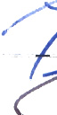  
   
   
   
   
   
 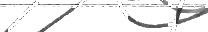  
   
   
 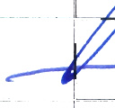  
   
   
 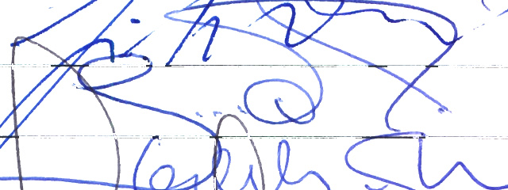  
 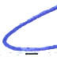  
 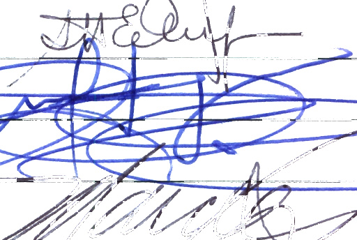  
 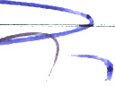  
   
   
 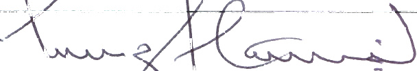  
 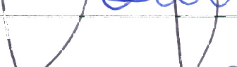  
   
   
 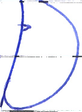  
 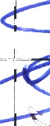  
 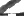  
   
   
   
   
   

* * * * *

Document Outline
================

-   [01 Relatorio final dos trabalhos da Comissao de juristas FINAL](relatorio.html#1)
-   [Assinaturas de aprovação Relatório Final](relatorio.html#480)

* * * * *
